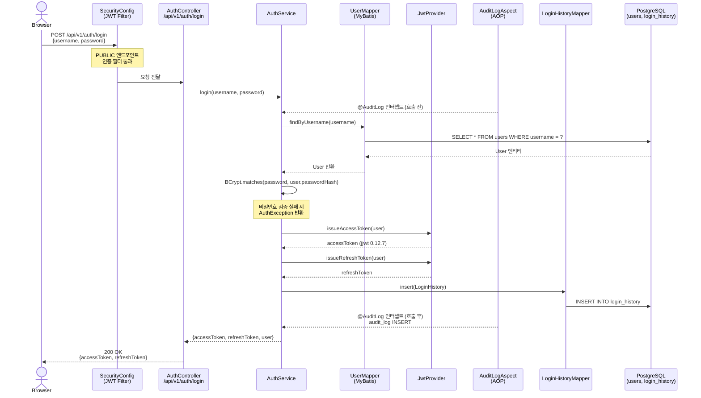
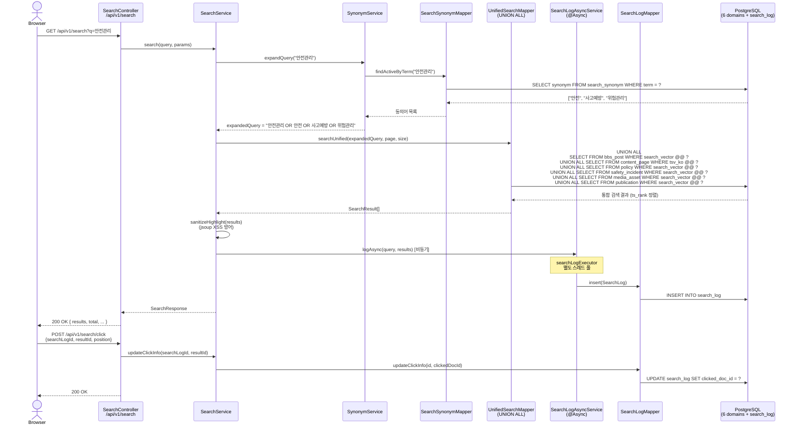
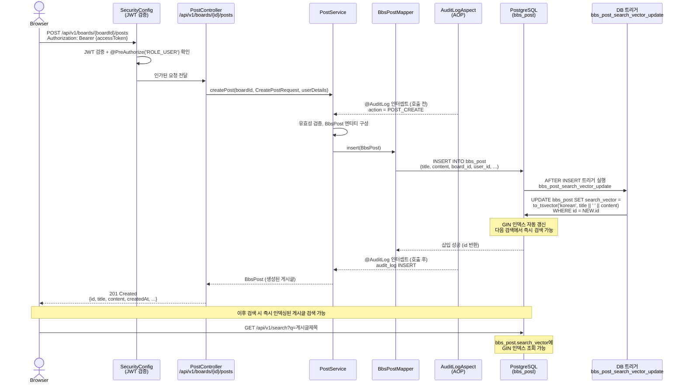
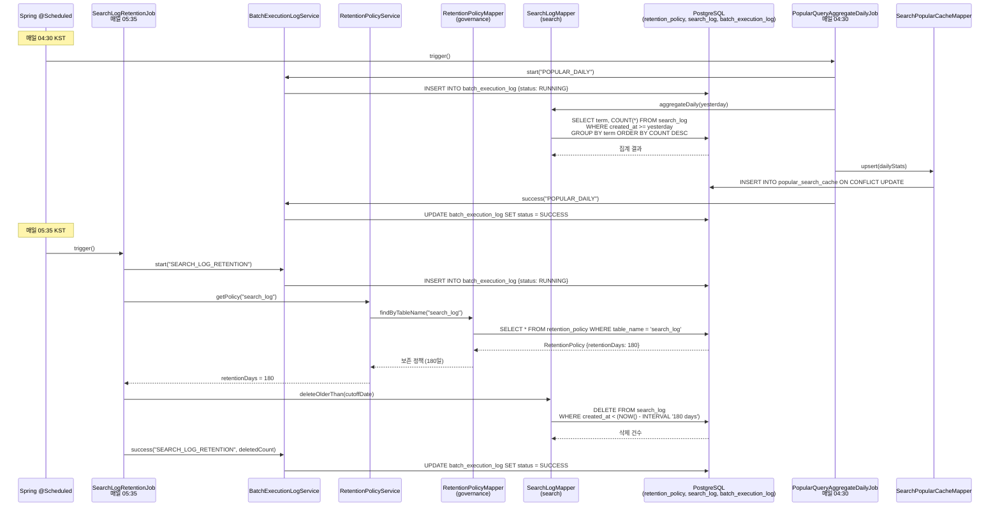
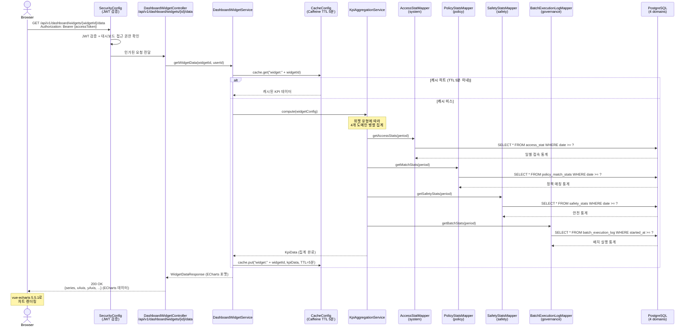
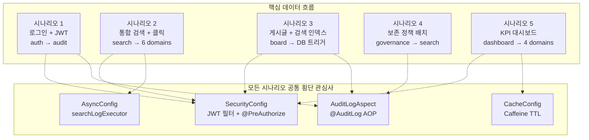

# iroum-cms 핵심 데이터 흐름 시나리오

> 최종 업데이트: 2026-05-07
> 근거 자료: Explore 에이전트 인벤토리 (2026-05-07)

이 문서는 iroum-cms의 5가지 핵심 데이터 흐름 시나리오를 Mermaid 시퀀스 다이어그램과 함께 상세히 설명합니다.

---

## 시나리오 1: 사용자 로그인 및 JWT 발급

### 흐름 다이어그램

### 설명

사용자가 로그인 요청을 보내면 `SecurityConfig`의 JWT 필터가 PUBLIC 엔드포인트임을 확인하고 인증 검사 없이 `AuthController`로 전달합니다. `AuthService`는 `UserMapper`를 통해 PostgreSQL의 `users` 테이블에서 사용자를 조회하고, BCrypt로 비밀번호를 검증합니다. 검증 성공 시 jjwt 0.12.7을 사용하여 액세스 토큰과 리프레시 토큰을 발급합니다.

`AuditLogAspect`가 `@AuditLog` AOP를 통해 AuthService 호출 전·후에 자동으로 `audit_log` 테이블에 로그인 이벤트를 적재합니다. 이 횡단 관심사는 Service 코드를 수정하지 않고 어노테이션만으로 동작합니다. 로그인 이력은 별도로 `login_history` 테이블에도 기록됩니다.

**관련 도메인**: auth, audit
**횡단 관심사**: `AuditLogAspect` (@AuditLog AOP), `SecurityConfig` (PUBLIC 허용 목록)

---

## 시나리오 2: 통합 검색 및 클릭 추적

### 흐름 다이어그램

### 설명

검색 요청이 들어오면 `SearchService`는 먼저 `SynonymService`를 통해 동의어를 확장합니다. 예를 들어 "안전관리"를 검색하면 `search_synonym` 테이블에서 관련 동의어를 조회하여 쿼리를 풍부화합니다. 확장된 쿼리는 `UnifiedSearchMapper`로 전달되어 PostgreSQL의 UNION ALL 쿼리를 실행합니다. 이 쿼리는 6개 도메인 테이블(게시글, 콘텐츠 페이지, 정책, 사고사례, 미디어, 발간자료)을 한 번에 검색합니다.

검색 결과는 jsoup을 사용하여 하이라이트 마크업의 XSS를 방어한 후 클라이언트에 반환됩니다. 동시에 `@Async` 어노테이션을 통해 `searchLogExecutor` 전용 스레드 풀에서 검색 로그가 비동기로 적재됩니다. 이를 통해 로그 적재가 검색 응답 시간에 영향을 주지 않습니다. 사용자가 특정 결과를 클릭하면 별도 API 호출로 클릭 추적이 이루어집니다.

**관련 도메인**: search, board, content, policy, safety, media (읽기 전용)
**횡단 관심사**: `AsyncConfig.searchLogExecutor` (비동기 처리), `SecurityConfig` (PUBLIC 엔드포인트)

---

## 시나리오 3: 게시글 작성 및 검색 인덱스 자동 갱신

### 흐름 다이어그램

### 설명

게시글 작성 요청은 JWT 필터에서 액세스 토큰을 검증하고, `@PreAuthorize`로 사용자 역할을 확인한 후 `PostController`에 도달합니다. `PostService`는 게시글 엔티티를 구성하여 `BbsPostMapper`를 통해 PostgreSQL에 삽입합니다.

가장 중요한 점은 PostgreSQL DB 트리거 `bbs_post_search_vector_update`가 INSERT 이후 자동으로 실행된다는 것입니다. 이 트리거는 `to_tsvector()` 함수를 사용하여 게시글 제목과 본문에서 한국어 전문 검색 벡터를 생성하고 `search_vector` 컬럼을 갱신합니다. GIN 인덱스가 이 컬럼에 걸려 있으므로, 게시글 저장 직후부터 통합 검색에서 해당 게시글을 찾을 수 있습니다. 별도의 인덱싱 잡이나 Elasticsearch 동기화 없이 DB 레벨에서 검색 인덱스가 자동 관리됩니다.

`AuditLogAspect`는 `PostService.createPost()` 호출 전·후에 POST_CREATE 이벤트를 `audit_log`에 기록합니다.

**관련 도메인**: board, auth, audit, search (간접 — 다음 검색에서 즉시 반영)
**횡단 관심사**: `AuditLogAspect` (@AuditLog), `SecurityConfig` (JWT + @PreAuthorize), PostgreSQL 트리거

---

## 시나리오 4: 데이터 보존 정책 자동 적용

### 흐름 다이어그램

### 설명

데이터 보존 정책 시나리오는 두 단계로 구성됩니다.

첫째, 매일 04:30에 `PopularQueryAggregateDailyJob`이 실행되어 전날의 검색 로그를 집계합니다. `search_log` 테이블에서 검색어별 빈도를 집계하여 `popular_search_cache` 테이블을 갱신(upsert)합니다. 이 결과가 `/api/v1/search/popular` 엔드포인트에서 반환되는 인기 검색어 데이터입니다.

둘째, 매일 05:35에 `SearchLogRetentionJob`이 실행되어 오래된 검색 로그를 삭제합니다. `governance` 도메인의 `retention_policy` 테이블에서 `search_log` 테이블의 보존 기간(예: 180일)을 조회하고, 해당 기간이 지난 레코드를 일괄 삭제합니다. 이 패턴은 governance 도메인의 단일 테이블(`retention_policy`)이 여러 도메인의 데이터 보존 기간을 중앙에서 통제하는 설계를 보여줍니다.

모든 배치 실행은 `BatchExecutionLogService`를 통해 `batch_execution_log` 테이블에 시작·완료 상태를 기록하며, 이 기록이 dashboard KPI 위젯의 거버넌스 통계로 집계됩니다.

**관련 도메인**: search, governance, dashboard (통계 집계)
**횡단 관심사**: Spring `@Scheduled`, `BatchExecutionLogService` (모든 배치 공통)

---

## 시나리오 5: KPI 대시보드 위젯 데이터 조회

### 흐름 다이어그램

### 설명

대시보드 위젯 데이터 조회는 Caffeine 캐시를 중심으로 동작합니다. 위젯 데이터 요청이 들어오면 `DashboardWidgetService`는 먼저 Caffeine 캐시에서 캐시 히트 여부를 확인합니다. TTL 5분 이내에 동일한 위젯 데이터가 요청된 경우 캐시에서 즉시 반환하여 DB 쿼리를 완전히 생략합니다.

캐시 미스 시 `KpiAggregationService`가 위젯 설정에 따라 4개 도메인(system, policy, safety, governance)의 통계 테이블을 집계합니다. 각 도메인의 Mapper는 해당 도메인 통계 테이블에서 데이터를 조회하고, 집계 결과는 ECharts 데이터 포맷(`series`, `xAxis`, `yAxis`)으로 변환됩니다. 이 포맷은 프론트엔드의 vue-echarts 7.0.3이 직접 소비합니다.

응답 데이터는 Caffeine 캐시에 저장(TTL 5분)되어 다음 5분 동안 동일 요청에 대해 DB 조회 없이 응답합니다. 이 캐싱 전략은 대시보드가 여러 관리자에 의해 동시에 조회될 때 PostgreSQL 부하를 크게 줄입니다.

**관련 도메인**: dashboard, system, policy, safety, governance
**횡단 관심사**: `CacheConfig` (Caffeine TTL 5분), `SecurityConfig` (JWT + 역할 확인)

---

## 데이터 흐름 요약

