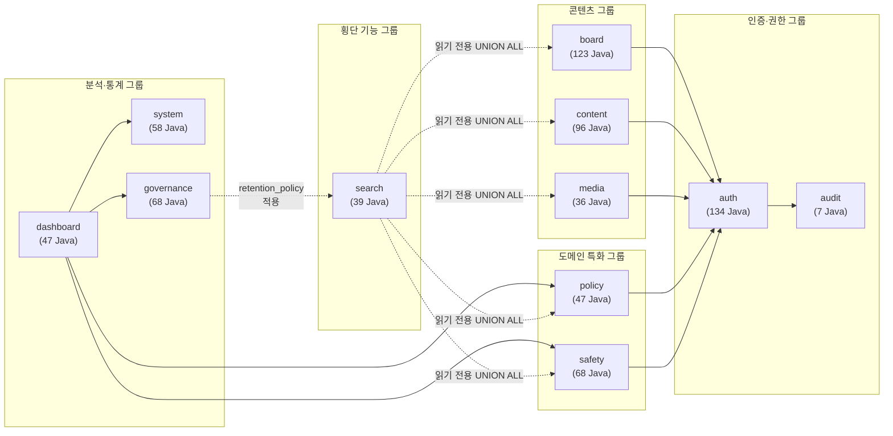

# iroum-cms 의존성 그래프

> 최종 업데이트: 2026-05-07
> 근거 자료: Explore 에이전트 인벤토리 (2026-05-07)

---

## 1. 도메인 간 의존성 매트릭스

행(Row): 의존하는 도메인 (caller) | 열(Column): 의존되는 도메인 (callee)

| Caller \ Callee | auth | audit | board | content | dashboard | governance | media | policy | safety | search | system |
|-----------------|------|-------|-------|---------|-----------|------------|-------|--------|--------|--------|--------|
| **auth**        | —    | ✓     | ✗     | ✗       | ✗         | ✗          | ✗     | ✗      | ✗      | ✗      | ✗      |
| **audit**       | ✗    | —     | ✗     | ✗       | ✗         | ✗          | ✗     | ✗      | ✗      | ✗      | ✗      |
| **board**       | ✓    | ✗     | —     | ✗       | ✗         | ✗          | △     | ✗      | ✗      | ✗      | ✗      |
| **content**     | ✓    | ✗     | ✗     | —       | ✗         | ✗          | △     | ✗      | ✗      | ✗      | ✗      |
| **dashboard**   | ✗    | ✗     | ✗     | ✗       | —         | ✓          | ✗     | ✓      | ✓      | ✗      | ✓      |
| **governance**  | ✗    | ✗     | ✗     | ✗       | ✗         | —          | ✗     | ✗      | ✗      | ✓ †    | ✗      |
| **media**       | ✓    | ✗     | ✗     | ✗       | ✗         | ✗          | —     | ✗      | ✗      | ✗      | ✗      |
| **policy**      | ✓    | ✗     | ✗     | ✗       | ✗         | ✗          | ✗     | —      | ✗      | ✗      | ✗      |
| **safety**      | ✓    | ✗     | ✗     | ✗       | ✗         | ✗          | ✗     | ✗      | —      | ✗      | ✗      |
| **search**      | ✗    | ✗     | ✓ R   | ✓ R     | ✗         | ✗          | ✓ R   | ✓ R    | ✓ R    | —      | ✗      |
| **system**      | ✗    | ✗     | ✗     | ✗       | ✗         | ✗          | ✗     | ✗      | ✗      | ✗      | —      |

**범례:**
- ✓ = 직접 의존 (코드 레벨 호출)
- △ = 간접 연계 (파일 처리 등 가능성)
- ✓ R = 읽기 전용 의존 (UNION ALL SQL 읽기)
- ✓ † = 정책 적용 (retention_policy 테이블이 search 등 다중 도메인 데이터를 보존 기간 기준으로 통제)
- ✗ = 의존 없음
- — = 자기 자신

---

## 2. Mermaid 의존성 다이어그램

### 2.1 도메인 간 의존성 (직접 + 읽기 전용)



### 2.2 횡단 관심사 의존성

```mermaid
graph TB
    subgraph CrossCutting["횡단 관심사 (config/)"]
        AuditAOP["AuditLogAspect\n@AuditLog AOP"]
        SecurityCfg["SecurityConfig\n@PreAuthorize RBAC"]
        GlobalEx["GlobalExceptionHandler\n@ControllerAdvice"]
        AsyncCfg["AsyncConfig\nsearchLogExecutor"]
        CacheCfg["CacheConfig\nCaffeine TTL 5분"]
    end

    subgraph AllDomains["모든 도메인 (Service 계층)"]
        authSvc["auth Service"]
        boardSvc["board Service"]
        contentSvc["content Service"]
        dashboardSvc["dashboard Service"]
        govSvc["governance Service"]
        mediaSvc["media Service"]
        policySvc["policy Service"]
        safetySvc["safety Service"]
        searchSvc["search Service"]
        systemSvc["system Service"]
    end

    AuditAOP -.->|"@AuditLog 어노테이션\n비침습 횡단"| authSvc
    AuditAOP -.->|"@AuditLog 어노테이션"| boardSvc
    AuditAOP -.->|"@AuditLog 어노테이션"| contentSvc
    AuditAOP -.->|"@AuditLog 어노테이션"| dashboardSvc
    AuditAOP -.->|"@AuditLog 어노테이션"| govSvc
    AuditAOP -.->|"@AuditLog 어노테이션"| mediaSvc
    AuditAOP -.->|"@AuditLog 어노테이션"| policySvc
    AuditAOP -.->|"@AuditLog 어노테이션"| safetySvc
    AuditAOP -.->|"@AuditLog 어노테이션"| searchSvc
    AuditAOP -.->|"@AuditLog 어노테이션"| systemSvc

    SecurityCfg -.->|"@PreAuthorize\nMethod Security"| authSvc
    SecurityCfg -.->|"@PreAuthorize"| boardSvc
    SecurityCfg -.->|"@PreAuthorize"| contentSvc

    GlobalEx -.->|"@ControllerAdvice\n예외 매핑"| authSvc
    GlobalEx -.->|"@ControllerAdvice"| boardSvc

    AsyncCfg -->|"searchLogExecutor"| searchSvc
    CacheCfg -->|"Caffeine TTL"| dashboardSvc
```



---

## 3. 외부 라이브러리 의존성

### 3.1 백엔드 (`backend/build.gradle.kts`)

| 라이브러리 | 버전 | 역할 |
|-----------|------|------|
| Spring Boot | 3.5.9 | 웹 프레임워크, 의존성 주입, 트랜잭션 |
| MyBatis Spring Boot Starter | 3.0.4 | ORM (XML Mapper 기반 SQL) |
| jjwt-api / jjwt-impl / jjwt-jackson | 0.12.7 | JWT 토큰 생성·검증 |
| Flyway | — | 데이터베이스 마이그레이션 |
| Apache POI | 5.2.5 | Excel/Word 문서 처리 |
| Apache Tika | 2.9.2 | 파일 MIME 타입 감지 및 콘텐츠 추출 |
| Caffeine | 3.1.8 | JVM 인메모리 캐시 |
| Micrometer-Prometheus | — | 메트릭 수집 및 Prometheus 연동 |
| jsoup | 1.17.2 | HTML 파싱 및 XSS 방어 |
| PostgreSQL JDBC Driver | — | PostgreSQL 연결 |
| Spring Security | (Boot 종속) | 인증·인가 프레임워크 |
| Spring AOP | (Boot 종속) | AOP 횡단 관심사 |

### 3.2 프론트엔드 Admin SPA (`frontend/admin/package.json`)

| 라이브러리 | 버전 | 역할 |
|-----------|------|------|
| Vue | 3.5.13 | 프레임워크 |
| vue-router | 4.4.5 | SPA 라우팅 |
| Pinia | 2.2.6 | 상태 관리 |
| Element Plus | 2.8.8 | UI 컴포넌트 라이브러리 |
| ECharts | 5.5.1 | 차트 렌더링 |
| vue-echarts | 7.0.3 | ECharts Vue 래퍼 |
| axios | 1.7.9 | HTTP 클라이언트 |
| vue-i18n | 9.14.1 | 다국어 지원 (ko, en) |
| TailwindCSS | 3.4.16 | 유틸리티 CSS |
| Vite | 6.0.3 | 빌드 도구 (lazy code splitting) |
| vue-tsc | 2.1.10 | TypeScript 타입 체크 |

---

## 4. 순환 의존성 검출

Explore 에이전트 인벤토리 분석 결과, **순환 의존성이 감지되지 않았습니다.**

근거:
- `auth` → `audit` (단방향)
- `board/content/media/policy/safety` → `auth` (단방향, auth는 board 등을 참조하지 않음)
- `search` → `board/content/policy/safety/media` (읽기 전용 단방향)
- `dashboard` → `system/policy/safety/governance` (단방향, 역방향 참조 없음)
- `governance` → `search` (retention_policy 적용, 단방향 정책 통제)

---

## 5. 횡단 의존성 (Cross-Cutting) 상세

### 5.1 AuditLogAspect → 모든 Service (AOP)

```
위치: backend/src/main/java/kr/co/ircp/cms/config/AuditLogAspect.java
적용 대상: @AuditLog 어노테이션이 붙은 모든 Service 메서드
동작: 메서드 호출 전·후 audit_log 테이블 INSERT
특징: 비침습적 — Service 코드를 수정하지 않고 어노테이션만으로 활성화
```

### 5.2 SecurityConfig → 모든 Controller (@PreAuthorize)

```
위치: backend/src/main/java/kr/co/ircp/cms/config/SecurityConfig.java
적용 대상: 모든 Controller의 @PreAuthorize 어노테이션
동작: JWT 토큰 검증 → 사용자 역할 추출 → 메서드 수준 RBAC 인가
패턴: STATELESS 세션 정책 + JWT 필터 체인
```

### 5.3 GlobalExceptionHandler → 모든 Controller (@ControllerAdvice)

```
위치: backend/src/main/java/kr/co/ircp/cms/config/GlobalExceptionHandler.java
적용 대상: 모든 Controller에서 발생하는 예외
동작: 예외 유형별 HTTP 상태 코드 매핑 + 표준 오류 응답 반환
```

### 5.4 search → 6개 도메인 (읽기 전용 UNION ALL)

```
패턴: UnifiedSearchMapper.searchUnified()가 6개 도메인 테이블을 UNION ALL로 조회
대상: bbs_post, content_page, policy, safety_incident, media_asset, publication
SQL 전략: to_tsvector(tsv_ko) + pg_trgm GIN 인덱스 병행 사용
단방향: search는 6개 도메인에서 읽기만 하며 쓰기 없음
```

### 5.5 governance.retention_policy → 다중 도메인 테이블

```
패턴: retention_policy 단일 테이블이 여러 도메인의 데이터 보존 기간 정의
적용: SearchLogRetentionJob이 retention_policy를 읽어 search_log 삭제
확장: 다른 도메인 배치 잡도 동일 패턴으로 보존 정책 참조 가능
```

### 5.6 dashboard.KPI → 4개 도메인 통계 집계

```
패턴: KpiAggregationService.compute()가 4개 도메인 통계 테이블을 집계
대상: system.access_stat, policy.match_stats, safety.safety_stats, governance.batch_log
캐시: Caffeine TTL 5분으로 반복 집계 쿼리 방지
```

---

## 6. 데이터베이스 레벨 의존성

PostgreSQL 데이터베이스에서 도메인 테이블 간의 물리적 의존 관계는 다음과 같습니다.

### 6.1 외래 키 패턴

- `bbs_post.user_id` → `users.id` (board → auth)
- `audit_log.user_id` → `users.id` (audit → auth)
- `media_asset.uploaded_by` → `users.id` (media → auth)
- `policy.organization_id` → `organizations.id` (policy → auth.organizations)

### 6.2 도메인 간 FK 없는 통합 패턴 (UNION ALL)

search 도메인은 각 도메인 테이블의 `search_vector` 컬럼을 직접 읽는 방식으로, 외래 키 없이 SQL 수준 통합을 구현합니다. 이는 도메인 간 DB 레벨 결합을 최소화하는 설계입니다.

---

## 7. 프론트엔드 → 백엔드 API 의존성

Admin SPA의 19개 API 래퍼 모듈이 백엔드 도메인 API에 매핑되는 구조입니다.

| API 래퍼 모듈 | 대응 백엔드 도메인 | 주요 엔드포인트 접두사 |
|------------|----------------|------------------|
| `api/audit.ts` | audit | `/api/v1/audit/` |
| `api/auth.ts` | auth | `/api/v1/auth/` |
| `api/board.ts` | board | `/api/v1/boards/` |
| `api/content.ts` | content | `/api/v1/pages/`, `/menus/` |
| `api/dashboard.ts` | dashboard | `/api/v1/dashboard/` |
| `api/faq.ts` | board.faq | `/api/v1/faqs/` |
| `api/governance.ts` | governance | `/api/v1/governance/` |
| `api/media.ts` | media | `/api/v1/media/` |
| `api/me.ts` | auth | `/api/v1/auth/me` |
| `api/organizations.ts` | auth | `/api/v1/organizations/` |
| `api/policy.ts` | policy | `/api/v1/policies/` |
| `api/publication.ts` | board.publication | `/api/v1/publications/` |
| `api/qna.ts` | board.qna | `/api/v1/qnas/` |
| `api/roles.ts` | auth | `/api/v1/roles/` |
| `api/safety.ts` | safety | `/api/v1/safety/` |
| `api/search.ts` | search | `/api/v1/search/` |
| `api/survey.ts` | board.survey | `/api/v1/surveys/` |
| `api/system.ts` | system | `/api/v1/system/` |
| `api/users.ts` | auth | `/api/v1/users/` |

---

## 8. Pinia 스토어 → API 래퍼 의존성

| Pinia 스토어 | 사용하는 API 래퍼 |
|------------|----------------|
| `auth` | `api/auth.ts`, `api/me.ts` |
| `content` | `api/content.ts`, `api/media.ts` |
| `dashboardStore` | `api/dashboard.ts` |
| `governanceStore` | `api/governance.ts` |
| `policyStore` | `api/policy.ts` |
| `safetyStore` | `api/safety.ts` |
| `searchStore` | `api/search.ts` |
| `system` | `api/system.ts` |

---

## 9. 의존성 관리 원칙

### 9.1 단방향 의존성 원칙

모든 도메인 간 의존성이 단방향으로 유지됩니다. 순환 의존성이 없으며, 상위 도메인(dashboard)이 하위 도메인(system, policy, safety, governance)의 통계를 읽는 방향으로만 의존합니다.

### 9.2 읽기 전용 통합 원칙

`search` 도메인은 다른 도메인 데이터를 절대 수정하지 않습니다. UNION ALL SQL로 여러 도메인의 `search_vector`를 읽기만 하며, 이는 도메인 자율성을 보장합니다.

### 9.3 횡단 관심사 분리 원칙

감사 로그, 보안 인가, 예외 처리, 캐시는 `config/` 패키지에 집중되어 도메인 코드에 직접 포함되지 않습니다. `@AuditLog`, `@PreAuthorize`, `@Cacheable` 어노테이션을 통한 선언적 적용으로 관심사를 분리합니다.

### 9.4 데이터베이스 레벨 자율성 원칙

각 도메인은 자체 테이블의 `search_vector`를 DB 트리거로 자율 관리합니다. search 도메인이 각 도메인의 인덱스 관리 방식에 의존하지 않으며, 각 도메인이 자신의 검색 인덱스를 독립적으로 제어합니다.
