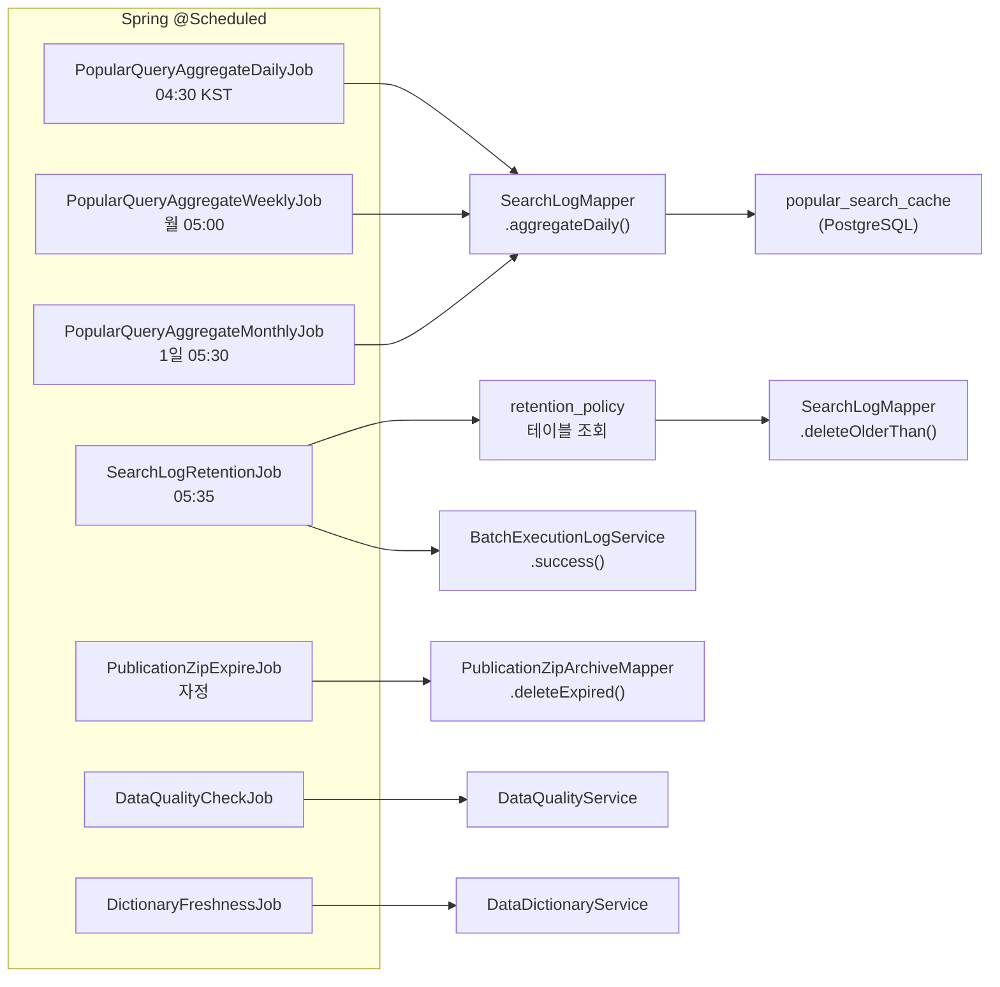

# iroum-cms 진입점 카탈로그 및 REST API 인덱스

> 최종 업데이트: 2026-05-07
> 근거 자료: Explore 에이전트 인벤토리 (2026-05-07)

---

## 1. 백엔드 진입점

### 1.1 애플리케이션 메인

```
backend/src/main/java/kr/co/ircp/cms/IroumCmsApplication.java
```

- `main()` 메서드: Spring Boot 애플리케이션 부트스트랩
- `@SpringBootApplication` 선언
- `SpringApplication.run(IroumCmsApplication.class, args)` 실행

### 1.2 설정 파일

```
backend/src/main/resources/application.yml
```

- 활성 프로파일: `local`, `prod`
- 데이터소스(PostgreSQL), MyBatis, JWT, 캐시, 비동기, Flyway 설정
- Prometheus 메트릭 엔드포인트 설정

### 1.3 Flyway 마이그레이션 (V1~V22, V11 누락)

```
backend/src/main/resources/db/migration/
```

| 마이그레이션 | 파일명 패턴 | 대상 도메인 | 주요 내용 |
|------------|-----------|-----------|---------|
| V1 | init_baseline | 공통 | PostgreSQL 확장: `pgcrypto`, `pg_trgm`, `uuid-ossp` |
| V2 | auth_schema | auth | `users`, `roles`, `permissions`, `login_history` |
| V3 | audit_log | audit | `audit_log`, `personal_data_access_log` |
| V4 | seed_admin_user | seed | 초기 관리자 계정 시드 데이터 |
| V5 | organization_schema | auth | `organizations` 테이블 |
| V6 | permissions_schema | auth | `permission_group` 테이블 |
| V7 | permission_change_history | auth | `permission_change_history` 테이블 |
| V8 | verification_schema | auth | `verification` 본인인증 테이블 |
| V9 | personal_data_access_log | auth/audit | `personal_data_access_log` 보완 |
| V10 | board_schema | board | `bbs_post`, `bbs_comment`, `bbs_attachment`, `faq`, `qna`, `survey` 일부 |
| V11 | (누락) | — | — |
| V12 | media_schema | media | `media_asset`, `media_collection` 등 |
| V13 | content_schema | content | `content_page`, `menu`, `banner`, `popup`, `template`, `translation`, `seo_meta` |
| V14 | system_schema | system | `system_code`, `system_setting`, `access_log`, `access_stat` |
| V15 | safety_schema | safety | `safety_incident`, `safety_checklist`, `safety_guideline` 등 |
| V16 | policy_schema | policy | `policy`, `policy_match`, `policy_subscription`, `policy_notification` |
| V17 | dashboard_schema | dashboard | `dashboard_layout`, `dashboard_widget`, `widget_config` |
| V18 | governance_schema | governance | `data_dictionary`, `retention_policy`, `data_quality_rule`, `batch_execution_log` |
| V19 | publication_schema | board | `publication`, `publication_category`, `publication_meta`, `publication_zip_archive` |
| V20 | survey_schema | board | `survey`, `survey_question`, `survey_answer`, `survey_response` |
| V21 | qna_notification_schema | board | `qna_notification_log`, `qna_notification_optout` |
| V22 | search_schema | search | `search_log`, `popular_search_cache`, `search_synonym` |

---

## 2. HTTP 엔드포인트 인덱스

기본 URL 접두사: `/api/v1`

### 2.1 auth 도메인 (인증·권한)

| 경로 | 메서드 | 접근 | 설명 |
|------|--------|------|------|
| `/auth/login` | POST | PUBLIC | 로그인 및 JWT 발급 |
| `/auth/refresh` | POST | PUBLIC | 액세스 토큰 갱신 |
| `/auth/logout` | POST | AUTH | 로그아웃 및 토큰 폐기 |
| `/auth/me` | GET | AUTH | 현재 로그인 사용자 정보 |
| `/users` | GET | ADMIN | 사용자 목록 조회 |
| `/users` | POST | ADMIN | 사용자 생성 |
| `/users/{id}` | GET/PUT/DELETE | ADMIN | 사용자 상세·수정·삭제 |
| `/roles` | GET | ADMIN | 역할 목록 조회 |
| `/roles` | POST | ADMIN | 역할 생성 |
| `/roles/{id}` | GET/PUT/DELETE | ADMIN | 역할 상세·수정·삭제 |
| `/organizations` | GET/POST | ADMIN | 조직 목록·생성 |
| `/organizations/{id}` | GET/PUT/DELETE | ADMIN | 조직 상세·수정·삭제 |
| `/permissions` | GET | ADMIN | 권한 목록 조회 |
| `/verification` | POST | AUTH | 본인인증 요청 |

### 2.2 board 도메인 (게시판)

| 경로 | 메서드 | 접근 | 설명 |
|------|--------|------|------|
| `/boards` | GET | AUTH | 게시판 목록 |
| `/boards` | POST | ADMIN | 게시판 생성 |
| `/boards/{id}` | GET/PUT/DELETE | AUTH/ADMIN | 게시판 상세·수정·삭제 |
| `/boards/{boardId}/posts` | GET | PUBLIC/AUTH | 게시글 목록 |
| `/boards/{boardId}/posts` | POST | AUTH | 게시글 작성 |
| `/boards/{boardId}/posts/{id}` | GET/PUT/DELETE | AUTH | 게시글 상세·수정·삭제 |
| `/boards/{boardId}/posts/{id}/comments` | GET/POST | AUTH | 댓글 목록·작성 |
| `/boards/{boardId}/posts/{id}/attachments` | GET/POST | AUTH | 첨부 목록·업로드 |
| `/faqs` | GET | PUBLIC | FAQ 목록 |
| `/faqs` | POST | ADMIN | FAQ 등록 |
| `/faqs/{id}` | GET/PUT/DELETE | PUBLIC/ADMIN | FAQ 상세·수정·삭제 |
| `/qnas` | GET | AUTH | Q&A 목록 |
| `/qnas` | POST | AUTH | Q&A 등록 |
| `/qnas/{id}` | GET/PUT/DELETE | AUTH | Q&A 상세·수정·삭제 |
| `/publications` | GET | PUBLIC | 발간자료 목록 |
| `/publications` | POST | ADMIN | 발간자료 등록 |
| `/publications/{id}` | GET/PUT/DELETE | PUBLIC/ADMIN | 발간자료 상세·수정·삭제 |
| `/publications/categories` | GET/POST | PUBLIC/ADMIN | 발간자료 분류 관리 |
| `/surveys` | GET/POST | AUTH | 설문 목록·생성 |
| `/surveys/{id}` | GET/PUT/DELETE | AUTH/ADMIN | 설문 상세·수정·삭제 |
| `/surveys/{id}/responses` | POST | AUTH | 설문 응답 제출 |

### 2.3 content 도메인 (콘텐츠 관리)

| 경로 | 메서드 | 접근 | 설명 |
|------|--------|------|------|
| `/pages` | GET | PUBLIC | 페이지 목록 |
| `/pages` | POST | ADMIN | 페이지 생성 |
| `/pages/{id}` | GET/PUT/DELETE | PUBLIC/ADMIN | 페이지 상세·수정·삭제 |
| `/menus` | GET | PUBLIC | 메뉴 목록 (트리 구조) |
| `/menus` | POST | ADMIN | 메뉴 생성 |
| `/menus/{id}` | GET/PUT/DELETE | PUBLIC/ADMIN | 메뉴 상세·수정·삭제 |
| `/banners` | GET | PUBLIC | 배너 목록 |
| `/banners` | POST | ADMIN | 배너 생성 |
| `/popups` | GET | PUBLIC | 팝업 목록 |
| `/popups` | POST | ADMIN | 팝업 생성 |
| `/templates` | GET/POST | ADMIN | 템플릿 목록·생성 |
| `/content/translations` | GET/PUT | ADMIN | 다국어 콘텐츠 관리 |

### 2.4 dashboard 도메인 (대시보드)

| 경로 | 메서드 | 접근 | 설명 |
|------|--------|------|------|
| `/dashboard/layouts` | GET/POST | AUTH | 레이아웃 목록·생성 |
| `/dashboard/layouts/{id}` | GET/PUT/DELETE | AUTH | 레이아웃 상세·수정·삭제 |
| `/dashboard/widgets` | GET/POST | AUTH | 위젯 목록·생성 |
| `/dashboard/widgets/{id}/data` | GET | AUTH | 위젯 데이터 조회 (Caffeine 캐시) |
| `/dashboard/export` | GET | AUTH | 대시보드 데이터 내보내기 |

### 2.5 governance 도메인 (데이터 거버넌스)

| 경로 | 메서드 | 접근 | 설명 |
|------|--------|------|------|
| `/governance/dictionary` | GET/POST | ADMIN | 데이터 사전 목록·등록 |
| `/governance/dictionary/{id}` | GET/PUT/DELETE | ADMIN | 데이터 사전 상세·수정·삭제 |
| `/governance/retention-policies` | GET/POST | ADMIN | 보존 정책 목록·생성 |
| `/governance/quality` | GET/POST | ADMIN | 품질 규칙 목록·생성 |
| `/governance/quality/check` | POST | ADMIN | 품질 검사 수동 실행 |
| `/governance/stats` | GET | AUTH | 거버넌스 통계 |

### 2.6 media 도메인 (미디어 자산)

| 경로 | 메서드 | 접근 | 설명 |
|------|--------|------|------|
| `/media` | GET | AUTH | 미디어 자산 목록 |
| `/media` | POST | AUTH | 미디어 업로드 |
| `/media/{id}` | GET/PUT/DELETE | AUTH | 미디어 상세·수정·삭제 |
| `/media/collections` | GET/POST | AUTH | 미디어 컬렉션 관리 |

### 2.7 policy 도메인 (정책)

| 경로 | 메서드 | 접근 | 설명 |
|------|--------|------|------|
| `/policies` | GET | PUBLIC | 정책 목록 |
| `/policies` | POST | ADMIN | 정책 등록 |
| `/policies/{id}` | GET/PUT/DELETE | PUBLIC/ADMIN | 정책 상세·수정·삭제 |
| `/policies/match` | POST | AUTH | 사용자-정책 매칭 실행 |
| `/policies/{id}/subscribe` | POST/DELETE | AUTH | 구독·구독 취소 |

### 2.8 safety 도메인 (안전 관리)

| 경로 | 메서드 | 접근 | 설명 |
|------|--------|------|------|
| `/safety/incidents` | GET/POST | AUTH | 사고사례 목록·등록 |
| `/safety/incidents/{id}` | GET/PUT/DELETE | AUTH | 사고사례 상세·수정·삭제 |
| `/safety/checklists` | GET/POST | AUTH | 체크리스트 목록·생성 |
| `/safety/checklists/{id}/items` | GET/PUT | AUTH | 체크리스트 항목 조회·갱신 |
| `/safety/guidelines` | GET/POST | ADMIN | 안전 지침 목록·등록 |

### 2.9 search 도메인 (통합 검색)

| 경로 | 메서드 | 접근 | 설명 |
|------|--------|------|------|
| `/search` | GET | PUBLIC | 통합 검색 (6 도메인 UNION ALL) |
| `/search/autocomplete` | GET | PUBLIC | 자동완성 제안 |
| `/search/popular` | GET | PUBLIC | 인기 검색어 목록 |
| `/search/click` | POST | PUBLIC | 검색 결과 클릭 추적 |
| `/search/synonyms` | GET | ADMIN | 동의어 목록 |
| `/search/synonyms` | POST | ADMIN | 동의어 등록 |
| `/search/synonyms/{id}` | PUT/DELETE | ADMIN | 동의어 수정·삭제 |
| `/search/logs` | GET | ADMIN | 검색 로그 조회 |
| `/search/stats` | GET | ADMIN | 검색 통계 |

### 2.10 system 도메인 (시스템 관리)

| 경로 | 메서드 | 접근 | 설명 |
|------|--------|------|------|
| `/system/codes` | GET/POST | ADMIN | 공통 코드 목록·등록 |
| `/system/codes/{id}` | GET/PUT/DELETE | ADMIN | 공통 코드 상세·수정·삭제 |
| `/system/settings` | GET/PUT | ADMIN | 시스템 설정 조회·수정 |
| `/system/access-logs` | GET | ADMIN | 접근 로그 목록 |
| `/system/stats` | GET | ADMIN | 시스템 통계 |
| `/system/maintenance` | GET/PUT | ADMIN | 유지보수 모드 상태·전환 |

### 2.11 audit 도메인 (감사 로그)

| 경로 | 메서드 | 접근 | 설명 |
|------|--------|------|------|
| `/audit/logs` | GET | ADMIN | 감사 로그 목록 (페이지네이션) |
| `/audit/logs/{id}` | GET | ADMIN | 감사 로그 상세 |

---

## 3. 접근 수준 분류

| 접근 수준 | 설명 | 해당 엔드포인트 |
|---------|------|--------------|
| **PUBLIC** | 인증 불필요 | `/auth/login`, `/auth/refresh`, `/search`, `/search/autocomplete`, `/search/popular`, `/search/click`, `/faqs (GET)`, `/publications (GET)`, `/policies (GET)`, `/pages (GET)`, `/menus (GET)`, `/banners (GET)`, `/popups (GET)` |
| **AUTH** | 로그인 사용자 | 게시글 작성, 댓글, Q&A, 설문 응답, 대시보드, 미디어 업로드, 정책 구독 등 대부분 |
| **ADMIN** | 관리자 역할 필요 | 사용자·역할·조직 관리, 시스템 설정, 감사 로그, 공통 코드, 거버넌스, 검색 동의어·통계 |

---

## 4. 배치 잡 진입점 (Cron)

### 4.1 search 도메인 배치

| 잡 클래스 | 스케줄 | 역할 |
|---------|--------|------|
| `PopularQueryAggregateDailyJob` | 매일 04:30 KST | 일별 인기 검색어 집계 → popular_search_cache 갱신 |
| `PopularQueryAggregateWeeklyJob` | 매주 월요일 05:00 | 주별 인기 검색어 집계 |
| `PopularQueryAggregateMonthlyJob` | 매월 1일 05:30 | 월별 인기 검색어 집계 |
| `SearchLogRetentionJob` | 매일 05:35 | retention_policy 기반 오래된 search_log 삭제 |

### 4.2 board 도메인 배치

| 잡 클래스 | 스케줄 | 역할 |
|---------|--------|------|
| `PublicationZipExpireJob` | 매일 자정 (00:00) | 만료된 발간자료 ZIP 아카이브 삭제 |

### 4.3 governance 도메인 배치

| 잡 클래스 | 스케줄 | 역할 |
|---------|--------|------|
| `DataQualityCheckJob` | (설정값) | 데이터 품질 규칙 정기 검사 |
| `DictionaryFreshnessJob` | (설정값) | 데이터 사전 신선도 검사 |

### 배치 잡 의존성 흐름



---

## 5. 프론트엔드 진입점

### 5.1 Admin SPA

```
frontend/admin/src/main.ts     — Vue 앱 인스턴스 생성, Pinia/Router/i18n 등록
frontend/admin/src/App.vue     — 루트 컴포넌트, RouterView 마운트
frontend/admin/src/router/     — 15개 view 도메인 라우트 설정
frontend/admin/src/stores/     — 8개 Pinia 스토어 (auth, content, dashboardStore, ...)
frontend/admin/src/api/        — 19개 axios 기반 API 래퍼 모듈
frontend/admin/src/views/      — 15개 view 도메인 페이지 컴포넌트
frontend/admin/src/locales/    — ko.json, en.json (vue-i18n)
```

**Admin SPA 15개 View 도메인:**

| view 도메인 | 대응 백엔드 도메인 |
|------------|----------------|
| account | auth (자기 계정 관리) |
| audit | audit |
| auth | auth (로그인/로그아웃) |
| board | board |
| content | content |
| dashboard | dashboard |
| governance | governance |
| media | media |
| organizations | auth.organizations |
| policy | policy |
| roles | auth.roles |
| safety | safety |
| search | search |
| system | system |
| users | auth.users |

### 5.2 Public SPA

```
frontend/public/src/main.ts    — Vue 앱 인스턴스 생성
frontend/public/src/App.vue    — 루트 컴포넌트
frontend/public/src/router/    — 공개 페이지 라우트
```

---

## 6. 빌드 및 배포 진입점

### 6.1 백엔드 빌드

```
backend/build.gradle.kts       — Gradle Kotlin DSL 빌드 스크립트 (Spring Boot 3.5.9)
```

| 명령어 | 역할 |
|--------|------|
| `./gradlew bootRun` | 로컬 개발 서버 실행 |
| `./gradlew bootJar` | 실행 가능한 JAR 패키징 |
| `./gradlew test` | 단위·통합 테스트 실행 |
| `./gradlew clean build` | 전체 클린 빌드 |

### 6.2 프론트엔드 빌드

```
frontend/admin/package.json    — Admin SPA 의존성 및 스크립트
frontend/public/package.json   — Public SPA 의존성 및 스크립트
```

| 명령어 | 역할 |
|--------|------|
| `pnpm -F admin build` | Admin SPA 프로덕션 빌드 |
| `pnpm -F public build` | Public SPA 프로덕션 빌드 |
| `pnpm -F admin dev` | Admin SPA 개발 서버 실행 |
| `pnpm -F public dev` | Public SPA 개발 서버 실행 |

### 6.3 Docker 배포

```
deploy/Dockerfile.backend      — JDK17 빌드 → JRE17 실행 이미지
deploy/Dockerfile.frontend     — Node22 빌드 → Nginx 서빙 이미지
docker-compose.yml             — 멀티 서비스 구성 (backend + frontend + PostgreSQL)
```

| 명령어 | 역할 |
|--------|------|
| `docker-compose up` | 전체 스택 실행 |
| `docker-compose up backend` | 백엔드만 실행 |
| `docker-compose build` | 이미지 재빌드 |

### 6.4 CI 진입점

```
.github/workflows/ci.yml       — 풀 리퀘스트 CI (빌드 + 테스트)
.github/workflows/lint.yml     — 린트 검사 CI
```

| CI 파이프라인 | 역할 |
|------------|------|
| `ci.yml` | `./gradlew test` + 프론트엔드 빌드 검증 |
| `lint.yml` | 코드 스타일·린트 검사 |
