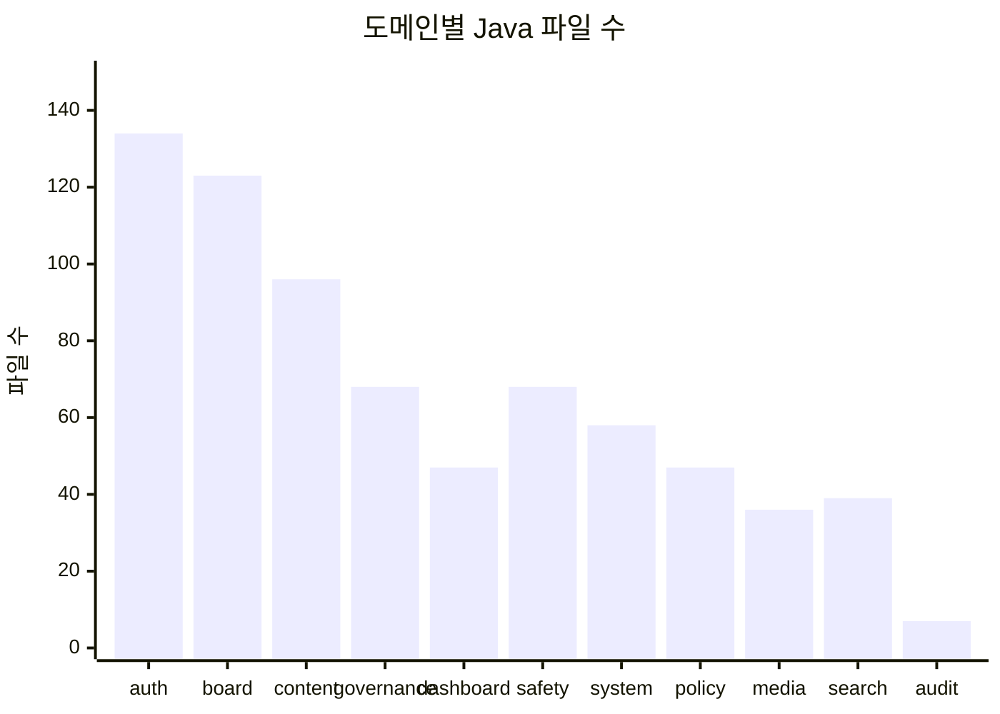

# iroum-cms 도메인 모듈 카탈로그

> 최종 업데이트: 2026-05-07
> 근거 자료: Explore 에이전트 인벤토리 (2026-05-07)

이 문서는 백엔드 11개 도메인 모듈의 상세 카탈로그입니다. 모든 도메인은 `backend/src/main/java/kr/co/ircp/cms/domain/{name}/` 경로에 위치합니다.

---

## 1. auth — 인증·권한 핵심 도메인

- **위치**: `backend/src/main/java/kr/co/ircp/cms/domain/auth/`
- **Java 파일**: 134개 | **Mapper**: 11개 | **테스트**: 22개
- **마이그레이션**: V2 (auth 기본), V5 (organizations), V6 (permission_group), V7 (permission_change_history), V8 (verification), V9 (personal_data_access_log)

### 책임
- JWT 액세스 토큰 및 리프레시 토큰 발급·갱신·폐기
- 4단계 RBAC (슈퍼관리자 → 기관관리자 → 운영자 → 일반사용자)
- 본인인증(verification) 처리
- 조직(organization) 계층 관리
- 역할(role)·권한(permission) 그룹 생성 및 변경 이력 추적
- 로그인 이력(login_history) 기록

### 주요 Controller 및 엔드포인트

| 엔드포인트 | 메서드 | 역할 |
|-----------|--------|------|
| `/api/v1/auth/login` | POST | 로그인, JWT 발급 |
| `/api/v1/auth/refresh` | POST | 액세스 토큰 갱신 |
| `/api/v1/auth/logout` | POST | 로그아웃, 토큰 폐기 |
| `/api/v1/auth/me` | GET | 현재 사용자 정보 |
| `/api/v1/users` | GET/POST | 사용자 목록·생성 |
| `/api/v1/users/{id}` | GET/PUT/DELETE | 사용자 상세·수정·삭제 |
| `/api/v1/roles` | GET/POST | 역할 목록·생성 |
| `/api/v1/roles/{id}` | GET/PUT/DELETE | 역할 상세·수정·삭제 |
| `/api/v1/organizations` | GET/POST | 조직 목록·생성 |
| `/api/v1/permissions` | GET | 권한 목록 |
| `/api/v1/verification` | POST | 본인인증 요청 |

### 주요 Service
- `AuthService` / `AuthServiceImpl`
- `UserService` / `UserServiceImpl`
- `RoleService` / `RoleServiceImpl`
- `OrganizationService` / `OrganizationServiceImpl`
- `PermissionService` / `PermissionServiceImpl`
- `VerificationService` / `VerificationServiceImpl`
- `JwtProvider`

### 주요 Entity
- `User`, `Role`, `Permission`, `PermissionGroup`
- `Organization`, `LoginHistory`
- `PermissionChangeHistory`, `VerificationRecord`
- `PersonalDataAccessLog`

### Mapper
- `UserMapper`, `RoleMapper`, `PermissionMapper`, `PermissionGroupMapper`
- `OrganizationMapper`, `LoginHistoryMapper`
- `PermissionChangeHistoryMapper`, `VerificationMapper`
- `PersonalDataAccessLogMapper`
- `RefreshTokenMapper`, `UserRoleMapper`

### Fan-in (이 도메인을 사용하는 도메인)
- board, content, dashboard, governance, media, policy, safety, search, system — `@PreAuthorize` RBAC를 통해 간접 의존

### Fan-out (이 도메인이 사용하는 도메인)
- audit — 로그인·토큰 이벤트 감사 로그 적재

### 특이사항
- JWT 필터 및 RBAC 설정이 `config/SecurityConfig.java`에 집중
- 권한 변경 이력(`permission_change_history`) 추적으로 감사 요건 충족
- 본인인증은 V8 별도 마이그레이션으로 분리

---

## 2. audit — 감사 로그 도메인

- **위치**: `backend/src/main/java/kr/co/ircp/cms/domain/audit/`
- **Java 파일**: 7개 | **Mapper**: 1개 | **테스트**: 2개
- **마이그레이션**: V3 (audit_log, personal_data_access_log)

### 책임
- `@AuditLog` AOP 어노테이션 정의 및 `AuditLogAspect` 구현
- 모든 Service 메서드의 호출·결과 감사 로그 적재
- 개인정보 접근 로그(personal_data_access_log) 별도 관리
- 감사 로그 조회 API 제공

### 주요 Controller 및 엔드포인트

| 엔드포인트 | 메서드 | 역할 |
|-----------|--------|------|
| `/api/v1/audit/logs` | GET | 감사 로그 목록 (페이지네이션) |
| `/api/v1/audit/logs/{id}` | GET | 감사 로그 상세 |

### 주요 Service
- `AuditLogService` / `AuditLogServiceImpl`

### 주요 Entity
- `AuditLog`, `PersonalDataAccessLog`

### Mapper
- `AuditLogMapper`

### Fan-in (이 도메인을 사용하는 도메인)
- **모든 Service 도메인** — `AuditLogAspect`가 AOP로 횡단 적용 (auth, board, content, dashboard, governance, media, policy, safety, search, system)

### Fan-out (이 도메인이 사용하는 도메인)
- 없음 (말단 도메인, 다른 도메인에 의존하지 않음)

### 특이사항
- `config/AuditLogAspect.java`가 진짜 AOP 횡단 구현체 (도메인 외부에 위치)
- V3 마이그레이션에서 `audit_log`와 `personal_data_access_log` 테이블 동시 생성

---

## 3. board — 게시판 도메인 (6 서브도메인)

- **위치**: `backend/src/main/java/kr/co/ircp/cms/domain/board/`
- **Java 파일**: 123개 | **Mapper**: 18개 | **테스트**: 18개
- **마이그레이션**: V10 (기본 board), V19 (publication), V20 (survey), V21 (qna_notification)

### 3.1 서브도메인: post (게시글·댓글·첨부)

| 엔드포인트 | 메서드 | 역할 |
|-----------|--------|------|
| `/api/v1/boards/{boardId}/posts` | GET/POST | 게시글 목록·작성 |
| `/api/v1/boards/{boardId}/posts/{id}` | GET/PUT/DELETE | 게시글 상세·수정·삭제 |
| `/api/v1/boards/{boardId}/posts/{id}/comments` | GET/POST | 댓글 목록·작성 |
| `/api/v1/boards/{boardId}/posts/{id}/attachments` | GET/POST | 첨부파일 목록·업로드 |

**Entity**: `BbsPost`, `BbsComment`, `BbsAttachment`, `BbsViewLog`, `BbsPostHistory`
**Mapper**: `BbsPostMapper`, `BbsCommentMapper`, `BbsAttachmentMapper`, `BbsViewLogMapper`, `BbsPostHistoryMapper`

### 3.2 서브도메인: master (게시판 관리)

| 엔드포인트 | 메서드 | 역할 |
|-----------|--------|------|
| `/api/v1/boards` | GET/POST | 게시판 목록·생성 |
| `/api/v1/boards/{id}` | GET/PUT/DELETE | 게시판 설정 상세·수정·삭제 |

**Entity**: `BbsMaster`
**Mapper**: `BbsMasterMapper`

### 3.3 서브도메인: faq

| 엔드포인트 | 메서드 | 역할 |
|-----------|--------|------|
| `/api/v1/faqs` | GET/POST | FAQ 목록·등록 |
| `/api/v1/faqs/{id}` | GET/PUT/DELETE | FAQ 상세·수정·삭제 |

**Entity**: `Faq`
**Mapper**: `FaqMapper`

### 3.4 서브도메인: qna + 알림

| 엔드포인트 | 메서드 | 역할 |
|-----------|--------|------|
| `/api/v1/qnas` | GET/POST | Q&A 목록·등록 |
| `/api/v1/qnas/{id}` | GET/PUT/DELETE/PATCH | Q&A 상세·수정·삭제·답변 |

**Entity**: `Qna`, `QnaNotificationLog`, `QnaNotificationOptout`
**Mapper**: `QnaMapper`, `QnaNotificationLogMapper`, `QnaNotificationOptoutMapper`

### 3.5 서브도메인: publication (발간자료)

| 엔드포인트 | 메서드 | 역할 |
|-----------|--------|------|
| `/api/v1/publications` | GET/POST | 발간자료 목록·등록 |
| `/api/v1/publications/{id}` | GET/PUT/DELETE | 발간자료 상세·수정·삭제 |
| `/api/v1/publications/categories` | GET/POST | 분류 관리 |

**Entity**: `Publication`, `PublicationCategory`, `PublicationMeta`, `PublicationZipArchive`
**Mapper**: `PublicationMapper`, `PublicationCategoryMapper`, `PublicationMetaMapper`, `PublicationZipArchiveMapper`

### 3.6 서브도메인: survey (설문)

| 엔드포인트 | 메서드 | 역할 |
|-----------|--------|------|
| `/api/v1/surveys` | GET/POST | 설문 목록·생성 |
| `/api/v1/surveys/{id}` | GET/PUT/DELETE | 설문 상세·수정·삭제 |
| `/api/v1/surveys/{id}/responses` | POST | 설문 응답 제출 |

**Entity**: `Survey`, `SurveyQuestion`, `SurveyAnswer`, `SurveyResponse`
**Mapper**: `SurveyMapper`, `SurveyQuestionMapper`, `SurveyAnswerMapper`, `SurveyResponseMapper`

### 공통 책임 (board 도메인 전체)
- 게시판 마스터 설정 기반 동적 게시판 운영
- 게시글 조회수 추적 (`BbsViewLog`)
- 게시글 수정 이력 관리 (`BbsPostHistory`)
- 첨부파일 업로드·다운로드
- 발간자료 ZIP 압축 아카이브 만료 처리
- QnA 알림 발송 및 수신 거부 관리

### Fan-in
- search — UNION ALL로 게시글 검색 벡터 읽기 (읽기 전용)
- dashboard — KPI 위젯 통계 집계

### Fan-out
- auth — 작성자 권한 확인
- media — 첨부파일 처리 (연계 가능성)

### 특이사항
- `bbs_post_search_vector_update` DB 트리거: 게시글 저장 시 `search_vector` 자동 갱신
- `PublicationZipExpireJob` 배치 잡: 만료된 ZIP 아카이브 자동 삭제

---

## 4. content — 콘텐츠 관리 도메인

- **위치**: `backend/src/main/java/kr/co/ircp/cms/domain/content/`
- **Java 파일**: 96개 | **Mapper**: 8개 | **테스트**: 11개
- **마이그레이션**: V13 (content_schema)

### 책임
- 페이지(page) 생성·발행·버전 관리
- 메뉴(menu) 계층 구조 관리 (트리)
- 배너(banner)·팝업(popup) 노출 조건 관리
- 콘텐츠 템플릿 관리
- 다국어(multilingual) 콘텐츠 지원
- SEO 메타데이터 관리

### 주요 Controller 및 엔드포인트

| 엔드포인트 | 메서드 | 역할 |
|-----------|--------|------|
| `/api/v1/pages` | GET/POST | 페이지 목록·생성 |
| `/api/v1/pages/{id}` | GET/PUT/DELETE | 페이지 상세·수정·삭제 |
| `/api/v1/menus` | GET/POST | 메뉴 목록·생성 |
| `/api/v1/menus/{id}` | GET/PUT/DELETE | 메뉴 상세·수정·삭제 |
| `/api/v1/banners` | GET/POST | 배너 목록·생성 |
| `/api/v1/popups` | GET/POST | 팝업 목록·생성 |
| `/api/v1/templates` | GET/POST | 템플릿 목록·생성 |
| `/api/v1/content/translations` | GET/PUT | 다국어 콘텐츠 관리 |

### 주요 Service
- `PageService` / `PageServiceImpl`
- `MenuService` / `MenuServiceImpl`
- `BannerService` / `BannerServiceImpl`
- `PopupService` / `PopupServiceImpl`
- `TemplateService` / `TemplateServiceImpl`
- `TranslationService` / `TranslationServiceImpl`

### 주요 Entity
- `Page`, `Menu`, `Banner`, `Popup`
- `ContentTemplate`, `Translation`, `SeoMeta`

### Mapper
- `PageMapper`, `MenuMapper`, `BannerMapper`, `PopupMapper`
- `ContentTemplateMapper`, `TranslationMapper`
- `SeoMetaMapper`, `ContentVersionMapper`

### Fan-in
- search — 페이지 콘텐츠 검색 벡터 읽기 (읽기 전용)
- dashboard — 콘텐츠 통계 집계 (가능성)

### Fan-out
- auth — 작성자·편집자 권한 확인

---

## 5. dashboard — 대시보드 도메인

- **위치**: `backend/src/main/java/kr/co/ircp/cms/domain/dashboard/`
- **Java 파일**: 47개 | **Mapper**: 6개 | **테스트**: 5개
- **마이그레이션**: V17 (dashboard_schema)

### 책임
- 대시보드 레이아웃 설정 관리
- 위젯(widget) 유형별 데이터 조회 및 구성
- KPI 집계: system.access_stat + policy.match_stats + safety.safety_stats + governance.batch_log
- Caffeine 캐시 (TTL 5분) 적용으로 반복 집계 최소화
- 대시보드 데이터 내보내기 (Apache POI 연계 가능)

### 주요 Controller 및 엔드포인트

| 엔드포인트 | 메서드 | 역할 |
|-----------|--------|------|
| `/api/v1/dashboard/layouts` | GET/POST | 레이아웃 목록·생성 |
| `/api/v1/dashboard/layouts/{id}` | GET/PUT/DELETE | 레이아웃 상세 |
| `/api/v1/dashboard/widgets` | GET/POST | 위젯 목록·생성 |
| `/api/v1/dashboard/widgets/{id}/data` | GET | 위젯 데이터 조회 (캐시 적용) |
| `/api/v1/dashboard/export` | GET | 대시보드 데이터 내보내기 |

### 주요 Service
- `DashboardLayoutService` / `DashboardLayoutServiceImpl`
- `DashboardWidgetService` / `DashboardWidgetServiceImpl`
- `KpiAggregationService` / `KpiAggregationServiceImpl`

### 주요 Entity
- `DashboardLayout`, `DashboardWidget`, `WidgetConfig`, `KpiData`

### Mapper
- `DashboardLayoutMapper`, `DashboardWidgetMapper`
- `KpiAggregationMapper`, `WidgetConfigMapper`
- `DashboardExportMapper`, `AccessStatMapper`

### Fan-in
- 없음 (다른 도메인이 dashboard를 직접 호출하지 않음)

### Fan-out
- system — access_stat 집계 데이터 읽기
- policy — match_stats 집계 데이터 읽기
- safety — safety_stats 집계 데이터 읽기
- governance — batch_log 집계 데이터 읽기

### 특이사항
- `CacheConfig`의 Caffeine 캐시가 위젯 데이터 조회에 직접 적용 (TTL 5분)
- ECharts 데이터 포맷으로 응답 구성 (frontend 연계)

---

## 6. governance — 데이터 거버넌스 도메인

- **위치**: `backend/src/main/java/kr/co/ircp/cms/domain/governance/`
- **Java 파일**: 68개 | **Mapper**: 0개 | **테스트**: 2개
- **마이그레이션**: V18 (governance_schema)

### 책임
- 데이터 사전(data dictionary) 관리 및 신선도 검사
- 데이터 보존 정책(retention_policy) 정의 및 다중 도메인 테이블 적용
- 데이터 품질 규칙 정의 및 품질 검사 실행 (`DataQualityCheckJob`)
- 데이터 복구 절차 관리
- 배치 실행 로그(`BatchExecutionLog`) 기록 및 통계

### 주요 Controller 및 엔드포인트

| 엔드포인트 | 메서드 | 역할 |
|-----------|--------|------|
| `/api/v1/governance/dictionary` | GET/POST | 데이터 사전 목록·등록 |
| `/api/v1/governance/dictionary/{id}` | GET/PUT/DELETE | 데이터 사전 상세 |
| `/api/v1/governance/retention-policies` | GET/POST | 보존 정책 목록·생성 |
| `/api/v1/governance/quality` | GET/POST | 품질 규칙 목록·생성 |
| `/api/v1/governance/quality/check` | POST | 품질 검사 실행 |
| `/api/v1/governance/stats` | GET | 거버넌스 통계 |

### 주요 Service
- `DataDictionaryService` / `DataDictionaryServiceImpl`
- `RetentionPolicyService` / `RetentionPolicyServiceImpl`
- `DataQualityService` / `DataQualityServiceImpl`
- `BatchExecutionLogService` / `BatchExecutionLogServiceImpl`

### 주요 Entity
- `DataDictionary`, `RetentionPolicy`, `DataQualityRule`
- `DataQualityResult`, `BatchExecutionLog`, `RecoveryProcedure`

### Fan-in
- dashboard — KPI 집계를 위해 BatchExecutionLog 읽기

### Fan-out
- **다중 도메인 테이블** — `retention_policy` 테이블이 search, auth 등 여러 도메인의 데이터 보존 기간을 통제

### 특이사항
- Mapper가 0개: governance 도메인은 Spring Data JDBC 또는 JdbcTemplate 직접 사용 가능성 (또는 미구현 Mapper)
- `DataQualityCheckJob`, `DictionaryFreshnessJob` 배치 잡 포함
- `retention_policy` 단일 테이블이 여러 도메인에 횡단 적용되는 설계

---

## 7. media — 미디어 자산 도메인

- **위치**: `backend/src/main/java/kr/co/ircp/cms/domain/media/`
- **Java 파일**: 36개 | **Mapper**: 5개 | **테스트**: 2개
- **마이그레이션**: V12 (media_schema)

### 책임
- 미디어 자산(이미지·동영상·문서) 업로드 및 메타데이터 관리
- 미디어 컬렉션 구성 및 관리
- 미디어 처리 (리사이징·썸네일 등, Apache Tika 연계)
- 미디어 사용 추적 (어떤 콘텐츠에서 사용되는지)

### 주요 Controller 및 엔드포인트

| 엔드포인트 | 메서드 | 역할 |
|-----------|--------|------|
| `/api/v1/media` | GET/POST | 미디어 목록·업로드 |
| `/api/v1/media/{id}` | GET/PUT/DELETE | 미디어 상세·수정·삭제 |
| `/api/v1/media/collections` | GET/POST | 컬렉션 관리 |

### 주요 Service
- `MediaAssetService` / `MediaAssetServiceImpl`
- `MediaCollectionService` / `MediaCollectionServiceImpl`
- `MediaProcessingService` / `MediaProcessingServiceImpl`

### 주요 Entity
- `MediaAsset`, `MediaCollection`, `MediaUsageTracking`, `MediaProcessingJob`

### Mapper
- `MediaAssetMapper`, `MediaCollectionMapper`
- `MediaUsageTrackingMapper`, `MediaProcessingMapper`
- `MediaMetadataMapper`

### Fan-in
- search — 미디어 자산 검색 벡터 읽기 (읽기 전용)
- board — 첨부파일 처리 연계 (가능성)
- content — 페이지 내 미디어 삽입

### Fan-out
- auth — 업로드 권한 확인

---

## 8. policy — 정책 도메인

- **위치**: `backend/src/main/java/kr/co/ircp/cms/domain/policy/`
- **Java 파일**: 47개 | **Mapper**: 7개 | **테스트**: 3개
- **마이그레이션**: V16 (policy_schema)

### 책임
- 정책 사업 등록 및 관리
- 사용자-정책 매칭 알고리즘 실행
- 정책 구독 관리 (알림 수신 설정)
- 정책 변경·신규 알림 디스패치

### 주요 Controller 및 엔드포인트

| 엔드포인트 | 메서드 | 역할 |
|-----------|--------|------|
| `/api/v1/policies` | GET/POST | 정책 목록·등록 |
| `/api/v1/policies/{id}` | GET/PUT/DELETE | 정책 상세·수정·삭제 |
| `/api/v1/policies/match` | POST | 사용자-정책 매칭 실행 |
| `/api/v1/policies/{id}/subscribe` | POST/DELETE | 구독·구독 취소 |
| `/api/v1/policies/notifications` | GET | 알림 이력 조회 |

### 주요 Service
- `PolicyService` / `PolicyServiceImpl`
- `PolicyMatchingService` / `PolicyMatchingServiceImpl`
- `PolicySubscriptionService` / `PolicySubscriptionServiceImpl`
- `PolicyNotificationService` / `PolicyNotificationServiceImpl`

### 주요 Entity
- `Policy`, `PolicyMatch`, `PolicySubscription`, `PolicyNotification`
- `PolicyCategory`, `PolicyTag`

### Mapper
- `PolicyMapper`, `PolicyMatchMapper`, `PolicySubscriptionMapper`
- `PolicyNotificationMapper`, `PolicyCategoryMapper`
- `PolicyTagMapper`, `PolicyStatsMapper`

### Fan-in
- search — 정책 검색 벡터 읽기 (읽기 전용)
- dashboard — match_stats 집계 읽기

### Fan-out
- auth — 사용자 프로필 기반 매칭 데이터 조회

---

## 9. safety — 안전 관리 도메인

- **위치**: `backend/src/main/java/kr/co/ircp/cms/domain/safety/`
- **Java 파일**: 68개 | **Mapper**: 9개 | **테스트**: 4개
- **마이그레이션**: V15 (safety_schema)

### 책임
- 사고 사례 등록·관리·보고서 생성
- 키워드 기반 사고 유형 자동 매칭
- 안전 관련 사용자 프로필 관리
- 체크리스트(checklist) 항목 관리 및 이행 추적
- 안전 지침(guideline) 키워드 매칭

### 주요 Controller 및 엔드포인트

| 엔드포인트 | 메서드 | 역할 |
|-----------|--------|------|
| `/api/v1/safety/incidents` | GET/POST | 사고사례 목록·등록 |
| `/api/v1/safety/incidents/{id}` | GET/PUT/DELETE | 사고사례 상세·수정·삭제 |
| `/api/v1/safety/checklists` | GET/POST | 체크리스트 목록·생성 |
| `/api/v1/safety/checklists/{id}/items` | GET/PUT | 체크리스트 항목 조회·갱신 |
| `/api/v1/safety/guidelines` | GET/POST | 안전 지침 목록·등록 |

### 주요 Service
- `SafetyIncidentService` / `SafetyIncidentServiceImpl`
- `SafetyKeywordMatchingService` / `SafetyKeywordMatchingServiceImpl`
- `SafetyProfileService` / `SafetyProfileServiceImpl`
- `SafetyChecklistService` / `SafetyChecklistServiceImpl`
- `SafetyGuidelineService` / `SafetyGuidelineServiceImpl`

### 주요 Entity
- `SafetyIncident`, `SafetyKeyword`, `SafetyProfile`
- `SafetyChecklist`, `SafetyChecklistItem`, `SafetyGuideline`

### Mapper
- `SafetyIncidentMapper`, `SafetyKeywordMapper`, `SafetyProfileMapper`
- `SafetyChecklistMapper`, `SafetyChecklistItemMapper`
- `SafetyGuidelineMapper`, `SafetyStatsMapper`
- `SafetyKeywordMatchMapper`, `SafetyReportMapper`

### Fan-in
- search — 사고사례 검색 벡터 읽기 (읽기 전용)
- dashboard — safety_stats 집계 읽기

### Fan-out
- auth — 담당자 권한 확인

---

## 10. search — 통합 검색 도메인

- **위치**: `backend/src/main/java/kr/co/ircp/cms/domain/search/`
- **Java 파일**: 39개 | **Mapper**: 4개 | **테스트**: 10개
- **마이그레이션**: V22 (search_schema: search_log, popular_cache, synonym)

### 책임
- 6개 도메인(board/content/policy/safety/media/publication)에 대한 UNION ALL 통합 검색
- 동의어 사전 확장을 통한 쿼리 풍부화
- 자동완성(autocomplete) 제안
- 인기 검색어 집계 및 캐시 관리
- 검색 클릭 추적 (`updateClickInfo`)
- 검색 로그 비동기 적재 (`@Async searchLogExecutor`)
- 검색 로그 보존 정책 적용 (`SearchLogRetentionJob`)

### 주요 Controller 및 엔드포인트

| 엔드포인트 | 메서드 | 역할 |
|-----------|--------|------|
| `/api/v1/search` | GET | 통합 검색 |
| `/api/v1/search/autocomplete` | GET | 자동완성 |
| `/api/v1/search/popular` | GET | 인기 검색어 |
| `/api/v1/search/click` | POST | 클릭 추적 |
| `/api/v1/search/synonyms` | GET/POST | 동의어 목록·등록 |
| `/api/v1/search/synonyms/{id}` | GET/PUT/DELETE | 동의어 수정·삭제 |
| `/api/v1/search/logs` | GET | 검색 로그 조회 |
| `/api/v1/search/stats` | GET | 검색 통계 |
| `/api/v1/search/popular/cache` | DELETE | 인기 검색어 캐시 초기화 |

### 주요 Service
- `SearchService` / `SearchServiceImpl`
- `SynonymService` / `SynonymServiceImpl`
- `SearchLogService` / `SearchLogServiceImpl`
- `SearchLogAsyncService` (비동기 로그 적재)
- `PopularQueryService` / `PopularQueryServiceImpl`

### 주요 Entity
- `SearchLog`, `PopularSearchCache`, `SearchSynonym`

### Mapper
- `UnifiedSearchMapper`, `SearchLogMapper`
- `SearchPopularCacheMapper`, `SearchSynonymMapper`

### 배치 잡
- `PopularQueryAggregateDailyJob` — 매일 04:30 KST 실행
- `PopularQueryAggregateWeeklyJob` — 매주 월요일 05:00 실행
- `PopularQueryAggregateMonthlyJob` — 매월 1일 05:30 실행
- `SearchLogRetentionJob` — 매일 05:35 실행 (보존 정책 기반 삭제)

### Fan-in
- 없음 (말단 소비자 도메인)

### Fan-out (읽기 전용)
- board — `bbs_post.search_vector` UNION ALL 포함
- content — 페이지 검색 벡터 UNION ALL 포함
- policy — 정책 검색 벡터 UNION ALL 포함
- safety — 사고사례 검색 벡터 UNION ALL 포함
- media — 미디어 자산 검색 UNION ALL 포함
- board.publication — 발간자료 검색 UNION ALL 포함

### 특이사항
- `AsyncConfig.searchLogExecutor` 전용 비동기 실행기 사용
- PostgreSQL `pg_trgm` + `to_tsvector` 이중 전략 (트라이그램 유사도 + 형태소 전문 검색)
- 동의어 확장 쿼리: 검색 전 `SynonymService.expandQuery` 호출

---

## 11. system — 시스템 관리 도메인

- **위치**: `backend/src/main/java/kr/co/ircp/cms/domain/system/`
- **Java 파일**: 58개 | **Mapper**: 7개 | **테스트**: 9개
- **마이그레이션**: V14 (system_schema: code, setting, access_log, ...)

### 책임
- 공통 코드(code) 관리 및 조회
- 시스템 설정(setting) key-value 관리
- 사용자 접근 로그(access_log) 적재 및 통계
- 시스템 유지보수 모드 관리
- 시스템 통계 제공

### 주요 Controller 및 엔드포인트

| 엔드포인트 | 메서드 | 역할 |
|-----------|--------|------|
| `/api/v1/system/codes` | GET/POST | 공통 코드 목록·등록 |
| `/api/v1/system/codes/{id}` | GET/PUT/DELETE | 공통 코드 상세·수정 |
| `/api/v1/system/settings` | GET/PUT | 시스템 설정 조회·수정 |
| `/api/v1/system/access-logs` | GET | 접근 로그 목록 |
| `/api/v1/system/stats` | GET | 시스템 통계 |
| `/api/v1/system/maintenance` | GET/PUT | 유지보수 모드 상태·전환 |

### 주요 Service
- `SystemCodeService` / `SystemCodeServiceImpl`
- `SystemSettingService` / `SystemSettingServiceImpl`
- `AccessLogService` / `AccessLogServiceImpl`
- `SystemStatsService` / `SystemStatsServiceImpl`
- `MaintenanceModeService` / `MaintenanceModeServiceImpl`

### 주요 Entity
- `SystemCode`, `SystemSetting`, `AccessLog`
- `SystemStat`, `MaintenanceWindow`

### Mapper
- `SystemCodeMapper`, `SystemSettingMapper`, `AccessLogMapper`
- `SystemStatsMapper`, `MaintenanceModeMapper`
- `AccessStatMapper`, `SystemReportMapper`

### Fan-in
- dashboard — access_stat 집계 읽기

### Fan-out
- 없음 (하위 인프라 제공 도메인)

---

## 도메인별 규모 요약

