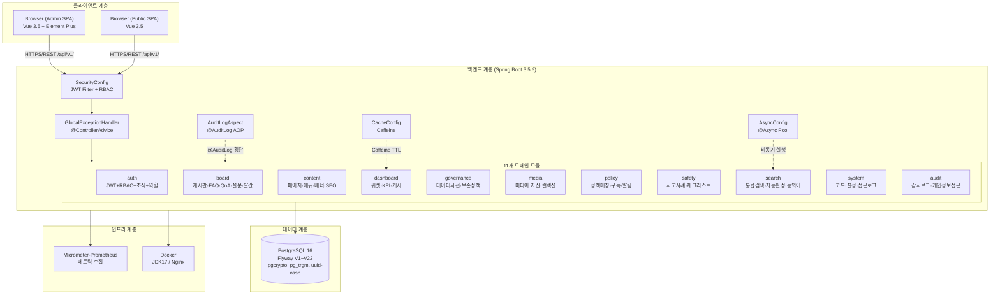
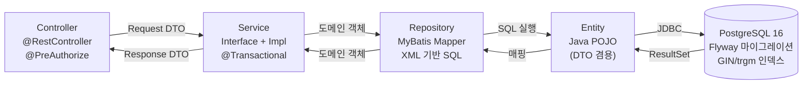
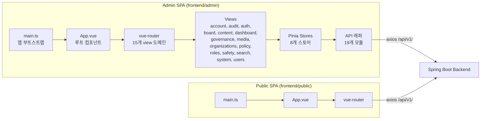
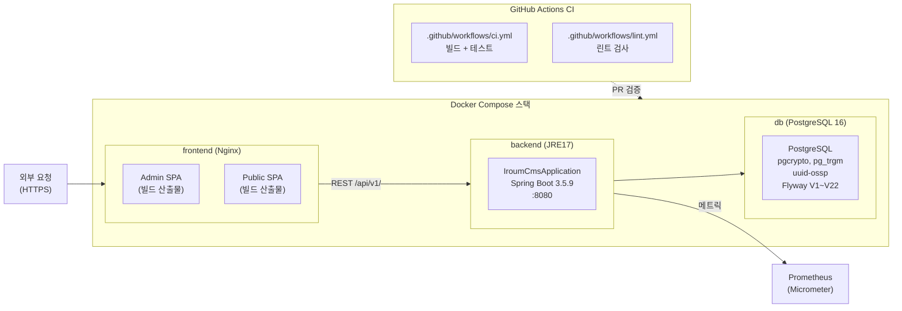
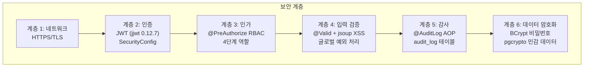

# iroum-cms 아키텍처 개요

> 최종 업데이트: 2026-05-07
> 근거 자료: Explore 에이전트 인벤토리 (2026-05-07)

---

## 1. 프로젝트 개요

iroum-cms는 공공기관을 위한 엔터프라이즈급 콘텐츠 관리 시스템(CMS)입니다. 백엔드는 Spring Boot 3.5.9 기반의 RESTful API 서버로 PostgreSQL 16과 MyBatis를 통해 11개 독립 도메인을 서비스합니다. 프론트엔드는 Vue 3.5 기반 관리자 SPA(admin)와 공개용 SPA(public)로 구성되어 있으며, JWT 기반 4단계 RBAC 인증·인가 체계와 AOP 기반 감사 로그를 통해 공공기관 요건을 충족합니다. 배포는 Docker 컨테이너로 패키징되어 JDK17(백엔드)과 Nginx(프론트엔드)로 서빙됩니다.

---

## 2. 상위 아키텍처 다이어그램



---

## 3. 핵심 통계

| 항목 | 수치 |
|------|------|
| 백엔드 Java 파일 | 723개 |
| MyBatis Mapper XML | 76개 |
| 테스트 파일 | 88개 |
| Flyway 마이그레이션 | V1~V22 (V11 누락, 실 22개) |
| 백엔드 도메인 | 11개 (board 포함 서브도메인 6개) |
| 프론트엔드 view 도메인 | 15개 (admin) |
| Pinia 스토어 | 8개 |
| API 래퍼 모듈 | 19개 |
| i18n 지원 언어 | ko, en |
| 프론트엔드 빌드 도구 | Vite 6.0.3 + vue-tsc 2.1.10 |
| SPEC 수 | 10개 (추정) |

---

## 4. 계층 모델



**계층 특징:**
- Controller: `@PreAuthorize` RBAC 인가 + Request/Response DTO 변환
- Service: 비즈니스 로직 + `@Transactional` + `@AuditLog` AOP 타겟
- Repository: MyBatis XML Mapper (동적 SQL, 페이지네이션, UNION ALL)
- Entity: Java POJO (Request/Response DTO 겸용 패턴 혼재)
- PostgreSQL: `pgcrypto`, `pg_trgm`, `uuid-ossp` 확장, GIN/trgm 인덱스, `to_tsvector` 검색

---

## 5. 도메인 그룹 분류

### 5.1 인증·권한 그룹

| 도메인 | 핵심 역할 |
|--------|---------|
| auth | JWT 토큰 발급·갱신, 4단계 RBAC, 본인인증, 조직·역할·권한 관리 |
| audit | AOP 기반 감사 로그, 개인정보 접근 로그 |

### 5.2 콘텐츠 그룹

| 도메인 | 핵심 역할 |
|--------|---------|
| board | 게시판·게시글·댓글·FAQ·QnA·발간자료·설문 (6 서브도메인) |
| content | 페이지·메뉴·배너·팝업·템플릿·다국어·SEO |
| media | 미디어 자산·컬렉션·처리·사용추적 |

### 5.3 분석·통계 그룹

| 도메인 | 핵심 역할 |
|--------|---------|
| dashboard | 레이아웃·위젯·KPI 집계·Caffeine 캐시·내보내기 |
| system | 코드 관리·설정·접근로그·통계·유지보수 |
| governance | 데이터 사전·보존정책·품질·복구·통계 |

### 5.4 도메인 특화 그룹

| 도메인 | 핵심 역할 |
|--------|---------|
| safety | 사고사례·키워드 매칭·프로필·체크리스트 |
| policy | 정책사업 매칭·구독·알림 디스패치 |

### 5.5 횡단 기능 그룹

| 도메인 | 핵심 역할 |
|--------|---------|
| search | 통합검색(UNION ALL 6 도메인)·자동완성·인기검색어·동의어·로그 |

---

## 6. 기술 스택 요약

### 백엔드

| 구분 | 기술 | 버전 |
|------|------|------|
| 프레임워크 | Spring Boot | 3.5.9 |
| ORM | MyBatis | 3.0.4 |
| 인증 | jjwt (JWT) | 0.12.7 |
| DB 마이그레이션 | Flyway | — |
| 캐시 | Caffeine | 3.1.8 |
| 문서 처리 | Apache POI | 5.2.5 |
| 파일 분석 | Apache Tika | 2.9.2 |
| 메트릭 | Micrometer-Prometheus | — |
| HTML 파싱 | jsoup | 1.17.2 |
| 데이터베이스 | PostgreSQL | 16 |
| JDK | OpenJDK | 17 |
| 빌드 | Gradle Kotlin DSL | — |

### 프론트엔드 (Admin SPA)

| 구분 | 기술 | 버전 |
|------|------|------|
| 프레임워크 | Vue | 3.5.13 |
| 라우터 | vue-router | 4.4.5 |
| 상태관리 | Pinia | 2.2.6 |
| UI 컴포넌트 | Element Plus | 2.8.8 |
| 차트 | ECharts + vue-echarts | 5.5.1 / 7.0.3 |
| HTTP 클라이언트 | axios | 1.7.9 |
| i18n | vue-i18n | 9.14.1 |
| CSS | TailwindCSS | 3.4.16 |
| 빌드 | Vite | 6.0.3 |
| 타입 체크 | vue-tsc | 2.1.10 |

### 인프라

| 구분 | 기술 |
|------|------|
| 컨테이너 | Docker |
| 백엔드 이미지 | JDK17 빌드 → JRE17 실행 |
| 프론트엔드 이미지 | Node22 빌드 → Nginx 서빙 |
| CI | GitHub Actions (ci.yml, lint.yml) |

---

## 7. 주요 아키텍처 패턴

### 7.1 DDD 자립 도메인 모듈

11개 도메인이 각각 독립 패키지로 분리되어 있으며, 도메인 간 의존성은 최소화됩니다. 각 도메인은 Controller → Service → Mapper → Entity 구조를 자체적으로 보유합니다.

### 7.2 MyBatis XML SQL 관리

JPA 대신 MyBatis XML Mapper를 사용하여 복잡한 UNION ALL 쿼리, PostgreSQL 네이티브 함수(`to_tsvector`, `ts_rank`, GIN 인덱스), 동적 SQL을 명시적으로 관리합니다.

### 7.3 PostgreSQL 네이티브 기능 활용

- `pg_trgm`: 트라이그램 기반 유사도 검색
- `uuid-ossp`: UUID 기본 키 생성
- `pgcrypto`: 암호화 함수
- `to_tsvector` / `ts_rank`: 전문 검색(한국어·영어)
- GIN 인덱스: `search_vector` 컬럼 고속 검색
- DB 트리거: 게시글 저장 시 `search_vector` 자동 갱신

### 7.4 AOP 횡단 감사

`@AuditLog` 어노테이션과 `AuditLogAspect`를 통해 모든 Service 메서드에 감사 로그를 비침습적으로 적재합니다.

### 7.5 JWT + 4단계 RBAC

`SecurityConfig`에서 JWT 필터를 설정하고, `@PreAuthorize` 어노테이션으로 컨트롤러 메서드 수준의 역할 기반 접근 제어를 구현합니다. 4단계: 슈퍼관리자 → 기관관리자 → 운영자 → 일반사용자.

### 7.6 비동기 검색 로그

`AsyncConfig`의 `searchLogExecutor`를 통해 검색 로그 적재를 비동기로 처리하여 검색 응답 시간에 영향을 주지 않습니다.

### 7.7 Caffeine 인메모리 캐시

`CacheConfig`로 설정된 Caffeine 캐시가 대시보드 KPI 위젯 데이터(TTL 5분)를 캐싱하여 반복 집계 쿼리를 방지합니다.

---

## 8. 프론트엔드 구조 개요



**Admin SPA 주요 구성:**
- **15개 view 도메인**: account, audit, auth, board, content, dashboard, governance, media, organizations, policy, roles, safety, search, system, users
- **8개 Pinia 스토어**: auth, content, dashboardStore, governanceStore, policyStore, safetyStore, searchStore, system
- **19개 API 래퍼**: audit, auth, board, content, dashboard, faq, governance, media, me, organizations, policy, publication, qna, roles, safety, search, survey, system, users
- **코드 스플리팅**: Vite lazy code splitting으로 초기 로드 최적화
- **i18n**: ko / en 다국어 지원

---

## 9. 배포 아키텍처



**빌드 파이프라인:**

| 단계 | 명령어 | 결과물 |
|------|--------|--------|
| 백엔드 빌드 | `./gradlew bootJar` | `build/libs/*.jar` |
| Admin SPA 빌드 | `pnpm -F admin build` | `frontend/admin/dist/` |
| Public SPA 빌드 | `pnpm -F public build` | `frontend/public/dist/` |
| 백엔드 이미지 | `docker build -f deploy/Dockerfile.backend` | JDK17 → JRE17 멀티스테이지 |
| 프론트엔드 이미지 | `docker build -f deploy/Dockerfile.frontend` | Node22 → Nginx 멀티스테이지 |

---

## 10. 테스트 구조

| 도메인 | 테스트 수 | 비율 |
|--------|---------|------|
| auth | 22 | 25% |
| board | 18 | 20% |
| content | 11 | 13% |
| search | 10 | 11% |
| system | 9 | 10% |
| safety | 4 | 5% |
| policy | 3 | 3% |
| dashboard | 5 | 6% |
| media | 2 | 2% |
| governance | 2 | 2% |
| audit | 2 | 2% |
| **합계** | **88** | 100% |

테스트는 백엔드 `backend/src/test/java/kr/co/ircp/cms/` 경로에 위치하며, Spring Boot Test, MockMvc, MyBatis 통합 테스트 패턴을 사용합니다. 인증(auth) 도메인이 가장 많은 22개 테스트를 보유하고 있으며, 이는 JWT, RBAC, 본인인증 등 핵심 보안 기능의 복잡성을 반영합니다.

---

## 11. 보안 아키텍처 요약



**보안 컴포넌트별 역할:**
- `SecurityConfig`: JWT 필터 체인, STATELESS 세션 정책, PUBLIC 허용 목록 관리
- `JwtProvider`: jjwt 0.12.7을 사용한 토큰 생성·검증·갱신
- `@PreAuthorize`: 메서드 수준 RBAC (슈퍼관리자/기관관리자/운영자/일반사용자)
- `GlobalExceptionHandler`: 예외 유형별 HTTP 상태 코드 매핑, 오류 응답 표준화
- `AuditLogAspect`: 모든 Service 메서드의 감사 로그 자동 적재
- jsoup: 검색 하이라이트 마크업 XSS 방어
- `pgcrypto`: PostgreSQL 레벨 암호화 함수
- BCrypt: 사용자 비밀번호 해시 저장

---

## 12. 도메인 간 데이터 통합 패턴

### 12.1 PostgreSQL 전문 검색 통합

search 도메인은 6개 도메인 테이블의 `search_vector` 컬럼을 UNION ALL로 통합하여 단일 검색 API를 제공합니다. 각 도메인은 DB 트리거를 통해 자신의 `search_vector`를 자동 관리하며, search 도메인은 이를 읽기 전용으로 소비합니다. 이 패턴은 도메인 자율성을 유지하면서 통합 검색을 가능하게 하는 핵심 설계입니다.

| 검색 대상 테이블 | 검색 컬럼 | 인덱스 유형 |
|--------------|---------|----------|
| `bbs_post` | `search_vector` | GIN |
| `content_page` | `tsv_ko`, `tsv_en` | GIN |
| `policy` | `search_vector` | GIN |
| `safety_incident` | `search_vector` | GIN |
| `media_asset` | `search_vector` | GIN |
| `publication` | `search_vector` | GIN |

### 12.2 보존 정책 중앙화 패턴

`governance.retention_policy` 단일 테이블이 여러 도메인의 데이터 생명주기를 중앙에서 관리합니다. 각 배치 잡은 실행 전 `retention_policy` 테이블에서 대상 테이블명으로 보존 기간을 조회하여 삭제 기준을 동적으로 결정합니다. 이 패턴은 보존 정책 변경 시 각 도메인 코드를 수정하지 않고 DB 레코드만 갱신하면 되는 유연성을 제공합니다.

### 12.3 비동기 로그 적재 패턴

검색 로그와 감사 로그는 서로 다른 비동기 전략을 사용합니다.
- 검색 로그: `@Async` + `searchLogExecutor` 전용 스레드 풀 (응답 후 비동기)
- 감사 로그: `@AuditLog` AOP 방식 (동기, 트랜잭션 포함)

두 패턴 모두 Service 비즈니스 로직에 로그 적재 코드를 삽입하지 않습니다.

### 12.4 Caffeine 캐시 패턴

대시보드 KPI 위젯은 Caffeine 캐시를 통해 4개 도메인의 집계 쿼리를 5분 단위로 캐싱합니다. 캐시 키는 `widget:{widgetId}` 형태이며, 위젯 설정이 변경되면 캐시가 무효화됩니다. 이 패턴은 PostgreSQL 집계 쿼리 비용을 크게 절감합니다.

---

## 13. 파일 구조 개요

```
iroum-cms/
├── backend/                          # Spring Boot 백엔드
│   ├── src/main/java/kr/co/ircp/cms/
│   │   ├── IroumCmsApplication.java  # 메인 진입점
│   │   ├── config/                   # 횡단 관심사 설정
│   │   │   ├── SecurityConfig.java
│   │   │   ├── AsyncConfig.java
│   │   │   ├── CacheConfig.java
│   │   │   ├── GlobalExceptionHandler.java
│   │   │   ├── AuditLogAspect.java
│   │   │   └── FilterRegistration.java
│   │   └── domain/                   # 11개 도메인 모듈
│   │       ├── audit/
│   │       ├── auth/
│   │       ├── board/
│   │       ├── content/
│   │       ├── dashboard/
│   │       ├── governance/
│   │       ├── media/
│   │       ├── policy/
│   │       ├── safety/
│   │       ├── search/
│   │       └── system/
│   ├── src/main/resources/
│   │   ├── application.yml           # 애플리케이션 설정
│   │   └── db/migration/             # Flyway 마이그레이션 V1~V22
│   └── build.gradle.kts              # Gradle Kotlin DSL 빌드 스크립트
├── frontend/
│   ├── admin/                        # Admin SPA (Vue 3.5)
│   │   └── src/
│   │       ├── main.ts
│   │       ├── App.vue
│   │       ├── router/
│   │       ├── stores/               # 8개 Pinia 스토어
│   │       ├── api/                  # 19개 API 래퍼
│   │       ├── views/                # 15개 view 도메인
│   │       └── locales/              # ko.json, en.json
│   └── public/                       # Public SPA (Vue 3.5)
│       └── src/
│           ├── main.ts
│           ├── App.vue
│           └── router/
└── deploy/
    ├── Dockerfile.backend            # JDK17 → JRE17
    ├── Dockerfile.frontend           # Node22 → Nginx
    └── docker-compose.yml
```
