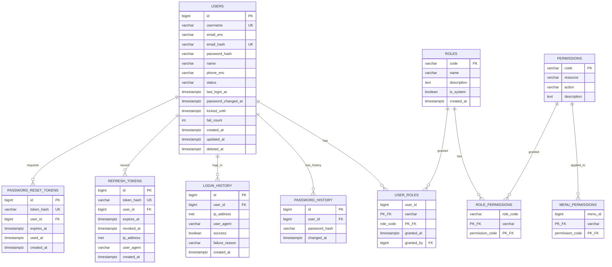
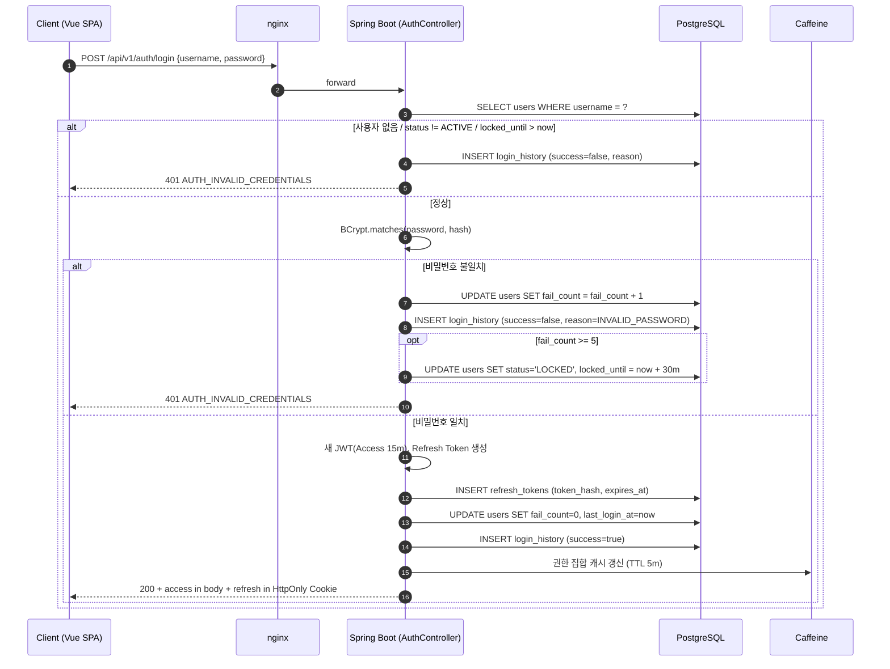
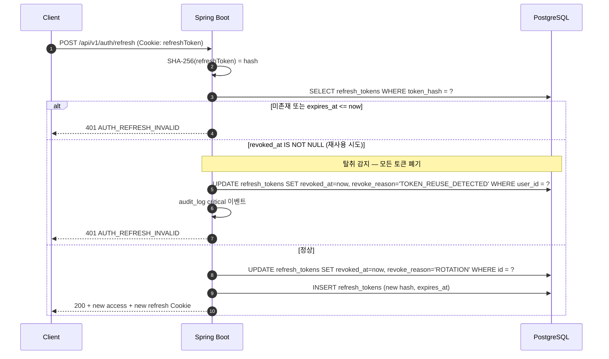
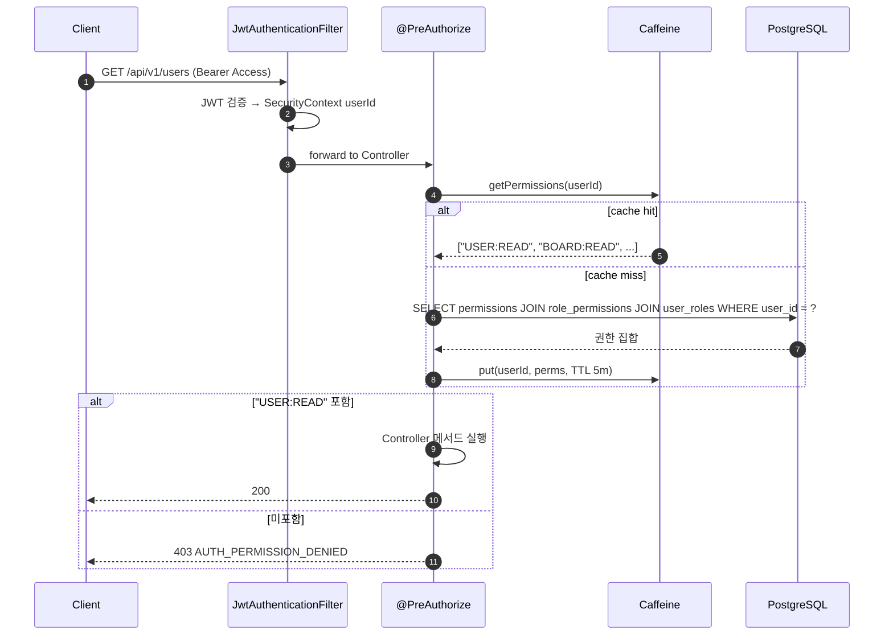

# SPEC-CMS-002: 회원·권한·로그인 상세 (Bundle A — Auth, Account, Authorization)  v0.2 (2026-04-29 RFP 통합)

## 1. 개요

| 항목 | 내용 |
|------|------|
| SPEC ID | SPEC-CMS-002 |
| 제목 | 회원·권한·로그인 상세 (Bundle A — Auth, Account, Authorization) |
| 부모 SPEC | SPEC-CMS-001 v0.2 (Umbrella) — §15.2 SFR-014 / SFR-010 / SFR-015, §16, §17 매핑 |
| 작성일 | 2026-04-29 |
| 작성자 | manager-spec (MoAI) |
| 상태 | Draft |
| 버전 | v0.2 (RFP 통합 amendment) |
| 우선순위 | P0 (다른 묶음의 보안 기반, 가장 먼저 구현) |
| 분류 | Detail SPEC |
| egov 차용 모듈 | uss/umt(사용자관리), sec/rmt(역할관리), sec/aut(권한관리), uat/uia(일반로그인), uss/olh(조직관리) |

본 SPEC은 SPEC-CMS-001 §6.1 REQ-AUTH-001~012 및 §6.5 REQ-CROSS-002~005 횡단 관심사를 Bundle A 범위로 상세화한다. 모든 REST API, DDL, 시퀀스, 권한 매트릭스, 보안 정책을 구현 단계 의사결정 수준까지 확정한다.

---

## 2. 참조 문서

- 부모 SPEC: `.moai/specs/SPEC-CMS-001/spec.md` §6.1 (REQ-AUTH-*), §6.5 (REQ-CROSS-002~005), §7.1, §8.1
- 부모 인수기준: `.moai/specs/SPEC-CMS-001/acceptance.md` A. (REQ-AUTH-*)
- 부모 연구 노트: `.moai/specs/SPEC-CMS-001/research.md` §3 (JWT vs Session), §6 (감사로그 AOP), §7 (PIA 대응)
- 기술 스택 (FROZEN): `.moai/project/tech.md`
- 본 SPEC 연구 노트: `research.md` (동일 디렉토리)

---

## 3. 범위 및 비범위

### 3.1 범위 (1차 출시 포함)

- 일반 로그인(ID/비밀번호) + Refresh Token Rotation
- 자동 로그인(remember-me) — Refresh Token 만료 7일 정책에 통합
- 사용자 CRUD(관리자) + 본인 정보 조회/수정(자기정보)
- 역할(Role) 마스터 관리 + 사용자-역할 N:M 매핑
- 권한(Permission) 정의 + 역할-권한 매핑
- 메뉴별 접근 권한 매핑 (메뉴 테이블 자체는 SPEC-CMS-004 정의, 본 SPEC은 매핑 측면)
- 비밀번호 정책(8자/3종/BCrypt 12) + 변경 이력 + 재사용 금지(직전 5개)
- 계정 잠금(5회 실패 → 30분) + 관리자 수동 해제
- 비밀번호 재설정 (이메일 토큰 기반)
- 로그인 이력 기록 (성공/실패, IP, User-Agent)
- 관리자 강제 로그아웃 (특정 사용자 모든 Refresh Token 무효화)
- 개인정보 암호화(이메일/휴대폰 AES-256-GCM) — REQ-CROSS-002 부분 구현
- 감사로그 적재 — REQ-CROSS-004의 Bundle A 범위

### 3.2 비범위 (Out of Scope)

| 항목 | 사유 |
|------|------|
| 소셜 로그인 (카카오·네이버·Google) | SPEC-CMS-001 §3.2 비목표 |
| GPKI / 공동인증서 / OIDC | 외부 라이브러리·법적 검토 후속 |
| 2FA / OTP / WebAuthn | 1차 미적용, 후속 SPEC |
| OAuth2 인가 서버 (자기 자신이 IdP가 되는 시나리오) | 1차 미적용 |
| IP 화이트리스트 자동 학습 | 1차는 운영자 수동 등록까지만 (옵션) |
| 다중 디바이스 세션 화면 | 1차는 강제 로그아웃 API만 제공, UI는 후속 |
| 멀티 테넌시 (기관별 사용자 격리) | SPEC-CMS-001 §3.2 비목표 |

---

## 4. 데이터 모델 (DDL + ERD)

### 4.1 ERD



### 4.2 테이블 명세 (PostgreSQL 16 Flyway V1 호환 DDL)

#### 4.2.1 `users` (사용자 마스터)

```sql
CREATE TABLE users (
    id              BIGINT GENERATED ALWAYS AS IDENTITY PRIMARY KEY,
    username        VARCHAR(50)  NOT NULL UNIQUE,
    email_enc       VARCHAR(512) NOT NULL,
    email_hash      VARCHAR(64)  NOT NULL UNIQUE,
    password_hash   VARCHAR(60)  NOT NULL,
    name            VARCHAR(100) NOT NULL,
    phone_enc       VARCHAR(512),
    status          VARCHAR(20)  NOT NULL DEFAULT 'ACTIVE',
    last_login_at   TIMESTAMPTZ,
    password_changed_at TIMESTAMPTZ NOT NULL DEFAULT CURRENT_TIMESTAMP,
    locked_until    TIMESTAMPTZ,
    fail_count      INT NOT NULL DEFAULT 0,
    created_at      TIMESTAMPTZ NOT NULL DEFAULT CURRENT_TIMESTAMP,
    updated_at      TIMESTAMPTZ NOT NULL DEFAULT CURRENT_TIMESTAMP,
    deleted_at      TIMESTAMPTZ,
    CONSTRAINT chk_users_status CHECK (status IN ('ACTIVE','INACTIVE','LOCKED','DELETED'))
);
CREATE INDEX idx_users_status        ON users(status) WHERE deleted_at IS NULL;
CREATE INDEX idx_users_email_hash    ON users(email_hash);
CREATE INDEX idx_users_last_login_at ON users(last_login_at DESC);
COMMENT ON COLUMN users.email_enc   IS 'AES-256-GCM 암호화 (REQ-CROSS-002)';
COMMENT ON COLUMN users.email_hash  IS 'SHA-256(LOWER(email)) — 검색·중복 방지용';
COMMENT ON COLUMN users.password_hash IS 'BCrypt strength=12 해시';
```

비고:
- `id`: BIGINT IDENTITY (egov 호환, internal). 외부 노출 시 별도 UUID 컬럼 도입 검토(연구노트 §6).
- `email_hash`: AES 암호화된 email은 동일 평문이라도 IV에 따라 암호문이 달라지므로, 검색·중복 검사용 SHA-256 hash 컬럼 보조.
- `status`: ACTIVE / INACTIVE(관리자 비활성화) / LOCKED(잠금) / DELETED(soft delete; deleted_at 동시 설정).
- `deleted_at`: NULL이 아니면 soft-deleted. 모든 조회 쿼리에서 `WHERE deleted_at IS NULL` 강제.

#### 4.2.2 `roles` (역할 마스터)

```sql
CREATE TABLE roles (
    code        VARCHAR(50)  PRIMARY KEY,
    name        VARCHAR(100) NOT NULL,
    description TEXT,
    is_system   BOOLEAN NOT NULL DEFAULT FALSE,
    created_at  TIMESTAMPTZ NOT NULL DEFAULT CURRENT_TIMESTAMP
);
COMMENT ON COLUMN roles.is_system IS '시스템 기본 역할(SYSADMIN/CONTENT_ADMIN/USER) — 삭제 금지';

INSERT INTO roles (code, name, description, is_system) VALUES
  ('SYSADMIN',      '시스템관리자', '모든 권한, 시스템 설정 가능',       TRUE),
  ('CONTENT_ADMIN', '콘텐츠관리자', '게시판·콘텐츠 관리 권한',           TRUE),
  ('USER',          '일반사용자',   '인증된 일반 사용자, 본인 정보만 수정', TRUE);
```

#### 4.2.3 `user_roles` (사용자-역할 N:M 매핑)

```sql
CREATE TABLE user_roles (
    user_id     BIGINT      NOT NULL REFERENCES users(id) ON DELETE CASCADE,
    role_code   VARCHAR(50) NOT NULL REFERENCES roles(code) ON DELETE RESTRICT,
    granted_at  TIMESTAMPTZ NOT NULL DEFAULT CURRENT_TIMESTAMP,
    granted_by  BIGINT      REFERENCES users(id),
    PRIMARY KEY (user_id, role_code)
);
CREATE INDEX idx_user_roles_role ON user_roles(role_code);
```

#### 4.2.4 `permissions` (권한 정의)

```sql
CREATE TABLE permissions (
    code        VARCHAR(100) PRIMARY KEY,
    resource    VARCHAR(50)  NOT NULL,
    action      VARCHAR(50)  NOT NULL,
    description TEXT,
    CONSTRAINT chk_perm_action CHECK (action IN ('READ','WRITE','DELETE','ADMIN'))
);
COMMENT ON COLUMN permissions.code IS '예: USER:READ, BOARD:WRITE, SYSTEM:ADMIN';
```

#### 4.2.5 `role_permissions` (역할-권한 N:M)

```sql
CREATE TABLE role_permissions (
    role_code       VARCHAR(50)  NOT NULL REFERENCES roles(code) ON DELETE CASCADE,
    permission_code VARCHAR(100) NOT NULL REFERENCES permissions(code) ON DELETE CASCADE,
    PRIMARY KEY (role_code, permission_code)
);
CREATE INDEX idx_role_perms_perm ON role_permissions(permission_code);
```

#### 4.2.6 `menu_permissions` (메뉴별 권한 매핑)

```sql
-- 참고: menu 테이블은 SPEC-CMS-004(Bundle C)에서 정의 예정.
-- 본 매핑 테이블은 SPEC-CMS-002에서 schema만 선언하고, FK는 menu 테이블 생성 후 추가.
CREATE TABLE menu_permissions (
    menu_id         BIGINT       NOT NULL,
    permission_code VARCHAR(100) NOT NULL REFERENCES permissions(code) ON DELETE CASCADE,
    PRIMARY KEY (menu_id, permission_code)
);
CREATE INDEX idx_menu_perms_perm ON menu_permissions(permission_code);
-- ALTER TABLE menu_permissions ADD CONSTRAINT fk_menu_perms_menu
--   FOREIGN KEY (menu_id) REFERENCES menu(id) ON DELETE CASCADE; -- SPEC-CMS-004 시 추가
```

#### 4.2.7 `password_history` (비밀번호 이력 — 재사용 금지)

```sql
CREATE TABLE password_history (
    id            BIGINT GENERATED ALWAYS AS IDENTITY PRIMARY KEY,
    user_id       BIGINT      NOT NULL REFERENCES users(id) ON DELETE CASCADE,
    password_hash VARCHAR(60) NOT NULL,
    changed_at    TIMESTAMPTZ NOT NULL DEFAULT CURRENT_TIMESTAMP
);
CREATE INDEX idx_password_history_user_changed ON password_history(user_id, changed_at DESC);
```

비고: 사용자별 최근 5개만 비교 대상. 6개 이상은 보존하되 재사용 검증 시 LIMIT 5.

#### 4.2.8 `login_history` (로그인 이력)

```sql
CREATE TABLE login_history (
    id              BIGINT GENERATED ALWAYS AS IDENTITY PRIMARY KEY,
    user_id         BIGINT      REFERENCES users(id) ON DELETE SET NULL,
    username_attempt VARCHAR(50),
    ip_address      INET        NOT NULL,
    user_agent      VARCHAR(500),
    success         BOOLEAN     NOT NULL,
    failure_reason  VARCHAR(50),
    created_at      TIMESTAMPTZ NOT NULL DEFAULT CURRENT_TIMESTAMP,
    CONSTRAINT chk_login_history_reason CHECK (
      failure_reason IS NULL OR failure_reason IN
      ('INVALID_PASSWORD','USER_NOT_FOUND','ACCOUNT_LOCKED','ACCOUNT_INACTIVE','PASSWORD_EXPIRED','IP_BLOCKED')
    )
);
CREATE INDEX idx_login_history_user_time ON login_history(user_id, created_at DESC);
CREATE INDEX idx_login_history_ip_time   ON login_history(ip_address, created_at DESC);
```

비고: `username_attempt`는 사용자 미존재 케이스(user_id가 NULL인 실패) 추적용. append-only는 REQ-CROSS-005에 따라 `audit_log`만 강제, 본 테이블은 보존정책에 따라 1년 후 정리.

#### 4.2.9 `refresh_tokens` (Refresh Token 관리)

```sql
CREATE TABLE refresh_tokens (
    id          BIGINT GENERATED ALWAYS AS IDENTITY PRIMARY KEY,
    token_hash  VARCHAR(64)  NOT NULL UNIQUE,
    user_id     BIGINT       NOT NULL REFERENCES users(id) ON DELETE CASCADE,
    expires_at  TIMESTAMPTZ  NOT NULL,
    revoked_at  TIMESTAMPTZ,
    revoke_reason VARCHAR(30),
    ip_address  INET,
    user_agent  VARCHAR(500),
    created_at  TIMESTAMPTZ  NOT NULL DEFAULT CURRENT_TIMESTAMP,
    CONSTRAINT chk_refresh_revoke_reason CHECK (
      revoke_reason IS NULL OR revoke_reason IN
      ('LOGOUT','ROTATION','FORCE_LOGOUT','TOKEN_REUSE_DETECTED','PASSWORD_CHANGED')
    )
);
CREATE INDEX idx_refresh_tokens_user        ON refresh_tokens(user_id);
CREATE INDEX idx_refresh_tokens_expires     ON refresh_tokens(expires_at) WHERE revoked_at IS NULL;
```

비고:
- `token_hash`: 실제 Refresh Token 평문은 저장 X. SHA-256 해시만 저장하여 DB 유출 시에도 토큰 사용 불가.
- `revoke_reason`: ROTATION(정상 회전), TOKEN_REUSE_DETECTED(폐기된 토큰 재사용 — 사용자 모든 토큰 폐기), FORCE_LOGOUT, LOGOUT, PASSWORD_CHANGED.

#### 4.2.10 `password_reset_tokens` (비밀번호 재설정 토큰)

```sql
CREATE TABLE password_reset_tokens (
    id          BIGINT GENERATED ALWAYS AS IDENTITY PRIMARY KEY,
    token_hash  VARCHAR(64)  NOT NULL UNIQUE,
    user_id     BIGINT       NOT NULL REFERENCES users(id) ON DELETE CASCADE,
    expires_at  TIMESTAMPTZ  NOT NULL,
    used_at     TIMESTAMPTZ,
    created_at  TIMESTAMPTZ  NOT NULL DEFAULT CURRENT_TIMESTAMP
);
CREATE INDEX idx_password_reset_user ON password_reset_tokens(user_id, created_at DESC);
```

비고: 토큰 평문은 이메일 본문 1회만 노출. DB는 SHA-256 해시 저장. 만료(30분) + 1회 사용(used_at 기록) 정책.

### 4.3 시퀀스/UUID 정책 및 인덱스 전략

- **PK 정책**: 모든 internal id는 BIGINT IDENTITY (egov 호환). 외부 노출용 UUID는 1차 미도입(필요 시 후속 SPEC).
- **Soft delete**: `users.deleted_at` 패턴. `WHERE deleted_at IS NULL` 강제, MyBatis Mapper 공통 fragment로 관리.
- **인덱스 전략**:
  - 로그인 핫패스: `users.username` UNIQUE, `users.email_hash` UNIQUE
  - 잠금 검사: `users.status` 부분 인덱스 (deleted_at IS NULL)
  - Refresh 검증: `refresh_tokens.token_hash` UNIQUE + `expires_at` 부분 인덱스 (revoked_at IS NULL)
  - 이력 조회: `login_history.(user_id, created_at DESC)` 복합 인덱스
- **타임스탬프**: 모든 시간 컬럼 `TIMESTAMPTZ`로 통일(서버 TZ Asia/Seoul, DB 저장 UTC).

---

## 5. 요구사항 (EARS 상세화)

> 각 항목은 SPEC-CMS-001의 상위 요구사항을 sub-requirement로 분해한 것이다.
> 본 SPEC의 모든 sub-REQ는 acceptance.md에 G/W/T로 매핑된다.

### 5.1 REQ-AUTH-001-D: 사용자 로그인 (SPEC-CMS-001 §6.1 REQ-AUTH-001 상세화)

- **REQ-AUTH-001-D-1 (일반 로그인 — Event-driven)**
  사용자가 `POST /api/v1/auth/login`에 username·password를 제출했을 때, 시스템은 (a) users.username으로 조회 (b) status가 ACTIVE인지 확인 (c) locked_until이 NULL이거나 과거인지 확인 (d) BCrypt.matches로 비밀번호 검증 후, 성공 시 Access Token(JWT, 15분)을 응답 본문, Refresh Token(7일)을 HttpOnly Secure SameSite=Strict Cookie로 발급해야 한다.
- **REQ-AUTH-001-D-2 (자동 로그인 정책 — Optional)**
  요청에 `rememberMe=true` 플래그가 있는 경우, 시스템은 Refresh Token Cookie의 Max-Age를 7일로 설정해야 하며, 미설정 시 세션 쿠키(Max-Age 미지정, 브라우저 종료 시 만료)로 발급해야 한다.
- **REQ-AUTH-001-D-3 (실패 사유 분리 — Event-driven)**
  로그인이 실패했을 때, 시스템은 클라이언트에게는 `AUTH_INVALID_CREDENTIALS` 단일 코드만 반환하되(사용자 enumeration 방지), login_history에는 정확한 failure_reason(USER_NOT_FOUND / INVALID_PASSWORD / ACCOUNT_LOCKED / ACCOUNT_INACTIVE)을 기록해야 한다.
- **REQ-AUTH-001-D-4 (비밀번호 만료 검사 — State-driven)**
  사용자의 `password_changed_at`이 현재 시각 - 90일을 초과한 동안, 시스템은 로그인은 허용하되 응답에 `passwordExpired=true` 플래그를 포함하고, 응답 코드는 200 OK로 유지하며 클라이언트는 비밀번호 변경 화면으로 강제 이동해야 한다.
- **REQ-AUTH-001-D-5 (IP 기반 제한 — Optional)**
  관리자 계정(`SYSADMIN` 역할)이 IP 화이트리스트가 등록되어 있는 경우, 시스템은 화이트리스트에 포함되지 않은 IP의 로그인 시도를 차단하고 `IP_BLOCKED` 사유로 기록해야 한다. (1차는 화이트리스트 미등록이 기본값 — 차단 미적용)

### 5.2 REQ-AUTH-002-D: 토큰 갱신 (SPEC-CMS-001 §6.1 REQ-AUTH-002 상세화)

- **REQ-AUTH-002-D-1 (Refresh Token 검증 — Event-driven)**
  클라이언트가 `POST /api/v1/auth/refresh`를 호출했을 때, 시스템은 Cookie의 Refresh Token을 SHA-256 해시하여 `refresh_tokens.token_hash`로 조회하고, (a) 존재 (b) revoked_at IS NULL (c) expires_at 미래인 경우에만 새 Access Token을 발급해야 한다.
- **REQ-AUTH-002-D-2 (Rotation — Event-driven)**
  토큰 갱신이 성공했을 때, 시스템은 (a) 기존 Refresh Token row의 revoked_at = now, revoke_reason = 'ROTATION'으로 기록 (b) 새 Refresh Token을 생성·저장 (c) 새 Cookie를 발급해야 한다.
- **REQ-AUTH-002-D-3 (탈취 감지 — Unwanted)**
  이미 revoked된 Refresh Token으로 갱신 시도가 감지된 경우, 시스템은 해당 사용자의 모든 활성 Refresh Token을 즉시 revoke(revoke_reason='TOKEN_REUSE_DETECTED')하고, audit_log에 critical 이벤트로 기록하며 401을 반환해야 한다.

### 5.3 REQ-AUTH-003-D: 로그아웃 (SPEC-CMS-001 §6.1 REQ-AUTH-003 상세화)

- **REQ-AUTH-003-D-1 (단일 디바이스 로그아웃 — Event-driven)**
  사용자가 `POST /api/v1/auth/logout`을 호출했을 때, 시스템은 현재 Cookie의 Refresh Token을 revoke(revoke_reason='LOGOUT')하고 응답에 만료된 Set-Cookie 헤더를 포함해 클라이언트 쿠키를 삭제해야 한다.
- **REQ-AUTH-003-D-2 (전체 디바이스 로그아웃 — Event-driven)**
  사용자가 `POST /api/v1/auth/logout-all`을 호출했을 때, 시스템은 해당 사용자의 모든 활성 Refresh Token을 revoke해야 한다.

### 5.4 REQ-AUTH-004-D: 비밀번호 정책 (SPEC-CMS-001 §6.1 REQ-AUTH-004 상세화)

- **REQ-AUTH-004-D-1 (복잡도 검증 — Ubiquitous)**
  시스템은 비밀번호가 (a) 최소 8자 (b) 영문 대문자/소문자/숫자/특수문자 4종 중 3종 이상 조합 (c) username 미포함 조건을 모두 만족해야만 수락해야 한다.
- **REQ-AUTH-004-D-2 (해싱 정책 — Ubiquitous)**
  시스템은 모든 비밀번호를 BCrypt strength=12로 해싱하여 저장해야 하며, 평문은 메모리에서 사용 즉시 폐기해야 한다.
- **REQ-AUTH-004-D-3 (만료 정책 — Ubiquitous)**
  시스템은 password_changed_at이 90일 초과 시 비밀번호 변경을 강제해야 한다 (REQ-AUTH-001-D-4 연동).

### 5.5 REQ-AUTH-005-D: 계정 잠금 (SPEC-CMS-001 §6.1 REQ-AUTH-005 상세화)

- **REQ-AUTH-005-D-1 (실패 카운터 증가 — Event-driven)**
  로그인 실패가 발생했을 때, 시스템은 users.fail_count를 1 증가시키고 login_history에 실패 행을 기록해야 한다.
- **REQ-AUTH-005-D-2 (자동 잠금 — Event-driven)**
  fail_count가 5에 도달했을 때, 시스템은 (a) status를 LOCKED로 (b) locked_until = now + 30분 으로 설정해야 한다.
- **REQ-AUTH-005-D-3 (자동 해제 — State-driven)**
  locked_until이 과거 시각인 동안, 다음 성공 로그인 시 시스템은 fail_count를 0으로 리셋하고 status를 ACTIVE로 복원해야 한다.
- **REQ-AUTH-005-D-4 (관리자 수동 해제 — Event-driven)**
  관리자가 `POST /api/v1/users/{id}/unlock`을 호출했을 때, 시스템은 status='ACTIVE', fail_count=0, locked_until=NULL로 즉시 복원하고 audit_log에 기록해야 한다.

### 5.6 REQ-AUTH-006-D: 사용자 CRUD (SPEC-CMS-001 §6.1 REQ-AUTH-006 상세화)

- **REQ-AUTH-006-D-1 (관리자 사용자 생성 — Ubiquitous)**
  시스템은 SYSADMIN 권한 사용자가 `POST /api/v1/users`로 새 사용자를 생성할 수 있도록 제공해야 한다. 임시 비밀번호 자동 발급 + 최초 로그인 시 변경 강제 옵션 지원.
- **REQ-AUTH-006-D-2 (사용자 목록 조회 — Ubiquitous)**
  시스템은 SYSADMIN 권한 사용자가 `GET /api/v1/users`로 페이징·필터(status, role_code, username 부분일치) 검색을 할 수 있도록 제공해야 한다.
- **REQ-AUTH-006-D-3 (사용자 수정 — Ubiquitous)**
  시스템은 SYSADMIN이 `PUT /api/v1/users/{id}`로 name, email, phone, status를 수정할 수 있도록 제공해야 한다. 비밀번호는 본 엔드포인트로 변경 불가(별도 재설정 절차 사용).
- **REQ-AUTH-006-D-4 (사용자 비활성화 — Ubiquitous)**
  `DELETE /api/v1/users/{id}`는 soft delete로 동작해 deleted_at = now, status = DELETED로 설정하고, 활성 Refresh Token을 모두 revoke해야 한다.
- **REQ-AUTH-006-D-5 (자기 정보 조회/수정 — Ubiquitous)**
  시스템은 인증된 사용자가 `GET /api/v1/me`로 자신의 정보를, `PUT /api/v1/me`로 name·email·phone을 수정할 수 있도록 제공해야 한다 (status, role 변경 불가).

### 5.7 REQ-AUTH-007-D: 역할 관리 (SPEC-CMS-001 §6.1 REQ-AUTH-007 상세화)

- **REQ-AUTH-007-D-1 (시스템 기본 역할 — Ubiquitous)**
  시스템은 부팅 시 SYSADMIN, CONTENT_ADMIN, USER 3개 시스템 역할을 보장해야 하며, is_system=TRUE인 역할은 삭제·코드 변경이 거부되어야 한다.
- **REQ-AUTH-007-D-2 (사용자 역할 매핑 — Event-driven)**
  관리자가 `POST /api/v1/users/{id}/roles`에 role_code를 보냈을 때, 시스템은 user_roles 테이블에 매핑을 추가하고 audit_log에 (granted_by, granted_at) 기록해야 한다.
- **REQ-AUTH-007-D-3 (역할 회수 — Event-driven)**
  관리자가 `DELETE /api/v1/users/{id}/roles/{role_code}`를 호출했을 때, 시스템은 매핑을 삭제하고 해당 사용자의 캐시된 권한 정보를 무효화해야 한다.

### 5.8 REQ-AUTH-008-D: 메뉴별 권한 검사 (SPEC-CMS-001 §6.1 REQ-AUTH-008 상세화)

- **REQ-AUTH-008-D-1 (메서드 레벨 권한 — State-driven)**
  보호된 Controller 메서드에 `@PreAuthorize("hasPermission(...)")`가 적용된 동안, 시스템은 호출 사용자의 역할 → 권한 매핑을 검사해 미보유 시 403을 반환해야 한다.
- **REQ-AUTH-008-D-2 (메뉴 접근 제어 — State-driven)**
  사용자가 `GET /api/v1/menus`(SPEC-CMS-004에서 정의)를 호출하는 동안, 시스템은 menu_permissions 테이블을 조회해 사용자가 접근 가능한 메뉴만 반환해야 한다. 매핑이 없는 메뉴는 모든 인증 사용자에게 노출(open menu).
- **REQ-AUTH-008-D-3 (권한 캐시 — Ubiquitous)**
  시스템은 사용자별 권한 집합을 Caffeine in-memory 캐시(TTL 5분)에 저장해 매 요청마다 DB 조회를 피해야 한다. 역할 변경 시 캐시 무효화는 REQ-AUTH-007-D-3 참조.

### 5.9 REQ-AUTH-009-D: 비밀번호 변경 (SPEC-CMS-001 §6.1 REQ-AUTH-009 상세화)

- **REQ-AUTH-009-D-1 (현재 비밀번호 검증 — Event-driven)**
  사용자가 `POST /api/v1/auth/password/change`에 currentPassword·newPassword를 보냈을 때, 시스템은 (a) currentPassword 일치 (b) newPassword 정책(REQ-AUTH-004-D-1) 통과 (c) 직전 5개와 미일치 (REQ-AUTH-010-D-1) 후 적용해야 한다.
- **REQ-AUTH-009-D-2 (Refresh Token 폐기 — Event-driven)**
  비밀번호가 변경되었을 때, 시스템은 해당 사용자의 모든 Refresh Token을 revoke(reason='PASSWORD_CHANGED')하고 새 Access Token을 발급해야 한다. (현재 디바이스는 즉시 새 토큰으로 인증 유지)
- **REQ-AUTH-009-D-3 (비밀번호 재설정 요청 — Event-driven)**
  사용자가 `POST /api/v1/auth/password/reset-request`에 email을 보냈을 때, 시스템은 이메일 존재 여부와 무관하게 200을 반환하고(enumeration 방지), 존재하면 password_reset_tokens에 30분 만료 토큰을 저장 후 이메일 발송해야 한다.
- **REQ-AUTH-009-D-4 (재설정 확정 — Event-driven)**
  사용자가 `POST /api/v1/auth/password/reset-confirm`에 token·newPassword를 보냈을 때, 시스템은 토큰 hash 검증 + 만료 검사 + used_at IS NULL 검사 후 비밀번호를 변경하고 used_at = now를 기록해야 한다.

### 5.10 REQ-AUTH-010-D: 비밀번호 재사용 금지 (SPEC-CMS-001 §6.1 REQ-AUTH-010 상세화)

- **REQ-AUTH-010-D-1 (5개 이력 검사 — Ubiquitous)**
  시스템은 비밀번호 변경 시 password_history에서 해당 user_id의 최근 5개 password_hash를 조회해, 새 비밀번호와 BCrypt.matches로 비교하여 1건이라도 일치 시 거부해야 한다.
  (부모 SPEC-CMS-001 REQ-AUTH-010은 "직전 3회"로 명시되어 있으나, 본 상세 SPEC에서는 보안 강화를 위해 5개로 확장한다 — 변경 이력은 §12에 기록)

### 5.11 REQ-AUTH-011-D: 로그인 이력 기록 (SPEC-CMS-001 §6.1 REQ-AUTH-011 상세화)

- **REQ-AUTH-011-D-1 (성공·실패 모두 기록 — Ubiquitous)**
  시스템은 모든 로그인 시도 결과를 login_history에 INSERT해야 한다. 미존재 사용자 시도는 user_id NULL + username_attempt에 시도값 기록.
- **REQ-AUTH-011-D-2 (이력 조회 — Ubiquitous)**
  시스템은 SYSADMIN이 `GET /api/v1/users/{id}/login-history`로 페이징 조회할 수 있도록 제공해야 한다. 본인은 `GET /api/v1/me/login-history`로 자기 이력만 조회 가능.
- **REQ-AUTH-011-D-3 (보존기간 — Ubiquitous)**
  시스템은 login_history를 1년 보존 후 자동 삭제하는 batch를 제공해야 한다 (cron daily, deleted_at < now - 1년).

### 5.12 REQ-AUTH-012-D: 관리자 강제 로그아웃 (SPEC-CMS-001 §6.1 REQ-AUTH-012 상세화)

- **REQ-AUTH-012-D-1 (강제 로그아웃 API — Event-driven)**
  관리자가 `POST /api/v1/users/{id}/force-logout`을 호출했을 때, 시스템은 해당 사용자의 모든 Refresh Token을 revoke(reason='FORCE_LOGOUT')하고 audit_log에 (admin_id, target_user_id) 기록해야 한다.
- **REQ-AUTH-012-D-2 (Access Token 잔존 처리 — State-driven)**
  강제 로그아웃이 발생한 직후 동안, 기 발급된 Access Token은 만료(15분)까지 유효하다. 즉시성이 필요한 경우 별도 token blacklist 도입을 검토(1차 미적용, 후속 SPEC).

---

## 6. REST API 명세

> 모든 API는 `application/json` 요청·응답. 인증된 호출은 `Authorization: Bearer {accessToken}` 헤더 필수.
> 에러 포맷: `{ "code": "AUTH_XXX", "message": "...", "traceId": "..." }`

### 6.1 인증 API

#### POST `/api/v1/auth/login`

| 항목 | 내용 |
|------|------|
| 권한 | 익명 (인증 불필요) |
| 요청 본문 | `{ "username": "string", "password": "string", "rememberMe": false }` |
| 응답 200 | `{ "accessToken": "eyJ...", "expiresIn": 900, "passwordExpired": false }` + `Set-Cookie: refreshToken=...; HttpOnly; Secure; SameSite=Strict; Max-Age=604800` |
| 응답 400 | `AUTH_VALIDATION_FAILED` (요청 형식 오류) |
| 응답 401 | `AUTH_INVALID_CREDENTIALS` (사유 일원화) |
| 응답 423 | `AUTH_ACCOUNT_LOCKED` |
| Audit | login_history 적재 (성공·실패 모두) |
| 매핑 REQ | REQ-AUTH-001-D-1~5 |

#### POST `/api/v1/auth/refresh`

| 항목 | 내용 |
|------|------|
| 권한 | Cookie 기반 (Refresh Token Cookie 필수) |
| 요청 본문 | (없음) |
| 응답 200 | `{ "accessToken": "...", "expiresIn": 900 }` + 새 Refresh Cookie |
| 응답 401 | `AUTH_REFRESH_INVALID` (만료·revoked·미존재·재사용 모두) |
| Audit | revoke_reason='ROTATION' 또는 'TOKEN_REUSE_DETECTED' |
| 매핑 REQ | REQ-AUTH-002-D-1~3 |

#### POST `/api/v1/auth/logout`

| 항목 | 내용 |
|------|------|
| 권한 | 인증됨 |
| 요청 본문 | (없음) |
| 응답 204 | 만료된 refreshToken Set-Cookie |
| Audit | revoke_reason='LOGOUT' |
| 매핑 REQ | REQ-AUTH-003-D-1 |

#### POST `/api/v1/auth/logout-all`

| 항목 | 내용 |
|------|------|
| 권한 | 인증됨 (자신의 모든 디바이스) |
| 응답 204 | 자신의 모든 Refresh Token revoke |
| 매핑 REQ | REQ-AUTH-003-D-2 |

### 6.2 비밀번호 API

#### POST `/api/v1/auth/password/change`

| 항목 | 내용 |
|------|------|
| 권한 | 인증됨 |
| 요청 본문 | `{ "currentPassword": "...", "newPassword": "..." }` |
| 응답 200 | `{ "accessToken": "..." }` (모든 Refresh revoke 후 재발급) |
| 응답 400 | `AUTH_PASSWORD_POLICY_VIOLATION` / `AUTH_PASSWORD_REUSED` / `AUTH_CURRENT_PASSWORD_MISMATCH` |
| Audit | password_history 적재 + audit_log |
| 매핑 REQ | REQ-AUTH-009-D-1~2, REQ-AUTH-010-D-1 |

#### POST `/api/v1/auth/password/reset-request`

| 항목 | 내용 |
|------|------|
| 권한 | 익명 |
| 요청 본문 | `{ "email": "..." }` |
| 응답 200 | `{ "message": "메일을 확인하세요" }` (사용자 enumeration 방지) |
| Side Effect | 존재 시 password_reset_tokens 적재 + 이메일 발송 |
| 매핑 REQ | REQ-AUTH-009-D-3 |

#### POST `/api/v1/auth/password/reset-confirm`

| 항목 | 내용 |
|------|------|
| 권한 | 익명 (token 보유) |
| 요청 본문 | `{ "token": "...", "newPassword": "..." }` |
| 응답 200 | `{ "message": "비밀번호가 변경되었습니다" }` |
| 응답 400 | `AUTH_RESET_TOKEN_INVALID` / `AUTH_RESET_TOKEN_EXPIRED` / `AUTH_PASSWORD_POLICY_VIOLATION` |
| 매핑 REQ | REQ-AUTH-009-D-4 |

### 6.3 사용자 관리 API (관리자)

#### GET `/api/v1/users`

| 항목 | 내용 |
|------|------|
| 권한 | `USER:READ` (SYSADMIN) |
| Query | `?page=0&size=20&status=ACTIVE&role=USER&q=hong` |
| 응답 200 | `{ "content": [...], "totalElements": N, "totalPages": M }` |
| 마스킹 | email/phone 일반 운영자 시 마스킹 (REQ-CROSS-003) |
| Audit | 적재 |

#### GET `/api/v1/users/{id}`

| 항목 | 내용 |
|------|------|
| 권한 | `USER:READ` |
| 응답 200 | 사용자 상세 + roles[] |
| 응답 404 | `USER_NOT_FOUND` |

#### POST `/api/v1/users`

| 항목 | 내용 |
|------|------|
| 권한 | `USER:WRITE` |
| 요청 본문 | `{ "username", "email", "name", "phone", "roleCodes": [...], "forcePasswordChange": true }` |
| 응답 201 | `{ "id": ..., "tempPassword": "..." }` (임시 비밀번호는 응답 1회만) |
| Audit | 적재 |

#### PUT `/api/v1/users/{id}`

| 항목 | 내용 |
|------|------|
| 권한 | `USER:WRITE` |
| 요청 본문 | `{ "name", "email", "phone", "status" }` (password·username 수정 불가) |
| 응답 200 | 수정된 사용자 |

#### DELETE `/api/v1/users/{id}`

| 항목 | 내용 |
|------|------|
| 권한 | `USER:DELETE` |
| 동작 | soft delete + 모든 Refresh revoke |
| 응답 204 | |

#### POST `/api/v1/users/{id}/unlock`

| 항목 | 내용 |
|------|------|
| 권한 | `USER:WRITE` |
| 응답 200 | `{ "status": "ACTIVE" }` |
| 매핑 REQ | REQ-AUTH-005-D-4 |

#### POST `/api/v1/users/{id}/force-logout`

| 항목 | 내용 |
|------|------|
| 권한 | `USER:WRITE` |
| 응답 204 | 모든 Refresh Token revoke |
| 매핑 REQ | REQ-AUTH-012-D-1 |

### 6.4 본인정보 API

#### GET `/api/v1/me`

| 항목 | 내용 |
|------|------|
| 권한 | 인증됨 |
| 응답 200 | 본인 정보 + roles[] + permissions[] (마스킹 X — 본인) |

#### PUT `/api/v1/me`

| 항목 | 내용 |
|------|------|
| 권한 | 인증됨 |
| 요청 본문 | `{ "name", "email", "phone" }` (status·roles 변경 불가) |
| 응답 200 | 수정된 본인 정보 |

#### GET `/api/v1/me/login-history`

| 항목 | 내용 |
|------|------|
| 권한 | 인증됨 |
| 응답 200 | 본인의 최근 로그인 이력 |
| 매핑 REQ | REQ-AUTH-011-D-2 |

### 6.5 역할/권한 API

#### GET `/api/v1/roles`

| 항목 | 내용 |
|------|------|
| 권한 | 인증됨 (목록 조회) |
| 응답 200 | `[{ code, name, description, isSystem }]` |

#### POST `/api/v1/roles`

| 항목 | 내용 |
|------|------|
| 권한 | `SYSTEM:ADMIN` (SYSADMIN만) |
| 요청 본문 | `{ "code", "name", "description", "permissionCodes": [...] }` |
| 응답 201 | role 정보 |
| 응답 409 | `ROLE_CODE_DUPLICATE` |

#### PUT `/api/v1/roles/{code}`

| 항목 | 내용 |
|------|------|
| 권한 | `SYSTEM:ADMIN` |
| 제약 | is_system=TRUE 인 역할은 name·description만 수정, code·permissionCodes 변경 거부 |

#### GET `/api/v1/permissions`

| 항목 | 내용 |
|------|------|
| 권한 | 인증됨 |
| 응답 200 | `[{ code, resource, action, description }]` |

#### POST `/api/v1/users/{id}/roles`

| 항목 | 내용 |
|------|------|
| 권한 | `USER:WRITE` |
| 요청 본문 | `{ "roleCode": "EDITOR" }` |
| 응답 201 | user_roles 매핑 + 권한 캐시 무효화 |
| 매핑 REQ | REQ-AUTH-007-D-2 |

#### DELETE `/api/v1/users/{id}/roles/{role_code}`

| 항목 | 내용 |
|------|------|
| 권한 | `USER:WRITE` |
| 응답 204 | 매핑 삭제 + 캐시 무효화 |
| 매핑 REQ | REQ-AUTH-007-D-3 |

---

## 7. 시퀀스 다이어그램

### 7.1 로그인 → JWT 발급



### 7.2 Refresh Token Rotation



### 7.3 비밀번호 재설정 (이메일 토큰)

```mermaid
sequenceDiagram
  autonumber
  participant C as Client
  participant API as Spring Boot
  participant DB as PostgreSQL
  participant Mail as SMTP

  C->>API: POST /password/reset-request {email}
  API->>DB: SELECT users WHERE email_hash = SHA256(email)
  alt 사용자 존재
    API->>API: token = randomUUID(); hash = SHA256(token)
    API->>DB: INSERT password_reset_tokens (token_hash, user_id, expires_at = now + 30m)
    API->>Mail: send(email, "https://.../reset?token=" + token)
  else 사용자 없음
    Note over API: enumeration 방지 — 동일 응답
  end
  API-->>C: 200 "메일 확인하세요"

  Note over C: 사용자 메일에서 링크 클릭 → 재설정 화면 진입
  C->>API: POST /password/reset-confirm {token, newPassword}
  API->>API: hash = SHA256(token)
  API->>DB: SELECT password_reset_tokens WHERE token_hash = ? AND used_at IS NULL AND expires_at > now
  alt 유효
    API->>API: 정책 검증 + password_history 검사
    API->>DB: UPDATE users SET password_hash, password_changed_at
    API->>DB: INSERT password_history
    API->>DB: UPDATE password_reset_tokens SET used_at=now
    API->>DB: UPDATE refresh_tokens SET revoked_at=now (모두 폐기)
    API-->>C: 200
  else 무효
    API-->>C: 400 AUTH_RESET_TOKEN_INVALID
  end
```

### 7.4 메뉴 접근 시 권한 검사



---

## 8. 권한 매트릭스

| 리소스 \ 액션 | 시스템관리자(SYSADMIN) | 콘텐츠관리자(CONTENT_ADMIN) | 일반사용자(USER) | 익명 |
|----------------|:--:|:--:|:--:|:--:|
| USER:READ (목록·상세) | ✓ | × | × | × |
| USER:WRITE (생성·수정) | ✓ | × | × | × |
| USER:DELETE | ✓ | × | × | × |
| ME:READ (자기정보) | ✓ | ✓ | ✓ | × |
| ME:WRITE (자기정보 수정) | ✓ | ✓ | ✓ | × |
| ROLE:READ | ✓ | ✓ | ✓ | × |
| ROLE:WRITE | ✓ | × | × | × |
| BOARD:READ (게시판 조회) | ✓ | ✓ | ✓ | ✓(공개 게시판만) |
| BOARD:WRITE (게시글) | ✓ | ✓ | ✓ | × |
| BOARD:ADMIN (마스터 관리) | ✓ | ✓ | × | × |
| CONTENT:READ | ✓ | ✓ | ✓ | ✓(발행된 페이지만) |
| CONTENT:WRITE | ✓ | ✓ | × | × |
| SYSTEM:READ (대시보드·통계) | ✓ | △(본인 도메인) | × | × |
| SYSTEM:ADMIN (코드·설정·감사로그) | ✓ | × | × | × |
| AUDIT:READ | ✓ | × | × | × |

비고:
- `△`: 자기 도메인 한정. CONTENT_ADMIN은 자신이 작성한 콘텐츠 통계만 조회.
- BOARD/CONTENT 관련 세부 매트릭스는 SPEC-CMS-003/004에서 추가 정의.
- SYSADMIN은 IP 화이트리스트 체크가 옵션 활성화된 경우 추가 제약.

---

## 9. 보안 정책

### 9.1 비밀번호 정책

| 항목 | 정책 |
|------|------|
| 최소 길이 | 8자 |
| 조합 규칙 | 영문 대문자 / 영문 소문자 / 숫자 / 특수문자 4종 중 3종 이상 |
| username 포함 금지 | 활성 |
| 해싱 알고리즘 | BCrypt strength=12 (~250ms/hash on 표준 CPU) |
| 만료 주기 | 90일 |
| 재사용 금지 | 직전 5개 비교 |
| 임시 비밀번호 | 16자 랜덤 (관리자 생성 시), 최초 로그인 시 변경 강제 |

### 9.2 토큰 정책

| 항목 | 정책 |
|------|------|
| Access Token | JWT (HS256), 만료 15분, 응답 본문으로 전달, 클라이언트 메모리 보관 |
| Refresh Token | UUID 기반 랜덤(opaque), 만료 7일, HttpOnly + Secure + SameSite=Strict Cookie |
| Refresh Token 저장 | DB(`refresh_tokens.token_hash`) — SHA-256 해시만 저장 |
| Rotation | 매 갱신 시 기존 토큰 즉시 revoke, 새 토큰 발급 |
| 탈취 감지 | revoked 토큰 재사용 감지 시 사용자 모든 토큰 폐기 + critical audit |
| JWT 비밀키 | 환경변수 주입(`JWT_SECRET`), 256비트 이상, 운영·개발 분리 |
| 키 회전 | 분기별 1회, 회전 시 기존 Access는 만료까지 유효 |

### 9.3 잠금 정책

| 항목 | 정책 |
|------|------|
| 자동 잠금 임계 | 연속 실패 5회 |
| 잠금 시간 | 30분 |
| 자동 해제 | locked_until 경과 + 다음 성공 로그인 시 |
| 수동 해제 | SYSADMIN의 `POST /users/{id}/unlock` |
| Brute-force 추가 방어 | IP별 시간당 30회 (Bucket4j, REQ-AUTH-005-D-1 보강) |

### 9.4 IP 제한 (Optional)

| 항목 | 정책 |
|------|------|
| 활성화 조건 | 운영자가 SYSADMIN 계정에 IP 화이트리스트 등록 시 |
| 1차 기본값 | 화이트리스트 미등록 — 모든 IP 허용 |
| 미통과 처리 | login_history.failure_reason='IP_BLOCKED', 401 응답 |
| 화이트리스트 저장 | 별도 테이블(향후 확장) — 1차는 환경변수 또는 application.yml |

### 9.5 감사로그 항목 (Bundle A 범위)

다음 이벤트는 audit_log에 자동 기록 (REQ-CROSS-004 AOP 기반):

| 이벤트 | 클래스/메서드 | 추가 메타 |
|--------|---------------|----------|
| 로그인 성공 | AuthService.login | userId, ip, ua |
| 로그인 실패 | AuthService.login | username_attempt, ip, reason |
| 비밀번호 변경 | UserService.changePassword | userId |
| 비밀번호 재설정 요청 | AuthService.requestPasswordReset | userId(있을 시) |
| 비밀번호 재설정 확정 | AuthService.confirmPasswordReset | userId |
| 사용자 생성/수정/삭제 | UserService.create/update/delete | targetUserId |
| 역할 부여/회수 | UserRoleService.grant/revoke | targetUserId, roleCode |
| 강제 로그아웃 | UserService.forceLogout | adminId, targetUserId |
| 잠금 해제 | UserService.unlock | adminId, targetUserId |
| 토큰 탈취 감지 | AuthService.refresh | userId, severity=CRITICAL |

---

## 10. 인수기준 요약

본 SPEC의 모든 sub-REQ는 `acceptance.md`에 G/W/T 형식으로 정의된다. 핵심 카테고리:

- 로그인 (REQ-AUTH-001-D-*): 8개 시나리오 (성공·미존재·잠금·비밀번호 만료·IP 차단 등)
- 토큰 (REQ-AUTH-002-D-*, 003-D-*, 012-D-*): 9개 시나리오
- 비밀번호 (REQ-AUTH-004-D-*, 009-D-*, 010-D-*): 12개 시나리오
- 잠금 (REQ-AUTH-005-D-*): 6개 시나리오
- 사용자 CRUD (REQ-AUTH-006-D-*): 10개 시나리오
- 역할/권한 (REQ-AUTH-007-D-*, 008-D-*): 8개 시나리오
- 이력 (REQ-AUTH-011-D-*): 4개 시나리오
- 품질 게이트 (QG-A-1~5): 5개

---

## 11. 위험 및 대응

| ID | 위험 | 영향 | 완화 방안 |
|----|------|------|----------|
| RA-01 | JWT 비밀키 유출 | 모든 토큰 변조·위조 가능 | 환경변수 분리, 시크릿 매니저 도입 검토, 분기 키 회전 |
| RA-02 | Refresh Token 탈취 | 사용자 사칭 | HttpOnly + SameSite=Strict, Rotation + 탈취 감지 (REQ-AUTH-002-D-3) |
| RA-03 | Brute-force 패스워드 공격 | 계정 탈취 | 5회 잠금 + IP 30회/시간 + Captcha(후속 SPEC) |
| RA-04 | Password Spray (다수 계정 1회씩) | 약한 비밀번호 사용자 탈취 | IP별 30회/시간 제한 + 강력 비밀번호 정책 |
| RA-05 | 비밀번호 재설정 토큰 탈취 (메일 가로채기) | 비밀번호 재설정 사칭 | 30분 만료, 1회 사용, HTTPS 메일 링크, IP 변경 시 추가 검증 검토 |
| RA-06 | 권한 캐시 stale (역할 회수 후에도 일정 시간 권한 유지) | 권한 상승 잔존 | TTL 5분 단축 + 역할 변경 시 즉시 invalidate (REQ-AUTH-007-D-3, REQ-AUTH-008-D-3) |
| RA-07 | 사용자 enumeration (존재 여부 추측) | 정보 노출 | 로그인·재설정 응답 일원화 (REQ-AUTH-001-D-3, REQ-AUTH-009-D-3) |
| RA-08 | BCrypt 비용으로 로그인 응답 지연 | UX 저하 | strength=12로 ~250ms 유지, p95 < 500ms 모니터링 |
| RA-09 | password_history 무한 증가 | DB 용량 | 사용자별 최근 5개만 비교, 보존은 5년 후 정리 batch (PIA 정책) |
| RA-10 | refresh_tokens 누적 | DB 용량 | revoked_at + expires_at < now 조건 일 1회 정리 batch |

---

## 13. RFP 통합 보강 (v0.2 amendment, SPEC-CMS-001 v0.2 §15.2 SFR-014/SFR-010/SFR-015 매핑)

본 절은 RFP "비즈패스파인더 고도화 용역" §1 SFR-014(4단계 RBAC), SFR-010(SSO 옵션), SFR-015(권한 변경 이력)을 v0.1 기준선에 추가 적용한다. v0.1 §1~§11 기존 요구사항·DDL·API는 변경 없이 유지된다.

### 13.1 REQ-AUTH-013-D: 4단계 RBAC (SPEC-CMS-001 v0.2 §15.2 SFR-014 매핑)

기존 v0.1의 3개 시스템 역할(SYSADMIN, CONTENT_ADMIN, USER)을 4단계 표준 운영 모델로 확장한다. v0.1의 `roles` 테이블은 그대로 유지되며 시드 데이터·매트릭스만 보강한다.

- **REQ-AUTH-013-D-1 (4단계 역할 기본 정의 — Ubiquitous)**
  시스템은 부팅 시 4개 표준 역할 `SUPER_ADMIN`(최고관리자), `DEPT_ADMIN`(부서관리자), `EDITOR`(편집자), `VIEWER`(조회전용)를 `roles.is_system=TRUE`로 보장해야 한다. 기존 v0.1의 SYSADMIN은 SUPER_ADMIN과 동의어로 alias 매핑하고, 신규 부팅 시에는 SUPER_ADMIN 코드를 기본 시드로 사용해야 한다.
- **REQ-AUTH-013-D-2 (역할 템플릿 — Ubiquitous)**
  시스템은 각 표준 역할에 대해 메뉴 권한 묶음을 사전 정의한 "역할 템플릿"을 제공해야 한다. SUPER_ADMIN은 `*:*` 전체 권한, DEPT_ADMIN은 자기 부서 범위의 `USER:READ/WRITE`·`BOARD:*`·`CONTENT:*`, EDITOR는 `BOARD:WRITE`·`CONTENT:WRITE`·`ME:*`, VIEWER는 `*:READ`·`ME:READ`만 보유해야 한다. 템플릿은 `role_permissions` 시드 INSERT로 V1 마이그레이션에 포함된다.
- **REQ-AUTH-013-D-3 (역할간 위임 정책 — State-driven)**
  SUPER_ADMIN이 인증된 동안, 시스템은 SUPER_ADMIN이 DEPT_ADMIN·EDITOR·VIEWER를 부여·회수할 수 있도록 허용해야 한다. DEPT_ADMIN이 SUPER_ADMIN을 부여하거나 자기보다 상위 역할을 부여하려는 시도는 거부(403 + `AUTH_ROLE_ESCALATION_DENIED`)해야 한다 (역방향 위임 금지).
- **REQ-AUTH-013-D-4 (메뉴 × 역할 × 액션 매트릭스 관리 화면 — Ubiquitous)**
  시스템은 SUPER_ADMIN에게 메뉴 × 역할 × 액션(C/R/U/D)을 시각화 매트릭스 화면으로 제공해야 한다 (`GET /api/v1/admin/permission-matrix`). 셀 단위 토글은 `role_permissions` 매핑을 추가·삭제하며, 변경 시 §13.4 권한 변경 이력에 자동 기록되어야 한다.

### 13.2 REQ-AUTH-014-D: 부서·조직 관리 (SPEC-CMS-001 v0.2 §15.2 SFR-014 매핑)

DEPT_ADMIN의 권한 범위를 한정하기 위해 조직(organization) 트리를 도입한다. v0.1 `users` 테이블에 `organization_id` FK를 추가한다(non-breaking — NULL 허용).

- **REQ-AUTH-014-D-1 (organization 트리 — Ubiquitous)**
  시스템은 자기참조(parent_id) 트리 구조의 `organization` 테이블을 제공해야 하며, 트리 깊이는 5단계 이하로 제한해야 한다. `path` 컬럼(materialized path, 예: `/1/3/12/`)을 부수 보유해 상위 부서 일괄 검색을 O(log n)으로 지원한다.
- **REQ-AUTH-014-D-2 (user.organization_id FK — Ubiquitous)**
  시스템은 `users` 테이블에 `organization_id BIGINT REFERENCES organization(id) ON DELETE SET NULL` 컬럼을 추가해야 한다 (NULL 허용 — v0.1 기존 사용자 마이그레이션 안전).
- **REQ-AUTH-014-D-3 (DEPT_ADMIN 권한 범위 제한 — State-driven)**
  DEPT_ADMIN 역할로 인증된 사용자가 `GET/PUT/DELETE /api/v1/users/*`를 호출하는 동안, 시스템은 호출자의 `organization.path`를 prefix로 갖는 사용자 또는 동일 organization 사용자만 대상으로 허용해야 한다. 다른 부서 사용자 조작 시도는 403 + `AUTH_ORG_SCOPE_DENIED`를 반환해야 한다.
- **REQ-AUTH-014-D-4 (조직 변경 이력 — Ubiquitous)**
  시스템은 `organization_history` 테이블에 organization 행이 INSERT/UPDATE/DELETE될 때마다 snapshot(jsonb), changed_by, changed_at을 자동 적재해야 한다 (AOP 또는 Postgres trigger 중 택일, 결정은 §15에 명시). 조회 API: `GET /api/v1/organizations/{id}/history`.

### 13.3 REQ-AUTH-015-D: SSO Provider 옵션 인터페이스 (SPEC-CMS-001 v0.2 §15.2 SFR-010 잔재)

자체 프로젝트는 JWT 자체 발급을 기본으로 하나, 미래 외부 IdP 연동(공공기관 통합로그인) 가능성에 대비해 인터페이스 자리표시자를 마련한다. 1차 구현은 NoOpSsoProvider 단일 빈으로, 외부 IdP 어댑터 실제 구현은 SPEC-CMS-AI-001 또는 별도 SPEC로 위임한다.

- **REQ-AUTH-015-D-1 (SsoProvider 인터페이스 — Ubiquitous)**
  시스템은 다음 3개 메서드를 가지는 `SsoProvider` 인터페이스를 정의해야 한다:
  (a) `authenticate(rawToken: String): SsoAuthResult` — 외부 토큰 검증
  (b) `extractClaims(rawToken: String): Map<String,Object>` — claim 추출
  (c) `mapToInternalUser(claims: Map): Optional<Long>` — 내부 user_id 매핑(없으면 신규 생성 위임)
- **REQ-AUTH-015-D-2 (NoOpSsoProvider 기본 구현체 — Ubiquitous)**
  시스템은 1차에 `NoOpSsoProvider` 빈을 default 등록해야 하며, 모든 메서드는 `UnsupportedOperationException("SSO not configured")` 또는 빈 결과를 반환해 일반 로그인 경로(REQ-AUTH-001-D-1)에 영향을 주지 않아야 한다.
- **REQ-AUTH-015-D-3 (외부 IdP 어댑터 자리 표시 — Optional)**
  시스템은 SAML 2.0 / OIDC 어댑터 클래스 자리표시자(`SamlSsoProvider`, `OidcSsoProvider` skeleton)를 패키지 트리에 포함하되, 실제 동작 구현은 본 SPEC 범위 외(별도 SPEC, 옵션 트랙)이며 1차 빌드에 포함되어서는 안 된다 (Spring `@ConditionalOnProperty("auth.sso.enabled")`로 비활성).

### 13.4 REQ-AUTH-016-D: 권한 변경 이력 + 비인가 사전 차단 (SPEC-CMS-001 v0.2 §15.2 SFR-014/SFR-015 매핑)

v0.1 `audit_log`(REQ-CROSS-004)와 분리된 권한 전용 이력 테이블을 신설해 권한 검색 성능과 컴플라이언스 추적성을 강화한다.

- **REQ-AUTH-016-D-1 (permission_change_history 테이블 — Ubiquitous)**
  시스템은 권한 변경 전용 테이블 `permission_change_history`를 보유해야 한다 (스키마는 §14.4). 모든 user_roles INSERT/DELETE, role_permissions INSERT/DELETE는 동일 트랜잭션 내 본 테이블에 1건 적재되어야 한다.
- **REQ-AUTH-016-D-2 (사전 검증 + 차단 — Unwanted)**
  비인가 사용자(권한 보유자가 아닌 자)가 권한 변경 API(`POST /api/v1/users/{id}/roles` 등)를 호출한 경우, 시스템은 권한 검사 단계에서 즉시 차단(403)하고 `permission_change_history`에 `change_type='DENIED_ATTEMPT'`로 기록하며, audit_log에도 critical 이벤트로 동시 기록해야 한다.
- **REQ-AUTH-016-D-3 (권한 변경 이력 검색 — Ubiquitous)**
  시스템은 SUPER_ADMIN에게 `GET /api/v1/admin/permission-history?targetUserId=&changeType=&from=&to=&page=&size=` API를 제공해 페이징·필터 검색을 지원해야 한다.
- **REQ-AUTH-016-D-4 (CRITICAL 등급 알림 — Event-driven)**
  SUPER_ADMIN 역할이 부여 또는 회수되었을 때, 시스템은 다른 모든 활성 SUPER_ADMIN에게 인앱 알림 + 이메일(SMTP 사용 가능 시)로 즉시 통지해야 하며, audit_log에 severity=CRITICAL로 기록해야 한다.

---

## 14. 추가 데이터 모델 (v0.2 amendment)

본 절은 §4의 v0.1 DDL을 그대로 유지한 채 신규/보강 테이블 DDL을 추가한다. Flyway V2 마이그레이션 단위로 묶는다.

### 14.1 `roles` 시드 보강 (v0.1 테이블 그대로, 시드만 추가)

```sql
-- v0.1 INSERT (SYSADMIN, CONTENT_ADMIN, USER)는 그대로 유지
-- v0.2 4단계 표준 역할 alias 시드 추가
INSERT INTO roles (code, name, description, is_system) VALUES
  ('SUPER_ADMIN',  '최고관리자',   'SYSADMIN alias — RFP SFR-014 4단계 RBAC 표준', TRUE),
  ('DEPT_ADMIN',   '부서관리자',   '자기 부서 사용자·콘텐츠 관리 권한',            TRUE),
  ('EDITOR',       '편집자',       '게시판·콘텐츠 작성 권한',                       TRUE),
  ('VIEWER',       '조회전용',     '읽기 전용',                                     TRUE)
ON CONFLICT (code) DO NOTHING;
```

비고: SUPER_ADMIN은 운영 표준 명칭이며, 기존 SYSADMIN과 동일 권한이다. v0.2 신규 환경은 SUPER_ADMIN을 사용하고 v0.1 기존 환경은 SYSADMIN을 그대로 유지한다(데이터 마이그레이션은 옵션). `is_system=TRUE`로 보호되어 코드 변경·삭제 거부(REQ-AUTH-007-D-1).

### 14.2 `organization` (조직 트리, 신규)

```sql
CREATE TABLE organization (
    id          BIGINT GENERATED ALWAYS AS IDENTITY PRIMARY KEY,
    code        VARCHAR(50)  NOT NULL UNIQUE,
    name        VARCHAR(200) NOT NULL,
    parent_id   BIGINT       REFERENCES organization(id) ON DELETE RESTRICT,
    depth       INT          NOT NULL DEFAULT 1,
    path        VARCHAR(500) NOT NULL,
    sort_order  INT          NOT NULL DEFAULT 0,
    status      VARCHAR(20)  NOT NULL DEFAULT 'ACTIVE',
    created_at  TIMESTAMPTZ  NOT NULL DEFAULT CURRENT_TIMESTAMP,
    updated_at  TIMESTAMPTZ  NOT NULL DEFAULT CURRENT_TIMESTAMP,
    CONSTRAINT chk_org_depth   CHECK (depth >= 1 AND depth <= 5),
    CONSTRAINT chk_org_status  CHECK (status IN ('ACTIVE','INACTIVE','MERGED'))
);
CREATE INDEX idx_organization_parent ON organization(parent_id);
CREATE INDEX idx_organization_path   ON organization(path text_pattern_ops);
COMMENT ON COLUMN organization.path  IS 'Materialized path, 예: /1/3/12/. prefix LIKE 검색용.';

-- users 테이블 보강 (v0.1 테이블 ALTER, NULL 허용으로 backward compatible)
ALTER TABLE users ADD COLUMN organization_id BIGINT REFERENCES organization(id) ON DELETE SET NULL;
CREATE INDEX idx_users_organization ON users(organization_id) WHERE deleted_at IS NULL;
```

### 14.3 `organization_history` (조직 변경 이력, 신규)

```sql
CREATE TABLE organization_history (
    id          BIGINT GENERATED ALWAYS AS IDENTITY PRIMARY KEY,
    org_id      BIGINT       NOT NULL,
    version     INT          NOT NULL,
    snapshot    JSONB        NOT NULL,
    change_type VARCHAR(10)  NOT NULL,
    changed_by  BIGINT       REFERENCES users(id),
    changed_at  TIMESTAMPTZ  NOT NULL DEFAULT CURRENT_TIMESTAMP,
    CONSTRAINT chk_orghist_change_type CHECK (change_type IN ('INSERT','UPDATE','DELETE','MERGE'))
);
CREATE INDEX idx_org_history_org_time ON organization_history(org_id, changed_at DESC);
COMMENT ON COLUMN organization_history.snapshot IS '변경 직후 organization 행 전체를 JSONB로 직렬화';
```

### 14.4 `permission_change_history` (권한 변경 전용 이력, 신규)

```sql
CREATE TABLE permission_change_history (
    id              BIGINT GENERATED ALWAYS AS IDENTITY PRIMARY KEY,
    target_user_id  BIGINT       REFERENCES users(id) ON DELETE SET NULL,
    change_type     VARCHAR(30)  NOT NULL,
    target_resource VARCHAR(100) NOT NULL,
    before_value    VARCHAR(200),
    after_value     VARCHAR(200),
    changed_by      BIGINT       REFERENCES users(id),
    changed_at      TIMESTAMPTZ  NOT NULL DEFAULT CURRENT_TIMESTAMP,
    reason          VARCHAR(500),
    ip_address      INET,
    CONSTRAINT chk_pch_change_type CHECK (change_type IN
      ('GRANT','REVOKE','ROLE_ASSIGN','ROLE_UNASSIGN','PERM_ATTACH','PERM_DETACH','DENIED_ATTEMPT'))
);
CREATE INDEX idx_pch_target_time ON permission_change_history(target_user_id, changed_at DESC);
CREATE INDEX idx_pch_change_type ON permission_change_history(change_type);
COMMENT ON COLUMN permission_change_history.target_resource IS 'role_code or permission_code';
COMMENT ON COLUMN permission_change_history.change_type     IS 'DENIED_ATTEMPT: 비인가 시도 차단 기록 (REQ-AUTH-016-D-2)';
```

비고: `audit_log`(REQ-CROSS-004)는 모든 도메인 이벤트의 통합 로그이며, `permission_change_history`는 권한 도메인 전용으로 검색 성능·컴플라이언스 보고에 최적화되어 있다 (분리 사유는 research.md §9.4).

---

## 15. RFP 비기능 횡단 적용 (SPEC-CMS-001 v0.2 §17 매핑)

v0.1 §9 보안 정책은 그대로 유지되며, 본 절은 RFP §17 PER/SER/QUR 임계값을 Bundle A에 명시 적용한다.

### 15.1 성능 임계값 (PER-002~004)

- 인증 API(`/auth/login`, `/auth/refresh`) p95 < 200ms (정상 부하), p95 < 3초 (RFP PER-003 상한)
- BCrypt strength=12 ~250ms 비용은 정상 부하 측정 시 제외 측정값과 포함 측정값을 모두 보고
- 동시 사용자 1,000명, 초당 50건 인증 처리 (PER-004), 임계 90% 도달 시 nginx에서 지연 안내 페이지 노출
- CPU/Memory/Disk 평균 사용률 90% 미만 (PER-002)

### 15.2 보안 강화 (SER-002)

- 고유식별번호(주민·계좌·이메일·휴대폰) AES-256-GCM 암호화 (REQ-CROSS-002 강화) — v0.1 `email_enc`/`phone_enc`는 이미 충족
- 가명·합성정보 처리는 데이터 거버넌스 SPEC-CMS-009로 위임
- 행안부 시큐어 코딩 가이드(2024) 전체 항목 정적 분석 통과 (Sonar 또는 Snyk)
- 패스워드·시크릿 하드코딩 금지: 빌드 시 truffleHog 또는 detect-secrets로 검증

### 15.3 품질 게이트 (QUR-004)

- QG-COMMON-1: 시험 운영 기간 결함 발생률 5% 미만
- QG-COMMON-2: P0 결함 지속시간 1시간 이내 (탐지~복구)
- 본 SPEC acceptance.md `QG-A-6`로 검증 시나리오 명시

---

## 12. 변경 이력

| 버전 | 일자 | 작성자 | 변경 내용 |
|------|------|--------|----------|
| v0.1 | 2026-04-29 | manager-spec | 초안 작성. SPEC-CMS-001 §6.1 REQ-AUTH-001~012를 sub-REQ-D-* 형식으로 상세화. REQ-AUTH-010의 재사용 금지 범위를 부모 SPEC의 "직전 3회"에서 "직전 5개"로 보안 강화 변경(상세 SPEC 단계 결정). 비밀번호 재설정(이메일 토큰), refresh_tokens DB 저장(해시), Caffeine 권한 캐시(TTL 5분), Refresh Rotation + 탈취 감지를 신규로 명시. menu 테이블은 SPEC-CMS-004에서 정의 예정으로 표시. |
| v0.2 | 2026-04-29 | manager-spec | RFP 통합 amendment. SPEC-CMS-001 v0.2 §15.2 SFR-014/SFR-010/SFR-015 매핑. §13 신설(REQ-AUTH-013-D 4단계 RBAC, REQ-AUTH-014-D 부서·조직 관리, REQ-AUTH-015-D SSO 옵션 인터페이스, REQ-AUTH-016-D 권한 변경 이력 + 비인가 사전 차단). §14 신설(roles 시드 보강, organization·organization_history·permission_change_history DDL, users.organization_id FK 추가). §15 신설(RFP PER/SER/QUR 비기능 횡단 적용). v0.1 §1~§11 본문은 변경 없이 유지. |
