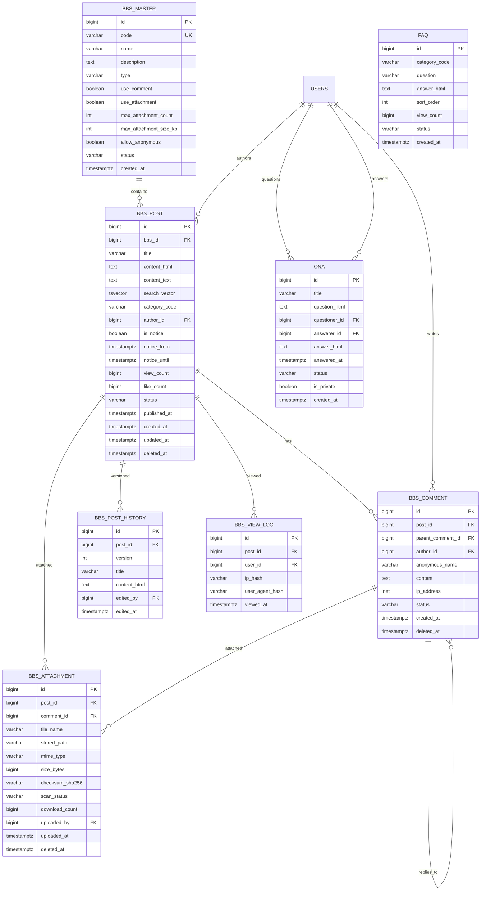
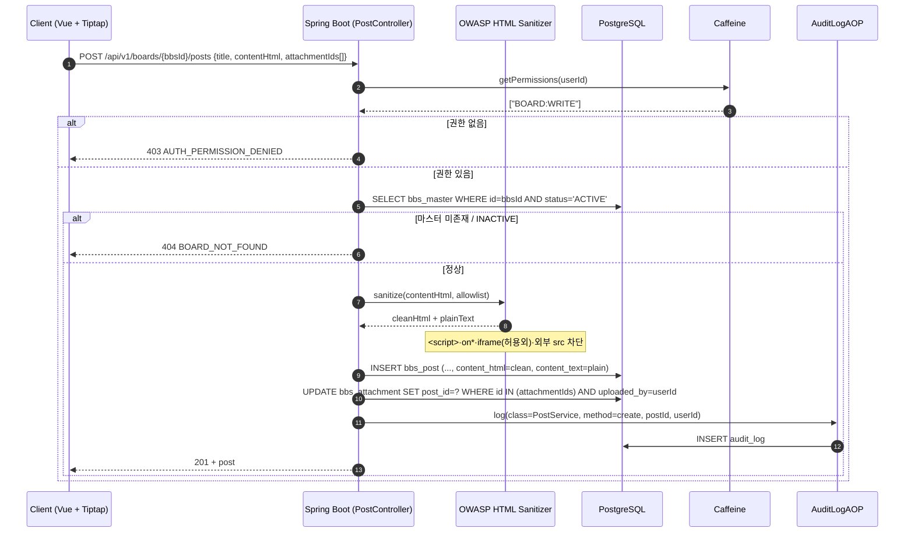
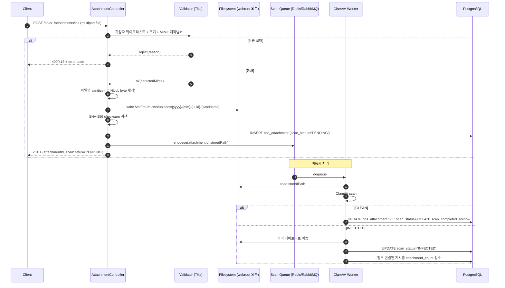
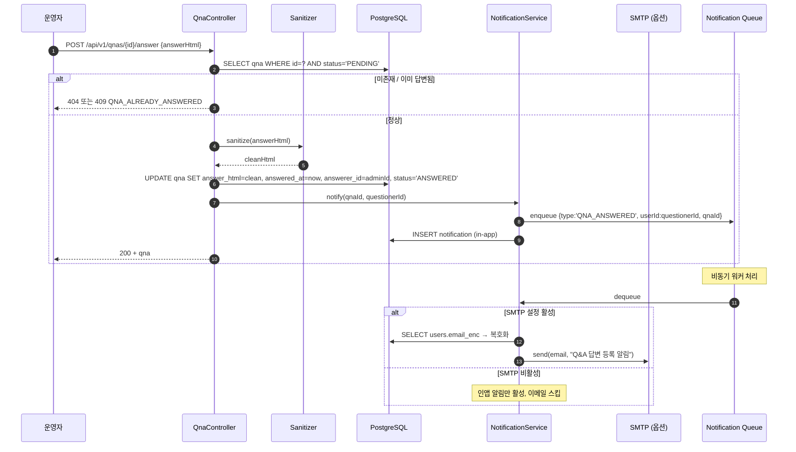

# SPEC-CMS-003: 게시판·공지·Q&A·FAQ 상세 (Bundle B — Boards, Announcements, FAQ, Q&A)

## 1. 개요

| 항목 | 내용 |
|------|------|
| SPEC ID | SPEC-CMS-003 |
| 제목 | 게시판·공지·Q&A·FAQ 상세 (Bundle B — Boards, Announcements, FAQ, Q&A) |
| 부모 SPEC | SPEC-CMS-001 (Umbrella) |
| 동급 SPEC | SPEC-CMS-002 (회원·권한 Bundle A) — 권한 검사 흐름 의존 |
| 작성일 | 2026-04-29 |
| 최종 수정 | 2026-04-29 (v0.4 — Spring Boot 3.5.9 + 운영 결정 통합 — SPEC-CMS-001 v0.4 §20 부록 참조) |
| 작성자 | manager-spec (MoAI) |
| 상태 | Implemented |
| 우선순위 | P0 (A에 의존, A와 병렬로 C/D 진행 가능) |
| 분류 | Detail SPEC |
| egov 차용 모듈 | cop/bbs(일반게시판), cop/ntc(공지사항), cop/com/faq(FAQ), cop/com/qna(Q&A), cop/cmm/fms(첨부파일) |
| 기존 비즈패스파인더 차용 모듈 | 발간자료(자료실), 설문조사 — RFP §10.1 기반 |

본 SPEC은 SPEC-CMS-001 §6.2 REQ-BOARD-001~010 및 §6.5 REQ-CROSS-002·004·005 횡단 관심사를 Bundle B 범위로 상세화한다. 게시판 마스터, 게시글, 댓글, 첨부파일, 공지사항, FAQ, Q&A의 모든 REST API, DDL, 시퀀스, 권한 매트릭스, 보안 정책(특히 XSS·파일 업로드)을 구현 단계 의사결정 수준까지 확정한다.

**v0.2 보강 (2026-04-29)**: RFP 분석을 통해 도출된 SFR-014(다중 게시판 유형), 기존 비즈패스파인더 발간자료/설문조사 모듈, SFR-008(Q&A 답변 적기 알림)을 §15(RFP 통합 신규 요구사항)로 추가했다. 기존 §1~§14는 보존되며, 신규 REQ-BOARD-011-D ~ REQ-BOARD-014-D은 SPEC-CMS-001 v0.2 §15.2 SFR-014/SFR-008 매핑에 정렬한다.

---

## 2. 참조 문서

- 부모 SPEC: `.moai/specs/SPEC-CMS-001/spec.md` §6.2 (REQ-BOARD-*), §6.5 (REQ-CROSS-002·004·005), §7.2, §8.2
- 부모 인수기준: `.moai/specs/SPEC-CMS-001/acceptance.md` B. (REQ-BOARD-*)
- 동급 SPEC: `.moai/specs/SPEC-CMS-002/spec.md` §8 (권한 매트릭스 — 본 SPEC에서 게시판 컨텍스트로 확장), §6 (인증·권한 API 패턴 재사용), §9.5 (감사로그 항목)
- 기술 스택 (FROZEN): `.moai/project/tech.md`
- 본 SPEC 연구 노트: `research.md` (동일 디렉토리, 8개 섹션)

---

## 3. 범위 및 비범위

### 3.1 범위 (1차 출시 포함)

- 일반 게시판(NORMAL) 마스터 정의 + 게시글 CRUD + 페이징·검색
- 공지사항(NOTICE) — 일반 게시판의 특수 형태(상단 고정·노출 기간)
- FAQ — 카테고리·정렬·검색
- Q&A — 질문/답변 워크플로우 + 비공개(작성자만 공개) 게시글
- 댓글 + 1단계 대댓글 (대대댓글은 비범위)
- 익명 댓글 (게시판 마스터에서 활성 시)
- 첨부파일 업로드 (확장자·크기·MIME 매직넘버 검증)
- 첨부파일 보안 다운로드 (서명 URL 15분 TTL, 권한 재검증)
- 위지윅 에디터 본문 XSS sanitize (서버측, OWASP HTML Sanitizer)
- PostgreSQL Full-Text Search (제목·본문) — 1차 N-gram(`pg_trgm`) 기반
- 게시글 변경 이력 (post_history)
- 조회 이력 기록 (view_log) — 중복 방지 + 통계용
- 답변 등록 시 인앱 알림 + 이메일 알림 (SMTP 연동 시)
- 감사로그 자동 적재 (REQ-CROSS-004 AOP 기반)

### 3.2 비범위 (Out of Scope)

| 항목 | 사유 |
|------|------|
| 실시간 채팅 / 실시간 게시판 | 1차 비목표, WebSocket 별도 SPEC |
| AI 기반 추천·자동 분류·요약 | SPEC-CMS-001 §3.2 비목표 |
| 음성·동영상 첨부파일 트랜스코딩 | 1차 미지원 (mime allowlist에서 제외) |
| 청크/재개 가능 업로드 (tus.io) | 1차는 단순 multipart, 후속 SPEC |
| Elasticsearch 기반 검색 | 1차 PostgreSQL FTS, 10만건 초과 시 후속 |
| 한글 형태소 분석기 (mecab-ko, Nori) | 1차 N-gram, 정확도 부족 시 후속 |
| 추천/좋아요 알고리즘 | 1차는 단순 like_count 카운터만 |
| 게시글 외부 공유(SNS 자동 포스팅) | 1차 미지원 |
| 신고·모더레이션 워크플로우 | 1차는 운영자 수동 hidden 처리만 |
| 다국어 게시글 본문 | 1차는 게시판 마스터 name만 i18n, 게시글 본문은 단일 언어 |

---

## 4. 데이터 모델 (DDL + ERD)

### 4.1 ERD



### 4.2 테이블 명세 (PostgreSQL 16 Flyway V1 호환 DDL)

#### 4.2.1 `bbs_master` (게시판 마스터)

```sql
CREATE TABLE bbs_master (
    id                       BIGINT GENERATED ALWAYS AS IDENTITY PRIMARY KEY,
    code                     VARCHAR(50)  NOT NULL UNIQUE,
    name                     VARCHAR(200) NOT NULL,
    description              TEXT,
    type                     VARCHAR(20)  NOT NULL,
    use_comment              BOOLEAN      NOT NULL DEFAULT TRUE,
    use_attachment           BOOLEAN      NOT NULL DEFAULT TRUE,
    max_attachment_count     INT          NOT NULL DEFAULT 5,
    max_attachment_size_kb   INT          NOT NULL DEFAULT 10240,
    allow_anonymous          BOOLEAN      NOT NULL DEFAULT FALSE,
    allow_secret             BOOLEAN      NOT NULL DEFAULT FALSE,
    page_size                INT          NOT NULL DEFAULT 20,
    role_required_read       VARCHAR(50),
    role_required_write      VARCHAR(50),
    status                   VARCHAR(20)  NOT NULL DEFAULT 'ACTIVE',
    metadata                 JSONB,
    created_at               TIMESTAMPTZ  NOT NULL DEFAULT CURRENT_TIMESTAMP,
    updated_at               TIMESTAMPTZ  NOT NULL DEFAULT CURRENT_TIMESTAMP,
    CONSTRAINT chk_bbs_master_type   CHECK (type   IN ('NORMAL','NOTICE','FAQ','QNA','GALLERY')),
    CONSTRAINT chk_bbs_master_status CHECK (status IN ('ACTIVE','INACTIVE'))
);
CREATE INDEX idx_bbs_master_status ON bbs_master(status);
CREATE INDEX idx_bbs_master_type   ON bbs_master(type) WHERE status = 'ACTIVE';
COMMENT ON COLUMN bbs_master.allow_secret IS 'Q&A 등 비공개 게시글 허용';
COMMENT ON COLUMN bbs_master.metadata     IS '확장용 jsonb (다국어 name, 커스텀 정책 등)';
```

#### 4.2.2 `bbs_post` (게시글)

```sql
CREATE TABLE bbs_post (
    id              BIGINT GENERATED ALWAYS AS IDENTITY PRIMARY KEY,
    bbs_id          BIGINT       NOT NULL REFERENCES bbs_master(id) ON DELETE RESTRICT,
    title           VARCHAR(500) NOT NULL,
    content_html    TEXT         NOT NULL,
    content_text    TEXT         NOT NULL,
    search_vector   TSVECTOR,
    category_code   VARCHAR(50),
    author_id       BIGINT       REFERENCES users(id) ON DELETE SET NULL,
    author_name     VARCHAR(100),
    is_notice       BOOLEAN      NOT NULL DEFAULT FALSE,
    notice_from     TIMESTAMPTZ,
    notice_until    TIMESTAMPTZ,
    is_secret       BOOLEAN      NOT NULL DEFAULT FALSE,
    view_count      BIGINT       NOT NULL DEFAULT 0,
    like_count      BIGINT       NOT NULL DEFAULT 0,
    comment_count   INT          NOT NULL DEFAULT 0,
    attachment_count INT         NOT NULL DEFAULT 0,
    status          VARCHAR(20)  NOT NULL DEFAULT 'PUBLISHED',
    published_at    TIMESTAMPTZ,
    created_at      TIMESTAMPTZ  NOT NULL DEFAULT CURRENT_TIMESTAMP,
    updated_at      TIMESTAMPTZ  NOT NULL DEFAULT CURRENT_TIMESTAMP,
    deleted_at      TIMESTAMPTZ,
    CONSTRAINT chk_bbs_post_status CHECK (status IN ('DRAFT','PUBLISHED','HIDDEN','DELETED')),
    CONSTRAINT chk_bbs_post_notice_period CHECK (
      notice_until IS NULL OR notice_from IS NULL OR notice_until > notice_from
    )
);

-- 활성 게시글 인덱스 (대부분의 조회는 PUBLISHED + deleted_at IS NULL)
CREATE INDEX idx_bbs_post_active ON bbs_post(bbs_id, created_at DESC)
  WHERE status = 'PUBLISHED' AND deleted_at IS NULL;
CREATE INDEX idx_bbs_post_notice_active ON bbs_post(bbs_id, notice_from, notice_until)
  WHERE is_notice = TRUE AND status = 'PUBLISHED' AND deleted_at IS NULL;
CREATE INDEX idx_bbs_post_author    ON bbs_post(author_id, created_at DESC);
CREATE INDEX idx_bbs_post_category  ON bbs_post(bbs_id, category_code) WHERE deleted_at IS NULL;

-- 풀텍스트 검색 GIN 인덱스 (research.md §4·§5 참조)
CREATE INDEX idx_bbs_post_search_vector ON bbs_post USING GIN (search_vector);

-- search_vector 자동 업데이트 트리거 (간이 N-gram 보조용)
CREATE OR REPLACE FUNCTION bbs_post_search_vector_update() RETURNS trigger AS $$
BEGIN
  NEW.search_vector :=
    setweight(to_tsvector('simple', COALESCE(NEW.title, '')), 'A') ||
    setweight(to_tsvector('simple', COALESCE(NEW.content_text, '')), 'B');
  RETURN NEW;
END $$ LANGUAGE plpgsql;

CREATE TRIGGER trg_bbs_post_search_vector
BEFORE INSERT OR UPDATE OF title, content_text ON bbs_post
FOR EACH ROW EXECUTE FUNCTION bbs_post_search_vector_update();

-- 한글 N-gram 보조 인덱스(pg_trgm)는 research.md §5의 권장 옵션
CREATE EXTENSION IF NOT EXISTS pg_trgm;
CREATE INDEX idx_bbs_post_title_trgm ON bbs_post USING GIN (title gin_trgm_ops);
```

비고:
- `content_html`: OWASP HTML Sanitizer 적용 후 저장 (research.md §1).
- `content_text`: HTML 태그 제거된 plain text — 검색용.
- `is_secret`: 작성자·운영자만 조회 가능 (REQ-BOARD-008-D-3, REQ-BOARD-010-D-1).
- `is_notice`/`notice_from`/`notice_until`: 공지사항 상단 고정 (REQ-BOARD-006-D).
- `comment_count`/`attachment_count`/`view_count`/`like_count`: 비정규화 카운터(트리거로 동기화 또는 batch 보정).
- soft delete: `deleted_at IS NOT NULL` 시 일반 사용자 조회에서 제외.

#### 4.2.3 `bbs_comment` (댓글 + 1단계 대댓글)

```sql
CREATE TABLE bbs_comment (
    id                BIGINT GENERATED ALWAYS AS IDENTITY PRIMARY KEY,
    post_id           BIGINT       NOT NULL REFERENCES bbs_post(id) ON DELETE CASCADE,
    parent_comment_id BIGINT       REFERENCES bbs_comment(id) ON DELETE CASCADE,
    author_id         BIGINT       REFERENCES users(id) ON DELETE SET NULL,
    anonymous_name    VARCHAR(100),
    anonymous_pwd_hash VARCHAR(60),
    content           TEXT         NOT NULL,
    ip_address        INET,
    status            VARCHAR(20)  NOT NULL DEFAULT 'VISIBLE',
    created_at        TIMESTAMPTZ  NOT NULL DEFAULT CURRENT_TIMESTAMP,
    updated_at        TIMESTAMPTZ  NOT NULL DEFAULT CURRENT_TIMESTAMP,
    deleted_at        TIMESTAMPTZ,
    CONSTRAINT chk_comment_status   CHECK (status IN ('VISIBLE','HIDDEN','DELETED')),
    CONSTRAINT chk_comment_identity CHECK (
      author_id IS NOT NULL OR (anonymous_name IS NOT NULL AND anonymous_pwd_hash IS NOT NULL)
    )
);
CREATE INDEX idx_bbs_comment_post   ON bbs_comment(post_id, created_at) WHERE deleted_at IS NULL;
CREATE INDEX idx_bbs_comment_parent ON bbs_comment(parent_comment_id) WHERE parent_comment_id IS NOT NULL;
CREATE INDEX idx_bbs_comment_author ON bbs_comment(author_id, created_at DESC);

-- 1단계 대댓글 강제(자식의 자식 금지)
CREATE OR REPLACE FUNCTION bbs_comment_depth_check() RETURNS trigger AS $$
DECLARE parent_parent BIGINT;
BEGIN
  IF NEW.parent_comment_id IS NOT NULL THEN
    SELECT parent_comment_id INTO parent_parent FROM bbs_comment WHERE id = NEW.parent_comment_id;
    IF parent_parent IS NOT NULL THEN
      RAISE EXCEPTION 'COMMENT_DEPTH_EXCEEDED: 1단계 대댓글까지만 허용';
    END IF;
  END IF;
  RETURN NEW;
END $$ LANGUAGE plpgsql;
CREATE TRIGGER trg_bbs_comment_depth BEFORE INSERT ON bbs_comment
FOR EACH ROW EXECUTE FUNCTION bbs_comment_depth_check();
```

비고:
- 익명 댓글: `author_id` NULL + `anonymous_name`·`anonymous_pwd_hash`(BCrypt) 필수. 본인 삭제 시 비밀번호 검증.
- 1단계 대댓글: trigger로 자식의 자식 INSERT 차단.

#### 4.2.4 `bbs_attachment` (첨부파일)

```sql
CREATE TABLE bbs_attachment (
    id                BIGINT GENERATED ALWAYS AS IDENTITY PRIMARY KEY,
    post_id           BIGINT       REFERENCES bbs_post(id) ON DELETE CASCADE,
    comment_id        BIGINT       REFERENCES bbs_comment(id) ON DELETE CASCADE,
    file_name         VARCHAR(500) NOT NULL,
    stored_path       VARCHAR(500) NOT NULL UNIQUE,
    mime_type         VARCHAR(150) NOT NULL,
    size_bytes        BIGINT       NOT NULL,
    checksum_sha256   VARCHAR(64)  NOT NULL,
    scan_status       VARCHAR(20)  NOT NULL DEFAULT 'PENDING',
    scan_completed_at TIMESTAMPTZ,
    download_count    BIGINT       NOT NULL DEFAULT 0,
    uploaded_by       BIGINT       REFERENCES users(id) ON DELETE SET NULL,
    uploaded_at       TIMESTAMPTZ  NOT NULL DEFAULT CURRENT_TIMESTAMP,
    deleted_at        TIMESTAMPTZ,
    CONSTRAINT chk_att_size CHECK (size_bytes > 0 AND size_bytes <= 104857600),
    CONSTRAINT chk_att_scan CHECK (scan_status IN ('PENDING','CLEAN','INFECTED','SCAN_FAILED','SKIPPED')),
    CONSTRAINT chk_att_owner CHECK (
      (post_id IS NOT NULL AND comment_id IS NULL) OR
      (post_id IS NULL AND comment_id IS NOT NULL) OR
      (post_id IS NULL AND comment_id IS NULL)  -- 임시 업로드(연결 전)
    )
);
CREATE INDEX idx_attachment_post     ON bbs_attachment(post_id) WHERE deleted_at IS NULL;
CREATE INDEX idx_attachment_comment  ON bbs_attachment(comment_id) WHERE deleted_at IS NULL;
CREATE INDEX idx_attachment_uploaded ON bbs_attachment(uploaded_at DESC);
CREATE INDEX idx_attachment_pending  ON bbs_attachment(scan_status, uploaded_at)
  WHERE scan_status = 'PENDING';
COMMENT ON COLUMN bbs_attachment.stored_path     IS 'webroot 외부 절대 경로 또는 객체 스토리지 키';
COMMENT ON COLUMN bbs_attachment.checksum_sha256 IS '업로드 시점 SHA-256, 다운로드 검증에 사용';
```

비고:
- `stored_path`: webroot 외부 디렉터리(`/var/iroum-cms/uploads/{yyyy}/{mm}/{uuid}`)에 저장. UUID 기반 파일명으로 경로 추측 방지.
- `scan_status`: 비동기 바이러스 스캔(research.md §3) — PENDING → CLEAN/INFECTED 전이. INFECTED는 즉시 격리.
- `chk_att_size`: 절대 상한 100MB(절대 한도). 게시판별 실효 한도는 `bbs_master.max_attachment_size_kb` 사용.

#### 4.2.5 `faq` (FAQ)

```sql
CREATE TABLE faq (
    id            BIGINT GENERATED ALWAYS AS IDENTITY PRIMARY KEY,
    category_code VARCHAR(50)  NOT NULL,
    question      VARCHAR(500) NOT NULL,
    answer_html   TEXT         NOT NULL,
    answer_text   TEXT         NOT NULL,
    sort_order    INT          NOT NULL DEFAULT 0,
    view_count    BIGINT       NOT NULL DEFAULT 0,
    status        VARCHAR(20)  NOT NULL DEFAULT 'PUBLISHED',
    metadata      JSONB,
    created_by    BIGINT       REFERENCES users(id) ON DELETE SET NULL,
    created_at    TIMESTAMPTZ  NOT NULL DEFAULT CURRENT_TIMESTAMP,
    updated_at    TIMESTAMPTZ  NOT NULL DEFAULT CURRENT_TIMESTAMP,
    deleted_at    TIMESTAMPTZ,
    CONSTRAINT chk_faq_status CHECK (status IN ('PUBLISHED','HIDDEN','DELETED'))
);
CREATE INDEX idx_faq_category ON faq(category_code, sort_order)
  WHERE status = 'PUBLISHED' AND deleted_at IS NULL;
CREATE INDEX idx_faq_question_trgm ON faq USING GIN (question gin_trgm_ops);
```

비고: `category_code`는 `code` 테이블(SPEC-CMS-005에서 정의 예정)의 그룹 `FAQ_CATEGORY` 참조. 1차에서는 단순 문자열 컬럼.

#### 4.2.6 `qna` (Q&A)

```sql
CREATE TABLE qna (
    id            BIGINT GENERATED ALWAYS AS IDENTITY PRIMARY KEY,
    title         VARCHAR(500) NOT NULL,
    question_html TEXT         NOT NULL,
    question_text TEXT         NOT NULL,
    questioner_id BIGINT       NOT NULL REFERENCES users(id) ON DELETE RESTRICT,
    answerer_id   BIGINT       REFERENCES users(id) ON DELETE SET NULL,
    answer_html   TEXT,
    answer_text   TEXT,
    answered_at   TIMESTAMPTZ,
    is_private    BOOLEAN      NOT NULL DEFAULT FALSE,
    status        VARCHAR(20)  NOT NULL DEFAULT 'PENDING',
    metadata      JSONB,
    created_at    TIMESTAMPTZ  NOT NULL DEFAULT CURRENT_TIMESTAMP,
    updated_at    TIMESTAMPTZ  NOT NULL DEFAULT CURRENT_TIMESTAMP,
    deleted_at    TIMESTAMPTZ,
    CONSTRAINT chk_qna_status     CHECK (status IN ('PENDING','ANSWERED','CLOSED','HIDDEN')),
    CONSTRAINT chk_qna_answer_set CHECK (
      (status = 'PENDING' AND answer_html IS NULL) OR
      (status IN ('ANSWERED','CLOSED') AND answer_html IS NOT NULL AND answered_at IS NOT NULL)
    )
);
CREATE INDEX idx_qna_status_created ON qna(status, created_at DESC) WHERE deleted_at IS NULL;
CREATE INDEX idx_qna_questioner     ON qna(questioner_id, created_at DESC);
CREATE INDEX idx_qna_answerer       ON qna(answerer_id) WHERE answerer_id IS NOT NULL;
CREATE INDEX idx_qna_title_trgm     ON qna USING GIN (title gin_trgm_ops);
```

#### 4.2.7 `bbs_post_history` (게시글 변경 이력)

```sql
CREATE TABLE bbs_post_history (
    id           BIGINT GENERATED ALWAYS AS IDENTITY PRIMARY KEY,
    post_id      BIGINT       NOT NULL REFERENCES bbs_post(id) ON DELETE CASCADE,
    version      INT          NOT NULL,
    title        VARCHAR(500) NOT NULL,
    content_html TEXT         NOT NULL,
    edited_by    BIGINT       REFERENCES users(id) ON DELETE SET NULL,
    edit_reason  VARCHAR(200),
    edited_at    TIMESTAMPTZ  NOT NULL DEFAULT CURRENT_TIMESTAMP,
    UNIQUE (post_id, version)
);
CREATE INDEX idx_post_history_post ON bbs_post_history(post_id, version DESC);
```

비고: 게시글 UPDATE 직전 SELECT 후 history INSERT(트리거 또는 Service 레이어). 1차는 Service에서 명시적 적재.

#### 4.2.8 `bbs_view_log` (조회 이력)

```sql
CREATE TABLE bbs_view_log (
    id              BIGINT GENERATED ALWAYS AS IDENTITY PRIMARY KEY,
    post_id         BIGINT       NOT NULL REFERENCES bbs_post(id) ON DELETE CASCADE,
    user_id         BIGINT       REFERENCES users(id) ON DELETE SET NULL,
    ip_hash         VARCHAR(64)  NOT NULL,
    user_agent_hash VARCHAR(64)  NOT NULL,
    viewed_at       TIMESTAMPTZ  NOT NULL DEFAULT CURRENT_TIMESTAMP
);
CREATE INDEX idx_view_log_post_time ON bbs_view_log(post_id, viewed_at DESC);
CREATE INDEX idx_view_log_user_time ON bbs_view_log(user_id, viewed_at DESC) WHERE user_id IS NOT NULL;
-- 동일 사용자(또는 IP+UA) 1시간 내 중복 조회 차단용 부분 인덱스
CREATE INDEX idx_view_log_dedupe ON bbs_view_log(post_id, COALESCE(user_id, 0), ip_hash, viewed_at DESC);
```

비고:
- `ip_hash` = SHA-256(salt + ip): 개인정보 보호(평문 IP 미저장).
- 중복 조회 방지: 같은 (post_id, user_id|ip_hash) 조합이 1시간 내 존재 시 view_count 증가 생략.
- 보존: 90일 후 삭제(통계용 집계는 별도 daily 테이블로 이관 — 후속 SPEC).

### 4.3 인덱스 전략 정리

| 핫 패스 | 인덱스 | 비고 |
|---------|--------|------|
| 게시판 목록 (PUBLISHED) | `idx_bbs_post_active(bbs_id, created_at DESC)` 부분 인덱스 | deleted_at IS NULL + status = PUBLISHED |
| 공지 상단 고정 | `idx_bbs_post_notice_active(bbs_id, notice_from, notice_until)` 부분 | is_notice = TRUE 한정 |
| 본문 검색 | `idx_bbs_post_search_vector` GIN | tsvector(simple) |
| 한글 부분일치 | `idx_bbs_post_title_trgm` GIN(pg_trgm) | research.md §5 |
| 댓글 트리 | `idx_bbs_comment_post(post_id, created_at)` | parent_comment_id 별도 |
| 권한 점검 | `bbs_master.role_required_*` + `users` 조인 | SPEC-CMS-002 user_roles |
| 첨부 스캔 큐 | `idx_attachment_pending(scan_status, uploaded_at)` 부분 | scan_status='PENDING' |

### 4.4 PostgreSQL 16 특화

- `TSVECTOR` + `GIN` 인덱스: 본문 검색 (10만건까지 권장).
- `pg_trgm` 확장: 한글 부분일치 보조 (research.md §5 권장 1차안).
- `JSONB metadata`: 게시판 마스터 다국어 name, FAQ 메타, QnA 라벨 등 확장용.
- `INET` 타입: ip_address 정규화 저장(View Log는 hash 사용).
- `TIMESTAMPTZ`: 모든 시간 컬럼 통일 (서버 TZ Asia/Seoul, DB 저장 UTC).

---

## 5. 요구사항 (EARS 상세화)

> 각 항목은 SPEC-CMS-001 §6.2 REQ-BOARD-001~010을 sub-requirement(D-N)로 분해한 것이다. 본 SPEC의 모든 sub-REQ는 acceptance.md에 G/W/T로 매핑된다.

### 5.1 REQ-BOARD-001-D: 게시판 마스터 정의 (REQ-BOARD-001 상세화)

- **REQ-BOARD-001-D-1 (마스터 생성 — Event-driven)**
  CONTENT_ADMIN 또는 SYSADMIN이 `POST /api/v1/boards`에 (code, name, type, use_comment, use_attachment, max_attachment_count, max_attachment_size_kb, allow_anonymous, allow_secret, page_size, role_required_read, role_required_write)를 보냈을 때, 시스템은 (a) code 유일성 검증 (b) type 화이트리스트 검증 (c) 첨부파일 한도(개수≤20, 용량≤102400KB) 검증 후 `bbs_master`에 행을 INSERT하고 201을 반환해야 한다.
- **REQ-BOARD-001-D-2 (마스터 수정 — Event-driven)**
  관리자가 `PUT /api/v1/boards/{id}`로 마스터 속성을 수정했을 때, 시스템은 code·type 변경을 거부하고(이미 게시글이 적재되어 있을 수 있음), 나머지 속성만 갱신해야 한다.
- **REQ-BOARD-001-D-3 (마스터 비활성화 — Event-driven)**
  관리자가 `DELETE /api/v1/boards/{id}`를 호출했을 때, 시스템은 status='INACTIVE'로 soft 비활성화해야 하며, 게시글 데이터는 보존해야 한다.
- **REQ-BOARD-001-D-4 (게시판 정책 적용 — State-driven)**
  게시판이 `use_comment=FALSE`인 동안, 시스템은 댓글 API 호출에 400 `BOARD_COMMENT_DISABLED`를 반환해야 한다. `use_attachment=FALSE`도 동일하게 적용.
- **REQ-BOARD-001-D-5 (다국어 마스터명 — Optional)**
  마스터의 `metadata.i18n_name = {"ko":"...","en":"..."}` 가 설정된 경우, 시스템은 응답 시 Accept-Language 헤더에 따라 적절한 name을 반환해야 한다(미설정 시 기본 name).

### 5.2 REQ-BOARD-002-D: 게시글 CRUD (REQ-BOARD-002 상세화)

- **REQ-BOARD-002-D-1 (게시글 작성 — Event-driven)**
  인증 사용자가 `POST /api/v1/boards/{bbsId}/posts`에 (title, contentHtml, categoryCode?, isSecret?, attachmentIds[]) 를 보냈을 때, 시스템은 (a) 게시판 권한 검증 (b) contentHtml을 OWASP HTML Sanitizer로 정화 (c) content_text 추출 (d) `bbs_post`에 INSERT (e) 임시 업로드된 첨부파일을 post_id에 연결해야 한다.
- **REQ-BOARD-002-D-2 (게시글 목록 — Event-driven)**
  사용자가 `GET /api/v1/boards/{bbsId}/posts?page=&size=&sort=&keyword=&category=&from=&to=` 를 호출했을 때, 시스템은 status=PUBLISHED + deleted_at IS NULL 조건으로 페이징 결과를 반환해야 하며, is_notice=TRUE이고 노출 기간 내 게시글은 페이지 0 상단에 별도 노출해야 한다.
- **REQ-BOARD-002-D-3 (게시글 상세 — Event-driven)**
  사용자가 `GET /api/v1/posts/{id}`를 호출했을 때, 시스템은 (a) 권한 검증 (b) is_secret=TRUE면 작성자·운영자만 허용 (c) view_log dedupe 후 view_count 증가 (d) 본문·첨부파일 메타·댓글 카운트를 응답해야 한다.
- **REQ-BOARD-002-D-4 (게시글 수정 — Event-driven)**
  작성자 또는 운영자가 `PUT /api/v1/posts/{id}`를 호출했을 때, 시스템은 (a) 수정 직전 본문을 `bbs_post_history`에 보존 (b) version을 증가 (c) sanitize 재적용 후 갱신해야 한다.
- **REQ-BOARD-002-D-5 (게시글 삭제 — Event-driven)**
  작성자·운영자가 `DELETE /api/v1/posts/{id}`를 호출했을 때, 시스템은 soft delete로 status='DELETED', deleted_at=now 설정해야 하며, 첨부파일은 30일 보존 후 batch 정리.

### 5.3 REQ-BOARD-003-D: 댓글 (REQ-BOARD-003 상세화)

- **REQ-BOARD-003-D-1 (댓글 작성 — Event-driven)**
  인증 사용자가 `POST /api/v1/posts/{id}/comments`에 (content, parentCommentId?) 를 보냈을 때, 시스템은 (a) 게시판 use_comment 확인 (b) parent 존재 검증 + 1단계 제한 trigger (c) `bbs_comment` INSERT (d) `bbs_post.comment_count` 증가해야 한다.
- **REQ-BOARD-003-D-2 (대댓글 — Event-driven)**
  parentCommentId가 다른 대댓글인 경우, 시스템은 trigger를 통해 `COMMENT_DEPTH_EXCEEDED` 예외로 거부해야 한다.
- **REQ-BOARD-003-D-3 (댓글 수정 — Event-driven)**
  작성자가 `PUT /api/v1/comments/{id}`로 content를 수정했을 때, 시스템은 작성 후 1시간 이내인 경우만 허용하고, 이후엔 거부해야 한다.
- **REQ-BOARD-003-D-4 (댓글 삭제 — Event-driven)**
  작성자·운영자가 `DELETE /api/v1/comments/{id}`를 호출했을 때, 시스템은 soft delete + content를 "삭제된 댓글입니다"로 마스킹해야 하며, 자식 대댓글은 유지해야 한다.
- **REQ-BOARD-003-D-5 (익명 댓글 — Optional)**
  게시판이 `allow_anonymous=TRUE`인 경우, 시스템은 비인증 요청에 대해 `anonymous_name`과 `anonymous_password`(BCrypt 저장)를 받아 댓글을 등록할 수 있어야 하며, 본인 삭제 시 비밀번호 검증을 강제해야 한다.

### 5.4 REQ-BOARD-004-D: 첨부파일 업로드 (REQ-BOARD-004 상세화)

- **REQ-BOARD-004-D-1 (확장자 화이트리스트 — Ubiquitous)**
  시스템은 첨부파일 업로드 시 확장자 화이트리스트(jpg, jpeg, png, gif, webp, pdf, hwp, hwpx, doc, docx, xls, xlsx, ppt, pptx, txt, csv, zip)에 포함된 파일만 수락하고, 미포함 시 400 `FILE_EXTENSION_NOT_ALLOWED`를 반환해야 한다.
- **REQ-BOARD-004-D-2 (MIME 매직넘버 검증 — Ubiquitous)**
  시스템은 파일 업로드 시 Apache Tika 또는 file magic으로 실제 MIME 타입을 검사하고, 확장자와 매직넘버 불일치 시 400 `FILE_MIME_MISMATCH`를 반환해야 한다 (.exe를 .txt로 위장 차단).
- **REQ-BOARD-004-D-3 (크기 제한 — Ubiquitous)**
  시스템은 게시판 마스터의 `max_attachment_size_kb`를 초과한 파일을 413 `FILE_SIZE_EXCEEDED`로 거부해야 한다.
- **REQ-BOARD-004-D-4 (파일명 sanitize — Ubiquitous)**
  시스템은 업로드 파일명에서 경로 탐색 패턴(`../`, `..\\`), NULL 바이트(`\0`), 제어 문자(0x00~0x1F)를 제거해야 한다. 결과 파일명이 비어 있으면 400 `FILE_NAME_INVALID`를 반환해야 한다.
- **REQ-BOARD-004-D-5 (저장 + 비동기 스캔 — Event-driven)**
  검증을 통과했을 때, 시스템은 (a) UUID 기반 stored_path로 webroot 외부 디렉토리에 저장 (b) SHA-256 checksum 계산 (c) `bbs_attachment` INSERT(scan_status='PENDING') (d) 비동기 큐(research.md §3)에 스캔 작업 enqueue해야 한다.

### 5.5 REQ-BOARD-005-D: 첨부파일 보안 다운로드 (REQ-BOARD-005 상세화)

- **REQ-BOARD-005-D-1 (서명 URL 발급 — Event-driven)**
  인증 사용자가 `POST /api/v1/attachments/{id}/download-url`을 호출했을 때, 시스템은 (a) 첨부 소속 게시글 권한 검증 (b) scan_status='CLEAN' 확인 (c) HMAC-SHA256으로 서명된 단기 URL(TTL 15분)을 발급해야 한다.
- **REQ-BOARD-005-D-2 (서명 URL 검증 — Event-driven)**
  클라이언트가 `GET /api/v1/attachments/{id}/download?token=&expires=&sig=`을 호출했을 때, 시스템은 (a) sig HMAC 재계산 일치 검증 (b) expires 미만료 검증 (c) 사용자 컨텍스트와 token 매칭을 검증해야 하며, 실패 시 403을 반환해야 한다.
- **REQ-BOARD-005-D-3 (Content-Disposition — Event-driven)**
  검증 통과 시, 시스템은 RFC 5987 인코딩으로 한글 파일명을 안전하게 응답 헤더에 설정하고(`filename*=UTF-8''...`), `download_count`를 1 증가시켜야 한다.
- **REQ-BOARD-005-D-4 (감사로그 적재 — Ubiquitous)**
  모든 다운로드 요청은 audit_log에 (userId, attachmentId, postId, ip, ua, success) 기록되어야 한다 (REQ-CROSS-004).
- **REQ-BOARD-005-D-5 (스캔 미완료 차단 — State-driven)**
  scan_status가 'PENDING' 또는 'INFECTED'인 동안, 시스템은 다운로드 URL 발급을 거부하고 423 `FILE_NOT_READY` 또는 451 `FILE_INFECTED`를 반환해야 한다.

### 5.6 REQ-BOARD-006-D: 공지사항 (REQ-BOARD-006 상세화)

- **REQ-BOARD-006-D-1 (공지 등록 — Event-driven)**
  CONTENT_ADMIN이 `POST /api/v1/boards/{bbsId}/posts`에 `isNotice=true, noticeFrom, noticeUntil`을 포함해 보냈을 때, 시스템은 noticeFrom < noticeUntil을 검증하고 게시글을 NOTICE로 등록해야 한다.
- **REQ-BOARD-006-D-2 (목록 노출 — State-driven)**
  현재 시각이 `notice_from <= now < notice_until`인 동안, 시스템은 공지 게시글을 목록 응답의 별도 `notices[]` 배열로 분리하여 상단에 렌더링되도록 반환해야 한다.
- **REQ-BOARD-006-D-3 (만료 자동 해제 — State-driven)**
  notice_until이 과거인 동안, 시스템은 해당 게시글을 일반 정렬로 노출해야 한다 (별도 batch 불필요, 조회 시 시간 비교).
- **REQ-BOARD-006-D-4 (공지 게시판 타입 — Ubiquitous)**
  시스템은 type=NOTICE 게시판의 게시글에 대해 기본 `is_notice=TRUE`로 처리하고, NORMAL 타입에서도 운영자 권한이 있으면 개별 공지 등록을 허용해야 한다.

### 5.7 REQ-BOARD-007-D: FAQ (REQ-BOARD-007 상세화)

- **REQ-BOARD-007-D-1 (FAQ 등록 — Event-driven)**
  CONTENT_ADMIN이 `POST /api/v1/faqs`에 (categoryCode, question, answerHtml, sortOrder) 를 보냈을 때, 시스템은 answerHtml을 sanitize 후 `faq` 테이블에 INSERT해야 한다.
- **REQ-BOARD-007-D-2 (카테고리 조회 — Event-driven)**
  사용자가 `GET /api/v1/faqs?category=ACCOUNT&page=&size=` 를 호출했을 때, 시스템은 status=PUBLISHED + 카테고리 일치 + sort_order ASC 정렬로 페이징 응답해야 한다.
- **REQ-BOARD-007-D-3 (FAQ 검색 — Event-driven)**
  사용자가 `GET /api/v1/faqs?keyword=비밀번호` 를 호출했을 때, 시스템은 question + answer_text에 대한 trigram 부분일치 검색 결과를 반환해야 한다.
- **REQ-BOARD-007-D-4 (정렬 변경 — Event-driven)**
  CONTENT_ADMIN이 `PUT /api/v1/faqs/reorder`에 `[{id, sortOrder}]` 배열을 보냈을 때, 시스템은 단일 트랜잭션으로 sort_order를 일괄 갱신해야 한다.

### 5.8 REQ-BOARD-008-D: Q&A (REQ-BOARD-008 상세화)

- **REQ-BOARD-008-D-1 (질문 등록 — Event-driven)**
  인증 사용자가 `POST /api/v1/qnas`에 (title, questionHtml, isPrivate) 를 보냈을 때, 시스템은 sanitize 후 status='PENDING'으로 INSERT하고 questioner_id를 현재 사용자로 설정해야 한다.
- **REQ-BOARD-008-D-2 (답변 등록 — Event-driven)**
  CONTENT_ADMIN이 `POST /api/v1/qnas/{id}/answer`에 (answerHtml) 를 보냈을 때, 시스템은 answer_html sanitize, status='ANSWERED', answered_at=now, answerer_id=현재 사용자로 갱신하고 알림을 enqueue해야 한다.
- **REQ-BOARD-008-D-3 (비공개 게시글 접근 제어 — State-driven)**
  Q&A 게시글이 `is_private=TRUE`인 동안, 시스템은 questioner_id 또는 CONTENT_ADMIN/SYSADMIN 역할 사용자만 조회를 허용하고, 그 외에는 404 `QNA_NOT_FOUND`를 반환해야 한다(403 대신 존재 자체를 숨김).
- **REQ-BOARD-008-D-4 (답변 알림 — Event-driven)**
  status가 PENDING → ANSWERED로 전환되었을 때, 시스템은 (a) 인앱 알림(notification 테이블 또는 큐) 적재 (b) SMTP 설정 활성 시 이메일 발송을 비동기로 처리해야 한다(SMTP 미설정 시 인앱만).
- **REQ-BOARD-008-D-5 (Q&A 종결 — Event-driven)**
  questioner 또는 admin이 `POST /api/v1/qnas/{id}/close`를 호출했을 때, 시스템은 status='CLOSED'로 전환해야 한다(추가 답변 수정 차단).

### 5.9 REQ-BOARD-009-D: 검색·필터링 (REQ-BOARD-002의 검색 측면 상세화)

- **REQ-BOARD-009-D-1 (제목·본문 검색 — Event-driven)**
  사용자가 keyword 파라미터를 보냈을 때, 시스템은 (a) keyword 길이 ≥ 2자 검증 (b) `search_vector @@ plainto_tsquery('simple', :keyword)` 우선 (c) 결과 부족 시 `title ILIKE '%keyword%'` (pg_trgm) 보조 적용해야 한다.
- **REQ-BOARD-009-D-2 (카테고리 필터 — Event-driven)**
  사용자가 category 파라미터를 보냈을 때, 시스템은 `category_code = :category` 조건을 추가해야 한다.
- **REQ-BOARD-009-D-3 (기간 필터 — Event-driven)**
  사용자가 from·to 파라미터(ISO-8601 날짜)를 보냈을 때, 시스템은 `created_at BETWEEN :from AND :to` 조건을 적용해야 한다.
- **REQ-BOARD-009-D-4 (작성자 필터 — Event-driven)**
  사용자가 authorId 파라미터를 보냈을 때, 시스템은 `author_id = :authorId` 조건을 추가해야 한다.
- **REQ-BOARD-009-D-5 (검색 하이라이트 — Optional)**
  검색 응답이 활성화된 경우, 시스템은 `ts_headline()`을 사용해 매치 위치를 `<mark>` 태그로 강조한 발췌문(snippet)을 추가 필드로 반환할 수 있어야 한다.

### 5.10 REQ-BOARD-010-D: 페이징·정렬 (REQ-BOARD-002의 페이징 측면 상세화)

- **REQ-BOARD-010-D-1 (페이지 파라미터 — Ubiquitous)**
  시스템은 모든 목록 API에서 `?page={0~}&size={1~100}&sort={field,asc|desc}` 형식을 지원해야 하며, size 한도는 100, 기본값은 게시판 마스터의 `page_size` 또는 20이어야 한다.
- **REQ-BOARD-010-D-2 (정렬 화이트리스트 — Ubiquitous)**
  시스템은 정렬 가능 필드를 화이트리스트(createdAt, viewCount, likeCount, title)로 제한하고, 그 외 필드 요청에는 400 `INVALID_SORT_FIELD`를 반환해야 한다(SQL Injection 방어).
- **REQ-BOARD-010-D-3 (응답 메타데이터 — Ubiquitous)**
  시스템은 페이징 응답에 `{content[], page, size, totalElements, totalPages, first, last}` 메타데이터를 포함해야 한다.
- **REQ-BOARD-010-D-4 (커서 페이징 — Optional)**
  대용량(>10만건) 게시판의 경우, 시스템은 `?cursor={createdAt|id}` 형식의 커서 페이징을 옵션으로 지원할 수 있다(1차 미적용, 후속).

---

## 6. REST API 명세

> 모든 API는 `application/json` 또는 `multipart/form-data`(업로드만). 인증 호출은 `Authorization: Bearer {accessToken}`. 에러: `{ "code": "...", "message": "...", "traceId": "..." }`. 권한 컬럼은 SPEC-CMS-002 `permissions` 테이블의 권한 코드 사용.

### 6.1 게시판 마스터 API (관리자)

| 메서드 | 경로 | 권한 | 요청 | 응답 200/201 | 매핑 REQ |
|--------|------|------|------|--------------|----------|
| GET    | `/api/v1/boards` | `BOARD:READ` | `?page=&size=&type=&status=` | 마스터 목록 | 6.1 |
| GET    | `/api/v1/boards/{id}` | `BOARD:READ` | — | 마스터 상세 | 6.1 |
| POST   | `/api/v1/boards` | `BOARD:ADMIN` | 마스터 생성 페이로드 | 201 + `{id}` | 001-D-1 |
| PUT    | `/api/v1/boards/{id}` | `BOARD:ADMIN` | 수정 페이로드(code/type 제외) | 마스터 | 001-D-2 |
| DELETE | `/api/v1/boards/{id}` | `BOARD:ADMIN` | — | 204 (soft inactivate) | 001-D-3 |

응답 예시(`POST /api/v1/boards`):

```json
{
  "id": 12,
  "code": "notice_general",
  "name": "일반 공지사항",
  "type": "NOTICE",
  "useComment": false,
  "useAttachment": true,
  "maxAttachmentCount": 5,
  "maxAttachmentSizeKb": 10240,
  "allowAnonymous": false,
  "allowSecret": false,
  "pageSize": 20,
  "status": "ACTIVE"
}
```

### 6.2 게시글 API

| 메서드 | 경로 | 권한 | 요청 | 응답 | 매핑 REQ |
|--------|------|------|------|------|----------|
| GET  | `/api/v1/boards/{bbsId}/posts` | `BOARD:READ` (또는 익명, 게시판 정책) | `?page=&size=&sort=&keyword=&category=&from=&to=&authorId=` | `{notices:[],content:[],page,size,totalElements}` | 002-D-2, 009-D-* |
| GET  | `/api/v1/posts/{id}` | `BOARD:READ` (private면 작성자/관리자) | — | 상세 + 첨부메타 + 댓글 카운트 | 002-D-3 |
| POST | `/api/v1/boards/{bbsId}/posts` | `BOARD:WRITE` | `{title,contentHtml,categoryCode?,isSecret?,isNotice?,noticeFrom?,noticeUntil?,attachmentIds[]}` | 201 + 게시글 | 002-D-1, 006-D-1 |
| PUT  | `/api/v1/posts/{id}` | 작성자 또는 `BOARD:ADMIN` | 수정 페이로드 | 갱신된 게시글 | 002-D-4 |
| DELETE | `/api/v1/posts/{id}` | 작성자 또는 `BOARD:ADMIN` | — | 204 (soft delete) | 002-D-5 |
| GET  | `/api/v1/posts/{id}/history` | 작성자 또는 `BOARD:ADMIN` | — | 이력 목록 | 002-D-4 |
| POST | `/api/v1/posts/{id}/like` | 인증 사용자 | — | `{likeCount}` | (옵션) |

Audit log: 생성·수정·삭제·다운로드·뷰 모두 적재 (REQ-CROSS-004).

### 6.3 댓글 API

| 메서드 | 경로 | 권한 | 요청 | 응답 | 매핑 REQ |
|--------|------|------|------|------|----------|
| GET    | `/api/v1/posts/{id}/comments` | `BOARD:READ` | `?page=&size=` | 댓글 트리(최대 1단계) | 003-D-1 |
| POST   | `/api/v1/posts/{id}/comments` | 인증(또는 익명-허용 시) | `{content, parentCommentId?, anonymousName?, anonymousPassword?}` | 201 + 댓글 | 003-D-1, 003-D-2, 003-D-5 |
| PUT    | `/api/v1/comments/{id}` | 작성자 (1시간 내) | `{content}` | 갱신 댓글 | 003-D-3 |
| DELETE | `/api/v1/comments/{id}` | 작성자/관리자/익명+비번 | `?password=` (익명 시) | 204 (soft) | 003-D-4 |

### 6.4 첨부파일 API

| 메서드 | 경로 | 권한 | 요청 | 응답 | 매핑 REQ |
|--------|------|------|------|------|----------|
| POST | `/api/v1/attachments/init` | `BOARD:WRITE` | multipart `file=...` (단건) | 201 + `{attachmentId, scanStatus:PENDING}` | 004-D-1~5 |
| POST | `/api/v1/attachments/{id}/download-url` | `BOARD:READ` (게시글 권한) | — | `{url, expiresAt}` (TTL 15분 서명 URL) | 005-D-1, 005-D-5 |
| GET  | `/api/v1/attachments/{id}/download?token=&expires=&sig=` | 서명 URL 보유 | — | 200 + Content-Disposition + 파일 스트림 | 005-D-2~4 |
| DELETE | `/api/v1/attachments/{id}` | 업로더 또는 `BOARD:ADMIN` | — | 204 | 004-D-5 |

업로드 검증 실패 응답:
- 400 `FILE_EXTENSION_NOT_ALLOWED` / `FILE_MIME_MISMATCH` / `FILE_NAME_INVALID`
- 413 `FILE_SIZE_EXCEEDED`
- 451 `FILE_INFECTED` (스캔 후 비동기로 게시글에서 자동 분리)
- 423 `FILE_NOT_READY` (스캔 PENDING 상태에서 다운로드 시도)

### 6.5 공지사항 API

공지사항은 `bbs_master.type='NOTICE'`인 게시판에서 6.2 게시글 API를 그대로 사용한다. 추가 엔드포인트:

| 메서드 | 경로 | 권한 | 비고 |
|--------|------|------|------|
| GET | `/api/v1/notices/active` | 익명 허용 | 모든 NOTICE 타입 게시판에서 현재 활성 공지를 통합 조회 |
| PUT | `/api/v1/posts/{id}/notice` | `BOARD:ADMIN` | `{isNotice, noticeFrom, noticeUntil}` 만 수정 |

### 6.6 FAQ API

| 메서드 | 경로 | 권한 | 요청/응답 | 매핑 REQ |
|--------|------|------|-----------|----------|
| GET    | `/api/v1/faqs` | 익명 허용 | `?category=&keyword=&page=&size=` → 페이징 결과 | 007-D-2, 007-D-3 |
| GET    | `/api/v1/faqs/{id}` | 익명 허용 | 상세 + view_count 증가 | — |
| POST   | `/api/v1/faqs` | `CONTENT:WRITE` | `{categoryCode, question, answerHtml, sortOrder}` | 007-D-1 |
| PUT    | `/api/v1/faqs/{id}` | `CONTENT:WRITE` | 수정 페이로드 | — |
| DELETE | `/api/v1/faqs/{id}` | `CONTENT:WRITE` | 204 (soft) | — |
| PUT    | `/api/v1/faqs/reorder` | `CONTENT:WRITE` | `[{id, sortOrder}]` 배열, 단일 TX | 007-D-4 |
| GET    | `/api/v1/faqs/categories` | 익명 허용 | 카테고리별 카운트 | 007-D-2 |

### 6.7 Q&A API

| 메서드 | 경로 | 권한 | 요청/응답 | 매핑 REQ |
|--------|------|------|-----------|----------|
| GET    | `/api/v1/qnas` | 인증 (목록) | `?status=&isPrivate=&keyword=&page=&size=` (private은 본인+admin만 표시) | 008-D-3 |
| GET    | `/api/v1/qnas/{id}` | 인증 (private는 본인/admin) | 상세 | 008-D-3 |
| POST   | `/api/v1/qnas` | 인증 | `{title, questionHtml, isPrivate}` | 008-D-1 |
| POST   | `/api/v1/qnas/{id}/answer` | `CONTENT:WRITE` | `{answerHtml}` → status='ANSWERED' + 알림 | 008-D-2, 008-D-4 |
| POST   | `/api/v1/qnas/{id}/close` | questioner 또는 admin | — → status='CLOSED' | 008-D-5 |
| DELETE | `/api/v1/qnas/{id}` | questioner (PENDING만) 또는 admin | 204 | — |

### 6.8 검색 API (통합)

| 메서드 | 경로 | 권한 | 요청/응답 | 매핑 REQ |
|--------|------|------|-----------|----------|
| GET | `/api/v1/search` | 익명 허용 (공개 게시판만) | `?q=&types=POST,FAQ,QNA&page=&size=` → 통합 검색 결과 | 009-D-1~5 |

응답 구조:

```json
{
  "results": [
    { "type": "POST", "id": 123, "title": "...", "snippet": "...<mark>키워드</mark>...", "boardCode": "notice", "createdAt": "..." },
    { "type": "FAQ",  "id":  45, "title": "...", "snippet": "...", "categoryCode": "ACCOUNT" },
    { "type": "QNA",  "id":  78, "title": "...", "snippet": "...", "status": "ANSWERED" }
  ],
  "totalElements": 312, "page": 0, "size": 20
}
```

---

## 7. 시퀀스 다이어그램 (Mermaid)

### 7.1 게시글 작성 → XSS sanitize → DB 저장



### 7.2 첨부파일 업로드 → 검증 → 비동기 스캔



### 7.3 첨부파일 다운로드 → 권한 검사 → 서명 URL 발급

```mermaid
sequenceDiagram
  autonumber
  participant C as Client
  participant API as AttachmentController
  participant Cache as Caffeine
  participant DB as PostgreSQL
  participant FS as Filesystem
  participant Audit as AuditLogAOP

  C->>API: POST /api/v1/attachments/{id}/download-url
  API->>DB: SELECT bbs_attachment a JOIN bbs_post p ON a.post_id=p.id
  alt scan_status != 'CLEAN'
    API-->>C: 423 FILE_NOT_READY 또는 451 FILE_INFECTED
  else 정상
    API->>Cache: getPermissions(userId)
    API->>API: 게시글 read 권한 + private 검증
    alt 권한 없음
      API-->>C: 403 또는 404 (private은 404)
    else 통과
      API->>API: token=randomUUID; expires=now+15m
      API->>API: sig=HMAC-SHA256(secret, attachmentId|userId|expires|token)
      API-->>C: 200 + {url:"/api/v1/attachments/{id}/download?token=&expires=&sig=", expiresAt}
    end
  end

  Note over C: 사용자가 다운로드 링크 클릭
  C->>API: GET /api/v1/attachments/{id}/download?token=&expires=&sig=
  API->>API: HMAC 재계산 + expires 검증 + token 매칭
  alt 검증 실패
    API-->>C: 403 SIGNATURE_INVALID 또는 EXPIRED
  else 통과
    API->>FS: read storedPath (stream)
    API->>DB: UPDATE bbs_attachment SET download_count=download_count+1
    API->>Audit: log(method=download, attachmentId, userId, ip)
    API-->>C: 200 + Content-Disposition: attachment; filename*=UTF-8''... + body
  end
```

### 7.4 Q&A 답변 등록 → 알림 발송



---

## 8. 에디터·콘텐츠 보안 정책

### 8.1 허용 HTML 태그 화이트리스트 (OWASP HTML Sanitizer 정책)

```
PolicyFactory POLICY = new HtmlPolicyBuilder()
  .allowElements("p","br","span","div","strong","em","u","s","blockquote","pre","code",
                  "h1","h2","h3","h4","h5","h6",
                  "ul","ol","li",
                  "a","img","table","thead","tbody","tr","th","td","caption")
  .allowAttributes("href").matching(SCHEMES_HTTP_HTTPS_MAILTO).onElements("a")
  .allowAttributes("src","alt","title","width","height").onElements("img")
  .allowAttributes("colspan","rowspan").onElements("td","th")
  .allowAttributes("class").matching(CLASS_ALLOWLIST).onElements("p","span","div","table")
  .requireRelNofollowOnLinks()
  .toFactory();
```

- 일반 사용자: 위 정책 그대로 적용
- CONTENT_ADMIN: `<iframe>`(YouTube/Vimeo만, sandbox 강제) + 추가 클래스 허용 (정책 별도 인스턴스)
- 모든 사용자: `<script>`, `<object>`, `<embed>`, `<form>`, `<input>` 영구 차단

### 8.2 금지 패턴 (모든 권한)

| 패턴 | 처리 |
|------|------|
| `<script>...</script>` | 제거 |
| `<iframe>` (CONTENT_ADMIN 외) | 제거 |
| `javascript:` URL | 제거 (href·src) |
| `on*` 이벤트 핸들러 (onload, onclick, onerror 등) | 속성 제거 |
| `data:` URI (이미지 외) | 제거. 이미지 data URI는 50KB 한도 |
| `vbscript:`, `file:` URL | 제거 |
| 외부 도메인 `` (관리자 외) | 제거 또는 사이트 자산으로 마이그레이션 권장 |
| `style` 속성 (전체) | 제거 (CSS injection 방어) |

### 8.3 이미지 외부 URL 차단

- 일반 사용자: 모든 외부 이미지 src 차단 → 게시판 첨부파일 시스템(`/api/v1/attachments/{id}`)으로 강제
- CONTENT_ADMIN: 화이트리스트 도메인(예: `youtube.com`, `vimeo.com`)만 허용
- 추적 픽셀 방지: 1×1 크기 외부 이미지 추가 차단(server-side 리라이팅)

### 8.4 첨부파일 위치 정책

| 항목 | 정책 |
|------|------|
| 저장 위치 | webroot 외부 절대 경로(`/var/iroum-cms/uploads/`), nginx 정적 서빙 차단 |
| 파일명 | UUID v4 + 확장자(safe). 원본 파일명은 DB의 `file_name` 컬럼만 |
| 디렉터리 | `{yyyy}/{mm}/` 분기 (한 디렉토리 ≤ 1만 파일 권장) |
| 권한 | 600 (소유자 read/write only). 백엔드 프로세스 user만 접근 |
| 스캔 격리 | INFECTED 파일은 `/var/iroum-cms/quarantine/`로 이동 + 감사로그 |

### 8.5 MIME 매직넘버 검증 (Apache Tika)

- 1차 방어: 확장자 화이트리스트
- 2차 방어: Apache Tika `MimeTypes.detect()` 또는 `Files.probeContentType()`
- 3차 검증: 확장자와 매직넘버 결과 매핑 테이블 비교(예: `.png` ↔ `image/png`만 허용). 불일치 시 거부.
- ZIP 내부 압축 검사(zip bomb 방지): 압축 해제 시 비율 ≥ 1:100이거나 총 해제 크기 > 1GB 시 거부.

### 8.6 파일명 sanitize 정책

```
String safe = original
  .replaceAll("[\\\\/:*?\"<>|]", "_")       // OS 금지 문자
  .replaceAll("\\.{2,}", ".")               // .. 패턴 제거
  .replaceAll("^[.\\s]+", "")               // 선두 . 또는 whitespace
  .replaceAll("\\p{Cntrl}", "")             // 제어 문자 (NULL byte 포함)
  .substring(0, Math.min(255, original.length()));
if (safe.isBlank()) throw new FileNameInvalidException();
```

저장 경로는 항상 `uuid-{safe}` 형태로 두 단계 안전 보장.

---

## 9. 권한 매트릭스 (게시판 컨텍스트)

> SPEC-CMS-002 §8 기본 매트릭스를 게시판 타입별로 확장. 기본 정의는 SPEC-CMS-002 참조.

| 액션 \ 역할 | SYSADMIN | CONTENT_ADMIN | USER (인증) | 익명 |
|-------------|:--:|:--:|:--:|:--:|
| **NORMAL — 일반 게시판** | | | | |
| 마스터 CRUD | ✓ | ✓ | × | × |
| 게시글 목록 조회 | ✓ | ✓ | ✓ | ✓ (공개 마스터만) |
| 게시글 상세 | ✓ | ✓ | ✓ | ✓ (공개 마스터만) |
| 게시글 작성/수정/삭제 | ✓ | ✓ | ✓ (본인) | × |
| 댓글 작성 | ✓ | ✓ | ✓ | △ (allow_anonymous 시) |
| 댓글 수정 | ✓ | × | ✓ (본인 1시간 내) | △ (본인 비번) |
| 댓글 삭제 | ✓ | ✓ | ✓ (본인) | △ (본인 비번) |
| 첨부 업로드 | ✓ | ✓ | ✓ | × |
| 첨부 다운로드 | ✓ | ✓ | ✓ | ✓ (공개 게시글만) |
| **NOTICE — 공지사항** | | | | |
| 게시글 작성 | ✓ | ✓ | × | × |
| 상단 고정 설정 | ✓ | ✓ | × | × |
| 게시글 조회 | ✓ | ✓ | ✓ | ✓ |
| 댓글 (정책상 보통 비활성) | — | — | — | — |
| **FAQ** | | | | |
| 등록·수정·삭제·정렬 | ✓ | ✓ | × | × |
| 조회 | ✓ | ✓ | ✓ | ✓ |
| **QNA — Q&A** | | | | |
| 질문 등록 | ✓ | ✓ | ✓ | × |
| 답변 등록 | ✓ | ✓ | × | × |
| 자기 질문 조회 | ✓ | ✓ | ✓ | × |
| 타인 공개 질문 조회 | ✓ | ✓ | ✓ | × |
| 타인 비공개 질문 조회 | ✓ | ✓ | × | × |
| Q&A 종결 | ✓ | ✓ | ✓ (본인) | × |

비고:
- `△`: 조건부 허용 (마스터 정책 또는 본인 비밀번호 검증 시).
- "공개 마스터": `role_required_read`가 NULL 또는 ANONYMOUS 허용된 게시판.
- 권한 캐시·메뉴 연동은 SPEC-CMS-002 §5.8 (REQ-AUTH-008-D) 사용.

---

## 10. 검색 정책

### 10.1 PostgreSQL Full-Text Search (1차 기본)

- 데이터: `bbs_post.search_vector` (TSVECTOR), `to_tsvector('simple', title) || to_tsvector('simple', content_text)`
- 인덱스: `idx_bbs_post_search_vector` (GIN)
- 검색 쿼리:
  ```sql
  SELECT id, title, ts_headline('simple', content_text, q, 'MaxFragments=2,MinWords=5,MaxWords=20') AS snippet
  FROM bbs_post, plainto_tsquery('simple', :keyword) q
  WHERE search_vector @@ q
    AND status = 'PUBLISHED' AND deleted_at IS NULL
  ORDER BY ts_rank_cd(search_vector, q) DESC, created_at DESC
  LIMIT :size OFFSET :offset;
  ```
- `'simple'` 사전 사용: 한글에는 영문 stop-word/stemming이 적용되지 않으므로 안전.

### 10.2 한글 부분일치 보조 (pg_trgm)

- FTS가 한글 형태소 분석 없이 토큰화에 약하므로, 검색어 길이 < 3자 또는 FTS 결과 부족 시 trigram 보조 검색:
  ```sql
  SELECT id, title FROM bbs_post
  WHERE (title ILIKE '%' || :keyword || '%' OR content_text ILIKE '%' || :keyword || '%')
    AND status = 'PUBLISHED' AND deleted_at IS NULL
  ORDER BY similarity(title, :keyword) DESC
  LIMIT :size;
  ```
- 1차안. 정확도 부족 시 `mecab-ko` 또는 ES 도입 (research.md §4·§5).

### 10.3 페이징·정렬·하이라이트

- 페이징: `LIMIT :size OFFSET :offset` (size ≤ 100). 대용량은 keyset/cursor (010-D-4, 후속).
- 정렬 화이트리스트: createdAt, viewCount, likeCount, title (010-D-2).
- 하이라이트: `ts_headline()` 또는 응용 레이어에서 `<mark>` 삽입 (009-D-5, Optional).

---

## 11. 성능 요구사항

| 항목 | 목표 | 측정 조건 |
|------|------|-----------|
| 게시글 목록 p95 | < 300ms | 1만 건 데이터, page=0~10, JMeter 50 동시 사용자 |
| 게시글 상세 p95 | < 200ms | view_log dedupe 포함 |
| 첨부파일 다운로드 시작 | < 500ms | 권한 검증 + 서명 URL 검증, 파일 스트리밍 시작까지 |
| 검색 p95 | < 500ms | 10만 건, FTS keyword length 2~50 |
| 댓글 트리 로드 p95 | < 250ms | 게시글 당 댓글 100건 |
| 첨부 업로드 (10MB) | < 3s (50% 업로드 + 검증 + 스캔 enqueue 시간) |
| 부하 한계 | 동시 200 사용자 | LCP·응답시간 정책 유지 |

---

## 12. 비기능·접근성·다국어

### 12.1 접근성 (KWCAG 2.2 AA, REQ-CROSS-001 연동)

- 게시판 표: `<table>`에 `<caption>` 필수, 헤더 `<th scope>` 명시.
- 페이징: `aria-label="페이지 이동"`, 현재 페이지 `aria-current="page"`.
- 에디터 (Tiptap): 키보드 단축키 100% 지원, 툴바 버튼 `aria-label` 한국어, 포커스 표시 4.5:1 색대비.
- 첨부 다운로드 링크: `aria-describedby`로 파일 크기·확장자 보조.

### 12.2 다국어

- 게시판 마스터 name: `metadata.i18n_name = {"ko":"공지사항","en":"Notices"}` 형식 (REQ-BOARD-001-D-5).
- FAQ 카테고리: 코드만 정규화(`code` 테이블), 라벨은 i18n 메시지 리소스에서 lookup.
- 에러 메시지: REQ-CROSS-006(`messages_ko/en.properties`) 사용.
- 게시글 본문 번역: 1차 비범위 (단일 언어).

### 12.3 감사·개인정보

- 모든 게시글·댓글 C/U/D는 `audit_log` 적재 (REQ-CROSS-004).
- 댓글 IP는 `inet`로 저장(72시간 보존 후 마스킹). View Log는 SHA-256 해시(REQ-CROSS-002 정신 준수).
- 익명 댓글 비밀번호는 BCrypt 해시 저장 (PIA 대응).

---

## 13. 위험 및 대응

| ID | 위험 | 영향 | 완화 방안 |
|----|------|------|----------|
| RB-01 | XSS — 위지윅 본문 통한 스크립트 삽입 | 세션 탈취·CSRF | OWASP HTML Sanitizer 서버측 강제 + 출력 escape + CSP 헤더 (script-src self만) |
| RB-02 | CSRF — JSON API 외 multipart/form 업로드 | 강제 업로드 | JWT Bearer 강제(쿠키 인증 미사용), Origin 헤더 검증, multipart도 Authorization 헤더 필수 |
| RB-03 | 파일 폭탄 (zip bomb / 거대 압축 해제) | 디스크·CPU 고갈 | 압축 비율 ≥ 1:100 또는 해제 크기 > 1GB 거부, ClamAV 옵션 활성 |
| RB-04 | 악성 파일 우회 (확장자 위장) | 멀웨어 배포 | 확장자 화이트리스트 + Tika 매직넘버 + ClamAV 비동기 스캔(§8.5) |
| RB-05 | 다운로드 권한 우회 (URL 직접 접근) | 비공개 게시글 첨부 유출 | 서명 URL HMAC + TTL 15분 + scan_status 검증 + 게시글 권한 재검증 |
| RB-06 | DoS — 검색·목록 무한 스크롤 abuse | DB 과부하 | size ≤ 100 강제, IP 분당 60 회 RateLimit (Bucket4j), 캐시 적용 |
| RB-07 | 권한 상승 — Q&A 비공개 게시글 ID 추측 | 정보 유출 | 비공개 게시글은 미보유 시 404 반환(403 대신, 008-D-3) |
| RB-08 | SQL Injection — 정렬 파라미터 | 데이터 유출 | sort 화이트리스트 + 파라미터 바인딩(MyBatis #{}) (010-D-2) |
| RB-09 | 댓글 스팸·플러드 | UX 저하·DB 폭증 | 사용자별 분당 5회·IP 분당 30회 + 익명 댓글 캡차(후속) |
| RB-10 | 첨부 무결성 손상 | 다운로드 변조 | SHA-256 checksum 저장 + 다운로드 시 검증(샘플링), 정기 batch full check |

---

## 14. RFP 통합 신규 요구사항 (v0.2)

> 본 절은 RFP(`.moai/refs/rfp-summary.md`) §1 SFR-008(적기 알림 게이트) 및 §10.1 기존 비즈패스파인더 차용 모듈, SPEC-CMS-001 v0.2 §15.2 SFR-014(다중 게시판 유형) 매핑에 따라 추가된 sub-REQ다. 기존 §5의 REQ-BOARD-001-D~010-D는 보존되며, 신규 011-D~014-D는 본 절에서만 정의된다.

### 14.1 REQ-BOARD-011-D 게시판 유형 enum 확장 (SPEC-CMS-001 v0.2 §15.2 SFR-014 매핑)

기존 `bbs_master.type` enum(NORMAL, NOTICE, FAQ, QNA, GALLERY)을 RFP 다중 게시판 유형 요구에 맞춰 7종으로 확장한다.

- **REQ-BOARD-011-D-1 (enum 확장 — Ubiquitous)**
  시스템은 `bbs_master.type`을 (NORMAL, NOTICE, QNA, FAQ, GALLERY, PUBLICATION, SURVEY)의 7개 값만 허용해야 한다. CHECK 제약은 `chk_bbs_master_type` 명칭을 유지하되 enum 목록을 위 7개로 갱신한다.
- **REQ-BOARD-011-D-2 (유형별 템플릿 매핑 — Ubiquitous)**
  시스템은 게시판 유형별 화면 레이아웃·기본 컬럼 정의를 위해 `bbs_type_template` 테이블(type, layout_template_id, default_columns jsonb, default_sort, default_filter jsonb)을 보유해야 한다. 마스터 조회 응답 시 type에 매칭되는 템플릿 메타를 함께 반환해야 한다.
- **REQ-BOARD-011-D-3 (유형별 정렬·필터 기본값 — State-driven)**
  type=NOTICE인 게시판은 기본 정렬을 `is_notice DESC, notice_from DESC, created_at DESC`로 적용하고, type=GALLERY는 기본 레이아웃을 그리드(3열)로, type=PUBLICATION은 `publication_year DESC, publication_month DESC` 정렬을, type=SURVEY는 `start_at DESC` 정렬을 기본으로 사용해야 한다.
- **REQ-BOARD-011-D-4 (게시판 유형 변경 제한 — Unwanted/State-driven)**
  특정 게시판에 활성 게시글(`bbs_post.status='PUBLISHED'` AND `deleted_at IS NULL`)이 1건이라도 존재하는 동안, 시스템은 `PUT /api/v1/boards/{id}`로 type 변경을 시도하는 요청을 400 `BOARD_TYPE_CHANGE_BLOCKED`로 거부해야 한다. (기존 REQ-BOARD-001-D-2는 code/type을 모두 거부했으므로 본 sub-REQ는 그 사유를 명시화한다.)

### 14.2 REQ-BOARD-012-D 발간자료(자료실) (RFP §10.1 기존 비즈패스파인더 발간자료 모듈 차용)

연도·월·문서종류·카테고리 트리·다운로드 통계·다중 첨부 압축 다운로드를 지원하는 PUBLICATION 유형 게시판의 도메인 확장.

- **REQ-BOARD-012-D-1 (발간자료 메타 컬럼 — Ubiquitous)**
  시스템은 type=PUBLICATION 게시판의 게시글에 대해 `publication_year SMALLINT`, `publication_month SMALLINT`, `document_type VARCHAR(30)` (REPORT, BROCHURE, RESEARCH, GUIDE, OTHER), `file_count INT NOT NULL DEFAULT 0` 컬럼을 `bbs_post.metadata JSONB` 또는 별도 `bbs_post_publication_meta` 테이블로 보존해야 한다(권장: 별도 테이블, 1:1 FK).
- **REQ-BOARD-012-D-2 (카테고리 트리 — Ubiquitous)**
  시스템은 발간자료 카테고리를 `publication_category(id, code, name, parent_id, sort_order, depth)` 자기참조 인접리스트(Adjacency List)로 보유하고, depth ≤ 3을 INSERT 트리거로 강제해야 한다. 게시글은 `bbs_post.publication_category_id` FK를 통해 단일 leaf 카테고리에 매핑된다.
- **REQ-BOARD-012-D-3 (다운로드 통계 집계 — Event-driven)**
  발간자료 첨부파일 다운로드가 성공했을 때, 시스템은 `publication_download_stat(post_id, attachment_id, day, month, download_count)` 테이블에 일별/월별 카운터를 UPSERT 갱신해야 한다(`ON CONFLICT (post_id, attachment_id, day) DO UPDATE`).
- **REQ-BOARD-012-D-4 (압축 다운로드 — Event-driven)**
  사용자가 `POST /api/v1/posts/{id}/download-zip {attachmentIds:[...]}`을 호출하면, 시스템은 (a) 모든 첨부의 게시글 read 권한 + scan_status='CLEAN' 검증 (b) 합계 용량 ≤ 500MB 검증 (c) 합계 ≤ 50MB는 동기 zip 패키징 응답, > 50MB는 비동기 작업 큐에 enqueue하고 202 + `{jobId}`를 반환한 뒤 완료 시 서명 URL을 알림으로 발송해야 한다(research.md §9.2).
  **v0.2.1 (사용자 결정 2026-04-29 Q-5 적용) — zip 보존 정책**: 생성된 zip 파일은 `publication_zip_archive` 디렉터리(LocalFileSystemStorage 경로 `${storage.publication-zip.root}` — SPEC-CMS-001 v0.3.1 Q-2 LocalFS 단일 결정과 정합)에 보관하며, **7일 후 자동 삭제** 정책을 적용한다(cron `0 0 * * *` 매일 0시 정리 배치 `PublicationZipExpireJob`). 사용자는 보존 기간 내에는 동일 `download_id`(UUID)로 재접근 가능하며 재접근 시 `download_count++` UPSERT 갱신된다. 만료 후 재접근 시 410 + `ZIP_EXPIRED`를 반환하고 사용자는 download-zip 엔드포인트로 재생성을 요청해야 한다.
- **REQ-BOARD-012-D-4-2 (zip 만료 자동 삭제 — Event-driven, v0.2.1 사용자 결정 2026-04-29 Q-5 적용)**
  매일 0시 정시 `PublicationZipExpireJob`(Spring `@Scheduled(cron="0 0 0 * * *")`)이 실행되었을 때, 시스템은 `publication_zip_archive` 테이블에서 `expires_at < NOW() AND deleted_at IS NULL` 조건의 row를 (a) 파일시스템에서 zip 파일 삭제 (b) `deleted_at=NOW()` UPDATE (c) `audit_log`에 `action='publication_zip_expired', entity_type='publication_zip_archive', entity_id=id, severity=INFO` 적재해야 한다. 배치 실패 시 SPEC-CMS-005 §13.2 integration_log 또는 audit_log severity=ERROR로 기록하고 다음 사이클 재시도(REQ-SYSTEM-002-D-3 정책 준용).
- **REQ-BOARD-012-D-5 (발간자료 검색 — Event-driven)**
  사용자가 `GET /api/v1/publications?year=&month=&documentType=&categoryId=&keyword=` 를 호출하면, 시스템은 모든 파라미터를 AND 조건으로 결합하여 페이징 응답해야 한다(keyword는 §10.2 trigram + FTS 동일 정책).

### 14.3 REQ-BOARD-013-D 설문조사 (RFP §10.1 기존 비즈패스파인더 설문조사 모듈 차용)

다중 질문 유형, 익명/식별 응답, 결과 통계 시각화를 지원하는 SURVEY 유형 게시판의 도메인 확장.

- **REQ-BOARD-013-D-1 (survey 마스터 — Ubiquitous)**
  시스템은 `survey(id, title VARCHAR(500), description_html TEXT, start_at TIMESTAMPTZ, end_at TIMESTAMPTZ, target_role_codes JSONB, is_anonymous BOOLEAN, max_responses INT, status VARCHAR(20))` 테이블을 보유해야 한다. status는 (DRAFT, OPEN, CLOSED, HIDDEN)을 CHECK로 강제하고, `chk_survey_period CHECK (end_at > start_at)` 제약을 적용한다.
- **REQ-BOARD-013-D-2 (survey_question — Ubiquitous)**
  시스템은 `survey_question(id, survey_id FK, question_text TEXT, question_type VARCHAR(20), required BOOLEAN, sort_order INT, options JSONB)` 테이블을 보유해야 한다. question_type은 (SINGLE, MULTI, TEXT, RATING, DATE)을 CHECK로 강제하며, `options` jsonb는 SINGLE/MULTI에 한해 `[{value, label}]` 배열을 보관한다.
- **REQ-BOARD-013-D-3 (survey_response — Ubiquitous)**
  시스템은 `survey_response(id, survey_id FK, respondent_id FK NULL, respondent_ip_hash VARCHAR(64) NOT NULL, started_at TIMESTAMPTZ, submitted_at TIMESTAMPTZ NULL)` 테이블을 보유해야 한다. `chk_response_anon CHECK (respondent_id IS NOT NULL OR respondent_ip_hash IS NOT NULL)` 제약을 두고, `is_anonymous=TRUE`인 설문은 응답 시 respondent_id를 NULL로 강제 저장한다(개인정보 분리, REQ-CROSS-002).
- **REQ-BOARD-013-D-4 (survey_answer — Ubiquitous)**
  시스템은 `survey_answer(id, response_id FK, question_id FK, answer_text TEXT, answer_options JSONB, answer_rating SMALLINT, answer_date DATE)` 테이블을 보유해야 한다. question_type별 사용 컬럼은 (SINGLE/MULTI: answer_options, TEXT: answer_text, RATING: answer_rating, DATE: answer_date)로 분기한다.
- **REQ-BOARD-013-D-5 (결과 통계 시각화 — Event-driven)**
  ADMIN이 `GET /api/v1/surveys/{id}/results`를 호출하면, 시스템은 질문별로 `{questionId, type, distribution: [{option|range, count, percentage}], totalResponses}` 구조의 응답 분포 데이터를 반환해야 한다. RATING은 1~5 분포, DATE는 일/주/월 버킷팅, TEXT는 응답 수만 집계.
- **REQ-BOARD-013-D-6 (설문 권한 — State-driven)**
  설문 작성·수정·삭제는 `CONTENT:WRITE`(EDITOR+) 이상, 응답 등록은 인증 사용자(VIEWER+) 또는 (is_anonymous=TRUE 시) 익명, 결과 조회는 `SURVEY:ADMIN`(ADMIN+)만 허용해야 한다. 설문 생애주기 외(start_at 이전 또는 end_at 이후) 응답 시도는 400 `SURVEY_PERIOD_INVALID`로 거부한다.

### 14.4 REQ-BOARD-014-D Q&A 답변 알림 연동 (SPEC-CMS-001 v0.2 §15.2 SFR-008 매핑)

기존 REQ-BOARD-008-D-4(인앱 + 이메일 알림)를 멱등성·재시도·옵트아웃 정책으로 강화한다. 카카오 알림톡은 SPEC-CMS-007(추가 알림 채널)에서 다룬다.

- **REQ-BOARD-014-D-1 (알림 발송 트리거 — Event-driven)**
  Q&A status가 PENDING → ANSWERED로 전환되었을 때, 시스템은 (a) 인앱 알림(notification 테이블)에 INSERT (b) `qna_notification_optout` 테이블에서 questioner의 EMAIL 옵트아웃 미존재 시 SMTP 큐에 enqueue (c) 양 채널 모두 `qna_notification_log` 테이블에 발송 기록을 적재해야 한다.
- **REQ-BOARD-014-D-2 (멱등성 — Ubiquitous)**
  시스템은 `qna_notification_log(qna_id, answerer_id, channel, sent_at)`에 `UNIQUE(qna_id, answerer_id, channel)` 제약을 두어 동일 답변·동일 채널 중복 발송을 차단해야 한다. 재발송 요청 시 409 `NOTIFICATION_ALREADY_SENT`를 반환한다.
- **REQ-BOARD-014-D-3 (재시도 — State-driven)**
  알림 발송이 실패한 동안(`qna_notification_log.status='FAILED'`), 시스템은 지수 백오프(1분, 2분, 4분)로 최대 3회 재시도해야 한다. 3회 모두 실패 시 status='DEAD_LETTER'로 전환하고 ADMIN에게 운영 알림을 발송한다.
- **REQ-BOARD-014-D-4 (옵트아웃 — Optional)**
  사용자가 `PUT /api/v1/me/notifications/preferences {qnaAnswer: {email: false}}`를 호출하면, 시스템은 `qna_notification_optout(user_id, channel, opted_out_at)` 테이블에 INSERT(또는 ON CONFLICT DO UPDATE)해야 한다. 인앱 채널은 옵트아웃 불가(서비스 사용 정보 분류).

---

## 15. RFP 통합 신규 테이블 (v0.2 DDL)

> 본 절은 §14 신규 sub-REQ를 지원하는 PostgreSQL 16 DDL을 정의한다. 기존 §4.2 8개 테이블에 더해 9개 테이블을 추가한다. Flyway V2_* 마이그레이션 파일로 분리 권장.

### 15.1 `bbs_type_template` (게시판 유형별 레이아웃 매핑 — REQ-BOARD-011-D-2)

```sql
CREATE TABLE bbs_type_template (
    type                VARCHAR(20)  PRIMARY KEY,
    layout_template_id  VARCHAR(50)  NOT NULL,
    default_columns     JSONB        NOT NULL,
    default_sort        VARCHAR(100) NOT NULL,
    default_filter      JSONB,
    description         TEXT,
    updated_at          TIMESTAMPTZ  NOT NULL DEFAULT CURRENT_TIMESTAMP,
    CONSTRAINT chk_type_template_type CHECK (type IN ('NORMAL','NOTICE','QNA','FAQ','GALLERY','PUBLICATION','SURVEY'))
);
INSERT INTO bbs_type_template(type, layout_template_id, default_columns, default_sort, default_filter, description) VALUES
  ('NORMAL',     'list-default',    '["title","author","createdAt","viewCount"]'::jsonb, 'createdAt,desc', NULL, '일반 게시판'),
  ('NOTICE',     'list-notice',     '["title","author","noticeFrom","noticeUntil"]'::jsonb, 'isNotice,desc;noticeFrom,desc;createdAt,desc', NULL, '공지사항'),
  ('QNA',        'list-qna',        '["title","status","createdAt","answeredAt"]'::jsonb, 'createdAt,desc', '{"status":["PENDING","ANSWERED"]}'::jsonb, 'Q&A'),
  ('FAQ',        'list-faq',        '["categoryCode","question","sortOrder"]'::jsonb, 'sortOrder,asc', NULL, 'FAQ'),
  ('GALLERY',    'grid-3col',       '["thumbnail","title","author","viewCount"]'::jsonb, 'createdAt,desc', NULL, '갤러리(그리드 3열)'),
  ('PUBLICATION','list-publication','["thumbnail","title","publicationYear","documentType","downloadCount"]'::jsonb, 'publicationYear,desc;publicationMonth,desc', NULL, '발간자료'),
  ('SURVEY',     'list-survey',     '["title","status","startAt","endAt","responseCount"]'::jsonb, 'startAt,desc', NULL, '설문조사');
```

### 15.2 `bbs_post_publication_meta` (발간자료 메타 — REQ-BOARD-012-D-1)

```sql
CREATE TABLE bbs_post_publication_meta (
    post_id                  BIGINT PRIMARY KEY REFERENCES bbs_post(id) ON DELETE CASCADE,
    publication_year         SMALLINT     NOT NULL,
    publication_month        SMALLINT,
    document_type            VARCHAR(30)  NOT NULL,
    publication_category_id  BIGINT       REFERENCES publication_category(id) ON DELETE SET NULL,
    file_count               INT          NOT NULL DEFAULT 0,
    isbn                     VARCHAR(30),
    publisher                VARCHAR(200),
    metadata                 JSONB,
    CONSTRAINT chk_pub_year     CHECK (publication_year BETWEEN 1900 AND 2100),
    CONSTRAINT chk_pub_month    CHECK (publication_month IS NULL OR publication_month BETWEEN 1 AND 12),
    CONSTRAINT chk_doc_type     CHECK (document_type IN ('REPORT','BROCHURE','RESEARCH','GUIDE','OTHER'))
);
CREATE INDEX idx_pub_meta_year_month ON bbs_post_publication_meta(publication_year DESC, publication_month DESC);
CREATE INDEX idx_pub_meta_doc_type   ON bbs_post_publication_meta(document_type);
CREATE INDEX idx_pub_meta_category   ON bbs_post_publication_meta(publication_category_id) WHERE publication_category_id IS NOT NULL;
```

### 15.3 `publication_category` (발간자료 카테고리 트리 — REQ-BOARD-012-D-2)

```sql
CREATE TABLE publication_category (
    id          BIGINT GENERATED ALWAYS AS IDENTITY PRIMARY KEY,
    code        VARCHAR(50)  NOT NULL UNIQUE,
    name        VARCHAR(200) NOT NULL,
    parent_id   BIGINT       REFERENCES publication_category(id) ON DELETE RESTRICT,
    depth       SMALLINT     NOT NULL DEFAULT 1,
    sort_order  INT          NOT NULL DEFAULT 0,
    status      VARCHAR(20)  NOT NULL DEFAULT 'ACTIVE',
    created_at  TIMESTAMPTZ  NOT NULL DEFAULT CURRENT_TIMESTAMP,
    CONSTRAINT chk_pub_cat_depth  CHECK (depth BETWEEN 1 AND 3),
    CONSTRAINT chk_pub_cat_status CHECK (status IN ('ACTIVE','INACTIVE'))
);
CREATE INDEX idx_pub_cat_parent ON publication_category(parent_id, sort_order);

-- depth 자동 계산 + 3단계 초과 차단 트리거
CREATE OR REPLACE FUNCTION publication_category_depth_check() RETURNS trigger AS $$
DECLARE parent_depth SMALLINT;
BEGIN
  IF NEW.parent_id IS NULL THEN
    NEW.depth := 1;
  ELSE
    SELECT depth INTO parent_depth FROM publication_category WHERE id = NEW.parent_id;
    IF parent_depth IS NULL THEN
      RAISE EXCEPTION 'PUBLICATION_CATEGORY_PARENT_NOT_FOUND';
    END IF;
    NEW.depth := parent_depth + 1;
    IF NEW.depth > 3 THEN
      RAISE EXCEPTION 'PUBLICATION_CATEGORY_DEPTH_EXCEEDED: 최대 3단계까지 허용';
    END IF;
  END IF;
  RETURN NEW;
END $$ LANGUAGE plpgsql;
CREATE TRIGGER trg_pub_cat_depth BEFORE INSERT OR UPDATE OF parent_id ON publication_category
FOR EACH ROW EXECUTE FUNCTION publication_category_depth_check();
```

### 15.4 `publication_download_stat` (다운로드 통계 — REQ-BOARD-012-D-3)

```sql
CREATE TABLE publication_download_stat (
    post_id         BIGINT      NOT NULL REFERENCES bbs_post(id) ON DELETE CASCADE,
    attachment_id   BIGINT      NOT NULL REFERENCES bbs_attachment(id) ON DELETE CASCADE,
    stat_date       DATE        NOT NULL,
    stat_month      VARCHAR(7)  NOT NULL,  -- 'YYYY-MM'
    download_count  BIGINT      NOT NULL DEFAULT 0,
    PRIMARY KEY (post_id, attachment_id, stat_date)
);
CREATE INDEX idx_pub_dl_stat_month ON publication_download_stat(stat_month, post_id);
CREATE INDEX idx_pub_dl_stat_post  ON publication_download_stat(post_id, stat_date DESC);
```

### 15.4-1 `publication_zip_archive` (발간자료 zip 보존 — REQ-BOARD-012-D-4, v0.2.1 사용자 결정 2026-04-29 Q-5 적용)

발간자료 압축 다운로드 산출물(zip 파일)의 메타데이터 추적 + 7일 보존 + 매일 0시 자동 삭제를 지원한다. 파일 본체는 LocalFileSystemStorage(SPEC-CMS-001 v0.3.1 Q-2 결정 — 단일 LocalFS) 경로 `${storage.publication-zip.root}/{yyyy}/{MM}/{download_id}.zip`에 저장된다.

```sql
CREATE TABLE publication_zip_archive (
    id                  BIGINT      GENERATED ALWAYS AS IDENTITY PRIMARY KEY,
    download_id         UUID        NOT NULL UNIQUE,
    requested_by        BIGINT      REFERENCES users(id) ON DELETE SET NULL,
    post_id             BIGINT      NOT NULL REFERENCES bbs_post(id) ON DELETE CASCADE,
    asset_uuids         UUID[]      NOT NULL,                            -- bbs_attachment.uuid 배열
    zip_file_path       TEXT        NOT NULL,                            -- 절대 경로
    size_bytes          BIGINT      NOT NULL,
    mode                VARCHAR(10) NOT NULL,                            -- 'SYNC' (≤50MB) | 'ASYNC' (>50MB)
    created_at          TIMESTAMPTZ NOT NULL DEFAULT NOW(),
    expires_at          TIMESTAMPTZ NOT NULL DEFAULT (NOW() + INTERVAL '7 days'),
    deleted_at          TIMESTAMPTZ,                                     -- 만료 정리 배치가 채움
    download_count      INT         NOT NULL DEFAULT 0,
    last_downloaded_at  TIMESTAMPTZ,
    CONSTRAINT chk_pza_mode    CHECK (mode IN ('SYNC','ASYNC')),
    CONSTRAINT chk_pza_expires CHECK (expires_at > created_at)
);
CREATE INDEX idx_pza_expires      ON publication_zip_archive(expires_at) WHERE deleted_at IS NULL;
CREATE INDEX idx_pza_requester    ON publication_zip_archive(requested_by, created_at DESC);
CREATE INDEX idx_pza_post         ON publication_zip_archive(post_id, created_at DESC);

COMMENT ON TABLE  publication_zip_archive          IS '발간자료 압축 zip 메타 + 7일 보존 (사용자 결정 2026-04-29 Q-5 적용). 파일 본체는 LocalFileSystemStorage 경로(SPEC-CMS-001 v0.3.1 Q-2 결정).';
COMMENT ON COLUMN publication_zip_archive.expires_at IS 'created_at + 7일 (Q-5 결정). PublicationZipExpireJob(매일 0시)이 만료 row를 정리.';
COMMENT ON COLUMN publication_zip_archive.deleted_at IS '만료 정리 배치 실행 시각. NULL=활성, NOT NULL=파일+row 만료 처리됨.';
```

### 15.5 `survey` / `survey_question` / `survey_response` / `survey_answer` (설문조사 — REQ-BOARD-013-D-1~4)

```sql
CREATE TABLE survey (
    id                BIGINT GENERATED ALWAYS AS IDENTITY PRIMARY KEY,
    bbs_id            BIGINT       REFERENCES bbs_master(id) ON DELETE SET NULL,  -- type=SURVEY 마스터에 옵션 연결
    title             VARCHAR(500) NOT NULL,
    description_html  TEXT,
    description_text  TEXT,
    start_at          TIMESTAMPTZ  NOT NULL,
    end_at            TIMESTAMPTZ  NOT NULL,
    target_role_codes JSONB,
    is_anonymous      BOOLEAN      NOT NULL DEFAULT FALSE,
    max_responses     INT,
    response_count    INT          NOT NULL DEFAULT 0,
    status            VARCHAR(20)  NOT NULL DEFAULT 'DRAFT',
    created_by        BIGINT       REFERENCES users(id) ON DELETE SET NULL,
    created_at        TIMESTAMPTZ  NOT NULL DEFAULT CURRENT_TIMESTAMP,
    updated_at        TIMESTAMPTZ  NOT NULL DEFAULT CURRENT_TIMESTAMP,
    deleted_at        TIMESTAMPTZ,
    CONSTRAINT chk_survey_status CHECK (status IN ('DRAFT','OPEN','CLOSED','HIDDEN')),
    CONSTRAINT chk_survey_period CHECK (end_at > start_at)
);
CREATE INDEX idx_survey_status_period ON survey(status, start_at, end_at) WHERE deleted_at IS NULL;
CREATE INDEX idx_survey_bbs           ON survey(bbs_id) WHERE bbs_id IS NOT NULL;

CREATE TABLE survey_question (
    id            BIGINT GENERATED ALWAYS AS IDENTITY PRIMARY KEY,
    survey_id     BIGINT       NOT NULL REFERENCES survey(id) ON DELETE CASCADE,
    question_text TEXT         NOT NULL,
    question_type VARCHAR(20)  NOT NULL,
    required      BOOLEAN      NOT NULL DEFAULT FALSE,
    sort_order    INT          NOT NULL DEFAULT 0,
    options       JSONB,
    CONSTRAINT chk_question_type CHECK (question_type IN ('SINGLE','MULTI','TEXT','RATING','DATE')),
    CONSTRAINT chk_question_options CHECK (
      (question_type IN ('SINGLE','MULTI') AND options IS NOT NULL) OR
      (question_type IN ('TEXT','RATING','DATE'))
    )
);
CREATE INDEX idx_survey_question_survey ON survey_question(survey_id, sort_order);

CREATE TABLE survey_response (
    id                  BIGINT GENERATED ALWAYS AS IDENTITY PRIMARY KEY,
    survey_id           BIGINT       NOT NULL REFERENCES survey(id) ON DELETE CASCADE,
    respondent_id       BIGINT       REFERENCES users(id) ON DELETE SET NULL,
    respondent_ip_hash  VARCHAR(64)  NOT NULL,
    started_at          TIMESTAMPTZ  NOT NULL DEFAULT CURRENT_TIMESTAMP,
    submitted_at        TIMESTAMPTZ,
    CONSTRAINT chk_response_anon CHECK (respondent_id IS NOT NULL OR respondent_ip_hash IS NOT NULL)
);
CREATE INDEX idx_survey_response_survey ON survey_response(survey_id, submitted_at DESC) WHERE submitted_at IS NOT NULL;
CREATE INDEX idx_survey_response_user   ON survey_response(respondent_id, survey_id) WHERE respondent_id IS NOT NULL;
-- 동일 사용자 1회 응답 강제(익명 설문은 IP 해시 + survey 조합)
CREATE UNIQUE INDEX uq_survey_response_user_once ON survey_response(survey_id, respondent_id) WHERE respondent_id IS NOT NULL;

CREATE TABLE survey_answer (
    id              BIGINT GENERATED ALWAYS AS IDENTITY PRIMARY KEY,
    response_id     BIGINT       NOT NULL REFERENCES survey_response(id) ON DELETE CASCADE,
    question_id     BIGINT       NOT NULL REFERENCES survey_question(id) ON DELETE CASCADE,
    answer_text     TEXT,
    answer_options  JSONB,
    answer_rating   SMALLINT,
    answer_date     DATE,
    CONSTRAINT chk_answer_rating CHECK (answer_rating IS NULL OR answer_rating BETWEEN 1 AND 5)
);
CREATE INDEX idx_survey_answer_response ON survey_answer(response_id);
CREATE INDEX idx_survey_answer_question ON survey_answer(question_id);
```

### 15.6 `qna_notification_optout` (Q&A 알림 옵트아웃 — REQ-BOARD-014-D-4)

```sql
CREATE TABLE qna_notification_optout (
    user_id      BIGINT       NOT NULL REFERENCES users(id) ON DELETE CASCADE,
    channel      VARCHAR(20)  NOT NULL,
    opted_out_at TIMESTAMPTZ  NOT NULL DEFAULT CURRENT_TIMESTAMP,
    PRIMARY KEY (user_id, channel),
    CONSTRAINT chk_optout_channel CHECK (channel IN ('EMAIL','KAKAO','SMS'))
    -- INAPP 채널은 옵트아웃 불가(서비스 운영 정보 분류)
);
```

### 15.7 `qna_notification_log` (Q&A 알림 발송 로그 — REQ-BOARD-014-D-1~3)

```sql
CREATE TABLE qna_notification_log (
    id           BIGINT GENERATED ALWAYS AS IDENTITY PRIMARY KEY,
    qna_id       BIGINT       NOT NULL REFERENCES qna(id) ON DELETE CASCADE,
    answerer_id  BIGINT       REFERENCES users(id) ON DELETE SET NULL,
    recipient_id BIGINT       NOT NULL REFERENCES users(id) ON DELETE CASCADE,
    channel      VARCHAR(20)  NOT NULL,
    status       VARCHAR(20)  NOT NULL DEFAULT 'PENDING',
    retry_count  SMALLINT     NOT NULL DEFAULT 0,
    last_error   TEXT,
    sent_at      TIMESTAMPTZ,
    created_at   TIMESTAMPTZ  NOT NULL DEFAULT CURRENT_TIMESTAMP,
    CONSTRAINT chk_qna_notif_channel CHECK (channel IN ('INAPP','EMAIL','KAKAO','SMS')),
    CONSTRAINT chk_qna_notif_status  CHECK (status IN ('PENDING','SENT','FAILED','DEAD_LETTER'))
);
-- 멱등성: 동일 답변·동일 채널 중복 발송 차단
CREATE UNIQUE INDEX uq_qna_notif_idem ON qna_notification_log(qna_id, answerer_id, channel) WHERE status IN ('SENT','PENDING');
CREATE INDEX idx_qna_notif_pending  ON qna_notification_log(status, created_at) WHERE status IN ('PENDING','FAILED');
CREATE INDEX idx_qna_notif_recipient ON qna_notification_log(recipient_id, created_at DESC);
```

---

## 16. RFP 통합 비기능 요구사항 (v0.2 — RFP §17 횡단 정책 매핑)

### 16.1 PER-003 검색·목록 응답시간 (SPEC-CMS-001 v0.2 §17 매핑)

| 항목 | 목표 | 측정 조건 |
|------|------|-----------|
| 검색 응답 (게시글·FAQ·Q&A·발간자료 통합) | < 3초 | 10만 건 인덱스, JMeter 50 동시 사용자, p95 |
| 게시글 목록 p95 | < 300ms | 1만 건 데이터, 게시판 단일, 페이지 0~10 (기존 §11과 동일) |
| 발간자료 검색 (연도+카테고리+키워드 복합) | < 500ms | 5만 건, p95 |
| 설문조사 결과 통계 집계 | < 1초 | 1만 응답 × 20문항, p95 |

기존 §11 성능 목표는 유지하며, 본 절은 RFP가 명시한 검색 3초 게이트(PER-003)를 추가한다.

### 16.2 SER-004 강화 — 첨부파일 다운로드 보안 강화 (SPEC-CMS-001 v0.2 §17 매핑)

기존 REQ-BOARD-005-D-* 정책에 더해, 다음을 강제한다:

- **SER-004-D-1 (매직넘버 재검증 — Ubiquitous)**: 다운로드 시점에도 stored 파일의 매직넘버를 재검사(샘플링 10%)하여 업로드 후 디스크 변조 탐지. 불일치 시 451 `FILE_TAMPERED` 반환.
- **SER-004-D-2 (다운로드 권한 재검증 — Event-driven)**: 서명 URL 검증 통과 후에도 게시글 read 권한·is_secret·is_private을 재조회(캐시 우회). 권한 변경 직후 캐시 잔존으로 인한 우회 차단.
- **SER-004-D-3 (URL 변조 방지 강화 — Ubiquitous)**: 서명 URL의 query 파라미터(token, expires, sig 외) 추가 시 sig 재계산 실패로 거부. 파라미터 화이트리스트(token, expires, sig)만 인정.

### 16.3 DAR-007 메타데이터 분류체계 코드 (SPEC-CMS-001 v0.2 §17 매핑)

- **DAR-007-D-1 (메타데이터 컬럼 — Ubiquitous)**: `bbs_master`에 `taxonomy_code VARCHAR(50)` 컬럼을 추가하고, 사전 정의된 S-Meta 호환 분류체계 코드(예: `GOV.SUPPORT.NOTICE`, `GOV.PUBLICATION.RESEARCH`, `GOV.QNA.GENERAL`)를 `code` 테이블 그룹 `S_META_TAXONOMY`에 연결한다.
- **DAR-007-D-2 (메타데이터 응답 — Event-driven)**: 마스터 조회 응답에 `taxonomyCode`와 `taxonomyLabel`(현재 locale 기준)을 포함해야 한다. 미설정 시 NULL 반환(기존 마스터 회귀 방지).

```sql
ALTER TABLE bbs_master ADD COLUMN taxonomy_code VARCHAR(50);
CREATE INDEX idx_bbs_master_taxonomy ON bbs_master(taxonomy_code) WHERE taxonomy_code IS NOT NULL;
COMMENT ON COLUMN bbs_master.taxonomy_code IS 'S-Meta 호환 분류체계 코드 — code 테이블 S_META_TAXONOMY 그룹 참조';
```

---

## 17. 변경 이력

| 버전 | 일자 | 작성자 | 변경 내용 |
|------|------|--------|----------|
| v0.1 | 2026-04-29 | manager-spec | 초안 작성. SPEC-CMS-001 §6.2 REQ-BOARD-001~010을 sub-REQ-D-* 형식(35개)으로 상세화. PostgreSQL 16 DDL 8개 테이블 + 인덱스·트리거. 35개 REST API. 4개 시퀀스 다이어그램. OWASP HTML Sanitizer 정책. ClamAV 비동기 스캔. 서명 URL TTL 15분. PostgreSQL FTS + pg_trgm 1차 검색 정책 확정. 한글 형태소 분석기는 후속(research.md §5). 본 SPEC의 권한 컬럼은 SPEC-CMS-002 `permissions` 테이블 참조. menu 테이블·`code` 테이블은 SPEC-CMS-004/005에서 정의 예정. |
| v0.2 | 2026-04-29 | manager-spec | RFP 통합 보강(SPEC-CMS-001 v0.2 §15.2 SFR-014/SFR-008 매핑). §14 신규 sub-REQ 4개 부모(011-D~014-D)·19개 자식 추가: 게시판 유형 enum 7종(NORMAL, NOTICE, QNA, FAQ, GALLERY, PUBLICATION, SURVEY) 및 type 변경 차단 게이트, 발간자료 메타·카테고리 트리(depth ≤ 3)·다운로드 통계·zip 압축 다운로드, 설문조사 5종 질문(SINGLE/MULTI/TEXT/RATING/DATE)·익명/식별 응답 분리·결과 통계 시각화, Q&A 답변 알림 멱등성·재시도 3회·옵트아웃. §15 신규 DDL 9개 테이블(bbs_type_template, bbs_post_publication_meta, publication_category, publication_download_stat, survey, survey_question, survey_response, survey_answer, qna_notification_optout, qna_notification_log) — Flyway V2_*. §16 RFP 비기능(PER-003 검색 < 3초, SER-004 강화 — 다운로드 매직넘버 재검사·권한 재검증·URL 변조 방지, DAR-007 S-Meta 분류체계). 기존 §1~§13은 보존. |
| v0.2.1 | 2026-04-29 | MoAI orchestrator | 운영 결정 Q-5 적용 (사용자 결정 2026-04-29) — 발간자료 압축 zip 보존 정책 추가. §14.2 REQ-BOARD-012-D-4 본문 갱신: 7일 보존 + 매일 0시 정리 배치 명시 + 만료 후 410 ZIP_EXPIRED. REQ-BOARD-012-D-4-2 신설(zip 만료 자동 삭제 — Event-driven, PublicationZipExpireJob @Scheduled cron 0 0 0 * * *). §15.4-1 `publication_zip_archive` DDL 신규 테이블 추가(download_id UUID UNIQUE, expires_at default NOW()+7일, deleted_at, download_count, asset_uuids UUID[], mode SYNC/ASYNC, idx_pza_expires partial index). 파일 본체는 SPEC-CMS-001 v0.3.1 Q-2 결정 LocalFileSystemStorage에 보관. acceptance.md §I-RFP-09/10 신규 G/W/T 추가(만료 자동 삭제 + 보존 기간 내 재다운로드). v0.2 본문 §1~§14의 다른 sub-REQ·§15 다른 테이블·§16 비기능은 변경 없이 유지. |
| v0.4 | 2026-04-29 | MoAI orchestrator | Spring Boot 3.5.9 + 운영 결정 통합 (SPEC-CMS-001 v0.4 §20 부록 참조). Bundle B Step 1 RED 완료, GREEN 대기. 본문은 변경 없이 헤더·변경 이력만 갱신. |
| v0.5 | 2026-05-07 | manager-docs | 상태 Draft (v0.4) → Implemented (일괄 동기화). 구현 메모 섹션 추가. |

---

## 구현 메모 (Implementation Notes)

- **구현 완료일**: 2026-05-06
- **상태 업데이트**: Draft (v0.4) → Implemented (일괄 동기화)
- **구현 범위**: REQ-BOARD-001~010 풀스택 구현 — 게시판 CRUD, 공지·Q&A·FAQ 도메인, 댓글, 첨부파일, 권한 가드
- **테스트**: Step 2 GREEN — 4 service 30/30 PASSED
- **참조 커밋**: 31f0121 (SPEC 추가), abf8312 (Step 2 GREEN — 4 service 30/30 PASSED)
- **특이사항**: SPEC-CMS-002 인증 의존, SPEC-CMS-009 데이터 거버넌스에서 board_stats_daily 통계 집계 소스로 사용
