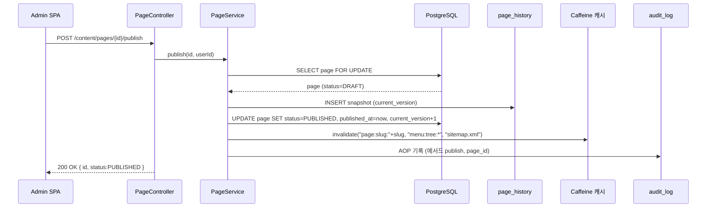
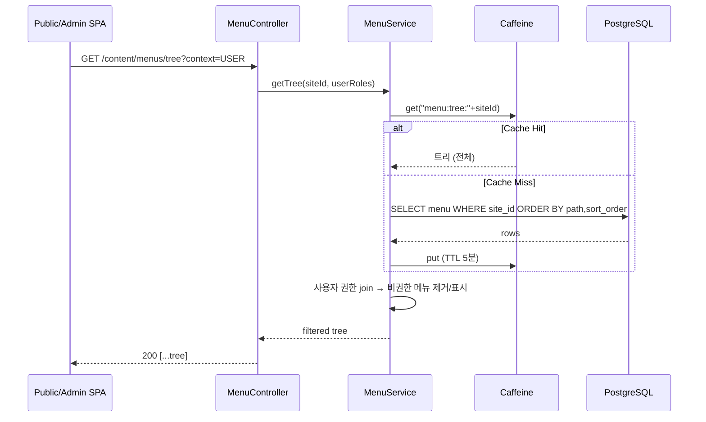
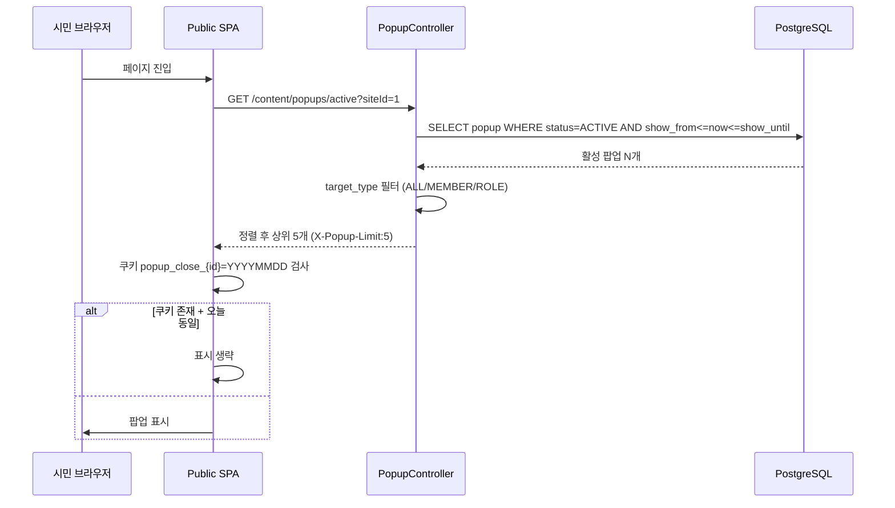
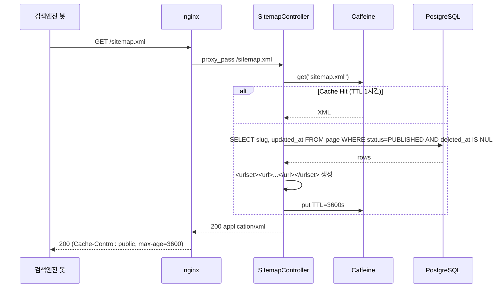
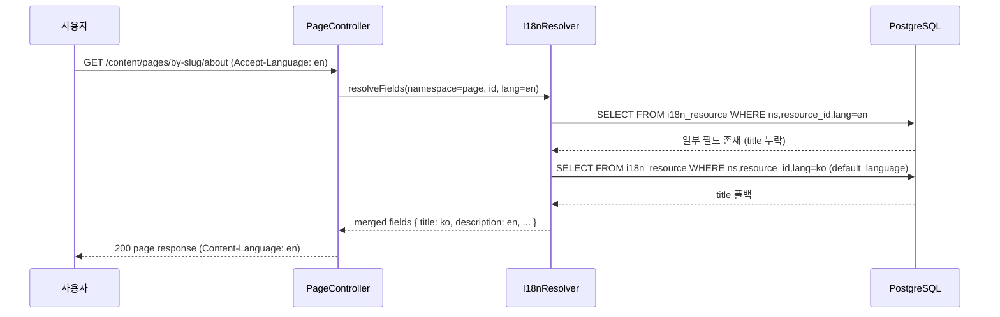

# SPEC-CMS-004: 콘텐츠·메뉴·사이트관리 상세 (Bundle C — Content, Menu, Site Management)

## 1. 개요

| 항목 | 내용 |
|------|------|
| SPEC ID | SPEC-CMS-004 |
| 제목 | 콘텐츠·메뉴·사이트관리 상세 (Bundle C — Content, Menu, Site Management) |
| 작성일 | 2026-04-29 |
| 작성자 | manager-spec (MoAI) |
| 상태 | Draft |
| 우선순위 | P0 |
| 분류 | 상세 SPEC (Umbrella SPEC-CMS-001의 Bundle C 분할) |
| Parent SPEC | SPEC-CMS-001 (§6.3 REQ-CONTENT-001~010, §6.5 REQ-CROSS-001/006/007) |
| Peer SPEC | SPEC-CMS-002 (인증·권한 기반), SPEC-CMS-003 (게시판 마스터 — menu.url 매핑) |
| egov 차용 모듈 | sym/mnu(메뉴관리), uss/ion/tmm(템플릿관리), 사이트관리, 페이지/콘텐츠관리, 팝업/배너관리 |

본 SPEC은 SPEC-CMS-001 §6.3 REQ-CONTENT-001~010 및 §6.5 다국어/접근성 횡단 관심사를 Bundle C 범위로 상세화한다. 메뉴 트리, 페이지·콘텐츠 발행, 팝업·배너, 다국어, SEO, 캐시 정책의 모든 REST API, DDL, 시퀀스, 권한 매트릭스를 구현 단계 의사결정 수준까지 확정한다.

---

## 2. 참조 문서

| 문서 | 활용 범위 |
|------|----------|
| SPEC-CMS-001 §6.3 (REQ-CONTENT-001~010) | 본 SPEC이 상세화하는 부모 요구사항 |
| SPEC-CMS-001 §6.5 (REQ-CROSS-001 KWCAG, REQ-CROSS-006 다국어 메시지, REQ-CROSS-007 다국어 콘텐츠 테이블) | 횡단 관심사 |
| SPEC-CMS-001 §7.3 (Bundle C 데이터 모델 개요) | 본 §4에서 DDL로 구체화 |
| SPEC-CMS-001 §8.3 (Bundle C API 개요) | 본 §6에서 엔드포인트로 구체화 |
| SPEC-CMS-002 §4.2.6 `menu_permissions` | 메뉴-권한 매핑 테이블의 FK 대상 (`menu.id`) — 본 SPEC §4에서 FK 추가 |
| SPEC-CMS-002 §8 권한 매트릭스 | Bundle C 권한 행 추가 (본 SPEC §8) |
| SPEC-CMS-003 §4.2.1 `bbs_master` | 게시판 메뉴는 `menu.url='/board/{bbs_code}'` 패턴으로 매핑 |
| `.moai/project/tech.md` | PostgreSQL 16, Spring Boot 3.2, MyBatis 3.5, Vue 3, vue-i18n 9 |

---

## 3. 범위 및 비범위

### 3.1 범위 (1차 출시 포함)

- 단일 사이트 마스터 정의 + 멀티사이트 확장 가능한 데이터 구조 (1차는 단일 row, 모든 도메인 테이블에 `site_id` 컬럼 보유)
- 메뉴 트리 (Adjacency List + Materialized Path 하이브리드, 최대 깊이 5)
- 메뉴별 권한 매핑 (SPEC-CMS-002 `permissions` 재사용)
- 페이지 템플릿 정의 (HEADER/CONTENT/FOOTER 슬롯, HTML/CSS/JS asset)
- 페이지 CRUD + 발행/예약/철회 + 변경 이력 (풀 스냅샷 jsonb)
- 콘텐츠 블록 (RICH_TEXT/IMAGE/HTML/MARKDOWN/EMBED 5종, 정렬, sanitize)
- SEO 메타데이터 (title, description, keywords, OG image, canonical)
- sitemap.xml 자동 생성 + URL 리다이렉트 관리 (slug 변경 시 301 자동 추가)
- 팝업 (위치, 노출 기간, 빈도 제어, 타겟 역할)
- 배너 (그룹별 슬롯, 노출 기간, 클릭 로그)
- 다국어 콘텐츠 (한국어 기본, 영어 보조 — 별도 정규화 테이블 `i18n_resource`)
- 캐시 정책 (메뉴 트리/페이지 본문/sitemap)

### 3.2 비범위 (Out of Scope)

| 항목 | 사유 / 후속 SPEC |
|------|-----------------|
| 멀티사이트 활성화 (지사·기관 다중 운영) | 1차는 단일 row, 활성화는 2차 SPEC-CMS-MULTI-001 |
| A/B 테스트, 개인화 콘텐츠 | 도입 절차 별도 |
| 헤드리스 CMS API (외부 모바일 앱 송출) | 1차는 자사 SPA 전용 |
| WebDAV / WordPress 임포트 | 1차 미지원 |
| CDN(CloudFront 등) 연동 | 1차는 nginx 캐시, K8s 전환 시 SPEC-DEVOPS |
| 풀 텍스트 검색 (콘텐츠 본문 검색) | 1차는 PostgreSQL `tsvector` 기본, ElasticSearch 도입은 후속 |
| 일본어/중국어 등 추가 언어 | 모델은 확장 가능, 활성화는 후속 |

---

## 4. 데이터 모델 (PostgreSQL DDL + ERD)

### 4.1 ERD

```mermaid
erDiagram
    site ||--o{ menu : "1:N"
    site ||--o{ page : "1:N"
    site ||--o{ popup : "1:N"
    site ||--o{ banner : "1:N"
    menu ||--o{ menu : "self-ref parent_id"
    menu ||--o{ menu_permission : "1:N"
    menu ||--o| page : "1:0..1"
    template ||--o{ page : "1:N"
    page ||--o{ content_block : "1:N"
    page ||--o{ page_history : "1:N"
    page ||--o{ seo_redirect : "1:N (slug 변경 시)"

    site {
      bigint id PK
      varchar code UK
      varchar name
      varchar domain
      varchar default_language
      varchar status
    }
    menu {
      bigint id PK
      bigint site_id FK
      bigint parent_id FK_self
      varchar code UK
      varchar name
      varchar url
      varchar target
      int sort_order
      int depth
      varchar path
      boolean is_visible
      varchar status
    }
    menu_permission {
      bigint menu_id PK_FK
      varchar permission_code PK_FK
    }
    template {
      bigint id PK
      varchar code UK
      varchar layout_type
      text html_template
      jsonb css_assets
      jsonb js_assets
    }
    page {
      bigint id PK
      bigint site_id FK
      bigint template_id FK
      bigint menu_id FK_nullable
      varchar code UK
      varchar slug
      varchar status
      timestamptz published_at
      timestamptz scheduled_at
      varchar seo_title
      varchar seo_description
      varchar og_image_url
    }
    content_block {
      bigint id PK
      bigint page_id FK
      varchar block_type
      int sort_order
      jsonb payload
      int version
    }
    page_history {
      bigint id PK
      bigint page_id FK
      int version
      jsonb snapshot
      bigint edited_by
      timestamptz edited_at
    }
    popup {
      bigint id PK
      bigint site_id FK
      varchar position
      timestamptz show_from
      timestamptz show_until
      boolean show_today_close
      int display_priority
    }
    banner {
      bigint id PK
      bigint site_id FK
      varchar banner_group_code
      varchar image_url
      timestamptz display_from
      timestamptz display_until
      int sort_order
    }
    i18n_resource {
      bigint id PK
      varchar namespace
      bigint resource_id
      varchar language
      varchar field_name
      text value
    }
    seo_redirect {
      bigint id PK
      varchar from_path UK
      varchar to_path
      smallint http_status
      boolean is_active
    }
```

### 4.2 테이블 명세 (PostgreSQL 16 Flyway 호환 DDL)

#### 4.2.1 `site` (사이트 마스터)

```sql
CREATE TABLE site (
    id                BIGINT       GENERATED ALWAYS AS IDENTITY PRIMARY KEY,
    code              VARCHAR(50)  NOT NULL UNIQUE,
    name              VARCHAR(200) NOT NULL,
    domain            VARCHAR(255) NOT NULL,
    default_language  VARCHAR(10)  NOT NULL DEFAULT 'ko',
    supported_languages JSONB      NOT NULL DEFAULT '["ko","en"]'::jsonb,
    status            VARCHAR(20)  NOT NULL DEFAULT 'ACTIVE',
    metadata          JSONB,
    created_at        TIMESTAMPTZ  NOT NULL DEFAULT CURRENT_TIMESTAMP,
    updated_at        TIMESTAMPTZ  NOT NULL DEFAULT CURRENT_TIMESTAMP,
    CONSTRAINT chk_site_status CHECK (status IN ('ACTIVE','INACTIVE')),
    CONSTRAINT chk_site_lang   CHECK (default_language IN ('ko','en'))
);

-- 1차 출시: 단일 사이트 시드
INSERT INTO site (code, name, domain, default_language)
VALUES ('MAIN', '공공기관 메인 사이트', 'www.example.go.kr', 'ko');
```

#### 4.2.2 `menu` (메뉴 트리 — Adjacency List + Materialized Path)

```sql
CREATE TABLE menu (
    id          BIGINT       GENERATED ALWAYS AS IDENTITY PRIMARY KEY,
    site_id     BIGINT       NOT NULL REFERENCES site(id) ON DELETE RESTRICT,
    parent_id   BIGINT       REFERENCES menu(id) ON DELETE CASCADE,
    code        VARCHAR(100) NOT NULL,
    name        VARCHAR(200) NOT NULL,
    url         VARCHAR(500),
    target      VARCHAR(10)  NOT NULL DEFAULT '_self',
    icon        VARCHAR(100),
    sort_order  INT          NOT NULL DEFAULT 0,
    depth       SMALLINT     NOT NULL DEFAULT 1,
    path        VARCHAR(500) NOT NULL,
    is_visible  BOOLEAN      NOT NULL DEFAULT TRUE,
    status      VARCHAR(20)  NOT NULL DEFAULT 'ACTIVE',
    metadata    JSONB,
    created_at  TIMESTAMPTZ  NOT NULL DEFAULT CURRENT_TIMESTAMP,
    updated_at  TIMESTAMPTZ  NOT NULL DEFAULT CURRENT_TIMESTAMP,
    CONSTRAINT uq_menu_site_code UNIQUE (site_id, code),
    CONSTRAINT chk_menu_target CHECK (target IN ('_self','_blank')),
    CONSTRAINT chk_menu_status CHECK (status IN ('ACTIVE','INACTIVE')),
    CONSTRAINT chk_menu_depth  CHECK (depth BETWEEN 1 AND 5)
);
CREATE INDEX idx_menu_parent_sort ON menu(parent_id, sort_order);
CREATE INDEX idx_menu_site_status ON menu(site_id, status) WHERE is_visible = TRUE;
CREATE INDEX idx_menu_path ON menu(path text_pattern_ops);
COMMENT ON COLUMN menu.path IS '루트→현재까지 id 슬래시 결합 (예: /1/3/12). 트리 일괄 조회·정렬 최적화';
COMMENT ON COLUMN menu.depth IS '루트=1, 최대 5; 깊이 5 초과는 제약으로 거부';
```

순환 참조 방지: 애플리케이션 레이어에서 `parent_id` 갱신 시 `path` 재계산 후 신규 path가 자기 자신을 prefix로 갖지 않는지 검증한다(트리거가 아닌 서비스 레이어 검증; 트리거는 deadlock 위험).

#### 4.2.3 `menu_permission` (메뉴별 권한 매핑)

```sql
-- SPEC-CMS-002 §4.2.6 menu_permissions 와 같은 역할이지만, 본 SPEC에서 menu 테이블 생성 후
-- FK를 정식 추가한다. SPEC-CMS-002의 schema-only 매핑 테이블을 본 SPEC에서 강화.
ALTER TABLE menu_permissions
    ADD CONSTRAINT fk_menu_perms_menu
    FOREIGN KEY (menu_id) REFERENCES menu(id) ON DELETE CASCADE;
```

(본 SPEC의 `menu_permission` 테이블은 SPEC-CMS-002 `menu_permissions` 와 동일 객체. 표기 통일을 위해 이후 SPEC 본문에서는 `menu_permissions` 사용.)

#### 4.2.4 `template` (페이지 템플릿)

```sql
CREATE TABLE template (
    id            BIGINT       GENERATED ALWAYS AS IDENTITY PRIMARY KEY,
    code          VARCHAR(50)  NOT NULL UNIQUE,
    name          VARCHAR(200) NOT NULL,
    layout_type   VARCHAR(50)  NOT NULL,
    html_template TEXT         NOT NULL,
    css_assets    JSONB        NOT NULL DEFAULT '[]'::jsonb,
    js_assets     JSONB        NOT NULL DEFAULT '[]'::jsonb,
    description   TEXT,
    status        VARCHAR(20)  NOT NULL DEFAULT 'ACTIVE',
    created_at    TIMESTAMPTZ  NOT NULL DEFAULT CURRENT_TIMESTAMP,
    updated_at    TIMESTAMPTZ  NOT NULL DEFAULT CURRENT_TIMESTAMP,
    CONSTRAINT chk_template_layout CHECK (layout_type IN ('FULL','SIDEBAR_LEFT','SIDEBAR_RIGHT','LANDING','BLANK')),
    CONSTRAINT chk_template_status CHECK (status IN ('ACTIVE','INACTIVE'))
);
COMMENT ON COLUMN template.html_template IS 'Mustache 슬롯: {{HEADER}} {{CONTENT}} {{FOOTER}}';
COMMENT ON COLUMN template.css_assets    IS 'jsonb 배열, 절대/상대 URL — ["/assets/main.css","/assets/sub.css"]';
```

#### 4.2.5 `page` (페이지)

```sql
CREATE TABLE page (
    id              BIGINT       GENERATED ALWAYS AS IDENTITY PRIMARY KEY,
    site_id         BIGINT       NOT NULL REFERENCES site(id) ON DELETE RESTRICT,
    template_id     BIGINT       NOT NULL REFERENCES template(id) ON DELETE RESTRICT,
    menu_id         BIGINT       REFERENCES menu(id) ON DELETE SET NULL,
    code            VARCHAR(100) NOT NULL,
    title           VARCHAR(300) NOT NULL,
    slug            VARCHAR(255) NOT NULL,
    status          VARCHAR(20)  NOT NULL DEFAULT 'DRAFT',
    published_at    TIMESTAMPTZ,
    scheduled_at    TIMESTAMPTZ,
    seo_title       VARCHAR(300),
    seo_description VARCHAR(500),
    seo_keywords    VARCHAR(500),
    og_image_url    VARCHAR(500),
    canonical_url   VARCHAR(500),
    current_version INT          NOT NULL DEFAULT 1,
    created_by      BIGINT       NOT NULL,
    updated_by      BIGINT,
    created_at      TIMESTAMPTZ  NOT NULL DEFAULT CURRENT_TIMESTAMP,
    updated_at      TIMESTAMPTZ  NOT NULL DEFAULT CURRENT_TIMESTAMP,
    deleted_at      TIMESTAMPTZ,
    CONSTRAINT uq_page_site_slug   UNIQUE (site_id, slug),
    CONSTRAINT uq_page_site_code   UNIQUE (site_id, code),
    CONSTRAINT chk_page_status     CHECK (status IN ('DRAFT','SCHEDULED','PUBLISHED','RETRACTED')),
    CONSTRAINT chk_page_scheduled  CHECK (status <> 'SCHEDULED' OR scheduled_at IS NOT NULL),
    CONSTRAINT chk_page_slug       CHECK (slug ~ '^[a-z0-9][a-z0-9\-/]*$')
);
CREATE INDEX idx_page_slug_status ON page(slug, status) WHERE deleted_at IS NULL;
CREATE INDEX idx_page_site_status ON page(site_id, status) WHERE deleted_at IS NULL;
CREATE INDEX idx_page_scheduled  ON page(scheduled_at) WHERE status = 'SCHEDULED';
COMMENT ON COLUMN page.slug IS 'URL path 일부, 소문자/숫자/하이픈/슬래시만 허용';
```

#### 4.2.6 `content_block` (콘텐츠 블록)

```sql
CREATE TABLE content_block (
    id          BIGINT       GENERATED ALWAYS AS IDENTITY PRIMARY KEY,
    page_id     BIGINT       NOT NULL REFERENCES page(id) ON DELETE CASCADE,
    block_type  VARCHAR(20)  NOT NULL,
    sort_order  INT          NOT NULL DEFAULT 0,
    payload     JSONB        NOT NULL,
    version     INT          NOT NULL DEFAULT 1,
    created_at  TIMESTAMPTZ  NOT NULL DEFAULT CURRENT_TIMESTAMP,
    updated_at  TIMESTAMPTZ  NOT NULL DEFAULT CURRENT_TIMESTAMP,
    CONSTRAINT chk_block_type CHECK (block_type IN ('RICH_TEXT','IMAGE','HTML','MARKDOWN','EMBED'))
);
CREATE INDEX idx_content_block_page_sort ON content_block(page_id, sort_order);
COMMENT ON COLUMN content_block.payload IS
  'block_type별 스키마:
   RICH_TEXT: { "html": "<p>..</p>" } (sanitized),
   IMAGE: { "url": "...", "alt": "...", "caption": "..." },
   HTML: { "html": "..." } (관리자 신뢰 — 그대로 출력, sanitize 비적용),
   MARKDOWN: { "md": "..." },
   EMBED: { "provider":"youtube|vimeo", "id":"..." }';
```

#### 4.2.7 `page_history` (페이지 변경 이력 — 풀 스냅샷)

```sql
CREATE TABLE page_history (
    id              BIGINT       GENERATED ALWAYS AS IDENTITY PRIMARY KEY,
    page_id         BIGINT       NOT NULL REFERENCES page(id) ON DELETE CASCADE,
    version         INT          NOT NULL,
    snapshot        JSONB        NOT NULL,
    edited_by       BIGINT       NOT NULL,
    edited_at       TIMESTAMPTZ  NOT NULL DEFAULT CURRENT_TIMESTAMP,
    change_summary  VARCHAR(500),
    CONSTRAINT uq_page_history UNIQUE (page_id, version)
);
CREATE INDEX idx_page_history_page ON page_history(page_id, version DESC);
COMMENT ON COLUMN page_history.snapshot IS
  'page row + content_block 배열 + i18n_resource 배열을 jsonb로 통째 저장. 롤백 시 그대로 적용.';
```

#### 4.2.8 `popup` (팝업)

```sql
CREATE TABLE popup (
    id                 BIGINT       GENERATED ALWAYS AS IDENTITY PRIMARY KEY,
    site_id            BIGINT       NOT NULL REFERENCES site(id) ON DELETE RESTRICT,
    title              VARCHAR(300) NOT NULL,
    content_html       TEXT         NOT NULL,
    position           VARCHAR(20)  NOT NULL DEFAULT 'CENTER',
    x_offset           INT,
    y_offset           INT,
    width              INT          NOT NULL DEFAULT 400,
    height             INT          NOT NULL DEFAULT 300,
    show_from          TIMESTAMPTZ  NOT NULL,
    show_until         TIMESTAMPTZ  NOT NULL,
    show_today_close   BOOLEAN      NOT NULL DEFAULT TRUE,
    display_priority   INT          NOT NULL DEFAULT 0,
    target_type        VARCHAR(20)  NOT NULL DEFAULT 'ALL',
    target_role_codes  JSONB        NOT NULL DEFAULT '[]'::jsonb,
    status             VARCHAR(20)  NOT NULL DEFAULT 'ACTIVE',
    created_at         TIMESTAMPTZ  NOT NULL DEFAULT CURRENT_TIMESTAMP,
    updated_at         TIMESTAMPTZ  NOT NULL DEFAULT CURRENT_TIMESTAMP,
    CONSTRAINT chk_popup_position CHECK (position IN ('CENTER','TOP_RIGHT','BOTTOM_RIGHT','TOP_LEFT','BOTTOM_LEFT','CUSTOM')),
    CONSTRAINT chk_popup_target   CHECK (target_type IN ('ALL','MEMBER','ROLE')),
    CONSTRAINT chk_popup_status   CHECK (status IN ('ACTIVE','INACTIVE')),
    CONSTRAINT chk_popup_period   CHECK (show_from < show_until)
);
CREATE INDEX idx_popup_active_window ON popup(site_id, show_from, show_until)
    WHERE status = 'ACTIVE';
```

#### 4.2.9 `banner` (배너)

```sql
CREATE TABLE banner (
    id                 BIGINT       GENERATED ALWAYS AS IDENTITY PRIMARY KEY,
    site_id            BIGINT       NOT NULL REFERENCES site(id) ON DELETE RESTRICT,
    banner_group_code  VARCHAR(50)  NOT NULL,
    title              VARCHAR(300) NOT NULL,
    image_url          VARCHAR(500) NOT NULL,
    link_url           VARCHAR(500),
    link_target        VARCHAR(10)  NOT NULL DEFAULT '_self',
    alt_text           VARCHAR(300) NOT NULL,
    display_from       TIMESTAMPTZ  NOT NULL,
    display_until      TIMESTAMPTZ  NOT NULL,
    sort_order         INT          NOT NULL DEFAULT 0,
    click_count        BIGINT       NOT NULL DEFAULT 0,
    status             VARCHAR(20)  NOT NULL DEFAULT 'ACTIVE',
    created_at         TIMESTAMPTZ  NOT NULL DEFAULT CURRENT_TIMESTAMP,
    updated_at         TIMESTAMPTZ  NOT NULL DEFAULT CURRENT_TIMESTAMP,
    CONSTRAINT chk_banner_target CHECK (link_target IN ('_self','_blank')),
    CONSTRAINT chk_banner_status CHECK (status IN ('ACTIVE','INACTIVE')),
    CONSTRAINT chk_banner_period CHECK (display_from < display_until)
);
CREATE INDEX idx_banner_group_active ON banner(banner_group_code, display_from, display_until)
    WHERE status = 'ACTIVE';
COMMENT ON COLUMN banner.banner_group_code IS '예: HOME_HERO, SIDE_TOP, FOOTER_PARTNER 등 사이트 정의 그룹';
COMMENT ON COLUMN banner.alt_text IS 'KWCAG 2.2 AA 1.1.1 대체텍스트 — NOT NULL 강제';
```

#### 4.2.10 `i18n_resource` (다국어 리소스)

```sql
CREATE TABLE i18n_resource (
    id           BIGINT       GENERATED ALWAYS AS IDENTITY PRIMARY KEY,
    namespace    VARCHAR(50)  NOT NULL,
    resource_id  BIGINT       NOT NULL,
    language     VARCHAR(10)  NOT NULL,
    field_name   VARCHAR(100) NOT NULL,
    value        TEXT         NOT NULL,
    created_at   TIMESTAMPTZ  NOT NULL DEFAULT CURRENT_TIMESTAMP,
    updated_at   TIMESTAMPTZ  NOT NULL DEFAULT CURRENT_TIMESTAMP,
    CONSTRAINT uq_i18n UNIQUE (namespace, resource_id, language, field_name),
    CONSTRAINT chk_i18n_namespace CHECK (namespace IN ('menu','page','popup','banner','content_block','system')),
    CONSTRAINT chk_i18n_language  CHECK (language IN ('ko','en'))
);
CREATE INDEX idx_i18n_lookup ON i18n_resource(namespace, resource_id, language);
COMMENT ON COLUMN i18n_resource.field_name IS
  '예: menu.name, page.title, popup.content_html, banner.alt_text, content_block.payload.html';
```

#### 4.2.11 `seo_redirect` (URL 리다이렉트)

```sql
CREATE TABLE seo_redirect (
    id           BIGINT       GENERATED ALWAYS AS IDENTITY PRIMARY KEY,
    from_path    VARCHAR(500) NOT NULL UNIQUE,
    to_path      VARCHAR(500) NOT NULL,
    http_status  SMALLINT     NOT NULL DEFAULT 301,
    is_active    BOOLEAN      NOT NULL DEFAULT TRUE,
    reason       VARCHAR(200),
    created_at   TIMESTAMPTZ  NOT NULL DEFAULT CURRENT_TIMESTAMP,
    CONSTRAINT chk_redirect_status CHECK (http_status IN (301, 302))
);
CREATE INDEX idx_seo_redirect_active ON seo_redirect(from_path) WHERE is_active = TRUE;
```

페이지 slug 변경 시 트리거가 아닌 PageService.updateSlug()에서 자동으로 (이전 slug → 새 slug) 행을 INSERT하며, 사유는 'SLUG_CHANGE_PAGE_ID:{id}' 로 기록한다.

### 4.3 인덱스 전략 정리

| 패턴 | 인덱스 |
|------|--------|
| 메뉴 트리 조회 (parent별 정렬) | `idx_menu_parent_sort(parent_id, sort_order)` |
| 메뉴 path prefix 검색 | `idx_menu_path text_pattern_ops` |
| 페이지 slug 라우팅 | `idx_page_slug_status(slug, status)` |
| 예약 발행 배치 스캔 | `idx_page_scheduled` (partial: status='SCHEDULED') |
| 활성 팝업 조회 (시간 범위) | `idx_popup_active_window` (partial: status='ACTIVE') |
| 활성 배너 조회 (그룹별) | `idx_banner_group_active` (partial) |
| 다국어 리소스 조회 | `idx_i18n_lookup(namespace, resource_id, language)` + UNIQUE |

### 4.4 PostgreSQL 16 특화

- `JSONB` payload (content_block, snapshot) — GIN 인덱스 필요 시 `CREATE INDEX ... USING GIN (payload jsonb_path_ops)`
- 페이지 본문 풀텍스트 검색 후속: `tsvector` 컬럼 + `to_tsvector('simple', ...)` 트리거 (별도 SPEC)
- partial index 활용으로 storage 절감

---

## 5. 요구사항 (EARS 상세화)

부모 REQ 10개를 30~40개 sub-REQ로 상세화한다. ID 규약: `REQ-CONTENT-{NNN}-D-{seq}`.

### 5.1 REQ-CONTENT-001-D 메뉴 트리 관리 (REQ-CONTENT-001 상세화)

- **REQ-CONTENT-001-D-1 (메뉴 생성 — Event-driven)**
  CONTENT_ADMIN 또는 SYSADMIN이 `POST /api/v1/content/menus`에 (site_id, parent_id, code, name, url, target, sort_order)를 보냈을 때, 시스템은 (a) parent_id의 depth+1이 5 이하인지 검증 (b) 동일 site_id 내 code 유일성 검증 (c) target ∈ {_self,_blank} 검증 후 menu에 INSERT, depth와 path를 자동 계산하여 저장하고 201을 반환해야 한다.

- **REQ-CONTENT-001-D-2 (메뉴 트리 조회 — Event-driven)**
  사용자가 `GET /api/v1/content/menus/tree?siteId={id}`를 호출했을 때, 시스템은 site_id 내 status='ACTIVE' 메뉴를 path 오름차순·sort_order 오름차순으로 조회하여 중첩 트리(children 배열) 구조로 응답해야 한다.

- **REQ-CONTENT-001-D-3 (메뉴 순서 변경 — Event-driven)**
  운영자가 `PATCH /api/v1/content/menus/{id}/order`로 새 sort_order를 보냈을 때, 시스템은 동일 parent_id 내 형제 메뉴들의 sort_order를 재계산하여 충돌 없이 저장해야 한다.

- **REQ-CONTENT-001-D-4 (메뉴 이동 — Event-driven)**
  운영자가 `PATCH /api/v1/content/menus/{id}/move`로 새 parent_id를 보냈을 때, 시스템은 (a) 이동 결과 depth ≤ 5 검증 (b) 자기 자신 또는 자손을 parent로 지정하는 순환 참조 거부 (c) 자손 노드들의 path와 depth를 일괄 갱신해야 한다.

- **REQ-CONTENT-001-D-5 (메뉴 가시성 토글 — Event-driven)**
  운영자가 `PATCH /api/v1/content/menus/{id}/visibility`로 is_visible을 토글했을 때, 시스템은 즉시 반영하고 메뉴 트리 캐시(§10)를 무효화해야 한다.

- **REQ-CONTENT-001-D-6 (메뉴 삭제 — Event-driven)**
  운영자가 `DELETE /api/v1/content/menus/{id}`를 호출했을 때, 시스템은 자손 메뉴를 ON DELETE CASCADE로 함께 제거해야 하며, 연결된 page.menu_id는 NULL로 초기화해야 한다.

### 5.2 REQ-CONTENT-002-D 메뉴별 권한 매핑 (REQ-CONTENT-002 상세화)

- **REQ-CONTENT-002-D-1 (메뉴-권한 매핑 — Ubiquitous)**
  시스템은 `POST /api/v1/content/menus/{id}/permissions`로 permission_code 배열을 받아 `menu_permissions`에 일괄 저장(replace)해야 한다. 본 매핑은 SPEC-CMS-002 §4.2.6의 테이블을 재사용한다.

- **REQ-CONTENT-002-D-2 (사용자 메뉴 필터 — Event-driven)**
  사용자가 `GET /api/v1/content/menus/tree?context=USER`를 호출했을 때, 시스템은 사용자의 역할이 보유한 permission_code 집합과 menu_permissions를 조인하여, 권한이 없는 메뉴는 응답 트리에서 제거하거나 `accessible:false`로 표시해야 한다.

- **REQ-CONTENT-002-D-3 (메뉴 권한 미정의 시 — State-driven)**
  메뉴에 어떠한 menu_permission도 매핑되지 않은 동안, 시스템은 해당 메뉴를 모든 인증 사용자에게 공개해야 한다(공개 메뉴). 단 익명 노출은 menu.metadata.public=true 또는 별도 `PUBLIC` 권한 매핑 시에만 허용한다.

### 5.3 REQ-CONTENT-003-D 사이트 마스터 (REQ-CONTENT-003 상세화)

- **REQ-CONTENT-003-D-1 (사이트 단일 row — Ubiquitous)**
  1차 출시에서 시스템은 site 테이블에 정확히 1개 row만 시드하고, 모든 도메인 테이블의 site_id는 해당 row를 참조해야 한다.

- **REQ-CONTENT-003-D-2 (사이트 정보 조회 — Event-driven)**
  사용자가 `GET /api/v1/content/sites/current`를 호출했을 때, 시스템은 호스트 헤더의 domain과 일치하는 site row를 반환해야 한다. 미일치 시 default site(MAIN) 반환.

- **REQ-CONTENT-003-D-3 (멀티사이트 활성화 가드 — State-driven)**
  멀티사이트 옵션이 비활성(1차 기본값)인 동안, 시스템은 `POST /api/v1/content/sites` 신규 생성을 SYSADMIN에게도 거부하고 HTTP 409와 `{"code":"SITE_MULTI_DISABLED"}`를 반환해야 한다.

### 5.4 REQ-CONTENT-004-D 템플릿 정의 (REQ-CONTENT-004 상세화)

- **REQ-CONTENT-004-D-1 (템플릿 등록 — Event-driven)**
  CONTENT_ADMIN이 `POST /api/v1/content/templates`에 (code, name, layout_type, html_template, css_assets, js_assets)를 보냈을 때, 시스템은 (a) code 유일성 (b) html_template에 `{{CONTENT}}` 슬롯 존재 검증 후 저장해야 한다.

- **REQ-CONTENT-004-D-2 (템플릿 자산 무결성 — Ubiquitous)**
  시스템은 css_assets / js_assets jsonb 배열의 각 URL이 동일 origin 또는 사이트 등록 외부 도메인 화이트리스트에 속하는지 검증해야 한다.

- **REQ-CONTENT-004-D-3 (템플릿 비활성화 — Event-driven)**
  운영자가 `PATCH /api/v1/content/templates/{id}/status`로 INACTIVE 전환을 시도했을 때, 시스템은 해당 템플릿을 사용 중인 page가 1건 이상 존재하면 HTTP 409를 반환하고, 0건이면 INACTIVE로 전환해야 한다.

### 5.5 REQ-CONTENT-005-D 페이지 CRUD + 발행/예약/철회 + 이력 (REQ-CONTENT-005, 006, 009 상세화)

- **REQ-CONTENT-005-D-1 (페이지 생성 — Event-driven)**
  CONTENT_ADMIN이 `POST /api/v1/content/pages`에 (site_id, template_id, menu_id, code, title, slug)를 보냈을 때, 시스템은 (a) slug 패턴 `^[a-z0-9][a-z0-9\-/]*$` 검증 (b) (site_id, slug) 유일성 검증 (c) status='DRAFT' 초기값으로 INSERT하고 201을 반환해야 한다.

- **REQ-CONTENT-005-D-2 (페이지 수정 → 이력 누적 — Event-driven)**
  CONTENT_ADMIN이 `PUT /api/v1/content/pages/{id}`로 변경을 보냈을 때, 시스템은 (a) 변경 직전 page+content_block+i18n_resource 스냅샷을 page_history에 INSERT (b) page.current_version 증가 (c) 본 row를 UPDATE해야 한다.

- **REQ-CONTENT-005-D-3 (즉시 발행 — Event-driven)**
  CONTENT_ADMIN이 `POST /api/v1/content/pages/{id}/publish`를 호출했을 때, 시스템은 (a) status='PUBLISHED' (b) published_at=now (c) scheduled_at=NULL로 갱신하고, 페이지 콘텐츠 캐시(§10)를 무효화해야 한다.

- **REQ-CONTENT-005-D-4 (예약 발행 — Event-driven)**
  CONTENT_ADMIN이 `POST /api/v1/content/pages/{id}/schedule`에 scheduled_at(미래 시각)을 보냈을 때, 시스템은 (a) scheduled_at > now 검증 (b) status='SCHEDULED'로 갱신해야 한다. 배치 잡(매분)이 scheduled_at 도래 페이지를 PUBLISHED로 전환한다.

- **REQ-CONTENT-005-D-5 (철회 — Event-driven)**
  CONTENT_ADMIN이 `POST /api/v1/content/pages/{id}/retract`를 호출했을 때, 시스템은 (a) status='RETRACTED' (b) page_history에 철회 사유 기록을 수행하고, 시민 라우팅에서 404를 반환하도록 캐시를 무효화해야 한다.

- **REQ-CONTENT-005-D-6 (이력 비교 — Event-driven)**
  운영자가 `GET /api/v1/content/pages/{id}/history`를 호출했을 때, 시스템은 page_history 목록(version desc)을 반환해야 하며, `?compare=v3,v5` 파라미터에 대해서는 두 버전의 jsonb diff를 반환해야 한다.

- **REQ-CONTENT-005-D-7 (롤백 — Event-driven)**
  운영자가 `POST /api/v1/content/pages/{id}/rollback/{version}`을 호출했을 때, 시스템은 (a) page_history.snapshot을 현재로 적용 (b) page_history에 새 version으로 'ROLLBACK_FROM_v{N}' 사유와 함께 기록 (c) status='DRAFT'로 강제(자동 발행 금지)해야 한다.

- **REQ-CONTENT-005-D-8 (페이지 슬러그 변경 시 리다이렉트 — Event-driven)**
  운영자가 page.slug를 변경했을 때, 시스템은 seo_redirect에 (from_path=구slug, to_path=신slug, http_status=301, reason='SLUG_CHANGE_PAGE_ID:{id}') 행을 자동 INSERT해야 한다.

- **REQ-CONTENT-005-D-9 (DRAFT 시민 차단 — State-driven)**
  페이지가 status='DRAFT' 또는 'SCHEDULED' 또는 'RETRACTED' 인 동안, 시스템은 익명/일반 사용자의 `GET /api/v1/content/pages/by-slug/{slug}` 요청에 404를 반환해야 한다. 단, CONTENT_ADMIN이 `?preview=true&token={one-time}` 으로 미리보기 토큰과 함께 요청한 경우는 예외.

### 5.6 REQ-CONTENT-006-D 콘텐츠 블록 (REQ-CONTENT-005 상세화)

- **REQ-CONTENT-006-D-1 (블록 추가/수정 — Event-driven)**
  CONTENT_ADMIN이 `POST /api/v1/content/pages/{pageId}/blocks`에 (block_type, sort_order, payload)를 보냈을 때, 시스템은 (a) block_type 화이트리스트 검증 (b) RICH_TEXT/MARKDOWN/IMAGE의 payload는 서버측 sanitize(DOMPurify 동등) 적용 (c) HTML 블록은 SYSADMIN만 허용해야 한다.

- **REQ-CONTENT-006-D-2 (블록 정렬 — Event-driven)**
  운영자가 `PATCH /api/v1/content/pages/{pageId}/blocks/order`로 [{id, sort_order}] 배열을 보냈을 때, 시스템은 트랜잭션으로 일괄 갱신해야 한다.

- **REQ-CONTENT-006-D-3 (이미지 블록 자산 — Ubiquitous)**
  시스템은 IMAGE 블록의 url이 동일 origin 또는 화이트리스트 외부 도메인일 것을 검증하며, alt 필드를 NOT NULL로 강제해야 한다(KWCAG 1.1.1).

- **REQ-CONTENT-006-D-4 (EMBED 블록 — Ubiquitous)**
  시스템은 EMBED 블록의 provider를 화이트리스트(youtube, vimeo, kakaomap)로 제한하고, sandbox iframe 속성을 강제해야 한다.

### 5.7 REQ-CONTENT-007-D SEO 메타 + sitemap.xml (REQ-CONTENT-005 신설 횡단)

- **REQ-CONTENT-007-D-1 (SEO 메타 저장 — Event-driven)**
  CONTENT_ADMIN이 페이지 저장 시 seo_title, seo_description, seo_keywords, og_image_url, canonical_url을 함께 보냈을 때, 시스템은 길이(seo_title ≤ 60자, seo_description ≤ 160자) 권고치를 검증·경고하지만 거부하지는 않아야 한다.

- **REQ-CONTENT-007-D-2 (sitemap.xml 자동 생성 — Event-driven)**
  사용자가 `GET /sitemap.xml`을 호출했을 때, 시스템은 status='PUBLISHED' AND deleted_at IS NULL 인 page 전체를 lastmod=updated_at, changefreq=weekly, priority=0.8(기본)로 출력해야 한다.

- **REQ-CONTENT-007-D-3 (sitemap.xml 캐시 — Ubiquitous)**
  시스템은 sitemap.xml을 1시간(TTL=3600s) 캐시하고, 페이지 발행/철회/slug 변경 시 즉시 무효화해야 한다.

- **REQ-CONTENT-007-D-4 (robots.txt 정적 — Ubiquitous)**
  시스템은 `/robots.txt`를 nginx 정적 파일로 제공하며 sitemap URL을 포함해야 한다.

- **REQ-CONTENT-007-D-5 (canonical URL — Ubiquitous)**
  시스템은 페이지 응답 HTML 헤드에 canonical_url 또는 (없을 시) 현재 요청 URL을 자동 출력해야 한다.

### 5.8 REQ-CONTENT-008-D 팝업 관리 (REQ-CONTENT-007 상세화)

- **REQ-CONTENT-008-D-1 (팝업 등록 — Event-driven)**
  CONTENT_ADMIN이 `POST /api/v1/content/popups`에 (title, content_html, position, show_from, show_until, target_type, target_role_codes)을 보냈을 때, 시스템은 (a) show_from < show_until 검증 (b) content_html sanitize (c) target_type='ROLE'인 경우 target_role_codes 비어있지 않음 검증 후 저장해야 한다.

- **REQ-CONTENT-008-D-2 (활성 팝업 조회 — Event-driven)**
  사용자가 `GET /api/v1/content/popups/active?siteId={id}`를 호출했을 때, 시스템은 status='ACTIVE' AND show_from ≤ now ≤ show_until 인 팝업을 display_priority desc로 응답해야 한다.

- **REQ-CONTENT-008-D-3 (팝업 타겟 필터 — State-driven)**
  팝업 target_type이 'ROLE'인 경우, 시스템은 인증 사용자의 역할이 target_role_codes에 포함될 때만 응답 목록에 포함해야 한다. target_type이 'MEMBER'면 인증 사용자에게만, 'ALL'이면 모두.

- **REQ-CONTENT-008-D-4 (오늘 그만 보기 — Ubiquitous)**
  시스템은 show_today_close=true 인 팝업에 대해 클라이언트가 `popup_close_{id}=YYYYMMDD` 쿠키(만료 다음날 0시)를 설정할 수 있도록 응답 메타에 cookie_key를 포함해야 한다.

- **REQ-CONTENT-008-D-5 (팝업 우선순위 — Ubiquitous)**
  시스템은 동일 시점에 활성 팝업이 5개를 초과해도 클라이언트 표시 한도(상위 5개)를 응답 헤더 `X-Popup-Limit:5`로 명시해야 한다.

### 5.9 REQ-CONTENT-009-D 배너 관리 (REQ-CONTENT-008 상세화)

- **REQ-CONTENT-009-D-1 (배너 등록 — Event-driven)**
  CONTENT_ADMIN이 `POST /api/v1/content/banners`에 (banner_group_code, title, image_url, link_url, alt_text, display_from, display_until, sort_order)를 보냈을 때, 시스템은 (a) display_from < display_until (b) alt_text NOT NULL (c) image_url 화이트리스트 검증 후 저장해야 한다.

- **REQ-CONTENT-009-D-2 (그룹별 활성 배너 조회 — Event-driven)**
  시민이 `GET /api/v1/content/banners?group=HOME_HERO`를 호출했을 때, 시스템은 banner_group_code 일치 + 시간 윈도우 활성 + status='ACTIVE' 배너를 sort_order 오름차순으로 응답해야 한다.

- **REQ-CONTENT-009-D-3 (배너 클릭 로그 — Event-driven)**
  사용자가 `POST /api/v1/content/banners/{id}/click`를 호출했을 때, 시스템은 click_count를 1 증가(원자적 UPDATE)하고 audit_log에 (banner_id, ip, user_agent, referrer)를 기록해야 한다.

### 5.10 REQ-CONTENT-010-D 다국어 콘텐츠 (REQ-CONTENT-010 + REQ-CROSS-007 상세화)

- **REQ-CONTENT-010-D-1 (다국어 리소스 저장 — Ubiquitous)**
  시스템은 메뉴/페이지/팝업/배너/콘텐츠 블록의 번역 가능 필드(name, title, description, content_html, alt_text, payload.html 등)를 i18n_resource 테이블에 (namespace, resource_id, language, field_name) 키로 저장해야 한다.

- **REQ-CONTENT-010-D-2 (다국어 폴백 — Event-driven)**
  사용자가 `Accept-Language: en` 헤더 또는 `?lang=en`으로 요청했을 때, 시스템은 (a) 요청 언어로 i18n_resource를 우선 조회 (b) 미존재 시 site.default_language로 폴백 (c) 그래도 없으면 'ko'로 폴백해야 한다.

- **REQ-CONTENT-010-D-3 (언어별 슬러그 — Optional)**
  사이트의 supported_languages가 1개 초과인 경우, 시스템은 slug를 `/ko/about`, `/en/about` 형태의 언어 prefix로 라우팅 가능하게 지원해야 한다(prefix 미일치 시 default_language로 fallback 라우팅).

- **REQ-CONTENT-010-D-4 (lang 속성 — Ubiquitous)**
  시스템은 페이지 응답 HTML의 `<html lang="...">` 속성을 응답 언어 코드로 설정해야 한다(KWCAG 3.1.1).

- **REQ-CONTENT-010-D-5 (OG/SEO 다국어 — Ubiquitous)**
  시스템은 og:locale, seo_title, seo_description을 언어별로 별도 i18n_resource에 보유하고, 응답 시 언어에 맞는 값을 출력해야 한다.

---

## 6. REST API 명세

베이스 URL: `/api/v1`. 페이징 표준은 SPEC-CMS-003 §6과 동일.

### 6.1 사이트 API (관리자)

| Method | Path | 권한 | REQ |
|--------|------|------|-----|
| GET    | `/content/sites/current` | PUBLIC | 003-D-2 |
| GET    | `/content/sites` | SYSTEM:READ | 003-D-1 |
| POST   | `/content/sites` | SYSTEM:ADMIN (멀티사이트 활성화 시) | 003-D-3 |
| PUT    | `/content/sites/{id}` | SYSTEM:ADMIN | — |

### 6.2 메뉴 API

| Method | Path | 권한 | REQ |
|--------|------|------|-----|
| GET    | `/content/menus/tree` | PUBLIC (USER 컨텍스트는 인증) | 001-D-2, 002-D-2 |
| GET    | `/content/menus/{id}` | CONTENT:READ | 001-D-2 |
| POST   | `/content/menus` | CONTENT:WRITE | 001-D-1 |
| PUT    | `/content/menus/{id}` | CONTENT:WRITE | — |
| PATCH  | `/content/menus/{id}/order` | CONTENT:WRITE | 001-D-3 |
| PATCH  | `/content/menus/{id}/move` | CONTENT:WRITE | 001-D-4 |
| PATCH  | `/content/menus/{id}/visibility` | CONTENT:WRITE | 001-D-5 |
| DELETE | `/content/menus/{id}` | CONTENT:WRITE | 001-D-6 |
| POST   | `/content/menus/{id}/permissions` | CONTENT:WRITE | 002-D-1 |

### 6.3 템플릿 API (관리자)

| Method | Path | 권한 | REQ |
|--------|------|------|-----|
| GET    | `/content/templates` | CONTENT:READ | — |
| POST   | `/content/templates` | CONTENT:WRITE | 004-D-1 |
| PUT    | `/content/templates/{id}` | CONTENT:WRITE | — |
| PATCH  | `/content/templates/{id}/status` | CONTENT:WRITE | 004-D-3 |

### 6.4 페이지 API

| Method | Path | 권한 | REQ |
|--------|------|------|-----|
| GET    | `/content/pages` | CONTENT:READ | — |
| GET    | `/content/pages/by-slug/{slug}` | PUBLIC (status=PUBLISHED만) | 005-D-9 |
| GET    | `/content/pages/{id}` | CONTENT:READ | — |
| POST   | `/content/pages` | CONTENT:WRITE | 005-D-1 |
| PUT    | `/content/pages/{id}` | CONTENT:WRITE | 005-D-2 |
| POST   | `/content/pages/{id}/publish` | CONTENT:WRITE | 005-D-3 |
| POST   | `/content/pages/{id}/schedule` | CONTENT:WRITE | 005-D-4 |
| POST   | `/content/pages/{id}/retract` | CONTENT:WRITE | 005-D-5 |
| GET    | `/content/pages/{id}/history` | CONTENT:READ | 005-D-6 |
| POST   | `/content/pages/{id}/rollback/{version}` | CONTENT:WRITE | 005-D-7 |

### 6.5 콘텐츠 블록 API

| Method | Path | 권한 | REQ |
|--------|------|------|-----|
| GET    | `/content/pages/{pageId}/blocks` | CONTENT:READ | — |
| POST   | `/content/pages/{pageId}/blocks` | CONTENT:WRITE | 006-D-1 |
| PUT    | `/content/blocks/{id}` | CONTENT:WRITE | — |
| DELETE | `/content/blocks/{id}` | CONTENT:WRITE | — |
| PATCH  | `/content/pages/{pageId}/blocks/order` | CONTENT:WRITE | 006-D-2 |

### 6.6 팝업 API

| Method | Path | 권한 | REQ |
|--------|------|------|-----|
| GET    | `/content/popups/active` | PUBLIC | 008-D-2, 008-D-3 |
| GET    | `/content/popups` | CONTENT:READ | — |
| POST   | `/content/popups` | CONTENT:WRITE | 008-D-1 |
| PUT    | `/content/popups/{id}` | CONTENT:WRITE | — |
| DELETE | `/content/popups/{id}` | CONTENT:WRITE | — |

### 6.7 배너 API

| Method | Path | 권한 | REQ |
|--------|------|------|-----|
| GET    | `/content/banners?group={code}` | PUBLIC | 009-D-2 |
| POST   | `/content/banners` | CONTENT:WRITE | 009-D-1 |
| PUT    | `/content/banners/{id}` | CONTENT:WRITE | — |
| DELETE | `/content/banners/{id}` | CONTENT:WRITE | — |
| POST   | `/content/banners/{id}/click` | PUBLIC | 009-D-3 |

### 6.8 다국어 리소스 API

| Method | Path | 권한 | REQ |
|--------|------|------|-----|
| GET    | `/content/i18n?namespace={ns}&resourceId={id}` | CONTENT:READ | 010-D-1 |
| PUT    | `/content/i18n` (bulk upsert) | CONTENT:WRITE | 010-D-1 |

### 6.9 SEO API

| Method | Path | 권한 | REQ |
|--------|------|------|-----|
| GET    | `/sitemap.xml` | PUBLIC | 007-D-2, 007-D-3 |
| GET    | `/content/seo/redirects` | SYSTEM:READ | 005-D-8 |
| POST   | `/content/seo/redirects` | SYSTEM:ADMIN | — |
| DELETE | `/content/seo/redirects/{id}` | SYSTEM:ADMIN | — |

---

## 7. 시퀀스 다이어그램

### 7.1 페이지 발행 (초안 → 발행 → 캐시 무효화)



### 7.2 메뉴 트리 조회 (사용자 권한 필터링)



### 7.3 팝업 노출 결정



### 7.4 SEO 메타 + sitemap.xml 자동 생성



### 7.5 다국어 폴백



---

## 8. 권한 매트릭스 (Bundle C 특화)

SPEC-CMS-002 §8 매트릭스에 다음 행을 추가/구체화한다.

| 리소스 \ 액션 | 시스템관리자(SYSADMIN) | 콘텐츠관리자(CONTENT_ADMIN) | 일반사용자(USER) | 익명 |
|----------------|:--:|:--:|:--:|:--:|
| SITE:READ (사이트 조회) | ✓ | ✓ | △(current만) | △(current만) |
| SITE:WRITE | ✓ | × | × | × |
| MENU:READ (트리 조회) | ✓ | ✓ | ✓(권한 매핑 필터) | ✓(공개 메뉴) |
| MENU:WRITE (CRUD/이동/순서) | ✓ | ✓ | × | × |
| MENU:PERMISSION:WRITE | ✓ | ✓ | × | × |
| TEMPLATE:READ | ✓ | ✓ | × | × |
| TEMPLATE:WRITE | ✓ | ✓ | × | × |
| PAGE:READ (관리자 — 모든 상태) | ✓ | ✓ | × | × |
| PAGE:READ (시민 — PUBLISHED만) | ✓ | ✓ | ✓ | ✓ |
| PAGE:WRITE | ✓ | ✓ | × | × |
| PAGE:PUBLISH (발행/예약/철회) | ✓ | ✓ | × | × |
| PAGE:HISTORY:READ | ✓ | ✓ | × | × |
| PAGE:ROLLBACK | ✓ | ✓ | × | × |
| BLOCK:WRITE (RICH_TEXT/IMAGE/MARKDOWN/EMBED) | ✓ | ✓ | × | × |
| BLOCK:WRITE (HTML, 신뢰 블록) | ✓ | × | × | × |
| POPUP:READ (활성) | ✓ | ✓ | ✓ | ✓ |
| POPUP:WRITE | ✓ | ✓ | × | × |
| BANNER:READ (그룹별) | ✓ | ✓ | ✓ | ✓ |
| BANNER:WRITE | ✓ | ✓ | × | × |
| BANNER:CLICK (로그 기록) | ✓ | ✓ | ✓ | ✓ |
| I18N:WRITE | ✓ | ✓ | × | × |
| SEO:REDIRECT:WRITE | ✓ | × | × | × |
| SITEMAP:READ | ✓ | ✓ | ✓ | ✓ |

비고:
- △(current만): 호스트 헤더 기반 단일 사이트 row만 응답
- 메뉴 노출은 본 매트릭스 + menu_permissions 둘 다 통과한 경우에만 응답

---

## 9. 다국어 정책

### 9.1 데이터 모델

별도 정규화 테이블 `i18n_resource`를 채택한다(연구 §4 참조). 각 번역 가능 필드는 (namespace, resource_id, language, field_name) 키로 1행이며, 추가 언어 도입 시 스키마 변경 불필요.

### 9.2 폴백

폴백 우선순위: **요청 언어 → site.default_language → 'ko' (시스템 기본) → 빈 문자열(필드 누락 표시)**.

### 9.3 슬러그 정책

site.supported_languages 가 1개일 때는 slug 단일. 2개 이상일 때는 `/ko/about`, `/en/about` 형태의 prefix를 권장한다. 단, 1차 출시는 단일 언어 prefix(slug 자체)와 i18n_resource 폴백 조합으로 운영한다.

### 9.4 SEO/OG 다국어

og:title, og:description, og:locale, seo_title, seo_description은 i18n_resource에서 응답 언어로 조회. og:locale 값은 응답 언어 + 지역 코드(`ko_KR`, `en_US`).

---

## 10. 캐시 정책

| 캐시 키 패턴 | 저장소 | TTL | 무효화 트리거 |
|--------------|--------|-----|--------------|
| `menu:tree:{site_id}` | Caffeine (인메모리) | 5분 | 메뉴 CRUD/이동/순서/가시성/권한 변경 |
| `page:slug:{slug}` | Caffeine | 10분 | 페이지 발행/철회/슬러그 변경 |
| `page:body:{id}:{version}` | Caffeine | 30분 | 새 버전 발행 시 (version 증가) |
| `popup:active:{site_id}` | Caffeine | 1분 | 팝업 CRUD/상태 변경 |
| `banner:group:{code}:{site_id}` | Caffeine | 5분 | 배너 CRUD/상태 변경 |
| `sitemap.xml` | Caffeine | 1시간(3600s) | 페이지 발행/철회/슬러그 변경 |
| `i18n:{ns}:{resource_id}:{lang}` | Caffeine | 10분 | 다국어 리소스 변경 |

1차는 단일 노드 Caffeine. 2차 K8s 다중 인스턴스 전환 시 Redis로 이전(Spring `@Cacheable` 추상화 그대로 유지).

---

## 11. 비기능 요구사항

| 카테고리 | 요구치 |
|----------|-------|
| 페이지 응답 (캐시 hit) | p95 < 200ms |
| 페이지 응답 (캐시 miss) | p95 < 500ms |
| 메뉴 트리 조회 | p95 < 50ms |
| sitemap.xml 생성 (10k 페이지) | p95 < 1s |
| 활성 팝업/배너 조회 | p95 < 100ms |
| 동시 접속 (시민) | 1차 200 RPS 보장 |
| 페이지 본문 sanitize | 1MB 본문 < 50ms |
| 접근성 | KWCAG 2.2 AA, axe-core critical/serious 0건 |
| 메뉴 ARIA | role=navigation + aria-label 필수, 키보드 ↑↓→ 네비 |
| 페이지 시맨틱 | header/main/footer/article/section 사용, h1 하나 |

---

## 12. 위험 및 대응

| ID | 위험 | 영향 | 완화 |
|----|------|------|------|
| RISK-C-01 | 메뉴 parent_id 갱신 시 순환 참조로 path 무한 길이 | 트리 손상 | 서비스 레이어 사이클 검증(자손 path prefix 체크), depth 제약, 단위 테스트로 50+ 케이스 보장 |
| RISK-C-02 | 페이지 slug 충돌 또는 변경 시 SEO 손실 | 검색 노출 하락 | UNIQUE(site_id, slug) + 슬러그 변경 시 seo_redirect 자동 INSERT(REQ-005-D-8), 301 응답 |
| RISK-C-03 | 위지윅/RICH_TEXT 본문 XSS | 보안 사고 | DOMPurify 동등 sanitize 서버측 강제, HTML 블록은 SYSADMIN 한정, CSP 헤더 |
| RISK-C-04 | CDN/캐시 stale로 발행 후에도 구버전 노출 | 정합성 | 발행 이벤트 → 캐시 키 패턴 무효화, ETag/Last-Modified 헤더 사용, 응급 시 actuator/cache 엔드포인트 |
| RISK-C-05 | 다국어 누락 시 빈 화면/혼합 언어 | UX 저하 | 폴백 체인(요청→default→ko) + 누락 필드 audit 리포트 + 관리자 UI에 미번역 배지 |
| RISK-C-06 | SEO 메타 누락(미설정 페이지 다수) | 검색 노출 저하 | 발행 시 seo_title/seo_description 미설정이면 경고 + sync 시 누락 페이지 리포트 |
| RISK-C-07 | sitemap.xml이 10만+ 페이지로 비대 | 응답 지연 | sitemap 인덱스(`sitemap-index.xml`) + 5만 entry 단위 분할(후속 SPEC, 1차는 10k 가정) |
| RISK-C-08 | 페이지 이력 jsonb 폭증 | DB 용량 | 90일 이후 외부 객체 스토리지로 이관(별도 SPEC), page_history.snapshot은 압축 적용 |
| RISK-C-09 | 팝업 빈도 쿠키 우회(개발자도구 삭제) | 노출 정책 회피 | 쿠키는 베스트 에포트 정책. 강제 차단이 필요한 캠페인은 서버 카운트(account 단위)로 후속 |
| RISK-C-10 | 멀티사이트 활성화 시 site_id 누락 쿼리 | 데이터 누출 | 1차에 모든 도메인 테이블 site_id NOT NULL + Repository 베이스 클래스에 siteId 강제 파라미터 |

---

## 13. 변경 이력

| 버전 | 일자 | 작성자 | 변경 내용 |
|------|------|--------|----------|
| v0.1 | 2026-04-29 | manager-spec | 초안 작성 (Bundle C 상세 분리, 11 테이블 DDL, 30+ sub-REQ, 30+ API, 5 시퀀스, 권한 매트릭스, 다국어/캐시 정책) |
