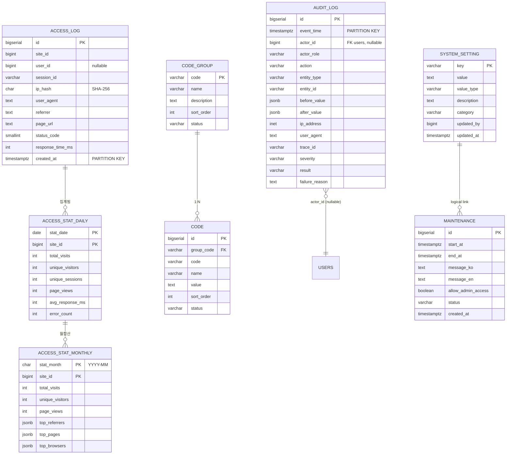
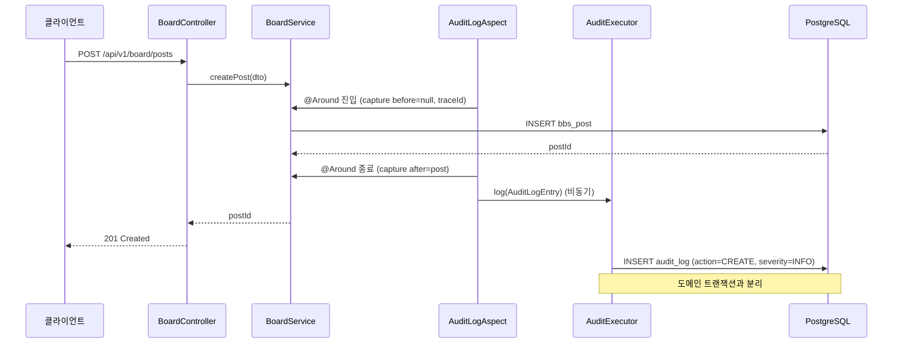
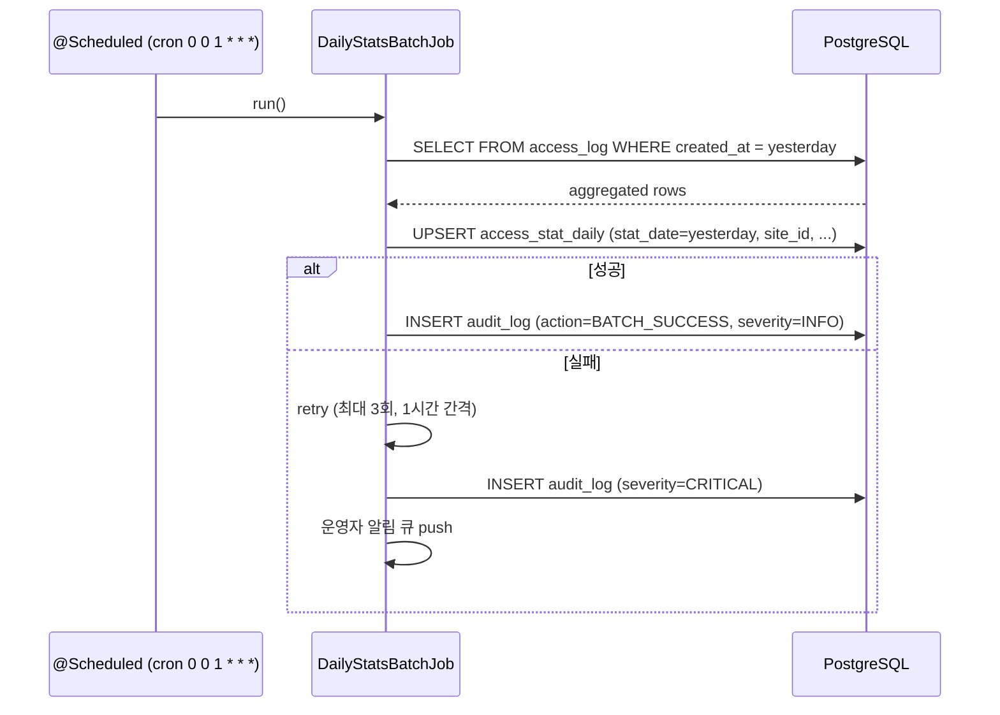
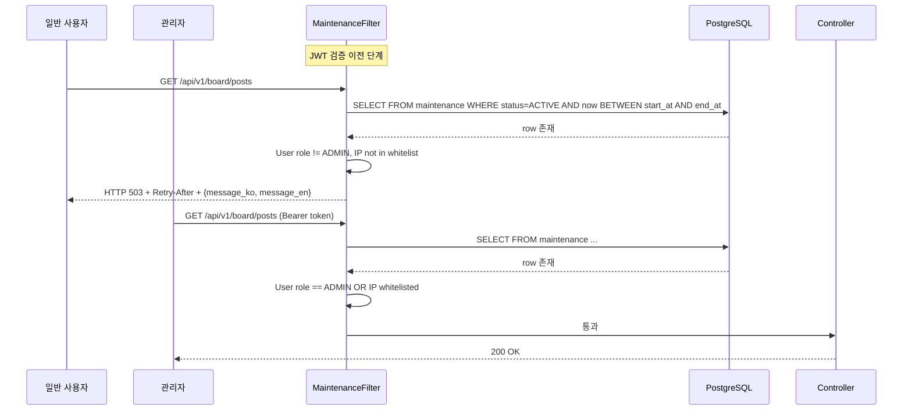
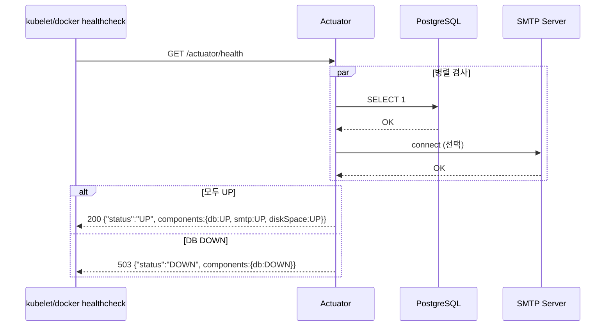

# SPEC-CMS-005: 통계·로그·시스템관리 상세 (Bundle D)  v0.4 (2026-04-29 Spring Boot 3.5.9 + 운영 결정 통합 — SPEC-CMS-001 v0.4 §20 부록 참조)

## 1. 개요

| 항목 | 내용 |
|------|------|
| SPEC ID | SPEC-CMS-005 |
| 제목 | 통계·로그·시스템관리 상세 (Bundle D — Statistics, Logs, System Administration) |
| 작성일 | 2026-04-29 |
| 작성자 | manager-spec (MoAI) |
| 상태 | Tested |
| 우선순위 | P0 |
| 분류 | Detail SPEC (parent: SPEC-CMS-001) |
| 의존 SPEC | SPEC-CMS-002 (login_history 통계 집계 대상) |
| 형제 SPEC | SPEC-CMS-003 (게시판 통계), SPEC-CMS-004 (페이지 조회 통계) |

본 SPEC은 SPEC-CMS-001(Umbrella)의 §6.4 REQ-SYSTEM-* 6개 요구사항과 §6.5 REQ-CROSS-* 중 본 SPEC에서 상세화하는 횡단 관심사(REQ-CROSS-001 감사로그, REQ-CROSS-007 관측성, REQ-CROSS-008 Docker 배포)를 구현하기 위한 상세 명세이다. 1차 출시(공공기관 CMS)의 마지막 묶음이며, 운영·감사·배포의 기반이 된다.

---

## 2. 참조 문서

- **상위 SPEC**: SPEC-CMS-001 §6.4 REQ-SYSTEM-001~006, §6.5 REQ-CROSS-001/007/008
- **상위 인수기준**: SPEC-CMS-001 acceptance.md §D, §E
- **선행 SPEC**: SPEC-CMS-002 §4.2.8 `login_history` (본 SPEC 통계 집계 대상에 포함)
- **형제 SPEC**: SPEC-CMS-003 게시판 통계 데이터 소스, SPEC-CMS-004 페이지 조회 통계 데이터 소스
- **프로젝트 문서**: `.moai/project/tech.md` §8 관측성, §6 컨테이너

---

## 3. 범위 및 비범위

### 3.1 1차 포함 범위

- 접속 로그 적재(요청 단위 raw 로그) 및 IP 익명화(SHA-256)
- 일별·월별 집계 배치(Spring Scheduling 기반, cron)
- 운영 대시보드(오늘 KPI, 추이 그래프, 최근 24h audit_log 요약)
- 공통코드 그룹·코드 CRUD 및 Caffeine 인메모리 캐시
- 감사로그 AOP 적재(C/U/D 메서드, 비동기), DB 트리거 기반 APPEND-ONLY 강제
- 시스템 설정(key-value), 점검(maintenance) 모드
- Spring Boot Actuator 엔드포인트(/health, /info, /metrics, /prometheus)
- Logback JSON 구조화 로그(traceId/spanId MDC)
- Docker Multi-stage 빌드 및 docker-compose.yml 전체 스택

### 3.2 1차 비범위 (후속 SPEC 또는 운영 단계 도입)

| 비범위 항목 | 사유 |
|------------|------|
| 실시간 지표(WebSocket/SSE) | 1차는 배치(시간/일별)로 충분 |
| Grafana 대시보드 구축 | Prometheus 메트릭 노출만 본 SPEC, 시각화는 운영 단계 |
| OpenTelemetry 분산 추적 | 단일 노드 환경에서는 우선순위 낮음 |
| TimescaleDB 도입 | 1차는 PG 16 기본 PARTITION으로 충분 |
| ELK/Loki 로그 집계 | 1차는 stdout JSON, 운영 단계 도입 |
| 멀티노드 캐시 동기화(Redis pub/sub) | 1차는 단일 노드, 캐시는 Caffeine 단일 |
| Kubernetes manifest | 1차는 docker-compose만 |
| 장기 보관(5년+) 콜드 스토리지 자동 이관 | 6개월 핫 + 수동 PG_DUMP → S3 정책 (운영 절차) |

---

## 4. 데이터 모델

### 4.1 ERD (Mermaid)



### 4.2 PostgreSQL DDL

#### 4.2.1 `access_log` (월별 PARTITION)

```sql
CREATE TABLE access_log (
    id              BIGSERIAL,
    site_id         BIGINT       NOT NULL,
    user_id         BIGINT       NULL,
    session_id      VARCHAR(64)  NULL,
    ip_hash         CHAR(64)     NOT NULL,           -- SHA-256 hex
    user_agent      TEXT         NULL,
    referrer        TEXT         NULL,
    page_url        TEXT         NOT NULL,
    status_code     SMALLINT     NOT NULL,
    response_time_ms INTEGER     NOT NULL DEFAULT 0,
    created_at      TIMESTAMPTZ  NOT NULL DEFAULT CURRENT_TIMESTAMP,
    PRIMARY KEY (id, created_at)
) PARTITION BY RANGE (created_at);

-- 초기 파티션 (운영 시 cron으로 매월 1일 생성)
CREATE TABLE access_log_y2026m04 PARTITION OF access_log
    FOR VALUES FROM ('2026-04-01') TO ('2026-05-01');
CREATE TABLE access_log_y2026m05 PARTITION OF access_log
    FOR VALUES FROM ('2026-05-01') TO ('2026-06-01');

CREATE INDEX idx_access_log_created_site ON access_log(created_at DESC, site_id);
CREATE INDEX idx_access_log_user_time    ON access_log(user_id, created_at DESC) WHERE user_id IS NOT NULL;
CREATE INDEX idx_access_log_status       ON access_log(status_code, created_at DESC) WHERE status_code >= 400;
```

#### 4.2.2 `access_stat_daily` / `access_stat_monthly`

```sql
CREATE TABLE access_stat_daily (
    stat_date         DATE      NOT NULL,
    site_id           BIGINT    NOT NULL,
    total_visits      INTEGER   NOT NULL DEFAULT 0,
    unique_visitors   INTEGER   NOT NULL DEFAULT 0,
    unique_sessions   INTEGER   NOT NULL DEFAULT 0,
    page_views        INTEGER   NOT NULL DEFAULT 0,
    avg_response_ms   INTEGER   NOT NULL DEFAULT 0,
    error_count       INTEGER   NOT NULL DEFAULT 0,
    aggregated_at     TIMESTAMPTZ NOT NULL DEFAULT CURRENT_TIMESTAMP,
    PRIMARY KEY (stat_date, site_id)
);

CREATE TABLE access_stat_monthly (
    stat_month        CHAR(7)   NOT NULL,            -- 'YYYY-MM'
    site_id           BIGINT    NOT NULL,
    total_visits      INTEGER   NOT NULL DEFAULT 0,
    unique_visitors   INTEGER   NOT NULL DEFAULT 0,
    page_views        INTEGER   NOT NULL DEFAULT 0,
    top_referrers     JSONB     NULL,
    top_pages         JSONB     NULL,
    top_browsers      JSONB     NULL,
    aggregated_at     TIMESTAMPTZ NOT NULL DEFAULT CURRENT_TIMESTAMP,
    PRIMARY KEY (stat_month, site_id)
);
```

#### 4.2.3 `code_group` / `code`

```sql
CREATE TABLE code_group (
    code         VARCHAR(50)  PRIMARY KEY,
    name         VARCHAR(100) NOT NULL,
    description  TEXT         NULL,
    sort_order   INTEGER      NOT NULL DEFAULT 0,
    status       VARCHAR(20)  NOT NULL DEFAULT 'ACTIVE',
    created_at   TIMESTAMPTZ  NOT NULL DEFAULT CURRENT_TIMESTAMP,
    updated_at   TIMESTAMPTZ  NOT NULL DEFAULT CURRENT_TIMESTAMP,
    CONSTRAINT chk_code_group_status CHECK (status IN ('ACTIVE','INACTIVE'))
);

CREATE TABLE code (
    id           BIGSERIAL    PRIMARY KEY,
    group_code   VARCHAR(50)  NOT NULL REFERENCES code_group(code) ON DELETE RESTRICT,
    code         VARCHAR(50)  NOT NULL,
    name         VARCHAR(200) NOT NULL,
    value        TEXT         NULL,
    sort_order   INTEGER      NOT NULL DEFAULT 0,
    status       VARCHAR(20)  NOT NULL DEFAULT 'ACTIVE',
    created_at   TIMESTAMPTZ  NOT NULL DEFAULT CURRENT_TIMESTAMP,
    updated_at   TIMESTAMPTZ  NOT NULL DEFAULT CURRENT_TIMESTAMP,
    CONSTRAINT uk_code UNIQUE (group_code, code),
    CONSTRAINT chk_code_status CHECK (status IN ('ACTIVE','INACTIVE'))
);

CREATE INDEX idx_code_group_sort ON code(group_code, sort_order, status);
```

#### 4.2.4 `audit_log` (월별 PARTITION + APPEND-ONLY 트리거)

```sql
CREATE TABLE audit_log (
    id              BIGSERIAL,
    event_time      TIMESTAMPTZ  NOT NULL DEFAULT CURRENT_TIMESTAMP,
    actor_id        BIGINT       NULL,                -- nullable for anonymous
    actor_role      VARCHAR(50)  NULL,
    action          VARCHAR(30)  NOT NULL,            -- CREATE/UPDATE/DELETE/LOGIN/LOGOUT/PERMISSION_CHANGE
    entity_type     VARCHAR(80)  NOT NULL,            -- 예: bbs_post, users, menu
    entity_id       VARCHAR(80)  NULL,
    before_value    JSONB        NULL,
    after_value     JSONB        NULL,
    ip_address      INET         NULL,
    user_agent      TEXT         NULL,
    trace_id        VARCHAR(64)  NULL,
    severity        VARCHAR(20)  NOT NULL DEFAULT 'INFO',  -- INFO/WARN/CRITICAL
    result          VARCHAR(20)  NOT NULL DEFAULT 'SUCCESS', -- SUCCESS/FAILURE
    failure_reason  TEXT         NULL,
    PRIMARY KEY (id, event_time),
    CONSTRAINT chk_audit_action CHECK (action IN ('CREATE','UPDATE','DELETE','LOGIN','LOGOUT','PERMISSION_CHANGE','EXPORT','VIEW_SENSITIVE')),
    CONSTRAINT chk_audit_severity CHECK (severity IN ('INFO','WARN','CRITICAL')),
    CONSTRAINT chk_audit_result   CHECK (result IN ('SUCCESS','FAILURE'))
) PARTITION BY RANGE (event_time);

CREATE TABLE audit_log_y2026m04 PARTITION OF audit_log
    FOR VALUES FROM ('2026-04-01') TO ('2026-05-01');
CREATE TABLE audit_log_y2026m05 PARTITION OF audit_log
    FOR VALUES FROM ('2026-05-01') TO ('2026-06-01');

CREATE INDEX idx_audit_log_time_entity ON audit_log(event_time DESC, entity_type);
CREATE INDEX idx_audit_log_actor_time  ON audit_log(actor_id, event_time DESC) WHERE actor_id IS NOT NULL;
CREATE INDEX idx_audit_log_critical    ON audit_log(event_time DESC) WHERE severity = 'CRITICAL';
CREATE INDEX idx_audit_log_trace       ON audit_log(trace_id) WHERE trace_id IS NOT NULL;

-- APPEND-ONLY 강제: UPDATE/DELETE 차단 트리거
CREATE OR REPLACE FUNCTION fn_audit_log_immutable()
RETURNS TRIGGER AS $$
BEGIN
    RAISE EXCEPTION 'audit_log is APPEND-ONLY: % operation forbidden', TG_OP
        USING ERRCODE = 'insufficient_privilege';
    RETURN NULL;
END;
$$ LANGUAGE plpgsql;

CREATE TRIGGER trg_audit_log_no_update
    BEFORE UPDATE ON audit_log
    FOR EACH ROW EXECUTE FUNCTION fn_audit_log_immutable();

CREATE TRIGGER trg_audit_log_no_delete
    BEFORE DELETE ON audit_log
    FOR EACH ROW EXECUTE FUNCTION fn_audit_log_immutable();
```

#### 4.2.5 `system_setting` / `maintenance`

```sql
CREATE TABLE system_setting (
    key          VARCHAR(100) PRIMARY KEY,
    value        TEXT         NOT NULL,
    value_type   VARCHAR(20)  NOT NULL DEFAULT 'STRING',
    description  TEXT         NULL,
    category     VARCHAR(50)  NOT NULL DEFAULT 'GENERAL',
    updated_by   BIGINT       NULL,
    updated_at   TIMESTAMPTZ  NOT NULL DEFAULT CURRENT_TIMESTAMP,
    CONSTRAINT chk_setting_type CHECK (value_type IN ('STRING','INT','BOOL','JSON'))
);

CREATE TABLE maintenance (
    id                    BIGSERIAL    PRIMARY KEY,
    start_at              TIMESTAMPTZ  NOT NULL,
    end_at                TIMESTAMPTZ  NOT NULL,
    message_ko            TEXT         NOT NULL,
    message_en            TEXT         NOT NULL,
    allow_admin_access    BOOLEAN      NOT NULL DEFAULT TRUE,
    status                VARCHAR(20)  NOT NULL DEFAULT 'SCHEDULED',
    created_at            TIMESTAMPTZ  NOT NULL DEFAULT CURRENT_TIMESTAMP,
    CONSTRAINT chk_maint_status CHECK (status IN ('SCHEDULED','ACTIVE','COMPLETED','CANCELLED')),
    CONSTRAINT chk_maint_period CHECK (end_at > start_at)
);

CREATE INDEX idx_maintenance_active ON maintenance(status, start_at, end_at) WHERE status IN ('SCHEDULED','ACTIVE');
```

---

## 5. 요구사항 (EARS 상세)

### 5.1 REQ-SYSTEM-001-D: 접속 로그 적재 (SPEC-CMS-001 REQ-SYSTEM-001 상세화)

- **REQ-SYSTEM-001-D-1 (적재 — Ubiquitous)**
  시스템은 모든 페이지·API 요청에 대해 (site_id, user_id?, session_id, ip_hash, user_agent, referrer, page_url, status_code, response_time_ms, created_at)을 `access_log` 테이블에 기록해야 한다. Spring Filter `AccessLogFilter`가 ServletRequest 처리 후 비동기 INSERT.
- **REQ-SYSTEM-001-D-2 (IP 익명화 — Ubiquitous)**
  시스템은 클라이언트 IP를 SHA-256으로 해시(`ip_hash` 64자 hex)하여 저장해야 하며, 평문 IP를 DB에 저장해서는 안 된다. 솔트는 `ACCESS_LOG_IP_SALT` 환경변수에서 주입.
- **REQ-SYSTEM-001-D-3 (정적 리소스 제외 — Optional)**
  시스템은 `/static/**`, `/assets/**`, `/favicon.ico`, `*.js`, `*.css`, `*.png` 요청은 access_log에 기록하지 않아야 한다 (Filter 화이트리스트).
- **REQ-SYSTEM-001-D-4 (월별 파티션 자동 생성 — Event-driven)**
  매월 25일 02:00에 시스템은 다음 달 access_log·audit_log 파티션을 자동 생성해야 한다(`@Scheduled` + `pg_partman` 또는 자체 SQL).
- **REQ-SYSTEM-001-D-5 (보존 — Ubiquitous)**
  시스템은 access_log를 12개월 보존 후 archive 후 DROP PARTITION 해야 하며, audit_log는 핫 6개월 + 콜드(PG_DUMP) 5년 보존해야 한다.

### 5.2 REQ-SYSTEM-002-D: 일별/월별 통계 집계 배치

- **REQ-SYSTEM-002-D-1 (일별 배치 — Event-driven)**
  매일 01:00 (Asia/Seoul, cron `0 0 1 * * *`)에 시스템은 전일 access_log를 집계하여 access_stat_daily에 UPSERT해야 한다 (Spring `@Scheduled`).
- **REQ-SYSTEM-002-D-2 (월별 배치 — Event-driven)**
  매월 1일 02:00에 시스템은 전월 access_stat_daily를 합산하여 access_stat_monthly에 UPSERT하고 top_referrers/top_pages/top_browsers를 jsonb로 갱신해야 한다.
- **REQ-SYSTEM-002-D-3 (배치 실패 재시도 — Unwanted/Recovery)**
  배치 실패 시 시스템은 최대 3회까지 1시간 간격으로 재시도해야 하며, 3회 모두 실패 시 audit_log severity=CRITICAL로 기록하고 운영자 알림 큐에 push해야 한다.
- **REQ-SYSTEM-002-D-4 (수동 재집계 — Optional)**
  운영자가 `POST /api/v1/system/stats/recompute`를 호출하면 시스템은 지정된 날짜 범위의 통계를 재집계해야 한다.

### 5.3 REQ-SYSTEM-003-D: 운영 대시보드

- **REQ-SYSTEM-003-D-1 (KPI 위젯 — Ubiquitous)**
  시스템은 `GET /api/v1/system/dashboard` 응답에 `today_visits`, `today_unique`, `today_page_views`, `today_signups`, `error_rate_24h`, `avg_response_ms_24h`, `locked_accounts`, `audit_log_24h_count`, `audit_log_critical_24h_count`, `health_status`를 포함해야 한다.
- **REQ-SYSTEM-003-D-2 (추이 그래프 — Ubiquitous)**
  시스템은 `GET /api/v1/system/dashboard/trends?days=30`을 통해 30일 일별 방문·페이지뷰·오류 시계열 데이터를 반환해야 한다.
- **REQ-SYSTEM-003-D-3 (인기 페이지 Top 10 — Ubiquitous)**
  시스템은 `GET /api/v1/system/dashboard/top-pages?period=7d`를 통해 최근 7일 인기 페이지 상위 10건을 반환해야 한다.
- **REQ-SYSTEM-003-D-4 (캐시 — Optional)**
  대시보드 KPI 응답은 60초 TTL Caffeine 캐시로 제공해야 하며, 캐시 우회 헤더 `X-No-Cache: true` 시 즉시 재계산해야 한다.

### 5.4 REQ-SYSTEM-004-D: 공통코드 관리

- **REQ-SYSTEM-004-D-1 (그룹 CRUD — Ubiquitous)**
  시스템은 `GET|POST|PUT|DELETE /api/v1/system/codes/groups`를 통해 code_group의 CRUD를 제공해야 하며, 사용 중인 그룹 삭제 시 RESTRICT(코드 존재 시 거부)로 처리해야 한다.
- **REQ-SYSTEM-004-D-2 (코드 CRUD — Ubiquitous)**
  시스템은 `GET|POST|PUT|DELETE /api/v1/system/codes`를 제공하며, (group_code, code) 중복은 UNIQUE 제약 위반으로 거부해야 한다.
- **REQ-SYSTEM-004-D-3 (그룹별 묶음 조회 — Ubiquitous)**
  시스템은 `GET /api/v1/system/codes?groupCode=GENDER`를 통해 status=ACTIVE 코드만 sort_order 오름차순으로 반환해야 한다.
- **REQ-SYSTEM-004-D-4 (캐시 무효화 — Event-driven)**
  코드 그룹 또는 코드의 C/U/D가 발생했을 때, 시스템은 Caffeine 캐시 키 `codes::{groupCode}` 와 `codes::all`을 즉시 무효화해야 한다.
- **REQ-SYSTEM-004-D-5 (대량 조회 — Optional)**
  시스템은 `GET /api/v1/system/codes/bulk?groups=A,B,C`로 다중 그룹 코드를 한 번에 반환할 수 있어야 한다 (드롭다운 초기 로딩 최적화).

### 5.5 REQ-SYSTEM-005-D: 시스템 설정 + 점검 모드

- **REQ-SYSTEM-005-D-1 (설정 CRUD — Ubiquitous)**
  시스템은 `GET|PUT /api/v1/system/settings/{key}`로 단일 키 조회·수정을 제공해야 하며, 변경 시 audit_log에 기록해야 한다.
- **REQ-SYSTEM-005-D-2 (점검 모드 등록 — Ubiquitous)**
  시스템은 `POST /api/v1/system/maintenance` 로 점검(start_at, end_at, message_ko, message_en, allow_admin_access)을 등록할 수 있어야 한다.
- **REQ-SYSTEM-005-D-3 (점검 모드 활성화 — State-driven)**
  현재 시각이 maintenance.start_at ≤ now ≤ end_at 이고 status=ACTIVE인 동안, 시스템은 비-관리자 요청에 HTTP 503 + Retry-After 헤더 + 점검 메시지(JSON)를 반환해야 한다.
- **REQ-SYSTEM-005-D-4 (관리자 화이트리스트 — Ubiquitous)**
  점검 모드 중에도 시스템은 ROLE=ADMIN 사용자와 환경변수 `ADMIN_IP_WHITELIST`에 등록된 IP는 정상 응답해야 한다 (REQ-CROSS-008-D 위험 완화).
- **REQ-SYSTEM-005-D-5 (점검 종료 — Event-driven)**
  end_at 도달 시 시스템은 status=COMPLETED로 자동 전환하고 audit_log에 기록해야 한다 (`@Scheduled` 매분 점검).

### 5.6 REQ-SYSTEM-006-D: 헬스체크 및 점검

- **REQ-SYSTEM-006-D-1 (Actuator health — Ubiquitous)**
  시스템은 `GET /actuator/health`로 DB(PostgreSQL), Redis(있는 경우), SMTP(설정된 경우), DiskSpace의 통합 상태를 반환해야 한다.
- **REQ-SYSTEM-006-D-2 (DB 다운 시 503 — State-driven)**
  PostgreSQL 연결이 실패하는 동안, 시스템은 `/actuator/health` 응답으로 status=DOWN + HTTP 503을 반환해야 한다.
- **REQ-SYSTEM-006-D-3 (응답 시간 — Ubiquitous)**
  헬스체크 응답은 100ms 이내(p95)에 반환되어야 한다.

### 5.7 REQ-CROSS-001-D: 감사로그 (SPEC-CMS-001 REQ-CROSS-004/005 상세화)

- **REQ-CROSS-001-D-1 (`@AuditLog` 어노테이션 — Ubiquitous)**
  시스템은 `@AuditLog(entityType, action, severity)` 어노테이션을 제공하고, Spring AOP `@Around`로 메서드 진입·종료를 가로채어 audit_log에 적재해야 한다.
- **REQ-CROSS-001-D-2 (자동 적재 — Ubiquitous)**
  도메인 Service의 모든 `create*`, `update*`, `delete*` 메서드는 어노테이션 없이도 메서드명 패턴 매칭(AspectJ pointcut)으로 자동 적재되어야 한다 (SPEC-CMS-001 REQ-CROSS-004 자동화).
- **REQ-CROSS-001-D-3 (비동기 적재 — Ubiquitous)**
  audit_log 적재는 `@Async` + 별도 스레드 풀(`audit-executor`, core=2 max=8 queue=1000)로 처리되어 도메인 트랜잭션을 차단하지 않아야 한다.
- **REQ-CROSS-001-D-4 (개인정보 마스킹 — Ubiquitous)**
  파라미터 직렬화 시 시스템은 `@Sensitive` 표시 필드(password, ssn, phone, email)를 자동 마스킹하여 before_value/after_value JSONB에 저장해야 한다.
- **REQ-CROSS-001-D-5 (APPEND-ONLY — Unwanted)**
  시스템은 audit_log 테이블에 대해 UPDATE 또는 DELETE 시도 시 PostgreSQL 트리거(`fn_audit_log_immutable`)로 거부해야 하며, 거부 이벤트는 별도 `audit_violation_log`에 기록해야 한다.
- **REQ-CROSS-001-D-6 (CRITICAL 알림 — Event-driven)**
  severity=CRITICAL 행이 적재되었을 때, 시스템은 운영자 알림 큐에 즉시 push하고 (1차는 인앱 알림, SMTP 설정 시 이메일) audit_log.trace_id로 추적 가능하게 해야 한다.
- **REQ-CROSS-001-D-7 (보존 정책 — Ubiquitous)**
  시스템은 audit_log를 핫(현재+5개월) PG 파티션 + 콜드(PG_DUMP S3) 5년 보존해야 하며, 6개월 이상된 파티션은 매월 1일 03:00에 DETACH 후 PG_DUMP 후 S3 업로드해야 한다 (1차는 수동 절차 문서화).

### 5.8 REQ-CROSS-007-D: 관측성 (SPEC-CMS-001 REQ-CROSS-009/010 상세화)

- **REQ-CROSS-007-D-1 (Actuator 엔드포인트 — Ubiquitous)**
  시스템은 `/actuator/health`, `/actuator/info`, `/actuator/metrics`, `/actuator/prometheus`, `/actuator/loggers`를 활성화해야 하며, /loggers는 ADMIN 권한만 접근 가능해야 한다.
- **REQ-CROSS-007-D-2 (Logback JSON — Ubiquitous)**
  운영 프로파일(`prod`)에서 시스템은 `logstash-logback-encoder`로 stdout JSON 로그를 출력해야 하며, MDC에 `traceId`, `spanId`, `userId`, `requestId`를 포함해야 한다.
- **REQ-CROSS-007-D-3 (Prometheus 인증 — Optional)**
  /actuator/prometheus 엔드포인트는 nginx 레이어에서 IP 화이트리스트 + Basic Auth로 보호되어야 한다 (1차는 내부망 한정, OpenTelemetry는 후속).

### 5.9 REQ-CROSS-008-D: Docker 배포 (SPEC-CMS-001 REQ-CROSS-008 상세화)

- **REQ-CROSS-008-D-1 (Multi-stage 빌드 — Ubiquitous)**
  시스템은 backend(`Dockerfile.backend`)와 admin-fe/public-fe(`Dockerfile.frontend`)를 Multi-stage로 빌드해야 한다. Stage 1: build (jdk/node), Stage 2: runtime (jre/nginx-alpine).
- **REQ-CROSS-008-D-2 (docker-compose 전체 스택 — Ubiquitous)**
  `deploy/docker-compose.yml`은 postgres, backend, admin-fe, public-fe, nginx 5개 서비스를 정의해야 하며, `docker-compose up -d`로 전체 스택이 기동되어야 한다.
- **REQ-CROSS-008-D-3 (헬스체크 — Ubiquitous)**
  각 서비스 Dockerfile에 `HEALTHCHECK` 지시어를 정의해야 한다 (backend: curl /actuator/health, postgres: pg_isready, nginx: curl /health).
- **REQ-CROSS-008-D-4 (환경변수 — Ubiquitous)**
  시스템은 `.env.example` 템플릿(`JWT_SECRET`, `DB_URL`, `DB_PASSWORD`, `SMTP_HOST`, `ACCESS_LOG_IP_SALT`, `AES_KEY`, `ADMIN_IP_WHITELIST`)을 제공해야 하며, 시크릿 값은 절대 이미지에 포함되어선 안 된다.
- **REQ-CROSS-008-D-5 (롤링 업데이트 — Optional)**
  운영자가 `docker compose up -d --no-deps backend`로 backend만 재배포할 수 있어야 하며, nginx upstream이 `proxy_next_upstream`으로 무중단 처리해야 한다 (1차는 단일 노드, 진정한 zero-downtime은 K8s 후속).

---

## 6. REST API 명세

| 메서드 | 경로 | 설명 | 권한 | REQ |
|--------|------|------|------|-----|
| **6.1 통계 / 대시보드** | | | | |
| GET | `/api/v1/system/dashboard` | 운영 대시보드 KPI | ADMIN | REQ-SYSTEM-003-D-1 |
| GET | `/api/v1/system/dashboard/trends` | 30일 추이 시계열 | ADMIN | REQ-SYSTEM-003-D-2 |
| GET | `/api/v1/system/dashboard/top-pages` | 인기 페이지 Top 10 | ADMIN | REQ-SYSTEM-003-D-3 |
| GET | `/api/v1/system/stats/visitors` | 일별/월별 방문자 (period=DAILY\|MONTHLY) | ADMIN | REQ-SYSTEM-002-D-1/2 |
| GET | `/api/v1/system/stats/users/{userId}` | 사용자별 활동 | ADMIN | — |
| POST | `/api/v1/system/stats/recompute` | 통계 수동 재집계 | ADMIN | REQ-SYSTEM-002-D-4 |
| **6.2 접속 로그** | | | | |
| GET | `/api/v1/system/access-logs` | 접속로그 검색 (페이징, 필터) | ADMIN | REQ-SYSTEM-001-D-1 |
| GET | `/api/v1/system/access-logs/export` | CSV 다운로드 | ADMIN | — |
| **6.3 공통코드** | | | | |
| GET | `/api/v1/system/codes/groups` | 그룹 목록 | ADMIN/USER | REQ-SYSTEM-004-D-1 |
| POST | `/api/v1/system/codes/groups` | 그룹 생성 | ADMIN | REQ-SYSTEM-004-D-1 |
| PUT | `/api/v1/system/codes/groups/{code}` | 그룹 수정 | ADMIN | REQ-SYSTEM-004-D-1 |
| DELETE | `/api/v1/system/codes/groups/{code}` | 그룹 삭제 (RESTRICT) | ADMIN | REQ-SYSTEM-004-D-1 |
| GET | `/api/v1/system/codes` | 코드 목록 (groupCode 필터) | ALL | REQ-SYSTEM-004-D-3 |
| POST | `/api/v1/system/codes` | 코드 생성 | ADMIN | REQ-SYSTEM-004-D-2 |
| PUT | `/api/v1/system/codes/{id}` | 코드 수정 | ADMIN | REQ-SYSTEM-004-D-2 |
| DELETE | `/api/v1/system/codes/{id}` | 코드 삭제 | ADMIN | REQ-SYSTEM-004-D-2 |
| GET | `/api/v1/system/codes/bulk` | 다중 그룹 묶음 조회 | ALL | REQ-SYSTEM-004-D-5 |
| **6.4 시스템 설정** | | | | |
| GET | `/api/v1/system/settings` | 전체 설정 (category 필터) | ADMIN | REQ-SYSTEM-005-D-1 |
| GET | `/api/v1/system/settings/{key}` | 단일 설정 | ADMIN | REQ-SYSTEM-005-D-1 |
| PUT | `/api/v1/system/settings/{key}` | 설정 수정 | ADMIN | REQ-SYSTEM-005-D-1 |
| **6.5 점검 모드** | | | | |
| GET | `/api/v1/system/maintenance` | 점검 일정 목록 | ADMIN | REQ-SYSTEM-005-D-2 |
| POST | `/api/v1/system/maintenance` | 점검 등록 | ADMIN | REQ-SYSTEM-005-D-2 |
| POST | `/api/v1/system/maintenance/{id}/activate` | 즉시 활성화 | ADMIN | REQ-SYSTEM-005-D-3 |
| POST | `/api/v1/system/maintenance/{id}/cancel` | 점검 취소/해제 | ADMIN | REQ-SYSTEM-005-D-5 |
| **6.6 감사로그** | | | | |
| GET | `/api/v1/system/audit-logs` | 검색 (actor·entity·기간·severity·action 필터) | ADMIN | REQ-CROSS-001-D-1 |
| GET | `/api/v1/system/audit-logs/{id}` | 단건 조회 (before/after diff 포함) | ADMIN | — |
| GET | `/api/v1/system/audit-logs/export` | CSV 내보내기 (자기 자신도 audit_log) | ADMIN | REQ-CROSS-001-D-1 |
| GET | `/api/v1/system/audit-logs/critical` | CRITICAL 알림 큐 | ADMIN | REQ-CROSS-001-D-6 |
| **6.7 헬스체크 / 메트릭** | | | | |
| GET | `/actuator/health` | 통합 헬스체크 | ALL | REQ-SYSTEM-006-D-1 |
| GET | `/actuator/info` | 빌드/버전 정보 | ALL | REQ-CROSS-007-D-1 |
| GET | `/actuator/metrics` | 메트릭 목록 | ADMIN | REQ-CROSS-007-D-1 |
| GET | `/actuator/prometheus` | Prometheus scrape | INTERNAL | REQ-CROSS-007-D-3 |
| GET | `/actuator/loggers` | 로거 레벨 조회/변경 | ADMIN | REQ-CROSS-007-D-1 |

페이징·정렬 규약은 SPEC-CMS-001 §8(일관 규약)을 따른다.

---

## 7. 감사로그 구현 패턴 (Spring AOP)

### 7.1 `@AuditLog` 어노테이션

```java
@Retention(RetentionPolicy.RUNTIME)
@Target(ElementType.METHOD)
public @interface AuditLog {
    String entityType();
    AuditAction action() default AuditAction.AUTO;     // CREATE/UPDATE/DELETE/AUTO
    AuditSeverity severity() default AuditSeverity.INFO;
    boolean captureBefore() default true;
    boolean captureAfter()  default true;
}
```

- `action=AUTO`인 경우 메서드명 prefix(`create`, `update`, `delete`)에서 자동 추론
- 명시 어노테이션이 없어도 Service 레이어 C/U/D 메서드는 패턴 매칭으로 자동 적재 (REQ-CROSS-001-D-2)

### 7.2 AOP Aspect

```java
@Aspect @Component @RequiredArgsConstructor
public class AuditLogAspect {
    private final AuditLogService auditLogService;
    private final HttpServletRequest request;

    @Around("@annotation(auditLog) || (execution(* com.iroum.cms..*Service.create*(..)) " +
            "|| execution(* com.iroum.cms..*Service.update*(..)) " +
            "|| execution(* com.iroum.cms..*Service.delete*(..)))")
    public Object around(ProceedingJoinPoint pjp, AuditLog auditLog) throws Throwable {
        // 진입: actor, traceId(MDC), beforeValue 캡처
        // 호출: pjp.proceed()
        // 종료: afterValue + result + 비동기 적재 호출
        // 예외: result=FAILURE + failure_reason
    }
}
```

- `traceId`는 MDC에서 가져오며, 미존재 시 `UUID.randomUUID()` 발급
- `beforeValue`는 entity 조회 후 직렬화(`ObjectMapper`); 신규 생성은 null

### 7.3 비동기 적재

```java
@Service @RequiredArgsConstructor
public class AuditLogService {
    private final AuditLogMapper mapper;       // MyBatis
    private final RetryTemplate retryTemplate; // 3회 재시도

    @Async("auditExecutor")
    public CompletableFuture<Void> log(AuditLogEntry entry) {
        retryTemplate.execute(ctx -> {
            mapper.insert(entry);
            return null;
        });
        return CompletableFuture.completedFuture(null);
    }
}
```

- 스레드 풀: core=2, max=8, queue=1000 (`auditExecutor` Bean)
- 재시도 실패 시 fallback 큐(파일 또는 별도 테이블 `audit_fallback`)에 적재

### 7.4 APPEND-ONLY 강제

- DB 트리거 `fn_audit_log_immutable` (§4.2.4)가 1차 방어선
- 애플리케이션은 `audit_log` 테이블에 대해 INSERT 외 SQL 실행 금지 (코드 리뷰 + MyBatis Mapper 정적 검사)

### 7.5 보존 정책

| 단계 | 위치 | 기간 | 도구 |
|------|------|------|------|
| 핫 (조회 가능) | PG `audit_log` 파티션 | 6개월 | `pg_partman` 또는 자체 SQL |
| 콜드 (보관) | S3 (Glacier) PG_DUMP 파일 | 5년 | 매월 1일 03:00 DETACH + dump + upload |
| 폐기 | — | 5년 경과 | S3 lifecycle rule |

1차는 콜드 이관 절차를 운영 매뉴얼로 문서화하고, 자동화는 후속 SPEC.

---

## 8. 시퀀스 다이어그램

### 8.1 게시글 작성 → 감사로그 비동기 적재



### 8.2 일별 통계 배치



### 8.3 점검 모드 활성화 흐름



### 8.4 헬스체크 흐름



---

## 9. 공통코드 캐시 정책

### 9.1 Caffeine 인메모리 캐시

```java
@Configuration
@EnableCaching
public class CacheConfig {
    @Bean
    public CacheManager cacheManager() {
        CaffeineCacheManager m = new CaffeineCacheManager("codes", "codeGroups", "dashboard");
        m.setCaffeine(Caffeine.newBuilder()
            .expireAfterWrite(Duration.ofHours(1))
            .maximumSize(10_000)
            .recordStats());
        return m;
    }
}
```

| 캐시 키 | TTL | 무효화 트리거 |
|--------|-----|--------------|
| `codes::{groupCode}` | 1h | code C/U/D |
| `codes::all` | 1h | code 또는 group C/U/D |
| `codeGroups::all` | 1h | group C/U/D |
| `dashboard::kpi` | 60s | 자동 만료 |

### 9.2 무효화 이벤트

- `@CacheEvict(value="codes", key="#groupCode")`를 코드 C/U/D 메서드에 적용
- 단일 노드 환경에서는 즉시 반영
- 멀티노드 동기화(Redis pub/sub)는 후속 SPEC

### 9.3 다중 그룹 묶음 조회

`GET /api/v1/system/codes/bulk?groups=GENDER,COUNTRY,LANG` → 응답 예:
```json
{
  "GENDER": [{"code":"M","name":"남성"}, {"code":"F","name":"여성"}],
  "COUNTRY": [...],
  "LANG": [...]
}
```

---

## 10. 관측성 아키텍처

### 10.1 Spring Boot Actuator 엔드포인트

```yaml
management:
  endpoints:
    web:
      exposure:
        include: health, info, metrics, prometheus, loggers
      base-path: /actuator
  endpoint:
    health:
      show-details: when_authorized
      probes:
        enabled: true
  metrics:
    distribution:
      percentiles-histogram:
        http.server.requests: true
      percentiles:
        http.server.requests: 0.5, 0.95, 0.99
```

### 10.2 Logback JSON (운영)

```xml
<configuration>
  <springProfile name="prod">
    <appender name="JSON_STDOUT" class="ch.qos.logback.core.ConsoleAppender">
      <encoder class="net.logstash.logback.encoder.LogstashEncoder">
        <includeMdcKeyName>traceId</includeMdcKeyName>
        <includeMdcKeyName>spanId</includeMdcKeyName>
        <includeMdcKeyName>userId</includeMdcKeyName>
        <includeMdcKeyName>requestId</includeMdcKeyName>
      </encoder>
    </appender>
    <root level="INFO"><appender-ref ref="JSON_STDOUT"/></root>
  </springProfile>
</configuration>
```

### 10.3 nginx Prometheus 보호

```nginx
location /actuator/prometheus {
    allow 10.0.0.0/8;
    allow 172.16.0.0/12;
    deny all;
    auth_basic "Prometheus";
    auth_basic_user_file /etc/nginx/.htpasswd;
    proxy_pass http://backend:8080;
}
```

### 10.4 OpenTelemetry (후속)

OTLP 엑스포터 + Jaeger/Tempo 연동은 2차 SPEC. 1차는 traceId MDC만으로 단일 노드 추적 충분.

---

## 11. Docker 배포 사양

### 11.1 Dockerfile.backend (Multi-stage)

```dockerfile
# Stage 1: Builder
FROM eclipse-temurin:17-jdk-alpine AS builder
WORKDIR /build
COPY gradlew settings.gradle.kts build.gradle.kts ./
COPY gradle ./gradle
RUN ./gradlew dependencies --no-daemon
COPY src ./src
RUN ./gradlew bootJar --no-daemon

# Stage 2: Runtime
FROM eclipse-temurin:17-jre-alpine
RUN apk add --no-cache curl tini
WORKDIR /app
COPY --from=builder /build/build/libs/*.jar app.jar
EXPOSE 8080
HEALTHCHECK --interval=30s --timeout=5s --start-period=60s --retries=3 \
  CMD curl -f http://localhost:8080/actuator/health || exit 1
ENTRYPOINT ["/sbin/tini","--","java","-jar","/app/app.jar"]
```

### 11.2 Dockerfile.frontend (Multi-stage)

```dockerfile
# Stage 1: Builder
FROM node:20-alpine AS builder
WORKDIR /build
COPY package.json pnpm-lock.yaml ./
RUN corepack enable && pnpm install --frozen-lockfile
COPY . .
ARG VITE_APP=admin
RUN pnpm run build:${VITE_APP}

# Stage 2: Runtime
FROM nginx:1.27-alpine
COPY --from=builder /build/dist /usr/share/nginx/html
COPY nginx.conf /etc/nginx/conf.d/default.conf
HEALTHCHECK --interval=30s --timeout=3s CMD wget -q -O- http://localhost/health || exit 1
EXPOSE 80
```

### 11.3 docker-compose.yml

```yaml
version: "3.9"
services:
  postgres:
    image: postgres:16-alpine
    environment:
      POSTGRES_DB: iroum_cms
      POSTGRES_USER: cms_app
      POSTGRES_PASSWORD: ${DB_PASSWORD}
    volumes:
      - pgdata:/var/lib/postgresql/data
      - ./init.sql:/docker-entrypoint-initdb.d/init.sql:ro
    healthcheck:
      test: ["CMD-SHELL", "pg_isready -U cms_app -d iroum_cms"]
      interval: 10s
      timeout: 5s
      retries: 5
    ports: ["5432:5432"]

  backend:
    build:
      context: ../backend
      dockerfile: ../deploy/Dockerfile.backend
    environment:
      SPRING_PROFILES_ACTIVE: prod
      DB_URL: jdbc:postgresql://postgres:5432/iroum_cms
      DB_PASSWORD: ${DB_PASSWORD}
      JWT_SECRET: ${JWT_SECRET}
      AES_KEY: ${AES_KEY}
      ACCESS_LOG_IP_SALT: ${ACCESS_LOG_IP_SALT}
      ADMIN_IP_WHITELIST: ${ADMIN_IP_WHITELIST}
    depends_on:
      postgres:
        condition: service_healthy
    ports: ["8080:8080"]

  admin-fe:
    build:
      context: ../frontend
      dockerfile: ../deploy/Dockerfile.frontend
      args: { VITE_APP: admin }
    depends_on: [backend]

  public-fe:
    build:
      context: ../frontend
      dockerfile: ../deploy/Dockerfile.frontend
      args: { VITE_APP: public }
    depends_on: [backend]

  nginx:
    image: nginx:1.27-alpine
    volumes:
      - ./nginx.conf:/etc/nginx/nginx.conf:ro
      - ./.htpasswd:/etc/nginx/.htpasswd:ro
    depends_on: [admin-fe, public-fe, backend]
    ports: ["80:80", "443:443"]

volumes:
  pgdata:
```

### 11.4 .env.example

```env
# Database
DB_PASSWORD=changeme

# Auth
JWT_SECRET=must-be-256-bit-random
AES_KEY=must-be-32-byte-base64

# Logging / Privacy
ACCESS_LOG_IP_SALT=random-salt-string

# Maintenance
ADMIN_IP_WHITELIST=10.0.0.0/8,192.168.1.0/24

# SMTP (optional)
SMTP_HOST=smtp.example.gov.kr
SMTP_PORT=587
SMTP_USERNAME=
SMTP_PASSWORD=
```

### 11.5 헬스체크 의존성

- backend는 postgres healthy 후 기동
- nginx는 admin-fe, public-fe, backend 모두 기동 후 시작
- compose에서 `depends_on.condition: service_healthy` 활용

---

## 12. 위험 및 대응

| ID | 위험·가정 | 영향 | 완화 방안 |
|----|----------|------|----------|
| RISK-D-01 | audit_log 폭증 (월 수천만 행) | 디스크/조회 성능 | 월별 PARTITION + 6개월 후 콜드 이관, idx_audit_log_critical partial index |
| RISK-D-02 | audit_log UPDATE/DELETE 시도 (내부자) | 감사 무결성 손상 | DB 트리거 `fn_audit_log_immutable` + audit_violation_log + DBA 감사 |
| RISK-D-03 | 통계 배치 실패가 누적되어 대시보드 KPI 결손 | 운영 의사결정 오류 | 3회 재시도 + CRITICAL 알림 + 수동 재집계 API |
| RISK-D-04 | 점검 모드 사고 (관리자 본인 차단) | 운영 마비 | ADMIN_IP_WHITELIST 항상 허용 + ROLE=ADMIN 우회 + 점검 취소 API |
| RISK-D-05 | 비동기 audit 적재 큐 오버플로우 | 감사 누락 | queue=1000 + fallback 파일/테이블 + 모니터링 |
| RISK-D-06 | Caffeine 캐시 불일치 (멀티노드 도입 시) | 코드 stale 응답 | 1차 단일 노드 한정 명시, 멀티노드 시 Redis pub/sub 후속 |
| RISK-D-07 | Prometheus 엔드포인트 외부 노출 | 정보 유출 | nginx IP 화이트리스트 + Basic Auth, Spring Security 추가 |
| RISK-D-08 | Docker 이미지 시크릿 포함 | 자격증명 유출 | `.env`는 .gitignore + Docker secrets 또는 환경변수 주입만 |
| RISK-D-09 | IP 해시 재식별 공격 | 개인정보 유출 | 충분히 큰 솔트 + 솔트 정기 회전 (분기) |
| RISK-D-10 | 대시보드 API 지연 (대량 집계) | 운영자 UX 저하 | 60s Caffeine 캐시 + 사전 집계 테이블 활용 |
| ASSUM-D-01 | 1차 환경은 단일 백엔드 노드 | — | 멀티노드는 SPEC-CMS-008+ |
| ASSUM-D-02 | S3 콜드 스토리지는 운영 단계 수동 절차 | — | 자동화는 후속 SPEC |

---

## 13. RFP 통합 보강 (v0.2 신규)

> 본 절은 RFP §SFR-013(KPI 통합 대시보드), §SFR-015(외부 연계 로그 분리), §SFR-001/SFR-011(외부 공공데이터 수집), §PER-001~004(성능 임계값) 요구를 Bundle D에 통합하기 위한 신규 부모 REQ 4종(REQ-SYSTEM-007-D ~ 010-D)을 정의한다. (SPEC-CMS-001 v0.2 §15.2 SFR-013/015 + §17.1 PER 임계값 매핑)

### 13.1 REQ-SYSTEM-007-D: KPI 통합 대시보드 (RFP SFR-013 매핑)

기존 REQ-SYSTEM-003-D(운영 대시보드)는 단일 사이트 KPI 위젯·추이만 제공하므로, RFP가 요구하는 다차원 KPI(기간/기능/업종) 정의·관리, 다중 KPI 일괄 조회, 대용량 엑셀 다운로드를 충족하기 위해 별도 KPI 정의/값 모델과 스트리밍 다운로드를 도입한다.

- **REQ-SYSTEM-007-D-1 (KPI 정의 — Ubiquitous)**
  시스템은 `kpi_definition` 테이블에 (id, code, name, description, calculation_query, refresh_interval_min, status)을 관리해야 하며, 운영자는 `GET|POST|PUT /api/v1/system/kpi/definitions` 로 KPI 메타정보 CRUD를 수행할 수 있어야 한다. `calculation_query`는 사전 검증된 SELECT 문(템플릿)이며, INSERT/UPDATE/DELETE/DDL 문은 거부되어야 한다.
- **REQ-SYSTEM-007-D-2 (KPI 값 적재 — Event-driven)**
  KPI별 `refresh_interval_min` 주기로 실행되는 `KpiRefreshScheduler`는 `calculation_query`를 실행하여 결과를 `kpi_value(id, kpi_id, dimension jsonb, value_numeric, value_text, calculated_at)`에 적재해야 한다. `dimension`은 (period, feature, industry) 키를 가지는 jsonb로, 동일 (kpi_id, dimension)에 대해 최신 값만 유지하고 이전 값은 `kpi_value_history`로 이관해야 한다.
- **REQ-SYSTEM-007-D-3 (대시보드 API — Ubiquitous)**
  시스템은 `GET /api/v1/system/kpi/dashboard?codes=PV,UV,STAY,DL`로 다중 KPI 위젯 데이터를 일괄 조회할 수 있어야 하며, `GET /api/v1/system/kpi/series?code=PV&period=30d&dimension=feature`로 차트용 시계열 데이터를 반환해야 한다. 응답에는 (KPI 메타, 최신값, 시계열, 갱신시각)을 포함해야 한다.
- **REQ-SYSTEM-007-D-4 (엑셀 스트리밍 다운로드 — Ubiquitous)**
  시스템은 `GET /api/v1/system/kpi/export?code=PV&from=YYYY-MM-DD&to=YYYY-MM-DD&format=xlsx|csv`를 통해 수십만 행 규모의 KPI 데이터를 OOM 없이 다운로드할 수 있어야 한다. xlsx는 Apache POI `SXSSFWorkbook`(window=100)으로, csv는 SQL → ResponseBody Stream(`ResultSet` fetchSize=1000)으로 처리하며, 응답 헤더에 `Transfer-Encoding: chunked`를 사용해야 한다. (research.md §10.1, §10.2 참조)
- **REQ-SYSTEM-007-D-5 (핵심 KPI 8종 — Ubiquitous)**
  시스템은 운영 출시 시점에 다음 8개 KPI를 `kpi_definition` 시드 데이터로 등록해야 한다: ① 페이지뷰(PV), ② 고유 방문자(UV), ③ 평균 체류시간(STAY_AVG_SEC), ④ 다운로드 수(DL_COUNT), ⑤ 공감·공유 합계(REACTION_TOTAL), ⑥ 정책매칭 신청 전환율(POLICY_APPLY_CVR), ⑦ 알림 도달률(NOTI_DELIVERY_RATE), ⑧ 오류율(ERROR_RATE). 각 KPI는 SPEC-CMS-003/004 통계 테이블 또는 access_log/audit_log/notification_send/integration_log 와 연계되어야 한다.

### 13.2 REQ-SYSTEM-008-D: 외부 연계 로그 분리 (RFP SFR-015 매핑)

기존 audit_log는 비즈니스 도메인 이벤트(C/U/D, 권한 변경)만 적재한다. RFP SFR-015는 외부 시스템 연계(SSO, 알림톡, 메일, 공공데이터 API) 로그를 별도로 분리·6개월 보관할 것을 요구하므로 신규 `integration_log` 모델을 도입한다.

- **REQ-SYSTEM-008-D-1 (연계 로그 모델 — Ubiquitous)**
  시스템은 `integration_log(id, integration_type, target_system, request_id, status, duration_ms, response_code, error_message, payload_hash, occurred_at)` 테이블을 운영해야 한다. `integration_type`은 (`SSO_AUTH`, `KAKAO_NOTI`, `MAIL_SEND`, `EXTERNAL_API`, `PUBLIC_DATA`) 중 하나이며, `status`는 (`SUCCESS`, `FAILURE`, `TIMEOUT`)이다. 모든 외부 호출 클라이언트(WebClient, JavaMailSender 등)는 `IntegrationLogInterceptor`를 통해 자동 적재되어야 한다.
- **REQ-SYSTEM-008-D-2 (월별 PARTITION — Ubiquitous)**
  `integration_log`는 access_log와 동일하게 `PARTITION BY RANGE (occurred_at)` 월별 파티션을 적용해야 하며, 월별 파티션 자동 생성은 REQ-SYSTEM-001-D-4 `@Scheduled`(매월 25일 02:00) 작업에 통합되어야 한다.
- **REQ-SYSTEM-008-D-3 (알림·메일 발송 이력 view — Ubiquitous, v0.2.1 사용자 결정 2026-04-29 Q-7 적용)**
  시스템은 `integration_log`(integration_type IN ('KAKAO_NOTI','MAIL_SEND'))와 `notification_send`(SPEC-CMS-004 v0.2.1 §14.2-1)를 **`notification_send.integration_log_id` FK 기반 INNER JOIN**으로 결합한 `v_notification_history` 뷰를 제공하여, 운영자가 `GET /api/v1/system/integration-logs/notifications?type=KAKAO|MAIL&from=...&to=...`로 발송 이력(수신자, 결과, 사유, 외부 응답코드)을 단일 응답으로 조회할 수 있어야 한다. INNER JOIN 채택 사유: 외부 채널 발송이 발생한 경우 반드시 양쪽 row가 동시 적재되도록 `IntegrationLogInterceptor`가 보증하므로(SPEC-CMS-004 v0.2.1 §14.2-1 NOTE), LEFT JOIN의 NULL row는 운영 정합성 위반으로 간주한다. INAPP 채널(외부 호출 없음)은 `integration_log_id IS NULL`이 정상이며 view 대상에서 자동 제외된다.
- **REQ-SYSTEM-008-D-4 (6개월 보관 + 자동 폐기 — Event-driven)**
  매월 1일 04:00에 `IntegrationLogArchiveJob`은 6개월 초과 `integration_log` 파티션을 `integration_log_archive`(콜드 테이블, 같은 스키마, 인덱스 최소)로 이관 후 원본 파티션을 DROP해야 한다. `integration_log_archive`는 개인정보보호법 보존 기간(추가 0개월) 경과 후 폐기되며, 폐기 이벤트는 audit_log severity=INFO로 적재되어야 한다.

### 13.3 REQ-SYSTEM-009-D: 외부 공공데이터 수집 배치 (RFP SFR-001 / SFR-011 매핑)

RFP SFR-001(외부 공공데이터 수집)·SFR-011(스케줄링 기반 데이터 동기화)을 충족하기 위해 외부 데이터 소스 등록·동기화·정합성 검증·실패 알림 메커니즘을 도입한다.

- **REQ-SYSTEM-009-D-1 (데이터 소스 등록 — Ubiquitous)**
  시스템은 `external_data_source(id, code, name, endpoint, schedule_cron, last_sync_at, last_status, owner_dept_id)` 테이블을 운영해야 하며, 운영자는 `GET|POST|PUT|DELETE /api/v1/system/external-sources`를 통해 데이터 소스 메타를 관리할 수 있어야 한다. `schedule_cron`은 Quartz/Spring cron 표현식이다.
- **REQ-SYSTEM-009-D-2 (동기화 이력 — Ubiquitous)**
  각 동기화 실행은 `data_sync_history(id, source_id, sync_started_at, sync_finished_at, records_total, records_inserted, records_updated, records_failed, error_summary)`에 기록되어야 하며, 운영자는 `GET /api/v1/system/external-sources/{id}/history?limit=100`로 최근 이력을 조회할 수 있어야 한다.
- **REQ-SYSTEM-009-D-3 (정합성 검증 — Ubiquitous)**
  동기화 시 시스템은 응답 스키마 변경(필수 필드 누락, 타입 불일치)을 감지해야 하며, 결측치 비율 ≥ 5% 또는 이상치 비율 ≥ 1%(IQR 기반) 발생 시 동기화를 ROLLBACK하고 `data_sync_history.error_summary`에 사유를 기록해야 한다.
- **REQ-SYSTEM-009-D-4 (실패 재시도 + CRITICAL 알림 — Event-driven)**
  동기화 실패 시 시스템은 10분 간격으로 최대 3회 재시도해야 하며, 3회 모두 실패하면 audit_log severity=CRITICAL과 운영자 알림 큐(REQ-CROSS-001-D-6 재사용)에 push해야 한다. 1차 운영은 Spring `@Scheduled` 단일 인스턴스로 실행하며, 멀티노드 전환 시 ShedLock을 도입한다(research.md §10.4).

### 13.4 REQ-SYSTEM-010-D: RFP 성능 임계값 (PER-001~004 매핑)

RFP는 검색·조회 응답시간, 배치 SLA, 동시 처리량, 동시 사용자, 자원 사용률 등 정량 임계값을 명시한다. 본 절은 SPEC-CMS-001 §17.1 PER 매핑을 Bundle D에서 직접 검증·관측 가능하도록 요구사항으로 고정한다.

- **REQ-SYSTEM-010-D-1 (검색·조회 p95 — Ubiquitous, RFP PER-003)**
  시스템은 모든 검색·목록·상세 조회 API의 p95 응답시간이 3초 미만이어야 하며, Prometheus `http_server_requests_seconds_bucket` 메트릭으로 측정·노출해야 한다. p95 ≥ 3초가 5분 연속 발생 시 알람 룰 `ApiLatencyHigh`로 운영자에게 통지해야 한다.
- **REQ-SYSTEM-010-D-2 (배치 SLA — Ubiquitous, RFP PER-003)**
  일별 배치(REQ-SYSTEM-002-D-1, REQ-SYSTEM-009-D 일별 동기화)는 시작 후 10분 이내, 월별 배치(REQ-SYSTEM-002-D-2, REQ-SYSTEM-008-D-4 archive)는 1시간 이내에 완료되어야 한다. 배치 시작·종료 시각과 소요시간은 audit_log + Prometheus `batch_job_duration_seconds`(label=job_name)에 기록해야 한다.
- **REQ-SYSTEM-010-D-3 (동시 처리량 — Ubiquitous, RFP PER-004)**
  시스템은 초당 50건 이상의 요청을 정상 처리할 수 있어야 하며(부하 테스트 검증), JMeter 50 RPS 시나리오에서 오류율 < 1%, p95 < 3초를 충족해야 한다.
- **REQ-SYSTEM-010-D-4 (동시 사용자 1,000명 + 임계 안내 — State-driven, RFP PER-004)**
  시스템은 동시 활성 사용자 1,000명까지 정상 응답해야 하며, 동시 활성 세션이 임계 90% (900명) 이상인 동안 시스템은 신규 비-로그인 요청에 대해 HTTP 503 + 지연 안내 페이지(`/maintenance/peak.html`)를 반환해야 한다. 동시 사용자 카운트는 `session_active_gauge`(Prometheus)로 노출한다.
- **REQ-SYSTEM-010-D-5 (시스템 자원 — Ubiquitous, RFP PER-002)**
  시스템 자원(CPU, 메모리, 디스크 I/O, 네트워크) 평균 사용률은 90% 미만이어야 하며, Prometheus 알람 룰(`NodeCpuHigh`, `NodeMemHigh`, `NodeDiskHigh`)로 90% 초과 5분 지속 시 운영자에게 통지해야 한다. 룰 정의는 `deploy/prometheus/rules/resource.yml`에 포함되어야 한다.

---

## 14. 추가 데이터 모델 (v0.2 신규)

### 14.1 `kpi_definition` / `kpi_value` / `kpi_value_history`

```sql
CREATE TABLE kpi_definition (
    id                    BIGSERIAL    PRIMARY KEY,
    code                  VARCHAR(50)  NOT NULL UNIQUE,
    name                  VARCHAR(200) NOT NULL,
    description           TEXT         NULL,
    calculation_query     TEXT         NOT NULL,                     -- 사전 검증된 SELECT 템플릿
    refresh_interval_min  INTEGER      NOT NULL DEFAULT 60,
    status                VARCHAR(20)  NOT NULL DEFAULT 'ACTIVE',
    created_at            TIMESTAMPTZ  NOT NULL DEFAULT CURRENT_TIMESTAMP,
    updated_at            TIMESTAMPTZ  NOT NULL DEFAULT CURRENT_TIMESTAMP,
    CONSTRAINT chk_kpi_status CHECK (status IN ('ACTIVE','INACTIVE'))
);

CREATE TABLE kpi_value (
    id              BIGSERIAL    PRIMARY KEY,
    kpi_id          BIGINT       NOT NULL REFERENCES kpi_definition(id) ON DELETE CASCADE,
    dimension       JSONB        NOT NULL DEFAULT '{}'::jsonb,        -- {period, feature, industry}
    value_numeric   NUMERIC(20,4) NULL,
    value_text      TEXT         NULL,
    calculated_at   TIMESTAMPTZ  NOT NULL DEFAULT CURRENT_TIMESTAMP,
    CONSTRAINT uk_kpi_value UNIQUE (kpi_id, dimension)
);
CREATE INDEX idx_kpi_value_calc      ON kpi_value(kpi_id, calculated_at DESC);
CREATE INDEX idx_kpi_value_dim_gin   ON kpi_value USING GIN (dimension);

CREATE TABLE kpi_value_history (
    id              BIGSERIAL    PRIMARY KEY,
    kpi_id          BIGINT       NOT NULL,
    dimension       JSONB        NOT NULL,
    value_numeric   NUMERIC(20,4) NULL,
    value_text      TEXT         NULL,
    calculated_at   TIMESTAMPTZ  NOT NULL,
    archived_at     TIMESTAMPTZ  NOT NULL DEFAULT CURRENT_TIMESTAMP
);
CREATE INDEX idx_kpi_history_kpi_time ON kpi_value_history(kpi_id, calculated_at DESC);
```

### 14.2 `integration_log` / `integration_log_archive` (월별 PARTITION)

```sql
CREATE TABLE integration_log (
    id                BIGSERIAL,
    integration_type  VARCHAR(30)  NOT NULL,
    target_system     VARCHAR(100) NOT NULL,
    request_id        VARCHAR(100) NULL,
    status            VARCHAR(20)  NOT NULL,
    duration_ms       INTEGER      NOT NULL DEFAULT 0,
    response_code     VARCHAR(20)  NULL,
    error_message     TEXT         NULL,
    payload_hash      CHAR(64)     NULL,                       -- SHA-256, 원문은 저장 금지
    occurred_at       TIMESTAMPTZ  NOT NULL DEFAULT CURRENT_TIMESTAMP,
    PRIMARY KEY (id, occurred_at),
    CONSTRAINT chk_intg_type   CHECK (integration_type IN ('SSO_AUTH','KAKAO_NOTI','MAIL_SEND','EXTERNAL_API','PUBLIC_DATA')),
    CONSTRAINT chk_intg_status CHECK (status IN ('SUCCESS','FAILURE','TIMEOUT'))
) PARTITION BY RANGE (occurred_at);

CREATE TABLE integration_log_y2026m04 PARTITION OF integration_log
    FOR VALUES FROM ('2026-04-01') TO ('2026-05-01');
CREATE TABLE integration_log_y2026m05 PARTITION OF integration_log
    FOR VALUES FROM ('2026-05-01') TO ('2026-06-01');

CREATE INDEX idx_intg_log_time_type   ON integration_log(occurred_at DESC, integration_type);
CREATE INDEX idx_intg_log_status_time ON integration_log(status, occurred_at DESC) WHERE status <> 'SUCCESS';
CREATE INDEX idx_intg_log_request     ON integration_log(request_id) WHERE request_id IS NOT NULL;

CREATE TABLE integration_log_archive (
    id                BIGSERIAL,
    integration_type  VARCHAR(30)  NOT NULL,
    target_system     VARCHAR(100) NOT NULL,
    request_id        VARCHAR(100) NULL,
    status            VARCHAR(20)  NOT NULL,
    duration_ms       INTEGER      NOT NULL DEFAULT 0,
    response_code     VARCHAR(20)  NULL,
    error_message     TEXT         NULL,
    payload_hash      CHAR(64)     NULL,
    occurred_at       TIMESTAMPTZ  NOT NULL,
    archived_at       TIMESTAMPTZ  NOT NULL DEFAULT CURRENT_TIMESTAMP,
    PRIMARY KEY (id)
);
CREATE INDEX idx_intg_archive_occurred ON integration_log_archive(occurred_at DESC);
```

`v_notification_history` 뷰(REQ-SYSTEM-008-D-3, v0.2.1 사용자 결정 2026-04-29 Q-7 적용 — INNER JOIN으로 갱신):

```sql
DROP VIEW IF EXISTS v_notification_history;
CREATE VIEW v_notification_history AS
SELECT
    ns.id                AS notification_send_id,
    ns.send_uuid,
    ns.channel,
    ns.recipient_user_id,
    u.username,
    ns.recipient,
    ns.template_id,
    ns.template_code,
    ns.payload_summary,
    ns.status            AS send_status,
    ns.scheduled_at,
    ns.sent_at,
    ns.failed_reason,
    ns.retry_count,
    il.id                AS integration_log_id,
    il.integration_type,
    il.target_system,
    il.status            AS delivery_status,
    il.duration_ms,
    il.response_code,
    il.error_message,
    il.occurred_at       AS integration_at
FROM notification_send ns
INNER JOIN integration_log il
        ON il.id = ns.integration_log_id
LEFT JOIN users u
        ON u.id = ns.recipient_user_id
WHERE il.integration_type IN ('KAKAO_NOTI','MAIL_SEND');

COMMENT ON VIEW v_notification_history IS
  'v0.2.1 사용자 결정 2026-04-29 Q-7 적용: notification_send.integration_log_id logical FK 기반 INNER JOIN으로 갱신. KAKAO/MAIL 외부 채널 발송 이력만 노출(INAPP은 integration_log_id NULL이므로 자동 제외).';
```

> 주: `notification_send.integration_log_id`는 SPEC-CMS-004 v0.2.1 §14.2-1에서 추가된 logical FK 컬럼이다(integration_log가 월별 PARTITION이므로 PostgreSQL FK 한계로 logical FK; 적재 정합성은 `IntegrationLogInterceptor`가 보증).

### 14.3 `external_data_source` / `data_sync_history`

```sql
CREATE TABLE external_data_source (
    id              BIGSERIAL    PRIMARY KEY,
    code            VARCHAR(50)  NOT NULL UNIQUE,
    name            VARCHAR(200) NOT NULL,
    endpoint        TEXT         NOT NULL,
    schedule_cron   VARCHAR(100) NOT NULL,
    last_sync_at    TIMESTAMPTZ  NULL,
    last_status     VARCHAR(20)  NULL,
    owner_dept_id   BIGINT       NULL,
    status          VARCHAR(20)  NOT NULL DEFAULT 'ACTIVE',
    created_at      TIMESTAMPTZ  NOT NULL DEFAULT CURRENT_TIMESTAMP,
    updated_at      TIMESTAMPTZ  NOT NULL DEFAULT CURRENT_TIMESTAMP,
    CONSTRAINT chk_eds_status      CHECK (status IN ('ACTIVE','INACTIVE')),
    CONSTRAINT chk_eds_last_status CHECK (last_status IS NULL OR last_status IN ('SUCCESS','FAILURE','TIMEOUT','SKIPPED'))
);
CREATE INDEX idx_eds_status ON external_data_source(status, last_sync_at DESC);

CREATE TABLE data_sync_history (
    id                  BIGSERIAL    PRIMARY KEY,
    source_id           BIGINT       NOT NULL REFERENCES external_data_source(id) ON DELETE CASCADE,
    sync_started_at     TIMESTAMPTZ  NOT NULL,
    sync_finished_at    TIMESTAMPTZ  NULL,
    records_total       INTEGER      NOT NULL DEFAULT 0,
    records_inserted    INTEGER      NOT NULL DEFAULT 0,
    records_updated     INTEGER      NOT NULL DEFAULT 0,
    records_failed      INTEGER      NOT NULL DEFAULT 0,
    error_summary       TEXT         NULL,
    status              VARCHAR(20)  NOT NULL DEFAULT 'RUNNING',
    CONSTRAINT chk_dsh_status CHECK (status IN ('RUNNING','SUCCESS','FAILURE','TIMEOUT','ROLLED_BACK'))
);
CREATE INDEX idx_dsh_source_time ON data_sync_history(source_id, sync_started_at DESC);
```

---

## 15. RFP 비기능 횡단 적용 (v0.2 신규)

본 절은 SPEC-CMS-001 v0.2 §17 RFP 비기능 횡단을 Bundle D에서 실제 관측·검증 가능한 방법으로 고정한다.

| RFP 항목 | Bundle D 매핑 | 검증 방법 |
|---------|-------------|---------|
| PER-001 무중단 연속 가동 | 점검 모드(REQ-SYSTEM-005-D) + Docker 헬스체크(REQ-CROSS-008-D-3) | 점검 모드 외 가용성 99.9%/월 모니터링 |
| PER-002 자원 사용률 < 90% | REQ-SYSTEM-010-D-5 + Prometheus rules `resource.yml` | `NodeCpuHigh`/`NodeMemHigh`/`NodeDiskHigh` 알람 미발생 5분 평균 |
| PER-003 응답·배치 SLA | REQ-SYSTEM-010-D-1, REQ-SYSTEM-010-D-2 | `http_server_requests_seconds_bucket` p95 + `batch_job_duration_seconds` |
| PER-004 동시 50 RPS / 1,000 사용자 | REQ-SYSTEM-010-D-3, REQ-SYSTEM-010-D-4 | JMeter 부하 테스트 + `session_active_gauge` |
| SFR-013 KPI 통합 | REQ-SYSTEM-007-D 전체 | KPI 8종 시드 + 엑셀 다운로드 통합 테스트 |
| SFR-015 외부 연계 로그 분리 | REQ-SYSTEM-008-D 전체 | `integration_log` 분리 + 6개월 archive 통합 테스트 |
| SFR-001 / SFR-011 외부 데이터 수집 | REQ-SYSTEM-009-D 전체 | `external_data_source` + `data_sync_history` 통합 테스트 |

Prometheus 알람 룰 정의 위치: `deploy/prometheus/rules/{api.yml, batch.yml, resource.yml}`. 1차 출시 시 룰 파일은 본 SPEC RUN 단계에서 함께 작성·배포한다.

---

## 16. 변경 이력

| 버전 | 일자 | 작성자 | 변경 내용 |
|------|------|--------|----------|
| v0.1 | 2026-04-29 | manager-spec | 초안 작성 (Bundle D 상세). REQ-SYSTEM-001~006 + REQ-CROSS-001/007/008 상세화. |
| v0.2 | 2026-04-29 | manager-spec | RFP 통합 보강. REQ-SYSTEM-007-D(KPI 통합 대시보드, SFR-013), 008-D(외부 연계 로그 분리, SFR-015), 009-D(외부 공공데이터 수집, SFR-001/011), 010-D(성능 임계값, PER-001~004) 4개 신규 부모 REQ + sub-REQ 18개 추가. §13 RFP 통합 보강, §14 추가 데이터 모델(kpi_definition/kpi_value/integration_log/external_data_source/data_sync_history DDL), §15 비기능 횡단 적용 매핑 신설. (SPEC-CMS-001 v0.2 §15.2 SFR-013/015 + §17.1 PER 임계값 매핑) |
| v0.2.1 | 2026-04-29 | MoAI orchestrator | 운영 결정 Q-7 적용 (사용자 결정 2026-04-29) — `v_notification_history` 뷰를 LEFT JOIN → INNER JOIN으로 갱신. §13.2 REQ-SYSTEM-008-D-3 본문을 "별도 view (notification_send.integration_log_id FK 기반 INNER JOIN)"로 변경하고 INNER JOIN 채택 사유(IntegrationLogInterceptor 적재 보증)·INAPP 자동 제외 로직 명시. §14.2 view DDL을 DROP+CREATE로 갱신: `notification_send` driving table → `integration_log` INNER JOIN → `users` LEFT JOIN(수신자 username 노출), filter `integration_type IN ('KAKAO_NOTI','MAIL_SEND')`. COMMENT ON VIEW에 Q-7 결정 명시. acceptance.md J-RFP §REQ-SYSTEM-008-D-3-2 신규 G/W/T 추가(view 정합성 — 100건 INNER JOIN 무결성). v0.2 본문 §13.1·§13.3·§13.4·§14의 다른 테이블·§15는 변경 없이 유지. |
| v0.4 | 2026-04-29 | MoAI orchestrator | Spring Boot 3.5.9 + 운영 결정 통합 (SPEC-CMS-001 v0.4 §20 부록 참조). 부분 인프라 (audit_log, integration_log) 적용 상태. 본문은 변경 없이 헤더·변경 이력만 갱신. |
| v0.5 | 2026-05-07 | manager-docs | 상태 Draft → Implemented (일괄 동기화). 구현 메모 섹션 추가. |
| v0.6 | 2026-05-13 | MoAI orchestrator | IT 신설 (팀모드 병렬 3 에이전트). CodeSystemIT 5 AC(§D) + MaintenanceIT 5 AC(§E) + HealthStatsIT 5 AC(§F+§C+§B 일부) = 15 AC. GlobalExceptionHandler 미등록 예외(CodeGroupInUseException, CodeDuplicateException) @MX:NOTE 기록. compileTestJava PASS. 상태 Implemented → Tested. |

---

## 구현 메모 (Implementation Notes)

- **구현 완료일**: 2026-05-06
- **상태 업데이트**: Draft → Implemented (일괄 동기화)
- **구현 범위**: REQ-SYSTEM-001~006 풀스택 — access_log/audit_log/integration_log 인프라, KPI 도메인, 일/월 배치, Actuator 엔드포인트, Logback JSON, Docker 배포
- **테스트**: 107 GREEN (Backend 31 + Frontend 25 + Step 3+4 보강)
- **참조 커밋**: 3e7bbbe (Step 1 Backend 6 도메인), ec19feb (Step 1 메모), 75dd9dd (Frontend 6 view + 5 component), a4995fb (Step 2 메모), f72c211 (Step 3+4 Logback JSON + audit 보강 + Docker)
- **특이사항**: SPEC-CMS-009 데이터 거버넌스가 본 SPEC의 access_log/audit_log/AOP/Actuator/Docker 인프라를 입력으로 사용
