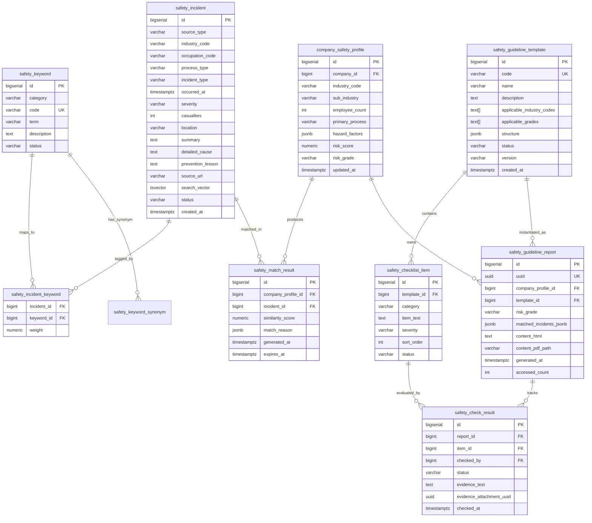
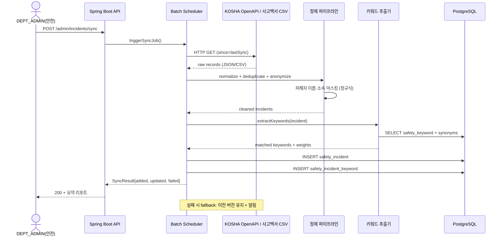
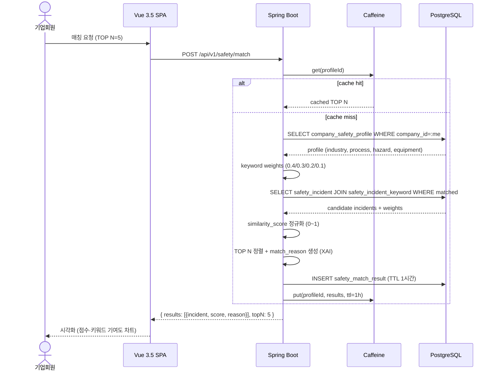
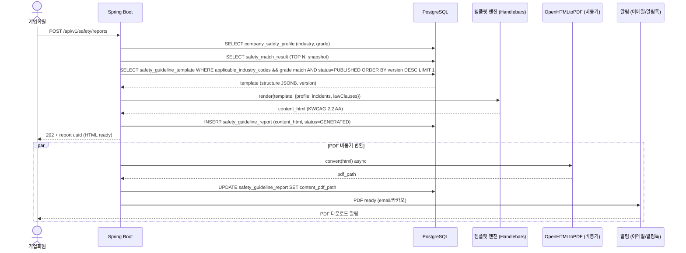
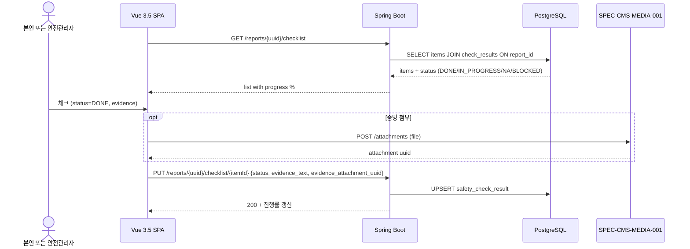

# SPEC-CMS-006 안전경영 가이드라인 + 사고사례 매칭

## 1. 개요

| 항목 | 값 |
|---|---|
| SPEC ID | SPEC-CMS-006 |
| 제목 | 안전경영 가이드라인 + 사고사례 매칭 (Safety Management + Incident Matching) |
| 상위 SPEC | SPEC-CMS-001 v0.3.2 (iroum-cms 통합 SPEC) |
| 상태 | Tested |
| 우선순위 | P0 (RFP SFR-005, SFR-006 직접 대응) |
| 작성일 | 2026-04-29 |
| 작성자 | manager-spec |
| 도메인 | Safety Management, Incident Matching, Public Data Integration |

본 SPEC은 SPEC-CMS-001 §15.2 SFR-005/006 매핑 (RFP 사고사례 매칭 + 안전경영 가이드라인 자동 생성)을 iroum-cms에 적용하기 위한 child SPEC이다. 1차 범위는 키워드 가중치 기반 매칭 알고리즘 + JSONB 템플릿 기반 가이드라인 자동 생성이며, AI/벡터 임베딩 기반 고도화는 SPEC-CMS-AI-001 (옵션 트랙)으로 분리한다.

## 2. 참조 문서

- SPEC-CMS-001 v0.3.2 §15.2 SFR-005/006 매핑 — 본 SPEC 정체성·우선순위·범위 지정 출처
- SPEC-CMS-001 v0.3.2 §17 RFP 비기능 횡단 요구사항 적용 정책 — PER-002~004, SER-002~004, DAR-001~010, QUR-004
- SPEC-CMS-001 §10.3 외부 연계 시스템 — 중대재해 사고백서 (공공데이터) 연계
- SPEC-CMS-002 §8 권한 매트릭스 — SUPER_ADMIN / DEPT_ADMIN / EDITOR / VIEWER 4단계 RBAC 재사용
- RFP §1 SFR-005, SFR-006 — 사고사례 매칭 알고리즘 + 안전경영 가이드라인 자동 생성 명세
- `.moai/refs/rfp-summary.md` §10.3 — 외부 데이터 연계 (안전보건공단, 고용노동부)
- `.moai/project/tech.md` — 기술 스택 frozen (Spring Boot 3.2 + PostgreSQL 16 + Java 17 + Vue 3.5 + egovFrame v5.0.0)

## 3. 범위 및 비범위

### 3.1 1차 범위 (v0.1 포함)

- 사고사례 마스터 DB 구축 (중대재해 사고백서 + 안전보건공단 OpenAPI 수집)
- 키워드 사전 (업종/공정/위험요소/장비) + 키워드 추출·매핑
- 기업 안전 프로필 등록·조회 (업종, 공정, 위험요소, 종업원 수, 리스크 등급)
- 키워드 가중치 기반 사고사례 매칭 (TOP N=5, 매칭 사유 XAI 설명)
- JSONB 템플릿 기반 안전경영 가이드라인 자동 생성 (HTML + PDF)
- 안전 체크리스트 진행 추적 (DONE/IN_PROGRESS/NA/BLOCKED, 증빙 첨부)
- 가이드라인 템플릿 관리자 CRUD (버전 관리, 적용 범위 지정)
- 매칭 결과 캐시 (TTL 1시간, Caffeine 인메모리)

### 3.2 비범위 (v0.1 제외, 향후 트랙)

- 실시간 IoT 센서 모니터링 (별도 인프라 SPEC)
- 산업재해 보험 청구 시스템 연계 (근로복지공단 API, v0.4+)
- AI 챗봇 안전상담 (LLM 트랙, 별도 SPEC)
- 벡터 임베딩 기반 의미 유사도 매칭 (SPEC-CMS-AI-001 옵션 — Milvus/pgvector 도입 시점에 활성화)
- 웨어러블 위험감지 디바이스 연계 (별도 IoT SPEC)
- 사고사례 자동 크롤링 (1차는 OpenAPI + 관리자 수동 보강만 사용)
- 다국어 가이드라인 본문 자동 번역 (v0.1은 사고사례 metadata 한/영만 지원, 본문은 한국어)

## 4. 데이터 모델

### 4.1 ERD (Mermaid)



### 4.2 PostgreSQL DDL

```sql
-- ============================================================
-- 4.2.1 safety_incident — 사고사례 마스터
-- 데이터 분류: 마스터 (DAR-001)
-- ============================================================
CREATE TABLE safety_incident (
    id                 BIGSERIAL PRIMARY KEY,
    source_type        VARCHAR(50)  NOT NULL,  -- DISASTER_WHITE_BOOK / KOSHA_OPENAPI / MOEL_STAT / MANUAL
    industry_code      VARCHAR(20)  NOT NULL,  -- KSIC 9차 산업분류 (5자리)
    occupation_code    VARCHAR(20),            -- KSCO 7차 직업분류 (선택)
    process_type       VARCHAR(50),            -- 공정 유형 (조립/용접/운반/굴착/...)
    incident_type      VARCHAR(50)  NOT NULL,  -- FALL / TRAP / COLLISION / FIRE / TOXIC / EXPLOSION / OTHER
    occurred_at        TIMESTAMPTZ  NOT NULL,
    severity           VARCHAR(20)  NOT NULL,  -- FATAL / SEVERE / MINOR / MATERIAL
    casualties         INT          NOT NULL DEFAULT 0,
    location           VARCHAR(200),
    summary            TEXT         NOT NULL,
    detailed_cause     TEXT,
    prevention_lesson  TEXT,
    source_url         VARCHAR(500),
    search_vector      TSVECTOR,               -- 한국어 전문검색 (pg_trgm 보조)
    -- v0.2+ 옵션: embedding VECTOR(384) (SPEC-CMS-AI-001 활성화 시)
    status             VARCHAR(20)  NOT NULL DEFAULT 'PUBLISHED',  -- DRAFT/PUBLISHED/ARCHIVED
    created_at         TIMESTAMPTZ  NOT NULL DEFAULT now(),
    updated_at         TIMESTAMPTZ  NOT NULL DEFAULT now()
);
CREATE INDEX idx_safety_incident_industry  ON safety_incident(industry_code, status);
CREATE INDEX idx_safety_incident_type      ON safety_incident(incident_type, severity);
CREATE INDEX idx_safety_incident_occurred  ON safety_incident(occurred_at DESC);
CREATE INDEX idx_safety_incident_search    ON safety_incident USING GIN(search_vector);

COMMENT ON TABLE  safety_incident IS '사고사례 마스터 — 중대재해 사고백서 등 외부 출처 통합';
COMMENT ON COLUMN safety_incident.source_type IS 'DISASTER_WHITE_BOOK(중대재해 사고백서) / KOSHA_OPENAPI / MOEL_STAT / MANUAL';
COMMENT ON COLUMN safety_incident.severity IS 'FATAL(사망) / SEVERE(중상) / MINOR(경상) / MATERIAL(물적)';

-- ============================================================
-- 4.2.2 safety_keyword — 키워드 사전
-- ============================================================
CREATE TABLE safety_keyword (
    id          BIGSERIAL PRIMARY KEY,
    category    VARCHAR(20)  NOT NULL,  -- INDUSTRY / PROCESS / HAZARD / EQUIPMENT
    code        VARCHAR(50)  NOT NULL UNIQUE,
    term        VARCHAR(100) NOT NULL,
    description TEXT,
    status      VARCHAR(20)  NOT NULL DEFAULT 'ACTIVE',
    created_at  TIMESTAMPTZ  NOT NULL DEFAULT now()
);
CREATE INDEX idx_safety_keyword_category ON safety_keyword(category, status);

-- 동의어 사전 (한 키워드에 여러 동의어 — 형태소·신조어 대응)
CREATE TABLE safety_keyword_synonym (
    id          BIGSERIAL PRIMARY KEY,
    keyword_id  BIGINT NOT NULL REFERENCES safety_keyword(id) ON DELETE CASCADE,
    synonym     VARCHAR(100) NOT NULL,
    UNIQUE (keyword_id, synonym)
);
CREATE INDEX idx_safety_keyword_synonym ON safety_keyword_synonym(synonym);

-- ============================================================
-- 4.2.3 safety_incident_keyword — 사고-키워드 매핑
-- ============================================================
CREATE TABLE safety_incident_keyword (
    incident_id BIGINT NOT NULL REFERENCES safety_incident(id) ON DELETE CASCADE,
    keyword_id  BIGINT NOT NULL REFERENCES safety_keyword(id)  ON DELETE RESTRICT,
    weight      NUMERIC(5,2) NOT NULL DEFAULT 1.00,  -- 0.00 ~ 1.00
    PRIMARY KEY (incident_id, keyword_id)
);
CREATE INDEX idx_safety_incident_keyword_kw ON safety_incident_keyword(keyword_id);

-- ============================================================
-- 4.2.4 company_safety_profile — 기업 안전 프로필
-- ============================================================
CREATE TABLE company_safety_profile (
    id              BIGSERIAL PRIMARY KEY,
    company_id      BIGINT NOT NULL REFERENCES member(id) ON DELETE CASCADE,
    industry_code   VARCHAR(20)  NOT NULL,
    sub_industry    VARCHAR(50),
    employee_count  INT,
    primary_process VARCHAR(100),
    hazard_factors  JSONB        NOT NULL DEFAULT '[]'::jsonb,  -- ["고소작업","유해물질","중장비","..."]
    risk_score      NUMERIC(5,2),  -- 0.00 ~ 100.00
    risk_grade      VARCHAR(2),    -- A / B / C / D / E (E=고위험)
    updated_at      TIMESTAMPTZ  NOT NULL DEFAULT now(),
    UNIQUE (company_id)
);
CREATE INDEX idx_company_safety_profile_industry ON company_safety_profile(industry_code, risk_grade);

-- ============================================================
-- 4.2.5 safety_match_result — 매칭 결과 (TTL 캐시)
-- ============================================================
CREATE TABLE safety_match_result (
    id                 BIGSERIAL PRIMARY KEY,
    company_profile_id BIGINT NOT NULL REFERENCES company_safety_profile(id) ON DELETE CASCADE,
    incident_id        BIGINT NOT NULL REFERENCES safety_incident(id)         ON DELETE CASCADE,
    similarity_score   NUMERIC(5,2) NOT NULL,  -- 0.00 ~ 1.00
    match_reason       JSONB        NOT NULL,  -- {keywords:[...], weights:{...}, explain:"..."}
    generated_at       TIMESTAMPTZ  NOT NULL DEFAULT now(),
    expires_at         TIMESTAMPTZ  NOT NULL DEFAULT (now() + INTERVAL '1 hour')
);
CREATE INDEX idx_safety_match_profile  ON safety_match_result(company_profile_id, generated_at DESC);
CREATE INDEX idx_safety_match_expires  ON safety_match_result(expires_at);

-- ============================================================
-- 4.2.6 safety_guideline_template — 가이드라인 템플릿
-- ============================================================
CREATE TABLE safety_guideline_template (
    id                        BIGSERIAL PRIMARY KEY,
    code                      VARCHAR(50)  NOT NULL UNIQUE,
    name                      VARCHAR(200) NOT NULL,
    description               TEXT,
    applicable_industry_codes TEXT[]       NOT NULL DEFAULT ARRAY[]::TEXT[],
    applicable_grades         TEXT[]       NOT NULL DEFAULT ARRAY[]::TEXT[],  -- ['C','D','E']
    structure                 JSONB        NOT NULL,  -- 섹션 정의 (sections:[{title,description,items[]}])
    status                    VARCHAR(20)  NOT NULL DEFAULT 'DRAFT',  -- DRAFT/PUBLISHED/ARCHIVED
    version                   VARCHAR(20)  NOT NULL DEFAULT 'v1.0',
    review_status             VARCHAR(20),  -- LEGAL_REVIEWED / SAFETY_REVIEWED / NONE
    reviewed_by               BIGINT REFERENCES users(id),
    reviewed_at               TIMESTAMPTZ,
    created_by                BIGINT REFERENCES users(id),
    created_at                TIMESTAMPTZ  NOT NULL DEFAULT now()
);
CREATE INDEX idx_safety_template_status ON safety_guideline_template(status, version);

-- ============================================================
-- 4.2.7 safety_guideline_report — 생성된 보고서
-- ============================================================
CREATE TABLE safety_guideline_report (
    id                      BIGSERIAL PRIMARY KEY,
    uuid                    UUID         NOT NULL UNIQUE DEFAULT gen_random_uuid(),
    company_profile_id      BIGINT NOT NULL REFERENCES company_safety_profile(id) ON DELETE CASCADE,
    template_id             BIGINT NOT NULL REFERENCES safety_guideline_template(id),
    risk_grade              VARCHAR(2)   NOT NULL,
    matched_incidents_jsonb JSONB        NOT NULL,  -- 생성 시점 매칭 결과 스냅샷
    content_html            TEXT         NOT NULL,
    content_pdf_path        VARCHAR(500),
    generated_at            TIMESTAMPTZ  NOT NULL DEFAULT now(),
    accessed_count          INT          NOT NULL DEFAULT 0
);
CREATE INDEX idx_safety_report_profile ON safety_guideline_report(company_profile_id, generated_at DESC);
CREATE INDEX idx_safety_report_uuid    ON safety_guideline_report(uuid);

-- ============================================================
-- 4.2.8 safety_checklist_item — 체크리스트 항목 (템플릿 종속)
-- ============================================================
CREATE TABLE safety_checklist_item (
    id          BIGSERIAL PRIMARY KEY,
    template_id BIGINT NOT NULL REFERENCES safety_guideline_template(id) ON DELETE CASCADE,
    category    VARCHAR(50) NOT NULL,
    item_text   TEXT        NOT NULL,
    severity    VARCHAR(20) NOT NULL DEFAULT 'NORMAL',  -- CRITICAL / HIGH / NORMAL / LOW
    sort_order  INT         NOT NULL DEFAULT 0,
    status      VARCHAR(20) NOT NULL DEFAULT 'ACTIVE'
);
CREATE INDEX idx_safety_checklist_template ON safety_checklist_item(template_id, sort_order);

-- ============================================================
-- 4.2.9 safety_check_result — 체크 결과 (보고서별 진행 추적)
-- ============================================================
CREATE TABLE safety_check_result (
    id                       BIGSERIAL PRIMARY KEY,
    report_id                BIGINT NOT NULL REFERENCES safety_guideline_report(id) ON DELETE CASCADE,
    item_id                  BIGINT NOT NULL REFERENCES safety_checklist_item(id),
    checked_by               BIGINT REFERENCES users(id),
    status                   VARCHAR(20) NOT NULL,  -- DONE / IN_PROGRESS / NA / BLOCKED
    evidence_text            TEXT,
    evidence_attachment_uuid UUID,  -- → SPEC-CMS-MEDIA-001 attachment 연계
    checked_at               TIMESTAMPTZ NOT NULL DEFAULT now(),
    UNIQUE (report_id, item_id)
);
CREATE INDEX idx_safety_check_result_report ON safety_check_result(report_id, status);
```

### 4.3 메타데이터 (DAR-001~002 호환)

전 테이블 표준 명명 규칙 적용: Java camelCase / DB snake_case. 모든 테이블·컬럼은 S-Meta / DA# 호환 한글명, 데이터 표준 도메인, 변경 이력 기록 (DAR-002).

| 테이블 | 한글명 | 분류 | 보존 |
|---|---|---|---|
| safety_incident | 안전사고사례 | 마스터 | 영구 |
| safety_keyword | 안전키워드사전 | 마스터 | 영구 |
| safety_incident_keyword | 사고키워드매핑 | 마스터 | 영구 |
| company_safety_profile | 기업안전프로필 | 거래 | 회원 탈퇴 시 즉시 삭제 |
| safety_match_result | 사고매칭결과 | 거래 | TTL 1시간 + 90일 후 archive |
| safety_guideline_template | 가이드라인템플릿 | 마스터 | 영구 (버전별) |
| safety_guideline_report | 가이드라인보고서 | 거래 | 5년 (산업안전보건법 보존 기준) |
| safety_checklist_item | 체크리스트항목 | 마스터 | 영구 |
| safety_check_result | 체크리스트결과 | 거래 | 보고서와 동일 (5년) |

## 5. 요구사항 (EARS)

### REQ-SAFETY-001-D 사고사례 데이터 수집·관리 (Event-Driven, 5 sub)

**REQ-SAFETY-001-D-1** — When 관리자가 외부 사고 데이터 동기화 트리거를 실행하면, 시스템은 안전보건공단 OpenAPI 또는 중대재해 사고백서 데이터셋을 호출하여 신규/갱신 레코드를 수집해야 한다.

**REQ-SAFETY-001-D-2** — When 외부 데이터가 수집되면, 시스템은 표준화·정제 파이프라인 (필드 매핑, 인코딩 통일, 중복 제거, 익명화 마스킹)을 적용해야 한다.

**REQ-SAFETY-001-D-3** — When 정제된 사고사례가 적재되면, 시스템은 키워드 사전 (industry/process/hazard/equipment 4 카테고리)을 참조하여 자동 키워드 추출 후 safety_incident_keyword 매핑을 생성해야 한다.

**REQ-SAFETY-001-D-4** — While 외부 API 호출이 실패한 상태에서, 시스템은 이전 버전 데이터를 fallback으로 유지하고 관리자에게 실패 알림을 전송해야 한다 (Unwanted: 실패 시 빈 데이터 반환 금지).

**REQ-SAFETY-001-D-5** — Where SUPER_ADMIN 또는 DEPT_ADMIN(안전부서) 권한이 있을 때, 시스템은 사고사례 수동 등록·수정·반려·익명화 보강 기능을 제공해야 한다.

### REQ-SAFETY-002-D 매칭 알고리즘 (State-Driven, 5 sub)

**REQ-SAFETY-002-D-1** — When 기업회원이 안전 프로필을 입력하면, 시스템은 키워드 가중치 매칭 (industry 0.4 + process 0.3 + hazard 0.2 + equipment 0.1)을 적용하여 후보 사고사례를 산출해야 한다.

**REQ-SAFETY-002-D-2** — When 후보 사고사례가 산출되면, 시스템은 키워드 일치 가중치 합 기준 0~1 정규화된 similarity_score를 계산해야 한다.

**REQ-SAFETY-002-D-3** — When similarity_score가 계산되면, 시스템은 기본 TOP N=5 (요청 시 1~20 조정 가능)의 사고사례를 score 내림차순으로 반환해야 한다.

**REQ-SAFETY-002-D-4** — When 매칭 결과를 반환할 때, 시스템은 매칭 사유 (XAI: 어떤 키워드가 어떤 가중치로 점수에 기여했는지)를 match_reason JSONB에 포함해야 한다.

**REQ-SAFETY-002-D-5** — Where 동일 company_profile_id 매칭 요청이 1시간 이내 재발생하면, 시스템은 safety_match_result 캐시 (TTL 1시간) 또는 Caffeine 인메모리 캐시 hit을 우선 사용해야 한다.

### REQ-SAFETY-003-D 가이드라인 자동 생성 (Event-Driven, 5 sub)

**REQ-SAFETY-003-D-1** — When 가이드라인 생성이 요청되면, 시스템은 기업 industry_code + risk_grade에 부합하는 safety_guideline_template (status=PUBLISHED)을 선택해야 한다 (다중 일치 시 가장 최신 version).

**REQ-SAFETY-003-D-2** — When 템플릿이 선택되면, 시스템은 매칭된 TOP N 사고사례·중대재해처벌법 대응 수칙·체크리스트를 결합하여 본문 변수를 치환해야 한다 (Handlebars 호환 엔진, SPEC-CMS-004 v0.2와 동일).

**REQ-SAFETY-003-D-3** — When 변수 치환이 완료되면, 시스템은 KWCAG 2.2 AA 준수 HTML을 렌더링하고 safety_guideline_report에 저장해야 한다.

**REQ-SAFETY-003-D-4** — When HTML 렌더링이 완료되면, 시스템은 비동기 PDF 변환 (OpenHTMLtoPDF 권장, 폴백 wkhtmltopdf)을 수행하여 content_pdf_path에 저장해야 한다.

**REQ-SAFETY-003-D-5** — While 보고서 조회 요청이 발생할 때, 시스템은 본인 회사 프로필 보고서만 조회 가능하도록 접근권한을 강제해야 하며, SUPER_ADMIN/DEPT_ADMIN(안전부서)은 전체 조회 가능하다.

### REQ-SAFETY-004-D 체크리스트 추적 (Event-Driven, 4 sub)

**REQ-SAFETY-004-D-1** — When 가이드라인 보고서가 생성되면, 시스템은 해당 템플릿의 safety_checklist_item 전체를 보고서별 진행 화면에 노출해야 한다.

**REQ-SAFETY-004-D-2** — When 사용자가 체크 결과를 기록하면, 시스템은 status (DONE/IN_PROGRESS/NA/BLOCKED), evidence_text, checked_by, checked_at을 safety_check_result에 저장해야 한다.

**REQ-SAFETY-004-D-3** — Where 사용자가 증빙 첨부를 추가하면, 시스템은 SPEC-CMS-MEDIA-001 attachment UUID 참조로 evidence_attachment_uuid를 연결해야 한다.

**REQ-SAFETY-004-D-4** — When 관리자가 기간별 통계를 조회하면, 시스템은 보고서·기업·체크리스트 항목별 진행률 (DONE 비율), 평균 완료 일수, BLOCKED 사유 분포를 제공해야 한다.

### REQ-SAFETY-005-D 가이드라인 템플릿 관리 (Event-Driven, 4 sub)

**REQ-SAFETY-005-D-1** — Where SUPER_ADMIN 또는 DEPT_ADMIN(안전부서) 권한이 있을 때, 시스템은 safety_guideline_template CRUD (생성/조회/수정/논리 삭제 = status=ARCHIVED) 기능을 제공해야 한다.

**REQ-SAFETY-005-D-2** — When 템플릿이 수정되면, 시스템은 version (semver: v1.0 → v1.1 → v2.0)을 신규로 생성하고 이전 버전을 PUBLISHED→ARCHIVED로 전환해야 한다 (이미 생성된 보고서는 기존 version 유지).

**REQ-SAFETY-005-D-3** — When 템플릿이 신규 생성·수정되면, 시스템은 적용 범위 (applicable_industry_codes 다중, applicable_grades 다중)를 강제 입력받아야 한다.

**REQ-SAFETY-005-D-4** — Where 관리자가 미리보기를 요청하면, 시스템은 임의 risk_grade + 샘플 사고사례를 주입하여 실제 변수 치환 결과를 화면에 렌더링해야 한다 (저장 없음).

## 6. REST API 명세

기본 경로: `/api/v1/safety/`. 모든 endpoint는 JWT 인증 필수 (SPEC-CMS-002 §10 기준), 기업회원은 본인 회사 프로필 한정.

### 6.1 사고사례 API

| 메서드 | 경로 | 용도 | 권한 |
|---|---|---|---|
| GET    | /incidents | 목록 조회 (industry_code, incident_type, severity, occurred_from/to 필터) | 인증 사용자 |
| GET    | /incidents/{id} | 단건 조회 | 인증 사용자 |
| POST   | /admin/incidents | 수동 등록 | SUPER_ADMIN, DEPT_ADMIN(안전) |
| PUT    | /admin/incidents/{id} | 수정·익명화 보강 | SUPER_ADMIN, DEPT_ADMIN(안전) |
| DELETE | /admin/incidents/{id} | 논리 삭제 (status=ARCHIVED) | SUPER_ADMIN |
| POST   | /admin/incidents/sync | 외부 API 동기화 트리거 (KOSHA/MOEL) | SUPER_ADMIN, DEPT_ADMIN(안전) |

### 6.2 키워드 사전 API

| 메서드 | 경로 | 용도 | 권한 |
|---|---|---|---|
| GET    | /admin/keywords | 카테고리별 목록 | SUPER_ADMIN, DEPT_ADMIN(안전), EDITOR |
| POST   | /admin/keywords | 신규 키워드 + 동의어 등록 | SUPER_ADMIN, DEPT_ADMIN(안전) |
| PUT    | /admin/keywords/{id} | 키워드·동의어 수정 | SUPER_ADMIN, DEPT_ADMIN(안전) |
| DELETE | /admin/keywords/{id} | 비활성화 (status=INACTIVE) | SUPER_ADMIN |

### 6.3 매칭 API

| 메서드 | 경로 | 용도 | 권한 |
|---|---|---|---|
| POST   | /profiles | 기업 안전 프로필 생성·갱신 (upsert) | 기업회원 (본인) |
| GET    | /profiles/me | 본인 프로필 조회 | 기업회원 |
| POST   | /match | 본인 프로필 기반 매칭 실행 (TOP N=5 default, max 20) | 기업회원 |
| GET    | /match/{profileId}/cached | 캐시된 매칭 결과 조회 (TTL 1시간) | 본인 + 관리자 |

### 6.4 가이드라인 보고서 API

| 메서드 | 경로 | 용도 | 권한 |
|---|---|---|---|
| POST   | /reports | 매칭 기반 가이드라인 자동 생성 | 기업회원 (본인 프로필) |
| GET    | /reports/{uuid} | 보고서 HTML 조회 | 본인 + 관리자 |
| GET    | /reports/{uuid}/pdf | PDF 다운로드 (sendfile) | 본인 + 관리자 |
| GET    | /reports/me | 본인 보고서 목록 (페이지네이션) | 기업회원 |
| GET    | /admin/reports | 전체 보고서 목록 + 필터 | SUPER_ADMIN, DEPT_ADMIN(안전), VIEWER |

### 6.5 체크리스트 API

| 메서드 | 경로 | 용도 | 권한 |
|---|---|---|---|
| GET    | /reports/{uuid}/checklist | 보고서별 체크리스트 + 진행 상태 | 본인 + 관리자 |
| PUT    | /reports/{uuid}/checklist/{itemId} | 체크 결과 기록·변경 | 본인 + 관리자 |
| GET    | /admin/checklist/stats | 기간·기업·항목별 통계 | SUPER_ADMIN, DEPT_ADMIN(안전), VIEWER |

### 6.6 템플릿 관리 API

| 메서드 | 경로 | 용도 | 권한 |
|---|---|---|---|
| GET    | /admin/templates | 템플릿 목록 + 버전 | SUPER_ADMIN, DEPT_ADMIN(안전), EDITOR |
| GET    | /admin/templates/{id} | 단건 조회 | SUPER_ADMIN, DEPT_ADMIN(안전), EDITOR |
| POST   | /admin/templates | 신규 템플릿 (v1.0) | SUPER_ADMIN, DEPT_ADMIN(안전) |
| PUT    | /admin/templates/{id} | 신규 버전 발행 (v1.0→v1.1) | SUPER_ADMIN, DEPT_ADMIN(안전) |
| POST   | /admin/templates/{id}/preview | 미리보기 렌더링 (저장 없음) | SUPER_ADMIN, DEPT_ADMIN(안전), EDITOR |
| DELETE | /admin/templates/{id} | ARCHIVED 전환 | SUPER_ADMIN |
| GET    | /admin/templates/{id}/checklist | 항목 목록 | SUPER_ADMIN, DEPT_ADMIN(안전), EDITOR |
| POST   | /admin/templates/{id}/checklist | 항목 추가 | SUPER_ADMIN, DEPT_ADMIN(안전) |

총 endpoint 수: 약 28개.

## 7. 시퀀스 다이어그램

### 7.1 외부 사고백서 데이터 수집 → 정제 → 키워드 추출 → DB 적재



### 7.2 매칭 흐름: 기업 프로필 → 키워드 가중치 → 유사도 점수 → TOP N



### 7.3 가이드라인 생성: 매칭 결과 + 템플릿 → HTML → PDF → 알림



### 7.4 체크리스트 진행 추적



## 8. 매칭 알고리즘 명세

### 8.1 가중치 키워드 매칭 (1차, v0.1 채택)

```
score(incident) = 
    0.4 * keyword_match(INDUSTRY)
  + 0.3 * keyword_match(PROCESS)
  + 0.2 * keyword_match(HAZARD)
  + 0.1 * keyword_match(EQUIPMENT)

keyword_match(category) = 
    sum(weight_i for matching keyword i) / max_possible_weight(category)
```

매칭 판정: 동의어(synonym) 포함, 대소문자·공백 무시, 한국어 형태소는 1차 PostgreSQL `pg_trgm` similarity ≥ 0.6 또는 정확 일치.

### 8.2 코사인 유사도 (v0.2+ 옵션, SPEC-CMS-AI-001 활성화 시)

`safety_incident.embedding VECTOR(384)` 추가 + Milvus 또는 pgvector 인덱스. 1차에서는 컬럼 미생성, 옵션 SPEC에서 ALTER ADD COLUMN.

### 8.3 점수 정규화

각 카테고리 매칭 결과를 0~1로 정규화 후 가중합. 최종 score는 항상 [0.00, 1.00] 범위.

### 8.4 TOP N 결정

기본 N=5, 요청 시 1~20 조정 가능. score 동률 시 occurred_at DESC (최신 우선) → severity (FATAL > SEVERE > MINOR) tiebreak.

### 8.5 매칭 사유 설명 (XAI)

`match_reason` JSONB 구조:

```json
{
  "score": 0.78,
  "contributions": [
    {"category": "INDUSTRY", "matched_keywords": ["건설업","고층건물"], "weight": 0.40, "contribution": 0.40},
    {"category": "PROCESS",  "matched_keywords": ["고소작업"],          "weight": 0.30, "contribution": 0.27},
    {"category": "HAZARD",   "matched_keywords": ["추락"],              "weight": 0.20, "contribution": 0.11},
    {"category": "EQUIPMENT","matched_keywords": [],                    "weight": 0.10, "contribution": 0.00}
  ],
  "explain_ko": "동일 업종(건설업) + 동일 공정(고소작업) + 동일 위험요소(추락)에서 발생한 사고로 매칭됨"
}
```

## 9. 가이드라인 생성 정책

### 9.1 템플릿 구조 (JSONB 예시)

```json
{
  "sections": [
    {"key":"overview",       "title":"기업 안전 현황 요약",       "type":"profile_summary"},
    {"key":"matched",        "title":"유사 사고사례",             "type":"incident_list", "limit":5},
    {"key":"law",            "title":"중대재해처벌법 대응 수칙", "type":"law_clauses",   "act":"중대재해처벌법"},
    {"key":"prevention",     "title":"예방 가이드라인",           "type":"prose"},
    {"key":"checklist",      "title":"안전 체크리스트",           "type":"checklist_render"},
    {"key":"reviewer_meta",  "title":"검토 정보",                  "type":"meta", "fields":["reviewed_by","reviewed_at","review_status"]}
  ]
}
```

### 9.2 변수 치환

Handlebars 호환 (SPEC-CMS-004 v0.2와 동일 엔진). 사용 가능 변수: `{{profile.*}}`, `{{incidents[i].*}}`, `{{lawClauses[i].*}}`, `{{checklist[i].*}}`, `{{generated_at}}`. XSS 방지: 모든 변수는 자동 escape, 의도적 raw HTML은 `{{{var}}}` (관리자 검증된 템플릿만).

### 9.3 PDF 변환

1차: OpenHTMLtoPDF (Java native, KWCAG 호환 우수, 한글 폰트 — Noto Sans KR 임베드).
폴백: wkhtmltopdf 외부 프로세스. PDF 변환은 비동기 (Spring `@Async`), 완료 시 알림 발송.

### 9.4 접근 권한

본인 회사 프로필 보고서만 조회. SUPER_ADMIN/DEPT_ADMIN(안전)은 전체 조회. EDITOR는 템플릿 미리보기까지, VIEWER는 통계 조회까지.

## 10. 권한 매트릭스

SPEC-CMS-002 §8 4단계 RBAC 재사용 + 부서 분기 추가.

| 역할 | 사고사례 CRUD | 키워드 사전 | 매칭 실행 | 보고서 생성 | 보고서 조회 | 템플릿 관리 | 통계 조회 |
|---|---|---|---|---|---|---|---|
| SUPER_ADMIN          | RW | RW | — | — | 전체 | RW | 전체 |
| DEPT_ADMIN(안전부서) | RW | RW | — | — | 전체 | RW | 전체 |
| DEPT_ADMIN(콘텐츠)   | R  | R  | — | — | — | R  | — |
| EDITOR               | R  | R  | — | — | — | R+미리보기 | — |
| VIEWER               | R  | —  | — | — | 전체 (읽기) | R | 전체 (읽기) |
| 기업회원             | R  | —  | 본인 | 본인 | 본인만 | — | — |

DEPT_ADMIN 분기 키: SPEC-CMS-002의 `department_code` (SAFETY / CONTENT / GENERAL).

## 11. 외부 데이터 연계

| 데이터 | 출처 | 연계 방식 | 주기 | 비고 |
|---|---|---|---|---|
| 중대재해 사고백서 | 안전보건공단 | 파일 다운로드 (CSV) + 정제 | 월 1회 | 공식 공개 데이터셋 |
| 산업재해 통계 | 안전보건공단 OpenAPI | REST API | 일/주 1회 | 인증키 발급 필요 (사용자 결정 사항) |
| 산재 통계 | 고용노동부 통계 OpenAPI | REST API | 월 1회 | 보조 자료 |
| 관리자 수동 보강 | 내부 | 관리자 화면 직접 입력 | 상시 | 익명화 필수 |

수집 트리거: 자동 스케줄 + 관리자 수동 (`POST /admin/incidents/sync`). 외부 API 형식 변경 시 정제 파이프라인 fallback (REQ-SAFETY-001-D-4).

## 12. 비기능 요구사항 (SPEC-CMS-001 §17 적용)

### 12.1 성능 (PER-002~004)

- CPU/Memory/Disk 평균 사용률 90% 미만 (PER-002)
- 매칭 API p95 < **500ms** (캐시 hit), p95 < **2초** (cold) — RFP 상한 3초보다 강한 자체 임계값
- 일반 조회 API p95 < 3초 (PER-003 상한)
- 가이드라인 PDF 생성 < 10초 (비동기 background)
- 일별 외부 데이터 동기화 배치 < 10분 (PER-003)
- 동시 처리 초당 50건 (PER-004), 임계 90% 도달 시 지연 안내 페이지 노출

### 12.2 보안 (SER-002~004)

- 사고사례 익명화: 피해자 이름·소속 자동 마스킹 (정규식 + 화이트리스트)
- SQL Injection / XSS / 파일다운로드 / URL 임의변경 방지 (SPEC-CMS-003 보안 정책 재사용)
- PDF sendfile 시 path traversal 방지 (UUID + 경로 화이트리스트)
- 행안부 시큐어 코딩 가이드 준수
- 외부 API 인증키 환경변수 관리 (하드코딩 절대 금지)

### 12.3 데이터 거버넌스 (DAR-001~010)

- 표준 명명: Java camelCase / DB snake_case
- 데이터 분류: §4.3 표 참조 (마스터/거래)
- 메타데이터 (S-Meta/DA# 호환): 한글명, 표준 도메인, 변경 이력 (DAR-002)
- safety_guideline_report 보존: 5년 (산업안전보건법)
- safety_match_result 보존: 90일 후 archive
- RTO ≤ 4시간 (DAR-009)

### 12.4 접근성·국제화

- 가이드라인 HTML KWCAG 2.2 AA 준수
- 사고사례 metadata (industry/process/incident_type) 한/영 라벨 지원
- 가이드라인 본문은 한국어 1차 (다국어 자동 번역은 v0.4+)

### 12.5 품질 (QUR-004)

- 결함 발생률 시험 운영 기간 5% 미만 (QG-COMMON-1)
- P0 결함 지속시간 1시간 이내 (QG-COMMON-2)
- 단위테스트 커버리지 ≥ 85%
- 통합테스트 (Testcontainers PostgreSQL) 필수

## 13. 위험 및 대응

| ID | 위험 | 영향 | 대응 |
|---|---|---|---|
| RISK-S1 | 외부 데이터 형식 변경 (KOSHA OpenAPI 스키마 변동) | 동기화 실패, 데이터 누락 | 정제 파이프라인 schema-tolerant 매핑 + fallback 이전 버전 유지 + 관리자 알림 (REQ-SAFETY-001-D-4) |
| RISK-S2 | 매칭 정확도 부족 (1차 키워드만으로 인간 평가 일치율 낮음) | 가이드라인 적합성 저하 | 1차 keyword + 동의어 사전 강화, 2차 v0.2+ 벡터 임베딩 (Milvus/pgvector, SPEC-CMS-AI-001 옵션) |
| RISK-S3 | 사고사례 개인정보 (피해자 이름·소속) 노출 | 개인정보 침해, 법적 문제 | 정제 파이프라인 익명화 정규식 + 화이트리스트, 관리자 검수 단계 의무화 |
| RISK-S4 | 가이드라인 신뢰성 (법무·산업안전 미검토 시 오정보) | 법적 책임, 기업 손해 | safety_guideline_template.review_status 필드 + 화면 표시 (LEGAL_REVIEWED/SAFETY_REVIEWED/NONE), NONE은 "참고용" 워터마크 강제 |
| RISK-S5 | 매칭 캐시 정책 부적절 (TTL 너무 길어 stale, 짧으면 부하) | 성능 저하 또는 오정보 | TTL 1시간 기본 + 프로필 변경 시 무효화 + 외부 데이터 동기화 시 전체 무효화 |
| RISK-S6 | PDF 생성 동시성 부하 (수십 보고서 동시 요청) | 응답 지연, OOM | 비동기 큐(Spring `@Async` + bounded executor 풀 4~8), 완료 시 알림, 동시 변환 ≤ 5건 |
| RISK-S7 | 키워드 사전 누락 (신조어·신산업 미반영) | 매칭 누락 | 관리자 수동 보강 화면 + 분기별 검토 프로세스 + 매칭 실패 로그 분석 (관리자 대시보드) |

## 14. 변경 이력 (HISTORY)

| 버전 | 날짜 | 작성자 | 변경 내용 |
|---|---|---|---|
| v0.1 | 2026-04-29 | manager-spec | 초안 작성 — RFP SFR-005/006 매핑, 9개 테이블 DDL, 5 parent REQ × 23 sub REQ, 28 endpoint, 4 시퀀스, 매칭 알고리즘 1차 keyword 기반 정의, AI/벡터는 SPEC-CMS-AI-001 옵션 분리 |
| v0.4 | 2026-04-29 | MoAI orchestrator | Spring Boot 3.5.9 + 운영 결정 통합 (SPEC-CMS-001 v0.4 §20 부록 참조). 구현 대기 상태. 본문은 변경 없이 헤더·변경 이력만 갱신. |
| v0.5 | 2026-05-07 | manager-docs | 상태 Draft v0.4 → Implemented (일괄 동기화). 구현 메모 섹션 추가. |
| v0.6 | 2026-05-13 | MoAI orchestrator | IT 신설 — SafetyManagementIT.java 16 AC (§REQ-001 사고사례 5, §REQ-002/003 인증 게이트 4, §REQ-005 템플릿·키워드 7). @MX:TODO: REQ-SAFETY-002/003/004 companyId 의존 엔드포인트는 @AuthenticationPrincipal Long → JwtPrincipal 설계 이슈 해소 후 완전 IT 필요. Implemented → Tested. |

---

## 구현 메모 (Implementation Notes)

- **구현 완료일**: 2026-05-06
- **상태 업데이트**: Draft v0.4 → Implemented (일괄 동기화)
- **구현 범위**: 안전경영 풀스택 — 사고사례 관리, 키워드 매칭, 안전 프로필, 매칭 결과, 가이드라인 보고서, 템플릿 관리 (Frontend 6 view + safetyStore)
- **테스트**: 41 GREEN (Backend 27 + Frontend 14)
- **참조 커밋**: 56c7566 (Step 1 Backend 27 GREEN), 692f2e0 (Step 2 Frontend 6 view), 77ec390 (Step 3 Docker 통합), 8cdd121 (006/007 100% 풀스택), bd7d002 (묶음 4 100% 완료), f3db5a2 (사고 보고·체크리스트·가이드라인 매칭 강화)
- **특이사항**: RFP SFR-005, SFR-006 직접 대응. SPEC-CMS-009 데이터 거버넌스 safety_stats_monthly 집계 소스로 연동.
