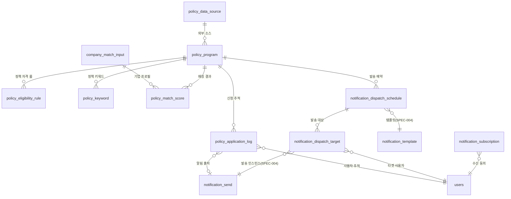
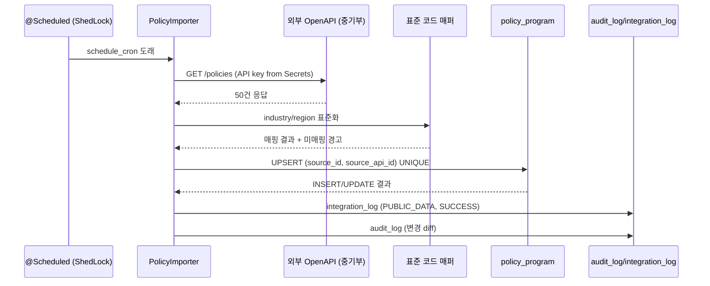
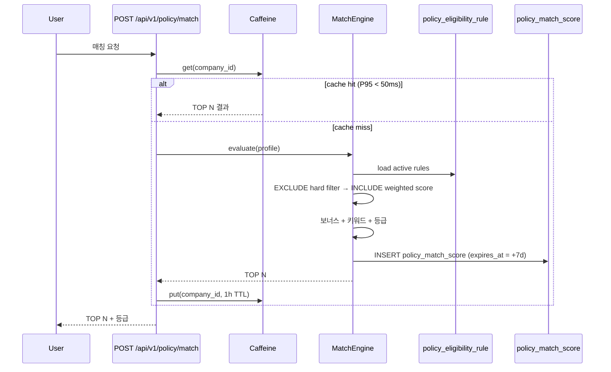
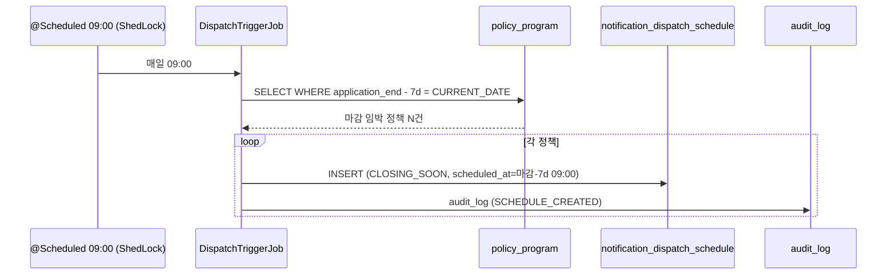
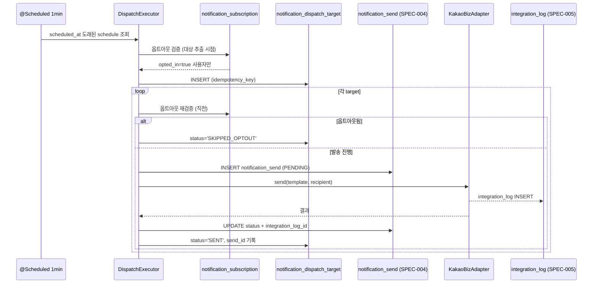
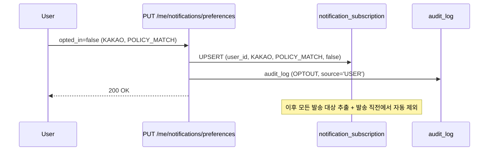

# SPEC-CMS-007: 정책사업 지능형 매칭 + 적기 타겟팅 알림 (Policy Matching + Timing Notification)

## 1. 개요

| 항목 | 내용 |
|------|------|
| SPEC ID | SPEC-CMS-007 |
| 제목 | 정책사업 지능형 매칭 + 적기 타겟팅 알림 (Policy Matching + Timing Notification) |
| 작성일 | 2026-04-29 |
| 버전 | v0.4 (2026-04-29 Spring Boot 3.5.9 + 운영 결정 통합 — SPEC-CMS-001 v0.4 §20 부록 참조) |
| 작성자 | manager-spec (MoAI) |
| 상태 | Completed |
| 우선순위 | P0 |
| 분류 | RFP 신규 P0 SPEC (SFR-007 + SFR-008) |
| Parent | SPEC-CMS-001 v0.3.2 (Umbrella) |

본 SPEC은 RFP 기능요구사항 SFR-007(정책사업 지능형 매칭) + SFR-008(적기 타겟팅 알림)을 iroum-cms에서 구현하는 신규 P0 SPEC이다. 다차원 매트릭스 분석 기반 정책사업 추천 엔진과 정책 마감일에 맞춰 사용자 동의 기반으로 카카오 알림톡·이메일을 발송하는 적기 알림 시스템을 정의한다. SPEC-CMS-004 v0.2.1 `notification_template`/`notification_send` 발송 도메인과 SPEC-CMS-005 v0.2.1 `integration_log`/`v_notification_history` 통합 로그 도메인을 재사용한다.

---

## 2. 참조 문서

| 참조 | 용도 |
|---|---|
| `.moai/specs/SPEC-CMS-001/spec.md` v0.3.2 §15.2 SFR-007/008 | 매핑 출처, REQ-POLICY-* prefix 위임 |
| `.moai/specs/SPEC-CMS-001/spec.md` v0.3.2 §17 비기능 횡단 | PER-002~004, SER-002~004, DAR-001~010 적용 |
| `.moai/specs/SPEC-CMS-002/spec.md` v0.3.2 §8 권한 매트릭스 | SUPER_ADMIN/CONTENT_ADMIN/USER 4단계 RBAC |
| `.moai/specs/SPEC-CMS-004/spec.md` v0.2.1 §14.1 `notification_template` | 알림 템플릿 마스터 + 카카오 검수 워크플로 |
| `.moai/specs/SPEC-CMS-004/spec.md` v0.2.1 §14.2-1 `notification_send` | 발송 인스턴스 (Q-7 integration_log_id FK) |
| `.moai/specs/SPEC-CMS-005/spec.md` v0.2.1 §14.2 `integration_log` | 외부 연계 로그 (월별 PARTITION) |
| `.moai/specs/SPEC-CMS-005/spec.md` v0.2.1 §13.3 `v_notification_history` | 발송 이력 INNER JOIN 뷰 |
| `.moai/refs/rfp-summary.md` §1 SFR-007/008 | RFP 명세 |
| `.moai/refs/rfp-summary.md` §10.3 외부 연계 시스템 | 카카오 알림톡 비즈채널, SMTP, 공공데이터 OpenAPI |
| `.moai/project/tech.md` (FROZEN) | Vue 3.5+ / Spring Boot 3.2 / Java 17 / PostgreSQL 16 / egovFrame v5 |

---

## 3. 범위 및 비범위

### 3.1 1차 출시 포함 (v0.1)

- 정책사업 마스터 등록·수정·삭제 (관리자) + 외부 OpenAPI 자동 동기화 (1차: 중기부 K-Startup)
- 다차원 매트릭스 매칭 알고리즘 (Rule-based weighted, 5 차원: industry/region/size/age/revenue)
- 사용자 매칭 결과 조회 + TOP N 추천 + 매칭 사유 노출 (설명 가능성)
- 발송 예약 자동 트리거 (정책 마감 N일 전) + 수동 예약 + 시뮬레이션
- 다채널 발송 (카카오 알림톡 + 이메일) + 멱등성 + 야간 차단 + 재시도
- 사용자 수신 동의 관리 (옵트인/옵트아웃) + 카테고리별 분리
- 정책 신청 클릭/전환 추적 (POLICY_APPLY_CVR KPI 기여)
- 다국어 (한/영) 정책명·카테고리·매칭 사유

### 3.2 비범위 (Out of Scope, 후속 SPEC)

| 항목 | 사유 |
|---|---|
| 정책 신청 대행 (외부 신청서 자동 작성) | 외부 부처 시스템 연동·법적 검토 별도 |
| 결제·자금 집행 | 정책 자금 집행은 발주기관 별도 시스템 |
| AI/벡터 임베딩 매칭 | SPEC-CMS-AI-001 옵션 트랙으로 분리 |
| 통합 어댑터 (R&D 통합공고·지자체 외 다부처) | 1차는 중기부 K-Startup 우선, 2차 amendment에서 확장 |
| SMS 채널 | 1차는 카카오·이메일·INAPP만 (SMS는 channel enum에 정의되어 있으나 발송 활성화는 후속) |
| ML 기반 자동 가중치 학습 | 알고리즘 편향 검증 의무(SFR-012)로 운영자 직권 조정 우선 |

---

## 4. 데이터 모델

### 4.1 ERD (Mermaid)



### 4.2 PostgreSQL DDL

#### 4.2.1 `policy_program` (정책사업 마스터)

```sql
CREATE TABLE policy_program (
    id                          BIGINT       GENERATED ALWAYS AS IDENTITY PRIMARY KEY,
    code                        VARCHAR(100) NOT NULL UNIQUE,
    ministry                    VARCHAR(50)  NOT NULL,                 -- 부처 코드 (MSS/MOTIE/지자체 등)
    program_name                VARCHAR(300) NOT NULL,
    program_name_i18n           JSONB        NOT NULL DEFAULT '{}'::jsonb,  -- {ko: "...", en: "..."}
    description_html            TEXT,
    target_industries           TEXT[]       NOT NULL DEFAULT '{}',    -- KSIC industry codes
    target_regions              TEXT[]       NOT NULL DEFAULT '{}',    -- 행정구역 코드
    min_employees               INT,
    max_employees               INT,
    min_revenue                 BIGINT,                                -- 단위: 원
    max_revenue                 BIGINT,
    min_business_age_months     INT,
    max_business_age_months     INT,
    application_start           TIMESTAMPTZ,
    application_end             TIMESTAMPTZ,
    budget_total                BIGINT,
    budget_per_company          BIGINT,
    source_url                  VARCHAR(500),
    source_api_id               VARCHAR(200),                          -- 외부 API 고유 ID (멱등 동기화 키)
    source_id                   BIGINT       REFERENCES policy_data_source(id) ON DELETE SET NULL,
    last_synced_at              TIMESTAMPTZ,
    import_warnings             JSONB        DEFAULT '[]'::jsonb,      -- 표준 코드 미매핑 등 경고
    status                      VARCHAR(20)  NOT NULL DEFAULT 'DRAFT',
    created_at                  TIMESTAMPTZ  NOT NULL DEFAULT CURRENT_TIMESTAMP,
    updated_at                  TIMESTAMPTZ  NOT NULL DEFAULT CURRENT_TIMESTAMP,
    CONSTRAINT chk_pp_status    CHECK (status IN ('DRAFT','ACTIVE','CLOSED','EXPIRED')),
    CONSTRAINT chk_pp_revenue   CHECK (min_revenue IS NULL OR max_revenue IS NULL OR min_revenue <= max_revenue),
    CONSTRAINT chk_pp_employees CHECK (min_employees IS NULL OR max_employees IS NULL OR min_employees <= max_employees)
);
CREATE INDEX idx_pp_status_app  ON policy_program(status, application_end);
CREATE INDEX idx_pp_industries  ON policy_program USING GIN (target_industries);
CREATE INDEX idx_pp_regions     ON policy_program USING GIN (target_regions);
CREATE UNIQUE INDEX uq_pp_source_api ON policy_program(source_id, source_api_id) WHERE source_api_id IS NOT NULL;
COMMENT ON TABLE  policy_program IS 'RFP SFR-007 정책사업 마스터.';
COMMENT ON COLUMN policy_program.source_api_id IS '외부 OpenAPI 고유 ID — 멱등 동기화 키. 동일 ID는 INSERT 대신 UPDATE.';
```

#### 4.2.2 `policy_eligibility_rule` (자격요건 상세)

```sql
CREATE TABLE policy_eligibility_rule (
    id            BIGINT       GENERATED ALWAYS AS IDENTITY PRIMARY KEY,
    policy_id     BIGINT       NOT NULL REFERENCES policy_program(id) ON DELETE CASCADE,
    rule_type     VARCHAR(20)  NOT NULL,
    dimension     VARCHAR(20)  NOT NULL,
    operator      VARCHAR(20)  NOT NULL,
    values        JSONB        NOT NULL,
    weight        NUMERIC(3,2) NOT NULL DEFAULT 0.10,
    description   TEXT,
    description_i18n JSONB     DEFAULT '{}'::jsonb,
    active        BOOLEAN      NOT NULL DEFAULT TRUE,
    created_at    TIMESTAMPTZ  NOT NULL DEFAULT CURRENT_TIMESTAMP,
    CONSTRAINT chk_per_rule_type CHECK (rule_type IN ('INCLUDE','EXCLUDE')),
    CONSTRAINT chk_per_dimension CHECK (dimension IN ('INDUSTRY','REGION','SIZE','AGE','REVENUE','CERTIFICATION','KEYWORD')),
    CONSTRAINT chk_per_operator  CHECK (operator IN ('IN','NOT_IN','BETWEEN','GTE','LTE','EQ')),
    CONSTRAINT chk_per_weight    CHECK (weight >= 0.00 AND weight <= 1.00)
);
CREATE INDEX idx_per_policy ON policy_eligibility_rule(policy_id) WHERE active = TRUE;
COMMENT ON COLUMN policy_eligibility_rule.weight IS 'Soft Match 가중치 (0.00~1.00). EXCLUDE 룰은 weight 무관 hard filter.';
```

#### 4.2.3 `policy_keyword` (정책 키워드)

```sql
CREATE TABLE policy_keyword (
    id          BIGINT       GENERATED ALWAYS AS IDENTITY PRIMARY KEY,
    policy_id   BIGINT       NOT NULL REFERENCES policy_program(id) ON DELETE CASCADE,
    keyword     VARCHAR(100) NOT NULL,
    category    VARCHAR(50),
    weight      NUMERIC(3,2) NOT NULL DEFAULT 0.05,
    created_at  TIMESTAMPTZ  NOT NULL DEFAULT CURRENT_TIMESTAMP,
    CONSTRAINT chk_pk_weight CHECK (weight >= 0.00 AND weight <= 1.00)
);
CREATE INDEX idx_pk_keyword ON policy_keyword(keyword);
CREATE INDEX idx_pk_policy  ON policy_keyword(policy_id);
```

#### 4.2.4 `company_match_input` (기업 프로필 — 매칭 입력)

```sql
CREATE TABLE company_match_input (
    id                  BIGINT       GENERATED ALWAYS AS IDENTITY PRIMARY KEY,
    company_id          BIGINT       NOT NULL,                          -- 회원/기업 식별 (users 또는 별도 entity FK)
    industry_codes      TEXT[]       NOT NULL DEFAULT '{}',
    region_codes        TEXT[]       NOT NULL DEFAULT '{}',
    employee_count      INT,
    annual_revenue      BIGINT,
    business_age_months INT,
    certifications      TEXT[]       NOT NULL DEFAULT '{}',
    custom_attrs        JSONB        NOT NULL DEFAULT '{}'::jsonb,      -- {keywords: [...], etc}
    last_updated_at     TIMESTAMPTZ  NOT NULL DEFAULT CURRENT_TIMESTAMP,
    CONSTRAINT uq_cmi_company UNIQUE (company_id)
);
CREATE INDEX idx_cmi_industries ON company_match_input USING GIN (industry_codes);
CREATE INDEX idx_cmi_regions    ON company_match_input USING GIN (region_codes);
COMMENT ON TABLE company_match_input IS '매칭 알고리즘 입력 — 기업 프로필 스냅샷. 변경 시 매칭 캐시 무효화.';
```

#### 4.2.5 `policy_match_score` (기업-정책 매칭 결과)

```sql
CREATE TABLE policy_match_score (
    id               BIGINT       GENERATED ALWAYS AS IDENTITY PRIMARY KEY,
    company_id       BIGINT       NOT NULL,
    policy_id        BIGINT       NOT NULL REFERENCES policy_program(id) ON DELETE CASCADE,
    score            NUMERIC(5,2) NOT NULL,                             -- 0.00 ~ 100.00
    grade            VARCHAR(2)   NOT NULL,                             -- A/B/C/D
    score_breakdown  JSONB        NOT NULL DEFAULT '{}'::jsonb,         -- {industry:30, region:0, size:20, ...}
    matched_at       TIMESTAMPTZ  NOT NULL DEFAULT CURRENT_TIMESTAMP,
    expires_at       TIMESTAMPTZ  NOT NULL,                             -- matched_at + 7 days (research §10)
    viewed_at        TIMESTAMPTZ,
    applied_at       TIMESTAMPTZ,
    CONSTRAINT chk_pms_grade CHECK (grade IN ('A','B','C','D')),
    CONSTRAINT chk_pms_score CHECK (score >= 0.00 AND score <= 100.00),
    CONSTRAINT uq_pms_active UNIQUE (company_id, policy_id, matched_at)
);
CREATE INDEX idx_pms_company_score ON policy_match_score(company_id, score DESC) WHERE expires_at > CURRENT_TIMESTAMP;
CREATE INDEX idx_pms_expires       ON policy_match_score(expires_at) WHERE applied_at IS NULL;
```

#### 4.2.6 `notification_subscription` (수신 동의/거부)

```sql
CREATE TABLE notification_subscription (
    id          BIGINT       GENERATED ALWAYS AS IDENTITY PRIMARY KEY,
    user_id     BIGINT       NOT NULL REFERENCES users(id) ON DELETE CASCADE,
    channel     VARCHAR(20)  NOT NULL,
    category    VARCHAR(50)  NOT NULL,
    opted_in    BOOLEAN      NOT NULL DEFAULT TRUE,
    updated_at  TIMESTAMPTZ  NOT NULL DEFAULT CURRENT_TIMESTAMP,
    source      VARCHAR(20)  NOT NULL DEFAULT 'USER',
    CONSTRAINT chk_ns_channel  CHECK (channel  IN ('KAKAO','EMAIL','SMS','INAPP')),
    CONSTRAINT chk_ns_source   CHECK (source   IN ('USER','ADMIN','SYSTEM')),
    CONSTRAINT chk_ns_category CHECK (category IN ('POLICY_MATCH','ANNOUNCEMENT','REMINDER','MARKETING')),
    CONSTRAINT uq_ns_user_chan_cat UNIQUE (user_id, channel, category)
);
CREATE INDEX idx_ns_user ON notification_subscription(user_id, opted_in);
COMMENT ON TABLE notification_subscription IS '개인정보보호법 제22조의2 자기결정권 — 사용자별 채널·카테고리별 옵트인/옵트아웃.';
```

#### 4.2.7 `notification_dispatch_schedule` (발송 예약)

```sql
CREATE TABLE notification_dispatch_schedule (
    id            BIGINT       GENERATED ALWAYS AS IDENTITY PRIMARY KEY,
    schedule_uuid UUID         NOT NULL UNIQUE,
    policy_id     BIGINT       REFERENCES policy_program(id) ON DELETE SET NULL,
    dispatch_type VARCHAR(30)  NOT NULL,
    target_filter JSONB        NOT NULL DEFAULT '{}'::jsonb,            -- 예: {min_score:70, regions:[...]}
    scheduled_at  TIMESTAMPTZ  NOT NULL,
    channels      TEXT[]       NOT NULL,                                 -- ['KAKAO','EMAIL']
    template_id   BIGINT       NOT NULL REFERENCES notification_template(id) ON DELETE RESTRICT,
    priority      INT          NOT NULL DEFAULT 50,                      -- 1(최상) ~ 100(최하)
    status        VARCHAR(20)  NOT NULL DEFAULT 'PENDING',
    created_by    BIGINT       NOT NULL REFERENCES users(id),
    created_at    TIMESTAMPTZ  NOT NULL DEFAULT CURRENT_TIMESTAMP,
    started_at    TIMESTAMPTZ,
    completed_at  TIMESTAMPTZ,
    CONSTRAINT chk_nds_type   CHECK (dispatch_type IN ('APPLICATION_OPEN','CLOSING_SOON','RESULT','REMINDER','ANNOUNCEMENT')),
    CONSTRAINT chk_nds_status CHECK (status IN ('PENDING','PROCESSING','COMPLETED','CANCELLED','FAILED'))
);
CREATE INDEX idx_nds_status_sched ON notification_dispatch_schedule(status, scheduled_at) WHERE status = 'PENDING';
CREATE INDEX idx_nds_policy       ON notification_dispatch_schedule(policy_id) WHERE policy_id IS NOT NULL;
```

#### 4.2.8 `notification_dispatch_target` (발송 대상)

```sql
CREATE TABLE notification_dispatch_target (
    id              BIGINT       GENERATED ALWAYS AS IDENTITY PRIMARY KEY,
    schedule_id     BIGINT       NOT NULL REFERENCES notification_dispatch_schedule(id) ON DELETE CASCADE,
    user_id         BIGINT       NOT NULL REFERENCES users(id) ON DELETE CASCADE,
    send_id         BIGINT,                                              -- notification_send.id (logical FK, SPEC-004 §14.2-1)
    idempotency_key VARCHAR(100) NOT NULL,
    channel         VARCHAR(20)  NOT NULL,
    status          VARCHAR(20)  NOT NULL DEFAULT 'PENDING',
    evaluated_at    TIMESTAMPTZ,
    sent_at         TIMESTAMPTZ,
    failed_reason   TEXT,
    CONSTRAINT chk_ndt_status CHECK (status IN ('PENDING','SENT','FAILED','SKIPPED_OPTOUT','CANCELLED')),
    CONSTRAINT uq_ndt_idem UNIQUE (idempotency_key)
);
CREATE INDEX idx_ndt_schedule   ON notification_dispatch_target(schedule_id, status);
CREATE INDEX idx_ndt_user       ON notification_dispatch_target(user_id);
CREATE INDEX idx_ndt_send       ON notification_dispatch_target(send_id) WHERE send_id IS NOT NULL;
COMMENT ON COLUMN notification_dispatch_target.idempotency_key IS 'SHA-256 hash(schedule_id||user_id||dispatch_type) — research §4 권장.';
```

#### 4.2.9 `policy_application_log` (정책 신청·클릭 추적)

```sql
CREATE TABLE policy_application_log (
    id                    BIGINT       GENERATED ALWAYS AS IDENTITY PRIMARY KEY,
    user_id               BIGINT       NOT NULL REFERENCES users(id) ON DELETE CASCADE,
    policy_id             BIGINT       NOT NULL REFERENCES policy_program(id) ON DELETE CASCADE,
    source                VARCHAR(30)  NOT NULL,
    notification_send_id  BIGINT,                                        -- logical FK (SPEC-004 §14.2-1)
    action                VARCHAR(30)  NOT NULL,
    occurred_at           TIMESTAMPTZ  NOT NULL DEFAULT CURRENT_TIMESTAMP,
    user_agent            VARCHAR(300),
    ip_address            INET,
    CONSTRAINT chk_pal_source CHECK (source IN ('NOTIFICATION','SEARCH','RECOMMENDATION','DIRECT')),
    CONSTRAINT chk_pal_action CHECK (action IN ('VIEW','CLICK_APPLY','EXTERNAL_REDIRECT','SAVED'))
);
CREATE INDEX idx_pal_user_time   ON policy_application_log(user_id, occurred_at DESC);
CREATE INDEX idx_pal_policy_time ON policy_application_log(policy_id, occurred_at DESC);
CREATE INDEX idx_pal_send        ON policy_application_log(notification_send_id) WHERE notification_send_id IS NOT NULL;
COMMENT ON TABLE policy_application_log IS 'SFR-008 클릭/전환 추적, KPI ⑥ POLICY_APPLY_CVR 산출 원천.';
```

#### 4.2.10 `policy_data_source` (외부 OpenAPI 소스)

```sql
CREATE TABLE policy_data_source (
    id              BIGINT       GENERATED ALWAYS AS IDENTITY PRIMARY KEY,
    code            VARCHAR(50)  NOT NULL UNIQUE,
    name            VARCHAR(200) NOT NULL,
    ministry        VARCHAR(50)  NOT NULL,
    api_endpoint    VARCHAR(500) NOT NULL,
    auth_type       VARCHAR(30)  NOT NULL DEFAULT 'API_KEY',
    auth_secret_ref VARCHAR(200),                                        -- Secrets Manager reference (평문 금지)
    schedule_cron   VARCHAR(100) NOT NULL DEFAULT '0 0 3 * * *',         -- 매일 03:00
    last_sync_at    TIMESTAMPTZ,
    last_status     VARCHAR(20),
    enabled         BOOLEAN      NOT NULL DEFAULT TRUE,
    owner_dept_id   BIGINT       REFERENCES departments(id) ON DELETE SET NULL,
    created_at      TIMESTAMPTZ  NOT NULL DEFAULT CURRENT_TIMESTAMP,
    CONSTRAINT chk_pds_status CHECK (last_status IS NULL OR last_status IN ('SUCCESS','FAILURE','PARTIAL'))
);
COMMENT ON COLUMN policy_data_source.auth_secret_ref IS '인증 키 평문 금지 — Secrets Manager 참조 형식 (예: aws:secretsmanager://policy/k-startup).';
```

---

## 5. 요구사항 (EARS)

### REQ-POLICY-001-D 정책 데이터 수집·동기화

**REQ-POLICY-001-D-1 (외부 API 연계, Event-Driven)** — When `PolicyImportScheduler`가 `policy_data_source.schedule_cron` 도래로 트리거될 때, 시스템은 `policy_data_source.api_endpoint`로 OpenAPI 호출을 수행하고 응답을 검증한 후 `policy_program`에 적재해야 한다. 인증 키는 `auth_secret_ref`로 Secrets Manager에서 조회하며 평문 저장은 금지된다(SER-002).

**REQ-POLICY-001-D-2 (정제·표준화, Ubiquitous)** — 시스템은 외부 정책 응답의 industry/region 코드를 SPEC-CMS-004 `metadata_dictionary`(표준 사전) 기준으로 매핑해야 한다. 미매핑 코드는 `policy_program.import_warnings` JSONB에 기록되고 `status='DRAFT'`로 적재된다.

**REQ-POLICY-001-D-3 (멱등성 동기화, Ubiquitous)** — 시스템은 `(source_id, source_api_id)` UNIQUE 제약으로 동일 외부 정책의 INSERT 대신 UPDATE를 수행해야 한다. 변경 컬럼 diff는 audit_log에 적재된다.

**REQ-POLICY-001-D-4 (자동 만료, Event-Driven)** — When 매일 01:00 만료 처리 배치가 실행될 때, 시스템은 `application_end < CURRENT_TIMESTAMP` 정책의 `status`를 `ACTIVE → EXPIRED`로 전환해야 한다.

**REQ-POLICY-001-D-5 (관리자 수동 보강, Optional)** — Where SUPER_ADMIN이 지자체·비공식 정책을 등록하거나 Excel 일괄 업로드를 시도할 때, 시스템은 `POST /api/v1/policy/programs` 및 `POST /api/v1/policy/programs/bulk-import`를 제공해야 한다. 부분 성공(행 단위 트랜잭션)이 허용된다.

### REQ-POLICY-002-D 자격요건 정의·관리

**REQ-POLICY-002-D-1 (룰 정의, Ubiquitous)** — 시스템은 `policy_eligibility_rule(rule_type, dimension, operator, values, weight)` 모델로 정책별 다차원 자격요건을 정의해야 한다. EXCLUDE는 hard filter, INCLUDE는 weight 적용 soft match이다.

**REQ-POLICY-002-D-2 (가중치 검증, State-Driven)** — While 활성 룰의 weight 합이 1.00을 초과하는 상태일 때, 시스템은 매칭 시뮬레이션 시 경고를 반환하고 정규화(weight ÷ 합) 옵션을 운영자에게 제공해야 한다.

**REQ-POLICY-002-D-3 (연관 키워드, Optional)** — Where 정책에 `policy_keyword` 가 등록된 경우, 시스템은 사용자 `custom_attrs.keywords[]`와 매칭 시 보너스 점수(상한 5점)를 부여해야 한다.

**REQ-POLICY-002-D-4 (관리자 화면, Ubiquitous)** — 시스템은 SUPER_ADMIN/CONTENT_ADMIN이 정책별 자격요건 룰을 CRUD할 수 있는 REST API + Vue 3 관리자 화면을 제공해야 한다(SPEC-CMS-002 §8 권한 매트릭스 준용).

### REQ-POLICY-003-D 매칭 알고리즘

**REQ-POLICY-003-D-1 (다차원 매트릭스 점수, Event-Driven)** — When 사용자가 `POST /api/v1/policy/match`를 호출할 때, 시스템은 `policy_eligibility_rule`(EXCLUDE 우선 hard filter, INCLUDE soft match) 평가 후 5 차원 가중치(industry 0.30 / region 0.20 / size 0.20 / age 0.15 / revenue 0.15) 합산으로 0.00~100.00 점수를 산출해야 한다. 보너스(인증 +5, 신규 가입자 +3)와 키워드 보너스(상한 5)가 더해진다(상한 100).

**REQ-POLICY-003-D-2 (등급 부여, Ubiquitous)** — 시스템은 점수에 따라 등급을 부여해야 한다: A(90+) / B(70~89) / C(50~69) / D(<50).

**REQ-POLICY-003-D-3 (TOP N + 동점 처리, Ubiquitous)** — 시스템은 점수 내림차순 TOP N(기본 10) 정렬 후 동점 시 `matched_at` 최신순으로 정렬해야 한다.

**REQ-POLICY-003-D-4 (캐싱 + 무효화, Ubiquitous)** — 시스템은 사용자 매칭 결과를 Caffeine 캐시에 1시간 유지해야 한다. `company_match_input.last_updated_at` 또는 `policy_program`/`policy_eligibility_rule` 변경 시 캐시는 무효화된다.

**REQ-POLICY-003-D-5 (매칭 사유 설명, Ubiquitous)** — 시스템은 `policy_match_score.score_breakdown` JSONB에 차원별 점수 + 충족·미충족 룰 ID 목록을 기록하고, `GET /api/v1/policy/match/{id}/reason`으로 사용자에게 설명을 제공해야 한다(개인정보보호법 제30조의2 자동화된 의사결정 통보권 대응).

### REQ-POLICY-004-D 발송 예약 + 대상 추출

**REQ-POLICY-004-D-1 (정책 마감 자동 트리거, Event-Driven)** — When 매일 09:00 `PolicyDispatchTriggerJob`이 실행될 때, 시스템은 `application_end - INTERVAL '7 days' = CURRENT_DATE` 정책에 대해 dispatch_type='CLOSING_SOON' 발송 예약을 자동 생성해야 한다. 멀티 노드 환경에서 ShedLock으로 단일 실행을 보장한다.

**REQ-POLICY-004-D-2 (대상 쿼리 빌더, Ubiquitous)** — 시스템은 `target_filter` JSONB(예: `{min_score:70, regions:[...], industries:[...]}`)를 SQL WHERE 절로 변환하는 안전한 쿼리 빌더(파라미터 바인딩, SQL Injection 방지 SER-004)를 제공해야 한다.

**REQ-POLICY-004-D-3 (발송 예약 CRUD, Ubiquitous)** — 시스템은 SUPER_ADMIN이 `POST/GET/DELETE /api/v1/policy/dispatch-schedules`로 발송 예약을 생성·조회·취소할 수 있도록 제공해야 한다. status='PROCESSING' 이후에는 취소 거부(409).

**REQ-POLICY-004-D-4 (시뮬레이션, Ubiquitous)** — 시스템은 `POST /api/v1/policy/dispatch-schedules/simulate`로 target_filter 적용 시 매칭되는 user 수와 추정 비용(카카오 단가 7원/건)만 반환해야 한다(개인정보 미반환).

**REQ-POLICY-004-D-5 (대량 추출 성능, Ubiquitous)** — 시스템은 10만 명 대상 추출을 60초 내 완료해야 한다(PER-003 일배치 임계값 충분).

### REQ-POLICY-005-D 알림 발송 (notification_send 활용)

**REQ-POLICY-005-D-1 (다채널 발송, Event-Driven)** — When `scheduled_at` 도래로 `PolicyDispatchExecutor`가 실행될 때, 시스템은 채널별 발송 어댑터(KakaoBizAdapter, EmailAdapter)를 통해 발송하고, SPEC-CMS-004 `notification_send` row 1건 + SPEC-CMS-005 `integration_log` row 1건을 적재한 후 `notification_send.integration_log_id`를 동일 트랜잭션에 기록해야 한다(SPEC-CMS-004 §14.2-1 NOTE).

**REQ-POLICY-005-D-2 (멱등성, Ubiquitous)** — 시스템은 `notification_dispatch_target.idempotency_key=SHA256(schedule_id||user_id||dispatch_type)`로 동일 키 중복 발송을 차단해야 한다(UNIQUE 제약). 재시도 시 동일 키로 매칭한다(research §4 권장).

**REQ-POLICY-005-D-3 (야간 발송 차단, State-Driven)** — While `scheduled_at`이 21:00~07:59 KST 구간일 때, 시스템은 자동으로 다음 09:00 KST로 보정하고 응답에 보정 사실을 안내해야 한다.

**REQ-POLICY-005-D-4 (재시도, Event-Driven)** — When 발송이 실패(HTTP 5xx, 타임아웃)할 때, 시스템은 5분 후 1차, 30분 후 2차, 4시간 후 3차로 자동 재시도해야 한다. 3회 모두 실패 시 `notification_send.status='DEAD_LETTER'`로 전환되고 audit_log severity=CRITICAL + 운영자 알림이 발송된다.

**REQ-POLICY-005-D-5 (카카오 실패 시 이메일 폴백, Event-Driven)** — When 사용자 선호 채널이 KAKAO이고 3회 모두 실패한 상태에서, 시스템은 동일 dispatch_target에 대해 EMAIL 채널로 1회 추가 발송을 시도해야 한다(idempotency_key=SHA256(prev_key||'EMAIL')로 멱등성 보장).

### REQ-POLICY-006-D 수신 동의 관리

**REQ-POLICY-006-D-1 (옵트인/옵트아웃 API, Ubiquitous)** — 시스템은 인증된 사용자가 `GET/PUT /api/v1/me/notifications/preferences`로 채널·카테고리별 수신 동의를 조회·갱신할 수 있도록 제공해야 한다. 응답은 P95 < 100ms.

**REQ-POLICY-006-D-2 (이중 검증, Ubiquitous)** — 시스템은 옵트아웃을 (a) 대상 추출 시점, (b) 발송 직전 두 번 검증해야 한다. 추출 후 옵트아웃 변경 시 발송 직전 검증에서 차단(target.status='SKIPPED_OPTOUT', notification_send 미생성).

**REQ-POLICY-006-D-3 (카테고리별 분리, Ubiquitous)** — 시스템은 POLICY_MATCH / ANNOUNCEMENT / REMINDER / MARKETING 카테고리별 독립 동의를 보장해야 한다. 한 카테고리 옵트아웃이 다른 카테고리에 영향을 주지 않는다.

**REQ-POLICY-006-D-4 (동의 이력, Ubiquitous)** — 시스템은 모든 옵트인/옵트아웃 변경을 audit_log에 시간순 보존하여 개인정보보호법 제22조의2 자기결정권 증빙으로 활용할 수 있도록 해야 한다.

---

## 6. REST API 명세 (~30 endpoints)

### 6.1 정책 마스터 API

| Method | Endpoint | Role | 설명 |
|---|---|---|---|
| POST | `/api/v1/policy/programs` | SUPER_ADMIN | 정책 등록 |
| GET | `/api/v1/policy/programs` | USER+ | 정책 검색·필터(industries, regions, status) |
| GET | `/api/v1/policy/programs/{id}` | USER+ | 정책 상세 조회 |
| PUT | `/api/v1/policy/programs/{id}` | SUPER_ADMIN | 정책 수정 |
| DELETE | `/api/v1/policy/programs/{id}` | SUPER_ADMIN | 정책 삭제(soft delete) |
| POST | `/api/v1/policy/programs/bulk-import` | SUPER_ADMIN | Excel 일괄 업로드 |
| GET | `/api/v1/policy/data-sources` | SUPER_ADMIN | 외부 소스 목록 |
| POST | `/api/v1/policy/data-sources/{id}/sync-now` | SUPER_ADMIN | 수동 동기화 트리거 |

### 6.2 자격요건 룰 API

| Method | Endpoint | Role | 설명 |
|---|---|---|---|
| POST | `/api/v1/policy/programs/{id}/eligibility-rules` | SUPER_ADMIN | 룰 등록 |
| GET | `/api/v1/policy/programs/{id}/eligibility-rules` | CONTENT_ADMIN+ | 룰 목록 |
| PUT | `/api/v1/policy/eligibility-rules/{ruleId}` | SUPER_ADMIN | 룰 수정 |
| DELETE | `/api/v1/policy/eligibility-rules/{ruleId}` | SUPER_ADMIN | 룰 삭제 |
| POST | `/api/v1/policy/programs/{id}/keywords` | SUPER_ADMIN | 키워드 등록 |

### 6.3 매칭 API

| Method | Endpoint | Role | 설명 |
|---|---|---|---|
| POST | `/api/v1/policy/match` | USER | 기업 프로필 → TOP N 매칭 (캐시 활용) |
| GET | `/api/v1/policy/match/me` | USER | 내 매칭 결과 조회 (만료 검증) |
| GET | `/api/v1/policy/match/{id}/reason` | USER | 매칭 사유 (score_breakdown) |
| PUT | `/api/v1/me/policy/profile` | USER | 기업 프로필 등록·수정 (`company_match_input`) |

### 6.4 발송 예약 API

| Method | Endpoint | Role | 설명 |
|---|---|---|---|
| POST | `/api/v1/policy/dispatch-schedules` | SUPER_ADMIN | 발송 예약 생성 |
| GET | `/api/v1/policy/dispatch-schedules` | SUPER_ADMIN | 예약 목록 |
| GET | `/api/v1/policy/dispatch-schedules/{uuid}` | SUPER_ADMIN | 예약 상세 |
| DELETE | `/api/v1/policy/dispatch-schedules/{uuid}` | SUPER_ADMIN | 예약 취소 (PENDING만) |
| POST | `/api/v1/policy/dispatch-schedules/simulate` | SUPER_ADMIN | 대상 수·비용 시뮬레이션 |
| GET | `/api/v1/policy/dispatch-schedules/{uuid}/stats` | SUPER_ADMIN | 발송 통계 (v_notification_history JOIN) |

### 6.5 수신 동의 API

| Method | Endpoint | Role | 설명 |
|---|---|---|---|
| GET | `/api/v1/me/notifications/preferences` | USER | 내 수신 동의 조회 |
| PUT | `/api/v1/me/notifications/preferences` | USER | 옵트인/옵트아웃 갱신 |
| GET | `/api/v1/admin/users/{id}/notifications/preferences` | SUPER_ADMIN | 사용자 동의 이력 조회 (audit_log) |
| PUT | `/api/v1/admin/users/{id}/notifications/preferences` | SUPER_ADMIN | 강제 옵트아웃 (이의신청) |

### 6.6 추적 API

| Method | Endpoint | Role | 설명 |
|---|---|---|---|
| POST | `/api/v1/policy/{id}/track` | USER | VIEW/CLICK_APPLY/EXTERNAL_REDIRECT 추적 |
| GET | `/api/v1/admin/policy/{id}/applications` | SUPER_ADMIN | 정책별 신청 추적 통계 |

---

## 7. 시퀀스 다이어그램 (Mermaid)

### 7.1 정책 데이터 수집



### 7.2 매칭 흐름



### 7.3 발송 예약 자동 트리거



### 7.4 발송 실행



### 7.5 옵트아웃



---

## 8. 매칭 알고리즘 명세

### 8.1 자격요건 룰 평가 (Hard Filter)

EXCLUDE 룰에 하나라도 매칭되면 즉시 점수 0점, TOP N 결과에서 제외.

INCLUDE 룰의 경우 `operator`별 평가:
- `IN` / `NOT_IN`: 사용자 값이 룰 values 배열에 포함/미포함 여부
- `BETWEEN`: 사용자 값이 [min, max] 범위 내
- `GTE` / `LTE`: 단방향 비교
- `EQ`: 정확 일치

### 8.2 가중치 차원 점수 (Soft Match)

기본 가중치 (운영자 조정 가능):

| 차원 | 가중치 | 평가 방법 |
|---|---|---|
| INDUSTRY | 0.30 | 일치 시 100, 부분일치 50, 불일치 0 |
| REGION | 0.20 | 정확 일치 100, 광역 일치 70, 불일치 0 |
| SIZE (employees) | 0.20 | 범위 내 100, ±20% 80, 그 외 0 |
| AGE (business_age_months) | 0.15 | 범위 내 100, ±20% 80, 그 외 0 |
| REVENUE | 0.15 | 범위 내 100, ±20% 80, 그 외 0 |

`score = Σ(차원_점수 × 차원_가중치)` (총합 100점 만점)

### 8.3 보너스 점수

- 인증 보유 (target_certifications과 사용자 certifications 교집합 ≥ 1): +5점
- 신규 가입자 (가입 7일 이내): +3점
- 키워드 매칭 (`policy_keyword`와 `custom_attrs.keywords` 교집합): 키워드 weight × 100 × 0.05 (상한 5점)

상한: 100점

### 8.4 정규화 + 등급

| 점수 | 등급 |
|---|---|
| 90~100 | A |
| 70~89 | B |
| 50~69 | C |
| 0~49 | D |

### 8.5 TOP N 정렬 + 동점 처리

1. score 내림차순
2. 동점 시 `matched_at` 최신순 (더 최근 정책 우선)
3. 동점 시 `application_end` 임박순

### 8.6 캐싱

- Caffeine 1시간 TTL
- key: `match::{company_id}::{rule_set_version}`
- 무효화 트리거: `company_match_input.last_updated_at` 변경, `policy_program`/`policy_eligibility_rule` 변경

---

## 9. 발송 정책

### 9.1 멱등성

- `idempotency_key = SHA256(schedule_id || user_id || dispatch_type)` 64자 (research §4 권장)
- `notification_dispatch_target.idempotency_key`에 UNIQUE 제약
- 재시도 시 동일 키로 row 매칭 (재발송 시도가 새 row를 만들지 않음)

### 9.2 야간 차단

- KST 21:00~07:59 발송 자동 차단
- `scheduled_at`이 야간 구간이면 다음 09:00 KST로 보정 + 응답에 안내
- 긴급 알림(예: 정책 마감 당일 09시 이전)은 09:00에 발송되도록 자동 보정

### 9.3 재시도

| 시점 | 사유 |
|---|---|
| 5분 후 1차 | 일시적 장애 (HTTP 5xx, 타임아웃) |
| 30분 후 2차 | 재시도 |
| 4시간 후 3차 | 최종 시도 |
| 3회 실패 | status='DEAD_LETTER', audit_log CRITICAL, 운영자 알림 |

영구 실패(HTTP 4xx, 검수 거부)는 즉시 DEAD_LETTER + 폴백 채널(이메일) 시도.

### 9.4 옵트아웃 이중 검증

- 1차: 대상 추출 시점 (`PolicyDispatchExecutor`의 target query)
- 2차: 발송 직전 (각 target row 처리 직전)
- 누락 0건이 QG-POLICY-1 보안 게이트 (acceptance.md AC-POLICY-054)

### 9.5 발송 통계

- v_notification_history (SPEC-CMS-005 §13.3) INNER JOIN으로 도달률·실패율·응답 시간 산출
- INAPP는 `integration_log_id IS NULL`로 view 자동 제외 (SPEC-CMS-004 §14.2-1 NOTE)
- 클릭률은 `policy_application_log` LEFT JOIN으로 산출

---

## 10. 권한 매트릭스

| 기능 | USER | CONTENT_ADMIN | SUPER_ADMIN (SYSADMIN alias) |
|---|---|---|---|
| 정책 검색·조회 | O | O | O |
| 매칭 결과 조회 | O (자기) | O (자기) | O (모두) |
| 옵트인/옵트아웃 | O (자기) | O (자기) | O (모두 강제) |
| 정책 신청 추적 | O (자동) | O (자기 + 통계) | O (전체 통계) |
| 정책 등록·수정·삭제 | X | O (조회·확인) | O |
| 자격요건 룰 CRUD | X | O (조회) | O |
| 발송 예약 생성·취소 | X | X | O |
| 발송 통계 조회 | X | X | O |
| 외부 데이터 소스 관리 | X | X | O |
| 강제 옵트아웃 | X | X | O |

권한 검사: SPEC-CMS-002 v0.3.2 §8 RBAC 매트릭스 + Q-4 SYSADMIN→SUPER_ADMIN alias 적용.

---

## 11. 외부 데이터 연계

| 외부 시스템 | 용도 | 통합 방식 |
|---|---|---|
| 중기부 K-Startup OpenAPI | 정책 풀 자동 동기화 (1차 출시) | WebClient + IntegrationLogInterceptor (SPEC-005) |
| 산업통상자원부 R&D 통합공고 | 정책 풀 확장 (2차 amendment) | 동일 패턴, `policy_data_source` 어댑터 추가 |
| 지자체 보조금 | 수동 등록 + Excel 일괄 업로드 | `bulk-import` API |
| 카카오 알림톡 비즈채널 | 사용자 알림 | KakaoBizAdapter, 운영매뉴얼 SPEC-CMS-004 v0.2.1 `docs/operations/kakao-template.md` 위임 |
| SMTP (메일) | 이메일 발송 | JavaMailSender + IntegrationLogInterceptor |

모든 외부 호출은 SPEC-CMS-005 `IntegrationLogInterceptor`를 거쳐 `integration_log`에 자동 적재된다.

---

## 12. 비기능 요구사항

### 12.1 성능 (SPEC-CMS-001 §17.1, RFP PER-002~004 적용)

| 항목 | 임계값 |
|---|---|
| 매칭 API (cache hit) | P95 < 500ms |
| 매칭 API (cold) | P95 < 2초 |
| 발송 대상 추출 (10만 명) | P95 < 60초 |
| 동시 발송 처리량 | 초당 50건 (Bucket4j Rate Limit + ShedLock) |
| 동시 사용자 | 1,000명 (PER-004) |
| 정책 검색 응답 | P95 < 3초 (PER-003) |

### 12.2 보안 (SER-002~004)

- 외부 OpenAPI 인증 키는 Secrets Manager 참조만 저장, 평문 금지
- recipient 평문 저장 금지 (SPEC-CMS-004 §14.2-1: 이메일 도메인 보존 마스킹, 전화번호 뒤 4자리 마스킹)
- target_filter SQL 파라미터 바인딩 (SQL Injection 방지)
- 옵트아웃 누락 0건 (이중 검증)

### 12.3 데이터 거버넌스 (DAR-001~010)

- industry/region 코드는 SPEC-CMS-004 `metadata_dictionary` 표준 사전 참조 (DAR-001)
- 외부 데이터 정합성 검증 (DAR-006)
- audit_log 6개월 보존 (SPEC-CMS-005 §13.1)

### 12.4 접근성 (KWCAG 2.2 AA)

- 사용자 알림 수신 동의 페이지 axe-core 자동 검사 통과 (Critical/Serious 0건)
- 매칭 결과 화면 키보드 내비게이션 + 스크린리더 호환

### 12.5 다국어 (한/영)

- `program_name_i18n` JSONB로 다국어 정책명 저장
- `policy_eligibility_rule.description_i18n` 다국어 룰 설명
- 번역 누락 시 SPEC-CMS-004 `missing_translation` 패턴 + ko fallback

### 12.6 품질 게이트 (TER-002, QUR-004)

- 단위 테스트 커버리지 ≥ 85% (JaCoCo)
- 통합 테스트 (Testcontainers PostgreSQL 16) 필수
- E2E 테스트 (Playwright): 사용자 매칭 → 옵트인 → 발송 시뮬레이션 → 클릭 추적

---

## 13. 위험 및 대응

| 위험 | 영향도 | 대응 |
|---|---|---|
| 외부 OpenAPI 형식 변경 | 동기화 실패 | schema validator + import_warnings + 운영자 알림 (REQ-POLICY-001-D-2) |
| 매칭 점수 편향 | 사용자 불만 + SFR-012 위반 | `policy_eligibility_rule.weight` 관리자 화면 조정 + audit_log 적재 |
| 카카오 알림톡 검수 거부 | 발송 실패 | 운영매뉴얼(SPEC-CMS-004 v0.2.1 `docs/operations/kakao-template.md`) + EMAIL 폴백 (REQ-POLICY-005-D-5) |
| 발송 폭주 (정책 마감 시즌 집중) | 시스템 과부하 | Bucket4j Rate Limit + 우선순위 큐(`notification_dispatch_schedule.priority`) + ShedLock |
| 옵트아웃 누락 (개인정보보호법 위반) | 법적 리스크 | 이중 검증 + 일배치 감사 (acceptance.md AC-POLICY-054) |
| 외부 인증 키 유출 | 보안 사고 | Secrets Manager 참조 + integration_log payload_hash만 저장 |
| 멀티 노드 중복 발송 | 사용자 신뢰 ↓ | ShedLock + idempotency_key UNIQUE |
| 매칭 캐시 오래된 결과 노출 | 사용자 혼란 | 7일 expires_at + 프로필·정책 변경 시 무효화 |

---

## 14. 변경 이력

| 버전 | 일자 | 작성자 | 변경 |
|---|---|---|---|
| v0.1 | 2026-04-29 | manager-spec (MoAI) | 초안 — RFP SFR-007/008 통합. 10개 테이블, 6 parent REQ × 28 sub-REQ, 30 REST endpoints, 매칭 알고리즘 명세, 발송 정책, 5 시퀀스 다이어그램. SPEC-CMS-004 v0.2.1 `notification_send` + SPEC-CMS-005 v0.2.1 `integration_log`/`v_notification_history` 재사용. AI/벡터 임베딩은 SPEC-CMS-AI-001 옵션 트랙으로 분리. (SPEC-CMS-001 v0.3.2 §15.2 SFR-007/008, SPEC-CMS-004 v0.2.1 notification_send, SPEC-CMS-005 v0.2.1 integration_log) |
| v0.4 | 2026-04-29 | MoAI orchestrator | Spring Boot 3.5.9 + 운영 결정 통합 (SPEC-CMS-001 v0.4 §20 부록 참조). 구현 대기 상태. 본문은 변경 없이 헤더·변경 이력만 갱신. |
| v0.5 | 2026-05-07 | manager-docs | 상태 Draft → Implemented (일괄 동기화). 구현 메모 섹션 추가. |
| v0.6 | 2026-05-13 | MoAI orchestrator | IT 신설 — PolicyMatchingIT.java 15 AC (§REQ-001 프로그램 5, §REQ-002 매칭 3, §REQ-003 발송 3, §REQ-004 구독 2, §REQ-005 추적 2). @AuthenticationPrincipal 미사용 → 전 영역 완전 IT 가능. Implemented → Tested. |

---

Version: v0.5
Last Updated: 2026-05-07
Author: manager-docs (MoAI)
Parent: SPEC-CMS-001 v0.3.2
Status: Implemented, P0

---

## 구현 메모 (Implementation Notes)

- **구현 완료일**: 2026-05-06
- **상태 업데이트**: Draft → Implemented (일괄 동기화)
- **구현 범위**: REQ-POLICY-* 풀스택 — 다차원 매트릭스 매칭 엔진, 정책 마감 적기 알림(카카오/이메일), 5개 view + policyStore
- **테스트**: 49 GREEN (Backend 핵심 도메인 + Frontend 5 view 통합)
- **참조 커밋**: f238e4a (Step 1 Backend 49 GREEN), 174f24c (Step 2 Frontend 5 view 타입 0 오류), 8cdd121 (006/007 묶음 100% 완료), bd7d002 (묶음 4 100% 완료)
- **특이사항**: SFR-007 (지능형 매칭) + SFR-008 (적기 알림) RFP 신규 P0 통합. SPEC-CMS-004 발송 도메인 + SPEC-CMS-005 통합 로그 재사용. SPEC-CMS-009 policy_match_stats 집계 소스로 연동.
RFP Coverage: SFR-007 (정책사업 지능형 매칭) + SFR-008 (적기 타겟팅 알림)
