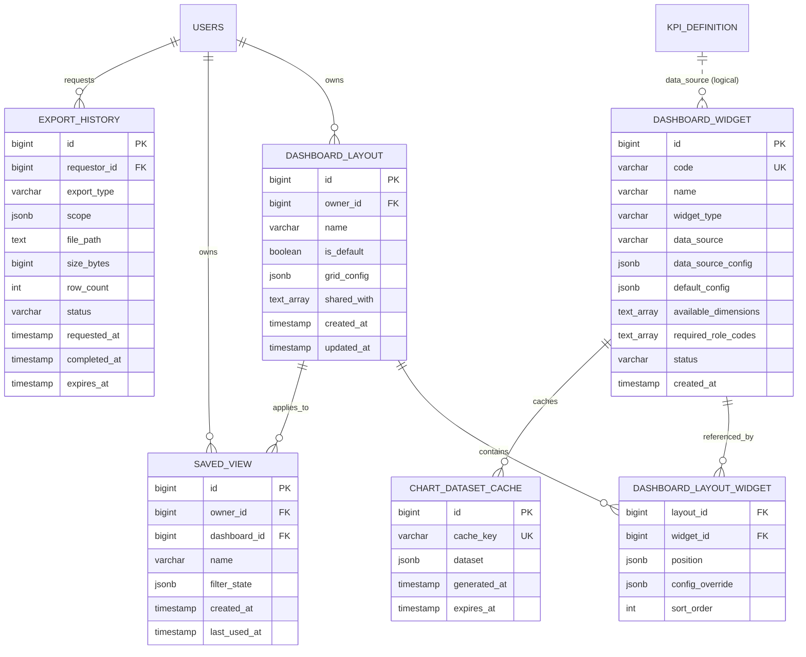
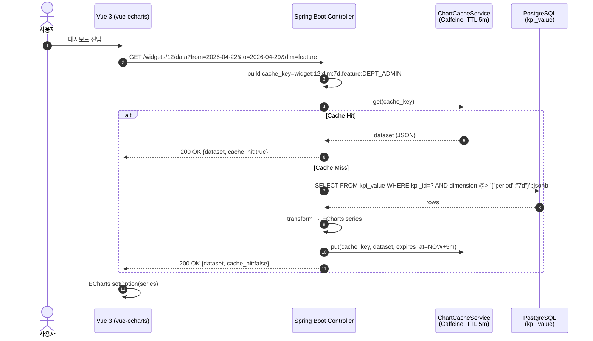
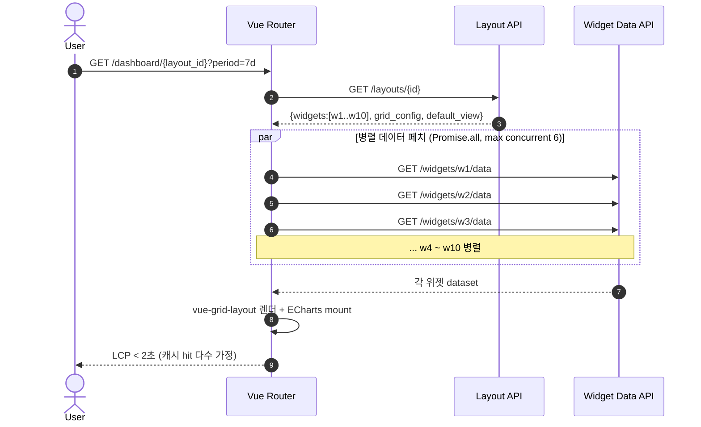
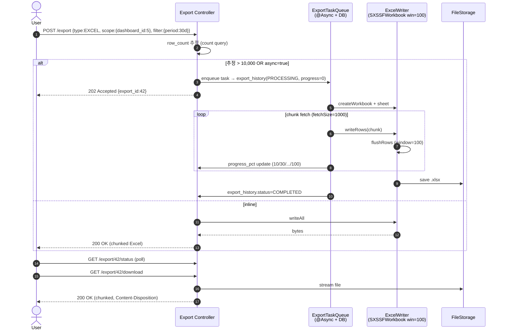
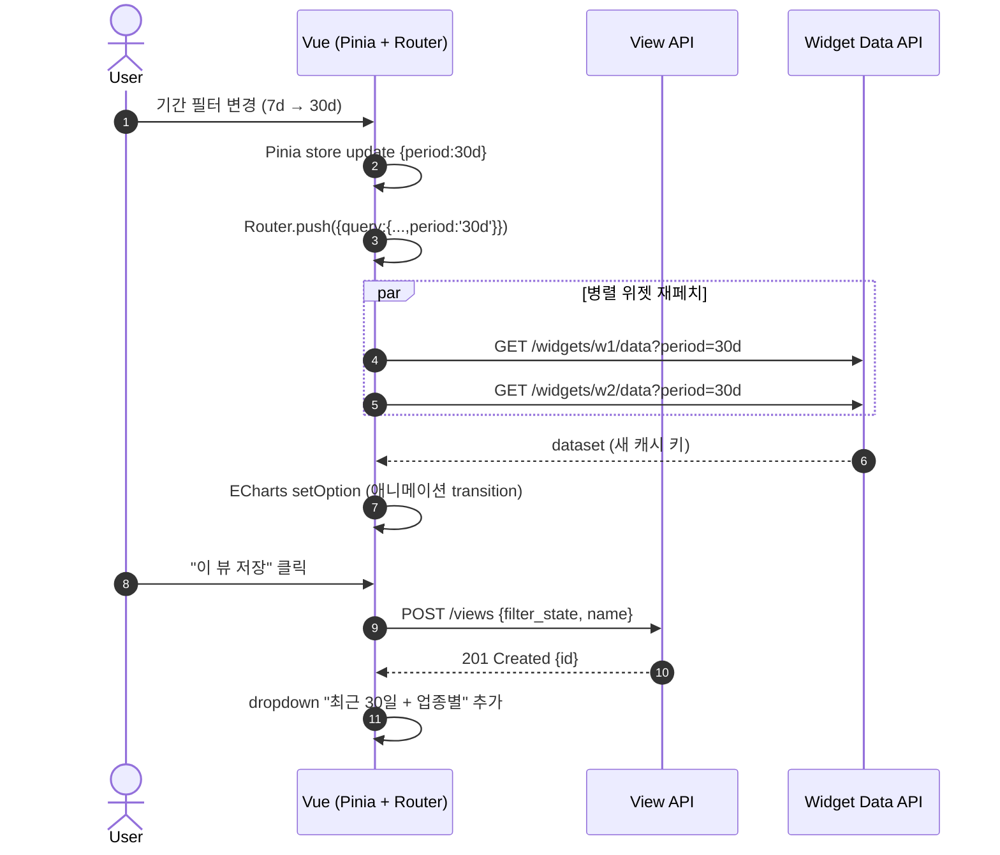

# SPEC-CMS-008 시각화 대시보드 + KPI 통합

## HISTORY

- 2026-06-09 (v0.6.0): Completed. CI GREEN (origin/main 6dc5e24). CHANGELOG 동기화 완료. SPEC 생애주기 종료.
- v0.1 / 2026-04-29 / manager-spec / 신규 작성. RFP SFR-009/013 충족을 위한 위젯·대시보드·차트·필터·캐시·내보내기 6개 부모 REQ 정의. SPEC-CMS-005 v0.2.1 의 `kpi_definition`/`kpi_value` 모델을 데이터 소스로 활용하고, 시각화 + 사용자 맞춤 대시보드 + 비동기 엑셀 스트리밍 레이어를 본 SPEC 에서 신규 정의.
- v0.4 / 2026-04-29 / MoAI orchestrator / Spring Boot 3.5.9 + 운영 결정 통합 (SPEC-CMS-001 v0.4 §20 부록 참조). 구현 대기 상태. 본문은 변경 없이 헤더·HISTORY만 갱신.
- v0.5 / 2026-05-13 / MoAI orchestrator / Run+Sync 완료: IT 5종(Widget/Layout/SavedView/Cache/Export) + 프론트 스토어 33 AC + Vue 뷰 3종 20 AC. 운영 결함 4건 수정(readOnly TX, @AuthenticationPrincipal SpEL, A-5 silent 필터, A-8 DEPT_ADMIN 부서 제한). @Disabled 5건 전부 해제. Status: Tested.

---

## 1. 개요

본 SPEC 은 SPEC-CMS-001 v0.3.2 §15.2 SFR-009/SFR-013 가 요구하는 **시각화 차트 + 통합 KPI 대시보드** 를 iroum-cms 에 구현하기 위한 P0 자식 SPEC 이다.

핵심 가치:

- 운영자·매니저가 다차원 KPI(기간·기능·업종·역할)를 **방사형/매트릭스/시계열/지도** 차트로 직관적으로 인지
- 사용자별 **맞춤 대시보드 레이아웃**(12-column grid) + **저장된 뷰**(필터 + URL 동기화)
- 100만 행 규모의 KPI 데이터를 **OOM 없이 비동기 엑셀 스트리밍** 으로 다운로드
- KWCAG 2.2 AA + 색약 대응 + 모바일 반응형 (RFP INR-004 메인 시안 3종 호환)

본 SPEC 은 SPEC-CMS-005 v0.2.1 의 `kpi_definition` / `kpi_value` / `kpi_value_history` 모델을 **데이터 소스로 재사용** 하며, 위젯·레이아웃·캐시·내보내기 레이어만 신규 도입한다.

---

## 2. 참조 문서

| 문서 | 절 | 핵심 |
|---|---|---|
| SPEC-CMS-001 v0.3.2 | §15.2 SFR-009/013 | 본 SPEC 의 RFP 매핑 출처 |
| SPEC-CMS-001 v0.3.2 | §15.4 INR-001~012 | UI/UX 인터페이스 요구사항 |
| SPEC-CMS-001 v0.3.2 | §17 비기능 횡단 | LCP < 2.5초, KWCAG 2.2 AA |
| SPEC-CMS-005 v0.2.1 | §13.1 / §14.1 | KPI 정의/값 DDL — 본 SPEC 데이터 소스 |
| SPEC-CMS-005 v0.2.1 | REQ-SYSTEM-007-D-1~5 | KPI 메타·적재·조회·다운로드·시드 8종 |
| SPEC-CMS-007 | KPI 공급 | 정책매칭 신청 전환율(POLICY_APPLY_CVR) 등 |
| SPEC-CMS-002 | §8 권한 매트릭스 | SUPER_ADMIN/DEPT_ADMIN/EDITOR/VIEWER |
| RFP `.moai/refs/rfp-summary.md` | §1 SFR-009/013 | 차트·반응형·엑셀 다운로드 원문 |
| RFP `.moai/refs/rfp-summary.md` | §3 INR-001~012 | 메인 시안 3종, Cross Browser, 표준 UI |
| 프로젝트 `.moai/project/tech.md` | Vue 3.5 + Element Plus | 차트 라이브러리 호환 검증 |

---

## 3. 범위 및 비범위

### 3.1 1차 출시 범위 (포함)

- 위젯 정의 + 타입별 렌더러 (METRIC_CARD, LINE_CHART, BAR_CHART, PIE_CHART, RADAR_CHART, MATRIX_HEATMAP, TABLE, PROGRESS_BAR, MAP_KOREA)
- 12-column 그리드 기반 사용자 맞춤 대시보드 레이아웃 (기본/공유/복제)
- ECharts 5.x 기반 차트 렌더링 + KWCAG 색상 + 색약 팔레트
- 표준 필터(기간/기능/업종/지역/역할) + 저장된 뷰 + URL 동기화
- KPI/사용자정의 쿼리 화이트리스트 데이터 소스 + 5분 인메모리 캐시
- 비동기 엑셀(SXSSFWorkbook) / CSV(스트리밍) 내보내기 + 이력 추적
- 모바일·태블릿·데스크톱 반응형 (RFP INR-004 메인 시안 3종 호환)

### 3.2 비범위 (1차 출시 제외)

| 비범위 | 결정 | 향후 검토 |
|---|---|---|
| 외부 BI 도구 연동 (Tableau / Power BI) | 자체 ECharts 로 1차 충분 | v0.4+ |
| 실시간 스트리밍 차트 (WebSocket push) | 1분 폴링 또는 30초 옵트인 업데이트로 대체 | v0.4+ (필요 시 SSE) |
| 사용자 자유 텍스트 SQL 작성 | 보안 위험. 화이트리스트 템플릿만 허용 | 정책 변경 없음 |
| PDF 풀 대시보드 인쇄 | 위젯 단위 PDF 만 1차 지원 | v0.3 (전체 대시보드) |
| AI 기반 인사이트 (자연어 질의) | SPEC-CMS-AI-001 옵션 트랙 | 옵션 |
| 위젯 임베드(iframe) 공유 | 외부 시스템 연계 불필요 | 옵션 |

---

## 4. 데이터 모델

### 4.1 ERD (Mermaid)



### 4.2 PostgreSQL 16 DDL

```sql
-- 4.2.1 dashboard_widget : 위젯 정의 (관리자 등록)
CREATE TABLE dashboard_widget (
    id                      BIGSERIAL    PRIMARY KEY,
    code                    VARCHAR(64)  NOT NULL UNIQUE,
    name                    VARCHAR(128) NOT NULL,
    description             TEXT,
    widget_type             VARCHAR(32)  NOT NULL
        CHECK (widget_type IN (
            'METRIC_CARD','LINE_CHART','BAR_CHART','PIE_CHART',
            'RADAR_CHART','MATRIX_HEATMAP','TABLE','PROGRESS_BAR','MAP_KOREA'
        )),
    data_source             VARCHAR(32)  NOT NULL
        CHECK (data_source IN ('KPI_VALUE','CUSTOM_QUERY','EXTERNAL')),
    data_source_config      JSONB        NOT NULL,  -- {kpi_id} 또는 {query_template_id, params}
    default_config          JSONB        NOT NULL DEFAULT '{}'::jsonb,
                                                    -- {width, height, color_palette, refresh_sec}
    available_dimensions    TEXT[]       NOT NULL DEFAULT ARRAY['period']::TEXT[],
                                                    -- ['period','feature','industry','region','role']
    required_role_codes     TEXT[]       NOT NULL DEFAULT ARRAY['VIEWER']::TEXT[],
    status                  VARCHAR(16)  NOT NULL DEFAULT 'ACTIVE'
        CHECK (status IN ('ACTIVE','DEPRECATED','HIDDEN')),
    created_by              BIGINT       REFERENCES users(id),
    created_at              TIMESTAMPTZ  NOT NULL DEFAULT NOW(),
    updated_at              TIMESTAMPTZ  NOT NULL DEFAULT NOW()
);
CREATE INDEX idx_widget_type   ON dashboard_widget(widget_type) WHERE status = 'ACTIVE';
CREATE INDEX idx_widget_source ON dashboard_widget(data_source);

-- 4.2.2 dashboard_layout : 사용자별 대시보드 레이아웃
CREATE TABLE dashboard_layout (
    id              BIGSERIAL    PRIMARY KEY,
    owner_id        BIGINT       NOT NULL REFERENCES users(id) ON DELETE CASCADE,
    name            VARCHAR(128) NOT NULL,
    description     TEXT,
    is_default      BOOLEAN      NOT NULL DEFAULT FALSE,
    grid_config     JSONB        NOT NULL DEFAULT '{"columns":12,"row_height":80}'::jsonb,
    shared_with     TEXT[]       NOT NULL DEFAULT ARRAY[]::TEXT[],
                    -- 역할 코드 목록 (예: ['DEPT_ADMIN','EDITOR'])
    created_at      TIMESTAMPTZ  NOT NULL DEFAULT NOW(),
    updated_at      TIMESTAMPTZ  NOT NULL DEFAULT NOW(),
    CONSTRAINT uk_dashboard_owner_name UNIQUE (owner_id, name)
);
CREATE INDEX idx_dashboard_owner_default ON dashboard_layout(owner_id, is_default DESC);
CREATE UNIQUE INDEX uk_dashboard_one_default
    ON dashboard_layout(owner_id) WHERE is_default = TRUE;

-- 4.2.3 dashboard_layout_widget : 레이아웃-위젯 매핑
CREATE TABLE dashboard_layout_widget (
    layout_id        BIGINT       NOT NULL REFERENCES dashboard_layout(id) ON DELETE CASCADE,
    widget_id        BIGINT       NOT NULL REFERENCES dashboard_widget(id) ON DELETE RESTRICT,
    instance_id      VARCHAR(64)  NOT NULL,  -- 동일 위젯 다중 배치 시 구분
    position         JSONB        NOT NULL,  -- {x, y, w, h} (12-grid 좌표)
    config_override  JSONB        NOT NULL DEFAULT '{}'::jsonb,
    sort_order       INT          NOT NULL DEFAULT 0,
    PRIMARY KEY (layout_id, instance_id)
);
CREATE INDEX idx_layout_widget_widget ON dashboard_layout_widget(widget_id);

-- 4.2.4 saved_view : 저장된 필터/뷰
CREATE TABLE saved_view (
    id              BIGSERIAL    PRIMARY KEY,
    owner_id        BIGINT       NOT NULL REFERENCES users(id) ON DELETE CASCADE,
    dashboard_id    BIGINT       REFERENCES dashboard_layout(id) ON DELETE CASCADE,
    name            VARCHAR(128) NOT NULL,
    description     TEXT,
    filter_state    JSONB        NOT NULL,
                    -- {period:{type:'7d'|'30d'|'custom',from,to},
                    --  feature:[...], industry:[...], region:[...], role:[...]}
    is_default      BOOLEAN      NOT NULL DEFAULT FALSE,
    is_shared       BOOLEAN      NOT NULL DEFAULT FALSE,
    shared_with     TEXT[]       NOT NULL DEFAULT ARRAY[]::TEXT[],
    created_at      TIMESTAMPTZ  NOT NULL DEFAULT NOW(),
    last_used_at    TIMESTAMPTZ  NOT NULL DEFAULT NOW(),
    CONSTRAINT uk_view_owner_name UNIQUE (owner_id, dashboard_id, name)
);
CREATE INDEX idx_view_owner_dash ON saved_view(owner_id, dashboard_id);
CREATE INDEX idx_view_last_used  ON saved_view(owner_id, last_used_at DESC);

-- 4.2.5 chart_dataset_cache : 차트 데이터 캐시
CREATE TABLE chart_dataset_cache (
    id              BIGSERIAL    PRIMARY KEY,
    cache_key       VARCHAR(255) NOT NULL UNIQUE,
                    -- 'widget:{id}:dim:{period=7d,feature=board}:user_role:DEPT_ADMIN'
    widget_id       BIGINT       REFERENCES dashboard_widget(id) ON DELETE CASCADE,
    dataset         JSONB        NOT NULL,
    generated_at    TIMESTAMPTZ  NOT NULL DEFAULT NOW(),
    expires_at      TIMESTAMPTZ  NOT NULL
);
CREATE INDEX idx_cache_expires
    ON chart_dataset_cache(expires_at) WHERE expires_at > NOW();
CREATE INDEX idx_cache_widget ON chart_dataset_cache(widget_id);

-- 4.2.6 export_history : 내보내기 이력
CREATE TABLE export_history (
    id              BIGSERIAL    PRIMARY KEY,
    requestor_id    BIGINT       NOT NULL REFERENCES users(id) ON DELETE CASCADE,
    export_type     VARCHAR(16)  NOT NULL
        CHECK (export_type IN ('EXCEL','CSV','PDF')),
    scope           JSONB        NOT NULL,
                    -- {dashboard_id, widget_ids:[...], filter_state:{...}}
    file_path       TEXT,
    size_bytes      BIGINT,
    row_count       INT,
    status          VARCHAR(16)  NOT NULL DEFAULT 'PROCESSING'
        CHECK (status IN ('PROCESSING','COMPLETED','FAILED','EXPIRED')),
    progress_pct    SMALLINT     NOT NULL DEFAULT 0
        CHECK (progress_pct BETWEEN 0 AND 100),
    error_message   TEXT,
    requested_at    TIMESTAMPTZ  NOT NULL DEFAULT NOW(),
    completed_at    TIMESTAMPTZ,
    expires_at      TIMESTAMPTZ  NOT NULL DEFAULT NOW() + INTERVAL '24 hours'
);
CREATE INDEX idx_export_requestor ON export_history(requestor_id, requested_at DESC);
CREATE INDEX idx_export_status    ON export_history(status, requested_at)
    WHERE status = 'PROCESSING';
CREATE INDEX idx_export_expires   ON export_history(expires_at)
    WHERE status = 'COMPLETED';
```

---

## 5. 요구사항 (EARS)

> 본 절의 모든 REQ 는 SPEC-CMS-001 v0.3.2 §15.2 SFR-009/013 + SPEC-CMS-005 v0.2.1 `kpi_definition`/`kpi_value` 활용 전제로 작성됨.

### REQ-VIZ-001-D 위젯 시스템

운영자가 다양한 차트 타입의 위젯을 등록·미리보기·게시할 수 있도록 위젯 정의 체계를 제공한다.

- **REQ-VIZ-001-D-1 (위젯 CRUD — Ubiquitous)**
  시스템은 `dashboard_widget` 에 위젯을 등록·수정·비활성화할 수 있어야 하며, `code` 는 전역 유일해야 한다. SUPER_ADMIN 만 신규 등록·수정 가능, DEPT_ADMIN 은 자기 부서 KPI 위젯만 수정 가능.
- **REQ-VIZ-001-D-2 (위젯 타입 렌더러 — Ubiquitous)**
  프런트엔드는 `widget_type` 별 ECharts 5 옵션 빌더를 제공해야 하며, 9 종(METRIC_CARD/LINE/BAR/PIE/RADAR/MATRIX_HEATMAP/TABLE/PROGRESS_BAR/MAP_KOREA)을 지원해야 한다. 미지원 타입은 `WidgetTypeNotFoundError` 로 명시적 실패해야 한다.
- **REQ-VIZ-001-D-3 (필수 권한 검사 — State-driven)**
  IF 사용자 역할이 `required_role_codes` 에 포함되지 않으면, THEN 위젯 데이터 응답을 거부(403)하고 대시보드 렌더 시 해당 위젯을 숨겨야 한다.
- **REQ-VIZ-001-D-4 (사용 가능 차원 노출 — Ubiquitous)**
  위젯 데이터 API 응답은 `available_dimensions` 를 포함해야 하며, 프런트엔드는 해당 차원만 필터·드릴다운 UI 로 노출해야 한다.
- **REQ-VIZ-001-D-5 (위젯 미리보기 — Event-driven)**
  WHEN 운영자가 위젯 등록 화면에서 "미리보기" 를 누르면, THEN 시스템은 영속 저장 없이 임시 데이터 페치를 수행하여 결과 차트와 데이터를 응답해야 한다 (TTL 60 초).

### REQ-VIZ-002-D 대시보드 레이아웃

사용자별 맞춤 대시보드 레이아웃과 공유·복제 기능을 제공한다.

- **REQ-VIZ-002-D-1 (12-grid 배치 — Ubiquitous)**
  시스템은 12-column × 가변 row 그리드 위에서 위젯을 `position(x,y,w,h)` 로 배치할 수 있어야 하며, 위젯 간 겹침은 등록 시 검증·거부해야 한다.
- **REQ-VIZ-002-D-2 (레이아웃 저장 — Ubiquitous)**
  사용자는 자신이 소유한 `dashboard_layout` 에 대해 CRUD 가 가능해야 하며, `(owner_id, name)` 은 유일하다.
- **REQ-VIZ-002-D-3 (공유 — State-driven)**
  IF `shared_with` 에 포함된 역할 코드를 가진 사용자가 조회를 요청하면, THEN 읽기 전용으로 레이아웃을 조회할 수 있어야 한다. 공유된 레이아웃을 자기 것으로 만들려면 "복제" 를 사용해야 한다.
- **REQ-VIZ-002-D-4 (기본 대시보드 — Ubiquitous)**
  사용자는 정확히 1개의 `is_default = TRUE` 레이아웃을 가질 수 있어야 하며, 첫 로그인 시 시스템 기본 레이아웃(역할별 시드)이 자동 복제되어 할당된다.
- **REQ-VIZ-002-D-5 (복제 — Event-driven)**
  WHEN 사용자가 다른 레이아웃(자신의 또는 공유된)을 복제하면, THEN 시스템은 `dashboard_layout` + `dashboard_layout_widget` 을 새 owner_id 로 deep-copy 해야 한다.

### REQ-VIZ-003-D 차트 렌더링

KWCAG 2.2 AA + 색약 대응 차트를 ECharts 5 기반으로 렌더링한다.

- **REQ-VIZ-003-D-1 (ECharts 통합 — Ubiquitous)**
  프런트엔드는 vue-echarts 5.x wrapper 를 사용하여 모든 차트를 렌더링해야 하며, 차트 컨테이너의 ResizeObserver 로 반응형 리사이징을 보장해야 한다.
- **REQ-VIZ-003-D-2 (방사형 차트 — Ubiquitous)**
  시스템은 RADAR_CHART 위젯에서 다중 KPI(최대 8개 축)를 동시 표출할 수 있어야 하며, 정규화(0~100 스케일)를 자동 적용해야 한다. (RFP SFR-009 "방사형/매트릭스 차트")
- **REQ-VIZ-003-D-3 (매트릭스 히트맵 — Ubiquitous)**
  시스템은 MATRIX_HEATMAP 위젯에서 (X 차원 × Y 차원) 격자에 KPI 값을 색상 강도로 표시해야 하며, 셀 hover 시 정확한 수치를 toolip 으로 노출해야 한다. (RFP SFR-009)
- **REQ-VIZ-003-D-4 (대한민국 지도 — Ubiquitous)**
  MAP_KOREA 위젯은 17개 광역 시·도 단위 GeoJSON 을 사용하여 지역별 값을 단계 색으로 표시해야 한다. 행정구역 코드 변경에 대비하여 GeoJSON 은 버전 관리 (asset/maps/kr-1.0.0.json) 한다.

### REQ-VIZ-004-D 필터 + 저장된 뷰

대시보드 필터를 URL 과 동기화하고 사용자별 저장된 뷰를 제공한다.

- **REQ-VIZ-004-D-1 (표준 필터 — Ubiquitous)**
  시스템은 다음 필터를 표준으로 제공해야 한다: 기간(오늘/어제/7일/30일/사용자정의), 기능, 업종, 지역, 역할. (RFP SFR-013 "기간/기능/업종 필터")
- **REQ-VIZ-004-D-2 (URL 동기화 — Ubiquitous)**
  필터 상태는 Vue Router query string (`?period=7d&feature=board&industry=food`) 으로 직렬화되어야 하며, 새로고침·북마크·공유 링크에서 동일하게 복원되어야 한다.
- **REQ-VIZ-004-D-3 (저장된 뷰 CRUD — Ubiquitous)**
  사용자는 `saved_view` 에 자신의 필터 상태를 이름과 함께 저장·수정·삭제할 수 있어야 하며, 동일 (owner_id, dashboard_id, name) 은 거부된다.
- **REQ-VIZ-004-D-4 (뷰 공유 — State-driven)**
  IF `is_shared = TRUE` AND `shared_with` 에 포함된 역할 사용자가 요청하면, THEN 읽기 전용으로 뷰를 적용할 수 있어야 한다.
- **REQ-VIZ-004-D-5 (기본 뷰 적용 — Event-driven)**
  WHEN 사용자가 대시보드를 진입하면, THEN `is_default = TRUE` 인 뷰를 자동 적용해야 하고, "초기화" 버튼 클릭 시 시스템 기본값(최근 7일 + 모든 차원)으로 복귀해야 한다.

### REQ-VIZ-005-D 데이터 소스 + 캐시

KPI 데이터 페치, 사용자정의 쿼리 화이트리스트, 5분 인메모리 캐시를 정의한다.

- **REQ-VIZ-005-D-1 (KPI 데이터 페치 — Event-driven)**
  WHEN 위젯 데이터 API 가 `data_source = KPI_VALUE` 인 위젯을 처리하면, THEN `kpi_value` 테이블에서 `(kpi_id, dimension)` 으로 조회하여 ECharts 시리즈 형식으로 변환해야 한다. (SPEC-CMS-005 v0.2.1 §14.1 활용)
- **REQ-VIZ-005-D-2 (사용자정의 쿼리 화이트리스트 — Unwanted)**
  시스템은 `data_source = CUSTOM_QUERY` 위젯 등록 시 `data_source_config.query_template_id` 가 사전 등록된 화이트리스트 템플릿에 존재하지 않으면 등록을 거부해야 한다. INSERT/UPDATE/DELETE/DDL 토큰 검출 시 즉시 거부해야 한다.
- **REQ-VIZ-005-D-3 (캐시 적재 — Ubiquitous)**
  시스템은 `chart_dataset_cache` 에 (cache_key = widget_id + dimension hash + role) 단위로 5분 TTL 로 데이터셋을 적재해야 하며, hit 시 DB 재계산을 생략해야 한다.
- **REQ-VIZ-005-D-4 (실시간 옵션 — Optional)**
  WHERE 위젯 `default_config.refresh_sec` 가 정의되어 있으면, THEN 프런트엔드는 해당 주기(최소 30초, 최대 600초)로 데이터 폴링을 수행해야 한다.
- **REQ-VIZ-005-D-5 (캐시 무효화 — Event-driven)**
  WHEN 운영자가 위젯 정의를 수정하거나 KPI 정의가 변경되면, THEN 시스템은 영향받는 cache_key 를 즉시 만료(`expires_at = NOW()`) 처리해야 한다. 추가로 `POST /api/v1/dashboard/cache/invalidate` 로 명시 무효화를 지원해야 한다.

### REQ-VIZ-006-D 내보내기

엑셀(SXSSF) / CSV(스트리밍) / PDF(위젯 단위) 비동기 내보내기와 이력을 정의한다.

- **REQ-VIZ-006-D-1 (엑셀 스트리밍 — Ubiquitous)**
  시스템은 `export_type = EXCEL` 요청에 대해 Apache POI `SXSSFWorkbook(window=100)` 으로 청크 단위 시트 작성하여 100만 행까지 OOM 없이 생성해야 한다. (RFP SFR-013 "엑셀 다운로드")
- **REQ-VIZ-006-D-2 (CSV 스트리밍 — Ubiquitous)**
  시스템은 `export_type = CSV` 요청에 대해 `ResultSet.fetchSize = 1000` + `Transfer-Encoding: chunked` 로 즉시 응답을 시작해야 하며, BOM(UTF-8) 을 첫 청크에 포함해야 한다 (한글 호환).
- **REQ-VIZ-006-D-3 (위젯 PDF — Ubiquitous)**
  `export_type = PDF` 는 1차 출시 범위에서 단일 위젯에 한해 ECharts 의 SVG → PDF 렌더링(서버 사이드 Puppeteer 또는 클라이언트 jsPDF) 을 지원해야 한다. 전체 대시보드 PDF 는 v0.3 비범위.
- **REQ-VIZ-006-D-4 (대용량 비동기 — Event-driven)**
  WHEN 예상 행 수가 10,000 행을 초과하거나 사용자가 명시적으로 비동기를 요청하면, THEN 시스템은 `export_history.status = PROCESSING` 으로 등록하고 백그라운드 작업(Spring `@Async` + 작업 큐)으로 처리해야 한다.
- **REQ-VIZ-006-D-5 (이력 + 다운로드 — Ubiquitous)**
  사용자는 자신이 요청한 export 만 다운로드할 수 있어야 하며 (SUPER_ADMIN 은 전체), 다운로드 URL 은 `expires_at` (기본 24시간) 후 만료된다. 만료 후 GET 시 410 Gone 응답.

---

## 6. REST API 명세

전체 25개 endpoint. base path: `/api/v1/dashboard`.

### 6.1 위젯 정의 API (관리자 CRUD)

| Method | Path | 설명 | 권한 | REQ |
|---|---|---|---|---|
| GET | `/widgets` | 위젯 목록(페이지네이션, 타입·상태 필터) | DEPT_ADMIN+ | REQ-VIZ-001-D-1 |
| POST | `/widgets` | 위젯 등록 | SUPER_ADMIN | REQ-VIZ-001-D-1, 005-D-2 |
| GET | `/widgets/{id}` | 위젯 상세 (default_config 포함) | VIEWER+ (권한 매칭) | REQ-VIZ-001-D-3 |
| PUT | `/widgets/{id}` | 위젯 수정 | SUPER_ADMIN, DEPT_ADMIN(부서 한정) | REQ-VIZ-001-D-1 |
| DELETE | `/widgets/{id}` | 위젯 비활성(soft) | SUPER_ADMIN | REQ-VIZ-001-D-1 |
| POST | `/widgets/preview` | 미리보기 (저장 없음) | DEPT_ADMIN+ | REQ-VIZ-001-D-5 |

### 6.2 위젯 데이터 API

| Method | Path | 설명 | REQ |
|---|---|---|---|
| GET | `/widgets/{id}/data?from=&to=&dim=feature,industry&filter=...` | 위젯 차트 데이터셋 | REQ-VIZ-005-D-1, 003 |
| GET | `/widgets/{id}/data/series?dim=period:30d&group=feature` | 시계열 (그룹 차원) | REQ-VIZ-005-D-1 |

응답 스키마:
```json
{
  "widget": { "id": 12, "code": "PV_BY_FEATURE", "type": "BAR_CHART" },
  "available_dimensions": ["period","feature","industry"],
  "applied_filter": { "period": "7d", "feature": ["board","policy"] },
  "dataset": { "categories": [...], "series": [{"name":"PV","data":[...]}] },
  "generated_at": "2026-04-29T10:30:00Z",
  "cache_hit": true
}
```

### 6.3 대시보드 레이아웃 API

| Method | Path | 설명 | REQ |
|---|---|---|---|
| GET | `/layouts` | 본인 + 공유 레이아웃 목록 | REQ-VIZ-002-D-2, 003 |
| POST | `/layouts` | 레이아웃 생성 (위젯 배치 포함) | REQ-VIZ-002-D-1 |
| GET | `/layouts/{id}` | 상세 (위젯 + position) | REQ-VIZ-002-D-3 |
| PUT | `/layouts/{id}` | 수정 (이름·grid·widgets) | REQ-VIZ-002-D-1 |
| DELETE | `/layouts/{id}` | 삭제 | REQ-VIZ-002-D-2 |
| POST | `/layouts/{id}/clone` | 복제 (자기 소유로 deep-copy) | REQ-VIZ-002-D-5 |
| PUT | `/layouts/{id}/default` | 기본 지정 | REQ-VIZ-002-D-4 |

### 6.4 저장된 뷰 API

| Method | Path | 설명 | REQ |
|---|---|---|---|
| GET | `/views?dashboard_id=` | 본인 + 공유 뷰 목록 | REQ-VIZ-004-D-3 |
| POST | `/views` | 뷰 저장 | REQ-VIZ-004-D-3 |
| PUT | `/views/{id}` | 수정 | REQ-VIZ-004-D-3 |
| DELETE | `/views/{id}` | 삭제 | REQ-VIZ-004-D-3 |
| POST | `/views/{id}/apply` | 뷰 적용 (last_used_at 갱신) | REQ-VIZ-004-D-5 |

### 6.5 내보내기 API

| Method | Path | 설명 | REQ |
|---|---|---|---|
| POST | `/export` | 비동기 export 요청 (body: {type, scope, filter}) | REQ-VIZ-006-D-1~5 |
| GET | `/export/{id}/status` | 상태 조회 (progress_pct, status) | REQ-VIZ-006-D-5 |
| GET | `/export/{id}/download` | 파일 다운로드 (chunked) | REQ-VIZ-006-D-1, 002, 005 |
| GET | `/export?status=` | 본인 export 이력 | REQ-VIZ-006-D-5 |

### 6.6 캐시 무효화 API (관리자)

| Method | Path | 설명 | REQ |
|---|---|---|---|
| POST | `/cache/invalidate` | body: {widget_ids?, kpi_ids?, all?} | REQ-VIZ-005-D-5 |
| GET | `/cache/stats` | hit/miss 통계 (hit ratio, top miss) | 운영 가시성 |

---

## 7. 시퀀스 다이어그램

### 7.1 위젯 데이터 페치 (캐시 hit/miss)



### 7.2 대시보드 로딩 (10 위젯 병렬)



### 7.3 엑셀 스트리밍 export (비동기)



### 7.4 필터 변경 → 저장된 뷰 갱신 → URL 동기화



---

## 8. 차트 라이브러리 명세

### 8.1 ECharts 5.x 선정

- 라이선스: Apache 2.0 (상용 무료) — RFP INR-010 "추가 라이선스 비용 없음" 만족
- 한국어 라벨·형식 우수, 방사형/매트릭스 히트맵/대한민국 지도 모두 기본 지원
- 대안 비교: research.md §1 참조 (Highcharts 라이선스 부담, Chart.js 방사형 한계)

### 8.2 vue-echarts 5.x wrapper

- Vue 3 Composition API + SFC `<v-chart :option="..." autoresize />`
- ResizeObserver 기반 컨테이너 자동 리사이즈
- tree-shaking: 필요 차트 타입 import 만 (BarChart, LineChart, RadarChart, HeatmapChart, MapChart) 으로 번들 < 200 KB

### 8.3 widget_type → ECharts 옵션 매핑

| widget_type | ECharts series.type | 핵심 옵션 |
|---|---|---|
| METRIC_CARD | (커스텀 컴포넌트) | 단일 큰 수치 + 변화율 |
| LINE_CHART | line | smooth, areaStyle |
| BAR_CHART | bar | stack, horizontal 옵션 |
| PIE_CHART | pie | donut(radius), legend |
| RADAR_CHART | radar | indicator(축), max 정규화 |
| MATRIX_HEATMAP | heatmap | xAxis(category)+yAxis(category)+visualMap |
| TABLE | (Element Plus el-table) | 정렬/필터 |
| PROGRESS_BAR | gauge 또는 커스텀 | 0~100% |
| MAP_KOREA | map (registerMap('KR')) | GeoJSON kr-1.0.0 |

### 8.4 색상 팔레트 (KWCAG + 색약)

- 기본 팔레트: KWCAG 4.5:1 명도 대비 만족 7색 (재정의 팔레트 .moai/design/tokens/palette-default.json)
- 색약 팔레트(`palette: 'colorblind'`): Bang Wong 8색 (Nature 2011) — 적록/청황 색약 모두 식별 가능
- 단색 팔레트: 흑백 인쇄 호환 (점·해치·패턴 fallback)
- 사용자 설정으로 전역 적용 (`saved_view.filter_state.palette` 까지 확장 가능)

### 8.5 반응형

- 컨테이너 width < 768px (모바일): 차트 단일 컬럼 + 폰트 12px + 범례 하단
- 768px ~ 1024px (태블릿): 6-column grid 절반 너비
- > 1024px (데스크톱): 12-column grid 풀 사용
- ECharts `media` 옵션으로 breakpoint 별 시리즈 옵션 차등 적용

---

## 9. 필터 + 저장된 뷰

### 9.1 표준 필터

| 필터 | 타입 | 옵션 | 비고 |
|---|---|---|---|
| 기간 | enum + range | TODAY / YESTERDAY / 7D / 30D / CUSTOM(from,to) | CUSTOM 최대 365 일 |
| 기능 | multi-select | board / policy / safety / notification / search / search-suggest | SPEC-CMS-003/006/007/004 모듈 코드 |
| 업종 | multi-select | KSIC 6 자리 코드 (부분일치) | 정책 매칭과 동일 코드 체계 |
| 지역 | multi-select | 17개 광역 시·도 | MAP_KOREA 와 일관 |
| 역할 | multi-select | OWNER / MANAGER / WORKER / ANALYST | RBAC 코드 |

### 9.2 URL 동기화

- 형식: `?period=30d&feature=board,policy&industry=561220&region=11,28`
- 인코딩: comma-separated, 특수문자는 percent-encode
- 단일 진실: Vue Router query 가 진실, Pinia store 는 derived state
- 새로고침·뒤로가기·공유 링크 모두 동일 상태 복원

### 9.3 저장된 뷰

- 사용자별 + 옵션 공유(역할 기반)
- 동일 dashboard 내에서 이름 유일
- last_used_at 기준 정렬, dropdown 상위 5개 표시
- 기본 뷰 자동 적용, "초기화" 시 시스템 기본(7일 + 모든 차원 선택 해제)

---

## 10. 엑셀 내보내기 (SFR-013 핵심)

### 10.1 SXSSFWorkbook (Apache POI)

- 메모리 윈도우: 100 행만 RAM 보유, 초과 시 디스크 임시 파일 flush
- 100만 행 / 20 컬럼 기준 메모리 사용 약 30 MB 이하 검증 (research.md §4)
- 디스크 임시 파일은 export 종료 시 즉시 삭제

### 10.2 비동기 처리

- 트리거: `count(*) > 10000` OR 사용자 명시 `async=true`
- 큐: Spring `@Async("exportExecutor")` + 단일 노드 ThreadPoolExecutor (corePool 2, maxPool 4, queue 100)
- 진행률: 청크 단위(5% 단위)로 `export_history.progress_pct` 업데이트, FE 는 `setInterval(5s)` 폴링
- 멀티 노드 도입 시 Quartz JDBC JobStore 또는 Redis Stream 으로 확장

### 10.3 다운로드 및 보안

- 파일 경로: `/var/iroum-cms/exports/{export_id}/{filename}.xlsx`
- 다운로드 URL: signed query (HMAC-SHA256, expires=24h)
- 권한: requestor_id 본인 + SUPER_ADMIN 만 다운로드 가능
- 만료: 24시간 후 410 Gone, batch 작업이 일 1회 파일 + DB row 정리

### 10.4 엑셀 포맷

- 헤더 행: 한국어 + 영어 동시 표기 (다국어 지원)
- 셀 포맷: 날짜는 ISO-8601, 수치는 천 단위 콤마, 백분율은 % 표기
- BOM: 엑셀은 UCS-2 LE 자동, CSV 는 UTF-8 BOM 포함

---

## 11. 권한 매트릭스

| 역할 | 위젯 정의 | 레이아웃 | 뷰 | 데이터 조회 | 내보내기 |
|---|---|---|---|---|---|
| SUPER_ADMIN | C/R/U/D 전체 | 전체 R, 본인 C/U/D | 전체 R, 본인 C/U/D | 전 KPI | 전체 export |
| DEPT_ADMIN | 부서 KPI 한정 C/R/U | 본인 + 부서 공유 | 본인 + 부서 공유 | 부서 + 공통 KPI | 부서 export |
| EDITOR | R only | 본인 C/U/D | 본인 + 공유 R | 자기 콘텐츠 분석 KPI | 자기 콘텐츠 export |
| VIEWER | R only (공개) | 공개 대시보드 R | 공개 뷰 R | 공개 KPI 만 | 불가 |

권한 검사 위치:
- API Controller: `@PreAuthorize("hasAnyRole('SUPER_ADMIN','DEPT_ADMIN')")` 어노테이션
- 데이터 레이어: `dashboard_widget.required_role_codes` ∩ user.roles 검증
- 캐시 키: 역할 코드 포함 (DEPT_ADMIN 의 부서별 데이터가 다른 부서로 누출 방지)

---

## 12. 비기능 요구사항

| 항목 | 임계값 | 측정 방법 |
|---|---|---|
| 위젯 데이터 API p95 (캐시 hit) | < 300ms | Prometheus histogram, 1주 평균 |
| 위젯 데이터 API p95 (cold) | < 1초 | 동상, kpi_value 단일 조회 |
| 대시보드 LCP (10 위젯, 캐시 mix) | < 2초 | Lighthouse CI, RFP §17 LCP 2.5초 상회 |
| 엑셀 export (100만 행) | < 5분 (비동기) | 부하 테스트 (k6) |
| 엑셀 메모리 사용 | < 100 MB | JVM heap 모니터링 |
| KWCAG 2.2 AA | 위반 0건 | axe-core 자동 검사 + 수동 NVDA |
| Cross Browser | Chrome/Edge/FF/Safari 최신 2버전 | BrowserStack |
| 다국어 | 한/영 동시 (위젯 명·차원 라벨·헤더) | i18n 키 100% 커버리지 |
| 반응형 | 320px ~ 2560px 호환 | Lighthouse mobile/desktop |

### 12.1 KWCAG 2.2 AA 적용 상세

- 색상 외 정보: 각 차트 시리즈에 패턴(점/선/해치) + 텍스트 라벨 동시 제공
- ARIA: `<v-chart aria-label aria-roledescription="chart" />`, ECharts `aria.show: true`
- 데이터 테이블 fallback: 차트 하단 `<details>` 에 표 형식 동일 데이터 (스크린리더용)
- 키보드: 위젯 포커스 가능, 화살표 키로 시리즈 탐색, Enter 로 drilldown
- 명도 대비: 텍스트/배경 4.5:1, 차트 색/배경 3:1 이상

---

## 13. 위험 및 대응

| ID | 위험 | 영향 | 대응 |
|---|---|---|---|
| RISK-VIZ-01 | 위젯 데이터 폭증 (대시보드 진입 시 N+1 위젯 조회) | LCP 악화, DB 부하 | 캐시 5분 + max concurrent 6 + 캐시 hit 비율 80% 목표 |
| RISK-VIZ-02 | 엑셀 OOM (100만 행 인메모리 작성) | JVM crash | SXSSFWorkbook window=100 + 비동기 분리 + 메모리 모니터링 알람 |
| RISK-VIZ-03 | 차트 접근성 부재 | KWCAG 위반, 법적 리스크 | ARIA + 데이터 테이블 fallback + axe-core CI |
| RISK-VIZ-04 | 사용자 정의 쿼리 SQL Injection | 데이터 유출 | 화이트리스트 템플릿 + 파라미터 바인딩 + DDL 토큰 거부 |
| RISK-VIZ-05 | 색상 외 정보 부재 (색약 사용자) | 정보 왜곡 | 패턴 + 위치 + 텍스트 라벨 + 색약 팔레트 옵트인 |
| RISK-VIZ-06 | 대시보드 LCP 초과 (모바일 저사양) | 사용자 이탈 | tree-shaking ECharts + 위젯 lazy mount + 첫 화면 4 위젯 우선 |
| RISK-VIZ-07 | 캐시 stale 로 인한 KPI 오인지 | 의사결정 오류 | TTL 5분 + 갱신 시각 명시 + 강제 새로고침 버튼 |
| RISK-VIZ-08 | export 파일 디스크 누수 | 디스크 fullness | expires_at 24h + 일 1회 cleanup batch + 디스크 사용량 알람 |

---

## 14. 변경 이력

| 버전 | 일자 | 작성자 | 요약 |
|---|---|---|---|
| 0.1 | 2026-04-29 | manager-spec | 초안. 6 부모 REQ × 27 sub-REQ, 6 테이블, 25 endpoint, 4 시퀀스, KWCAG 2.2 AA + 색약 + 비동기 엑셀 100만 행. SPEC-CMS-005 v0.2.1 KPI 모델 데이터 소스 활용. |
| 0.4 | 2026-04-29 | MoAI orchestrator | Spring Boot 3.5.9 + 운영 결정 통합 (SPEC-CMS-001 v0.4 §20 부록 참조). 구현 대기 상태. 본문은 변경 없이 헤더·변경 이력만 갱신. |
