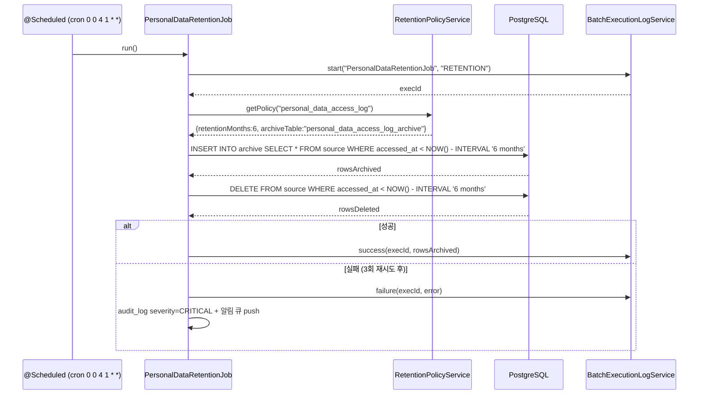
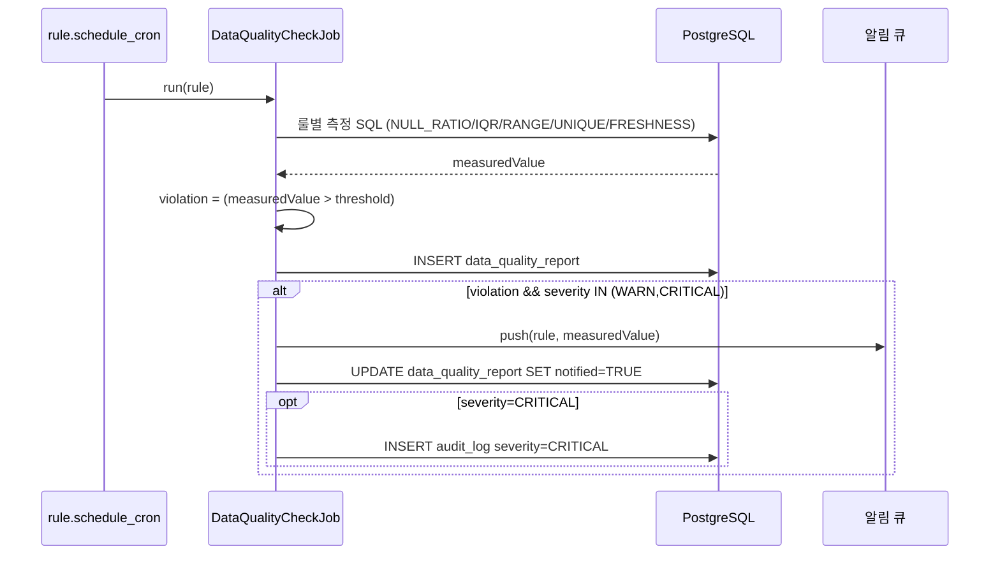
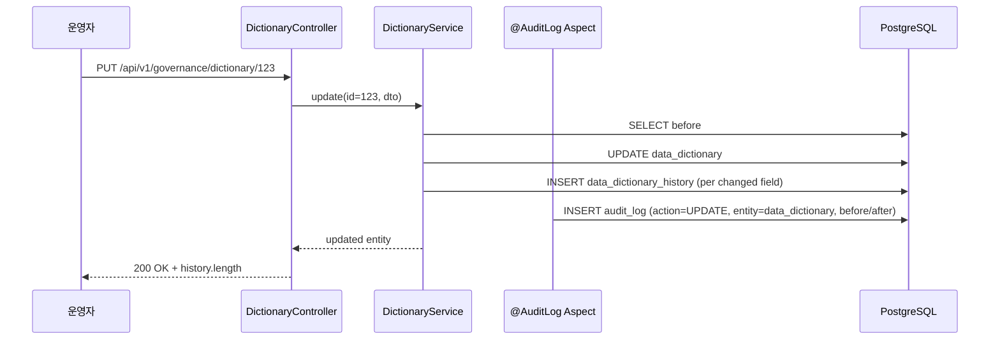

# SPEC-CMS-009: 데이터 거버넌스 (Data Governance) v0.1

## 1. 개요

| 항목 | 내용 |
|------|------|
| SPEC ID | SPEC-CMS-009 |
| 제목 | 데이터 거버넌스 (Data Governance — 표준 사전·보존 정책·통계 파이프라인 확장·품질 모니터링·RTO/RPO) |
| 작성일 | 2026-05-06 |
| 작성자 | manager-spec (MoAI) |
| 상태 | Draft |
| 우선순위 | P1 |
| 분류 | Detail SPEC (parent: SPEC-CMS-001) |
| 의존 SPEC | SPEC-CMS-005 (시스템·배치·감사로그 인프라), SPEC-CMS-002 (personal_data_access_log), SPEC-CMS-006 (안전경영 사고 데이터), SPEC-CMS-007 (정책사업 매칭 데이터), SPEC-CMS-003 (게시판 access_log 소스), SPEC-CMS-004 (콘텐츠 view 소스) |
| 형제 SPEC | SPEC-CMS-010 (통합 검색, 1차 비범위) |

본 SPEC은 SPEC-CMS-001(Umbrella) §15.2 SFR-001/SFR-011, §15.5 DAR-001/007/009, §17.3 데이터 거버넌스 정책에 대한 상세 명세이다. SPEC-CMS-005가 1차로 구축한 access_log·audit_log·일/월 배치·Actuator 인프라를 기반으로, **데이터 표준 사전(S-Meta/DA# 호환), 보존·이관 정책 자동화, 통계 집계 파이프라인 확장(SPEC-006/007 데이터 통합), 데이터 품질 모니터링, RTO/RPO 모니터링** 5개 축의 후속 거버넌스 기능을 정의한다.

본 SPEC은 P1 우선순위로, SPEC-CMS-005가 이미 처리한 access_log 적재·일/월 배치·audit_log AOP·공통코드 캐시·Actuator 엔드포인트·Logback JSON·Docker 배포는 **재정의하지 않으며**, 그 산출물을 입력으로 사용한다.

---

## 2. 참조 문서

- **상위 SPEC**: SPEC-CMS-001 §15.2 SFR-001/011, §15.5 DAR-001/007/009, §17.3 데이터 거버넌스, §17.1 PER 임계값
- **선행 SPEC**: SPEC-CMS-005 §4 access_log/audit_log/access_stat_daily/access_stat_monthly DDL, §13 KPI/integration_log/external_data_source 모델, §15 RFP 비기능 매핑
- **참조 SPEC**:
  - SPEC-CMS-002 §17.3 personal_data_access_log (보존 6개월·콜드 이관 정책 통합)
  - SPEC-CMS-003 게시판·posts·comments (게시판별 통계 집계 소스)
  - SPEC-CMS-004 contents·content_view (콘텐츠 조회 통계 소스)
  - SPEC-CMS-006 safety_incidents (안전경영 사고건수 월별 추이 소스)
  - SPEC-CMS-007 policy_matching·policy_application (정책사업 매칭 성공률 소스)
- **프로젝트 문서**: `.moai/project/tech.md` §6 컨테이너, §8 관측성, `.moai/project/structure.md`
- **외부 표준**: 공공데이터 표준 메타데이터 운영지침(행안부) — S-Meta / DA# 모델등록시스템 호환 구조

---

## 3. 범위 및 비범위

### 3.1 1차 포함 범위 (P1)

- 데이터 표준 사전 (data_dictionary): 테이블·컬럼 한글명, 도메인 분류, 변경 이력
- 보존·이관 정책 (retention_policy): personal_data_access_log 6개월 → archive, audit_log 5년, login_history 1년 자동화 배치
- 통계 집계 파이프라인 확장: 게시판별·콘텐츠별·정책 매칭·안전사고 통계 신규 집계 테이블 + 일/월 배치 + 배치 실행 이력 (batch_execution_log)
- 데이터 품질 모니터링: Null 비율·이상값 탐지 배치, 임계값 설정 API, 위반 알림
- RTO/RPO 지원: DB 백업 상태 모니터링 엔드포인트, 복구 시험 체크리스트 관리
- 거버넌스 관리화면(Frontend): 데이터 표준 사전 CRUD, 보존정책 설정, 품질 리포트 뷰

### 3.2 1차 비범위 (후속 SPEC 또는 옵션 트랙)

| 비범위 항목 | 사유 |
|------------|------|
| OpenTelemetry 분산 추적 | SPEC-CMS-005에서 이미 후속 명시. traceId MDC로 단일 노드 추적 충분 |
| Elasticsearch / OpenSearch 연동 | SPEC-CMS-010 통합 검색에서 다룸 |
| TimescaleDB 도입 | PG 16 PARTITION으로 1차 충분 (SPEC-CMS-005와 동일 결정) |
| AI 기반 데이터 품질 예측 | 통계적 임계값(Null 비율, IQR 이상값) 1차, AI 트랙 SPEC-CMS-AI-001 후속 |
| Kafka / RabbitMQ 실시간 파이프라인 | Spring Scheduling 기반 준실시간(분 단위)으로 1차 대체. 실시간 스트림은 후속 |
| S-Meta / DA# 외부 시스템 실제 API 연동 | 1차는 호환 구조(표준 컬럼명·메타데이터 항목)만 제공, 실제 모델등록시스템 푸시는 운영 단계 절차 |
| 콜드 스토리지 자동 S3 업로드 (audit_log 5년) | SPEC-CMS-005에서 운영 매뉴얼로 1차 처리. 자동화 후속 |
| Grafana 대시보드 구축 | Prometheus 메트릭 노출은 본 SPEC, 시각화 운영 단계 |
| 멀티노드 배치 분산 (ShedLock 등) | 단일 노드 1차, 멀티노드 전환 시 ShedLock 도입 (SPEC-CMS-005와 동일) |

---

## 4. 데이터 모델

### 4.1 ERD (Mermaid)

```mermaid
erDiagram
    DATA_DICTIONARY ||--o{ DATA_DICTIONARY_HISTORY : "변경이력"
    RETENTION_POLICY ||--o{ BATCH_EXECUTION_LOG : "실행기록"
    BOARD_STATS_DAILY ||--o{ BOARD_STATS_MONTHLY : "월합산"
    CONTENT_VIEW_STATS ||--o{ CONTENT_VIEW_STATS_MONTHLY : "월합산"
    DATA_QUALITY_RULE ||--o{ DATA_QUALITY_REPORT : "1:N"
    RECOVERY_DRILL_LOG }o--|| USERS : "performed_by"

    DATA_DICTIONARY {
        bigserial id PK
        varchar table_name
        varchar column_name
        varchar logical_name_ko
        varchar logical_name_en
        varchar data_domain "마스터/거래/통계/로그"
        varchar data_type
        text description
        varchar status
        timestamptz created_at
        timestamptz updated_at
    }

    DATA_DICTIONARY_HISTORY {
        bigserial id PK
        bigint dictionary_id FK
        varchar field_changed
        text old_value
        text new_value
        bigint changed_by
        timestamptz changed_at
    }

    RETENTION_POLICY {
        bigserial id PK
        varchar target_table
        varchar policy_type "DELETE/ARCHIVE/ANONYMIZE"
        int retention_months
        varchar archive_table
        varchar schedule_cron
        varchar status
        timestamptz updated_at
    }

    BATCH_EXECUTION_LOG {
        bigserial id PK
        varchar job_name
        varchar job_group "STATS/RETENTION/QUALITY/RECOVERY"
        timestamptz started_at
        timestamptz finished_at
        varchar status
        int records_processed
        text error_summary
        int retry_count
    }

    BOARD_STATS_DAILY {
        date stat_date PK
        bigint board_id PK
        int total_views
        int unique_visitors
        int post_count
        int comment_count
        int avg_response_ms
        timestamptz aggregated_at
    }

    BOARD_STATS_MONTHLY {
        char stat_month PK
        bigint board_id PK
        int total_views
        int unique_visitors
        int post_count
        int comment_count
        timestamptz aggregated_at
    }

    CONTENT_VIEW_STATS {
        date stat_date PK
        bigint content_id PK
        int view_count
        int unique_viewers
        int avg_dwell_sec
        timestamptz aggregated_at
    }

    POLICY_MATCH_STATS {
        char stat_month PK
        bigint policy_id PK
        int match_count
        int apply_count
        numeric apply_conversion_rate
        int success_count
        timestamptz aggregated_at
    }

    SAFETY_STATS_MONTHLY {
        char stat_month PK
        varchar incident_category PK
        int incident_count
        int casualty_count
        numeric severity_avg
        timestamptz aggregated_at
    }

    DATA_QUALITY_RULE {
        bigserial id PK
        varchar target_table
        varchar target_column
        varchar rule_type "NULL_RATIO/RANGE/IQR/UNIQUE"
        numeric threshold
        varchar severity "INFO/WARN/CRITICAL"
        varchar status
    }

    DATA_QUALITY_REPORT {
        bigserial id PK
        bigint rule_id FK
        timestamptz checked_at
        numeric measured_value
        boolean violation
        text detail
    }

    RECOVERY_DRILL_LOG {
        bigserial id PK
        date drill_date
        varchar drill_type "BACKUP_RESTORE/FAILOVER/PITR"
        varchar result "PASS/FAIL/PARTIAL"
        int rto_actual_min
        int rpo_actual_min
        bigint performed_by FK
        text checklist_json
        text notes
    }
```



### 4.2 PostgreSQL DDL

#### 4.2.1 `data_dictionary` / `data_dictionary_history`

```sql
CREATE TABLE data_dictionary (
    id                BIGSERIAL    PRIMARY KEY,
    table_name        VARCHAR(80)  NOT NULL,
    column_name       VARCHAR(80)  NOT NULL,
    logical_name_ko   VARCHAR(200) NOT NULL,            -- 한글 논리명 (S-Meta/DA# 호환)
    logical_name_en   VARCHAR(200) NULL,
    data_domain       VARCHAR(20)  NOT NULL,            -- MASTER/TRANSACTION/STATISTICS/LOG
    data_type         VARCHAR(50)  NOT NULL,            -- VARCHAR(80), BIGINT, TIMESTAMPTZ 등
    description       TEXT         NULL,
    is_pii            BOOLEAN      NOT NULL DEFAULT FALSE,
    is_required       BOOLEAN      NOT NULL DEFAULT FALSE,
    status            VARCHAR(20)  NOT NULL DEFAULT 'ACTIVE',
    created_at        TIMESTAMPTZ  NOT NULL DEFAULT CURRENT_TIMESTAMP,
    updated_at        TIMESTAMPTZ  NOT NULL DEFAULT CURRENT_TIMESTAMP,
    CONSTRAINT uk_dd_table_col UNIQUE (table_name, column_name),
    CONSTRAINT chk_dd_domain   CHECK (data_domain IN ('MASTER','TRANSACTION','STATISTICS','LOG')),
    CONSTRAINT chk_dd_status   CHECK (status IN ('ACTIVE','DEPRECATED','REMOVED'))
);
CREATE INDEX idx_dd_domain_status ON data_dictionary(data_domain, status);
CREATE INDEX idx_dd_table         ON data_dictionary(table_name);

CREATE TABLE data_dictionary_history (
    id                BIGSERIAL    PRIMARY KEY,
    dictionary_id     BIGINT       NOT NULL REFERENCES data_dictionary(id) ON DELETE CASCADE,
    field_changed     VARCHAR(50)  NOT NULL,            -- logical_name_ko / data_type / description / status 등
    old_value         TEXT         NULL,
    new_value         TEXT         NULL,
    changed_by        BIGINT       NULL,
    changed_at        TIMESTAMPTZ  NOT NULL DEFAULT CURRENT_TIMESTAMP
);
CREATE INDEX idx_ddh_dict_time ON data_dictionary_history(dictionary_id, changed_at DESC);
```

#### 4.2.2 `retention_policy`

```sql
CREATE TABLE retention_policy (
    id                BIGSERIAL    PRIMARY KEY,
    target_table      VARCHAR(80)  NOT NULL UNIQUE,
    policy_type       VARCHAR(20)  NOT NULL,            -- DELETE / ARCHIVE / ANONYMIZE
    retention_months  INTEGER      NOT NULL,
    archive_table     VARCHAR(80)  NULL,                -- ARCHIVE 정책일 때 대상 테이블
    anonymize_columns JSONB        NULL,                -- ANONYMIZE 정책일 때 익명화 컬럼 ["email","phone"]
    schedule_cron     VARCHAR(50)  NOT NULL,            -- Spring cron (예: '0 0 4 1 * *')
    status            VARCHAR(20)  NOT NULL DEFAULT 'ACTIVE',
    description       TEXT         NULL,
    updated_by        BIGINT       NULL,
    updated_at        TIMESTAMPTZ  NOT NULL DEFAULT CURRENT_TIMESTAMP,
    CONSTRAINT chk_rp_type   CHECK (policy_type IN ('DELETE','ARCHIVE','ANONYMIZE')),
    CONSTRAINT chk_rp_status CHECK (status IN ('ACTIVE','PAUSED'))
);

-- 시드 데이터 (Step 1 마이그레이션 시 INSERT)
-- INSERT INTO retention_policy (target_table, policy_type, retention_months, archive_table, schedule_cron, description) VALUES
--   ('personal_data_access_log', 'ARCHIVE',  6,  'personal_data_access_log_archive', '0 0 4 1 * *', 'SPEC-CMS-002 REQ-AUTH-018-D-3 자동화'),
--   ('audit_log',                'ARCHIVE', 60, 'audit_log_archive',                 '0 30 3 1 * *', 'SPEC-CMS-005 REQ-CROSS-001-D-7 5년 보존'),
--   ('login_history',            'DELETE',  12, NULL,                                '0 0 5 1 * *', '로그인 이력 1년 보존'),
--   ('access_log',               'DELETE',  12, NULL,                                '0 30 4 1 * *', 'SPEC-CMS-005 REQ-SYSTEM-001-D-5 12개월'),
--   ('integration_log',          'ARCHIVE', 6,  'integration_log_archive',           '0 0 4 1 * *', 'SPEC-CMS-005 REQ-SYSTEM-008-D-4 자동화');
```

#### 4.2.3 `batch_execution_log`

```sql
CREATE TABLE batch_execution_log (
    id                BIGSERIAL    PRIMARY KEY,
    job_name          VARCHAR(100) NOT NULL,
    job_group         VARCHAR(20)  NOT NULL,            -- STATS / RETENTION / QUALITY / RECOVERY
    started_at        TIMESTAMPTZ  NOT NULL,
    finished_at       TIMESTAMPTZ  NULL,
    duration_ms       INTEGER      NULL,
    status            VARCHAR(20)  NOT NULL DEFAULT 'RUNNING',
    records_processed INTEGER      NOT NULL DEFAULT 0,
    records_failed    INTEGER      NOT NULL DEFAULT 0,
    error_summary     TEXT         NULL,
    retry_count       INTEGER      NOT NULL DEFAULT 0,
    triggered_by      VARCHAR(20)  NOT NULL DEFAULT 'SCHEDULE',  -- SCHEDULE / MANUAL
    operator_id       BIGINT       NULL,
    CONSTRAINT chk_bel_group  CHECK (job_group IN ('STATS','RETENTION','QUALITY','RECOVERY')),
    CONSTRAINT chk_bel_status CHECK (status IN ('RUNNING','SUCCESS','FAILURE','TIMEOUT','RETRYING')),
    CONSTRAINT chk_bel_trig   CHECK (triggered_by IN ('SCHEDULE','MANUAL'))
);
CREATE INDEX idx_bel_job_time   ON batch_execution_log(job_name, started_at DESC);
CREATE INDEX idx_bel_group_time ON batch_execution_log(job_group, started_at DESC);
CREATE INDEX idx_bel_failure    ON batch_execution_log(started_at DESC) WHERE status IN ('FAILURE','TIMEOUT');
```

#### 4.2.4 통계 집계 테이블 (게시판·콘텐츠·정책·안전)

```sql
-- 게시판별 일별 통계 (SPEC-CMS-005 access_log 기반 집계, board_id 차원 추가)
CREATE TABLE board_stats_daily (
    stat_date         DATE      NOT NULL,
    board_id          BIGINT    NOT NULL,
    total_views       INTEGER   NOT NULL DEFAULT 0,
    unique_visitors   INTEGER   NOT NULL DEFAULT 0,
    post_count        INTEGER   NOT NULL DEFAULT 0,    -- 당일 신규 게시글
    comment_count     INTEGER   NOT NULL DEFAULT 0,    -- 당일 신규 댓글
    avg_response_ms   INTEGER   NOT NULL DEFAULT 0,
    aggregated_at     TIMESTAMPTZ NOT NULL DEFAULT CURRENT_TIMESTAMP,
    PRIMARY KEY (stat_date, board_id)
);
CREATE INDEX idx_bsd_board_time ON board_stats_daily(board_id, stat_date DESC);

CREATE TABLE board_stats_monthly (
    stat_month        CHAR(7)   NOT NULL,              -- 'YYYY-MM'
    board_id          BIGINT    NOT NULL,
    total_views       INTEGER   NOT NULL DEFAULT 0,
    unique_visitors   INTEGER   NOT NULL DEFAULT 0,
    post_count        INTEGER   NOT NULL DEFAULT 0,
    comment_count     INTEGER   NOT NULL DEFAULT 0,
    aggregated_at     TIMESTAMPTZ NOT NULL DEFAULT CURRENT_TIMESTAMP,
    PRIMARY KEY (stat_month, board_id)
);

-- 콘텐츠 조회수 (SPEC-CMS-004 contents 기반)
CREATE TABLE content_view_stats (
    stat_date         DATE      NOT NULL,
    content_id        BIGINT    NOT NULL,
    view_count        INTEGER   NOT NULL DEFAULT 0,
    unique_viewers    INTEGER   NOT NULL DEFAULT 0,
    avg_dwell_sec     INTEGER   NOT NULL DEFAULT 0,
    aggregated_at     TIMESTAMPTZ NOT NULL DEFAULT CURRENT_TIMESTAMP,
    PRIMARY KEY (stat_date, content_id)
);
CREATE INDEX idx_cvs_content_time ON content_view_stats(content_id, stat_date DESC);

CREATE TABLE content_view_stats_monthly (
    stat_month        CHAR(7)   NOT NULL,
    content_id        BIGINT    NOT NULL,
    view_count        INTEGER   NOT NULL DEFAULT 0,
    unique_viewers    INTEGER   NOT NULL DEFAULT 0,
    aggregated_at     TIMESTAMPTZ NOT NULL DEFAULT CURRENT_TIMESTAMP,
    PRIMARY KEY (stat_month, content_id)
);

-- 정책사업 매칭 성공률 (SPEC-CMS-007 policy_matching/policy_application 기반)
CREATE TABLE policy_match_stats (
    stat_month            CHAR(7)        NOT NULL,
    policy_id             BIGINT         NOT NULL,
    match_count           INTEGER        NOT NULL DEFAULT 0,    -- 매칭 노출 건수
    apply_count           INTEGER        NOT NULL DEFAULT 0,    -- 신청 건수
    apply_conversion_rate NUMERIC(7,4)   NOT NULL DEFAULT 0,    -- apply_count / match_count
    success_count         INTEGER        NOT NULL DEFAULT 0,    -- 선정/지원 성공 건수
    aggregated_at         TIMESTAMPTZ    NOT NULL DEFAULT CURRENT_TIMESTAMP,
    PRIMARY KEY (stat_month, policy_id)
);
CREATE INDEX idx_pms_policy_time ON policy_match_stats(policy_id, stat_month DESC);

-- 안전경영 사고 월별 추이 (SPEC-CMS-006 safety_incidents 기반)
CREATE TABLE safety_stats_monthly (
    stat_month         CHAR(7)        NOT NULL,
    incident_category  VARCHAR(50)    NOT NULL,                 -- 사고 분류 (장비/낙상/화재/...)
    incident_count     INTEGER        NOT NULL DEFAULT 0,
    casualty_count     INTEGER        NOT NULL DEFAULT 0,       -- 인명 피해
    severity_avg       NUMERIC(5,2)   NOT NULL DEFAULT 0,       -- 1~5 평균 심각도
    aggregated_at      TIMESTAMPTZ    NOT NULL DEFAULT CURRENT_TIMESTAMP,
    PRIMARY KEY (stat_month, incident_category)
);
CREATE INDEX idx_ssm_month ON safety_stats_monthly(stat_month DESC);
```

#### 4.2.5 `data_quality_rule` / `data_quality_report`

```sql
CREATE TABLE data_quality_rule (
    id              BIGSERIAL    PRIMARY KEY,
    target_table    VARCHAR(80)  NOT NULL,
    target_column   VARCHAR(80)  NULL,                  -- NULL 시 테이블 전체 체크
    rule_type       VARCHAR(20)  NOT NULL,              -- NULL_RATIO / RANGE / IQR / UNIQUE / FRESHNESS
    threshold       NUMERIC(10,4) NOT NULL,             -- NULL_RATIO=0.05, FRESHNESS=24(시간) 등
    range_min       NUMERIC(20,4) NULL,                 -- RANGE 시 사용
    range_max       NUMERIC(20,4) NULL,
    severity        VARCHAR(20)  NOT NULL DEFAULT 'WARN',
    status          VARCHAR(20)  NOT NULL DEFAULT 'ACTIVE',
    schedule_cron   VARCHAR(50)  NOT NULL DEFAULT '0 0 6 * * *',  -- 매일 06:00
    description     TEXT         NULL,
    created_at      TIMESTAMPTZ  NOT NULL DEFAULT CURRENT_TIMESTAMP,
    updated_at      TIMESTAMPTZ  NOT NULL DEFAULT CURRENT_TIMESTAMP,
    CONSTRAINT chk_dqr_type     CHECK (rule_type IN ('NULL_RATIO','RANGE','IQR','UNIQUE','FRESHNESS')),
    CONSTRAINT chk_dqr_severity CHECK (severity IN ('INFO','WARN','CRITICAL')),
    CONSTRAINT chk_dqr_status   CHECK (status IN ('ACTIVE','PAUSED'))
);
CREATE INDEX idx_dqr_table ON data_quality_rule(target_table, status);

CREATE TABLE data_quality_report (
    id              BIGSERIAL    PRIMARY KEY,
    rule_id         BIGINT       NOT NULL REFERENCES data_quality_rule(id) ON DELETE CASCADE,
    checked_at      TIMESTAMPTZ  NOT NULL DEFAULT CURRENT_TIMESTAMP,
    measured_value  NUMERIC(20,4) NULL,
    violation       BOOLEAN      NOT NULL,
    detail          TEXT         NULL,                  -- 위반 행 샘플(최대 5건 PK), 측정 SQL 요약
    notified        BOOLEAN      NOT NULL DEFAULT FALSE
);
CREATE INDEX idx_dqrep_rule_time   ON data_quality_report(rule_id, checked_at DESC);
CREATE INDEX idx_dqrep_violation   ON data_quality_report(checked_at DESC) WHERE violation = TRUE;
```

#### 4.2.6 `recovery_drill_log`

```sql
CREATE TABLE recovery_drill_log (
    id               BIGSERIAL    PRIMARY KEY,
    drill_date       DATE         NOT NULL,
    drill_type       VARCHAR(30)  NOT NULL,             -- BACKUP_RESTORE / FAILOVER / PITR
    result           VARCHAR(20)  NOT NULL,             -- PASS / FAIL / PARTIAL
    rto_actual_min   INTEGER      NULL,                 -- 실제 복구 소요시간 (분)
    rpo_actual_min   INTEGER      NULL,                 -- 데이터 손실 구간 (분)
    rto_target_min   INTEGER      NOT NULL DEFAULT 240, -- DAR-009 4시간
    rpo_target_min   INTEGER      NOT NULL DEFAULT 60,  -- 1시간 (운영 결정)
    performed_by     BIGINT       NULL,
    checklist_json   JSONB        NULL,                 -- 체크리스트 항목별 결과
    notes            TEXT         NULL,
    created_at       TIMESTAMPTZ  NOT NULL DEFAULT CURRENT_TIMESTAMP,
    CONSTRAINT chk_rdl_type   CHECK (drill_type IN ('BACKUP_RESTORE','FAILOVER','PITR')),
    CONSTRAINT chk_rdl_result CHECK (result IN ('PASS','FAIL','PARTIAL'))
);
CREATE INDEX idx_rdl_date ON recovery_drill_log(drill_date DESC);
```

---

## 5. 요구사항 (EARS 상세)

### 5.1 데이터 표준 사전 (REQ-GOV-001 ~ 005, DAR-001/007 매핑)

- **REQ-GOV-001 (사전 등록 — Ubiquitous)**
  시스템은 `data_dictionary`에 (table_name, column_name, logical_name_ko, logical_name_en, data_domain, data_type, description, is_pii, is_required, status)을 관리해야 하며, 운영자는 `GET|POST|PUT|DELETE /api/v1/governance/dictionary`로 메타데이터 CRUD를 수행할 수 있어야 한다. (table_name, column_name) 조합은 UNIQUE.
- **REQ-GOV-002 (도메인 분류 — Ubiquitous)**
  `data_domain`은 `MASTER`(users, code, menu 등 기준 정보), `TRANSACTION`(post, comment, application 등 거래성), `STATISTICS`(*_stat_*, *_stats_*, kpi_value 등 집계), `LOG`(audit_log, access_log, integration_log 등) 4개 화이트리스트로 강제해야 하며, 그 외 값은 거부해야 한다 (DB CHECK).
- **REQ-GOV-003 (변경 이력 — Event-driven, DAR-002)**
  data_dictionary의 logical_name_ko, logical_name_en, data_domain, data_type, description, status 컬럼이 UPDATE되었을 때, 시스템은 `data_dictionary_history`에 (dictionary_id, field_changed, old_value, new_value, changed_by, changed_at) 행을 자동 적재해야 한다 (Spring AOP 또는 PG TRIGGER).
- **REQ-GOV-004 (S-Meta/DA# 호환 export — Ubiquitous)**
  시스템은 `GET /api/v1/governance/dictionary/export?format=csv|xlsx`로 (테이블명, 컬럼명, 한글명, 영문명, 도메인, 데이터타입, 설명, 개인정보여부)를 표준 양식으로 다운로드 제공해야 한다. 양식은 행안부 공공데이터 표준 메타데이터 운영지침 컬럼 순서를 따른다.
- **REQ-GOV-005 (현행화 검증 배치 — Event-driven)**
  매일 06:30 (cron `0 30 6 * * *`)에 시스템은 `information_schema.columns` ↔ `data_dictionary` 차이를 비교해 ① data_dictionary에 없는 실제 컬럼(누락) ② data_dictionary에는 있으나 실제 없는 컬럼(stale)을 `data_quality_report`에 rule_type='FRESHNESS', severity='WARN'으로 기록해야 한다.

### 5.2 데이터 보존·이관 정책 자동화 (REQ-GOV-006 ~ 010, DAR-009 일부)

- **REQ-GOV-006 (정책 등록 — Ubiquitous)**
  운영자는 `GET|POST|PUT /api/v1/governance/retention-policies`로 `retention_policy`(target_table, policy_type, retention_months, archive_table, schedule_cron, status)를 관리할 수 있어야 한다. target_table은 UNIQUE이며, policy_type=ARCHIVE인 경우 archive_table 필수.
- **REQ-GOV-007 (개인정보 만료 처리 — Event-driven)**
  매월 1일 04:00 (`PersonalDataRetentionJob`, retention_policy.target_table='personal_data_access_log')에 시스템은 6개월 경과한 personal_data_access_log 행을 personal_data_access_log_archive로 이관 후 원본 DELETE해야 하며, 처리 결과를 batch_execution_log(job_group='RETENTION')에 기록해야 한다. 이는 SPEC-CMS-002 REQ-AUTH-018-D-3을 자동화한다.
- **REQ-GOV-008 (audit_log 5년 정책 — Event-driven, REQ-CROSS-001-D-7 자동화)**
  매월 1일 03:30 (`AuditLogArchiveJob`)에 시스템은 6개월 경과 audit_log 파티션을 DETACH하고 `audit_log_archive` 테이블로 INSERT-SELECT 이관해야 한다. archive 테이블은 audit_log와 동일 schema이며 5년 경과 시 폐기. 1차는 S3 PG_DUMP 자동 업로드 대신 archive 테이블 도입으로 DB 내 5년 보존을 실현하고, S3 자동화는 후속 SPEC.
- **REQ-GOV-009 (login_history 1년 정책 — Event-driven)**
  매월 1일 05:00 (`LoginHistoryRetentionJob`)에 시스템은 12개월 경과한 login_history 행을 DELETE해야 한다 (policy_type='DELETE', archive 없음). 처리 건수는 batch_execution_log에 기록.
- **REQ-GOV-010 (배치 실행 이력 + 재시도 — Unwanted/Recovery, PER-003)**
  retention/quality/stats 배치는 실패 시 시스템은 최대 3회 1시간 간격으로 재시도해야 하며, 3회 모두 실패 시 batch_execution_log.status='FAILURE'와 audit_log severity='CRITICAL'을 적재하고 SPEC-CMS-005 REQ-CROSS-001-D-6 운영자 알림 큐에 push해야 한다. 일별 배치는 10분 이내, 월별 배치는 1시간 이내 SLA를 충족해야 한다 (PER-003).

### 5.3 통계 집계 파이프라인 확장 (REQ-DATA-001 ~ 005, SFR-001/011 매핑)

- **REQ-DATA-001 (게시판별 일별 통계 — Event-driven)**
  매일 01:30 (cron `0 30 1 * * *`, `BoardStatsDailyJob`)에 시스템은 전일 access_log + bbs_post + bbs_comment를 board_id 차원으로 집계하여 `board_stats_daily`에 UPSERT해야 한다. board_id 매핑은 page_url 정규식(`/board/{boardCode}/...`)으로 추출하며, 매핑 실패 행은 records_failed로 카운트한다.
- **REQ-DATA-002 (콘텐츠 조회수 — Event-driven)**
  매일 01:45 (cron `0 45 1 * * *`, `ContentViewStatsJob`)에 시스템은 전일 access_log 중 page_url=`/contents/{id}` 패턴을 집계하여 `content_view_stats`에 UPSERT해야 한다. avg_dwell_sec은 동일 session_id의 다음 페이지 요청 시각 차로 산출하며, 세션 마지막 페이지는 30초로 보정.
- **REQ-DATA-003 (정책사업 매칭 성공률 — Event-driven)**
  매월 1일 02:30 (cron `0 30 2 1 * *`, `PolicyMatchStatsJob`)에 시스템은 SPEC-CMS-007의 policy_matching(매칭 노출), policy_application(신청), policy_application.status='SELECTED'(성공)를 policy_id 차원으로 집계하여 `policy_match_stats`에 UPSERT해야 한다. apply_conversion_rate = apply_count / NULLIF(match_count, 0).
- **REQ-DATA-004 (안전사고 월별 추이 — Event-driven)**
  매월 1일 02:45 (cron `0 45 2 1 * *`, `SafetyStatsMonthlyJob`)에 시스템은 SPEC-CMS-006의 safety_incidents를 incident_category 차원으로 집계하여 `safety_stats_monthly`에 UPSERT해야 한다. casualty_count는 incident.casualty_count 합산, severity_avg는 incident.severity_level 평균.
- **REQ-DATA-005 (배치 실행 이력 관리 — Ubiquitous)**
  모든 통계 배치(REQ-DATA-001~004 + SPEC-CMS-005 일/월 배치 hook)는 실행 시작·종료 시각·소요 ms·records_processed·status를 `batch_execution_log`(job_group='STATS')에 기록해야 하며, 운영자는 `GET /api/v1/governance/batch-logs?jobGroup=STATS&from=...&to=...`로 조회할 수 있어야 한다.

### 5.4 데이터 품질 모니터링 (REQ-DATA-006 ~ 008)

- **REQ-DATA-006 (품질 룰 등록 — Ubiquitous)**
  운영자는 `GET|POST|PUT|DELETE /api/v1/governance/quality-rules`로 `data_quality_rule`(target_table, target_column, rule_type, threshold, range_min, range_max, severity, schedule_cron)을 관리할 수 있어야 한다. rule_type은 (NULL_RATIO, RANGE, IQR, UNIQUE, FRESHNESS) 5종 화이트리스트.
- **REQ-DATA-007 (품질 검사 배치 — Event-driven)**
  각 data_quality_rule은 schedule_cron 주기로 `DataQualityCheckJob`에 의해 실행되어야 하며, 결과(measured_value, violation, detail)를 `data_quality_report`에 적재해야 한다. NULL_RATIO=null 행 / 전체 행, IQR=Q1-1.5*IQR 미만 또는 Q3+1.5*IQR 초과 비율, FRESHNESS=마지막 INSERT 이후 시간(시).
- **REQ-DATA-008 (품질 위반 알림 — Event-driven)**
  data_quality_report.violation=TRUE 이고 rule.severity IN ('WARN','CRITICAL')인 행이 적재되었을 때, 시스템은 SPEC-CMS-005 REQ-CROSS-001-D-6 운영자 알림 큐에 push해야 하며 (CRITICAL은 audit_log 동시 적재), notified=TRUE로 갱신해야 한다. 운영자는 `GET /api/v1/governance/quality-reports?violation=true&severity=CRITICAL`로 미해결 위반을 조회할 수 있어야 한다.

### 5.5 RTO/RPO 지원 (REQ-GOV-011 ~ 012, DAR-009)

- **REQ-GOV-011 (백업 상태 모니터링 — Ubiquitous)**
  시스템은 `GET /actuator/backup-status` 엔드포인트(Custom Actuator HealthIndicator + InfoContributor)를 노출해야 하며, 응답에 (last_backup_at, last_backup_size_bytes, last_backup_result, hours_since_backup, target_rpo_min, rpo_compliance) 필드를 포함해야 한다. 백업 메타정보는 `pg_dump` 결과 파일의 mtime/size 또는 `pg_basebackup` manifest를 운영 스크립트가 시스템 설정 키 `backup.last_meta_json`에 갱신한다 (1차 운영 절차).
- **REQ-GOV-012 (복구 시험 체크리스트 — Ubiquitous)**
  운영자는 `GET|POST /api/v1/governance/recovery-drills`로 `recovery_drill_log`(drill_date, drill_type, result, rto_actual_min, rpo_actual_min, checklist_json, notes)를 등록·조회할 수 있어야 하며, RTO 목표 240분(4시간, DAR-009), RPO 목표 60분 대비 실제 측정치를 기록할 수 있어야 한다. 분기별 1회 이상 등록을 권장한다 (운영 절차, 시스템은 미수행 시 매 분기 1일에 audit_log severity='WARN' 알림 적재).

---

## 6. REST API 명세

| 메서드 | 경로 | 설명 | 권한 | REQ |
|--------|------|------|------|-----|
| **6.1 데이터 표준 사전** | | | | |
| GET | `/api/v1/governance/dictionary` | 사전 목록 (table/domain/status 필터, 페이징) | ADMIN | REQ-GOV-001 |
| GET | `/api/v1/governance/dictionary/{id}` | 단건 조회 (history 포함) | ADMIN | REQ-GOV-001 |
| POST | `/api/v1/governance/dictionary` | 사전 등록 | ADMIN | REQ-GOV-001 |
| PUT | `/api/v1/governance/dictionary/{id}` | 사전 수정 (자동 history 적재) | ADMIN | REQ-GOV-003 |
| DELETE | `/api/v1/governance/dictionary/{id}` | 사전 삭제 (status=REMOVED soft) | ADMIN | REQ-GOV-001 |
| GET | `/api/v1/governance/dictionary/export` | CSV/XLSX 내보내기 (S-Meta 양식) | ADMIN | REQ-GOV-004 |
| GET | `/api/v1/governance/dictionary/freshness` | information_schema 비교 결과 | ADMIN | REQ-GOV-005 |
| **6.2 보존 정책** | | | | |
| GET | `/api/v1/governance/retention-policies` | 정책 목록 | ADMIN | REQ-GOV-006 |
| POST | `/api/v1/governance/retention-policies` | 정책 등록 | ADMIN | REQ-GOV-006 |
| PUT | `/api/v1/governance/retention-policies/{id}` | 정책 수정 | ADMIN | REQ-GOV-006 |
| POST | `/api/v1/governance/retention-policies/{id}/run` | 수동 실행 | ADMIN | REQ-GOV-007/008/009 |
| **6.3 배치 실행 이력** | | | | |
| GET | `/api/v1/governance/batch-logs` | 배치 이력 (jobGroup, status, 기간 필터) | ADMIN | REQ-DATA-005, REQ-GOV-010 |
| GET | `/api/v1/governance/batch-logs/{id}` | 단건 조회 (error_summary 포함) | ADMIN | REQ-GOV-010 |
| **6.4 통계 조회** | | | | |
| GET | `/api/v1/governance/stats/boards` | 게시판별 일/월 통계 (boardId, period) | ADMIN | REQ-DATA-001 |
| GET | `/api/v1/governance/stats/contents` | 콘텐츠 조회수 (contentId, period) | ADMIN | REQ-DATA-002 |
| GET | `/api/v1/governance/stats/policies` | 정책 매칭 성공률 (policyId, period) | ADMIN | REQ-DATA-003 |
| GET | `/api/v1/governance/stats/safety` | 안전사고 월별 추이 (category, from/to) | ADMIN | REQ-DATA-004 |
| POST | `/api/v1/governance/stats/recompute` | 통계 수동 재집계 (job, dateRange) | ADMIN | REQ-DATA-001~004 |
| **6.5 데이터 품질** | | | | |
| GET | `/api/v1/governance/quality-rules` | 품질 룰 목록 | ADMIN | REQ-DATA-006 |
| POST | `/api/v1/governance/quality-rules` | 품질 룰 등록 | ADMIN | REQ-DATA-006 |
| PUT | `/api/v1/governance/quality-rules/{id}` | 품질 룰 수정 | ADMIN | REQ-DATA-006 |
| DELETE | `/api/v1/governance/quality-rules/{id}` | 품질 룰 삭제 | ADMIN | REQ-DATA-006 |
| POST | `/api/v1/governance/quality-rules/{id}/run` | 즉시 실행 | ADMIN | REQ-DATA-007 |
| GET | `/api/v1/governance/quality-reports` | 리포트 (ruleId, violation, severity 필터) | ADMIN | REQ-DATA-008 |
| **6.6 RTO/RPO** | | | | |
| GET | `/actuator/backup-status` | 백업 상태 모니터링 | ADMIN | REQ-GOV-011 |
| GET | `/api/v1/governance/recovery-drills` | 복구 시험 이력 | ADMIN | REQ-GOV-012 |
| POST | `/api/v1/governance/recovery-drills` | 복구 시험 등록 | ADMIN | REQ-GOV-012 |

페이징·정렬·에러 코드 규약은 SPEC-CMS-001 §8 일관 규약을 따른다.

---

## 7. 배치 명세

### 7.1 배치 일람

| 배치 빈 이름 | cron | job_group | 대상 | 설명 | REQ |
|---|---|---|---|---|---|
| `BoardStatsDailyJob` | `0 30 1 * * *` | STATS | board_stats_daily | 전일 게시판별 통계 (page_url 정규식 매핑) | REQ-DATA-001 |
| `ContentViewStatsJob` | `0 45 1 * * *` | STATS | content_view_stats | 전일 콘텐츠 조회수 + dwell time | REQ-DATA-002 |
| `BoardStatsMonthlyJob` | `0 0 3 1 * *` | STATS | board_stats_monthly | 전월 게시판별 합산 | REQ-DATA-001 |
| `ContentViewStatsMonthlyJob` | `0 15 3 1 * *` | STATS | content_view_stats_monthly | 전월 콘텐츠 합산 | REQ-DATA-002 |
| `PolicyMatchStatsJob` | `0 30 2 1 * *` | STATS | policy_match_stats | 전월 정책 매칭 성공률 | REQ-DATA-003 |
| `SafetyStatsMonthlyJob` | `0 45 2 1 * *` | STATS | safety_stats_monthly | 전월 안전사고 추이 | REQ-DATA-004 |
| `PersonalDataRetentionJob` | `0 0 4 1 * *` | RETENTION | personal_data_access_log → archive | 6개월 경과 ARCHIVE+DELETE | REQ-GOV-007 |
| `IntegrationLogRetentionJob` | `0 15 4 1 * *` | RETENTION | integration_log → archive | 6개월 경과 (SPEC-005 REQ-008-D-4 자동화) | REQ-GOV-006 |
| `AuditLogArchiveJob` | `0 30 3 1 * *` | RETENTION | audit_log → audit_log_archive | 6개월 경과 PARTITION DETACH + 이관 | REQ-GOV-008 |
| `LoginHistoryRetentionJob` | `0 0 5 1 * *` | RETENTION | login_history | 12개월 경과 DELETE | REQ-GOV-009 |
| `AccessLogRetentionJob` | `0 30 4 1 * *` | RETENTION | access_log | 12개월 경과 DROP PARTITION | REQ-GOV-006 |
| `DictionaryFreshnessJob` | `0 30 6 * * *` | QUALITY | data_quality_report | information_schema vs data_dictionary 비교 | REQ-GOV-005 |
| `DataQualityCheckJob` | rule.schedule_cron 동적 | QUALITY | data_quality_report | 룰별 NULL_RATIO/RANGE/IQR/UNIQUE/FRESHNESS | REQ-DATA-007 |
| `RecoveryDrillReminderJob` | `0 0 9 1 1,4,7,10 *` | RECOVERY | audit_log | 분기별 1일 09:00 미수행 시 WARN 알림 | REQ-GOV-012 |

### 7.2 배치 공통 패턴 (Spring Scheduling + Retry + 실행 이력)

```java
@Component @RequiredArgsConstructor
public class BoardStatsDailyJob {
    private final BoardStatsMapper mapper;
    private final BatchExecutionLogService batchLog;
    private final RetryTemplate retryTemplate;   // 3회 재시도, 1시간 간격

    @Scheduled(cron = "0 30 1 * * *", zone = "Asia/Seoul")
    public void run() {
        var execId = batchLog.start("BoardStatsDailyJob", "STATS");
        try {
            int processed = retryTemplate.execute(ctx -> {
                LocalDate yesterday = LocalDate.now(ZoneId.of("Asia/Seoul")).minusDays(1);
                return mapper.upsertBoardStats(yesterday);
            });
            batchLog.success(execId, processed);
        } catch (Exception e) {
            batchLog.failure(execId, e);
            // SPEC-CMS-005 REQ-CROSS-001-D-6 알림 큐 push
            throw e;
        }
    }
}
```

- 모든 배치는 `BatchExecutionLogService.start()` → 본문 → `success/failure()` 패턴으로 batch_execution_log 적재 강제
- `RetryTemplate`은 SPEC-CMS-005 §5.2 REQ-SYSTEM-002-D-3과 동일 정책 (3회, 1시간 간격, CRITICAL 알림)
- 단일 노드 환경에서 `@Scheduled` 단일 인스턴스. 멀티노드 전환 시 ShedLock 도입 (SPEC-CMS-005와 동일)

### 7.3 통계 집계 SQL 패턴 (예시: BoardStatsDailyJob)

```sql
-- page_url '/board/{code}/...' 패턴에서 board_id 매핑 (boards.code → boards.id)
INSERT INTO board_stats_daily (stat_date, board_id, total_views, unique_visitors, post_count, comment_count, avg_response_ms, aggregated_at)
SELECT
    DATE(al.created_at AT TIME ZONE 'Asia/Seoul') AS stat_date,
    b.id AS board_id,
    COUNT(*) AS total_views,
    COUNT(DISTINCT al.ip_hash) AS unique_visitors,
    (SELECT COUNT(*) FROM bbs_post bp WHERE bp.board_id = b.id AND DATE(bp.created_at AT TIME ZONE 'Asia/Seoul') = DATE(al.created_at AT TIME ZONE 'Asia/Seoul')) AS post_count,
    (SELECT COUNT(*) FROM bbs_comment bc JOIN bbs_post bp ON bc.post_id = bp.id WHERE bp.board_id = b.id AND DATE(bc.created_at AT TIME ZONE 'Asia/Seoul') = DATE(al.created_at AT TIME ZONE 'Asia/Seoul')) AS comment_count,
    AVG(al.response_time_ms)::INTEGER AS avg_response_ms,
    NOW() AS aggregated_at
FROM access_log al
JOIN boards b ON al.page_url ~ ('^/board/' || b.code || '(/|$)')
WHERE DATE(al.created_at AT TIME ZONE 'Asia/Seoul') = :targetDate
GROUP BY b.id, DATE(al.created_at AT TIME ZONE 'Asia/Seoul')
ON CONFLICT (stat_date, board_id) DO UPDATE
SET total_views = EXCLUDED.total_views,
    unique_visitors = EXCLUDED.unique_visitors,
    post_count = EXCLUDED.post_count,
    comment_count = EXCLUDED.comment_count,
    avg_response_ms = EXCLUDED.avg_response_ms,
    aggregated_at = NOW();
```

---

## 8. 시퀀스 다이어그램

### 8.1 personal_data_access_log 6개월 보존 자동화



### 8.2 데이터 품질 모니터링



### 8.3 데이터 표준 사전 변경 이력



---

## 9. 비기능 요구사항

### 9.1 성능 (PER-002~004 매핑)

- 일별 배치(`BoardStatsDailyJob`, `ContentViewStatsJob`, `DictionaryFreshnessJob`, `DataQualityCheckJob` 일별 룰)는 시작 후 **10분 이내** 완료 (PER-003).
- 월별 배치(`BoardStatsMonthlyJob`, `PolicyMatchStatsJob`, `SafetyStatsMonthlyJob`, `PersonalDataRetentionJob`, `AuditLogArchiveJob`, `LoginHistoryRetentionJob`)는 **1시간 이내** 완료 (PER-003).
- 거버넌스 API 조회(`/api/v1/governance/**`) p95 < **3초** (PER-003), 일반 케이스 < 500ms 목표.
- 배치 실행 중 시스템 자원(CPU/메모리/디스크 I/O) 평균 사용률 90% 미만 (PER-002, SPEC-CMS-005 §15와 동일 알람 룰).

### 9.2 가용성 (SER-003)

- 배치 실패 시 자동 재시도 3회(1시간 간격) → 99.5% 가용성 목표.
- 동일 배치 중복 실행 방지: 단일 노드 `@Scheduled` 인스턴스, 멀티노드 전환 시 ShedLock.
- 모든 배치는 idempotent (UPSERT 또는 멱등 DELETE 조건절) 보장.

### 9.3 데이터 거버넌스 (DAR-001/007/009)

- 신규 9개 테이블(data_dictionary 등) 모두 SPEC-CMS-005 §17.3 표준에 따라 컬럼 한글명·도메인 분류·변경 이력을 data_dictionary 자체에 자기 등록(self-registration).
- DAR-009 RTO ≤ 4시간(240분), RPO ≤ 1시간(60분) 목표값을 `recovery_drill_log.rto_target_min/rpo_target_min` 기본값으로 강제.
- 분기별 1회 이상 복구 시험 권장(미수행 시 audit_log severity=WARN 자동 알림).

### 9.4 보안

- 거버넌스 API는 ROLE=ADMIN 한정 (Spring Security `@PreAuthorize("hasRole('ADMIN')")`).
- data_dictionary, retention_policy의 모든 C/U/D는 SPEC-CMS-005 REQ-CROSS-001-D AOP로 audit_log 자동 적재.
- `/actuator/backup-status`는 SPEC-CMS-005 §10.3 nginx 화이트리스트 + Basic Auth 정책 재사용.
- 보존 정책 자동 DELETE 시 시스템은 행 수만 적재하고 PII 평문은 audit_log에 기록하지 않음 (행안부 가이드라인 준수).

### 9.5 데이터 분류 (§17.3 표준)

본 SPEC 신규 테이블의 데이터 분류:

| 테이블 | 데이터 도메인 | 보존 정책 |
|---|---|---|
| data_dictionary, retention_policy, data_quality_rule | MASTER | 영구 |
| data_dictionary_history | LOG | 5년 (audit_log 정책 준용) |
| batch_execution_log | LOG | 1년 (login_history 정책 준용) |
| board_stats_daily, content_view_stats | STATISTICS | 영구 (집계 데이터) |
| board_stats_monthly, content_view_stats_monthly, policy_match_stats, safety_stats_monthly | STATISTICS | 영구 |
| data_quality_report | LOG | 1년 |
| recovery_drill_log | LOG | 영구 (감사 증적) |

---

## 10. 구현 순서

### Step 1: 데이터 모델 + 배치 인프라 (Backend 1차)

**목표**: 9개 신규 테이블 마이그레이션 + 보존·통계 배치 골격 + batch_execution_log 인프라.

- **1-1 마이그레이션**: Flyway/Liquibase 마이그레이션 V20260506_001 ~ V20260506_009 작성 (data_dictionary, data_dictionary_history, retention_policy, batch_execution_log, board_stats_daily/monthly, content_view_stats/monthly, policy_match_stats, safety_stats_monthly, data_quality_rule, data_quality_report, recovery_drill_log).
- **1-2 시드 데이터**: retention_policy 5건(personal_data_access_log/audit_log/login_history/access_log/integration_log) + data_quality_rule 기본 8건(audit_log FRESHNESS, users.email NULL_RATIO, kpi_value FRESHNESS 등) + data_dictionary 핵심 테이블 50개 컬럼 INSERT.
- **1-3 도메인 모델**: `DataDictionary`, `RetentionPolicy`, `BatchExecutionLog`, `BoardStatsDaily` 등 엔티티 + MyBatis Mapper.
- **1-4 배치 빈 등록**: 14개 `@Scheduled` Job 클래스 + `BatchExecutionLogService` + 공통 `RetryTemplate` Bean.
- **1-5 기존 SPEC 자동화 hook**: SPEC-CMS-005 `IntegrationLogArchiveJob`을 retention_policy 기반으로 재구성 (hard-coded → 정책 테이블 driven). SPEC-CMS-002 `personal_data_access_log` 6개월 정책을 `PersonalDataRetentionJob`으로 이관 (수동 → 자동).

### Step 2: 품질 모니터링 + REST API (Backend 2차)

**목표**: 5종 룰 엔진 + 27개 REST 엔드포인트 + 알림 통합.

- **2-1 품질 룰 엔진**: `NullRatioChecker`, `RangeChecker`, `IqrChecker`, `UniqueChecker`, `FreshnessChecker` 5개 strategy + `DataQualityCheckJob` dispatcher.
- **2-2 거버넌스 컨트롤러**: `DictionaryController`, `RetentionPolicyController`, `BatchExecutionLogController`, `GovernanceStatsController`, `DataQualityController`, `RecoveryDrillController` (총 27개 endpoint, §6 명세).
- **2-3 Custom Actuator**: `BackupStatusHealthIndicator` 등록 → `/actuator/backup-status` 노출 (SPEC-CMS-005 §10.1 management.endpoints.web.exposure.include 확장).
- **2-4 알림 통합**: `data_quality_report.violation=TRUE` → SPEC-CMS-005 REQ-CROSS-001-D-6 운영자 알림 큐 push (AlertingService 재사용).
- **2-5 export 기능**: Apache POI SXSSFWorkbook 기반 `/api/v1/governance/dictionary/export?format=xlsx` (SPEC-CMS-005 §13.1 KPI export 패턴 재사용).
- **2-6 Spring Boot 테스트**: Testcontainers PostgreSQL 16 + JUnit 5로 acceptance.md 시나리오별 통합 테스트 작성.

### Step 3: 거버넌스 관리화면 (Frontend)

**목표**: Vue 3 + Element Plus 기반 거버넌스 관리자 UI 6개 view.

- **3-1 데이터 표준 사전**: 목록/검색/등록/수정/이력 모달 + S-Meta 양식 export 버튼 (`DictionaryListView.vue`, `DictionaryFormDialog.vue`, `DictionaryHistoryDrawer.vue`).
- **3-2 보존 정책 관리**: 5개 시드 정책 + 신규 등록 + 수동 실행 버튼 (`RetentionPolicyView.vue`).
- **3-3 통계 대시보드**: 게시판/콘텐츠/정책/안전 4개 탭 + ECharts 시계열 차트 (`GovernanceStatsView.vue`).
- **3-4 품질 모니터링**: 룰 CRUD + 위반 리포트 타임라인 + severity별 색상 표시 (`QualityRulesView.vue`, `QualityReportsView.vue`).
- **3-5 배치 이력 모니터링**: 24h/7d/30d 필터 + status 색상 + error_summary 디테일 패널 (`BatchLogsView.vue`).
- **3-6 RTO/RPO**: 백업 상태 카드(/actuator/backup-status) + 복구 시험 등록·이력 (`RecoveryDrillView.vue`).

### Step 의존성

- Step 2는 Step 1 완료 의존 (마이그레이션 + 도메인 모델 선행 필수)
- Step 3은 Step 2 완료 의존 (REST API 27개 선행 필수)
- 우선순위: Step 1 P1-High → Step 2 P1-High → Step 3 P1-Medium

---

## 11. 위험 및 대응

| ID | 위험·가정 | 영향 | 완화 방안 |
|----|----------|------|----------|
| RISK-G-01 | retention_policy 잘못된 cron 등록으로 의도치 않은 대량 DELETE | 데이터 손실 | (1) policy_type=DELETE는 ADMIN만 등록 가능 + audit_log 강제 (2) 첫 실행은 dry-run 모드 (records_processed만 카운트) (3) `POST /retention-policies/{id}/run?dryRun=true` 검증 권장 |
| RISK-G-02 | data_dictionary와 실제 schema 불일치 누적 | 거버넌스 신뢰성 저하 | DictionaryFreshnessJob 매일 06:30 실행 + WARN 알림 + 운영자 KPI |
| RISK-G-03 | 통계 배치 page_url 정규식 매핑 실패율 증가 | board_stats_daily 결손 | records_failed 카운트 + 5% 초과 시 audit_log WARN, 정규식 규칙 운영 매뉴얼 명시 |
| RISK-G-04 | audit_log_archive 5년 누적 시 디스크 압박 | 운영 중단 위험 | archive 테이블 월별 PARTITION + 5년 경과 자동 폐기(후속 SPEC) + 디스크 사용률 알람 룰(SPEC-CMS-005 §15) |
| RISK-G-05 | DataQualityCheckJob 무거운 SQL이 OLTP 영향 | API 응답 지연 | (1) 검사 SQL은 read-only replica 우선 (1차는 단일 노드, 멀티노드 후속) (2) statement_timeout=60초 (3) IQR/UNIQUE는 sampling(100k 행) 옵션 |
| RISK-G-06 | RPO 목표 60분 vs 운영 실제 백업 주기 불일치 | DAR-009 미충족 | recovery_drill_log로 분기별 측정·기록 강제 + 60분 미달 시 운영팀 협의 트리거 |
| RISK-G-07 | retention_policy.archive_table FK 부재로 잘못된 테이블명 입력 | 배치 실패 | application 레이어 검증 (information_schema.tables 확인) + 시드 5건은 검증 완료 |
| RISK-G-08 | 동일 시각 다중 배치 실행으로 DB 락 경합 | 배치 SLA 미달 | cron 시각 분산 (01:30 / 01:45 / 02:30 / 02:45 / 03:30 / 04:00 / 04:30 등 15분 간격) |
| RISK-G-09 | data_dictionary_history 무한 증가 | 조회 성능 | 인덱스 (dictionary_id, changed_at DESC) + 5년 경과 행 archive (audit_log 정책 준용) |
| ASSUM-G-01 | SPEC-CMS-006 safety_incidents, SPEC-CMS-007 policy_matching 테이블이 본 SPEC RUN 시점에 존재 | 의존 위험 | 002/005 의존은 강제, 006/007 미구현 시 SafetyStatsMonthlyJob/PolicyMatchStatsJob은 status=SKIPPED로 처리 (graceful degradation) |
| ASSUM-G-02 | 1차 단일 백엔드 노드, 단일 PG 인스턴스 | 멀티노드 락 미적용 | ShedLock 도입은 SPEC-CMS-005와 동일 후속 |

---

## 12. 변경 이력

| 버전 | 일자 | 작성자 | 변경 내용 |
|------|------|--------|----------|
| v0.1 | 2026-05-06 | manager-spec | 초안 작성. SPEC-CMS-001 §15.2 SFR-001/011, §15.5 DAR-001/007/009, §17.3 데이터 거버넌스를 상세화. 5개 축(데이터 표준 사전, 보존·이관 정책 자동화, 통계 집계 파이프라인 확장, 데이터 품질 모니터링, RTO/RPO 지원)에 REQ-GOV-001~012 + REQ-DATA-001~008 (총 20개 부모 REQ) 정의. 9개 신규 테이블 DDL (data_dictionary, data_dictionary_history, retention_policy, batch_execution_log, board_stats_daily/monthly, content_view_stats/monthly, policy_match_stats, safety_stats_monthly, data_quality_rule, data_quality_report, recovery_drill_log). 27개 REST 엔드포인트. 14개 배치 잡 명세. SPEC-CMS-005 인프라(access_log/audit_log/AOP/Actuator/Docker)를 입력으로 사용하며 재정의하지 않음을 명시. 1차 비범위에 OpenTelemetry, Elasticsearch, TimescaleDB, AI 품질 예측, Kafka 실시간, S-Meta 외부 API 연동 명시. |
