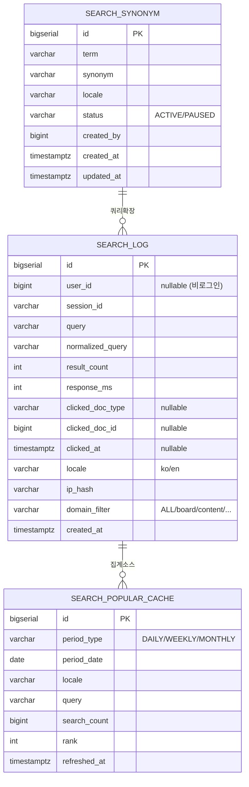
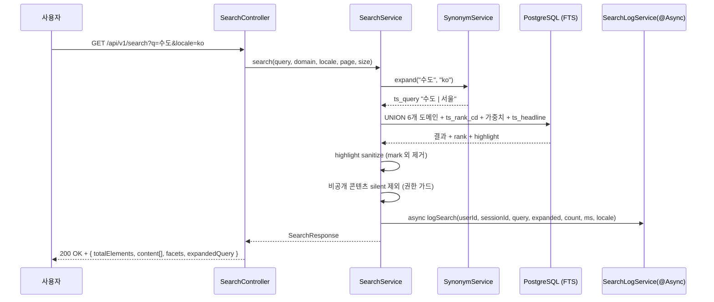
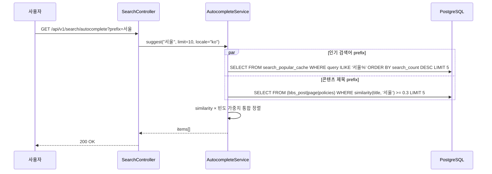
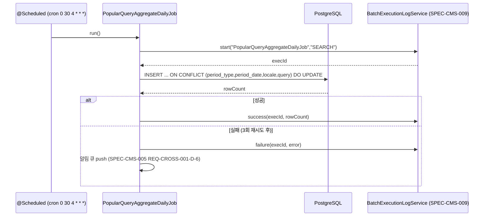
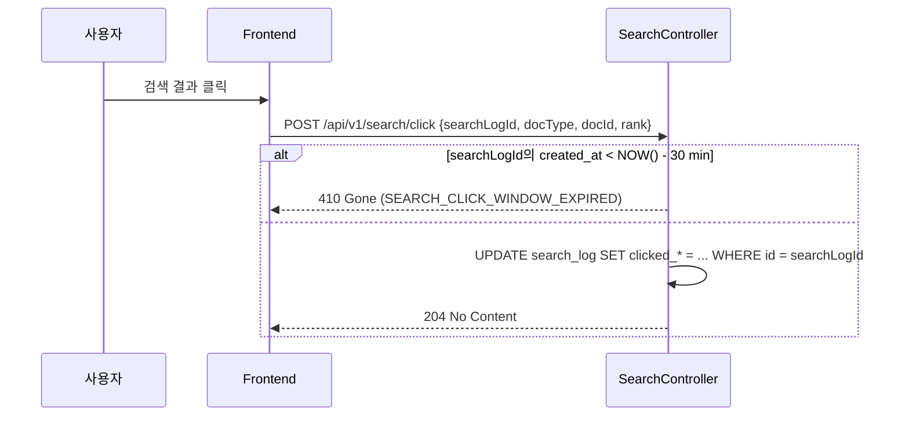

# SPEC-CMS-010: 통합 검색 (Unified Search) v0.2

## 1. 개요

| 항목 | 내용 |
|------|------|
| SPEC ID | SPEC-CMS-010 |
| 제목 | 통합 검색 (Unified Search — 풀텍스트·자동완성·인기검색어·하이라이트) |
| 작성일 | 2026-05-07 |
| 작성자 | manager-spec (MoAI) |
| 상태 | Completed |
| 우선순위 | P1 |
| 분류 | Detail SPEC (parent: SPEC-CMS-001) |
| 의존 SPEC | SPEC-CMS-002 (인증·권한 — 비공개 콘텐츠 가드), SPEC-CMS-003 (게시판·FAQ·QnA `search_vector`/`pg_trgm` GIN), SPEC-CMS-004 (콘텐츠 페이지 `tsv_ko`/`tsv_en` 다국어 tsvector), SPEC-CMS-005 (`access_log` 기반 검색 통계 소스 + 알림 큐), SPEC-CMS-006 (`safety_incidents.search_vector`), SPEC-CMS-007 (정책사업 검색), SPEC-CMS-MEDIA-001 (미디어 메타데이터 GIN), SPEC-CMS-009 (`policy_match_stats`/`content_view_stats`/`batch_execution_log`/`retention_policy` analytics 신호 + 보존 정책) |
| 형제 SPEC | SPEC-CMS-008 (대시보드 — 통합 검색 위젯 소비), SPEC-CMS-009 (데이터 거버넌스) |

본 SPEC은 SPEC-CMS-001(Umbrella) §15.2 SFR(통합 검색 기능 요구사항), §15.4 INR(외부 통합·검색 인터페이스), §16(SPEC 트리)에 대한 상세 명세이다. SPEC-CMS-003/004/006/007/MEDIA-001 마이그레이션이 1차로 구축한 도메인별 `tsvector`·`pg_trgm` GIN 인프라를 기반으로, **통합 검색 API, 자동완성, 인기 검색어, 하이라이트(`ts_headline`), 검색 로그 적재, 동의어 확장** 6개 축의 검색 기능을 정의한다.

본 SPEC은 P1 우선순위로, 각 도메인 SPEC이 이미 정의한 `search_vector`/`tsv_ko`/`tsv_en`/`pg_trgm` GIN 인덱스는 **재정의하지 않으며**, 그 산출물을 입력으로 사용한다. 신규로 정의하는 자산은 `search_log`, `search_popular_cache`, `search_synonym` 3개 테이블과 운영 통계 BRIN 인덱스로 한정한다.

검색 엔진 결정: **PostgreSQL FTS (`tsvector` + GIN + `pg_trgm`)** 단일 스택. ElasticSearch / OpenSearch 도입은 트래픽·문서 규모(현재 가정 10만 문서, 동시 100명) 임계 초과 시 후속 트랙(SPEC-CMS-SEARCH-ES-001)으로 분리한다.

---

## 2. 참조 문서

- **상위 SPEC**: SPEC-CMS-001 §15.2 SFR(통합 검색), §15.4 INR(검색 인터페이스), §16.1 SPEC 트리(SPEC-CMS-010 항목), §17.1 PER 임계값
- **선행 SPEC (인덱스 자산 재사용)**:
  - SPEC-CMS-003 §4 `bbs_post.search_vector` GIN, `idx_bbs_post_title_trgm`, `idx_faq_question_trgm`, `idx_qna_title_trgm`
  - SPEC-CMS-004 §15 `page.tsv_ko`, `page.tsv_en` 다국어 GIN
  - SPEC-CMS-006 `safety_incidents.search_vector` GIN
  - SPEC-CMS-007 `policies.title/description` 검색 (없을 시 본 SPEC §4.4에서 추가 정의)
  - SPEC-CMS-MEDIA-001 `media_asset.metadata` GIN
- **참조 SPEC**:
  - SPEC-CMS-002 §10 비공개 게시글·QnA 권한 가드
  - SPEC-CMS-005 §5 `access_log` 검색 응답시간 메트릭, REQ-CROSS-001-D-6 알림 큐
  - SPEC-CMS-009 §4 `batch_execution_log`, `retention_policy`, §5.3 통계 집계 파이프라인
- **프로젝트 문서**: `.moai/project/tech.md` §3 PostgreSQL 16 + `pg_trgm`, `.moai/project/structure.md`
- **외부 표준**: PostgreSQL 16 Full Text Search 공식 문서, `pg_trgm` 1.6 — 행안부 공공데이터 검색 운영지침

---

## 3. 범위 및 비범위

### 3.1 1차 포함 범위 (P1)

- **통합 검색 API** (`GET /api/v1/search`) — 6개 도메인(게시판·콘텐츠·정책·안전·미디어·발간자료) 단일 검색창 통합
- **도메인별 가중치 + 결과 그룹핑** — `boards=1.0`, `contents=0.9`, `publication=0.85`, `policies=0.8`, `safety=0.7`, `media=0.5`
- **자동완성** (`GET /api/v1/search/autocomplete`) — `pg_trgm` 유사도 기반 prefix 매칭
- **인기 검색어 TOP-N** (`GET /api/v1/search/popular`) — `search_log` 일/주/월 집계 캐시
- **검색 결과 하이라이트** — PostgreSQL `ts_headline` + XSS sanitize
- **검색 로그 적재** (`search_log`) — 사용자/세션/쿼리/결과수/응답시간/클릭 결과 저장
- **다국어 분기** — `Accept-Language` 또는 `locale` 파라미터 기반 `simple`(ko)/`english`(en) 파서 선택
- **동의어 확장** (`search_synonym`) — 운영자가 등록한 동의어로 OR 쿼리 확장
- **클릭 추적** (`POST /api/v1/search/click`) — 검색 결과 클릭률(CTR) 산출
- **Frontend 통합 검색 페이지** — 통합 결과 + 도메인 탭 + 자동완성 드롭다운 + 인기 검색어 위젯

### 3.2 1차 비범위 (후속 SPEC 또는 옵션 트랙)

| 비범위 항목 | 사유 |
|------------|------|
| **ElasticSearch / OpenSearch 도입** | 본 SPEC은 PostgreSQL FTS 단일 스택. tech.md FROZEN. 10만 문서·동시 100명 규모에서 PG FTS로 PER-003(p95 < 500ms) 달성 가능. 임계 초과 시 후속 SPEC-CMS-SEARCH-ES-001로 분리 |
| **한국어 형태소 분석기 (Mecab-ko, Nori)** | 1차는 `simple` 파서 + `pg_trgm` 유사도로 보완. 형태소 분석기 도입은 정확도 미달 측정 후 후속 SPEC |
| **시맨틱 검색 (벡터 임베딩, pgvector / Milvus)** | LLM 임베딩 기반 의미 검색은 SPEC-CMS-AI-001 옵션 트랙 |
| **자연어 질의 해석 (LLM 기반 query rewriting)** | 후속 (SPEC-CMS-AI-001) |
| **검색 결과 개인화 (사용자 이력 기반 랭킹)** | 후속. 1차는 도메인 가중치 + `ts_rank_cd` 정적 랭킹 |
| **페이싯·필터의 동적 카테고리 자동 발견** | 1차는 정적 도메인 분류(6개) + 정적 필터(작성일·작성자)만 |
| **추천 검색어 (related queries)** | 1차는 인기 검색어만, 관련 검색어는 후속 |
| **음성 검색·이미지 검색** | 후속 |
| **검색 결과 즉시 반영 (실시간 인덱싱 < 1초)** | 1차는 트리거 기반 동기 인덱싱(REQ-SEARCH-CMS-003/004 search_vector 트리거)로 충분. 분/초 단위 실시간은 ES 트랙 |

---

## 4. 데이터 모델

### 4.1 ERD (Mermaid)



### 4.2 신규 테이블 DDL

#### 4.2.1 `search_log` — 검색 로그

```sql
CREATE TABLE search_log (
    id                BIGSERIAL    PRIMARY KEY,
    user_id           BIGINT       NULL,                          -- 비로그인 시 NULL
    session_id        VARCHAR(64)  NOT NULL,                      -- 비로그인 추적용 (쿠키 기반)
    query             VARCHAR(200) NOT NULL,                      -- 원본 쿼리
    normalized_query  VARCHAR(200) NOT NULL,                      -- 공백제거+소문자 정규화 (집계 키)
    expanded_query    VARCHAR(500) NULL,                          -- 동의어 확장 후 (REQ-SEARCH-009)
    result_count      INTEGER      NOT NULL DEFAULT 0,
    response_ms       INTEGER      NOT NULL DEFAULT 0,
    clicked_doc_type  VARCHAR(30)  NULL,                          -- board/content/policy/safety/media/publication
    clicked_doc_id    BIGINT       NULL,
    clicked_at        TIMESTAMPTZ  NULL,
    clicked_rank      INTEGER      NULL,                          -- 클릭된 결과의 순위 (1=최상위)
    locale            VARCHAR(10)  NOT NULL DEFAULT 'ko',
    domain_filter     VARCHAR(20)  NOT NULL DEFAULT 'ALL',        -- ALL/board/content/policy/safety/media/publication
    ip_hash           VARCHAR(64)  NULL,                          -- SHA-256 (SPEC-CMS-005 access_log 패턴 동일)
    created_at        TIMESTAMPTZ  NOT NULL DEFAULT CURRENT_TIMESTAMP,
    CONSTRAINT chk_sl_locale CHECK (locale IN ('ko','en')),
    CONSTRAINT chk_sl_domain CHECK (domain_filter IN ('ALL','board','content','policy','safety','media','publication')),
    CONSTRAINT chk_sl_clicked CHECK (
        (clicked_doc_type IS NULL AND clicked_doc_id IS NULL AND clicked_at IS NULL)
        OR (clicked_doc_type IS NOT NULL AND clicked_doc_id IS NOT NULL AND clicked_at IS NOT NULL)
    )
);

-- 일별 집계용 BRIN (시계열 INSERT-ONLY 최적)
CREATE INDEX idx_sl_created_brin ON search_log USING BRIN(created_at);

-- normalized_query 집계용 (인기 검색어 배치)
CREATE INDEX idx_sl_normalized_time ON search_log(normalized_query, created_at DESC);

-- 사용자별 검색 이력 조회용 (개인화 후속 트랙 대비)
CREATE INDEX idx_sl_user_time      ON search_log(user_id, created_at DESC) WHERE user_id IS NOT NULL;

-- 0건 검색 모니터링용 (data_quality_rule FRESHNESS 후속)
CREATE INDEX idx_sl_zero_result    ON search_log(created_at DESC) WHERE result_count = 0;
```

#### 4.2.2 `search_popular_cache` — 인기 검색어 캐시

```sql
CREATE TABLE search_popular_cache (
    id              BIGSERIAL    PRIMARY KEY,
    period_type     VARCHAR(10)  NOT NULL,                      -- DAILY/WEEKLY/MONTHLY
    period_date     DATE         NOT NULL,                      -- DAILY=대상일, WEEKLY=주 시작 월요일, MONTHLY=월 1일
    locale          VARCHAR(10)  NOT NULL DEFAULT 'ko',
    query           VARCHAR(200) NOT NULL,                      -- normalized_query
    search_count    BIGINT       NOT NULL DEFAULT 0,
    rank            INTEGER      NOT NULL,                      -- 1..N (period_type, period_date, locale 내 순위)
    refreshed_at    TIMESTAMPTZ  NOT NULL DEFAULT CURRENT_TIMESTAMP,
    CONSTRAINT uk_spc_period_locale_query UNIQUE (period_type, period_date, locale, query),
    CONSTRAINT chk_spc_period CHECK (period_type IN ('DAILY','WEEKLY','MONTHLY')),
    CONSTRAINT chk_spc_locale CHECK (locale IN ('ko','en')),
    CONSTRAINT chk_spc_rank   CHECK (rank > 0)
);

CREATE INDEX idx_spc_lookup ON search_popular_cache(period_type, period_date, locale, rank);
CREATE INDEX idx_spc_refreshed ON search_popular_cache(refreshed_at DESC);
```

#### 4.2.3 `search_synonym` — 동의어 사전

```sql
CREATE TABLE search_synonym (
    id          BIGSERIAL    PRIMARY KEY,
    term        VARCHAR(100) NOT NULL,                          -- 검색어 (사용자 입력)
    synonym     VARCHAR(100) NOT NULL,                          -- 확장 동의어 (OR 매칭)
    locale      VARCHAR(10)  NOT NULL DEFAULT 'ko',
    status      VARCHAR(20)  NOT NULL DEFAULT 'ACTIVE',
    description TEXT         NULL,                              -- 등록 사유 (예: "공공기관 공식 약어")
    created_by  BIGINT       NULL,
    created_at  TIMESTAMPTZ  NOT NULL DEFAULT CURRENT_TIMESTAMP,
    updated_by  BIGINT       NULL,
    updated_at  TIMESTAMPTZ  NOT NULL DEFAULT CURRENT_TIMESTAMP,
    CONSTRAINT uk_ss_term_synonym_locale UNIQUE (term, synonym, locale),
    CONSTRAINT chk_ss_status CHECK (status IN ('ACTIVE','PAUSED')),
    CONSTRAINT chk_ss_locale CHECK (locale IN ('ko','en')),
    CONSTRAINT chk_ss_self   CHECK (term <> synonym)
);

-- 쿼리 확장용 룩업 (term 기준 IN 절)
CREATE INDEX idx_ss_term_locale_status ON search_synonym(term, locale, status);
```

### 4.3 기존 인덱스 활용 (재정의 금지, 명시만)

| 도메인 | 컬럼 / 인덱스 | 출처 SPEC |
|-------|--------------|-----------|
| 게시판 | `bbs_post.search_vector tsvector` + `idx_bbs_post_search_vector` GIN | SPEC-CMS-003 §4.2 |
| FAQ | `faq.question` + `idx_faq_question_trgm` (`pg_trgm` GIN) | SPEC-CMS-003 §4.2 |
| QnA | `qna.title` + `idx_qna_title_trgm` (`pg_trgm` GIN) | SPEC-CMS-003 §4.2 |
| 발간자료 | `bbs_post(WHERE board_type='PUBLICATION').search_vector` + GIN | SPEC-CMS-003 §4.2 + V19 마이그레이션 |
| 콘텐츠 | `page.tsv_ko`, `page.tsv_en` + 각 GIN | SPEC-CMS-004 §15 |
| 안전 | `safety_incidents.search_vector` + GIN | SPEC-CMS-006 |
| 미디어 | `media_asset.metadata` JSONB + GIN | SPEC-CMS-MEDIA-001 |

본 SPEC은 위 인덱스를 **참조만** 하며, DDL을 재정의하지 않는다. 원천 SPEC의 마이그레이션이 선행 적용되어 있어야 한다(검증은 §11 ASSUM-S-01).

### 4.4 정책 검색 인덱스 보완 (조건부 신규)

SPEC-CMS-007 RUN 시점에 `policies.search_vector` 또는 `pg_trgm` 인덱스가 정의되어 있지 않은 경우, 본 SPEC Step 1 마이그레이션 V20에서 다음을 추가한다(이미 존재 시 IF NOT EXISTS 가드로 멱등 처리).

```sql
-- 정책 검색 인덱스 (SPEC-CMS-007과 협의 결과 미정의 상태인 경우만 추가)
CREATE INDEX IF NOT EXISTS idx_policies_title_trgm
    ON policies USING GIN (title gin_trgm_ops);
CREATE INDEX IF NOT EXISTS idx_policies_description_trgm
    ON policies USING GIN (description gin_trgm_ops);

-- 통합 검색 시 ts_rank_cd 평가용 (선택적)
ALTER TABLE policies ADD COLUMN IF NOT EXISTS search_vector tsvector
    GENERATED ALWAYS AS (
        setweight(to_tsvector('simple', COALESCE(title, '')), 'A')
        || setweight(to_tsvector('simple', COALESCE(description, '')), 'B')
    ) STORED;
CREATE INDEX IF NOT EXISTS idx_policies_search_vector
    ON policies USING GIN (search_vector);
```

### 4.5 보존 정책 시드 (SPEC-CMS-009 `retention_policy` 등록)

본 SPEC Step 1에서 `retention_policy`에 다음 시드를 INSERT 한다(SPEC-CMS-009 인프라 재사용).

```sql
INSERT INTO retention_policy (target_table, policy_type, retention_months, schedule_cron, description)
VALUES
  ('search_log',            'DELETE', 6, '0 30 5 1 * *', 'SPEC-CMS-010 REQ-SEARCH-008-D-3 검색 로그 6개월 보존'),
  ('search_popular_cache',  'DELETE', 24,'0 0 6 1 * *',  'SPEC-CMS-010 인기 검색어 캐시 24개월 보존');
```

---

## 5. 요구사항 (EARS 상세)

### 5.1 통합 검색 (REQ-SEARCH-001 ~ 004, SFR/INR 매핑)

- **REQ-SEARCH-001 (통합 검색 — Event-driven)**
  When 사용자가 `GET /api/v1/search?q={query}&domain={ALL|board|content|policy|safety|media|publication}&page={N}&size={1..50}&locale={ko|en}&from={ISO-8601}&to={ISO-8601}`을 호출하면,
  Then 시스템은 `locale=ko`인 경우 `to_tsvector('simple', source)`와 `websearch_to_tsquery('simple', query)`로 매칭하고, `locale=en`인 경우 `to_tsvector('english', source)`와 `websearch_to_tsquery('english', query)`로 매칭하며, `ts_rank_cd(search_vector, query)`에 도메인별 가중치(`boards=1.0`, `contents=0.9`, `publication=0.85`, `policies=0.8`, `safety=0.7`, `media=0.5`)를 곱한 정규화 점수로 통합 정렬한 후, `(page-1)*size .. page*size` 범위를 페이징하여 반환해야 한다.
  응답 스키마:
  ```json
  {
    "totalElements": 1234,
    "totalPages": 62,
    "page": 1,
    "size": 20,
    "expandedQuery": "수도 OR 서울",
    "responseMs": 145,
    "facets": { "byDomain": { "board": 412, "content": 380, "policy": 220, "safety": 150, "media": 50, "publication": 22 } },
    "content": [
      { "docType": "board", "docId": 12345, "title": "서울시 청년 정책...", "snippet": "서울 청년 ...", "highlight": "<mark>서울</mark>시 청년...", "rank": 0.8542, "domain": "board", "url": "/board/notice/12345", "createdAt": "2026-05-01T09:00:00Z" }
    ]
  }
  ```
  성능: p95 < 500ms (10만 문서 + 동시 100 사용자, 게시판 단일 도메인 단일 키워드 기준).
  size 상한 50, 초과 시 400 에러.

- **REQ-SEARCH-002 (검색 결과 하이라이트 — Ubiquitous)**
  시스템은 통합 검색 응답의 각 결과에 `ts_headline('simple', source_text, ts_query, 'StartSel=<mark>,StopSel=</mark>,MaxWords=30,MinWords=5,MaxFragments=2')`로 생성한 `highlight` 문자열을 포함해야 하며, 응답 직전에 `<mark>` 태그 외 모든 HTML 태그를 sanitize(제거)해야 한다 (XSS 방지). `<mark>` 속성·이벤트핸들러·script 태그 입력은 모두 제거된다.

- **REQ-SEARCH-003 (비공개 콘텐츠 권한 가드 — State-driven, Unwanted)**
  While 검색 요청자가 인증되지 않은 상태이면, 시스템은 비공개 게시글(QnA `is_secret=true`, page `visibility='PRIVATE'`, safety_incidents 비공개) 결과를 응답에서 silently 제외해야 한다.
  While 검색 요청자가 인증되었고 비공개 콘텐츠 소유자(작성자 본인) 또는 ADMIN 권한이면, 해당 결과를 포함해야 한다.
  Then 권한 부족 시 정보 누출 방지를 위해 `403`이 아닌 silent 제외 (`facets.byDomain` 카운트도 노출 제외 후 카운트, SPEC-CMS-003 REQ-BOARD-008과 일치).

- **REQ-SEARCH-004 (도메인별 검색 — Event-driven)**
  When `GET /api/v1/search?q=...&domain=board`처럼 단일 도메인이 지정되면,
  Then 시스템은 해당 도메인의 인덱스(예: `bbs_post.search_vector`)만 조회하고 `facets.byDomain`에 단일 도메인만 반환해야 한다.
  When `domain=ALL` 또는 미지정이면, 6개 도메인 전체를 UNION ALL로 조회한다.
  도메인 미지정 시 default `ALL`.

### 5.2 자동완성 (REQ-SEARCH-005)

- **REQ-SEARCH-005 (자동완성 — Event-driven)**
  When 사용자가 `GET /api/v1/search/autocomplete?prefix={prefix}&limit={1..20}&locale={ko|en}`을 호출하면,
  Then 시스템은 다음 두 소스를 통합하여 응답해야 한다.
  - **소스 1 (인기 검색어 prefix 매칭)**: `search_popular_cache(period_type='DAILY')`에서 `query ILIKE prefix||'%'` 또는 `similarity(query, prefix) >= 0.3` (`pg_trgm`) 행 중 `search_count` 내림차순 TOP 5
  - **소스 2 (콘텐츠 제목 prefix 매칭)**: `bbs_post.title`, `page.title`, `policies.title`에 대해 `pg_trgm` `similarity(title, prefix) >= 0.3` TOP 5
  - **통합 정렬**: similarity × 빈도 가중치로 통합 후 `limit` 적용 (default limit=10).
  응답 스키마:
  ```json
  { "items": [ { "text": "서울시 청년 정책", "source": "popular", "score": 0.92 }, { "text": "서울시 청년 지원금", "source": "title", "score": 0.85 } ] }
  ```
  성능: p95 < 100ms.
  prefix 길이 1자 미만이면 빈 응답, 50자 초과 시 400 에러.

### 5.3 인기 검색어 (REQ-SEARCH-006 ~ 007)

- **REQ-SEARCH-006 (인기 검색어 조회 — Event-driven)**
  When 사용자가 `GET /api/v1/search/popular?period={DAILY|WEEKLY|MONTHLY}&locale={ko|en}&limit={1..50}`을 호출하면,
  Then 시스템은 `search_popular_cache`에서 `(period_type, period_date=가장 최근 갱신일, locale)` 매칭 행을 `rank` 오름차순으로 `limit` 만큼 반환해야 한다.
  응답: `{ "period": "DAILY", "periodDate": "2026-05-06", "items": [ { "rank": 1, "query": "서울시 청년", "searchCount": 1542 }, ... ] }`.
  캐시 미스(period_date 데이터 없음) 시 직전 사용 가능 period_date로 폴백, 그 또한 없으면 `items: []`.
  성능: p95 < 50ms.

- **REQ-SEARCH-007 (인기 검색어 집계 배치 — Event-driven)**
  When 매일 04:30 (cron `0 30 4 * * *`)에 `PopularQueryAggregateDailyJob`이 실행되면,
  Then 시스템은 전일(어제) `search_log`를 `(normalized_query, locale)` 기준으로 GROUP BY COUNT(*) 하여 TOP 100을 `search_popular_cache(period_type='DAILY', period_date=어제)`에 UPSERT 해야 한다.
  When 매주 월요일 05:00 (cron `0 0 5 * * 1`)에 `PopularQueryAggregateWeeklyJob`이 실행되면, 직전 주(월~일)를 집계하여 `period_type='WEEKLY', period_date=주 시작 월요일`로 적재.
  When 매월 1일 05:30 (cron `0 30 5 1 * *`)에 `PopularQueryAggregateMonthlyJob`이 실행되면, 전월을 집계하여 `period_type='MONTHLY', period_date=전월 1일`로 적재.
  배치 실행 이력은 SPEC-CMS-009 `batch_execution_log(job_group='SEARCH')`에 기록되어야 하며, 실패 시 SPEC-CMS-009 REQ-GOV-010 재시도(3회/1시간 간격) 정책을 따른다.

### 5.4 검색 로그 (REQ-SEARCH-008)

- **REQ-SEARCH-008 (검색 로그 적재 — Event-driven)**
  When 사용자가 통합 검색 또는 자동완성 API를 호출하면(자동완성은 prefix 길이 ≥ 2 인 경우만 적재),
  Then 시스템은 `search_log`에 (`user_id`(인증 시), `session_id`, `query`, `normalized_query`=공백제거+소문자, `expanded_query`(동의어 확장 후), `result_count`, `response_ms`, `locale`, `domain_filter`, `ip_hash`(SHA-256), `created_at`) 행을 비동기로 INSERT 해야 한다.
  비동기 적재로 인한 검색 응답 지연은 < 10ms 이어야 한다 (Spring `@Async` 또는 별도 스레드 풀).
  보존 기간 6개월 (§4.5 `retention_policy` 시드).
  When 사용자가 `POST /api/v1/search/click` body=`{searchLogId, docType, docId, rank}`을 호출하면, 해당 search_log 행의 (`clicked_doc_type`, `clicked_doc_id`, `clicked_rank`, `clicked_at`)를 UPDATE 해야 한다 (CTR 산출용).
  searchLogId가 30분 이상 경과한 경우 410 Gone 반환(클릭 추적 윈도우 한정).

### 5.5 동의어 (REQ-SEARCH-009)

- **REQ-SEARCH-009 (동의어 확장 — Event-driven, Ubiquitous)**
  When `search_synonym`에 (`term='수도'`, `synonym='서울'`, `locale='ko'`, `status='ACTIVE'`)가 등록되어 있고 사용자가 `q=수도`를 호출하면,
  Then 시스템은 ts_query 를 `to_tsquery('simple', '수도 | 서울')`로 OR 확장하여 매칭해야 하며, 응답에 `expandedQuery`로 확장된 질의를 포함해야 한다.
  동일 term에 다중 synonym이 등록된 경우 모두 OR 확장. 확장 결과 ts_query 토큰 수가 20을 초과하면 상위 빈도 20개로 절단(쿼리 폭발 방지).
  운영자 CRUD: `GET|POST|PUT|DELETE /api/v1/search/synonyms` (ROLE=ADMIN 한정).
  C/U/D는 SPEC-CMS-005 REQ-CROSS-001-D AOP `audit_log`에 자동 적재되어야 한다.

### 5.6 비기능 요구사항 (REQ-SEARCH-010)

- **REQ-SEARCH-010 (성능·보안·다국어·관측성 — Ubiquitous)**

  **성능 (PER-003 매핑):**
  - 통합 검색 p95 < 500ms (10만 문서, 동시 100 사용자, 단일 키워드 / 단일 도메인 또는 ALL).
  - 자동완성 p95 < 100ms.
  - 인기 검색어 조회 p95 < 50ms (캐시 히트 가정).
  - 검색 로그 비동기 적재가 검색 응답 시간에 미치는 영향 < 10ms.
  - 인기 검색어 일별 집계 배치는 10분 이내 완료 (SPEC-CMS-009 §9.1과 동일 SLA).

  **보안:**
  - `ts_headline` 출력은 `<mark>` 외 HTML 제거 sanitize 필수 (REQ-SEARCH-002).
  - 비공개 콘텐츠는 silent 제외 (REQ-SEARCH-003).
  - 모든 SQL은 prepared statement / MyBatis `#{}` 바인딩만 사용, `${}` 동적 SQL 금지 (SQL injection 방지).
  - 동의어 CRUD는 ADMIN 한정 + audit_log 적재.
  - 검색 로그의 `query` 컬럼은 PII 가능성으로 SPEC-CMS-009 `data_dictionary.is_pii=true` 등록 (운영 매뉴얼).

  **다국어:**
  - `locale=ko` → `to_tsvector('simple', ...)` + `pg_trgm` 보완.
  - `locale=en` → `to_tsvector('english', ...)`.
  - 응답의 `highlight`는 입력 쿼리의 locale 기준으로 생성.
  - `Accept-Language` 헤더와 `locale` 파라미터 충돌 시 파라미터 우선.

  **관측성:**
  - 검색 응답 시간(ms)은 SPEC-CMS-005 `access_log.response_time_ms`에 자동 기록.
  - 0건 검색 비율은 SPEC-CMS-009 `data_quality_rule(rule_type='RATIO', target_table='search_log', target_column='result_count', threshold=0.30)` 신규 등록 권장(0건 30% 초과 시 WARN 알림).
  - 인기 검색어 배치 미실행은 SPEC-CMS-009 REQ-DATA-008 품질 위반 알림으로 통합.

---

## 6. REST API 명세

| 메서드 | 경로 | 설명 | 권한 | REQ |
|--------|------|------|------|-----|
| **6.1 통합 검색** | | | | |
| GET | `/api/v1/search` | 통합 검색 (q, domain, page, size, locale, from, to) | PUBLIC (인증 시 비공개 포함) | REQ-SEARCH-001/002/003/004 |
| **6.2 자동완성** | | | | |
| GET | `/api/v1/search/autocomplete` | 자동완성 (prefix, limit, locale) | PUBLIC | REQ-SEARCH-005 |
| **6.3 인기 검색어** | | | | |
| GET | `/api/v1/search/popular` | 인기 검색어 (period, locale, limit) | PUBLIC | REQ-SEARCH-006 |
| **6.4 클릭 추적** | | | | |
| POST | `/api/v1/search/click` | 검색 결과 클릭 추적 (searchLogId, docType, docId, rank) | PUBLIC | REQ-SEARCH-008 |
| **6.5 동의어 관리** | | | | |
| GET | `/api/v1/search/synonyms` | 동의어 목록 (term, locale, status 필터, 페이징) | ADMIN | REQ-SEARCH-009 |
| POST | `/api/v1/search/synonyms` | 동의어 등록 | ADMIN | REQ-SEARCH-009 |
| PUT | `/api/v1/search/synonyms/{id}` | 동의어 수정 | ADMIN | REQ-SEARCH-009 |
| DELETE | `/api/v1/search/synonyms/{id}` | 동의어 삭제(soft, status='PAUSED') | ADMIN | REQ-SEARCH-009 |
| **6.6 운영 통계 (관리자)** | | | | |
| GET | `/api/v1/search/stats/queries` | 검색 통계 (TOP 쿼리, 0건 비율, 평균 응답시간) | ADMIN | REQ-SEARCH-010 |

페이징·정렬·에러 코드 규약은 SPEC-CMS-001 §8 일관 규약을 따른다. 에러 코드 신규: `SEARCH_QUERY_TOO_LONG`(401자 이상), `SEARCH_DOMAIN_INVALID`, `SEARCH_LOCALE_UNSUPPORTED`, `SEARCH_CLICK_WINDOW_EXPIRED`(30분 초과), `SEARCH_SYNONYM_DUPLICATE`(uk_ss_term_synonym_locale 위반), `SEARCH_SYNONYM_SELF`(term=synonym 위반).

---

## 7. 배치 명세

### 7.1 배치 일람

| 배치 빈 이름 | cron | job_group | 대상 | 설명 | REQ |
|---|---|---|---|---|---|
| `PopularQueryAggregateDailyJob` | `0 30 4 * * *` | SEARCH | search_popular_cache(DAILY) | 전일 search_log → 인기 검색어 TOP 100 UPSERT | REQ-SEARCH-007 |
| `PopularQueryAggregateWeeklyJob` | `0 0 5 * * 1` | SEARCH | search_popular_cache(WEEKLY) | 직전 주(월~일) 인기 검색어 TOP 100 | REQ-SEARCH-007 |
| `PopularQueryAggregateMonthlyJob` | `0 30 5 1 * *` | SEARCH | search_popular_cache(MONTHLY) | 전월 인기 검색어 TOP 100 | REQ-SEARCH-007 |
| `SearchLogRetentionJob` | `0 30 5 1 * *` (SPEC-CMS-009 retention_policy 트리거) | RETENTION | search_log | 6개월 경과 DELETE | REQ-SEARCH-008 |

`PopularQueryAggregateMonthlyJob`과 `SearchLogRetentionJob`이 동일 cron 충돌하므로, RetentionJob은 06:00으로 5분 분산 (실제 cron `0 35 5 1 * *`)하여 락 경합을 방지한다(§11 RISK-S-08).

### 7.2 배치 공통 패턴

SPEC-CMS-009 §7.2와 동일한 `BatchExecutionLogService.start()` → 본문 → `success/failure()` + `RetryTemplate` 3회 재시도 패턴을 재사용한다. 배치는 모두 `@Scheduled(zone = "Asia/Seoul")`로 단일 노드 실행하며, 멀티노드 전환 시 ShedLock 도입은 SPEC-CMS-005/009와 동일한 후속 트랙.

### 7.3 일별 인기 검색어 집계 SQL (예시: PopularQueryAggregateDailyJob)

```sql
INSERT INTO search_popular_cache (period_type, period_date, locale, query, search_count, rank, refreshed_at)
SELECT
    'DAILY' AS period_type,
    :targetDate AS period_date,
    locale,
    normalized_query AS query,
    COUNT(*) AS search_count,
    ROW_NUMBER() OVER (PARTITION BY locale ORDER BY COUNT(*) DESC) AS rank,
    NOW() AS refreshed_at
FROM search_log
WHERE created_at >= :targetDate::timestamptz AT TIME ZONE 'Asia/Seoul'
  AND created_at <  (:targetDate + INTERVAL '1 day')::timestamptz AT TIME ZONE 'Asia/Seoul'
  AND result_count > 0                          -- 0건 검색은 인기 검색어에서 제외
  AND char_length(normalized_query) >= 2        -- 단일 문자 검색 제외
GROUP BY locale, normalized_query
HAVING COUNT(*) >= 3                            -- 최소 3회 이상 검색된 쿼리만 (잡음 제거)
ORDER BY locale, search_count DESC
LIMIT 100
ON CONFLICT (period_type, period_date, locale, query) DO UPDATE
SET search_count = EXCLUDED.search_count,
    rank         = EXCLUDED.rank,
    refreshed_at = NOW();
```

---

## 8. 시퀀스 다이어그램

### 8.1 통합 검색 (REQ-SEARCH-001/002/003)



### 8.2 자동완성 (REQ-SEARCH-005)



### 8.3 인기 검색어 일별 집계 배치 (REQ-SEARCH-007)



### 8.4 검색 클릭 추적 (REQ-SEARCH-008)



---

## 9. 비기능 요구사항

### 9.1 성능 (PER-002~004 매핑)

- 통합 검색 p95 < 500ms (REQ-SEARCH-010, 10만 문서·동시 100 사용자, JMeter 100 thread × 10 iter)
- 자동완성 p95 < 100ms (동일 환경)
- 인기 검색어 조회 p95 < 50ms (캐시 히트 가정)
- 인기 검색어 배치는 10분 이내 (SPEC-CMS-009 §9.1과 동일)
- 검색 로그 비동기 적재 영향 < 10ms (Spring `@Async` + 별도 ThreadPoolTaskExecutor pool=4)

### 9.2 가용성 (SER-003)

- 검색 API는 도메인별 인덱스 부재(예: SPEC-CMS-007 미구현 시 policies)에 대해 graceful degradation: 해당 도메인은 결과 0건으로 반환하고 facets에서 제외
- 인기 검색어 배치 실패 시 직전 cache로 폴백 (REQ-SEARCH-006 캐시 미스 처리)
- 자동완성은 인기 검색어 cache 미존재 시 콘텐츠 제목 prefix만으로 단독 동작

### 9.3 데이터 거버넌스 (SPEC-CMS-009 통합)

- 신규 3개 테이블(`search_log`, `search_popular_cache`, `search_synonym`)은 SPEC-CMS-009 `data_dictionary`에 자기 등록 (Step 1 마이그레이션 시 시드)
- `search_log.query`, `search_log.ip_hash`는 `is_pii=true` (개인정보 분류)
- 보존 정책: `search_log` 6개월 / `search_popular_cache` 24개월 (§4.5 시드)
- 데이터 분류:

| 테이블 | 데이터 도메인 | 보존 정책 |
|---|---|---|
| search_log | LOG | 6개월 |
| search_popular_cache | STATISTICS | 24개월 |
| search_synonym | MASTER | 영구 |

### 9.4 보안

- 통합 검색 / 자동완성 / 인기 검색어 / 클릭 추적은 PUBLIC, 동의어 CRUD / 운영 통계는 ADMIN 한정
- `ts_headline` 출력은 OWASP XSS Cheat Sheet 기준 sanitize (`<mark>` 외 모든 태그·속성·이벤트핸들러 제거; jsoup `Whitelist.simpleText().addTags("mark")` 또는 동등 라이브러리 사용)
- 검색 로그의 `query`는 PII 노출 가능성으로 SPEC-CMS-009 `data_dictionary.is_pii=true` 등록
- 모든 검색 SQL은 MyBatis `#{}` parameter binding만 사용 (`${}` 동적 SQL 금지)
- 동의어 등록 시 term/synonym 길이 100자 제한, ts_query 메타문자(`&`, `|`, `!`, `(`, `)`) escape 처리

### 9.5 다국어

- ko: `to_tsvector('simple', ...)` + `pg_trgm` 유사도 보완 (형태소 분석기 미사용)
- en: `to_tsvector('english', ...)` (Snowball English stemmer)
- 응답의 `highlight`는 검색 시 사용한 ts_config 기준 생성
- 동의어는 `locale` 컬럼으로 ko/en 분리 관리 (cross-locale 확장 금지)

---

## 10. 구현 순서

### Step 1: 마이그레이션 + Repository 인프라 (Backend 1차)

**목표**: 3개 신규 테이블 + 정책 검색 인덱스 보완 + Repository.

- **1-1 마이그레이션**: Flyway V20260507_001~004 작성 (`search_log`, `search_popular_cache`, `search_synonym`, 정책 검색 인덱스 보완 if missing).
- **1-2 시드 데이터**: SPEC-CMS-009 `retention_policy` 시드 2건 INSERT (`search_log` 6개월, `search_popular_cache` 24개월). SPEC-CMS-009 `data_dictionary` 시드 (3개 테이블 × 평균 12개 컬럼 ≈ 36행).
- **1-3 도메인 모델**: `SearchLog`, `SearchPopularCache`, `SearchSynonym` Entity + MyBatis Mapper.
- **1-4 의존 검증**: 부팅 시 `bbs_post.search_vector`, `page.tsv_ko`/`tsv_en`, `safety_incidents.search_vector` 인덱스 존재 검증 (`SearchInfraValidator` `@PostConstruct`); 누락 시 ASSUM-S-01 가드 발동.

### Step 2: 통합 검색 + 자동완성 + 인기 검색어 API (Backend 2차)

**목표**: 6개 REST 엔드포인트 + 검색 서비스 + 동의어 확장 + 비동기 로그 적재.

- **2-1 통합 검색 서비스**: `UnifiedSearchService` — 6개 도메인 UNION ALL + `ts_rank_cd` × 도메인 가중치 + 페이징 + `ts_headline` + sanitize + 비공개 가드.
- **2-2 자동완성 서비스**: `AutocompleteService` — 인기 검색어 + 콘텐츠 제목 통합 + `pg_trgm` similarity.
- **2-3 동의어 서비스**: `SynonymService` — CRUD + `expand(query, locale)` ts_query OR 확장 (토큰 20개 절단).
- **2-4 비동기 로그 적재**: `SearchLogAsyncService` — Spring `@Async` + `ThreadPoolTaskExecutor(corePoolSize=4, queueCapacity=1000)`.
- **2-5 클릭 추적**: `POST /api/v1/search/click` — 30분 윈도우 검증 + UPDATE.
- **2-6 컨트롤러**: `SearchController` (검색/자동완성/인기/클릭/통계 5개 endpoint), `SearchSynonymController` (CRUD 4개 endpoint).
- **2-7 통합 테스트**: Testcontainers PostgreSQL 16 + acceptance.md 시나리오별 JUnit 5 통합 테스트.

### Step 3: 인기 검색어 배치 + retention 정책 등록 (Backend 3차)

**목표**: 3개 집계 배치 + retention_policy 시드 자동 실행 검증.

- **3-1 배치 빈**: `PopularQueryAggregateDailyJob` / `WeeklyJob` / `MonthlyJob` (SPEC-CMS-009 `BatchExecutionLogService` 재사용).
- **3-2 SearchLogRetentionJob hook**: SPEC-CMS-009 `retention_policy(target_table='search_log')` 시드를 통한 자동 실행 검증 (별도 코드 불필요, 정책 driven).
- **3-3 데이터 품질 룰 등록 (선택)**: SPEC-CMS-009 `data_quality_rule` 시드 1건 (rule_type='RATIO', target_table='search_log', target_column='result_count', threshold=0.30 — 0건 검색 비율 30% 초과 WARN).

### Step 4: Frontend 통합 검색 페이지 + 자동완성 컴포넌트

**목표**: Vue 3 + Element Plus 기반 통합 검색 UI 3개 view.

- **4-1 통합 검색 페이지** (`SearchView.vue`): 검색 입력창 + 도메인 탭(7개: ALL/board/content/policy/safety/media/publication) + 결과 목록 + 페이징 + facets 카운트 + highlight 렌더링(`v-html` + DOMPurify).
- **4-2 자동완성 컴포넌트** (`SearchAutocomplete.vue`): debounce 300ms + `el-autocomplete` 통합 + 인기 검색어 prefix 분리 표시.
- **4-3 인기 검색어 위젯** (`PopularQueriesWidget.vue`): DAILY/WEEKLY/MONTHLY 탭 + TOP 10 표시 + 클릭 시 통합 검색 페이지로 이동.
- **4-4 동의어 관리 화면** (`SynonymManagementView.vue`, ADMIN): CRUD 테이블 + 등록 모달 + status 토글.

### Step 5: 검색 분석 대시보드 위젯 (SPEC-CMS-008 통합)

**목표**: SPEC-CMS-008 대시보드에 검색 위젯 추가.

- **5-1 검색 통계 위젯**: TOP 10 쿼리 + 0건 검색 비율 + 평균 응답시간 + 일별 검색량 추이 (ECharts 라인 차트).
- **5-2 클릭 분석**: CTR (클릭/검색 비율) + 도메인별 클릭 분포 + TOP 클릭 결과.

### Step 의존성

- Step 2는 Step 1 완료 의존 (마이그레이션 선행)
- Step 3은 Step 2 완료 의존 (검색 로그 적재 선행)
- Step 4는 Step 2 완료 의존 (REST API 6개 선행)
- Step 5는 Step 3 완료 의존 (인기 검색어 cache 선행)
- 우선순위: Step 1 P1-High → Step 2 P1-High → Step 3 P1-Medium → Step 4 P1-Medium → Step 5 P1-Low

---

## 11. 위험 및 가정 / SPEC-CMS-001 통합 노트

### 11.1 위험 및 대응

| ID | 위험·가정 | 영향 | 완화 방안 |
|----|----------|------|----------|
| RISK-S-01 | `simple` 파서가 한국어 형태소 분석을 하지 않아 "전문용어" 분리 실패 → 정확도 저하 | 검색 정확도 70% 미만 | (1) `pg_trgm` 유사도 검색으로 보완 (REQ-SEARCH-005) (2) 동의어 사전 운용 (REQ-SEARCH-009) (3) 0건 검색 비율 30% 초과 시 WARN 알림 → Mecab-ko / Nori 도입 후속 SPEC 트리거 |
| RISK-S-02 | 10만 문서 초과·동시 사용자 200명 초과 시 검색 응답 지연 | PER-003 미달 | (1) SPEC-CMS-009 `batch_execution_log` 응답시간 모니터링 (2) p95 > 800ms 지속 시 ES 트랙 SPEC-CMS-SEARCH-ES-001 작성 트리거 (3) 단기 완화: GIN 인덱스 추가 옵션, 결과 캐시 (Redis) |
| RISK-S-03 | `search_log` 폭증으로 테이블 비대화 (일 100만 검색 가정 시 6개월 1.8억 행) | 디스크/IO 압박 | (1) BRIN 인덱스로 INSERT 비용 최소화 (§4.2.1) (2) SPEC-CMS-009 `retention_policy` 6개월 자동 DELETE (3) 월별 PARTITION 후속 검토 (SPEC-CMS-005 access_log 패턴 준용) |
| RISK-S-04 | `ts_headline` XSS 우회 (예: `<mark onclick=...>` 주입 시도) | XSS 취약점 | jsoup `Whitelist.none().addTags("mark")` 사용 (속성·이벤트핸들러 모두 제거), Frontend는 추가로 DOMPurify 적용 (이중 방어) |
| RISK-S-05 | 동의어 폭증으로 ts_query 토큰 수 폭발 (예: 10단계 동의어 chain) | 검색 응답 지연 / DB CPU 과다 | (1) ts_query 토큰 20개 상한 절단 (REQ-SEARCH-009) (2) `search_synonym` 등록 시 transitive 확장 금지 (단일 hop만) (3) ADMIN 등록 + audit_log |
| RISK-S-06 | 비공개 콘텐츠가 facets 카운트에서 노출되어 정보 누출 | 보안 사고 | facets 카운트도 권한 가드 적용 후 카운트 (REQ-SEARCH-003 명시), SPEC-CMS-003 REQ-BOARD-008과 일치 |
| RISK-S-07 | 클릭 추적의 `searchLogId`를 임의로 조작하여 타 사용자 검색 이력 조작 시도 | 데이터 무결성 | (1) `searchLogId` 30분 윈도우 + (2) `session_id` 매칭 검증 (요청 cookie session_id ≠ search_log.session_id 시 403) |
| RISK-S-08 | 동일 새벽 시간대(04:30/05:00/05:30/05:35) 다수 배치로 락 경합 | 배치 SLA 미달 | cron 시각 분산 (SPEC-CMS-009와 동일 15분 간격 정책 + §7.1 RetentionJob 5분 분산) |
| RISK-S-09 | 자동완성 1자 prefix로 trgm 유사도가 너무 많이 매칭되어 응답 지연 | p95 > 100ms | prefix 길이 < 2 시 빈 응답 (REQ-SEARCH-005), trgm threshold 0.3 고정 |
| RISK-S-10 | 다국어 분기 누락으로 한국어 stemming 미적용 영문 검색 정확도 저하 | 검색 정확도 | locale 파라미터 strict whitelist (`ko`/`en` 외 거부 400), Accept-Language 자동 감지는 fallback only |
| ASSUM-S-01 | SPEC-CMS-003/004/006/MEDIA-001 마이그레이션이 본 SPEC RUN 시점에 적용 완료 (search_vector / tsv_ko / tsv_en / GIN 모두 존재) | 의존 위험 | Step 1-4 `SearchInfraValidator`가 부팅 시 `pg_indexes` 카탈로그 검증; 누락 시 ApplicationFailedEvent + 명시 에러 |
| ASSUM-S-02 | SPEC-CMS-007 정책 검색 인덱스 미정의 가능성 | 정책 도메인 검색 미동작 | 본 SPEC §4.4에서 IF NOT EXISTS 가드로 멱등 추가 |
| ASSUM-S-03 | 단일 백엔드 노드 + 단일 PG 인스턴스 | 멀티노드 락 미적용 | ShedLock 도입은 SPEC-CMS-005/009와 동일 후속 |
| ASSUM-S-04 | Redis 등 외부 캐시 미사용 (1차 PG 단일 스택) | 인기 검색어 캐시 PG 부하 | `search_popular_cache` 테이블 자체가 캐시 역할 (REQ-SEARCH-006 p95 < 50ms는 PG 인덱스로 달성 가능) |

### 11.2 SPEC-CMS-001 통합 노트

본 SPEC v0.1 작성 후, SPEC-CMS-001 §16.1 SPEC 트리에서 다음을 갱신해야 한다(별도 트랜잭션 / 본 SPEC 작업 범위 외 권고).

- 갱신 전: `SPEC-CMS-010 통합 검색 [SPEC 미작성]`
- 갱신 후: `SPEC-CMS-010 통합 검색 [v0.1 — Draft, 2026-05-07]`

또한 SPEC-CMS-009 §1 형제 SPEC 항목 `SPEC-CMS-010 (통합 검색, 1차 비범위)` 표기는 본 SPEC이 작성됨에 따라 v0.4 이상에서 `(상호 참조)`로 갱신할 것을 권고한다.

---

## 12. 변경 이력

| 버전 | 일자 | 작성자 | 변경 내용 |
|------|------|--------|----------|
| v0.2 | 2026-05-13 | MoAI | IT 신설. SearchIT 20 AC(§A 통합검색 6 + §B 자동완성 4 + §C 인기검색어 3 + §D 클릭추적 3 + §E 동의어확장 2 + §F 보안 3), SynonymIT 9 AC(§E-G 목록 2 + §E-C 등록 4 + §E-U 수정 2 + §E-D 삭제 1). XSS sanitize / 비공개 가드 / SELF·DUPLICATE 제약 / soft-delete DB 행 검증 포함. compileTestJava PASS. 상태 Implemented → Tested. |
| v0.1 | 2026-05-07 | manager-spec | 초안 작성. SPEC-CMS-001 §15.2 SFR(통합 검색) / §15.4 INR / §16(SPEC 트리)을 상세화. PostgreSQL FTS(`tsvector` + GIN + `pg_trgm`) 단일 스택 결정, ElasticSearch 후속 트랙(SPEC-CMS-SEARCH-ES-001) 비범위 명시. 6개 축(통합 검색 / 자동완성 / 인기 검색어 / 검색 로그 / 동의어 / 비기능)에 REQ-SEARCH-001 ~ 010 (총 10개 부모 REQ) 정의. 신규 3개 테이블 DDL(`search_log`, `search_popular_cache`, `search_synonym`) + 정책 검색 인덱스 보완(IF NOT EXISTS) + SPEC-CMS-009 `retention_policy` 시드 2건. 9개 REST 엔드포인트(검색·자동완성·인기·클릭·통계·동의어 CRUD). 4개 배치 잡(일/주/월 인기 검색어 + retention hook). SPEC-CMS-003/004/006/MEDIA-001 인덱스 자산을 입력으로 사용하며 재정의하지 않음을 명시. 1차 비범위에 ElasticSearch / Mecab-ko / 시맨틱 검색 / 자연어 질의 / 개인화 / 음성·이미지 검색 명시. |

---
