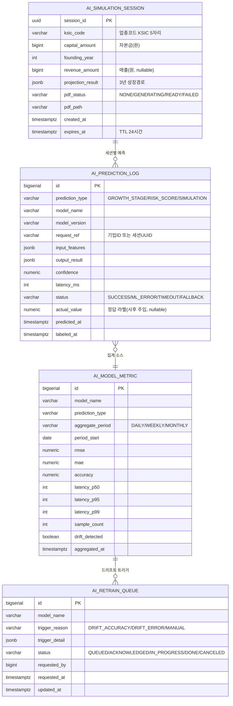
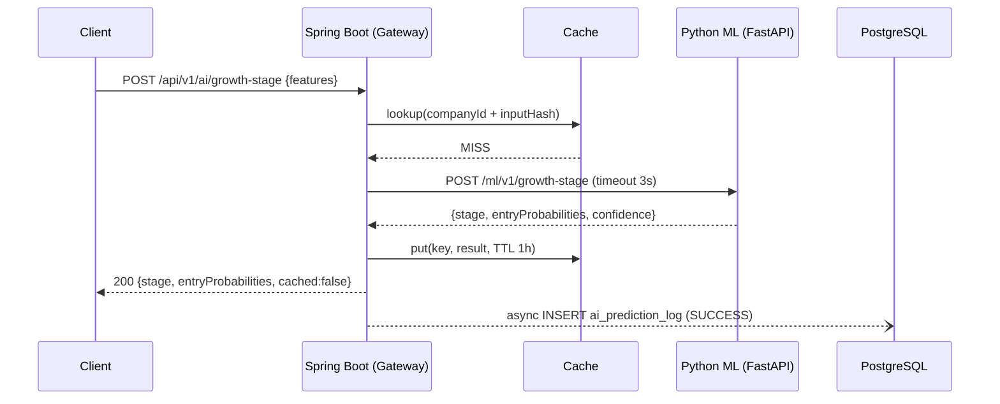
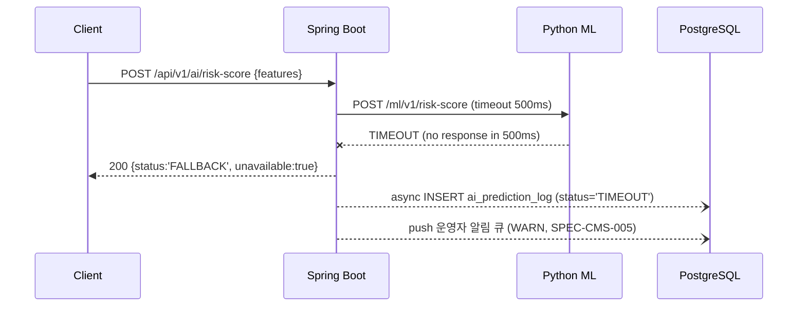
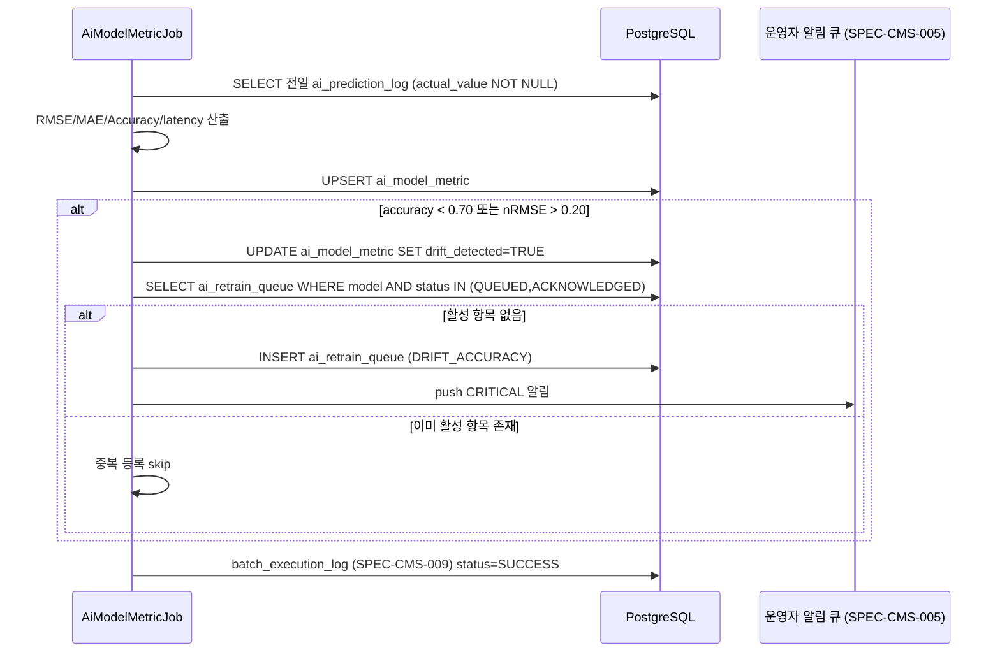

# SPEC-CMS-AI-001: AI/ML 기능 (성장단계 예측·가상 시뮬레이션·경영위험 예측·알고리즘 품질 모니터링) v0.1

## 1. 개요

| 항목 | 내용 |
|------|------|
| SPEC ID | SPEC-CMS-AI-001 |
| 제목 | AI/ML 기능 — 성장단계 예측·가상 시뮬레이션·경영위험 예측·알고리즘 품질 모니터링 |
| 작성일 | 2026-05-18 |
| 작성자 | manager-spec (MoAI) |
| 상태 | Completed |
| 우선순위 | P1 (옵션 트랙) |
| 분류 | Detail SPEC (parent: SPEC-CMS-001) |
| 의존 SPEC | SPEC-CMS-009 (데이터 거버넌스 — 데이터 파이프라인, batch_execution_log, data_quality_rule) |
| 형제 SPEC | SPEC-CMS-AI-002 (정책 매칭 AI, 미작성), SPEC-CMS-AI-003 (RAG 질의응답, 미작성) |
| 추적 prefix | REQ-AI-* (SFR-002/004), REQ-SIM-* (SFR-003), REQ-MON-* (SFR-012) |

본 SPEC은 SPEC-CMS-001(Umbrella) §15.2 SFR-002/003/004/012, §16 옵션 트랙 정의에 대한 상세 명세이다. SPEC-CMS-001 §16.4 의존 관계에 명시된 대로 **SPEC-CMS-009(데이터 파이프라인)에 의존**하며, SPEC-CMS-009가 구축한 `batch_execution_log`·`data_quality_rule`·통계 집계 파이프라인을 ML 학습 데이터 소스 및 품질 모니터링 인프라의 입력으로 사용한다.

본 SPEC은 **옵션 트랙 P1**으로, 별도 사용자 승인 시점에 착수한다 (SPEC-CMS-001 §16.3). 핵심 설계 원칙은 ① Spring Boot(Java 17)는 **API Gateway + 비즈니스 로직**, Python ML 서비스는 **추론 전용 마이크로서비스**로 책임을 분리하며 ② 두 서비스 간 계약을 OpenAPI로 명시적으로 정의하고 ③ ML 응답을 모킹(mock)할 수 있는 인터페이스를 제공하여 ML 모델 부재 시에도 Spring Boot 레이어를 독립적으로 검증할 수 있도록 한다.

---

## 2. 참조 문서

- **상위 SPEC**: SPEC-CMS-001 §15.2 SFR-002/003/004/012, §16.1 확장 SPEC 트리 (옵션 트랙), §16.4 의존 관계, §17.1 PER 임계값, §17.4 품질 게이트(QUR-004)
- **선행 SPEC**: SPEC-CMS-009 §4 `batch_execution_log`/`data_quality_rule` DDL, §7 배치 공통 패턴 (Spring Scheduling + Retry + 실행 이력), §5.4 데이터 품질 모니터링
- **참조 SPEC**:
  - SPEC-CMS-002 (인증/권한 — 관리자 API ROLE=ADMIN 정책, 비회원 공개 API 정책)
  - SPEC-CMS-005 (시스템·배치·감사로그 인프라 — audit_log AOP, 운영자 알림 큐, Custom Actuator)
  - SPEC-CMS-008 (시각화 대시보드 — 모니터링 차트 컴포넌트 재사용)
- **프로젝트 문서**: `.moai/project/tech.md` §6 컨테이너, §8 관측성, `.moai/project/structure.md`
- **외부 기술 참조**: XGBoost / scikit-learn RandomForest (CPU 추론 모델), FastAPI (Python ML 서비스), joblib (모델 직렬화), OpenAPI 3.1 (서비스 간 계약), iText 또는 Jasper Reports (서버사이드 PDF)

---

## 3. 범위 및 비범위

### 3.1 1차 포함 범위 (P1, 옵션 트랙)

- **성장단계 예측 (SFR-002)**: Spring Boot API 레이어 + Python ML 추론 프록시 + 결과 캐싱. 준비-성장-침체-성숙-쇠퇴 5단계 재분류 + 단계별 진입 확률(0.0~1.0) 배열
- **가상 시뮬레이션 (SFR-003)**: 비회원 대상 향후 3년 성장경로 예측 + 결과 임시 저장(UUID, TTL 24시간) + 서버사이드 PDF 리포트
- **경영위험 예측 (SFR-004)**: 부실 리스크 스코어링(0.0~1.0) + 4단계 위험 등급(GREEN/YELLOW/ORANGE/RED) + 상위 3개 위험 요인 프록시
- **알고리즘 품질 모니터링 (SFR-012)**: ML 예측 결과 비동기 로그 적재 + 지표 집계(RMSE/MAE/Accuracy/응답시간 p50·p95·p99) + 드리프트 감지 알림 + 재학습 큐
- **PostgreSQL AI 테이블 4종**: `ai_prediction_log`, `ai_simulation_session`, `ai_model_metric`, `ai_retrain_queue`
- **Python ML 서비스 인터페이스 정의**: OpenAPI 3.1 계약 (요청/응답 스키마, 에러 코드) — 계약 정의 및 Spring Boot 측 클라이언트 + 모킹 어댑터까지 포함
- **관리자 모니터링 UI**: Vue 3 모니터링 대시보드 (일/주/월 집계 시각화)

### 3.2 1차 비범위 (후속 SPEC 또는 운영 절차)

| 비범위 항목 | 사유 |
|------------|------|
| Python ML 모델 훈련 코드 및 데이터 파이프라인 | 별도 ML ops 범위. 본 SPEC은 추론 인터페이스 계약과 Spring Boot 게이트웨이만 정의 |
| Milvus 클러스터 구성 | 인프라 SPEC 별도. 1차는 PostgreSQL `pgvector`로 대체, 운영 규모(1만+ 기업) 달성 시 마이그레이션 (§9.5 명시) |
| RAG 질의응답 | SPEC-CMS-AI-003으로 분리 예정 |
| 정책 매칭 AI | SPEC-CMS-AI-002로 분리 예정 (SFR-007은 SPEC-CMS-007 규칙 기반과 별개 AI 트랙) |
| 실시간 스트리밍 학습 | 학습은 오프라인 배치, 추론만 온라인. 온라인 학습은 후속 |
| 딥러닝(GPU) 모델 | CPU 경량 모델(XGBoost/RandomForest)로 1차 충족. GPU 트랙은 운영 규모 확대 시 후속 |
| Python ML 서비스의 실제 모델 구현·정확도 검증 | 본 SPEC 수용 기준은 모킹된 ML 응답으로 검증. 실제 모델 정확도는 ML ops 인수 절차 |
| ai_prediction_log 콜드 스토리지 자동 이관 | SPEC-CMS-009 retention_policy 재사용으로 1차 처리. 자동화 후속 |

---

## 4. 데이터 모델

### 4.1 ERD (Mermaid)



### 4.2 PostgreSQL DDL

#### 4.2.1 `ai_prediction_log`

```sql
CREATE TABLE ai_prediction_log (
    id              BIGSERIAL    PRIMARY KEY,
    prediction_type VARCHAR(20)  NOT NULL,          -- GROWTH_STAGE / RISK_SCORE / SIMULATION
    model_name      VARCHAR(80)  NOT NULL,
    model_version   VARCHAR(40)  NOT NULL,
    request_ref     VARCHAR(80)  NULL,              -- 기업ID 또는 시뮬레이션 세션 UUID
    input_features  JSONB        NOT NULL,          -- 추론 입력 (PII 제외, 재무 지표만)
    output_result   JSONB        NULL,              -- 추론 결과 (단계 라벨/확률 배열/위험요인)
    confidence      NUMERIC(5,4) NULL,              -- 0.0000 ~ 1.0000
    latency_ms      INTEGER      NOT NULL,          -- ML 호출 round-trip ms
    status          VARCHAR(20)  NOT NULL,          -- SUCCESS / ML_ERROR / TIMEOUT / FALLBACK
    actual_value    JSONB        NULL,              -- 사후 정답 라벨(드리프트 측정용)
    predicted_at    TIMESTAMPTZ  NOT NULL DEFAULT CURRENT_TIMESTAMP,
    labeled_at      TIMESTAMPTZ  NULL,
    CONSTRAINT chk_apl_type   CHECK (prediction_type IN ('GROWTH_STAGE','RISK_SCORE','SIMULATION')),
    CONSTRAINT chk_apl_status CHECK (status IN ('SUCCESS','ML_ERROR','TIMEOUT','FALLBACK')),
    CONSTRAINT chk_apl_conf   CHECK (confidence IS NULL OR (confidence >= 0 AND confidence <= 1))
);
CREATE INDEX idx_apl_type_time   ON ai_prediction_log(prediction_type, predicted_at DESC);
CREATE INDEX idx_apl_model_time  ON ai_prediction_log(model_name, model_version, predicted_at DESC);
CREATE INDEX idx_apl_status      ON ai_prediction_log(predicted_at DESC) WHERE status <> 'SUCCESS';
CREATE INDEX idx_apl_unlabeled   ON ai_prediction_log(prediction_type) WHERE actual_value IS NULL;
```

#### 4.2.2 `ai_simulation_session`

```sql
CREATE TABLE ai_simulation_session (
    session_id        UUID         PRIMARY KEY DEFAULT gen_random_uuid(),
    ksic_code         VARCHAR(5)   NOT NULL,          -- KSIC 5자리 업종코드
    capital_amount    BIGINT       NOT NULL,          -- 자본금(원)
    founding_year     INTEGER      NOT NULL,
    revenue_amount    BIGINT       NULL,              -- 매출(원, optional)
    projection_result JSONB        NULL,              -- [{year, stage, entryProbabilities[]}, x3]
    pdf_status        VARCHAR(20)  NOT NULL DEFAULT 'NONE',
    pdf_path          VARCHAR(255) NULL,
    client_ip_hash    VARCHAR(64)  NULL,              -- 비회원 남용 방지용 IP 해시 (평문 미저장)
    created_at        TIMESTAMPTZ  NOT NULL DEFAULT CURRENT_TIMESTAMP,
    expires_at        TIMESTAMPTZ  NOT NULL,          -- created_at + 24h
    CONSTRAINT chk_ass_ksic   CHECK (ksic_code ~ '^[0-9]{5}$'),
    CONSTRAINT chk_ass_year   CHECK (founding_year BETWEEN 1900 AND 2100),
    CONSTRAINT chk_ass_pdf    CHECK (pdf_status IN ('NONE','GENERATING','READY','FAILED'))
);
CREATE INDEX idx_ass_expires ON ai_simulation_session(expires_at);
-- TTL 만료 세션 정리: SPEC-CMS-009 retention_policy 재사용
--   (target_table='ai_simulation_session', policy_type='DELETE', schedule_cron='0 0 * * * *', expires_at < now() 조건)
```

#### 4.2.3 `ai_model_metric`

```sql
CREATE TABLE ai_model_metric (
    id               BIGSERIAL    PRIMARY KEY,
    model_name       VARCHAR(80)  NOT NULL,
    prediction_type  VARCHAR(20)  NOT NULL,
    aggregate_period VARCHAR(10)  NOT NULL,          -- DAILY / WEEKLY / MONTHLY
    period_start     DATE         NOT NULL,
    rmse             NUMERIC(10,4) NULL,
    mae              NUMERIC(10,4) NULL,
    accuracy         NUMERIC(5,4)  NULL,             -- 0.0000 ~ 1.0000
    latency_p50      INTEGER      NULL,
    latency_p95      INTEGER      NULL,
    latency_p99      INTEGER      NULL,
    sample_count     INTEGER      NOT NULL DEFAULT 0,
    drift_detected   BOOLEAN      NOT NULL DEFAULT FALSE,
    aggregated_at    TIMESTAMPTZ  NOT NULL DEFAULT CURRENT_TIMESTAMP,
    CONSTRAINT uk_amm_unique UNIQUE (model_name, prediction_type, aggregate_period, period_start),
    CONSTRAINT chk_amm_period CHECK (aggregate_period IN ('DAILY','WEEKLY','MONTHLY')),
    CONSTRAINT chk_amm_acc    CHECK (accuracy IS NULL OR (accuracy >= 0 AND accuracy <= 1))
);
CREATE INDEX idx_amm_model_period ON ai_model_metric(model_name, aggregate_period, period_start DESC);
CREATE INDEX idx_amm_drift        ON ai_model_metric(period_start DESC) WHERE drift_detected = TRUE;
```

#### 4.2.4 `ai_retrain_queue`

```sql
CREATE TABLE ai_retrain_queue (
    id             BIGSERIAL    PRIMARY KEY,
    model_name     VARCHAR(80)  NOT NULL,
    trigger_reason VARCHAR(20)  NOT NULL,            -- DRIFT_ACCURACY / DRIFT_ERROR / MANUAL
    trigger_detail JSONB        NULL,                -- {accuracy:0.62, threshold:0.70, period:'2026-05-17'}
    status         VARCHAR(20)  NOT NULL DEFAULT 'QUEUED',
    requested_by   BIGINT       NULL,                -- MANUAL일 때 운영자 user id
    requested_at   TIMESTAMPTZ  NOT NULL DEFAULT CURRENT_TIMESTAMP,
    updated_at     TIMESTAMPTZ  NOT NULL DEFAULT CURRENT_TIMESTAMP,
    CONSTRAINT chk_arq_reason CHECK (trigger_reason IN ('DRIFT_ACCURACY','DRIFT_ERROR','MANUAL')),
    CONSTRAINT chk_arq_status CHECK (status IN ('QUEUED','ACKNOWLEDGED','IN_PROGRESS','DONE','CANCELED'))
);
CREATE INDEX idx_arq_status     ON ai_retrain_queue(status, requested_at);
CREATE INDEX idx_arq_model_time ON ai_retrain_queue(model_name, requested_at DESC);
-- 동일 model_name + reason의 QUEUED/ACKNOWLEDGED 중복 방지는 application 레이어에서 검증 (드리프트 알림 폭주 차단)
```

---

## 5. 요구사항 (EARS 상세)

### 5.1 성장단계 예측 (REQ-AI-001 ~ 004, SFR-002 매핑)

- **REQ-AI-001 (성장단계 5단계 예측 — Event-driven)**
  기업 재무 데이터(매출, 자본금, 영업이익, 부채비율 등)가 주어지면, 시스템은 `POST /api/v1/ai/growth-stage`로 Python ML 서비스를 호출하여 성장단계 라벨(`PREPARATION`/`GROWTH`/`STAGNATION`/`MATURITY`/`DECLINE` 5단계)과 각 단계의 진입 확률 배열(합계 1.0±0.01, 각 0.0~1.0)을 **3초 이내**에 반환해야 한다.
- **REQ-AI-002 (결과 캐싱 — State-driven)**
  동일 기업ID + 동일 입력 해시에 대한 성장단계 예측 요청이 캐시 TTL(기본 1시간) 내에 재요청되면, 시스템은 Python ML 서비스를 재호출하지 않고 캐시된 결과를 반환해야 하며, 응답에 `cached=true`를 포함해야 한다.
- **REQ-AI-003 (예측 로그 비동기 적재 — Event-driven, SFR-012 연계)**
  성장단계 예측이 완료(SUCCESS/ML_ERROR/TIMEOUT/FALLBACK)되었을 때, 시스템은 `ai_prediction_log`(prediction_type='GROWTH_STAGE', input_features, output_result, confidence, latency_ms, status)에 **비동기로** 행을 적재해야 하며, 로그 적재 실패가 예측 응답을 차단하지 않아야 한다.
- **REQ-AI-004 (ML 서비스 장애 폴백 — Unwanted behavior)**
  Python ML 서비스가 3초 타임아웃 또는 5xx 응답을 반환하면, 시스템은 503이 아닌 200 OK + `status='FALLBACK'` + 규칙 기반 단순 분류 결과(매출 구간 기반 휴리스틱) 또는 명시적 `unavailable=true` 플래그를 반환해야 하며, 해당 이벤트를 `ai_prediction_log.status='TIMEOUT'|'ML_ERROR'`로 기록해야 한다.

### 5.2 창업기업 가상 시뮬레이션 (REQ-SIM-001 ~ 005, SFR-003 매핑)

- **REQ-SIM-001 (비회원 시뮬레이션 요청 — Event-driven)**
  업종코드(KSIC 5자리), 자본금(원), 설립년도, 매출(원, optional)이 주어지면, 시스템은 **인증 없이** `POST /api/v1/ai/simulation`을 처리하여 `ai_simulation_session`에 UUID 세션을 생성하고, Python ML 서비스로 향후 3년 성장경로(연도별 성장단계 + 단계별 진입 확률)를 예측하여 `projection_result`에 저장 후 session_id와 함께 반환해야 한다.
- **REQ-SIM-002 (입력 검증 — Unwanted behavior)**
  ksic_code가 정규식 `^[0-9]{5}$`에 맞지 않거나, capital_amount ≤ 0이거나, founding_year가 1900~2100 범위를 벗어나면, 시스템은 400 Bad Request + 에러 코드 `AI_SIMULATION_INVALID_INPUT`을 반환하고 세션을 생성하지 않아야 한다.
- **REQ-SIM-003 (세션 TTL 24시간 — State-driven)**
  `ai_simulation_session.expires_at`은 created_at + 24시간으로 설정되어야 하며, `GET /api/v1/ai/simulation/{sessionId}` 요청 시 expires_at이 경과한 세션은 404 Not Found + 에러 코드 `AI_SIMULATION_EXPIRED`를 반환해야 한다. 만료 세션 물리 삭제는 SPEC-CMS-009 retention_policy(매시간 cron)로 처리한다.
- **REQ-SIM-004 (서버사이드 PDF 리포트 — Event-driven)**
  `POST /api/v1/ai/simulation/{sessionId}/report` 요청 시, 시스템은 서버사이드(iText 또는 Jasper Reports)로 시뮬레이션 결과 PDF를 생성하여 `pdf_status`를 GENERATING→READY로 전이하고, `GET /api/v1/ai/simulation/{sessionId}/report`로 `Content-Type=application/pdf` 다운로드를 제공해야 한다. 세션이 만료되었거나 projection_result가 없으면 PDF를 생성하지 않아야 한다.
- **REQ-SIM-005 (비회원 남용 방지 — Unwanted behavior)**
  동일 client_ip_hash에서 1시간 내 시뮬레이션 생성 요청이 임계값(기본 30회)을 초과하면, 시스템은 429 Too Many Requests + 에러 코드 `AI_SIMULATION_RATE_LIMITED`를 반환해야 한다. IP 평문은 저장하지 않고 해시(SHA-256)만 저장해야 한다.

### 5.3 경영위험 예측 (REQ-AI-005 ~ 007, SFR-004 매핑)

- **REQ-AI-005 (경영위험 스코어링 — Event-driven)**
  기업 재무 데이터가 주어지면, 시스템은 `POST /api/v1/ai/risk-score`로 Python ML 서비스를 호출하여 부실 예측 확률(0.0~1.0), 4단계 위험 등급(`GREEN`/`YELLOW`/`ORANGE`/`RED`), 상위 3개 위험 요인(요인명 + 기여도)을 반환해야 한다.
- **REQ-AI-006 (위험 등급 경계값 — Ubiquitous)**
  위험 등급은 부실 예측 확률(p)에 따라 `GREEN`(p < 0.25), `YELLOW`(0.25 ≤ p < 0.50), `ORANGE`(0.50 ≤ p < 0.75), `RED`(p ≥ 0.75)로 결정론적으로 매핑되어야 하며, 경계값은 시스템 설정 키 `ai.risk.thresholds`로 조정 가능해야 한다.
- **REQ-AI-007 (추론 응답 SLA — Ubiquitous, PER-003)**
  경영위험 예측의 Python ML 추론 round-trip(Spring Boot → ML → Spring Boot)은 **500ms 이내**(p95)를 충족해야 하며, 초과 시 `ai_prediction_log.latency_ms`에 기록되고 SPEC-CMS-009 데이터 품질 알림 큐에 WARN으로 push되어야 한다.

### 5.4 알고리즘 품질 모니터링 (REQ-MON-001 ~ 005, SFR-012 매핑)

- **REQ-MON-001 (예측 로그 비동기 적재 — Ubiquitous)**
  모든 ML 예측(성장단계/경영위험/시뮬레이션)은 `ai_prediction_log`에 비동기 적재되어야 하며(REQ-AI-003 일반화), 적재 항목은 (prediction_type, model_name, model_version, input_features, output_result, confidence, latency_ms, status)를 포함해야 한다.
- **REQ-MON-002 (정답 라벨 사후 주입 — Event-driven)**
  운영자 또는 데이터 파이프라인이 `PUT /api/v1/admin/ai/predictions/{id}/label`로 actual_value를 주입하면, 시스템은 `ai_prediction_log.actual_value`와 `labeled_at`을 갱신해야 하며, 이는 RMSE/MAE/Accuracy 산출의 입력이 된다.
- **REQ-MON-003 (지표 집계 배치 — Event-driven, SPEC-CMS-009 배치 패턴 재사용)**
  매일 02:15(cron `0 15 2 * * *`, `AiModelMetricJob`, job_group='STATS')에 시스템은 전일 `ai_prediction_log` 중 actual_value가 존재하는 행을 model_name + prediction_type 차원으로 집계하여 `ai_model_metric`에 RMSE/MAE(회귀형), Accuracy(분류형), latency p50/p95/p99, sample_count를 일/주/월 단위로 UPSERT하고, 실행 결과를 `batch_execution_log`(SPEC-CMS-009)에 기록해야 한다.
- **REQ-MON-004 (드리프트 감지 알림 — Event-driven)**
  `AiModelMetricJob` 집계 결과 accuracy < 0.70 또는 오차율(정규화 RMSE) > 0.20인 model_name이 발견되면, 시스템은 `ai_model_metric.drift_detected=TRUE`로 갱신하고 SPEC-CMS-005 운영자 알림 큐에 push해야 하며, `ai_retrain_queue`에 동일 model_name의 활성 항목(QUEUED/ACKNOWLEDGED)이 없을 때만 trigger_reason='DRIFT_ACCURACY'|'DRIFT_ERROR' 항목을 1건 등록해야 한다(중복 등록 금지).
- **REQ-MON-005 (재학습 큐 등록 API — Ubiquitous)**
  운영자는 `GET|POST /api/v1/admin/ai/retrain`으로 `ai_retrain_queue`(model_name, trigger_reason='MANUAL', requested_by)를 조회·등록할 수 있어야 하고, `PUT /api/v1/admin/ai/retrain/{id}`로 status(ACKNOWLEDGED/IN_PROGRESS/DONE/CANCELED)를 전이할 수 있어야 하며, 모든 API는 ROLE=ADMIN 한정이어야 한다.

---

## 6. REST API 명세

### 6.1 공개 API (인증 불필요)

| 메서드 | 경로 | 설명 | 권한 | REQ |
|--------|------|------|------|-----|
| POST | `/api/v1/ai/simulation` | 비회원 가상 시뮬레이션 생성 | PUBLIC | REQ-SIM-001/002 |
| GET | `/api/v1/ai/simulation/{sessionId}` | 시뮬레이션 결과 조회 (TTL 검사) | PUBLIC | REQ-SIM-003 |
| POST | `/api/v1/ai/simulation/{sessionId}/report` | PDF 리포트 생성 트리거 | PUBLIC | REQ-SIM-004 |
| GET | `/api/v1/ai/simulation/{sessionId}/report` | PDF 리포트 다운로드 | PUBLIC | REQ-SIM-004 |

### 6.2 인증 API (회원/내부 호출)

| 메서드 | 경로 | 설명 | 권한 | REQ |
|--------|------|------|------|-----|
| POST | `/api/v1/ai/growth-stage` | 성장단계 5단계 예측 + 확률 배열 | USER | REQ-AI-001/002/003/004 |
| POST | `/api/v1/ai/risk-score` | 경영위험 스코어 + 등급 + 위험요인 | USER | REQ-AI-005/006/007 |

### 6.3 관리자 모니터링 API (ROLE=ADMIN)

| 메서드 | 경로 | 설명 | 권한 | REQ |
|--------|------|------|------|-----|
| GET | `/api/v1/admin/ai/monitoring` | 모델 품질 지표 조회 (model, period, from/to) | ADMIN | REQ-MON-003 |
| GET | `/api/v1/admin/ai/monitoring/predictions` | 예측 로그 조회 (type, status, 기간 필터) | ADMIN | REQ-MON-001 |
| PUT | `/api/v1/admin/ai/predictions/{id}/label` | 정답 라벨 사후 주입 | ADMIN | REQ-MON-002 |
| GET | `/api/v1/admin/ai/retrain` | 재학습 큐 목록 | ADMIN | REQ-MON-005 |
| POST | `/api/v1/admin/ai/retrain` | 재학습 수동 등록 (MANUAL) | ADMIN | REQ-MON-005 |
| PUT | `/api/v1/admin/ai/retrain/{id}` | 재학습 큐 상태 전이 | ADMIN | REQ-MON-005 |

페이징·정렬·에러 코드 규약은 SPEC-CMS-001 §8 일관 규약을 따른다. 권한 정책은 SPEC-CMS-002를 재사용한다 (PUBLIC = 인증 필터 제외 화이트리스트, ADMIN = `@PreAuthorize("hasRole('ADMIN')")`).

### 6.4 Spring Boot ↔ Python ML 서비스 인터페이스 계약 (OpenAPI 3.1)

Spring Boot는 내부 망에서 HTTP REST로 Python ML(FastAPI) 서비스를 호출한다. 계약은 OpenAPI 3.1 문서(`docs/ai-ml-service-openapi.yaml`)로 관리하며 핵심 엔드포인트는 다음과 같다.

| ML 엔드포인트 | 요청 | 응답 | 타임아웃 |
|---|---|---|---|
| `POST /ml/v1/growth-stage` | `{features: {revenue, capital, operatingProfit, debtRatio, ...}}` | `{stage: "GROWTH", entryProbabilities: {PREPARATION:0.05, GROWTH:0.62, ...}, confidence: 0.81, modelVersion: "gs-1.2.0"}` | 3000ms |
| `POST /ml/v1/risk-score` | `{features: {...}}` | `{defaultProbability: 0.43, riskGrade: "YELLOW", topFactors: [{name, contribution}, x3], modelVersion: "rs-0.9.1"}` | 500ms |
| `POST /ml/v1/simulation` | `{ksicCode, capitalAmount, foundingYear, revenueAmount?}` | `{projection: [{year, stage, entryProbabilities{}}, x3], modelVersion: "sim-1.0.0"}` | 3000ms |
| `GET /ml/v1/health` | — | `{status: "UP", loadedModels: [...]}` | 1000ms |

계약 규칙:
- 모든 ML 요청은 입력에서 **PII를 제외한 재무 지표·업종·연도만** 전달 (개인정보 비전송)
- ML 응답 스키마는 OpenAPI `components/schemas`로 고정. Spring Boot 측은 계약 기반 DTO + `MlServiceClient` 인터페이스 + `MockMlServiceClient` 구현(테스트/ML 부재 환경용)을 제공
- ML 서비스 모델 파일은 joblib `.pkl` 직렬화, 컨테이너 볼륨 마운트(`/models`) 또는 DB blob에서 로드 (운영 결정 사항, 본 SPEC은 추론 인터페이스만 정의)
- 학습은 오프라인(배치), 본 SPEC 범위의 ML 서비스는 추론 전용

---

## 7. 비동기·배치 명세

### 7.1 비동기 로그 적재

- `AiPredictionLogService.logAsync(...)`는 Spring `@Async` 전용 스레드풀(`ai-log-`, core=2, max=4, queue=500)에서 실행
- 적재 실패는 예측 응답을 차단하지 않으며, 실패 시 ERROR 로그 + `ai-log-fallback` 파일 큐로 폴백 (재처리는 운영 절차)

### 7.2 배치 일람 (SPEC-CMS-009 배치 공통 패턴 재사용)

| 배치 빈 이름 | cron | job_group | 대상 | 설명 | REQ |
|---|---|---|---|---|---|
| `AiModelMetricJob` | `0 15 2 * * *` | STATS | ai_model_metric | 전일 예측 로그 → 일/주/월 지표 집계 + 드리프트 판정 | REQ-MON-003/004 |
| `AiSimulationCleanupJob` | (retention_policy) | RETENTION | ai_simulation_session | TTL 24h 만료 세션 + PDF 파일 정리 | REQ-SIM-003 |

`AiSimulationCleanupJob`은 신규 배치를 도입하지 않고 SPEC-CMS-009 `retention_policy` 시드(`target_table='ai_simulation_session'`, `policy_type='DELETE'`, `schedule_cron='0 0 * * * *'`, 조건 `expires_at < now()`)로 처리한다. 모든 배치 실행 이력은 SPEC-CMS-009 `batch_execution_log`에 기록되며 재시도·SLA 정책은 SPEC-CMS-009 §7.2를 그대로 따른다.

---

## 8. 시퀀스 다이어그램

### 8.1 성장단계 예측 (캐시 미스 + ML 정상)



### 8.2 ML 서비스 타임아웃 폴백



### 8.3 드리프트 감지 → 재학습 큐 등록



---

## 9. 비기능 요구사항

### 9.1 성능 (PER-003 매핑)

- 성장단계 예측 API p95 < **3초** (REQ-AI-001), 시뮬레이션 생성 API p95 < **3초** (REQ-SIM-001)
- 경영위험 ML 추론 round-trip p95 < **500ms** (REQ-AI-007)
- `AiModelMetricJob` 일별 배치 < 10분 (SPEC-CMS-001 §17.1, SPEC-CMS-009 §9.1과 동일 SLA)
- 캐시 적중 시 성장단계 응답 < 100ms (REQ-AI-002)

### 9.2 가용성 (SER-003)

- Python ML 서비스 장애 시 graceful degradation: 503 미반환, FALLBACK 응답으로 99.5% 가용성 유지 (REQ-AI-004)
- 비동기 로그 적재 실패가 예측 응답을 차단하지 않음 (REQ-MON-001)
- `MlServiceClient` 회로 차단기(circuit breaker): 연속 실패 임계 초과 시 일정 시간 ML 호출 차단 + FALLBACK 직행

### 9.3 보안

- 공개 API(`/api/v1/ai/simulation/**`)는 SPEC-CMS-002 인증 필터 화이트리스트에 등록, 그 외 ai API는 인증 필요
- 비회원 시뮬레이션 IP는 SHA-256 해시만 저장, 평문 미저장 (REQ-SIM-005)
- ML 서비스 입력에서 PII(대표자명·주민/법인 식별정보) 제외, 재무 지표·업종·연도만 전송 (§6.4)
- 관리자 모니터링 API는 ROLE=ADMIN 한정 + SPEC-CMS-005 audit_log AOP 자동 적재
- Python ML 서비스는 내부 망에서만 접근(외부 비노출), Spring Boot → ML 호출은 사설 네트워크/서비스 메시 한정

### 9.4 데이터 분류 (SPEC-CMS-001 §17.3 / SPEC-CMS-009 §9.5 표준)

| 테이블 | 데이터 도메인 | 보존 정책 |
|---|---|---|
| ai_prediction_log | LOG | 1년 (SPEC-CMS-009 retention_policy 준용) |
| ai_simulation_session | TRANSACTION | TTL 24시간 (즉시 폐기) |
| ai_model_metric | STATISTICS | 영구 (집계 데이터) |
| ai_retrain_queue | LOG | 영구 (운영 증적) |

본 SPEC 신규 4개 테이블은 SPEC-CMS-009 `data_dictionary`에 자기 등록(self-registration)한다.

### 9.5 확장성 (벡터 DB 결정)

- 유사 기업 검색용 임베딩 저장은 1차에 PostgreSQL `pgvector` 확장으로 구현 (별도 인프라 불필요)
- 운영 규모(기업 1만+ 또는 벡터 검색 p95 > 1초) 도달 시 Milvus 마이그레이션 (인프라 SPEC 별도, 본 SPEC 비범위)
- 본 SPEC 1차 수용 기준은 벡터 검색을 필수 포함하지 않으며, 임베딩 컬럼은 후속 확장 지점으로만 명시

---

## 10. 구현 순서

### Step 1: 데이터 모델 + ML 인터페이스 계약 (Backend 1차)

**목표**: 4개 신규 테이블 마이그레이션 + OpenAPI 계약 + MlServiceClient 추상화 + Mock 구현.

- **1-1 마이그레이션**: Flyway 마이그레이션 작성 (ai_prediction_log, ai_simulation_session, ai_model_metric, ai_retrain_queue) + SPEC-CMS-009 retention_policy 시드 1건(ai_simulation_session) + data_dictionary 자기 등록
- **1-2 OpenAPI 계약**: `docs/ai-ml-service-openapi.yaml` 작성 (growth-stage / risk-score / simulation / health 스키마 고정)
- **1-3 ML 클라이언트 추상화**: `MlServiceClient` 인터페이스 + `HttpMlServiceClient`(WebClient/RestClient, 타임아웃·회로차단기) + `MockMlServiceClient`(결정론적 응답) + 도메인 DTO
- **1-4 도메인 모델**: `AiPredictionLog`, `AiSimulationSession`, `AiModelMetric`, `AiRetrainQueue` 엔티티 + MyBatis Mapper

### Step 2: API 레이어 + 비동기 로그 + 모니터링 배치 (Backend 2차)

**목표**: 16개 REST 엔드포인트 + 비동기 로그 + AiModelMetricJob + PDF.

- **2-1 컨트롤러**: `AiGrowthStageController`, `AiRiskScoreController`, `AiSimulationController`(공개), `AiMonitoringController`, `AiRetrainController`(ADMIN)
- **2-2 비동기 로그**: `AiPredictionLogService.logAsync` + 전용 스레드풀 + 폴백 파일 큐
- **2-3 캐싱·폴백**: 성장단계 결과 캐시(Caffeine, TTL 1h) + FALLBACK 휴리스틱 + 회로차단기
- **2-4 모니터링 배치**: `AiModelMetricJob` (SPEC-CMS-009 배치 공통 패턴 + batch_execution_log 연동) + 드리프트 판정 + ai_retrain_queue 중복 방지
- **2-5 PDF 리포트**: iText 또는 Jasper Reports 기반 시뮬레이션 PDF 생성 (GENERATING→READY 상태 전이)
- **2-6 통합 테스트**: Testcontainers PostgreSQL 16 + JUnit 5 + `MockMlServiceClient`로 acceptance.md 시나리오 검증 (실제 ML 모델 불요)

### Step 3: 관리자 모니터링 UI (Frontend)

**목표**: Vue 3 모니터링 대시보드.

- **3-1 모니터링 대시보드**: 일/주/월 집계 RMSE/MAE/Accuracy/latency 시계열 차트 (SPEC-CMS-008 차트 컴포넌트 재사용) — `AiMonitoringView.vue`
- **3-2 예측 로그 뷰**: type/status/기간 필터 + 정답 라벨 주입 모달 — `AiPredictionLogView.vue`
- **3-3 재학습 큐 뷰**: 큐 목록 + 수동 등록 + 상태 전이 + 드리프트 사유 표시 — `AiRetrainQueueView.vue`

### Step 의존성

- Step 2는 Step 1 완료 의존 (마이그레이션 + MlServiceClient 추상화 선행 필수)
- Step 3은 Step 2 완료 의존 (REST API 선행 필수)
- 우선순위: Step 1 P1-High → Step 2 P1-High → Step 3 P1-Medium

---

## 11. 위험 및 대응

| ID | 위험·가정 | 영향 | 완화 방안 |
|----|----------|------|----------|
| RISK-AI-01 | Python ML 서비스 미구현/지연으로 본 SPEC RUN 차단 | 옵션 트랙 착수 불가 | `MockMlServiceClient`로 Spring Boot 레이어 독립 검증. 수용 기준은 모킹 응답 기반 (실제 모델은 ML ops 인수 분리) |
| RISK-AI-02 | ML 서비스 타임아웃 빈발로 사용자 경험 저하 | 예측 신뢰성 저하 | 회로차단기 + FALLBACK 휴리스틱 + ai_prediction_log.status 추적 + 드리프트와 별개 가용성 알림 |
| RISK-AI-03 | OpenAPI 계약과 실제 ML 응답 스키마 불일치 | 런타임 역직렬화 실패 | 계약을 단일 소스로 관리(`docs/ai-ml-service-openapi.yaml`) + 계약 기반 DTO 검증 테스트 + ML 측 contract test 권고 |
| RISK-AI-04 | 비회원 시뮬레이션 남용(자원 고갈, 비용) | 서비스 가용성 | IP 해시 기반 rate limit(REQ-SIM-005) + 세션 TTL 24h + PDF 비동기 생성 + 입력 검증 |
| RISK-AI-05 | ai_prediction_log 무한 증가 | 조회·집계 성능 저하 | 인덱스 설계 + SPEC-CMS-009 retention_policy 1년 보존 준용 + 부분 인덱스(미라벨/실패행) |
| RISK-AI-06 | 드리프트 알림 폭주(매일 재학습 큐 중복 등록) | 운영 피로 | 동일 model_name 활성(QUEUED/ACKNOWLEDGED) 중복 등록 차단(REQ-MON-004) + 일 1회 집계 단위 판정 |
| RISK-AI-07 | actual_value 미주입으로 RMSE/Accuracy 산출 불가 | 모니터링 무의미 | sample_count 노출 + 라벨 미존재 시 지표 NULL 처리 + 데이터 파이프라인 라벨 주입 절차(REQ-MON-002) |
| RISK-AI-08 | PII가 ML 입력으로 유출 | 개인정보 침해 | ML 요청 DTO에 재무·업종·연도만 포함, 매핑 레이어에서 PII 필드 화이트리스트 강제 + 코드리뷰 게이트 |
| ASSUM-AI-01 | SPEC-CMS-009 batch_execution_log/retention_policy/data_quality 인프라가 본 SPEC RUN 시점에 존재 | 의존 위험 | SPEC-CMS-009 의존은 강제 (SPEC-CMS-001 §16.4). 미구현 시 본 SPEC 착수 보류 |
| ASSUM-AI-02 | 1차 단일 백엔드 노드, ML 서비스 단일 인스턴스 | 스케일 한계 | 캐시 로컬(Caffeine) 1차, 멀티노드 전환 시 분산 캐시(Redis)·ShedLock 후속 (SPEC-CMS-009와 동일 결정) |
| ASSUM-AI-03 | 벡터 검색은 1차 비필수, pgvector로 충분 | 확장성 가정 | 운영 규모 도달 시 Milvus 마이그레이션 (인프라 SPEC 별도, §9.5) |

---

## 12. 변경 이력

| 버전 | 일자 | 작성자 | 변경 내용 |
|------|------|--------|----------|
| v0.2 | 2026-05-19 | MoAI orchestrator | Implemented → Tested 전환. 구현 커밋 646c4d7 (AI/ML 기능 구현) + sync 커밋 da9ce45 (CHANGELOG v1.1.0). 단위 테스트 AiControllerTest/AiModelMetricJobTest/AiModelMetricServiceTest/AiPrediction*/AiSimulation*/AiRetrainQueue* GREEN 확인. |
| v0.1 | 2026-05-18 | manager-spec | 초안 작성. SPEC-CMS-001 §15.2 SFR-002/003/004/012, §16 옵션 트랙을 상세화. 4개 축(성장단계 예측 REQ-AI-001~004, 가상 시뮬레이션 REQ-SIM-001~005, 경영위험 예측 REQ-AI-005~007, 알고리즘 품질 모니터링 REQ-MON-001~005) 정의. 4개 신규 테이블 DDL(ai_prediction_log, ai_simulation_session, ai_model_metric, ai_retrain_queue). 16개 REST 엔드포인트. Spring Boot(Gateway) ↔ Python ML(FastAPI) OpenAPI 3.1 계약 명시. SPEC-CMS-009 데이터 거버넌스(batch_execution_log/retention_policy/배치 공통 패턴)를 입력으로 사용하며 재정의하지 않음. 1차 비범위에 ML 모델 훈련 코드, Milvus 클러스터, RAG(SPEC-CMS-AI-003), 정책 매칭 AI(SPEC-CMS-AI-002), 실시간 스트리밍 학습, 딥러닝(GPU) 명시. 수용 기준은 MockMlServiceClient 기반으로 ML 모델 부재 시에도 검증 가능하도록 설계. |

---

## 구현 메모 (Implementation Notes)

- 구현 완료: 2026-05-18 (커밋 646c4d7)
- Sync 완료: 2026-05-18 (커밋 da9ce45, CHANGELOG v1.1.0)
- Tested 전환: 2026-05-19
- 구현 범위: 성장단계 예측(REQ-AI-001~004), 가상 시뮬레이션(REQ-SIM-001~005), 경영위험 예측(REQ-AI-005~007), 알고리즘 품질 모니터링(REQ-MON-001~005)
- 테스트: AiControllerTest, AiModelMetricJobTest, AiModelMetricServiceTest 등 단위 테스트 GREEN
- 특이사항: MockMlServiceClient 기반 검증, ML 모델 부재 시에도 Spring Boot 레이어 독립 검증 가능
