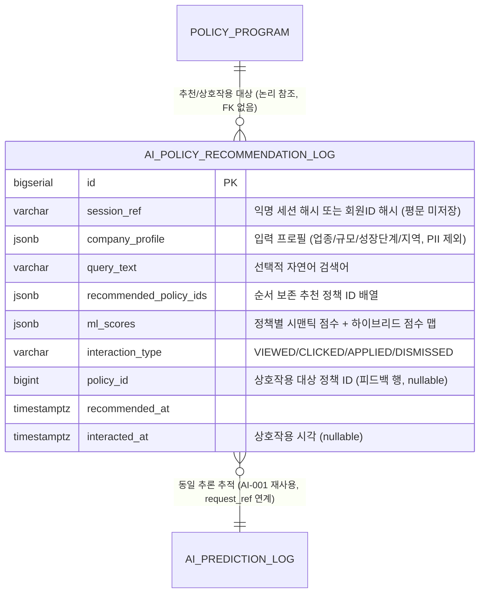

# SPEC-CMS-AI-002: AI 정책 매칭 (시맨틱 추천·개인화 랭킹·하이브리드 검색·피드백 루프) v0.1

## 1. 개요

| 항목 | 내용 |
|------|------|
| SPEC ID | SPEC-CMS-AI-002 |
| 제목 | AI 정책 매칭 — 시맨틱 추천·개인화 랭킹·하이브리드 검색·추천 설명·피드백 루프 |
| 작성일 | 2026-05-18 |
| 작성자 | manager-spec (MoAI) |
| 상태 | Implemented |
| 우선순위 | P1 (옵션 트랙) |
| 분류 | Detail SPEC (parent: SPEC-CMS-001) |
| 의존 SPEC | SPEC-CMS-AI-001 (AI/ML 인프라 — MlServiceClient·AiPredictionLogService·CircuitBreaker·Caffeine·OpenAPI 계약·Vue 모니터링 패턴), SPEC-CMS-007 (규칙 기반 정책 매칭 — PolicyMatchingService 결과 입력) |
| 형제 SPEC | SPEC-CMS-AI-001 (구현 완료), SPEC-CMS-AI-003 (RAG 질의응답, 미작성) |
| 추적 prefix | REQ-PM-* (SFR-007 AI 정책 매칭), AC-PM-NNN (수용 기준) |

본 SPEC은 SPEC-CMS-001(Umbrella) §15.2 SFR-007(AI 정책 매칭), §16 옵션 트랙 정의에 대한 상세 명세이다. SPEC-CMS-001 §15.2는 SFR-007을 **규칙 기반(SPEC-CMS-007)과 별개의 AI 트랙**으로 분리하며, 본 SPEC은 그 AI 트랙을 정의한다.

본 SPEC은 **옵션 트랙 P1**으로, 별도 사용자 승인 시점에 착수한다 (SPEC-CMS-001 §16.3). 핵심 설계 원칙은 SPEC-CMS-AI-001에서 검증된 패턴을 그대로 계승한다: ① Spring Boot(Java 17)는 **API Gateway + 비즈니스 로직 + 하이브리드 머지**, Python ML 서비스는 **시맨틱 추론 전용 마이크로서비스**로 책임을 분리하며 ② 두 서비스 간 계약을 OpenAPI 3.1로 명시적으로 정의하고 ③ ML 응답을 모킹(mock)할 수 있는 `MlServiceClient` 인터페이스를 재사용하여 ML 모델 부재 시에도 Spring Boot 레이어를 독립적으로 검증한다.

본 SPEC의 정체성은 **하이브리드(Hybrid)** 이다. SPEC-CMS-007 `PolicyMatchingService`의 규칙 기반 5차원 점수(industry/region/size/age/revenue + 보너스)는 폐기되지 않으며, AI 시맨틱 점수와 가중 결합되어 최종 추천 랭킹을 산출한다. AI는 규칙 엔진을 대체하는 것이 아니라 **보강(augment)** 한다.

---

## 2. 참조 문서

- **상위 SPEC**: SPEC-CMS-001 §15.2 SFR-007 (AI 정책 매칭), §16.1 확장 SPEC 트리(옵션 트랙), §16.4 의존 관계, §17.1 PER 임계값, §17.3 데이터 분류, §17.4 품질 게이트(QUR-004)
- **선행 SPEC (인프라 재사용)**: SPEC-CMS-AI-001 §4 `ai_prediction_log` DDL·§6.4 Spring↔Python OpenAPI 계약·§7.1 비동기 로그 적재·§9.3 보안 제약·§10 구현 순서·구현 메모(`MlServiceClient`/`MockMlServiceClient`/`AiPredictionLogService`/`IpHashUtil`/`RiskThresholdProperties`/`CacheConfig`/`AsyncConfig` aiLogExecutor/Resilience4j ml-service CircuitBreaker)
- **선행 SPEC (규칙 결과 입력)**: SPEC-CMS-007 §8 정책 매칭 알고리즘 — `PolicyMatchingService.matchForCompany(companyId, topN)` → `PolicyMatchResponse{matchedPolicies[]}` (score 0~100, grade A/B/C/D, breakdownJson)
- **참조 SPEC**:
  - SPEC-CMS-002 (인증/권한 — 비회원 공개 API 화이트리스트, 회원 인증 필터, 관리자 API ROLE=ADMIN)
  - SPEC-CMS-005 (시스템·배치·감사로그 인프라 — audit_log AOP, Custom Actuator)
  - SPEC-CMS-008 (시각화 대시보드 — 모니터링 차트 컴포넌트 재사용)
  - SPEC-CMS-009 (데이터 거버넌스 — retention_policy, data_dictionary 자기 등록, 배치 공통 패턴)
- **프로젝트 문서**: `.moai/project/tech.md` §6 컨테이너, §8 관측성, `.moai/project/structure.md`
- **외부 기술 참조**: 문장 임베딩 모델(예: sentence-transformers 계열, CPU 추론), 코사인 유사도, PostgreSQL `pgvector` 확장(임베딩 후보 검색, AI-001 §9.5 결정 준용), FastAPI(Python ML 서비스), OpenAPI 3.1(서비스 간 계약)

---

## 3. 범위 및 비범위

### 3.1 1차 포함 범위 (P1, 옵션 트랙)

- **시맨틱 정책 검색 (REQ-PM-001~004)**: 기업 프로필(+ 선택적 자연어 질의)을 Python ML 서비스로 전송 → 정책별 시맨틱 유사도 점수(0.0~1.0) + Top-K 추천 목록. Spring Boot는 게이트웨이 + 캐싱 + 하이브리드 머지 담당
- **개인화 랭킹 (REQ-PM-005~006)**: 기업 특성(업종/규모/성장단계/지역)을 ML 입력 피처로 구성하여 동일 정책 풀에 대해 기업별 차등 관련도 랭킹 산출
- **하이브리드 검색 (REQ-PM-007~009)**: SPEC-CMS-007 규칙 기반 점수(0~100 정규화)와 AI 시맨틱 점수(0~1)를 설정 가능한 가중치로 결합 → 최종 랭킹. ML 장애 시 규칙 기반 단독 폴백
- **추천 설명 (REQ-PM-010~011)**: 정책이 추천된 사유(피처 기여도 — 규칙 차원 기여 + 시맨틱 매칭 근거 토큰/문구)를 응답에 포함
- **피드백 루프 (REQ-PM-012~014)**: 사용자 상호작용(노출/클릭/신청/숨김) 추적 → `ai_policy_recommendation_log` 비동기 적재 → 추천 품질 개선 신호 축적
- **추천 품질 모니터링 (REQ-PM-015~017)**: 관리자 지표 — CTR(클릭률), 신청 전환율, 추천 커버리지, 시맨틱 점수 분포. AI-001 모니터링 대시보드 패턴 재사용
- **PostgreSQL AI 테이블 1종**: `ai_policy_recommendation_log` (단일 마이그레이션 V32)
- **Python ML 서비스 인터페이스 정의**: AI-001 OpenAPI 3.1 계약 문서(`docs/ai-ml-service-openapi.yaml`)에 `POST /ml/v1/policy-match` 엔드포인트 추가 — 계약 정의 + Spring Boot 측 클라이언트(`MlServiceClient` 확장) + `MockMlServiceClient` 모킹 어댑터까지 포함
- **프론트엔드**: Vue 3 공개 SPA — AI 점수 기반 랭킹이 적용된 `PolicyMatchView` 강화 / 관리자 — `PolicyMatchMetrics.vue`(CTR·신청 전환율·커버리지)

### 3.2 1차 비범위 (후속 SPEC 또는 운영 절차)

| 비범위 항목 | 사유 |
|------------|------|
| RAG 질의응답(문서 검색 + 생성형 답변) | SPEC-CMS-AI-003 별도 분리 |
| Python ML 임베딩/추천 모델 훈련 코드 및 데이터 파이프라인 | 별도 ML ops 범위. 본 SPEC은 추론 인터페이스 계약과 Spring Boot 게이트웨이/하이브리드 머지만 정의 |
| 실제 ML 모델 정확도·추천 품질 정량 검증 | 본 SPEC 수용 기준은 `MockMlServiceClient` 모킹 응답으로 검증. 실제 모델 품질은 ML ops 인수 절차 |
| SPEC-CMS-007 규칙 기반 매칭 알고리즘 자체의 수정 | `PolicyMatchingService`는 변경 없이 입력으로만 사용. 규칙 점수 산식 변경은 SPEC-CMS-007 범위 |
| 자동 재학습/온라인 학습 트리거 | 피드백 신호는 `ai_policy_recommendation_log`에 적재만 함. 재학습 큐 연동·드리프트 자동화는 AI-001 `ai_retrain_queue` 또는 ML ops 후속 |
| Milvus 등 전용 벡터 DB 클러스터 | AI-001 §9.5 결정 준용 — 1차는 후보 정책 풀이 소규모(수백~수천)이므로 ML 서비스 내 인메모리/`pgvector`로 충분, 운영 규모 도달 시 후속 인프라 SPEC |
| A/B 테스트·추천 실험 플랫폼 | 1차는 단일 하이브리드 가중치 설정. 실험 프레임워크는 후속 |
| 개인화 모델의 사용자별 온라인 파라미터 갱신 | 학습은 오프라인, 추론만 온라인 (AI-001 원칙 계승) |
| ai_policy_recommendation_log 콜드 스토리지 자동 이관 | SPEC-CMS-009 retention_policy 재사용으로 1차 처리. 자동화 후속 |

### 3.3 Exclusions (What NOT to Build)

본 SPEC 구현 시 다음을 **명시적으로 만들지 않는다**:

1. **새 ML 모델 학습/서빙 코드 작성 금지** — `MlServiceClient` 계약 호출과 `MockMlServiceClient`만 작성한다. Python ML 서비스 실제 구현은 본 SPEC 산출물이 아니다.
2. **SPEC-CMS-007 `PolicyMatchingService`/`PolicyMatchingServiceImpl` 수정 금지** — 읽기 전용 의존으로만 호출한다. 규칙 가중치·등급 임계값에 손대지 않는다.
3. **AI-001 인프라 클래스 재작성 금지** — `MlServiceClientImpl`·`AiPredictionLogService`·`IpHashUtil`·`CacheConfig`·`AsyncConfig`·Resilience4j ml-service 설정은 재사용하며 신규 구현하지 않는다 (필요 시 확장만).
4. **신규 인증/세션 메커니즘 구축 금지** — SPEC-CMS-002 인증 필터·화이트리스트를 재사용한다.
5. **별도 벡터 DB 인프라 도입 금지** — 1차 범위에서 Milvus/전용 벡터 스토어를 구성하지 않는다.
6. **다중 마이그레이션 금지** — DB 변경은 V32 단일 마이그레이션으로 한정한다.

---

## 4. 데이터 모델

### 4.1 ERD (Mermaid)



설계 노트:
- `AI_POLICY_RECOMMENDATION_LOG`는 **추천 이벤트 행**(interaction_type=`VIEWED`, recommended_policy_ids/ml_scores 채움, policy_id=NULL)과 **피드백 이벤트 행**(interaction_type∈{CLICKED,APPLIED,DISMISSED}, policy_id 채움)을 동일 테이블에 적재한다. `session_ref`로 두 종류 행을 묶어 CTR/전환율을 산출한다.
- `policy_id`는 `policy_program`을 논리 참조하나 **FK 제약을 두지 않는다**(추천 로그는 정책 삭제 후에도 분석 가치 보존, AI-001 `ai_prediction_log` 패턴과 일관).
- ML 추론별 디버깅 추적이 필요한 경우 AI-001 `ai_prediction_log.request_ref`에 `session_ref`를 동일 값으로 적재하여 교차 추적한다(`prediction_type='POLICY_MATCH'` 신규 분류값, AI-001 §5.4 REQ-MON-001 일반화 — AI-001 체크 제약은 본 SPEC에서 변경하지 않으므로 교차 적재는 선택 사항).

### 4.2 PostgreSQL DDL (마이그레이션 V32, 단일)

```sql
-- V32__create_ai_policy_recommendation_log.sql
CREATE TABLE ai_policy_recommendation_log (
    id                     BIGSERIAL    PRIMARY KEY,
    session_ref            VARCHAR(80)  NOT NULL,            -- 익명 세션 해시 또는 회원ID 해시 (SHA-256, 평문 미저장)
    company_profile        JSONB        NOT NULL,            -- 입력 프로필 (업종코드/규모/성장단계/지역, PII 제외)
    query_text             VARCHAR(500) NULL,                -- 선택적 자연어 검색어
    recommended_policy_ids JSONB        NULL,                -- 순서 보존 추천 정책 ID 배열 [101, 88, 203, ...]
    ml_scores              JSONB        NULL,                -- {"101": {"semantic":0.82,"rule":0.74,"hybrid":0.79}, ...}
    interaction_type       VARCHAR(20)  NOT NULL,            -- VIEWED / CLICKED / APPLIED / DISMISSED
    policy_id              BIGINT       NULL,                -- 상호작용 대상 정책 ID (피드백 행만, 추천 행은 NULL)
    recommended_at         TIMESTAMPTZ  NOT NULL DEFAULT CURRENT_TIMESTAMP,
    interacted_at          TIMESTAMPTZ  NULL,                -- 상호작용 발생 시각 (피드백 행만)
    CONSTRAINT chk_aprl_interaction CHECK (interaction_type IN ('VIEWED','CLICKED','APPLIED','DISMISSED')),
    CONSTRAINT chk_aprl_feedback    CHECK (
        (interaction_type = 'VIEWED'  AND policy_id IS NULL)
     OR (interaction_type <> 'VIEWED' AND policy_id IS NOT NULL)
    ),
    CONSTRAINT chk_aprl_session_len CHECK (char_length(session_ref) BETWEEN 1 AND 80)
);

CREATE INDEX idx_aprl_session       ON ai_policy_recommendation_log(session_ref, recommended_at DESC);
CREATE INDEX idx_aprl_type_time     ON ai_policy_recommendation_log(interaction_type, recommended_at DESC);
CREATE INDEX idx_aprl_policy_time   ON ai_policy_recommendation_log(policy_id, interacted_at DESC)
    WHERE policy_id IS NOT NULL;
CREATE INDEX idx_aprl_metrics_day   ON ai_policy_recommendation_log(recommended_at);

COMMENT ON TABLE  ai_policy_recommendation_log IS 'AI 정책 추천/피드백 로그 (SPEC-CMS-AI-002, PII 제외, LOG 도메인)';
COMMENT ON COLUMN ai_policy_recommendation_log.session_ref     IS '익명 세션 또는 회원ID의 SHA-256 해시 — 평문 식별자 미저장';
COMMENT ON COLUMN ai_policy_recommendation_log.company_profile IS '추천 입력 스냅샷 (ksic_code/employee_count/growth_stage/region_code 등, 대표자명·식별번호 금지)';
```

### 4.3 데이터 분류 (SPEC-CMS-001 §17.3 / SPEC-CMS-009 §9.5 표준)

| 테이블 | 데이터 도메인 | 보존 정책 |
|---|---|---|
| ai_policy_recommendation_log | LOG | 1년 (SPEC-CMS-009 retention_policy 준용, target_table='ai_policy_recommendation_log', policy_type='DELETE', recommended_at < now()-interval '1 year') |

본 SPEC 신규 1개 테이블은 SPEC-CMS-009 `data_dictionary`에 자기 등록(self-registration)한다 (AI-001 §9.4 패턴 준용).

---

## 5. API 명세

### 5.1 공개/인증 API

| 메서드 | 경로 | 설명 | 접근 | 요구사항 |
|---|---|---|---|---|
| POST | `/api/v1/ai/policy-match` | 하이브리드 정책 추천 (프로필 + 선택 질의 → Top-K) | PUBLIC*/USER | REQ-PM-001~011 |
| POST | `/api/v1/ai/policy-match/feedback` | 추천 상호작용 기록 (CLICKED/APPLIED/DISMISSED) | PUBLIC*/USER | REQ-PM-012~014 |

\* 비회원: 요청 본문에 익명 프로필(업종/규모/성장단계/지역) 전달, `session_ref`는 클라이언트 세션 토큰의 SHA-256 해시. 회원: 인증 컨텍스트의 companyId로 DB 프로필 로드, `session_ref`는 회원ID 해시. SPEC-CMS-002 인증 필터 화이트리스트에 `/api/v1/ai/policy-match`, `/api/v1/ai/policy-match/feedback`를 등록(AI-001 §9.3 비회원 시뮬레이션 화이트리스트 패턴 준용).

### 5.2 관리자 모니터링 API (ROLE=ADMIN)

| 메서드 | 경로 | 설명 | 접근 | 요구사항 |
|---|---|---|---|---|
| GET | `/api/v1/admin/ai/policy-match/metrics` | 추천 품질 지표 (CTR·신청 전환율·커버리지·점수 분포, period/from/to 필터) | ADMIN | REQ-PM-015~017 |

### 5.3 Spring Boot ↔ Python ML 서비스 인터페이스 계약 (OpenAPI 3.1)

AI-001 OpenAPI 계약 문서 `docs/ai-ml-service-openapi.yaml`에 다음 엔드포인트를 **추가**한다 (신규 문서 생성 금지, 기존 계약 확장).

| 메서드 | 경로 | 입력 | 출력 |
|---|---|---|---|
| POST | `/ml/v1/policy-match` | `{ company_profile: {ksic_code, employee_count, growth_stage, region_code, annual_revenue?}, query_text?: string, candidate_policy_ids: number[], top_k: number }` | `{ matches: [{ policy_id, semantic_score (0~1), explanation: { matched_terms: string[], rationale: string } }], model_name, model_version }` |

계약 규칙:
- 입력 `candidate_policy_ids`는 Spring Boot가 SPEC-CMS-007 활성 정책 풀에서 추출하여 전달(ML 서비스는 정책 DB에 접근하지 않음 — 책임 분리).
- 입력에 **PII를 포함하지 않는다**(§8 보안 제약). `company_profile`은 업종코드/규모/성장단계/지역코드/매출 한정.
- 응답 누락·타임아웃 시 Spring Boot는 규칙 기반 단독으로 폴백(REQ-PM-009).

---

## 6. 요구사항 (EARS 상세)

### 6.1 시맨틱 정책 검색 (REQ-PM-001~004)

- **REQ-PM-001 (하이브리드 추천 — Event-driven)**
  WHEN 기업 프로필(업종/규모/성장단계/지역) 및 선택적 자연어 질의가 `POST /api/v1/ai/policy-match`로 주어지면, THE SYSTEM SHALL SPEC-CMS-007 `PolicyMatchingService`로 규칙 기반 후보 점수를 산출하고, 후보 정책 ID 풀과 프로필을 `MlServiceClient`를 통해 Python ML 서비스(`POST /ml/v1/policy-match`)로 전송하여 시맨틱 점수를 획득한 뒤, 하이브리드 점수 기준 내림차순 Top-K 추천 목록을 반환해야 한다.

- **REQ-PM-002 (Top-K 경계 — Ubiquitous)**
  THE SYSTEM SHALL Top-K 요청값을 [1, 50] 범위로 클램프하고 미지정 시 기본 10을 적용해야 한다 (SPEC-CMS-007 `clampTopN` 규칙과 일관).

- **REQ-PM-003 (추천 결과 캐싱 — State-driven)**
  WHILE 동일 `session_ref` + 동일 프로필 해시 + 동일 query_text + 동일 top_k 조합의 캐시가 유효(TTL 내)한 동안, THE SYSTEM SHALL Python ML 재호출 없이 캐시된 추천 결과를 반환해야 한다. 캐시 TTL 기본값은 외부화된 설정(AI-001 `RiskThresholdProperties` 패턴의 신규 `PolicyMatchProperties`)으로 관리하며 기본 30분, Caffeine(AI-001 `CacheConfig`) 재사용으로 구현한다.

- **REQ-PM-004 (추천 이벤트 비동기 적재 — Event-driven)**
  WHEN 추천 응답이 사용자에게 반환되면, THE SYSTEM SHALL `ai_policy_recommendation_log`에 추천 이벤트 행(interaction_type=`VIEWED`, session_ref, company_profile, query_text, recommended_policy_ids, ml_scores)을 **비동기로**(AI-001 `aiLogExecutor` 재사용) 적재해야 하며, 적재 실패가 사용자 응답을 지연·실패시키지 않아야 한다.

### 6.2 개인화 랭킹 (REQ-PM-005~006)

- **REQ-PM-005 (프로필 기반 개인화 — Event-driven)**
  WHEN 기업 특성(업종코드/직원수/성장단계/지역코드/매출)이 추천 요청에 포함되면, THE SYSTEM SHALL 해당 특성을 ML 입력 `company_profile` 피처로 정규화하여 전송함으로써, 동일 정책 풀에 대해 기업별로 차등화된 시맨틱 관련도 점수를 획득해야 한다.

- **REQ-PM-006 (회원 프로필 자동 로드 — State-driven)**
  WHILE 요청이 인증된 회원 컨텍스트인 동안, THE SYSTEM SHALL 요청 본문 프로필 대신 SPEC-CMS-007 `CompanyMatchInput`(companyId 기준 DB 프로필)을 우선 사용해야 하며, 추가 PII 노출 없이 업종/규모/성장단계/지역 피처만 ML 입력으로 구성해야 한다.

### 6.3 하이브리드 검색 (REQ-PM-007~009)

- **REQ-PM-007 (점수 정규화 — Ubiquitous)**
  THE SYSTEM SHALL SPEC-CMS-007 규칙 점수(0~100)를 0.0~1.0으로 선형 정규화(rule_norm = ruleScore / 100)하고, ML 시맨틱 점수(0.0~1.0)와 동일 스케일로 정렬해야 한다.

- **REQ-PM-008 (하이브리드 가중 결합 — Ubiquitous)**
  THE SYSTEM SHALL 최종 하이브리드 점수를 `hybrid = wRule * rule_norm + wSemantic * semantic_score`로 산출해야 하며, 가중치 `wRule`/`wSemantic`(합=1.0, 기본 wRule=0.4 / wSemantic=0.6)는 외부 설정(`PolicyMatchProperties`)으로 관리되고 음수가 아니어야 한다.

- **REQ-PM-009 (ML 장애 폴백 — Unwanted behavior)**
  IF Python ML 서비스 호출이 타임아웃·에러·CircuitBreaker OPEN(AI-001 Resilience4j `ml-service` 인스턴스 재사용) 상태이면, THEN THE SYSTEM SHALL 503을 반환하지 않고 SPEC-CMS-007 규칙 기반 점수 단독 랭킹으로 폴백하여 추천을 제공하고, 응답에 `degraded=true` 플래그와 함께 추천 이벤트 로그의 ml_scores에 `{"_fallback":true}`를 적재해야 한다.

### 6.4 추천 설명 (REQ-PM-010~011)

- **REQ-PM-010 (추천 사유 포함 — Event-driven)**
  WHEN 각 추천 정책이 응답에 포함되면, THE SYSTEM SHALL 해당 정책의 추천 사유로 ① 규칙 차원 기여(SPEC-CMS-007 `breakdownJson`의 industry/region/size/age/revenue/보너스 분해)와 ② 시맨틱 매칭 근거(ML 응답 `explanation.matched_terms` + `rationale`)를 결합한 설명 객체를 함께 반환해야 한다.

- **REQ-PM-011 (설명 폴백 — State-driven)**
  WHILE ML 폴백 상태(REQ-PM-009)인 동안, THE SYSTEM SHALL 시맨틱 근거를 생략하고 규칙 차원 기여만으로 추천 사유를 구성해야 하며, 설명 객체에 `semanticAvailable=false`를 표기해야 한다.

### 6.5 피드백 루프 (REQ-PM-012~014)

- **REQ-PM-012 (상호작용 기록 — Event-driven)**
  WHEN 사용자가 `POST /api/v1/ai/policy-match/feedback`로 상호작용(`CLICKED`/`APPLIED`/`DISMISSED`)을 전송하면, THE SYSTEM SHALL `ai_policy_recommendation_log`에 피드백 행(interaction_type, policy_id 필수, session_ref, interacted_at=now)을 비동기 적재해야 한다.

- **REQ-PM-013 (피드백 무결성 — Unwanted behavior)**
  IF 피드백 요청의 interaction_type이 `VIEWED`이거나 policy_id가 누락되면, THEN THE SYSTEM SHALL 400 Bad Request + 에러 코드 `AI_FEEDBACK_INVALID`를 반환하고 어떤 행도 적재하지 않아야 한다 (DB `chk_aprl_feedback` 제약과 일관).

- **REQ-PM-014 (세션 식별자 해시 — Ubiquitous)**
  THE SYSTEM SHALL `session_ref`로 사용되는 비회원 세션 토큰 또는 회원ID를 SHA-256(AI-001 `IpHashUtil` 패턴 재사용·확장)으로 해시하여 저장해야 하며, 평문 식별자를 어떤 컬럼에도 저장하지 않아야 한다.

### 6.6 추천 품질 모니터링 (REQ-PM-015~017)

- **REQ-PM-015 (CTR·전환율 집계 — Event-driven)**
  WHEN 관리자가 `GET /api/v1/admin/ai/policy-match/metrics`를 기간 필터(period=DAILY/WEEKLY/MONTHLY, from/to)와 함께 호출하면, THE SYSTEM SHALL `ai_policy_recommendation_log`에서 CTR(= DISTINCT session_ref 기준 CLICKED 보유 세션 / VIEWED 세션), 신청 전환율(= APPLIED 세션 / VIEWED 세션), 정책별 노출/클릭 분포를 집계하여 반환해야 한다.

- **REQ-PM-016 (추천 커버리지 — Ubiquitous)**
  THE SYSTEM SHALL 추천 커버리지 = (기간 내 recommended_policy_ids에 1회 이상 등장한 고유 정책 수 / SPEC-CMS-007 활성 정책 총수)를 산출하여 모니터링 응답에 포함해야 한다.

- **REQ-PM-017 (관리자 권한·감사 — Unwanted behavior)**
  IF 모니터링 API 호출자가 ROLE=ADMIN이 아니면, THEN THE SYSTEM SHALL 403 Forbidden을 반환해야 하며, 모든 모니터링 API 호출은 SPEC-CMS-005 audit_log AOP로 자동 적재되어야 한다 (AI-001 §9.3 관리자 API 패턴 준용).

---

## 7. 수용 기준 (AC-PM-NNN)

> 모든 수용 기준은 `MockMlServiceClient`(AI-001 `@TestConfiguration` 패턴 재사용·확장) 기반으로 실제 ML 모델 부재 시에도 검증 가능해야 한다. 상세 Given-When-Then은 `acceptance.md` 참조.

| ID | 요구사항 | 수용 기준 (요약) |
|---|---|---|
| AC-PM-001 | REQ-PM-001 | 프로필+질의 추천 요청 시 규칙+시맨틱 결합 Top-K가 hybrid 내림차순으로 반환된다 |
| AC-PM-002 | REQ-PM-002 | top_k=0 → 10, top_k=999 → 50으로 클램프된다 |
| AC-PM-003 | REQ-PM-003 | 동일 입력 2회 호출 시 2번째는 MockMlServiceClient 미호출(캐시 hit)이다 |
| AC-PM-004 | REQ-PM-004 | 추천 응답 후 `ai_policy_recommendation_log`에 VIEWED 행(policy_id=NULL)이 비동기 적재된다 |
| AC-PM-005 | REQ-PM-006 | 인증 회원 요청 시 본문 프로필을 무시하고 DB `CompanyMatchInput`이 ML 입력 피처로 사용된다 |
| AC-PM-006 | REQ-PM-007/008 | rule=80(→0.8), semantic=0.5, 기본 가중치 → hybrid=0.4*0.8+0.6*0.5=0.62로 계산된다 |
| AC-PM-007 | REQ-PM-009 | MockMlServiceClient가 타임아웃을 던지면 503 미반환, 규칙 단독 랭킹 + degraded=true 반환된다 |
| AC-PM-008 | REQ-PM-010 | 추천 응답 각 항목에 규칙 breakdown + 시맨틱 matched_terms 설명이 포함된다 |
| AC-PM-009 | REQ-PM-011 | 폴백 상태 응답의 설명에 semanticAvailable=false가 표기된다 |
| AC-PM-010 | REQ-PM-012 | CLICKED 피드백 전송 시 policy_id 채워진 피드백 행이 적재된다 |
| AC-PM-011 | REQ-PM-013 | interaction_type=VIEWED 또는 policy_id 누락 피드백 → 400 `AI_FEEDBACK_INVALID`, 무적재 |
| AC-PM-012 | REQ-PM-014 | 저장된 session_ref가 SHA-256 길이(64 hex)이며 평문 토큰이 어떤 컬럼에도 없다 |
| AC-PM-013 | REQ-PM-015 | VIEWED 3세션 중 1세션 CLICKED → metrics CTR = 0.333 반환된다 |
| AC-PM-014 | REQ-PM-016 | 활성 정책 10개 중 추천에 4개 등장 → coverage = 0.4 반환된다 |
| AC-PM-015 | REQ-PM-017 | 비ADMIN 모니터링 호출 → 403, ADMIN 호출은 audit_log 적재된다 |
| AC-PM-016 | 마이그레이션 | V32 적용 시 `ai_policy_recommendation_log` + 4개 인덱스 + 2개 CHECK 제약이 생성된다 |

---

## 8. 보안 제약 (AI-001 §9.3 계승·재확인)

- ML 서비스 입력에서 **PII 제외**: 대표자명·주민/법인 식별번호·연락처를 ML 요청에 포함하지 않는다. `company_profile`은 업종코드(KSIC)·직원수·성장단계·지역코드·매출(원) 한정 (AI-001 §6.4 / §9.3 동일 원칙).
- **세션 식별자 해시 저장**: 비회원 세션 토큰·회원ID는 SHA-256 해시(`IpHashUtil` 패턴 재사용)로만 저장, 평문 미저장 (REQ-PM-014, AI-001 REQ-SIM-005 패턴 계승).
- **비회원 공개 API 화이트리스트**: `/api/v1/ai/policy-match`, `/api/v1/ai/policy-match/feedback`는 SPEC-CMS-002 인증 필터 화이트리스트에 등록. 그 외 ai/admin API는 인증 필요 (AI-001 §9.3 패턴).
- **관리자 API 권한·감사**: 모니터링 API는 ROLE=ADMIN 한정 + SPEC-CMS-005 audit_log AOP 자동 적재 (REQ-PM-017).
- **Python ML 서비스 내부 망 한정**: ML 서비스는 외부 비노출, Spring Boot → ML 호출은 사설 네트워크/서비스 메시 한정 (AI-001 §9.3 동일).
- **company_profile JSONB PII 방지**: 적재 전 프로필 화이트리스트 필터(ksic_code/employee_count/growth_stage/region_code/annual_revenue)를 적용하여 예기치 않은 PII 키 유입을 차단한다.

---

## 9. 비범위 (재확인)

- **RAG 질의응답**: SPEC-CMS-AI-003 별도. 본 SPEC의 `query_text`는 ML 시맨틱 매칭 입력 신호일 뿐, 생성형 답변을 만들지 않는다.
- **ML 모델 훈련·정확도 검증**: 별도 ML ops. 본 SPEC은 추론 계약 + 게이트웨이 + 하이브리드 머지 + 모킹 검증만.
- **SPEC-CMS-007 규칙 알고리즘 수정**: 읽기 전용 의존. 규칙 점수 산식 변경은 SPEC-CMS-007 범위.
- **전용 벡터 DB / A/B 실험 / 온라인 학습**: 후속 인프라·실험 SPEC (§3.2 표 참조).

---

## 10. 구현 전략

### 10.1 재사용 인프라 목록 (SPEC-CMS-AI-001 — 신규 작성 금지, 재사용·확장만)

| 인프라 | 재사용 방식 |
|---|---|
| `MlServiceClient` 인터페이스 + `MlServiceClientImpl` | `policyMatch(PolicyMatchRequest)` 메서드 추가(인터페이스 확장). RestTemplate + Resilience4j `ml-service` CircuitBreaker 그대로 사용 |
| `MockMlServiceClient` (`@TestConfiguration`) | 정책 매칭 모킹 응답 메서드 추가. ML 부재 시 수용 기준 검증 |
| `AiPredictionLogService` + `aiLogExecutor` (AsyncConfig) | 추천/피드백 비동기 적재에 동일 executor 패턴 재사용. 신규 `PolicyRecommendationLogService`가 동일 `@Async("aiLogExecutor")` 사용 |
| `IpHashUtil` (SHA-256) | session_ref 해시에 재사용·확장 (REQ-PM-014) |
| `CacheConfig` (Caffeine) | 추천 결과 캐시(REQ-PM-003)에 신규 캐시 영역 추가 |
| `RiskThresholdProperties` 패턴 | 신규 `PolicyMatchProperties`(cacheTtlMinutes, wRule, wSemantic, topKDefault/Max) 동일 `@ConfigurationProperties` 패턴 |
| Resilience4j `ml-service` 인스턴스 | 정책 매칭 ML 호출에 동일 CircuitBreaker 인스턴스 적용 → REQ-PM-009 폴백 |
| OpenAPI 3.1 계약 (`docs/ai-ml-service-openapi.yaml`) | 신규 문서 생성 금지, `POST /ml/v1/policy-match` 엔드포인트 추가 |
| Vue 3 모니터링 패턴 (`ModelDashboard.vue`/`aiAdminApi.ts`/`useAiMonitor.ts`) | `PolicyMatchMetrics.vue` + `useAiMonitor` 컴포저블 패턴 재사용 |
| SPEC-CMS-009 retention_policy / data_dictionary | V32 테이블 자기 등록 + 1년 보존 정책 등록 (신규 배치 작성 금지) |
| SPEC-CMS-002 인증 필터 화이트리스트 | 공개 API 2종 화이트리스트 등록 (신규 인증 메커니즘 금지) |
| SPEC-CMS-007 `PolicyMatchingService` | 읽기 전용 호출. 규칙 후보 점수 + breakdownJson을 하이브리드 입력으로 사용 (수정 금지) |

### 10.2 신규 산출물 (본 SPEC 범위)

**Backend** (`kr.co.ircp.cms.domain.policy.aimatch` 신규 패키지 — SPEC-CMS-007 `policy.matching` 패키지와 분리):
- DTO: `PolicyMatchRequest`/`PolicyMatchResponse`/`PolicyMatchItem`/`PolicyMatchExplanation`/`PolicyFeedbackRequest` (record)
- ML 계약 DTO: `MlPolicyMatchRequest`/`MlPolicyMatchResponse`
- `PolicyMatchController` — `POST /api/v1/ai/policy-match`, `POST /api/v1/ai/policy-match/feedback`
- `PolicyMatchAdminController` — `GET /api/v1/admin/ai/policy-match/metrics`
- `PolicyMatchService` — 하이브리드: SPEC-CMS-007 규칙 호출 + `MlServiceClient.policyMatch` + 점수 정규화/결합/폴백
- `PolicyFeedbackService` / `PolicyRecommendationLogService` — 비동기 적재 (`@Async("aiLogExecutor")`)
- `PolicyRecommendationLogMapper` (@Mapper) + `PolicyRecommendationLogMapper.xml`
- `PolicyMatchProperties` (`@ConfigurationProperties`)
- `MlServiceClient` 인터페이스에 `policyMatch(...)` 메서드 추가, `MlServiceClientImpl`·`MockMlServiceClient` 동시 확장
- 마이그레이션: `V32__create_ai_policy_recommendation_log.sql` (단일)

**Frontend**:
- 공개 SPA: `PolicyMatchView` 강화(AI 하이브리드 점수 랭킹 표시 + 추천 사유 표출 + 클릭/신청 피드백 전송)
- 관리자: `PolicyMatchMetrics.vue`(CTR·신청 전환율·커버리지 차트) + `aiAdminApi.ts` 메서드 추가

**계약/문서**:
- `docs/ai-ml-service-openapi.yaml`에 `POST /ml/v1/policy-match` 스키마 추가

### 10.3 구현 순서 (우선순위)

1. **Priority High — 데이터 모델 + ML 계약 확장**: V32 마이그레이션 → `MlServiceClient.policyMatch` 인터페이스 + `MockMlServiceClient` 확장 → OpenAPI 계약 추가
2. **Priority High — 하이브리드 서비스 + API**: `PolicyMatchService`(규칙+시맨틱 머지+폴백) → `PolicyMatchController` → 비동기 적재 서비스/Mapper
3. **Priority Medium — 피드백 + 모니터링**: `feedback` 엔드포인트 + `PolicyFeedbackService` → `PolicyMatchAdminController` 지표 집계
4. **Priority Medium — 프론트엔드**: `PolicyMatchView` 강화 + `PolicyMatchMetrics.vue`
5. **Priority Low — 거버넌스 등록**: SPEC-CMS-009 data_dictionary 자기 등록 + retention_policy 1년 등록

**의존성**: Step 1 → Step 2 (계약·DDL 선행). Step 3은 Step 2 완료 후. Step 4는 Step 2/3의 API 안정화 후. Step 5는 독립(병행 가능).

### 10.4 @MX 태그 대상 (구현 시)

- `PolicyMatchService.recommend(...)` — fan_in ≥ 3 예상(controller/cache/scheduler), 하이브리드 점수 invariant → `@MX:ANCHOR` + `@MX:REASON`(가중치/정규화 변경 시 회귀 영향 큼) + `@MX:SPEC: REQ-PM-008`
- ML 폴백 분기 — `@MX:NOTE`(REQ-PM-009 폴백 계약, AI-001 CircuitBreaker 재사용 근거)
- session_ref 해시 경로 — `@MX:NOTE`(보안 invariant, 평문 미저장 REQ-PM-014)

---

## 11. 위험 및 대응

| 위험 | 영향 | 대응 |
|---|---|---|
| 규칙↔시맨틱 스케일 불일치로 랭킹 왜곡 | 추천 품질 저하 | REQ-PM-007 명시적 0~1 정규화 + AC-PM-006 계산 검증 |
| ML 지연으로 추천 API SLA 초과 | 사용자 경험 저하 | Resilience4j `ml-service` CircuitBreaker(AI-001 재사용) + REQ-PM-009 규칙 단독 폴백 + REQ-PM-003 캐시 |
| 피드백 행/추천 행 혼재로 집계 오류 | 잘못된 CTR | DB `chk_aprl_feedback` 제약 + REQ-PM-013 입력 검증 + session_ref 그룹 집계(REQ-PM-015) |
| company_profile JSONB로 PII 유입 | 개인정보 노출 | §8 화이트리스트 필터(적재 전) + ML 입력 PII 제외 |
| SPEC-CMS-007 변경 시 하이브리드 깨짐 | 회귀 | 읽기 전용 의존 + `PolicyMatchService` 계약 테스트로 breakdownJson 구조 고정 |

---

## 12. 변경 이력

| 버전 | 일자 | 작성자 | 변경 내용 |
|------|------|--------|-----------|
| v0.1 | 2026-05-18 | manager-spec | 초안 작성. SPEC-CMS-001 §15.2 SFR-007(AI 정책 매칭, 규칙 기반 SPEC-CMS-007과 별개 AI 트랙)을 상세화. 6개 축(시맨틱 검색 REQ-PM-001~004, 개인화 REQ-PM-005~006, 하이브리드 REQ-PM-007~009, 추천 설명 REQ-PM-010~011, 피드백 루프 REQ-PM-012~014, 품질 모니터링 REQ-PM-015~017) 정의. 신규 1개 테이블(ai_policy_recommendation_log) DDL 단일 마이그레이션 V32. 3개 REST 엔드포인트(추천/피드백/관리자 지표) + Python ML `POST /ml/v1/policy-match` OpenAPI 계약 추가. SPEC-CMS-AI-001 인프라(MlServiceClient/MockMlServiceClient/AiPredictionLogService/aiLogExecutor/IpHashUtil/CacheConfig/RiskThresholdProperties/Resilience4j ml-service/OpenAPI 계약/Vue 모니터링 패턴) 전면 재사용 명시. SPEC-CMS-007 PolicyMatchingService를 읽기 전용 하이브리드 입력으로 사용(수정 금지). 16개 수용 기준(AC-PM-001~016)은 MockMlServiceClient 기반으로 ML 모델 부재 시 검증 가능. Exclusions 섹션 명시(ML 모델 학습 코드/SPEC-CMS-007 수정/AI-001 인프라 재작성/신규 인증/벡터 DB/다중 마이그레이션 금지). |
