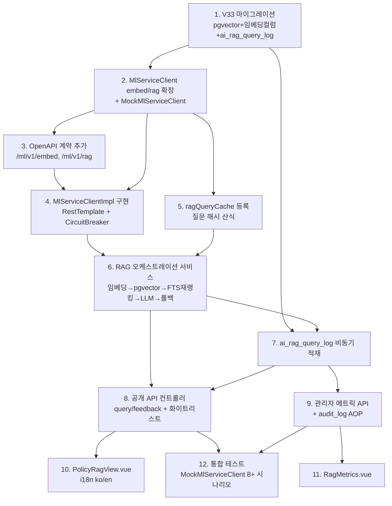

# SPEC-CMS-AI-003 구현 계획 (plan.md)

> 본 문서는 구현 순서·기술 결정·파일 목록·MX 태그 계획·리스크 분석을 정의한다. 구현 코드는 포함하지 않는다.

## 1. 구현 순서 및 의존 그래프

**임계 경로**: M1 → M2 → M4 → M6 → M8 → M12 (RAG 핵심 경로)

**병렬 가능**: M3·M5 (M2 완료 후 독립), M10·M11 (백엔드 API 완료 후 독립)

## 2. 기술 결정

| 결정 항목 | 선택 | 근거 |
|-----------|------|------|
| 벡터 저장소 | PostgreSQL 16 + `pgvector` 확장 (1차) | AI-001/AI-002 §9.5 결정 준용. 운영 규모(기업 1만+ 또는 pgvector p95 > 1s) 도달 시 Milvus 마이그레이션(본 SPEC 비범위) |
| 임베딩 차원 | `vector(384)` | sentence-transformers 계열 384차원 가정. `embed_model_version` 컬럼으로 모델 추적 |
| 벡터 인덱스 | IVFFlat `vector_cosine_ops` (`lists=100`) | cosine similarity 검색. 운영 데이터 적재 후 `lists` 재튜닝 전제 |
| 임베딩 저장 방식 | `policy_program` 컬럼 추가 (별도 테이블 미생성) | 정책↔임베딩 1:1, 조인 제거로 검색 단순화. 정책 삭제 시 임베딩 자동 정리 |
| 캐시 | Caffeine `ragQueryCache` TTL 15분 | AI-002 `policyMatchCache`(30분) 패턴 재사용. RAG는 답변 신선도 고려 15분 |
| 회로 차단기 | 기존 Resilience4j `ml-service` 인스턴스 공유 | AI-001 기존 CircuitBreaker 재사용. `embed`·`rag` 모두 동일 인스턴스 보호 |
| 폴백 검색 | SPEC-CMS-006 `SearchService` FTS (읽기 전용) | 기존 tsvector/GIN 자산 재사용. 검색 알고리즘 무수정 |
| 비동기 적재 | `AiPredictionLogService` + `aiLogExecutor` 패턴 | AI-001 비동기 로그 패턴 재사용 |
| DB 마이그레이션 | V33 단일 마이그레이션 | AI-001=V28, AI-002=V32 단일 마이그레이션 규약 준용 |
| 식별자 해시 | `IpHashUtil` SHA-256 재사용 | session_ref·question_hash 평문 미저장 |

## 3. 생성/수정 파일 목록

### 신규 생성 (backend, 경로: `backend/src/main/java/kr/co/ircp/cms/`)

- `domain/ai/rag/controller/RagQueryController.java` — `/api/v1/ai/rag/query`·`/feedback`
- `domain/ai/rag/controller/RagAdminController.java` — `/api/v1/admin/ai/rag/metrics`
- `domain/ai/rag/service/RagQueryService.java` (+ Impl) — 오케스트레이션 (임베딩→pgvector→FTS 재랭킹→LLM→폴백)
- `domain/ai/rag/service/RagMetricsService.java` (+ Impl) — 관리자 지표 집계
- `domain/ai/rag/repository/RagQueryLogRepository.java` (+ MyBatis Mapper XML) — `ai_rag_query_log` 적재/조회
- `domain/ai/rag/repository/PolicyEmbeddingRepository.java` (+ Mapper XML) — pgvector cosine 검색
- `domain/ai/rag/dto/` — `RagQueryRequest`/`RagQueryResponse`/`RagSource`/`RagFeedbackRequest`/`RagMetricsDto`
- `domain/ai/rag/entity/AiRagQueryLog.java`
- `infra/ml/dto/EmbedRequest.java`/`EmbedResponse.java`/`RagRequest.java`/`RagResponse.java`/`RagContextItem.java`

### 신규 생성 (DB)

- `backend/src/main/resources/db/migration/V33__ai_rag_query_log_and_policy_embedding.sql`

### 신규 생성 (frontend)

- `frontend/public/src/views/ai/PolicyRagView.vue` (+ i18n ko/en 키)
- `frontend/admin/src/views/ai/RagMetrics.vue`

### 수정 (확장만, 재작성 금지)

- `infra/ml/MlServiceClient.java` — `embed(text)`·`rag(question, contexts)` 메서드 추가
- `infra/ml/MlServiceClientImpl.java` — 두 메서드 RestTemplate 구현 (기존 `ml-service` CircuitBreaker 적용)
- `infra/ml/MockMlServiceClient.java` — 결정적 모킹 응답 추가
- `config/CacheConfig.java` — `ragQueryCache` Caffeine 정의 추가
- `docs/ai-ml-service-openapi.yaml` — `/ml/v1/embed`·`/ml/v1/rag` 경로 추가
- SPEC-CMS-002 비회원 공개 API 화이트리스트 설정 — `/api/v1/ai/rag/query`·`/feedback` 등록
- `frontend/public/src/router` + `frontend/admin/src/router` — 라우트 추가

### 신규 생성 (test, 경로: `backend/src/test/java/kr/co/ircp/cms/`)

- `domain/ai/rag/RagQueryServiceTest.java` — 단위 (캐시·폴백·재랭킹)
- `domain/ai/rag/RagQueryControllerIT.java` — 통합 (MockMlServiceClient, acceptance.md 8+ 시나리오)
- `domain/ai/rag/RagAdminControllerIT.java` — 관리자 메트릭·인가

## 4. MX 태그 계획

| 대상 | 태그 | 사유 |
|------|------|------|
| `MlServiceClient` (인터페이스) | `@MX:ANCHOR` (기존 유지) + 신규 `embed`/`rag` 메서드에 `@MX:NOTE` | 다수 호출처 invariant. RAG 메서드 계약 의도 전달 |
| `RagQueryServiceImpl` pgvector 검색 메서드 | `@MX:WARN` + `@MX:REASON` | 벡터 검색 p95 < 1s 모니터링 필요. 초과 시 Milvus 마이그레이션 트리거 (danger zone) |
| `ragQueryCache` 정의 (CacheConfig) | `@MX:NOTE` | TTL 15분·degraded 미캐싱 정책 의도 전달 |
| RAG 폴백 로직 (CircuitBreaker→FTS) | `@MX:NOTE` | FTS fallback 경로 의도 전달 |
| `RagQueryServiceImpl` (오케스트레이션, 고복잡도) | 복잡도 ≥15 시 `@MX:WARN` 추가 검토 | 임베딩+검색+재랭킹+LLM+폴백 다단계 흐름 |
| `ai_rag_query_log` 비동기 적재 | `@MX:NOTE` | 적재 실패가 사용자 응답 비차단 invariant |

## 5. 리스크 분석

| 리스크 | 영향 | 가능성 | 완화 |
|--------|------|--------|------|
| pgvector 확장 미승인(운영 DBA) | 높음 | 중 | §11 가정으로 명시. 미승인 시 임베딩 검색을 ML 서비스 인메모리로 대체하는 폴백 결정을 후속 SPEC으로 분리 |
| 정책 임베딩 미생성(백필 미완) | 중 | 높음 | `embed_vector IS NULL` 정책 자동 제외 + FTS 폴백으로 무답변 방지. 백필은 운영 절차 |
| pgvector 검색 p95 > 1s (데이터 증가) | 높음 | 중 | IVFFlat `lists` 튜닝 + `@MX:WARN` 모니터링. 임계 초과 지속 시 Milvus 마이그레이션(비범위) 에스컬레이션 |
| LLM 답변 환각(hallucination) | 중 | 높음 | 출처 정책 목록 항상 동반 표시(REQ-RAG-005). 빈 검색 시 답변 미생성(SER-RAG-04). 실제 품질은 ML ops 인수 |
| ML 서비스 지연 누적 → 사용자 대기 | 중 | 중 | `ml-service` CircuitBreaker + 타임아웃 → FTS 폴백 200 (REQ-RAG-008~010). 캐시 히트로 재질의 비용 제거 |
| 캐시 키 충돌/오염(폴백 응답 캐싱) | 중 | 낮음 | `degraded=true` 응답 캐시 제외(REQ-RAG-012). 질문 정규화 후 SHA-256 일관 산식 |
| 질문 텍스트 PII 포함 가능성 | 중 | 낮음 | ML에는 질문·컨텍스트만 전송, 식별자 미전송(REQ-RAG-017). question_hash만 저장(평문 미저장) |
| 통합 테스트의 실제 ML 의존 | 낮음 | 중 | `MockMlServiceClient` 결정적 모킹으로 ML 부재 시 전 경로 검증(SER-RAG-05) |

## 6. 검증 게이트 (Definition of Ready for Run)

- [ ] V33 단일 마이그레이션으로 모든 DB 변경 포함 확인
- [ ] `MlServiceClient` 확장만 수행(재작성 없음) 확인
- [ ] SPEC-CMS-006 `SearchService` 무수정·읽기 전용 호출 확인
- [ ] acceptance.md 8개+ Given/When/Then 시나리오 MockMlServiceClient로 자동화 가능 확인
- [ ] `## 3.3 Exclusions` 7개 항목 위반 없음 확인
