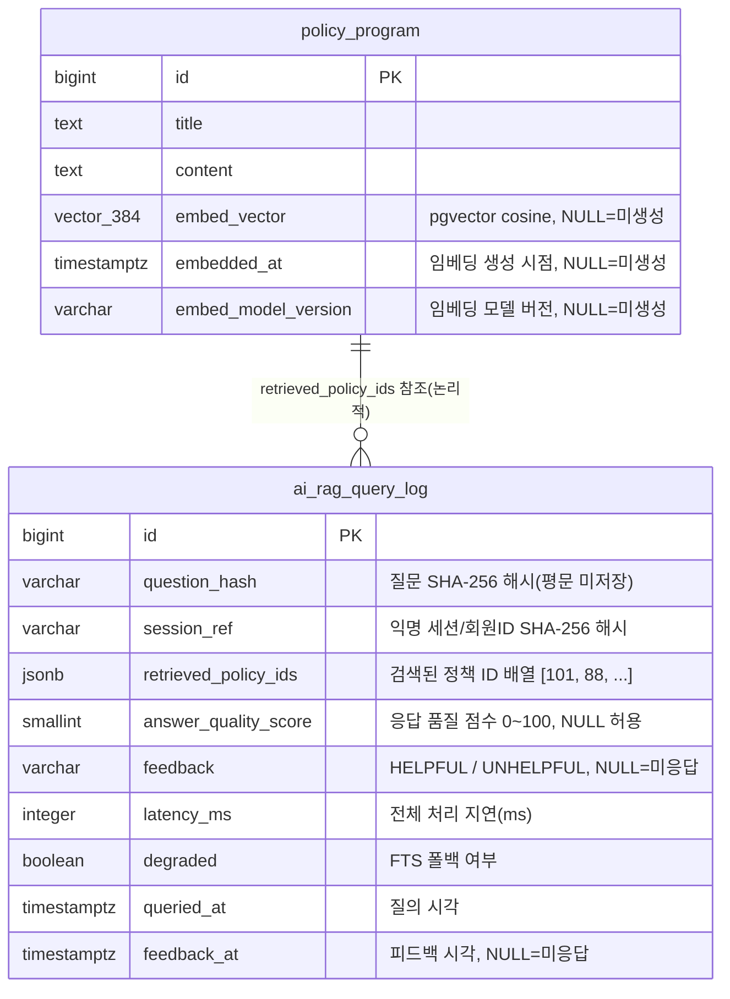

# SPEC-CMS-AI-003: RAG 질의응답 — 정책 문서 시맨틱 검색·자연어 질의·생성형 답변 v0.1

본 SPEC은 SPEC-CMS-001(Umbrella) §15.2 옵션 트랙에 대한 상세 명세이다. **옵션 트랙 P1**으로, 별도 사용자 승인 시점에 착수한다.

핵심 설계 원칙은 형제 SPEC SPEC-CMS-AI-001 / SPEC-CMS-AI-002에서 검증·확립된 패턴을 그대로 계승한다:
① Spring Boot(Java 17)는 **API Gateway + 비즈니스 로직 + 벡터 검색 오케스트레이션**, Python FastAPI ML 서비스는 **임베딩 생성 + LLM 생성형 답변 전용 마이크로서비스**(내부망 전용, 외부 비노출)로 책임을 분리한다.
② 두 서비스 간 계약을 OpenAPI 3.1(`docs/ai-ml-service-openapi.yaml`)로 명시적으로 정의한다.
③ ML 응답을 모킹(mock)할 수 있는 `MlServiceClient` 인터페이스를 재사용·확장하여 ML 모델 부재 시에도 Spring Boot 레이어를 독립적으로 검증한다.

본 SPEC의 정체성은 **RAG(Retrieval-Augmented Generation) 하이브리드 검색**이다. 정책 문서 임베딩(pgvector cosine similarity)과 PostgreSQL FTS(tsvector/GIN, SPEC-CMS-006/검색 도메인)를 결합 재랭킹하여 검색 정확도를 보강하고, 검색된 상위 K개 정책 문서를 컨텍스트로 LLM 생성형 답변을 생성한다. RAG는 기존 FTS 검색을 대체하지 않으며 **보강(augment)** 하고, ML 장애 시 FTS 단독으로 **폴백**한다.

---

## 1. 개요

| 항목 | 내용 |
|------|------|
| SPEC ID | SPEC-CMS-AI-003 |
| 제목 | RAG 질의응답 — 정책 문서 시맨틱 검색·자연어 질의·생성형 답변 |
| 작성일 | 2026-05-18 |
| 작성자 | manager-spec (MoAI) |
| 상태 | Draft |
| 버전 | v0.1 |
| 우선순위 | P1 (옵션 트랙) |
| 분류 | Detail SPEC (parent: SPEC-CMS-001) |
| 의존 SPEC | SPEC-CMS-AI-001 (AI/ML 인프라 — `MlServiceClient`·`AiPredictionLogService`·CircuitBreaker·Caffeine·OpenAPI 계약·Vue 모니터링 패턴, 구현 완료), SPEC-CMS-AI-002 (AI 정책 매칭 하이브리드·피드백 루프 패턴, 구현 완료) |
| 형제 SPEC | SPEC-CMS-AI-001 (구현 완료), SPEC-CMS-AI-002 (구현 완료) |
| 참조 SPEC | SPEC-CMS-002 (인증/권한), SPEC-CMS-005 (감사로그 인프라), SPEC-CMS-006 (정책 콘텐츠·검색), SPEC-CMS-009 (데이터 거버넌스) |
| 추적 prefix | REQ-RAG-* (기능 요구사항), AC-RAG-* (수용 기준) |
| DB 마이그레이션 | V33 (단일 마이그레이션) |

---

## 2. 참조 문서

- **상위 SPEC**: SPEC-CMS-001 §15.2 옵션 트랙 정의, §16.1 확장 SPEC 트리, §16.4 의존 관계, §17.1 PER 임계값, §17.3 데이터 분류, §17.4 품질 게이트
- **선행 SPEC (인프라 재사용)**: SPEC-CMS-AI-001
  - `infra/ml/MlServiceClient.java` 인터페이스 (`predictGrowthStage`/`predictRiskScore`/`predictSimulation`/`policyMatch`/`health`) — `embed`/`rag` 메서드 확장
  - `infra/ml/MlServiceClientImpl.java` (RestTemplate + Resilience4j CircuitBreaker `ml-service`)
  - `infra/ml/MockMlServiceClient.java` (테스트 모킹 어댑터)
  - `domain/ai/service/AiPredictionLogService.java` (`@Async("aiLogExecutor")` 비동기 로그)
  - `config/AsyncConfig.java` (`aiLogExecutor` 스레드 풀), `config/CacheConfig.java` (Caffeine `policyMatchCache` TTL 30min)
  - `infra/security/IpHashUtil.java` (SHA-256 해시)
  - `docs/ai-ml-service-openapi.yaml` (Spring Boot ↔ Python FastAPI 계약)
- **선행 SPEC (패턴 재사용)**: SPEC-CMS-AI-002 — `ai_policy_recommendation_log`(V32) 비동기 적재·세션 SHA-256 해시·피드백 루프·`PolicyMatchMetrics.vue` 모니터링 패턴
- **선행 SPEC (FTS 폴백 입력)**: SPEC-CMS-006 / `domain/search/` — PostgreSQL `tsvector`/GIN 기반 `SearchService.searchPolicies(...)` (RAG 검색 폴백 및 하이브리드 재랭킹 입력)
- **참조 SPEC**:
  - SPEC-CMS-002 (인증/권한 — 비회원 공개 API 화이트리스트, 관리자 API ROLE=ADMIN)
  - SPEC-CMS-005 (감사로그 인프라 — audit_log AOP, Custom Actuator)
  - SPEC-CMS-009 (데이터 거버넌스 — retention_policy 재사용)
- **프로젝트 문서**: `.moai/project/tech.md`, `.moai/project/structure.md`
- **외부 기술 참조**: PostgreSQL 16 `pgvector` 확장(cosine similarity, `vector(384)`), 문장 임베딩 모델(예: sentence-transformers 계열 384차원, CPU 추론), LLM 생성형 답변(Python FastAPI 내부), OpenAPI 3.1

---

## 3. 범위

### 3.1 1차 포함 범위 (P1, 옵션 트랙)

| 영역 | 내용 | 추적 |
|------|------|------|
| RAG 자연어 질의 | 사용자 자연어 질문 → 임베딩 → pgvector 시맨틱 검색 → 상위 K개 정책 컨텍스트 → LLM 생성형 답변 + 출처 정책 목록 반환 | REQ-RAG-001~005 |
| 하이브리드 검색 재랭킹 | pgvector cosine similarity + PostgreSQL FTS(tsvector) 결합 재랭킹 | REQ-RAG-006~007 |
| 폴백 | CircuitBreaker OPEN/타임아웃 시 FTS 단독 + `degraded:true`(503 미반환), 임베딩 단계 실패 시 FTS 단독 폴백 | REQ-RAG-008~010 |
| 캐싱 | Caffeine `ragQueryCache` (질문 SHA-256 해시 키, TTL 기본 15분) — 동일 질문 ML 미호출 즉시 응답 | REQ-RAG-011~012 |
| 피드백 루프 | 답변 만족도(HELPFUL/UNHELPFUL) 추적 → `ai_rag_query_log` 비동기 적재 | REQ-RAG-013~014 |
| 품질 모니터링 | 관리자 지표 — 만족도 비율·캐시 히트율·평균 응답시간·degraded 비율·시계열 | REQ-RAG-015~016 |
| 보안 | 질문 텍스트만 ML 전송(PII 미포함), session_ref SHA-256 해시 저장, 관리자 API ROLE=ADMIN + audit_log | REQ-RAG-017~019 |
| PostgreSQL AI 테이블 1종 + 임베딩 컬럼 | `ai_rag_query_log` + `policy_program` pgvector 컬럼 (단일 마이그레이션 V33) | §4 |
| Python ML 인터페이스 계약 | `docs/ai-ml-service-openapi.yaml`에 `POST /ml/v1/embed`·`POST /ml/v1/rag` 추가 — 계약 정의 + `MlServiceClient` 확장 + `MockMlServiceClient` 모킹 | §6.2 |
| 프론트엔드 | 시민 SPA `PolicyRagView.vue`(질문/답변/출처/피드백, i18n ko/en) / 관리자 SPA `RagMetrics.vue`(만족도·캐시 히트율·응답시간·시계열) | REQ-RAG-020~021 |

### 3.2 비범위 (out-of-scope)

| 비범위 항목 | 사유 |
|------------|------|
| Milvus 등 전용 벡터 DB 클러스터 구성 | 1차는 PostgreSQL 16 + pgvector로 충분. 운영 규모(기업 1만+ 또는 벡터 검색 p95 > 1초) 도달 시 별도 인프라 SPEC으로 마이그레이션 |
| LLM 모델 훈련 코드 | Python ML 서비스 내부. 본 SPEC은 추론 인터페이스 계약만 정의 |
| 임베딩 모델 선택/훈련 | Python ML 서비스 내부. Spring Boot는 384차원 벡터 계약만 소비 |
| 실시간 정책 문서 크롤링 | 임베딩 생성은 기존 정책 문서 대상 배치/온디맨드. 외부 크롤링 미포함 |
| 다국어 임베딩 | 1차는 한국어(ko) 단일 언어. 다국어 임베딩은 후속 |
| 개인화 답변 (사용자 이력 기반) | 1차는 무상태(stateless) 질의. 사용자 이력 기반 개인화는 후속 |
| 음성 질의 | 텍스트 질의만. STT/TTS 미포함 |
| 실제 ML 모델 정확도·답변 품질 정량 검증 | 본 SPEC 수용 기준은 `MockMlServiceClient` 모킹 응답으로 검증. 실제 품질은 ML ops 인수 절차 |

### 3.3 Exclusions (What NOT to Build)

본 SPEC 구현 시 다음을 **명시적으로 만들지 않는다**:

1. **새 ML 모델 학습/임베딩/LLM 서빙 코드 작성 금지** — `MlServiceClient`의 `embed`/`rag` 계약 호출과 `MockMlServiceClient` 모킹만 작성한다. Python FastAPI ML 서비스 실제 구현은 본 SPEC 산출물이 아니다.
2. **AI-001 인프라 클래스 재작성 금지** — `MlServiceClientImpl`·`AiPredictionLogService`·`IpHashUtil`·`CacheConfig`·`AsyncConfig`·Resilience4j `ml-service` 설정은 재사용하며 신규 구현하지 않는다 (필요 시 메서드 확장만).
3. **SPEC-CMS-006 `SearchService` 검색 알고리즘 수정 금지** — FTS 검색은 읽기 전용 의존으로만 호출한다. tsvector 인덱스·랭킹 산식에 손대지 않는다.
4. **신규 인증/세션 메커니즘 구축 금지** — SPEC-CMS-002 인증 필터·비회원 공개 API 화이트리스트를 재사용한다.
5. **별도 벡터 DB 인프라 도입 금지** — 1차 범위에서 Milvus/전용 벡터 스토어를 구성하지 않는다. PostgreSQL `pgvector` 확장만 사용한다.
6. **다중 마이그레이션 금지** — DB 변경(`ai_rag_query_log` 신규 테이블 + `policy_program` pgvector 컬럼 + pgvector 확장 활성화)은 V33 단일 마이그레이션으로 한정한다.
7. **company_id·사용자 식별정보의 ML 서비스 전송 금지** — ML 서비스에는 질문 텍스트만 전송한다.

---

## 4. 데이터 모델

### 4.1 ERD (Mermaid)



> 참고: `ai_rag_query_log.retrieved_policy_ids`는 JSONB 배열로 `policy_program.id`를 논리적으로 참조하며, 외래키 제약은 두지 않는다(로그 도메인 — 정책 삭제 후에도 로그 보존, AI-002 `ai_policy_recommendation_log` 패턴 준용).

### 4.2 DDL (V33 단일 마이그레이션)

```sql
-- V33__ai_rag_query_log_and_policy_embedding.sql
-- SPEC-CMS-AI-003 — RAG 질의응답 (pgvector 확장 + 임베딩 컬럼 + 질의 로그, PII 제외, LOG 도메인)

-- 1) pgvector 확장 활성화 (PostgreSQL 16)
CREATE EXTENSION IF NOT EXISTS vector;

-- 2) policy_program 임베딩 컬럼 추가 (별도 테이블 미생성 — 1:1 컬럼 추가 방식)
ALTER TABLE policy_program
    ADD COLUMN embed_vector        vector(384)  NULL,
    ADD COLUMN embedded_at         TIMESTAMPTZ  NULL,
    ADD COLUMN embed_model_version VARCHAR(64)  NULL;

COMMENT ON COLUMN policy_program.embed_vector        IS '정책 문서 임베딩 벡터 (sentence embedding 384차원, NULL=미생성)';
COMMENT ON COLUMN policy_program.embedded_at         IS '임베딩 생성 시점 (NULL=미생성, 재임베딩 시 갱신)';
COMMENT ON COLUMN policy_program.embed_model_version IS '임베딩 생성에 사용된 모델 버전 식별자';

-- pgvector cosine similarity 검색용 IVFFlat 인덱스 (운영 데이터 적재 후 lists 튜닝 전제)
CREATE INDEX idx_policy_program_embed_cosine
    ON policy_program USING ivfflat (embed_vector vector_cosine_ops)
    WITH (lists = 100);

-- 3) RAG 질의/피드백 로그 (PII 제외, LOG 도메인)
CREATE TABLE ai_rag_query_log (
    id                   BIGSERIAL    PRIMARY KEY,
    question_hash        VARCHAR(80)  NOT NULL,            -- 질문 텍스트 SHA-256 해시 (평문 미저장, 캐시 키 겸용)
    session_ref          VARCHAR(80)  NOT NULL,            -- 익명 세션 또는 회원ID SHA-256 해시 (평문 미저장)
    retrieved_policy_ids JSONB        NULL,                -- 검색된 정책 ID 배열 [101, 88, 203, ...]
    answer_quality_score SMALLINT     NULL,                -- 응답 품질 점수 0~100 (ML/규칙 산출, NULL 허용)
    feedback             VARCHAR(20)  NULL,                -- HELPFUL / UNHELPFUL (NULL=미응답)
    latency_ms           INTEGER      NOT NULL,            -- 전체 처리 지연(ms)
    degraded             BOOLEAN      NOT NULL DEFAULT FALSE, -- FTS 단독 폴백 여부
    queried_at           TIMESTAMPTZ  NOT NULL DEFAULT CURRENT_TIMESTAMP,
    feedback_at          TIMESTAMPTZ  NULL,                -- 피드백 발생 시각 (NULL=미응답)
    CONSTRAINT chk_arql_feedback       CHECK (feedback IS NULL OR feedback IN ('HELPFUL','UNHELPFUL')),
    CONSTRAINT chk_arql_quality_range  CHECK (answer_quality_score IS NULL OR answer_quality_score BETWEEN 0 AND 100),
    CONSTRAINT chk_arql_qhash_len      CHECK (char_length(question_hash) BETWEEN 1 AND 80),
    CONSTRAINT chk_arql_session_len    CHECK (char_length(session_ref)   BETWEEN 1 AND 80),
    CONSTRAINT chk_arql_feedback_pair  CHECK (
        (feedback IS NULL AND feedback_at IS NULL)
     OR (feedback IS NOT NULL AND feedback_at IS NOT NULL)
    )
);

CREATE INDEX idx_arql_qhash        ON ai_rag_query_log(question_hash, queried_at DESC);
CREATE INDEX idx_arql_session      ON ai_rag_query_log(session_ref, queried_at DESC);
CREATE INDEX idx_arql_feedback     ON ai_rag_query_log(feedback, feedback_at DESC) WHERE feedback IS NOT NULL;
CREATE INDEX idx_arql_metrics_day  ON ai_rag_query_log(queried_at);
CREATE INDEX idx_arql_degraded     ON ai_rag_query_log(degraded, queried_at DESC);

COMMENT ON TABLE  ai_rag_query_log              IS 'RAG 질의/피드백 로그 (SPEC-CMS-AI-003, PII 제외, LOG 도메인)';
COMMENT ON COLUMN ai_rag_query_log.question_hash IS '질문 텍스트 SHA-256 해시 — 평문 미저장, ragQueryCache 키와 동일 산식';
COMMENT ON COLUMN ai_rag_query_log.session_ref   IS '익명 세션 또는 회원ID의 SHA-256 해시 — 평문 식별자 미저장 (IpHashUtil 재사용)';
COMMENT ON COLUMN ai_rag_query_log.degraded      IS 'true=ML 장애로 FTS 단독 폴백 응답';
```

---

## 5. 기능 요구사항 (EARS)

### 5.1 RAG 자연어 질의 (REQ-RAG-001~005)

- **REQ-RAG-001 (자연어 질의 접수 — Event-driven)**
  사용자가 `POST /api/v1/ai/rag/query`로 자연어 질문을 제출하면, 시스템은 질문 텍스트를 정규화(trim·공백 정리)한 후 RAG 파이프라인을 개시해야 한다.

- **REQ-RAG-002 (질문 임베딩 — Event-driven)**
  정규화된 질문이 준비되면, 시스템은 Python ML 서비스 `POST /ml/v1/embed`를 호출하여 질문의 384차원 임베딩 벡터를 획득해야 한다.

- **REQ-RAG-003 (시맨틱 검색 — Event-driven)**
  질문 임베딩 벡터가 획득되면, 시스템은 `policy_program.embed_vector`에 대해 pgvector cosine similarity 검색을 수행하여 상위 후보 정책을 조회해야 한다.

- **REQ-RAG-004 (생성형 답변 — Event-driven)**
  하이브리드 재랭킹으로 상위 K개 정책 컨텍스트가 선정되면, 시스템은 Python ML 서비스 `POST /ml/v1/rag`에 컨텍스트와 질문을 전송하여 생성형 답변을 획득해야 한다.

- **REQ-RAG-005 (답변·출처 반환 — Ubiquitous)**
  시스템은 RAG 질의 응답에 생성형 답변 본문, 출처 정책 목록(정책 ID·제목·관련도 점수), `degraded` 플래그를 포함해야 한다.

### 5.2 하이브리드 검색 재랭킹 (REQ-RAG-006~007)

- **REQ-RAG-006 (하이브리드 결합 — Ubiquitous)**
  시스템은 pgvector cosine similarity 점수와 PostgreSQL FTS(tsvector) 점수를 설정 가능한 가중치로 결합하여 후보 정책을 재랭킹해야 한다.

- **REQ-RAG-007 (Top-K 경계 — Ubiquitous)**
  시스템은 LLM 컨텍스트로 전달하는 정책 문서 수를 설정값 K(기본 5, 상한 10)로 제한해야 한다.

### 5.3 폴백 (REQ-RAG-008~010)

- **REQ-RAG-008 (CircuitBreaker 폴백 — Conditional)**
  `ml-service` CircuitBreaker가 OPEN 상태이거나 ML 호출이 타임아웃되면, 시스템은 PostgreSQL FTS 단독 검색 결과로 응답하고 `degraded=true`로 표기해야 한다.

- **REQ-RAG-009 (임베딩 실패 폴백 — Conditional)**
  질문 임베딩 단계(`POST /ml/v1/embed`)가 실패하면, 시스템은 pgvector 검색을 건너뛰고 FTS 단독 검색 결과로 응답하며 `degraded=true`로 표기해야 한다.

- **REQ-RAG-010 (폴백 시 503 미반환 — Unwanted behavior)**
  ML 서비스 장애로 폴백이 발생한 경우, 시스템은 503(Service Unavailable)을 반환해서는 안 되며 FTS 결과를 200으로 정상 반환해야 한다.

### 5.4 캐싱 (REQ-RAG-011~012)

- **REQ-RAG-011 (질문 캐시 — State-driven)**
  동일 질문 해시(SHA-256)에 대한 캐시 항목이 `ragQueryCache`(Caffeine, TTL 기본 15분)에 유효하게 존재하면, 시스템은 ML 서비스를 호출하지 않고 캐시된 응답을 즉시 반환해야 한다.

- **REQ-RAG-012 (폴백 응답 캐시 제외 — Unwanted behavior)**
  응답이 `degraded=true`인 경우, 시스템은 해당 응답을 `ragQueryCache`에 저장해서는 안 된다.

### 5.5 피드백 루프 (REQ-RAG-013~014)

- **REQ-RAG-013 (피드백 접수 — Event-driven)**
  사용자가 `POST /api/v1/ai/rag/feedback`로 답변 만족도(HELPFUL/UNHELPFUL)를 제출하면, 시스템은 대응하는 `ai_rag_query_log` 행의 `feedback`·`feedback_at`을 갱신해야 한다.

- **REQ-RAG-014 (질의 로그 비동기 적재 — Event-driven)**
  RAG 질의가 완료되면, 시스템은 `AiPredictionLogService` 비동기 패턴(`@Async("aiLogExecutor")`)으로 `ai_rag_query_log`에 질문 해시·세션 해시·검색 정책 ID·latency·degraded를 적재하되, 적재 실패가 사용자 응답을 차단해서는 안 된다.

### 5.6 품질 모니터링 (REQ-RAG-015~016)

- **REQ-RAG-015 (관리자 지표 조회 — Event-driven)**
  관리자가 `GET /api/v1/admin/ai/rag/metrics`를 호출하면, 시스템은 만족도 비율(HELPFUL/전체 피드백)·캐시 히트율·평균 응답시간·degraded 비율·시계열 데이터를 기간 필터(period/from/to)와 함께 반환해야 한다.

- **REQ-RAG-016 (관리자 권한 강제 — Unwanted behavior)**
  요청자가 ROLE=ADMIN이 아니면, 시스템은 RAG 메트릭 API 응답 본문을 제공해서는 안 된다(403).

### 5.7 보안 (REQ-RAG-017~019)

- **REQ-RAG-017 (PII 미전송 — Unwanted behavior)**
  Python ML 서비스로 요청을 전송할 때, 시스템은 `company_id`·사용자 식별정보·세션 평문 식별자를 페이로드에 포함해서는 안 되며 질문 텍스트(및 검색 컨텍스트 정책 문서)만 전송해야 한다.

- **REQ-RAG-018 (세션 해시 저장 — Ubiquitous)**
  시스템은 `ai_rag_query_log.session_ref`와 `question_hash`에 평문이 아닌 SHA-256 해시(`IpHashUtil` 재사용)만 저장해야 한다.

- **REQ-RAG-019 (감사 로그 — Event-driven)**
  관리자 RAG 메트릭 API가 호출되면, 시스템은 SPEC-CMS-005 audit_log AOP로 접근 기록을 남겨야 한다.

### 5.8 프론트엔드 (REQ-RAG-020~021)

- **REQ-RAG-020 (시민 RAG 화면 — Ubiquitous)**
  시민 SPA는 `PolicyRagView.vue`에서 질문 입력, 답변 표시, 출처 정책 목록, 피드백 버튼(HELPFUL/UNHELPFUL)을 i18n(ko/en)으로 제공해야 한다.

- **REQ-RAG-021 (관리자 모니터링 화면 — Ubiquitous)**
  관리자 SPA는 `RagMetrics.vue`에서 만족도 비율·캐시 히트율·평균 응답시간·degraded 비율의 시계열 차트를 AI-002 `PolicyMatchMetrics.vue` 패턴으로 제공해야 한다.

---

## 6. API 계약

### 6.1 Spring Boot 공개/관리자 API

| 메서드 | 경로 | 설명 | 인가 | 추적 |
|--------|------|------|------|------|
| POST | `/api/v1/ai/rag/query` | 자연어 질의 → 생성형 답변 + 출처 정책 목록 | PUBLIC* (비회원 공개, SPEC-CMS-002 화이트리스트) | REQ-RAG-001~012 |
| POST | `/api/v1/ai/rag/feedback` | 답변 만족도 피드백 (HELPFUL/UNHELPFUL) | PUBLIC* | REQ-RAG-013 |
| GET | `/api/v1/admin/ai/rag/metrics` | RAG 품질 지표 (만족도·캐시 히트율·응답시간·degraded, period/from/to) | ADMIN | REQ-RAG-015~016, REQ-RAG-019 |

> `PUBLIC*` = SPEC-CMS-002 비회원 공개 API 화이트리스트에 명시적으로 등록. 회원 인증 시 세션 해시는 회원ID 기반.

**`POST /api/v1/ai/rag/query` 응답 스키마 (요지)**

```
{
  "answer": "string (생성형 답변 본문)",
  "sources": [ { "policyId": 101, "title": "string", "relevance": 0.83 } ],
  "degraded": false,
  "cached": false,
  "queryRef": "string (피드백 연계용 불투명 토큰)"
}
```

### 6.2 Spring Boot ↔ Python ML 서비스 인터페이스 계약 (OpenAPI 3.1)

`docs/ai-ml-service-openapi.yaml`에 아래 2개 엔드포인트를 추가한다 (기존 `/ml/v1/growth-stage`·`/ml/v1/risk-score`·`/ml/v1/simulation`·`/ml/v1/policy-match`·`/ml/v1/health` 패턴 준용).

| 메서드 | 경로 | 요청 | 응답 | 비고 |
|--------|------|------|------|------|
| POST | `/ml/v1/embed` | `{ "text": "string" }` | `{ "vector": [float x384], "model_version": "string" }` | 텍스트 임베딩 벡터(384차원). PII 미포함 |
| POST | `/ml/v1/rag` | `{ "question": "string", "contexts": [ { "policyId": int, "title": "string", "content": "string" } ] }` | `{ "answer": "string", "quality_score": int(0~100) }` | 컨텍스트 + 질문 → 생성형 답변 |

- 두 엔드포인트는 내부망 전용(Python FastAPI). Spring Boot만 호출하며 외부 비노출.
- Spring Boot 측은 `MlServiceClient` 인터페이스에 `embed(text)`·`rag(question, contexts)` 메서드를 확장하고, `MockMlServiceClient`에 결정적(deterministic) 모킹 응답을 추가한다.
- ML 응답 누락·타임아웃 시 Spring Boot는 FTS 단독으로 폴백한다(REQ-RAG-008~010).

---

## 7. 비동기·캐시·회로 차단기 전략

| 메커니즘 | 재사용 자산 | 본 SPEC 적용 |
|----------|------------|--------------|
| 비동기 로그 적재 | `AiPredictionLogService` + `AsyncConfig.aiLogExecutor` | `ai_rag_query_log` 적재를 `@Async("aiLogExecutor")`로 수행. 적재 실패가 사용자 응답을 차단하지 않음 (REQ-RAG-014) |
| 캐시 | `CacheConfig` Caffeine 패턴 | 신규 캐시 `ragQueryCache` 등록 — 키=질문 SHA-256 해시, TTL 기본 15분(설정값). `degraded=true` 응답은 미저장 (REQ-RAG-011~012) |
| 회로 차단기 | Resilience4j `ml-service` CircuitBreaker (AI-001 기존 인스턴스) | `embed`·`rag` 호출 모두 동일 `ml-service` CircuitBreaker로 보호. OPEN/타임아웃 시 FTS 폴백 (REQ-RAG-008) |
| 폴백 검색 | `domain/search` `SearchService`(FTS, 읽기 전용) | ML 장애 시 FTS 단독 결과 + `degraded=true` 200 반환 (REQ-RAG-008~010) |

**캐시 키 산식**: `question_hash = SHA-256(normalize(question))`. `ai_rag_query_log.question_hash`와 `ragQueryCache` 키는 동일 산식을 사용하여 캐시 히트율 분석을 일관되게 한다.

---

## 8. 보안 요구사항

| 항목 | 요구사항 | 추적 |
|------|----------|------|
| ML 페이로드 최소화 | `/ml/v1/embed`·`/ml/v1/rag`에 질문 텍스트와 검색된 정책 문서 컨텍스트만 전송. `company_id`·사용자 식별정보·세션 평문 미포함 | REQ-RAG-017 |
| 식별자 해시 | `session_ref`·`question_hash`는 `IpHashUtil` SHA-256 해시만 저장. 평문 미저장 | REQ-RAG-018 |
| 인가 경계 | `/api/v1/ai/rag/query`·`/feedback`는 SPEC-CMS-002 비회원 공개 화이트리스트 명시 등록. `/api/v1/admin/ai/rag/metrics`는 ROLE=ADMIN 강제 | REQ-RAG-016 |
| 감사 추적 | 관리자 RAG 메트릭 API는 SPEC-CMS-005 audit_log AOP 적용 | REQ-RAG-019 |
| 입력 검증 | 질문 길이 상한(예: 1000자) 초과 시 400. 빈 질문 400 | §9 SER |
| 데이터 보존 | `ai_rag_query_log`는 SPEC-CMS-009 retention_policy 재사용 (LOG 도메인 분류) | §3.2 |

---

## 9. 비기능 요구사항

### 9.1 성능 (PER)

| ID | 항목 | 임계값 |
|----|------|--------|
| PER-RAG-01 | 캐시 히트 응답 시간 | p95 < 100ms (ML 미호출) |
| PER-RAG-02 | 정상 RAG 응답 시간 (임베딩+검색+생성) | p95 < 5s |
| PER-RAG-03 | pgvector cosine 검색 시간 | p95 < 1s (초과 지속 시 Milvus 마이그레이션 트리거 — 본 SPEC 비범위) |
| PER-RAG-04 | FTS 폴백 응답 시간 | p95 < 1s |

### 9.2 서비스 품질 (SER)

| ID | 항목 | 요구사항 |
|----|------|----------|
| SER-RAG-01 | 가용성 | ML 장애 시에도 FTS 폴백으로 200 응답 (503 미반환) |
| SER-RAG-02 | 입력 검증 | 빈/과길이(>1000자) 질문 400. 잘못된 feedback 값 400 |
| SER-RAG-03 | 멱등 피드백 | 동일 queryRef에 대한 중복 피드백은 마지막 값으로 갱신(중복 행 미생성) |
| SER-RAG-04 | 빈 검색 결과 | 검색 결과 0건 시 답변 없이 "관련 정책을 찾지 못함" 안내 + 빈 sources 200 반환 |
| SER-RAG-05 | 검증 가능성 | `MockMlServiceClient` 모킹으로 ML 모델 부재 시 전 경로 통합 테스트 가능 |

---

## 10. 구현 순서

| 순서 | 작업 | 의존 |
|------|------|------|
| 1 | V33 마이그레이션 (pgvector 확장 + `policy_program` 임베딩 컬럼 + `ai_rag_query_log`) | - |
| 2 | `MlServiceClient` 인터페이스에 `embed`/`rag` 메서드 확장 + `MockMlServiceClient` 모킹 | 1 |
| 3 | `docs/ai-ml-service-openapi.yaml`에 `/ml/v1/embed`·`/ml/v1/rag` 계약 추가 | 2 |
| 4 | `MlServiceClientImpl` `embed`/`rag` 구현 (RestTemplate + `ml-service` CircuitBreaker) | 2,3 |
| 5 | `ragQueryCache` 등록(CacheConfig 확장) + 질문 해시 산식(IpHashUtil 재사용) | 2 |
| 6 | RAG 오케스트레이션 서비스 (임베딩 → pgvector → FTS 하이브리드 재랭킹 → LLM → 폴백) | 4,5 |
| 7 | `ai_rag_query_log` 비동기 적재 (AiPredictionLogService 패턴 재사용) | 1,6 |
| 8 | 공개 API 컨트롤러 (`/api/v1/ai/rag/query`·`/feedback`) + SPEC-CMS-002 화이트리스트 등록 | 6,7 |
| 9 | 관리자 메트릭 API (`/api/v1/admin/ai/rag/metrics`) + audit_log AOP | 7 |
| 10 | 시민 SPA `PolicyRagView.vue` (i18n ko/en) | 8 |
| 11 | 관리자 SPA `RagMetrics.vue` (PolicyMatchMetrics.vue 패턴) | 9 |
| 12 | 통합 테스트 (MockMlServiceClient 기반 8개+ 시나리오, acceptance.md) | 8,9 |

---

## 11. 가정 사항

ASSUMPTIONS I'M MAKING:
1. **pgvector 확장 사용 가능** — PostgreSQL 16 환경에서 `CREATE EXTENSION vector`가 허용된다(운영 DBA 사전 승인 전제). 불가 시 임베딩 검색은 ML 서비스 내부 인메모리 처리로 대체 가능하나 본 SPEC은 pgvector 1차 결정을 따른다.
2. **임베딩 차원 384 고정** — sentence embedding 계열 384차원 단일 모델 가정. 모델 변경 시 `embed_model_version`으로 추적하되 차원 변경은 후속 마이그레이션 범위.
3. **정책 문서 임베딩 생성 시점** — 본 SPEC은 임베딩 컬럼 스키마와 소비(검색)만 정의한다. 임베딩 채우기(백필) 배치/온디맨드 트리거의 상세 구현은 구현 순서 외 운영 절차로 위임하며, 검색은 `embed_vector IS NULL`인 정책을 자동 제외한다.
4. **FTS 검색 자산 존재** — SPEC-CMS-006/`domain/search` `SearchService`가 정책 대상 tsvector 검색을 제공한다(읽기 전용 재사용).
5. **단일 언어(ko)** — 1차 임베딩·질의·답변은 한국어. i18n은 UI 레이블에만 적용(답변 본문은 ko).
6. **비회원 공개 API** — `/api/v1/ai/rag/query`·`/feedback`는 SPEC-CMS-002 화이트리스트 등록으로 비회원 접근. session_ref는 익명 세션 해시.

→ 위 가정이 어긋나면 진행 전 정정 요청.

---

## 12. 변경 이력

| 버전 | 일자 | 작성자 | 변경 내용 |
|------|------|--------|-----------|
| v0.1 | 2026-05-18 | manager-spec (MoAI) | 신규 작성 (Draft) — RAG 질의응답 SPEC. AI-001/AI-002 인프라·패턴 재사용, pgvector 1차 결정, 단일 V33 마이그레이션, EARS 21개 요구사항 |
| v0.3 | 2026-05-19 | MoAI orchestrator | Implemented → Tested 전환. sync 커밋 f2186d1 (CHANGELOG v1.3.0) 기반. 단위 10 + IT 12(AC-RAG-001~009) + 프론트 7 GREEN 유지 확인. |
| v0.2 | 2026-05-18 | manager-tdd (MoAI) | 구현 완료 (Implemented) — TDD RED→GREEN→REFACTOR. 단위 10 + IT 12(AC-RAG-001~009) + 프론트 7 GREEN. AbstractIntegrationTest 컨테이너를 pgvector/pgvector:pg16으로 격상(기존 IT 14클래스 41테스트 회귀 없음). queryRef 상관키·cache_hit 컬럼 추가(단일 V33 유지) |
