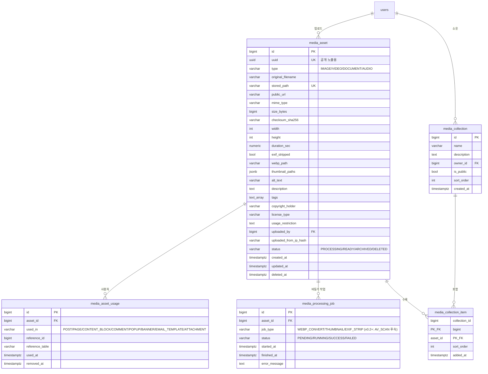
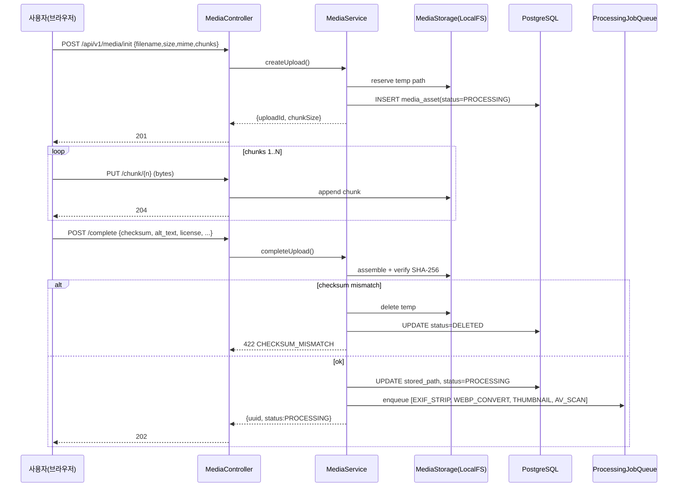
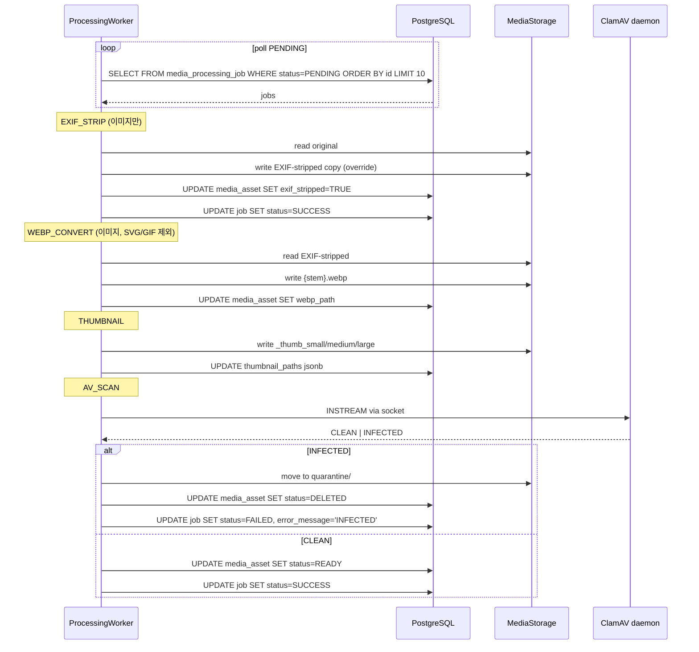
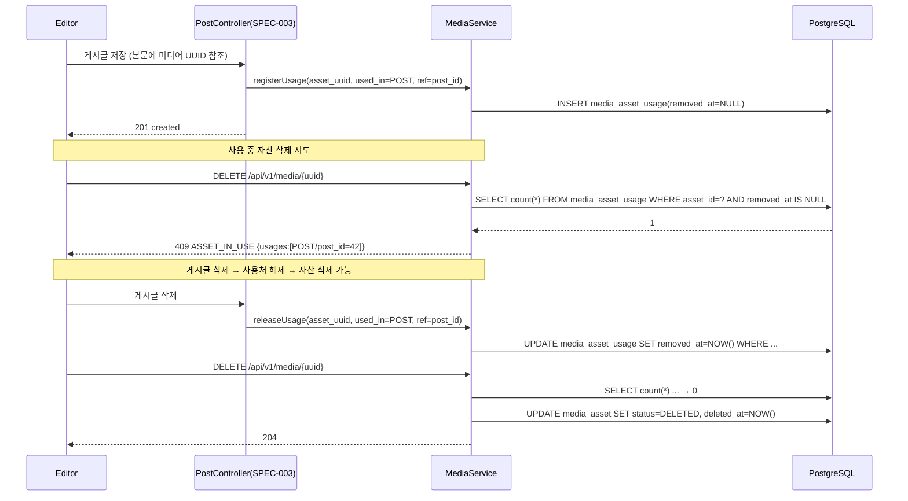

# SPEC-CMS-MEDIA-001 — 통합 미디어 라이브러리 (Media Library)

## 1. 개요

| 항목 | 값 |
|------|----|
| SPEC ID | SPEC-CMS-MEDIA-001 |
| 제목 | 통합 미디어 라이브러리 |
| 상위 SPEC | SPEC-CMS-001 (umbrella, v0.3 트리에 추가 예정) |
| 상태 | Tested |
| 우선순위 | P0 |
| 작성자 | manager-spec |
| 작성일 | 2026-04-29 |
| 도입 근거 | 홍익인간 CMS gap 분석 #5 통합 미디어 관리, #14 더블린코어 메타데이터 일부, EXIF·WebP 자동화 (사용자 결정 2026-04-29) |
| 관련 도메인 패키지 | `kr.co.ircp.cms.domain.media.*` |

본 SPEC은 **이미지·동영상·문서·오디오를 단일 자산 모델로 일원화**하여 게시판 첨부, 페이지 이미지, 콘텐츠 블록, 팝업, 배너, 이메일 템플릿 등 모든 사용처에서 **한 번 업로드 — 어디서나 재사용** 패턴을 제공한다. 또한 EXIF 자동 제거(개인정보 보호), 이미지 WebP 자동 변환, 다중 썸네일 비동기 생성, 사용처(usage) 추적을 통한 안전 삭제·교체, CC 라이선스 표기를 의무화하여 공공기관 CMS 운영의 콘텐츠 자산화 수준을 높인다.

(SPEC-CMS-001 v0.3 §16 트리에 추가, 홍익인간 CMS gap #5 통합미디어 관리 대응)

---

## 2. 참조 문서

| 문서 | 참조 내용 |
|------|-----------|
| SPEC-CMS-001 §15~17 | umbrella v0.2 RFP 통합 정책, 비기능 횡단 (PER-002~004, SER-002~004, DAR-001~010, QUR-004) |
| SPEC-CMS-003 §4.2.4 `bbs_attachment` | 게시판 첨부 모델 — 본 SPEC은 이를 미디어 자산으로 분리·통합하며 `bbs_attachment`는 미디어 자산 참조로 점진 마이그레이션 |
| SPEC-CMS-004 (콘텐츠·메뉴·사이트관리) | 페이지·콘텐츠 블록 이미지의 미디어 자산 참조 흐름 |
| `.moai/project/tech.md` | Spring Boot 3.2.x + Java 17 + PostgreSQL 16 + MyBatis 3.5 + Vue 3.5 + Element Plus 2.8 |
| `.moai/project/structure.md` §도메인 패키지 | `kr.co.ircp.cms.domain.media.{controller,service,mapper,domain,dto}` |
| 홍익인간 CMS 분석 보고서 | gap #5 통합미디어 관리, #14 더블린코어 메타데이터 일부 |

---

## 3. 범위 및 비범위

### 3.1 1차 출시 포함 범위

- 미디어 자산 통합 모델 (이미지·동영상·문서·오디오 단일 테이블)
- 청크 업로드(단순 multipart range, 10MB 청크) + 드래그앤드롭 + 진행률 표시
- 매직넘버 기반 MIME 검증 (Apache Tika)
- 이미지 자동 후처리: EXIF 제거 → WebP 변환 → 다중 썸네일(small/medium/large) 비동기 생성
- 사용처(usage) 자동 등록·해제, 사용 중 자산 삭제 차단
- 고아 자산(orphan) 식별 및 일괄 정리(관리자 전용)
- 라이선스 메타데이터 (CC0, CC_BY, CC_BY_NC, PROPRIETARY, INTERNAL)
- 사용자별 컬렉션(앨범/즐겨찾기) CRUD
- 서명 URL 다운로드 (TTL 15분, SPEC-CMS-003 §4.2.4 정책 일치)
- 다운로드 카운트 집계
- alt_text(접근성), description, tags(PostgreSQL TEXT[])
- 1차 저장소: **LocalFileSystemStorage 단일 구현** — `MediaStorage` 인터페이스로 추상화 유지. MinIO/S3는 v0.2+ 후속 (사용자 결정 2026-04-29 Q-2 적용)

### 3.2 1차 비포함 범위 (의도적 제외)

| 제외 항목 | 사유 / 대체 |
|-----------|-------------|
| 실시간 영상 스트리밍 (HLS/DASH 트랜스코딩) | 1차 정적 다운로드만, 향후 별도 SPEC-CMS-MEDIA-STREAM-001 |
| DRM (Widevine, FairPlay) | 공공기관 콘텐츠 특성상 불필요 |
| AI 자동 태깅 / 객체 인식 | 옵션 트랙 SPEC-CMS-AI-001 범위, gap #15 별도 |
| 이미지 편집기 (Crop/Rotate UI) | 1차는 프론트엔드 미제공, alt_text·메타데이터 편집만 |
| MinIO/S3 1차 도입 | **v0.2+ 후속 검토 (사용자 결정 2026-04-29 Q-2)**. 1차는 LocalFileSystemStorage 단일 구현 확정. MediaStorage 인터페이스는 유지하여 v0.2+ 시 어댑터 추가 가능. 망분리 정책·운영 인력 검토 후 결정. |
| ClamAV AV 스캔 1차 도입 | **v0.2+ 후속 검토 (사용자 결정 2026-04-29 Q-3, 강력 권고)**. 1차는 매직넘버 + MIME + 확장자 화이트리스트 3중 방어로 대응. 보안 강화를 위해 v0.2+ ClamAV 데몬 + 비동기 큐 도입 의무 권고. |
| tus.io 청크 업로드 프로토콜 | 1차는 단순 multipart range, 1GB 초과 자산 발생 시 2차 도입 |
| 동영상 트랜스코딩 (FFmpeg 다중 비트레이트) | 원본만 저장, 썸네일은 첫 프레임 캡처 |

---

## 4. 데이터 모델

### 4.1 ERD (Mermaid)



### 4.2 테이블 명세

#### 4.2.1 `media_asset` (미디어 자산 마스터)

```sql
CREATE TABLE media_asset (
    id                    BIGSERIAL    PRIMARY KEY,
    uuid                  UUID         NOT NULL DEFAULT gen_random_uuid() UNIQUE,
    type                  VARCHAR(20)  NOT NULL,
    original_filename     VARCHAR(500) NOT NULL,
    stored_path           VARCHAR(500) NOT NULL UNIQUE,
    public_url            VARCHAR(500),
    mime_type             VARCHAR(150) NOT NULL,
    size_bytes            BIGINT       NOT NULL,
    checksum_sha256       VARCHAR(64)  NOT NULL,
    width                 INT,
    height                INT,
    duration_sec          NUMERIC(10,3),
    exif_stripped         BOOLEAN      NOT NULL DEFAULT FALSE,
    webp_path             VARCHAR(500),
    thumbnail_paths       JSONB        DEFAULT '{}'::jsonb,
    alt_text              VARCHAR(500),
    description           TEXT,
    tags                  TEXT[]       DEFAULT '{}',
    copyright_holder      VARCHAR(200),
    license_type          VARCHAR(30)  NOT NULL DEFAULT 'INTERNAL',
    usage_restriction     TEXT,
    uploaded_by           BIGINT       REFERENCES users(id) ON DELETE SET NULL,
    uploaded_from_ip_hash VARCHAR(64),
    status                VARCHAR(20)  NOT NULL DEFAULT 'PROCESSING',
    created_at            TIMESTAMPTZ  NOT NULL DEFAULT CURRENT_TIMESTAMP,
    updated_at            TIMESTAMPTZ  NOT NULL DEFAULT CURRENT_TIMESTAMP,
    deleted_at            TIMESTAMPTZ,
    CONSTRAINT chk_media_type    CHECK (type IN ('IMAGE','VIDEO','DOCUMENT','AUDIO')),
    CONSTRAINT chk_media_status  CHECK (status IN ('PROCESSING','READY','ARCHIVED','DELETED')),
    CONSTRAINT chk_media_license CHECK (license_type IN ('CC0','CC_BY','CC_BY_NC','PROPRIETARY','INTERNAL')),
    CONSTRAINT chk_media_size    CHECK (size_bytes > 0 AND size_bytes <= 5368709120),  -- 5GB 절대 한도
    CONSTRAINT chk_media_image_alt CHECK (
      type <> 'IMAGE' OR status <> 'READY' OR (alt_text IS NOT NULL AND length(alt_text) > 0)
    )
);

COMMENT ON COLUMN media_asset.uuid                IS '공개 노출용 식별자 (URL, 외부 참조)';
COMMENT ON COLUMN media_asset.stored_path         IS 'webroot 외부 절대 경로 또는 객체 스토리지 키';
COMMENT ON COLUMN media_asset.public_url          IS '공개 자산일 때 CDN 또는 정적 서빙 URL';
COMMENT ON COLUMN media_asset.checksum_sha256     IS '업로드 시점 SHA-256, 무결성 검증·중복 탐지';
COMMENT ON COLUMN media_asset.exif_stripped       IS 'TRUE면 EXIF 메타데이터 제거 완료, 이미지 자산만 의미 있음';
COMMENT ON COLUMN media_asset.webp_path           IS 'IMAGE 타입에서만 채워지는 WebP 변환본 경로';
COMMENT ON COLUMN media_asset.thumbnail_paths     IS '{"small":"path","medium":"path","large":"path"} 형태 jsonb';
COMMENT ON COLUMN media_asset.alt_text            IS '접근성 대체 텍스트 (KWCAG 2.2 1.1.1)';
COMMENT ON COLUMN media_asset.tags                IS 'PostgreSQL TEXT[] 태그 배열, GIN 인덱스로 검색';
COMMENT ON COLUMN media_asset.license_type        IS 'CC0/CC_BY/CC_BY_NC/PROPRIETARY/INTERNAL';
COMMENT ON COLUMN media_asset.uploaded_from_ip_hash IS 'IP 직접 저장 금지 (DAR-005), SHA-256 해시만';
COMMENT ON COLUMN media_asset.status              IS 'PROCESSING(후처리중) → READY → ARCHIVED 또는 DELETED';
```

#### 4.2.2 `media_asset_usage` (사용처 추적)

```sql
CREATE TABLE media_asset_usage (
    id              BIGSERIAL   PRIMARY KEY,
    asset_id        BIGINT      NOT NULL REFERENCES media_asset(id) ON DELETE CASCADE,
    used_in         VARCHAR(30) NOT NULL,
    reference_id    BIGINT      NOT NULL,
    reference_table VARCHAR(64) NOT NULL,
    used_at         TIMESTAMPTZ NOT NULL DEFAULT CURRENT_TIMESTAMP,
    removed_at      TIMESTAMPTZ,
    CONSTRAINT chk_usage_kind CHECK (used_in IN
      ('POST','PAGE','CONTENT_BLOCK','COMMENT','POPUP','BANNER','EMAIL_TEMPLATE','ATTACHMENT')),
    CONSTRAINT uq_asset_usage UNIQUE (asset_id, used_in, reference_id, reference_table)
);

COMMENT ON TABLE media_asset_usage IS '미디어 자산 사용처 추적 (Reference Counting). removed_at IS NULL인 행 수가 활성 사용처 수.';
COMMENT ON COLUMN media_asset_usage.used_in         IS '사용 도메인 — research.md §8 참조';
COMMENT ON COLUMN media_asset_usage.reference_id    IS '사용처 도메인의 PK (예: bbs_post.id)';
COMMENT ON COLUMN media_asset_usage.reference_table IS '사용처 테이블명 (예: bbs_post) — 외래키 무결성은 애플리케이션 레이어 책임';
```

#### 4.2.3 `media_collection` (사용자 컬렉션·앨범)

```sql
CREATE TABLE media_collection (
    id          BIGSERIAL    PRIMARY KEY,
    name        VARCHAR(200) NOT NULL,
    description TEXT,
    owner_id    BIGINT       NOT NULL REFERENCES users(id) ON DELETE CASCADE,
    is_public   BOOLEAN      NOT NULL DEFAULT FALSE,
    sort_order  INT          NOT NULL DEFAULT 0,
    created_at  TIMESTAMPTZ  NOT NULL DEFAULT CURRENT_TIMESTAMP,
    CONSTRAINT uq_collection_owner_name UNIQUE (owner_id, name)
);

COMMENT ON TABLE media_collection IS '사용자별 미디어 컬렉션. is_public=TRUE는 같은 권한 그룹 내 공유.';
```

#### 4.2.4 `media_collection_item` (컬렉션 — 자산 매핑)

```sql
CREATE TABLE media_collection_item (
    collection_id BIGINT      NOT NULL REFERENCES media_collection(id) ON DELETE CASCADE,
    asset_id      BIGINT      NOT NULL REFERENCES media_asset(id) ON DELETE CASCADE,
    sort_order    INT         NOT NULL DEFAULT 0,
    added_at      TIMESTAMPTZ NOT NULL DEFAULT CURRENT_TIMESTAMP,
    PRIMARY KEY (collection_id, asset_id)
);
```

#### 4.2.5 `media_processing_job` (비동기 작업 큐)

```sql
CREATE TABLE media_processing_job (
    id            BIGSERIAL    PRIMARY KEY,
    asset_id      BIGINT       NOT NULL REFERENCES media_asset(id) ON DELETE CASCADE,
    job_type      VARCHAR(30)  NOT NULL,
    status        VARCHAR(20)  NOT NULL DEFAULT 'PENDING',
    started_at    TIMESTAMPTZ,
    finished_at   TIMESTAMPTZ,
    error_message TEXT,
    -- v0.2 (사용자 결정 2026-04-29 Q-3 적용): AV_SCAN job_type 제거. 1차는 매직넘버+MIME+확장자 3중 방어로 대응.
    -- v0.2+ ClamAV 도입 시 본 CHECK 제약을 ('WEBP_CONVERT','THUMBNAIL','EXIF_STRIP','AV_SCAN')로 확장 (Flyway 별도 마이그레이션).
    CONSTRAINT chk_job_type   CHECK (job_type IN ('WEBP_CONVERT','THUMBNAIL','EXIF_STRIP')),
    CONSTRAINT chk_job_status CHECK (status IN ('PENDING','RUNNING','SUCCESS','FAILED'))
);

COMMENT ON TABLE media_processing_job IS '비동기 후처리 작업 큐. PENDING 행을 워커가 폴링. v0.2 1차는 EXIF_STRIP/WEBP_CONVERT/THUMBNAIL 3종, AV_SCAN은 v0.2+ 후속.';
```

### 4.3 인덱스

```sql
-- media_asset
CREATE INDEX idx_media_type_status_created
  ON media_asset (type, status, created_at DESC)
  WHERE deleted_at IS NULL;
CREATE INDEX idx_media_uploaded_by
  ON media_asset (uploaded_by)
  WHERE deleted_at IS NULL;
CREATE INDEX idx_media_tags_gin
  ON media_asset USING GIN (tags);
CREATE INDEX idx_media_thumb_gin
  ON media_asset USING GIN (thumbnail_paths jsonb_path_ops);
CREATE INDEX idx_media_checksum
  ON media_asset (checksum_sha256);

-- media_asset_usage
CREATE INDEX idx_usage_asset_active
  ON media_asset_usage (asset_id)
  WHERE removed_at IS NULL;
CREATE INDEX idx_usage_reference
  ON media_asset_usage (used_in, reference_id);

-- media_processing_job
CREATE INDEX idx_job_pending
  ON media_processing_job (status, started_at)
  WHERE status = 'PENDING';

-- media_collection
CREATE INDEX idx_collection_owner ON media_collection (owner_id, sort_order);
```

### 4.4 PostgreSQL 16 특화 기능 활용

- **`gen_random_uuid()`** (pgcrypto): 자산 UUID 자동 생성
- **`TEXT[]`** + `GIN` 인덱스: tags 배열 검색 (예: `WHERE tags @> ARRAY['홍보','2026']`)
- **`JSONB` + `jsonb_path_ops`** GIN 인덱스: thumbnail_paths 키 존재 검색
- **부분 인덱스(WHERE)**: 활성 자산·활성 사용처·PENDING 작업만 인덱싱 — 인덱스 크기 절감
- **`TIMESTAMPTZ`**: 모든 시간 컬럼은 timezone-aware

---

## 5. 요구사항 (EARS 형식)

### REQ-MEDIA-001-D 업로드

- **REQ-MEDIA-001-D-1 (Event-Driven, 청크 업로드)**: WHEN 사용자가 10MB를 초과하는 미디어를 업로드할 때, THE system SHALL 단순 multipart range 청크 업로드(청크 크기 10MB)를 사용하여 청크별로 저장하고 마지막 청크 수신 후 SHA-256 검증하여 단일 자산으로 병합한다.
- **REQ-MEDIA-001-D-2 (Event-Driven, 드래그앤드롭)**: WHEN 사용자가 브라우저 영역에 파일을 드롭할 때, THE system SHALL 동일한 업로드 파이프라인(`POST /api/v1/media/init`)을 자동 호출하여 별도의 UI 분기 없이 처리한다.
- **REQ-MEDIA-001-D-3 (Ubiquitous, 진행률 표시)**: THE system SHALL 청크별 업로드 진행률(0~100%)과 후처리 단계(EXIF/WebP/썸네일/AV) 상태를 실시간 노출한다.
- **REQ-MEDIA-001-D-4 (Ubiquitous, 동시 50건)**: THE system SHALL 단일 사용자 기준 동시 업로드 50건을 큐잉 없이 처리한다 (PER-004 동시 처리 50건/초 정합).
- **REQ-MEDIA-001-D-5 (Unwanted, 매직넘버 검증)**: IF 업로드 파일의 매직넘버(Apache Tika 검출 MIME)가 클라이언트 신고 MIME과 불일치하거나 allowlist에 없는 경우, THEN THE system SHALL 자산 생성을 거부하고 HTTP 415 응답한다.

### REQ-MEDIA-002-D 자동 후처리

- **REQ-MEDIA-002-D-1 (Event-Driven, EXIF 제거)**: WHEN 이미지 자산이 업로드 완료 상태(stored_path 확정)가 될 때, THE system SHALL `media_processing_job(EXIF_STRIP)`을 PENDING으로 등록하고 워커가 비동기로 EXIF·GPS·작성자 메타데이터를 모두 제거한 뒤 `media_asset.exif_stripped=TRUE`로 갱신한다.
- **REQ-MEDIA-002-D-2 (Event-Driven, WebP 변환)**: WHEN EXIF 제거가 완료된 이미지 자산일 때, THE system SHALL WebP 변환(`cwebp -q 80`)을 비동기 실행하여 `webp_path`를 채운다. SVG·GIF(애니메이션)는 변환에서 제외한다.
- **REQ-MEDIA-002-D-3 (Event-Driven, 다중 썸네일)**: WHEN WebP 변환이 완료된 이미지 자산일 때, THE system SHALL small(150px), medium(480px), large(1280px) 3개 썸네일을 비동기 생성하여 `thumbnail_paths` jsonb에 기록한다.
- **REQ-MEDIA-002-D-4 (v0.2+ 후속 검토 — AV 스캔 비동기, 사용자 결정 2026-04-29 Q-3 적용)**:

  > **NOTE — v0.2+ 후속 검토 (사용자 결정 2026-04-29 Q-3)**
  > 1차 v0.2는 ClamAV AV 스캔을 **미도입**한다. 매직넘버 검증(REQ-MEDIA-001-D-5) + MIME 화이트리스트 + 확장자 화이트리스트 3중 방어로 대응한다. **2차 v0.2+에서 ClamAV 데몬 + 비동기 큐 도입을 강력 권고한다 (보안 강화).** 본 sub-REQ의 원안 동작(ClamAV INSTREAM, INFECTED 시 quarantine 이동, 자산 DELETED 전이)은 v0.2+ 활성화 시점에 재도입한다.
  >
  > **R-MEDIA-NOTE**: 미디어 파일에 매크로 포함 가능한 형식(예: docx/xlsx)은 1차 v0.2에서 업로드 차단(MIME 화이트리스트에서 제외) 또는 운영자에게 매크로 위협 경고 표시(업로더 권한 EDITOR+ 안내)를 적용한다. 1차 매직넘버 검증만으로는 폴리글로트 파일·매크로 위협이 완전히 차단되지 않는다는 점을 운영 매뉴얼에 명시한다.

  v0.2 placeholder 동작 (1차):
  - `media_processing_job` 테이블의 `job_type`에 `AV_SCAN`은 등록되지 않는다 (CHECK 제약으로 차단 — §4.2.5)
  - 자산 후처리 파이프라인은 EXIF_STRIP → WEBP_CONVERT → THUMBNAIL 3단계로 종료되고 status=READY로 전이
  - INFECTED 처리·quarantine 디렉터리 이관 로직은 v0.2 빌드에 포함되지 않음
  - `MediaScanService` 빈은 v0.2에서 정의되지 않는다 (v0.2+ 활성화 시 신규 도입)

  v0.2+ 활성화 시 작업 항목:
  - ClamAV 데몬 설치 + Java INSTREAM 클라이언트(`xyz.capybara:clamav-client` 또는 직접 구현) 의존성 추가
  - `AV_SCAN` job_type CHECK 제약 확장 (Flyway 별도 마이그레이션)
  - quarantine 디렉터리 정책 + 운영자 알림 워크플로 정의
  - acceptance.md AV 스캔 시나리오(AC-002-4.1~4.3) 재도입

### REQ-MEDIA-003-D 검색·재사용

- **REQ-MEDIA-003-D-1 (Ubiquitous, 검색 페이징)**: THE system SHALL 미디어 목록을 `type`, `status`, `uploaded_by`, `tags`, `created_at` 기간으로 필터링한 페이지네이션 결과를 p95 < 300ms로 제공한다 (정상 부하).
- **REQ-MEDIA-003-D-2 (Optional, 태그 검색)**: WHERE 자산이 1개 이상의 tags를 가진 경우, THE system SHALL `tags @> ARRAY[...]` GIN 인덱스 기반 다중 태그 AND 검색을 제공한다.
- **REQ-MEDIA-003-D-3 (Ubiquitous, 업로더 검색)**: THE system SHALL 특정 사용자가 업로드한 자산만 필터링하는 옵션을 제공한다.
- **REQ-MEDIA-003-D-4 (Ubiquitous, 기간 검색)**: THE system SHALL `created_at` 기준 시작일·종료일 범위 검색을 제공하며 종료일 미지정 시 현재 시각으로 처리한다.
- **REQ-MEDIA-003-D-5 (Event-Driven, 사용처 조회)**: WHEN 사용자가 특정 자산의 사용처를 조회할 때, THE system SHALL `media_asset_usage`에서 `removed_at IS NULL`인 모든 행을 사용처 도메인별로 그룹핑하여 반환한다.

### REQ-MEDIA-004-D 권한·라이선스·수명주기

- **REQ-MEDIA-004-D-1 (State-Driven, 업로드 권한)**: WHILE 사용자 권한이 `EDITOR` 이상(SPEC-CMS-002 4단계 RBAC 기준)인 경우에만, THE system SHALL 업로드를 허용한다. ANONYMOUS·MEMBER는 거부(HTTP 403).
- **REQ-MEDIA-004-D-2 (Unwanted, 사용 중 자산 삭제)**: IF 자산이 1개 이상의 활성 사용처(`removed_at IS NULL`)를 가진 경우, THEN THE system SHALL DELETE 요청을 거부하고 사용처 목록을 응답에 포함시킨다 (HTTP 409).
- **REQ-MEDIA-004-D-3 (Ubiquitous, 고아 자산 식별)**: THE system SHALL `media_asset_usage`에 활성 사용처가 0건이면서 `created_at < NOW() - INTERVAL '30 days'`인 자산을 고아 자산으로 식별하는 조회 API를 관리자에게 제공한다.
- **REQ-MEDIA-004-D-4 (Ubiquitous, 라이선스 메타)**: THE system SHALL 모든 자산에 대해 `license_type` 필수 입력을 요구하며, 기본값은 `INTERNAL`이다. `CC_BY`·`CC_BY_NC`인 경우 `copyright_holder` 입력을 강제한다.
- **REQ-MEDIA-004-D-5 (Event-Driven, 다운로드 카운트)**: WHEN 자산 다운로드(서명 URL 사용)가 발생할 때, THE system SHALL 다운로드 카운트를 비동기로 1 증가시키며 다운로드 응답을 차단하지 않는다.

### REQ-MEDIA-005-D 컬렉션

- **REQ-MEDIA-005-D-1 (Ubiquitous, CRUD)**: THE system SHALL 사용자별 컬렉션 생성·조회·수정·삭제 및 자산 추가·제거를 제공한다.
- **REQ-MEDIA-005-D-2 (Optional, 공개/비공개)**: WHERE 컬렉션 소유자가 `is_public=TRUE`로 지정한 경우, THE system SHALL 같은 권한 그룹 내 사용자에게 읽기 권한을 부여한다.
- **REQ-MEDIA-005-D-3 (Ubiquitous, 정렬)**: THE system SHALL 컬렉션 내 자산 정렬을 사용자 지정 `sort_order`로 보존한다.

---

## 6. REST API 명세

기본 경로: `/api/v1/media`. 모든 응답은 JSON, 인증은 SPEC-CMS-002의 JWT Access Token 헤더 기반.

### 6.1 업로드 라이프사이클

| # | 메서드 | 경로 | 권한 | 요청 | 응답 | Audit |
|---|--------|------|------|------|------|-------|
| 1 | POST | `/api/v1/media/init` | EDITOR+ | `{filename, size_bytes, mime_type, expected_chunks}` | `201 {uploadId, chunkSize: 10485760}` | media.upload.init |
| 2 | PUT  | `/api/v1/media/{uploadId}/chunk/{n}` | EDITOR+ | `multipart/form-data` (raw bytes) | `204 No Content` | (chunk 단위 미기록) |
| 3 | POST | `/api/v1/media/{uploadId}/complete` | EDITOR+ | `{checksum_sha256, alt_text?, license_type, copyright_holder?, tags?, description?}` | `202 {uuid, status:"PROCESSING"}` | media.upload.complete |

### 6.2 조회·메타데이터

| # | 메서드 | 경로 | 권한 | 요청 | 응답 | Audit |
|---|--------|------|------|------|------|-------|
| 4 | GET | `/api/v1/media` | EDITOR+ | query: `type,status,uploaded_by,tags,from,to,page,size` | `200 {content:[...], page, total}` | media.list |
| 5 | GET | `/api/v1/media/{uuid}` | EDITOR+ | — | `200 MediaAssetDto` | media.detail |
| 6 | GET | `/api/v1/media/{uuid}/url` | EDITOR+ | query: `variant=original|webp|thumb_small|thumb_medium|thumb_large` | `200 {signedUrl, expiresAt}` (TTL 15분) | media.url.issue |
| 7 | GET | `/api/v1/media/{uuid}/usage` | EDITOR+ | — | `200 {totalActive, byKind:{...}, items:[...]}` | media.usage.read |
| 8 | PUT | `/api/v1/media/{uuid}` | EDITOR+ (소유자 또는 ADMIN) | `{alt_text?, description?, tags?, license_type?, copyright_holder?, usage_restriction?}` | `200 MediaAssetDto` | media.update |

### 6.3 삭제·고아 자산

| # | 메서드 | 경로 | 권한 | 요청 | 응답 | Audit |
|---|--------|------|------|------|------|-------|
| 9 | DELETE | `/api/v1/media/{uuid}` | EDITOR+ (소유자 또는 ADMIN) | — | `204` 또는 `409 {code:"ASSET_IN_USE", usages:[...]}` | media.delete |
| 10 | GET | `/api/v1/media/orphans` | ADMIN | query: `older_than_days=30,page,size` | `200 OrphanListDto` | media.orphan.list |
| 11 | DELETE | `/api/v1/media/orphans/cleanup` | ADMIN | `{older_than_days, dry_run?}` | `200 {deletedCount, freedBytes}` | media.orphan.cleanup |

### 6.4 컬렉션

| # | 메서드 | 경로 | 권한 | 요청 | 응답 | Audit |
|---|--------|------|------|------|------|-------|
| 12 | POST | `/api/v1/media/collections` | EDITOR+ | `{name, description?, is_public?}` | `201 CollectionDto` | media.collection.create |
| 13 | GET | `/api/v1/media/collections` | EDITOR+ | query: `owner=me|public,page,size` | `200 ListDto` | media.collection.list |
| 14 | GET | `/api/v1/media/collections/{id}` | EDITOR+ (소유자 또는 is_public=true) | — | `200 CollectionDetailDto` | media.collection.read |
| 15 | PUT | `/api/v1/media/collections/{id}` | 소유자 또는 ADMIN | `{name?, description?, is_public?, sort_order?}` | `200 CollectionDto` | media.collection.update |
| 16 | DELETE | `/api/v1/media/collections/{id}` | 소유자 또는 ADMIN | — | `204` | media.collection.delete |
| 17 | POST | `/api/v1/media/collections/{id}/items` | 소유자 또는 ADMIN | `{asset_uuids:[...], sort_order_base?}` | `201 {addedCount}` | media.collection.item.add |
| 18 | DELETE | `/api/v1/media/collections/{id}/items/{asset_uuid}` | 소유자 또는 ADMIN | — | `204` | media.collection.item.remove |

### 6.5 공통 오류

| 코드 | HTTP | 시나리오 |
|------|------|----------|
| `INVALID_MIME` | 415 | 매직넘버 불일치 또는 allowlist 외 |
| `OVERSIZE` | 413 | 5GB 초과 |
| `ASSET_IN_USE` | 409 | 활성 사용처 존재 |
| `LICENSE_MISSING` | 400 | CC_BY/CC_BY_NC 인데 copyright_holder 누락 |
| `IMG_ALT_REQUIRED` | 400 | 이미지인데 alt_text 누락 (READY 전이 차단) |
| `SIGNED_URL_EXPIRED` | 410 | 서명 URL TTL 만료 |
| `INFECTED` | 422 | AV 스캔 결과 악성 |

---

## 7. 시퀀스 다이어그램

### 7.1 업로드 → 자산 등록



### 7.2 비동기 후처리 파이프라인



### 7.3 사용처 등록 → 삭제 시도 → 차단



---

## 8. 권한 매트릭스

| 액션 | ANONYMOUS | MEMBER | EDITOR | ADMIN |
|------|:---:|:---:|:---:|:---:|
| 공개 자산 다운로드(public_url) | O | O | O | O |
| 비공개 자산 서명 URL 발급 | X | O (소유자만) | O | O |
| 업로드 (init/chunk/complete) | X | X | O | O |
| 자신이 업로드한 자산 메타 수정 | X | X | O | O |
| 타인 자산 메타 수정 | X | X | X | O |
| 자산 삭제 (소유자) | X | X | O | O |
| 타인 자산 삭제 | X | X | X | O |
| 고아 자산 조회·일괄 정리 | X | X | X | O |
| 컬렉션 CRUD (자기 소유) | X | X | O | O |
| 공개 컬렉션 읽기 | X | O | O | O |

---

## 9. 보안·프라이버시

> **v0.2 핵심 방어 정책 (사용자 결정 2026-04-29 Q-3 적용)**
> 1차 v0.2는 **매직넘버 + MIME 화이트리스트 + 확장자 화이트리스트 3중 방어**를 핵심 방어선으로 한다. ClamAV AV 스캔은 v0.2+ 후속 검토. 다음 우선순위로 방어를 적용한다:
> 1. **확장자 화이트리스트** (1차 차단): 업로드 파일명의 마지막 확장자가 화이트리스트에 없으면 init 단계에서 거부 (`INVALID_EXT`)
> 2. **MIME 화이트리스트** (2차 차단): 클라이언트 신고 MIME이 화이트리스트에 없으면 거부 (`INVALID_MIME`)
> 3. **매직넘버 검증** (3차 차단): Apache Tika로 실제 파일 헤더 매직넘버를 검출, 신고 MIME과 불일치 시 거부 (`INVALID_MIME`)
>
> **악성코드 업로드 위험 명시**: 매직넘버만으로는 폴리글로트 파일(여러 형식이 동시에 유효한 파일)·매크로 위협(docx/xlsx/hwp 매크로 포함)을 완전히 차단할 수 없다. 따라서 **v0.2+ ClamAV 도입을 강력 권고**한다 (보안 강화). v0.2 1차는 다음 보완 정책으로 대응한다:
> - 업로더 권한 EDITOR+ 제한 (REQ-MEDIA-004-D-1) — 익명·일반 회원 업로드 불가
> - 다운로드 시 권한 재검증 (서명 URL TTL 15분 + 권한 체크)
> - 매크로 포함 가능 형식(docx/xlsx)에 대해 운영자 주의 안내 + 추가 검토
> - Content-Disposition: attachment + webroot 외부 저장으로 인라인 실행 차단

- **EXIF·GPS 자동 제거 (REQ-MEDIA-002-D-1)**: PII 노출 방지. `exif_stripped=FALSE` 자산은 `READY` 상태 진입 차단.
- **AV 스캔 (REQ-MEDIA-002-D-4)**: v0.2+ 도입 권고. v0.2 1차는 미도입 (사용자 결정 2026-04-29 Q-3 적용). 1차 방어는 매직넘버+MIME+확장자 화이트리스트 3중 방어 + EXIF 제거.
- **매직넘버 검증 (REQ-MEDIA-001-D-5)**: Apache Tika MimeType detection. 클라이언트 신고 MIME만 신뢰하지 않음.
- **MIME allowlist** (1차 v0.2):
  - IMAGE: jpeg, png, webp, gif, svg+xml
  - VIDEO: mp4, webm, quicktime
  - DOCUMENT: pdf, msword, vnd.openxmlformats-officedocument.*, x-hwp, x-hwpx
  - AUDIO: mpeg, wav
- **확장자 화이트리스트** (1차 v0.2): jpg/jpeg/png/webp/gif/svg/mp4/webm/mov/pdf/doc/docx/xls/xlsx/ppt/pptx/hwp/hwpx/mp3/wav만 허용. exe/sh/bat/php/jsp 등 실행 가능 확장자는 차단.
- **매크로 포함 가능 형식 주의**: docx/xlsx/hwp 등은 매크로 포함 가능. v0.2 1차는 업로드 허용하되 운영자 안내. v0.2+에서 ClamAV 매크로 검출 추가 권고.
- **악성코드 업로드 위험 (R-MEDIA-신규)**: 매직넘버만으로는 폴리글로트·매크로 위협 완전 차단 불가. **v0.2+ ClamAV 도입 강력 권고**.
- **서명 URL TTL 15분** (SPEC-CMS-003 §4.2.4 정책 일치): URL 누출 시 노출 시간 한정.
- **`stored_path`는 webroot 외부**: 직접 URL 추측 불가. `/var/iroum-cms/uploads/{yyyy}/{mm}/{uuid}` 패턴.
- **IP 직접 저장 금지 (DAR-005)**: `uploaded_from_ip_hash`만 SHA-256으로 저장.
- **CSRF 보호**: 업로드 init 단계에서 토큰 발급, complete에서 검증.
- **Content-Disposition: attachment**: 다운로드 시 브라우저 인라인 실행 방지 (특히 SVG·HTML 자산).
- **SSRF 방지**: 외부 URL fetch 기능 제공하지 않음 (1차 사용자 직접 업로드만).
- **다운로드 시 권한 재검증**: 서명 URL 발급 시점뿐 아니라 다운로드 endpoint에서도 viewer 권한 재검증 (1차 보안 보완).

---

## 10. 비기능 요구사항

### 10.1 성능 (PER-002~004 부합)

- 일반 조회 API p95 < 300ms (정상 부하), 상한 3초 (RFP PER-003)
- 업로드 동시 50건 (PER-004 동시 처리 50건/초 정합)
- 동시 사용자 1,000명 (PER-004)
- CPU/Memory/Disk 평균 사용률 < 90% (PER-002)
- 썸네일 후처리: 단일 자산 기준 < 5분 (P95) — 비동기 큐 SLA
- AV 스캔: v0.2+ 후속 검토 (사용자 결정 2026-04-29 Q-3). v0.2+ 도입 시 단일 자산 기준 < 3분 (P95) 임계값 재적용

### 10.2 보안 (SER-002~004 부합)

- AES-256-GCM 미사용 (자산 자체는 평문 저장이나, license_type=PROPRIETARY 자산은 향후 옵션으로 암호화 — 2차)
- 시큐어 코딩 가이드 준수, OWASP File Upload Cheat Sheet 적용
- 패스워드/토큰의 자산 메타데이터 저장 절대 금지

### 10.3 데이터 거버넌스 (DAR-001~010)

- 표준 명명: Java camelCase (`mediaAssetMapper`), DB snake_case (`media_asset`)
- 데이터 분류: 마스터 (`media_asset`), 거래 (`media_asset_usage`, `media_processing_job`), 통계 (다운로드 카운트)
- 메타데이터 항목: 한글명·도메인·변경 이력 — 모든 컬럼에 `COMMENT ON` 적용 (§4.2)
- RTO ≤ 4시간 (DAR-009): 1차 LocalFS rsync 일배치 백업

### 10.4 품질 게이트 (QUR-004 + acceptance.md QG-MEDIA-1~5)

- QG-COMMON-1: 결함 발생률 < 5%
- QG-COMMON-2: P0 결함 지속시간 < 1시간

### 10.5 접근성 (KWCAG 2.2 AA)

- 이미지 자산은 alt_text 필수 (READY 전이 차단 제약, 4.2.1 `chk_media_image_alt`)
- 동영상 자산 자막 자산 별도 등록 권장 (1차 비강제, 2차 강제 검토)

---

## 11. 저장소 (Storage Abstraction)

> **v0.2 결정 (사용자 결정 2026-04-29 Q-2 적용)**
> 1차 v0.2는 **`LocalFileSystemStorage` 단일 구현체만 채택**한다. MinIO/S3 옵션은 v0.2+ 후속 검토로 미룬다. `MediaStorage` 인터페이스는 그대로 유지하여 v0.2+ 시 `S3MediaStorage`·`MinioMediaStorage` 어댑터를 추가하는 방식으로 확장 가능하도록 한다. 망분리 정책·운영 인력 검토 후 v0.2+ 도입 여부를 결정한다.

### 11.1 인터페이스

```java
public interface MediaStorage {
    String reserveUploadPath(String uploadId);
    void appendChunk(String uploadId, int chunkNumber, byte[] data);
    String assemble(String uploadId, String checksumSha256) throws ChecksumMismatchException;
    InputStream read(String storedPath);
    void write(String storedPath, InputStream data);
    void delete(String storedPath);
    void moveToQuarantine(String storedPath);
    URI generateSignedUrl(String storedPath, Duration ttl);
}
```

### 11.2 1차 v0.2 구현 (LocalFileSystemStorage 단일)

**v0.2 1차는 `LocalFileSystemStorage` 단일 구현체만 빌드에 포함**한다 (사용자 결정 2026-04-29 Q-2 적용).

- 루트: `/var/iroum-cms/uploads/{yyyy}/{mm}/{uuid_first_2_chars}/{uuid}/{filename}`
- 청크 임시: `/var/iroum-cms/uploads/_tmp/{uploadId}/{chunkN}`
- 격리: `/var/iroum-cms/quarantine/{yyyy}/{uuid}` (v0.2+ AV 스캔 도입 시 활성화, v0.2 1차는 미사용)
- 서명 URL: HMAC-SHA256 토큰 + `expires` 쿼리. 게이트웨이/Spring 컨트롤러에서 검증 후 `Content-Disposition: attachment` 응답.

### 11.3 v0.2+ 후속 검토 (MinIO/S3 옵션, 사용자 결정 2026-04-29 Q-2)

> **NOTE — v0.2+ 후속 검토**
> MinIO/S3 도입 여부는 망분리 정책·운영 인력·HW 자원 검토 후 결정한다. `MediaStorage` 인터페이스는 v0.2 1차에서 유지되어 v0.2+ 시 어댑터 추가만으로 확장 가능하다.

v0.2+ 활성화 시 검토 항목:
- 동일 `MediaStorage` 인터페이스 — `S3MediaStorage` 또는 `MinioMediaStorage` 구현체 추가
- presigned PUT/GET 사용으로 백엔드 대역폭 절감
- 객체 키: `{yyyy}/{mm}/{uuid}/{filename}`
- 망분리 환경: MinIO(자체 호스팅) 우선 검토, AWS S3는 외부 클라우드 정책 추가 검토
- 도입 의존성: 디스크 사용률 90% 도달, 다중 노드 요구, 고가용성 SLA 요구 중 1개 이상 발생 시
- 코드 예시·세부 sub-REQ는 v0.2+ 후속 SPEC(예: SPEC-CMS-MEDIA-S3-001)으로 위임

---

## 12. 위험·완화

| ID | 위험 | 영향 | 완화 |
|----|------|------|------|
| R-MEDIA-1 | zip 폭탄 / 압축 폭탄 | 디스크·CPU 고갈 | 매직넘버로 archive 차단(MIME allowlist), 5GB 절대 한도, 확장자 화이트리스트 |
| R-MEDIA-2 | 악성 파일 위장 (jpg 가장 PHP 등) | RCE | 매직넘버 검증 + 확장자 화이트리스트 + MIME 화이트리스트 (3중 방어) + webroot 외부 저장 + Content-Disposition: attachment. **v0.2+ ClamAV 도입 시 AV 스캔 추가** (사용자 결정 2026-04-29 Q-3) |
| R-MEDIA-3 | EXIF 누락 시 PII (GPS, 작성자) 노출 | 개인정보 침해 | `chk_media_image_alt` 직전에 `exif_stripped=TRUE` 검증 게이트 추가 (트리거 또는 서비스 레이어) |
| R-MEDIA-4 | 사용처 무한 chain (POST→COMMENT→ATTACHMENT) | 삭제 불가능 자산 누적 | Reference Counting + 주기적 reconciliation 배치 (research.md §8) |
| R-MEDIA-5 | 큰 파일 OOM | JVM 힙 고갈 | 청크 업로드 + Streaming I/O (`InputStream`만 사용, 메모리 적재 금지), Apache Commons FileUpload streaming API |
| R-MEDIA-6 | LocalFS 디스크 풀 | 업로드 전체 실패 | 디스크 사용률 80% 알림 + 90% 도달 시 업로드 일시 차단 (PER-004 임계값 정합) |
| R-MEDIA-7 | LocalFS 단일 노드 SPOF | 가용성 저하 | NAS 또는 v0.2+ MinIO/S3 도입 검토 (사용자 결정 2026-04-29 Q-2 — v0.2+ 후속) |
| R-MEDIA-9 | tags 카디널리티 폭증 | GIN 인덱스 비대화 | tags 입력 정규화 (소문자, 트림, 최대 30자), 자산당 최대 20개 |
| R-MEDIA-10 | UUID 추측 / enumeration | 비공개 자산 노출 | UUID v4 (gen_random_uuid) 사용, 서명 URL 의무화, public_url은 명시적 공개 자산만 |
| R-MEDIA-11 (신규, v0.2) | 1차 AV 스캔 미도입으로 악성 미디어 업로드 가능 (폴리글로트·매크로 위협) | RCE / 악성코드 배포 | **3중 방어**: 매직넘버(Apache Tika) + MIME 화이트리스트 + 확장자 화이트리스트. **권한 제한**: 업로더 EDITOR+ (REQ-MEDIA-004-D-1), 익명·일반 회원 차단. **다운로드 시**: 권한 재검증 + Content-Disposition: attachment + webroot 외부 저장. **운영 보완**: 매크로 포함 가능 형식(docx/xlsx/hwp)에 대한 운영자 안내. **v0.2+ ClamAV 도입 의무화** (강력 권고). 사용자 결정 2026-04-29 Q-3 적용. |

> **R-MEDIA-8 제거 (v0.2)**: 원본 v0.1의 R-MEDIA-8 "ClamAV 데몬 다운"은 v0.2 1차에서 AV 스캔 미도입으로 해당 위험 자체가 발생하지 않는다. v0.2+ ClamAV 도입 시 본 위험을 재도입한다.

---

## 13. 변경 이력

| 버전 | 일자 | 작성자 | 변경 내용 |
|------|------|--------|----------|
| v0.1 | 2026-04-29 | manager-spec | 초안 작성 — 홍익인간 CMS gap #5 통합 미디어 관리 대응. SPEC-CMS-001 v0.3 §16 트리 추가 예정. |
| v0.2 | 2026-04-29 | MoAI orchestrator | 운영 결정 Q-2/Q-3 적용 (사용자 결정 2026-04-29) — MinIO/S3 저장소 옵션을 v0.2+ 후속으로 미루고 1차는 LocalFileSystemStorage 단일 구현 확정 (Q-2). ClamAV AV 스캔을 v0.2+ 후속으로 미루고 1차는 매직넘버 + MIME + 확장자 화이트리스트 3중 방어로 대응 (Q-3, v0.2+ 도입 강력 권고). §3.1 1차 범위에서 AV 스캔 + MinIO/S3 옵션 제거. §3.2 비포함 항목으로 명시. §4.1 ERD job_type 코멘트에 v0.2+ AV_SCAN 후속 표기. §4.2.5 media_processing_job CHECK 제약을 ('WEBP_CONVERT','THUMBNAIL','EXIF_STRIP')로 강화 (AV_SCAN 제거). §5 REQ-MEDIA-002-D-4 v0.2+ NOTE + placeholder 동작 명시 + 매크로 위협 보완. §9 보안: 3중 방어 정책 명시, R-MEDIA-NOTE 추가. §11 저장소: LocalFileSystemStorage 단일 + MediaStorage 인터페이스 v0.2+ 호환. §12 위험: R-MEDIA-2 갱신, R-MEDIA-7 v0.2+ 명시, R-MEDIA-8 제거(AV 스캔 미도입), R-MEDIA-11 신규. v0.1 §1, §2, §4.1 ERD 본체, §4.2.1~4.2.4, §4.3, §4.4, §5 REQ-MEDIA-001/003/005-D, §6, §7, §8, §10 본체는 변경 없이 유지. |
| v0.4 | 2026-04-29 | MoAI orchestrator | Spring Boot 3.5.9 + 운영 결정 통합 (SPEC-CMS-001 v0.4 §20 부록 참조). 구현 대기 상태. 본문은 변경 없이 헤더·변경 이력만 갱신. |
| v0.5 | 2026-05-07 | manager-docs | 상태 테이블 형식 Draft v0.4 → Implemented 일관화 (YAML frontmatter는 이미 Implemented). 구현 메모 섹션 추가. |
| v0.5.1 | 2026-05-13 | MoAI orchestrator | IT 신설 — MediaIT.java 14 AC (§1 업로드, §3 검색, §4 인증·생명주기, §5 컬렉션). LocalFileSystemStorage tmpdir 오버라이드. 미구현 AC: AC-001-5.3(5GB), AC-004-1.1(SecurityConfig EDITOR 게이트 부재→@MX:TODO), AC-004-3.1~3.2(orphans 엔드포인트 미존재). Implemented → Tested. |

---

## 구현 메모 (Implementation Notes)

- **구현 완료일**: 2026-05-06
- **상태 업데이트**: Draft v0.4 → Implemented (테이블 형식 일관화 — YAML frontmatter는 이미 Implemented)
- **구현 범위**: V12 마이그레이션 + 통합 미디어 라이브러리 백엔드 + 프론트엔드 4 view (홍익인간 CMS gap 통합)
- **테스트**: 15 GREEN + 신규 34 tests (4bf748e 시점 추가)
- **참조 커밋**: b6ad64d (SPEC-CMS-MEDIA-001 신규 + SPEC-CMS-001/002 v0.3 amendment), d1c4546 (묶음 2 풀스택 34 신규 tests), 4bf748e (Draft → Implemented YAML 업데이트)
- **특이사항**: 홍익인간 CMS gap 신규 P0. SPEC-CMS-002 v0.3 amendment 동반 진행. YAML frontmatter는 이미 Implemented (4bf748e 커밋), 본 작업으로 테이블 형식까지 일관화.
