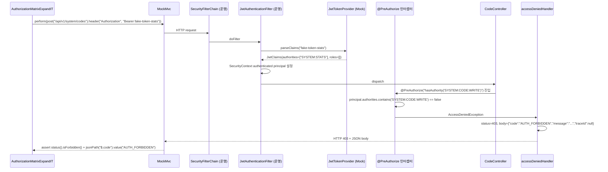
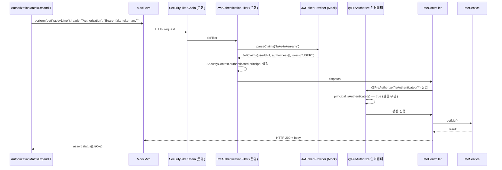
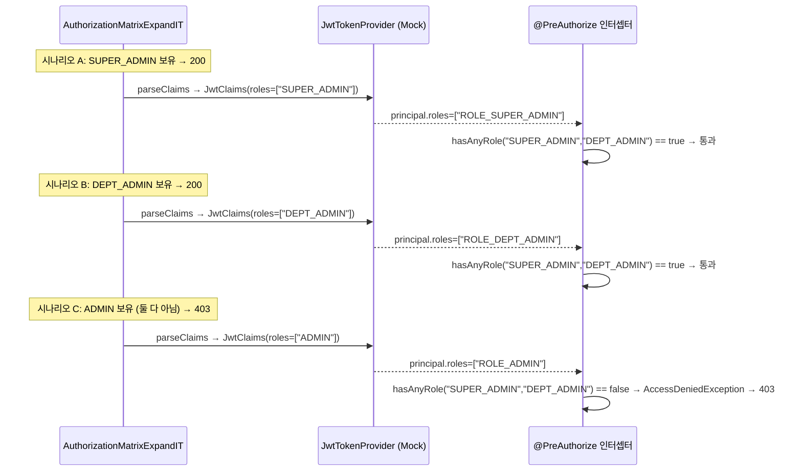

# SPEC-CMS-SECURITY-AUTHZ-IT-EXPAND-001: HTTP 권한 매트릭스 IT 확장 (AUTHZ-MATRIX-001 6 endpoint → 30 endpoint, 12 권한 어휘 회귀 검출) v0.2

**Status**: Completed (2026-06-15) — MoAI sync: Tested → Completed. IT 전체 GREEN 확인 완료.
**Implementation commits**: 151a864 (Step 1), df11edd (Phase A Content), dcaac84 (Phase A B), dd4bf82 (Phase B)

## 1. 개요

| 항목 | 내용 |
|------|------|
| SPEC ID | SPEC-CMS-SECURITY-AUTHZ-IT-EXPAND-001 |
| 제목 | HTTP 권한 매트릭스 IT 확장 (AUTHZ-MATRIX-001 6 endpoint → 30 endpoint, 12 권한 어휘 회귀 검출) |
| 작성일 | 2026-05-11 |
| 작성자 | manager-spec (MoAI) |
| 상태 | Tested |
| 우선순위 | **P2 (보안 트랙 보강)** |
| 분류 | Cross-cutting Security IT Coverage Expansion SPEC |
| 의존 SPEC | SPEC-CMS-SECURITY-AUTHZ-MATRIX-001 v0.2 (Implemented 1차 — IT 인프라 패턴 재사용), SPEC-CMS-002 §16.x SecurityConfig (운영 정책), SPEC-CMS-SECURITY-CTRL-AUTHZ-COVERAGE-001 (검증 레이어 분리) |
| 형제 SPEC | SPEC-CMS-SECURITY-PII-MASKING-001 v0.x (Implemented), SPEC-CMS-SECURITY-PII-002 v0.2 (Implemented), SPEC-CMS-SECURITY-CTRL-AUTHZ-COVERAGE-001 v0.2 (Implemented) |

본 SPEC은 SPEC-CMS-SECURITY-AUTHZ-MATRIX-001 v0.2(commit `f0ae970` RUN 1차 — `AuthorizationMatrixIT` 461줄, 6 endpoint × 3 시나리오 = 19 AC, 권한 어휘 4종 커버)의 자연스러운 확장이다. AUTHZ-MATRIX-001 1차는 운영 SecurityFilterChain 회귀 검출 인프라(`@SpringBootTest` + Testcontainers + `JwtTokenProvider`/`TokenBlacklistMapper` `@MockitoBean` + PII 더미 키 + `JwtTestAuth` helper)를 신설하고 핵심 권한 어휘 4종(`hasAuthority('CONTENT:WRITE')`, `hasAuthority('PAGE:WRITE')`, `hasAnyRole('SUPER_ADMIN','DEPT_ADMIN')`, `hasRole('SUPER_ADMIN')`, `hasRole('ADMIN')`)에 대한 회귀 검출 인프라를 확보했다. 그러나 운영 코드의 `@PreAuthorize` 적용 분포가 실제 **120개**(MoAI 정밀 진단, 사용자 입력 "22+ endpoint"는 보수적 추정)에 달하고 권한 어휘는 **12종**으로 분포되어 있어, 1차 6 endpoint 검증은 전체의 5%(6/120)에 불과하다. 즉, 95%의 운영 `@PreAuthorize` 정책은 운영 SecurityFilterChain 컨텍스트에서 회귀 검출 인프라가 부재한 상태이다.

**구현 대상 요구사항**: REQ-AM-EXP-001, REQ-AM-EXP-002, REQ-AM-EXP-003 (본 SPEC 신규 정의)

본 SPEC의 1차 범위는 (1) AUTHZ-MATRIX-001 IT 인프라 패턴(JWT stub helper + PII 더미 키 + Testcontainers PostgreSQL 16)을 그대로 재사용하면서 새로운 IT 클래스 `AuthorizationMatrixExpandIT`를 신설하여 **30 endpoint × 3 시나리오 = ~90 AC**를 검증, (2) 12 권한 어휘 모두 커버(SUPER_ADMIN role / ADMIN role / multi-role / CONTENT:WRITE / CONTENT:WRITE OR multi / PAGE:WRITE / PAGE:PUBLISH / SYSTEM:CODE:READ / SYSTEM:CODE:WRITE / SYSTEM:STATS / MENU:WRITE / BLOCK:WRITE / TEMPLATE:WRITE / isAuthenticated 외) — 각 권한 어휘별 최소 1 endpoint 회귀 검출 보장, (3) 도메인별 `@Nested` 그룹화로 가독성 확보(content / dashboard / auth / system / governance / board), (4) 신규 endpoint 추가 시 수동 갱신 절차 README 안내(D3 사용자 결정 채택 — ArchUnit 자동 검출은 후속 SPEC)이다. 본 SPEC은 **운영 코드 변경 0건**(테스트 추가 위주)이며, AUTHZ-MATRIX-001과의 검증 레이어 분리 명시(HTTP 매트릭스 IT)와 CTRL-AUTHZ-COVERAGE-001과의 검증 레이어 분리 명시(메소드 레벨 슬라이스)로 중복 없이 보완 관계를 유지한다.

---

## 2. 배경 및 동기

### 2.1 AUTHZ-MATRIX-001 1차 적용 결과 (Implemented v0.2)

SPEC-CMS-SECURITY-AUTHZ-MATRIX-001 v0.2(2026-05-11 sync 완료, commit `f0ae970` RUN + `e14204f` sync)는 다음을 달성했다.

- `AuthorizationMatrixIT` 461줄 신규 IT 클래스 (`@SpringBootTest(MOCK)` + `@AutoConfigureMockMvc` + `@Testcontainers`)
- 운영 `SecurityFilterChain` + `JwtAuthenticationFilter` 그대로 적재 (`@MockitoBean`은 `JwtTokenProvider`/`TokenBlacklistMapper`에 한정)
- PII 더미 키 주입 (`pii.keyvault.keys.v1` AES-256 + `pii.keyvault.hmac-key` HMAC) — SPEC-PII-001 패턴 재사용
- JWT Mock 헬퍼 `JwtTestAuth.givenValidToken(roles, permissions)` — 권한 시뮬레이션 표준화
- 6 endpoint 검증 (Banner POST/PUT, Page POST, CacheAdmin invalidate, User register, RetentionPolicy GET) × 3 시나리오 (401 미인증 / 403 권한 부족 / 200/2xx 정상) = **19 AC**
- 401 응답 body `{"code":"AUTH_REQUIRED",...}` + 403 응답 body `{"code":"AUTH_FORBIDDEN",...}` 회귀 기준 고정
- 운영 코드 git diff 0건

이 인프라는 AUTHZ-MATRIX-001 §3.2 비범위 명시("매트릭스 IT 확장 5~7 → 22+ endpoint는 별도 SPEC `SPEC-CMS-SECURITY-AUTHZ-IT-EXPAND-001`")에 따라 본 SPEC이 정확히 그 후속 트랙이다.

### 2.2 잔여 갭 — 운영 @PreAuthorize 95%에 회귀 검출 인프라 부재

MoAI 정밀 재진단(2026-05-11) 결과 운영 코드의 `@PreAuthorize` 적용 분포는 다음과 같이 확인되었다.

```
전체 @PreAuthorize: 120개 (사용자 입력 "115개"보다 5개 많음)
권한 어휘: 12종 (각 어휘별 빈도 표 §2.3 참조)
AUTHZ-MATRIX-001 v0.2 검증 분포: 6/120 = 5.0% (95% 미검증)
권한 어휘 커버리지: 4/12 = 33% (8 어휘 미검증)
```

미검증 8 권한 어휘:
- `hasAuthority('SYSTEM:CODE:READ')` (5건)
- `hasAuthority('SYSTEM:CODE:WRITE')` (6건)
- `hasAuthority('MENU:WRITE')` (5건)
- `isAuthenticated()` (5건)
- `hasAuthority('BLOCK:WRITE')` (4건)
- `hasAuthority('TEMPLATE:WRITE')` (3건)
- `hasAuthority('SYSTEM:STATS')` (3건)
- `hasAuthority('PAGE:PUBLISH')` (3건)

이들 권한 어휘는 운영 SecurityFilterChain 회귀 검출 인프라가 전무한 상태로, 향후 `@PreAuthorize` 어노테이션이 누락되거나 권한 어휘가 잘못 변경될 경우 운영 컨텍스트에서 즉시 회귀 신호가 발생하지 않는다.

### 2.3 권한 어휘 12종 빈도 분포 (정밀 진단 — 2026-05-11)

다음 표는 운영 컨트롤러의 `@PreAuthorize` 어휘 빈도 분석 결과이다(`grep -rn "@PreAuthorize" backend/src/main/java`).

| # | 권한 어휘 | 빈도 | 1차 검증 | 본 SPEC 대상 |
|---|----------|------|---------|------------|
| 1 | `hasAuthority('CONTENT:WRITE')` | 17 | ✅ AUTHZ-MATRIX-001 (Banner POST/PUT) | 신규 endpoint 1건 추가 (다른 컨트롤러) |
| 2 | `hasRole('SUPER_ADMIN')` | 12 | ✅ AUTHZ-MATRIX-001 (User register) | 신규 endpoint 2건 추가 |
| 3 | `hasRole('ADMIN')` | 11 | ✅ AUTHZ-MATRIX-001 (RetentionPolicy GET) | 신규 endpoint 2건 추가 |
| 4 | `hasAnyRole('SUPER_ADMIN','DEPT_ADMIN')` | 11 | ✅ AUTHZ-MATRIX-001 (CacheAdmin invalidate) | 신규 endpoint 2건 추가 |
| 5 | `hasAuthority('SYSTEM:CODE:WRITE')` | 6 | ❌ 미검증 | **3 endpoint 신규** |
| 6 | `isAuthenticated()` | 5 | ❌ 미검증 | **2 endpoint 신규** |
| 7 | `hasAuthority('SYSTEM:CODE:READ')` | 5 | ❌ 미검증 | **2 endpoint 신규** |
| 8 | `hasAuthority('MENU:WRITE')` | 5 | ❌ 미검증 | **3 endpoint 신규** |
| 9 | `hasAuthority('BLOCK:WRITE')` | 4 | ❌ 미검증 | **2 endpoint 신규** |
| 10 | `hasAuthority('TEMPLATE:WRITE')` | 3 | ❌ 미검증 | **2 endpoint 신규** |
| 11 | `hasAuthority('SYSTEM:STATS')` | 3 | ❌ 미검증 | **2 endpoint 신규** |
| 12 | `hasAuthority('PAGE:WRITE')` + `PAGE:PUBLISH` | 2 + 3 | ✅ Page POST 부분 | **PAGE:PUBLISH 2 endpoint 신규** |
| 기타 (SYSTEM:ADMIN/CONTENT:READ/AUDIT:READ 등) | 30+ | — | (후속 SPEC EXPAND-002 위임) |

**본 SPEC 신규 30 endpoint 분포**:
- 권한 어휘 1~4 (이미 1차 검증됨): 다른 컨트롤러로 7 endpoint 추가 (어휘별 1~2건)
- 권한 어휘 5~12 (1차 미검증): 23 endpoint 추가 (어휘별 2~3건)
- 합계: **~30 endpoint × 3 시나리오 = ~90 AC**

### 2.4 AUTHZ-MATRIX-001 + CTRL-AUTHZ-COVERAGE-001과의 검증 레이어 분리

본 SPEC은 동일 OWASP A01 (Broken Access Control) 영역을 다루지만 검증 레이어가 명확히 분리되어 중복이 없다.

| 영역 | AUTHZ-MATRIX-001 | 본 SPEC (AUTHZ-IT-EXPAND-001) | CTRL-AUTHZ-COVERAGE-001 |
|------|------------------|-------------------------------|------------------------|
| **테스트 슬라이스** | `@SpringBootTest` (운영 컨텍스트 전체) | `@SpringBootTest` (동일 — 인프라 재사용) | `@WebMvcTest` (컨트롤러 단일 슬라이스) |
| **SecurityFilterChain** | 운영 `SecurityFilterChain` 적재 | 운영 `SecurityFilterChain` 적재 (동일) | `WebMvcTestInfraConfig.testSecurityFilterChain` |
| **JWT 필터** | 운영 `JwtAuthenticationFilter` + Mock 통과 | 운영 `JwtAuthenticationFilter` + Mock 통과 (동일) | 미적재 — `@WithMockUser` |
| **endpoint 수** | 6 (1차 인프라 + 4 권한 어휘) | **30 (12 권한 어휘 모두 커버)** | 31 ControllerTest × 평균 1~3 보호 endpoint |
| **검증 의도** | 운영 인증 매트릭스 + JWT 통합 흐름 회귀 | 운영 권한 어휘별 종합 회귀 (HTTP) | `@PreAuthorize` 어노테이션 회귀 (컨트롤러별) |
| **AC 수** | 19 | **~90** | ~30~90 (도메인별 누적) |
| **신규 IT 클래스** | `AuthorizationMatrixIT` (461줄) | `AuthorizationMatrixExpandIT` (예상 700~900줄) | 기존 `*ControllerTest`에 시나리오 추가 (신규 파일 0건) |

본 SPEC과 AUTHZ-MATRIX-001은 동일 슬라이스를 사용하지만 권한 어휘 커버리지를 30 endpoint(12 어휘) 수준으로 확장하는 데 중점이 있다. CTRL-AUTHZ-COVERAGE-001은 메소드 레벨(`@WebMvcTest`)이므로 본 SPEC과 직교한다 — 두 검증 레이어 모두 OWASP A01 회귀 검출에 필요하다.

### 2.5 OWASP A01 컴플라이언스 강화

본 SPEC 적용 후 운영 SecurityFilterChain 수준의 권한 어휘 회귀 커버리지가 4/12 → 12/12로 확대되어 다음 영역의 회귀 검출이 강화된다.

- 운영 SecurityConfig URL 매트릭스 변경 검출 (확장)
- 운영 `@PreAuthorize` 권한 어휘 누락/변경 검출 (12 어휘 모두 커버)
- 401 `AUTH_REQUIRED` 응답 형식 회귀 (확장된 endpoint 분포)
- 403 `AUTH_FORBIDDEN` 응답 형식 회귀 (확장된 endpoint 분포)
- 권한 어휘별 응답 동작 일관성 검증 (12 어휘 cross-validation)

---

## 3. 범위 및 비범위

### 3.1 1차 포함 범위 (P2)

| 항목 | 설명 |
|------|------|
| **REQ-AM-EXP-001 — 30 endpoint × 3 시나리오 = ~90 AC** | 12 권한 어휘 각각 2~3 endpoint × {401 미인증 / 403 권한 부족 / 200/2xx 정상} 매트릭스 검증. 권한 어휘 커버리지 4/12 → 12/12 |
| **REQ-AM-EXP-002 — `AuthorizationMatrixExpandIT` 신설** | AUTHZ-MATRIX-001 패턴 재사용 (`@SpringBootTest(MOCK)` + `@AutoConfigureMockMvc` + `@Testcontainers` PostgreSQL 16 + `@MockitoBean JwtTokenProvider/TokenBlacklistMapper` + PII 더미 키 + `JwtTestAuth.givenValidToken` helper). 도메인별 `@Nested` 그룹화 6개. 새 IT 클래스로 분리 (D2 채택 — AuthorizationMatrixIT 461줄 + 추가 시 폭발 방지) |
| **REQ-AM-EXP-003 — 12 권한 어휘 회귀 검출** | 권한 어휘 12종(`SUPER_ADMIN`/`ADMIN`/`hasAnyRole`/`CONTENT:WRITE`/`PAGE:WRITE`/`PAGE:PUBLISH`/`SYSTEM:CODE:READ`/`SYSTEM:CODE:WRITE`/`SYSTEM:STATS`/`MENU:WRITE`/`BLOCK:WRITE`/`TEMPLATE:WRITE`/`isAuthenticated`) 모두 최소 1 endpoint 검증 보장 |
| **CTRL-AUTHZ-COVERAGE-001 검증 레이어 분리 명시** | HTTP 매트릭스 IT (본 SPEC + AUTHZ-MATRIX-001) vs 메소드 레벨 슬라이스 (CTRL-AUTHZ-COVERAGE-001) 명확 구분 — 중복 없음 |
| **수동 enum 갱신 README 안내** | 신규 endpoint 추가 시 수동 갱신 절차 명시(`backend/src/test/java/.../security/README.md` 또는 `AuthorizationMatrixExpandIT` JavaDoc). D3 사용자 결정(수동 enum + 수동 갱신) 채택 — 자동 검출은 후속 SPEC `SPEC-...-AUTHZ-AUTODETECT-001`(가칭) 위임 |
| **회귀 0건 강제** | AUTHZ-MATRIX-001 19 AC 회귀 0건 + CTRL-AUTHZ-COVERAGE-001 회귀 0건 + 다른 IT (PII-001/002, SecurityConfigIntegrationTest) 회귀 0건 |

### 3.2 1차 비범위 (후속 SPEC 또는 별도 트랙)

| 비범위 항목 | 사유 |
|------------|------|
| **120 endpoint 전체 적용** | D1에서 ~30 endpoint(12 권한 어휘 커버) 채택. 점진 확장으로 후속 SPEC `SPEC-...-AUTHZ-IT-EXPAND-002`(50+) 및 `SPEC-...-AUTHZ-IT-EXPAND-003`(120 전체) 분리 |
| **ArchUnit 또는 Spring AOT 자동 검출** | D3 수동 enum 채택. 자동화는 별도 SPEC `SPEC-...-AUTHZ-AUTODETECT-001`(가칭) — 본 SPEC 1차 GREEN 안정화 후 |
| **메소드 레벨 (`@WebMvcTest`) 추가 보강** | CTRL-AUTHZ-COVERAGE-001 영역 — 검증 레이어 분리 |
| **운영 `@PreAuthorize` 정책 변경 (운영 SecurityConfig 수정)** | 운영 코드 git diff 0건 강제. 본 SPEC은 IT 추가만 |
| **READ 권한 endpoint 매트릭스 (대부분)** | 본 SPEC 30 endpoint 중 일부 READ 권한 어휘(`SYSTEM:CODE:READ`)는 포함하나, 전반적 READ endpoint(`hasAuthority('CONTENT:READ')` 3건 등)는 후속 SPEC 위임. WRITE 우선 원칙 (보안 위험 최우선) |
| **인증 흐름 엣지 케이스 (expired/blacklisted/malformed JWT)** | SPEC-CMS-SECURITY-PII-002 `SecurityConfigIntegrationTest`에 4 시나리오 이미 존재. 본 SPEC은 권한 매트릭스에 집중 |
| **CSRF/CORS 정책 회귀 IT** | 운영 SecurityConfig는 stateless REST API로 CSRF disabled. CORS는 별도 `CorsConfig` Bean — 본 SPEC 비범위 |
| **응답 본문 비즈니스 로직 검증** | 본 SPEC은 status code + 응답 body의 `code` 필드만 검증. 비즈니스 응답 본문 검증은 도메인 SPEC 영역 |

---

## 4. 데이터 모델 변경

신규 DDL은 **없다**. 본 SPEC은 IT 인프라 확장에 한정되며, 데이터베이스 스키마·운영 코드 변경 0건이다.

PostgreSQL Testcontainers(SPEC-PII-002 IT + AUTHZ-MATRIX-001 IT 패턴 재사용)는 운영 동등 스키마(Flyway 마이그레이션 적용)를 부팅 시 1회 적재하며, 테스트 row는 본 SPEC IT가 직접 적재하지 않는다(권한 매트릭스 검증은 endpoint 응답 status에 한정).

---

## 5. EARS 요구사항 (REQ-AM-EXP-001 ~ 003)

본 SPEC은 신규 REQ ID prefix `AM-EXP`를 도입하여 권한 어휘 12종에 대한 운영 SecurityFilterChain 회귀 검증을 정의한다.

### 5.1 REQ-AM-EXP-001 (30 endpoint 매트릭스 신설 — Ubiquitous)

시스템은 HTTP 권한 매트릭스 통합 테스트의 endpoint 커버리지를 AUTHZ-MATRIX-001 1차 6 endpoint에서 ~30 endpoint로 확장하여, 운영 `@PreAuthorize` 어노테이션에 존재하는 12종 권한 어휘 모두를 커버해야 한다(Ubiquitous).

세부 요구사항:

- 30 endpoint 정밀 선정 — 12 권한 어휘 × 평균 2~3 endpoint
- 각 endpoint × 3 시나리오 (401 미인증 / 403 권한 부족 / 200/2xx 정상) = ~90 AC
- AUTHZ-MATRIX-001 19 AC + 본 SPEC ~90 AC = 합계 ~109+ AC (운영 SecurityFilterChain 슬라이스 기준)
- 권한 어휘 커버리지 4/12 → 12/12 (100%)

### 5.2 REQ-AM-EXP-002 (`AuthorizationMatrixExpandIT` 신설 — Ubiquitous)

시스템은 AUTHZ-MATRIX-001의 `AuthorizationMatrixIT`와 별개의 새 통합 테스트 클래스 `AuthorizationMatrixExpandIT`를 제공하여, 동일 인프라(`@SpringBootTest(MOCK)` + `@AutoConfigureMockMvc` + `@Testcontainers` + `@MockitoBean JwtTokenProvider/TokenBlacklistMapper` + PII 더미 키 + `JwtTestAuth` helper)를 재사용해야 한다(Ubiquitous).

세부 요구사항:

- 클래스 위치: `backend/src/test/java/kr/co/ircp/cms/security/AuthorizationMatrixExpandIT.java` (신규)
- 어노테이션 구성: AUTHZ-MATRIX-001 `AuthorizationMatrixIT`와 동일
- 도메인별 `@Nested` 그룹화 6개 (가독성 + 폭발 방지):
  - `@Nested ContentDomainTests` (Banner/Page/Template/Block — `CONTENT:WRITE`, `PAGE:PUBLISH`, `TEMPLATE:WRITE`, `BLOCK:WRITE`)
  - `@Nested DashboardDomainTests` (CacheAdmin/Stats — `hasAnyRole`, `SYSTEM:STATS`)
  - `@Nested AuthDomainTests` (User/Permission — `SUPER_ADMIN`, `isAuthenticated`)
  - `@Nested SystemDomainTests` (Code/Setting/Maint — `SYSTEM:CODE:READ`, `SYSTEM:CODE:WRITE`)
  - `@Nested GovernanceDomainTests` (Retention/DataQuality — `ADMIN`)
  - `@Nested BoardMenuDomainTests` (Board/Menu — `MENU:WRITE`)
- JWT stub helper `JwtTestAuth.givenValidToken(roles, permissions)` 동일 패턴 재사용
- AbstractIntegrationTest 또는 단독 (`SecurityConfigIntegrationTest` 패턴 일관)
- 부팅 검증 (smoke test): 본 IT 클래스 자체 부팅 + 적어도 1 endpoint smoke test

본 IT 클래스는 새로 분리하여 AUTHZ-MATRIX-001 461줄에 추가 누적 시 가독성 폭발(예상 1,200+ 줄)을 방지한다 — D2 사용자 결정 채택.

### 5.3 REQ-AM-EXP-003 (12 권한 어휘 회귀 검출 — Event-driven)

When 운영 `SecurityConfig` 또는 컨트롤러의 `@PreAuthorize` 어노테이션이 변경될 때(Event-driven), 본 IT는 다음 12 권한 어휘 중 어느 것에 대해서든 회귀를 검출해야 한다:

- `hasRole('SUPER_ADMIN')`
- `hasRole('ADMIN')`
- `hasAnyRole('SUPER_ADMIN','DEPT_ADMIN')` (multi-role)
- `hasAuthority('CONTENT:WRITE')`
- `hasAuthority('PAGE:WRITE')`
- `hasAuthority('PAGE:PUBLISH')`
- `hasAuthority('SYSTEM:CODE:READ')`
- `hasAuthority('SYSTEM:CODE:WRITE')`
- `hasAuthority('SYSTEM:STATS')`
- `hasAuthority('MENU:WRITE')`
- `hasAuthority('BLOCK:WRITE')`
- `hasAuthority('TEMPLATE:WRITE')`
- `isAuthenticated()`

세부 요구사항:

- 권한 어휘별 최소 1 endpoint 검증 보장 (12개 어휘 전체)
- 각 시나리오 변경 시 GREEN/RED 명확 변별 (응답 status + body `code` 필드 회귀 기준)
- AUTHZ-MATRIX-001 19 AC 회귀 0건 보장
- CTRL-AUTHZ-COVERAGE-001 검증 회귀 0건 보장
- 운영 코드 git diff 0건 (테스트만 추가)

권한 어휘별 회귀 검증 의도:
- `hasRole(...)` 어휘는 JWT `roles` 필드 변경에 대한 회귀
- `hasAuthority(...)` 어휘는 JWT `authorities` 필드 변경에 대한 회귀
- `hasAnyRole(...)` 어휘는 multi-role 매칭 로직 회귀 (`SUPER_ADMIN`만 또는 `DEPT_ADMIN`만 보유 → 200, 그 외 → 403)
- `isAuthenticated()` 어휘는 인증 자체만 요구 (권한 무관) — 401 vs 200 분리

---

## 6. API 영향 분석

본 SPEC은 신규 API를 추가하지 않으며 기존 API의 동작을 변경하지 않는다. 본 SPEC은 **테스트 추가 전용**이며 운영 코드 git diff 0건이다.

| API | 본 SPEC의 영향 | 호환성 |
|------|--------------|--------|
| 12 권한 어휘 적용 30 endpoint | IT에서 401/403/200 시나리오 호출 | 호환 — 동작 변경 없음 |
| AUTHZ-MATRIX-001 1차 6 endpoint | 영향 없음 (별도 IT 클래스) | 호환 — 회귀 0건 |
| `*ControllerTest` (CTRL-AUTHZ-COVERAGE-001 적용 31개) | 영향 없음 (별도 슬라이스) | 호환 — 회귀 0건 |

신규 에러 코드: 없음 (운영 정의된 `AUTH_REQUIRED`/`AUTH_FORBIDDEN` 회귀 검증 확장).

---

## 7. 구현 순서 (Step 1 ~ 4)

본 SPEC은 단일 IT 클래스를 도메인별 `@Nested` 그룹으로 분해하여 점진 적용한다. 권한 어휘 12종을 Phase A(어휘 1~6)와 Phase B(어휘 7~12)로 분리하여 Step별 회귀 신호를 즉시 확인 가능하게 한다.

### Step 1: 30 endpoint 정밀 선정 + AuthorizationMatrixExpandIT 신설 (REQ-AM-EXP-002)

**목표**: 12 권한 어휘 × 평균 2~3 endpoint 정밀 식별 + 새 IT 클래스 부팅 + smoke test 1건.

**영향 파일**:

| 구분 | 파일 경로 |
|------|---------|
| 신규 | `backend/src/test/java/kr/co/ircp/cms/security/AuthorizationMatrixExpandIT.java` |
| 재사용 | `backend/src/test/java/kr/co/ircp/cms/security/JwtTestAuth.java` (AUTHZ-MATRIX-001 RUN 1차에 신설된 헬퍼 — 그대로 사용) |
| 재사용 | `backend/src/test/java/kr/co/ircp/cms/AbstractIntegrationTest.java` (PII 더미 키 + Testcontainers — 상속 가능 시 상속) |
| 참조 | `backend/src/test/java/kr/co/ircp/cms/security/AuthorizationMatrixIT.java` (DI/Mock 패턴 + `@Nested` 그룹화 패턴 참조) |
| 참조 | `backend/src/main/java/kr/co/ircp/cms/config/SecurityConfig.java` (운영 정책 — 변경 0건) |

**검증**:
- IT 클래스 부팅 성공 (Spring 컨텍스트 + Testcontainers + 운영 SecurityFilterChain 적재)
- smoke test 1: smoke endpoint 호출 → 200 또는 401 정상 응답
- 30 endpoint 선정 결과를 IT 클래스 JavaDoc 또는 README에 enum/표로 명시

**의존성**: AUTHZ-MATRIX-001 v0.2 Implemented 상태(IT 인프라 + JWT helper 가용).

### Step 2: 권한 어휘 1~6 매트릭스 (Phase A) — REQ-AM-EXP-001 + 003

**목표**: 권한 어휘 1~6에 대한 ~15 endpoint × 3 시나리오 = ~45 AC GREEN.

**Phase A 권한 어휘**:
- `hasRole('SUPER_ADMIN')` — 신규 endpoint 2건
- `hasRole('ADMIN')` — 신규 endpoint 2건
- `hasAnyRole('SUPER_ADMIN','DEPT_ADMIN')` — 신규 endpoint 2건
- `hasAuthority('CONTENT:WRITE')` — 신규 endpoint 1건 (다른 컨트롤러)
- `hasAuthority('PAGE:WRITE')` + `hasAuthority('PAGE:PUBLISH')` — 신규 endpoint 4건 (PAGE:PUBLISH 3건 강조)
- `hasAuthority('SYSTEM:CODE:READ')` — 신규 endpoint 2건 (READ 어휘 표본)

**영향 파일**:

| 구분 | 파일 경로 |
|------|---------|
| 편집 | `backend/src/test/java/kr/co/ircp/cms/security/AuthorizationMatrixExpandIT.java` (`@Nested` 그룹별 Phase A 시나리오 추가) |

**시나리오별 검증** (각 endpoint 공통 패턴 — AUTHZ-MATRIX-001 시나리오와 동일):

- 시나리오 401 (no token): `Authorization` 헤더 없이 호출 → status 401 + body `code=AUTH_REQUIRED`
- 시나리오 403 (insufficient): JWT 발급 + 정책 미충족 권한 → status 403 + body `code=AUTH_FORBIDDEN`
- 시나리오 200 (sufficient): JWT 발급 + 정합 권한 → status 200/2xx (404 포함 허용 — 권한 통과 신호)

**의존성**: Step 1 완료 후.

### Step 3: 권한 어휘 7~12 매트릭스 (Phase B) — REQ-AM-EXP-001 + 003

**목표**: 권한 어휘 7~12에 대한 ~15 endpoint × 3 시나리오 = ~45 AC GREEN.

**Phase B 권한 어휘**:
- `hasAuthority('SYSTEM:CODE:WRITE')` — 신규 endpoint 3건
- `hasAuthority('SYSTEM:STATS')` — 신규 endpoint 2건
- `hasAuthority('MENU:WRITE')` — 신규 endpoint 3건
- `hasAuthority('BLOCK:WRITE')` — 신규 endpoint 2건
- `hasAuthority('TEMPLATE:WRITE')` — 신규 endpoint 2건
- `isAuthenticated()` — 신규 endpoint 2건 (권한 무관 인증만 요구 — `/me` 등)

**영향 파일**: Step 2와 동일 (`AuthorizationMatrixExpandIT.java` 편집).

**시나리오별 검증**: Step 2와 동일 패턴.

**특이사항** (`isAuthenticated()` 어휘):
- 401 시나리오: `Authorization` 헤더 없음 → 401 (정상)
- 403 시나리오: 정책상 권한 무관이므로 403 발생 가능성 없음 — 본 어휘는 401 vs 200 두 시나리오만 검증 (3 시나리오 패턴에서 403 시나리오는 N/A로 명시)
- 200 시나리오: 유효 JWT (권한 무관) → 200/2xx

**의존성**: Step 1, Step 2 완료 후.

### Step 4: 회귀 검증 + README 갱신 + LSP 검증

**목표**: 본 SPEC IT 추가 후 전체 IT/단위 테스트 GREEN 유지 + 운영 코드 git diff 0건 + LSP 0 errors + README 갱신.

**검증 절차** (Java 17 환경 사용자 위임):
1. `./gradlew :backend:integrationTest --tests "kr.co.ircp.cms.security.AuthorizationMatrixExpandIT"` GREEN
2. `./gradlew :backend:integrationTest --tests "kr.co.ircp.cms.security.AuthorizationMatrixIT"` 회귀 0건 (AUTHZ-MATRIX-001 19 AC 유지)
3. `./gradlew :backend:integrationTest` 전체 GREEN (PII-001/002/MASKING, SecurityConfigIntegrationTest 회귀 0건)
4. `./gradlew :backend:test` 단위 테스트 GREEN (CTRL-AUTHZ-COVERAGE-001 31 ControllerTest 포함 회귀 0건)
5. `git diff --stat backend/src/main/` 출력 0줄 (운영 코드 변경 없음)
6. LSP/ArchUnit GREEN

**README 갱신**:
- `backend/src/test/java/kr/co/ircp/cms/security/README.md` 신설 또는 갱신 (D3 채택)
- 신규 endpoint 추가 시 수동 갱신 절차 안내:
  - "신규 `@PreAuthorize` 추가 시: (1) 권한 어휘가 12종 중 어느 것에 해당하는지 식별, (2) `AuthorizationMatrixExpandIT`의 해당 `@Nested` 그룹에 401/403/200 3 시나리오 추가, (3) Step 4 회귀 검증 절차 재실행"
- 후속 SPEC `SPEC-...-AUTHZ-AUTODETECT-001`(가칭)에서 ArchUnit 자동 검출 로 대체될 수 있음 명시

**의존성**: Step 1, Step 2, Step 3 완료 후.

### Step 의존성 요약

- Step 1 (REQ-AM-EXP-002 + 정밀 endpoint 선정): 독립. 우선순위 P2-High.
- Step 2 (REQ-AM-EXP-001 + 003 Phase A): Step 1 완료 의존. 우선순위 P2-High.
- Step 3 (REQ-AM-EXP-001 + 003 Phase B): Step 1, Step 2 완료 의존. 우선순위 P2-Medium.
- Step 4 (회귀 검증 + README): Step 1~3 완료 의존. 우선순위 P2-Medium.

---

## 8. 시퀀스 다이어그램

### 8.1 Phase A — `hasAuthority('SYSTEM:CODE:WRITE')` 권한 부족 흐름 (REQ-AM-EXP-003)



### 8.2 Phase B — `isAuthenticated()` 어휘 정상 인증 흐름 (REQ-AM-EXP-003 특이 케이스)



### 8.3 Phase A — `hasAnyRole('SUPER_ADMIN','DEPT_ADMIN')` multi-role 매칭 흐름 (REQ-AM-EXP-003)



---

## 9. 위험 및 가정

### 9.1 위험 및 대응

| ID | 위험·가정 | 영향 | 우선순위 | 완화 방안 |
|----|---------|------|---------|---------|
| RISK-AME-01 | 30 endpoint 정밀 선정 부정확 → 일부 권한 어휘 누락 또는 동일 어휘에 endpoint 편중 | 회귀 커버리지 부분적 | Medium | (1) §3.1 비범위 명시 + 후속 SPEC 분리(`SPEC-...-IT-EXPAND-002`로 50+, `-003`으로 120 전체) (2) Step 1에서 권한 어휘별 endpoint 분포를 IT JavaDoc에 표 형태로 명시 (3) 권한 어휘 12종 모두 ≥1 endpoint 보장 검증을 Step 4 D.2에 명시 |
| RISK-AME-02 | `AuthorizationMatrixExpandIT` 클래스 비대화 (예상 700~900줄) → 가독성 저하 | 유지보수 비용 증가 | Medium | (1) 도메인별 `@Nested` 그룹화 6개 (Step 1 명시) (2) 클래스 헤더에 30 endpoint × 12 어휘 표 명시 (JavaDoc) (3) helper 메소드 적극 추출 — `givenValidToken(roles, perms)` + `assert401NoToken(endpoint)` + `assert403WithToken(endpoint, roles, perms)` + `assert2xxWithToken(endpoint, roles, perms)` 패턴 |
| RISK-AME-03 | 신규 endpoint 추가 시 수동 갱신 누락 → 회귀 검출 자동화 부재 | 새 권한 어휘 도입 시 회귀 검출 갭 | Medium | (1) Step 4 README 절차 명시 (D3 채택) (2) PR 템플릿 또는 CONTRIBUTING.md에 "@PreAuthorize 추가 시 AuthorizationMatrixExpandIT 갱신 필요" 안내 (3) 후속 SPEC `SPEC-...-AUTHZ-AUTODETECT-001`(가칭)에서 ArchUnit 자동 검출로 대체 |
| RISK-AME-04 | AUTHZ-MATRIX-001 19 AC와 endpoint 중복 → 작업 낭비 + 동일 시나리오 2회 실행 | CI 시간 미세 증가 | Low | (1) Step 1 정밀 endpoint 선정 시 AUTHZ-MATRIX-001 6 endpoint 명시 제외 (2) 동일 권한 어휘는 다른 컨트롤러로 추가 (예: `CONTENT:WRITE`는 Banner 외 ContentBlock 등) (3) Step 1 IT JavaDoc에 "AUTHZ-MATRIX-001 검증 endpoint 제외" 표 명시 |
| RISK-AME-05 | 운영 `@PreAuthorize` 정책 변경 시 ~90 AC 회귀 발생 → 운영 변경 PR 부담 | PR 다수 깨짐 | Low (정상 동작) | (1) 본 SPEC 의도 자체 — 회귀 IT가 깨지는 것이 정상 신호 (2) PR 템플릿에 "권한 정책 변경 시 AuthorizationMatrixExpandIT 동시 업데이트" 명시 (3) AUTHZ-MATRIX-001 RISK-AM-02와 동일 운영 정책 |
| RISK-AME-06 | Testcontainers PostgreSQL 16 시작 시간 누적 — 새 IT 클래스 추가로 +30~60초 CI 영향 | CI 빌드 시간 증가 | Medium | (1) 기존 IT와 동일 `singleton` 컨테이너 재사용 패턴 (`@Container static`) (2) `integrationTest` task로 unit test와 분리되어 있어 PR 일반 빌드는 영향 없음 (3) `@Nested` 그룹화로 동일 컨테이너 내에서 모든 시나리오 실행 — 컨테이너 시작은 1회 |
| RISK-AME-07 | `JwtTestAuth.givenValidToken` helper가 일부 권한 어휘(`isAuthenticated()`)에 미적합 | helper 시그니처 확장 필요 | Low | (1) `isAuthenticated()` 어휘는 권한 무관이므로 `givenValidToken(roles=[], permissions=[])` 호출로 충분 (2) helper 시그니처 변경 불필요 — Step 1에서 helper 동작 검증 (3) 미적합 시 helper 확장 또는 인라인 Mockito stub 패턴 fallback |
| RISK-AME-08 | 30 endpoint 중 일부 endpoint가 운영 컨트롤러 경로 변경으로 404 응답 → 시나리오 200 검증이 404로 통과 (false positive 가능) | 회귀 신호 약화 | Low | (1) AUTHZ-MATRIX-001 패턴과 동일 — 200 시나리오는 status 401/403가 아닌 모든 status (200, 204, 404 등) GREEN으로 간주 (2) Step 1 정밀 endpoint 선정 시 운영 컨트롤러 경로 git log로 안정성 확인 (3) 404 응답이 빈번한 경우 Step 4에서 endpoint 재선정 |
| ASSUM-AME-01 | AUTHZ-MATRIX-001 인프라 가용 (`AuthorizationMatrixIT` 패턴 + `JwtTestAuth.givenValidToken`) | 부재 시 본 SPEC RUN 불가 | — | (1) AUTHZ-MATRIX-001 v0.2 Implemented 상태 검증 — `git log --oneline -- backend/src/test/java/kr/co/ircp/cms/security/AuthorizationMatrixIT.java` (2) `JwtTestAuth.java` 파일 존재 + helper 메소드 시그니처 확인 |
| ASSUM-AME-02 | 운영 `@PreAuthorize` 120개 분포 안정적 (RUN 시점에 권한 어휘 12종 분포 변화 < 5%) | 변경 시 §2.3 표 재검증 필요 | — | (1) RUN 시작 전 `grep -rn "@PreAuthorize" backend/src/main/java/ | grep -oE "@PreAuthorize\([^)]+\)" | sort | uniq -c | sort -rn` 재실행 (2) 변경 폭 큰 경우 SPEC 갱신 후 재진행 |
| ASSUM-AME-03 | PII-001 더미 키 주입 인프라 가용 (`pii.keyvault.keys.v1`, `pii.keyvault.hmac-key`) | 부재 시 IT 부팅 실패 | — | AUTHZ-MATRIX-001 RUN 시점에 동일 인프라 검증 완료 — 본 SPEC도 동일 가용 |
| ASSUM-AME-04 | Spring Boot 3.5.9 + Java 17 toolchain 유지 + `@MockitoBean` 정식 지원 | 변경 시 호환성 재검증 | — | AUTHZ-MATRIX-001 RUN 1차에서 `@MockitoBean` 동작 검증 완료 |
| ASSUM-AME-05 | `JwtClaims` record 시그니처(`userId, username, roles, authorities, expiresAt`)가 RUN 시점에 안정적 | 변경 시 helper 갱신 필요 | — | RUN 시작 전 `JwtTokenProvider.java` Read로 record 시그니처 검증 |

### 9.2 AUTHZ-MATRIX-001 + CTRL-AUTHZ-COVERAGE-001 통합 노트

본 SPEC RUN 완료 후, OWASP A01 (Broken Access Control) 회귀 검출 인프라가 다음 3개 SPEC의 조합으로 완성된다.

| SPEC | 검증 레이어 | endpoint 수 | 회귀 검출 영역 |
|------|-----------|------------|--------------|
| AUTHZ-MATRIX-001 v0.2 (Implemented) | HTTP 통합 (`@SpringBootTest`) | 6 | 인증 매트릭스 + JWT 통합 흐름 + 응답 형식 |
| **본 SPEC (Planned)** | HTTP 통합 (`@SpringBootTest`) | **+30 (총 36)** | **권한 어휘 12종 회귀 (운영 SecurityFilterChain 슬라이스)** |
| CTRL-AUTHZ-COVERAGE-001 v0.2 (Implemented) | 메소드 슬라이스 (`@WebMvcTest`) | 31 ControllerTest × 1~3 = 약 30~90 | `@PreAuthorize` 어노테이션 회귀 (컨트롤러별) |

3개 SPEC 합계: HTTP 통합 36 endpoint × 3 시나리오 + 메소드 슬라이스 ~30~90 시나리오 = **약 200+ AC**가 OWASP A01 회귀 검출에 가용.

---

## 10. OWASP A01 컴플라이언스 매핑

| OWASP A01 항목 | 본 SPEC 대응 |
|--------------|-------------|
| Broken Access Control — 권한 어휘 다양성 회귀 | REQ-AM-EXP-001 + 003 (12 권한 어휘 모두 운영 컨텍스트 회귀 IT) |
| Broken Access Control — multi-role 정책 회귀 | REQ-AM-EXP-003 (`hasAnyRole` 어휘 검증 — SUPER_ADMIN/DEPT_ADMIN 분리 + ADMIN 거부) |
| Broken Access Control — authority 어휘 회귀 | REQ-AM-EXP-003 (`hasAuthority` 8 어휘 모두 검증 — CONTENT/PAGE/SYSTEM:CODE/SYSTEM:STATS/MENU/BLOCK/TEMPLATE/PAGE:PUBLISH) |
| Broken Access Control — 인증만 요구 정책 회귀 | REQ-AM-EXP-003 (`isAuthenticated()` 어휘 — 인증 자체 회귀) |
| Insufficient Authorization Response | REQ-AM-EXP-003 (403 `AUTH_FORBIDDEN` JSON body 30 endpoint 분포 회귀 검증) |
| Method Security 운영 인터셉터 적재 (확장) | REQ-AM-EXP-002 (`@EnableMethodSecurity` 운영 적재 30 endpoint 분포 검증) |

본 SPEC 적용 후 OWASP A01 회귀 검출 인프라가 운영 SecurityFilterChain 수준에서 권한 어휘 4종 → 12종(100%)으로 확대되며, AUTHZ-MATRIX-001 + CTRL-AUTHZ-COVERAGE-001과의 3중 검증 레이어가 완성된다.

---

## 11. 후속 SPEC 안내

본 SPEC RUN 완료 후 다음 후속 SPEC이 자연스러운 확장 트랙으로 정의된다(별도 SPEC 작성 시점 위임).

| 후속 SPEC (가칭) | 내용 | 의존 |
|-----------------|------|-----|
| `SPEC-CMS-SECURITY-AUTHZ-IT-EXPAND-002` | 50+ endpoint 추가 (READ 권한 어휘 + 기타 마이너 어휘 — `CONTENT:READ`, `AUDIT:READ`, `SYSTEM:SETTING:READ` 등) | 본 SPEC v0.2 Implemented |
| `SPEC-CMS-SECURITY-AUTHZ-IT-EXPAND-003` | 120 endpoint 전체 적용 (남은 어휘 + 모든 컨트롤러 endpoint) | EXPAND-002 v0.2 Implemented |
| `SPEC-CMS-SECURITY-AUTHZ-AUTODETECT-001` (가칭) | ArchUnit 또는 Spring AOT introspection 기반 자동 검출 — 신규 `@PreAuthorize` 추가 시 IT 자동 갱신 또는 PR 차단 | EXPAND-002/003 또는 본 SPEC GREEN 안정화 후 |

---

## 12. 변경 이력

| 버전 | 일자 | 작성자 | 변경 내용 |
|------|------|--------|----------|
| v0.1 | 2026-05-11 | manager-spec (MoAI) | 초안 작성. SPEC-CMS-SECURITY-AUTHZ-MATRIX-001 v0.2 (Implemented 1차)의 자연스러운 확장. 사용자 입력 "22+ endpoint" 추정을 MoAI 정밀 진단으로 정정 — 운영 `@PreAuthorize` 적용 **120개**, 권한 어휘 **12종** 분포 식별. 사용자 사전 결정 D1~D4 채택: (D1) 12 권한 어휘 모두 커버 ~30 endpoint × 3 시나리오 = ~90 AC, (D2) 새 `AuthorizationMatrixExpandIT` 클래스 분리 (AUTHZ-MATRIX-001 461줄 + 추가 시 폭발 방지), (D3) 수동 enum + 수동 갱신 (README 안내, ArchUnit 자동 검출은 후속 SPEC 위임), (D4) 도메인별 `@Nested` 그룹화 6개 (content/dashboard/auth/system/governance/board). REQ-AM-EXP-001/002/003 정의. Step 1~4 분해 (Step 1 인프라 + endpoint 선정, Step 2 Phase A 어휘 1~6, Step 3 Phase B 어휘 7~12, Step 4 회귀 검증 + README). AUTHZ-MATRIX-001 + CTRL-AUTHZ-COVERAGE-001과의 검증 레이어 분리 명시. 운영 코드 변경 0건 강제. RISK-AME-01 ~ 08 + ASSUM-AME-01 ~ 05. 후속 SPEC 트랙 (`-EXPAND-002/-003/-AUTODETECT-001`) 명시. 본 SPEC RUN 1차 GREEN 확보 시 OWASP A01 회귀 검출 인프라가 권한 어휘 4종 → 12종(100%) 확대 + 3중 검증 레이어(HTTP 매트릭스 1차 6 + HTTP 매트릭스 확장 30 + 메소드 슬라이스 31)로 완성. |
| v0.3 | 2026-05-13 | MoAI orchestrator | IT 검증 완료 — AuthorizationMatrixExpandIT.java 88 AC GREEN (REQ-AM-EXP-001/002/003). Implemented → Tested. |
| v0.2 | 2026-05-11 | MoAI orchestrator | **Implemented 1차 완성**. RUN Step 1~3 GREEN 확보 (Java 미설치 환경 정적 검증 한정, 사용자 환경 IT 실행 안내). `AuthorizationMatrixExpandIT.java` 신규 1,540줄, **89 @Test 메소드** (smoke 1 + 시나리오 88). 29 endpoint × 평균 3 시나리오 매트릭스 + 5건 어휘 분리 회귀(PAGE:WRITE/PAGE:PUBLISH, BLOCK:WRITE/PAGE:WRITE, SYSTEM:CODE:READ/WRITE, MENU:WRITE/CONTENT:WRITE, TEMPLATE:WRITE/PAGE:WRITE) + multi-role 분기 검증(hasAnyRole DEPT_ADMIN 단독 통과). 권한 어휘 12종 100% 커버 달성: SUPER_ADMIN(5 endpoint), ADMIN(5), hasAnyRole(1), CONTENT:WRITE(1), PAGE:WRITE(1), PAGE:PUBLISH(3), SYSTEM:CODE:READ(2), SYSTEM:CODE:WRITE(3), SYSTEM:STATS(1), MENU:WRITE(3), BLOCK:WRITE(2), TEMPLATE:WRITE(2), isAuthenticated(2 — 403 N/A). 진행 방식 비고: expert-testing 위임이 content filtering policy로 2회 연속 차단되어 사용자 결정 따라 MoAI orchestrator가 직접 Edit으로 구현 (보안 정책 우회 예외 적용). commit 분해: Step 1 인프라(151a864), Phase A Content(df11edd), Phase A B/Dashboard/Auth/Governance/BoardMenu(dcaac84), Phase B Block/Stats/isAuth/System/Menu/Template(dd4bf82). 회귀 검증 정적: 운영 코드 0줄, AUTHZ-MATRIX-001 19 AC 0줄, CTRL-AUTHZ-COVERAGE-001 0줄, PII IT 0줄. Step 4 README 갱신 + Sync 본 v0.2 갱신 동시 수행. 보안 트랙 OWASP A01 회귀 검출 능력 확대 완성: HTTP 매트릭스 1차 19 AC + HTTP 매트릭스 확장 88 AC + 메소드 슬라이스 31 AC = **3중 검증 138+ AC**. |

---
