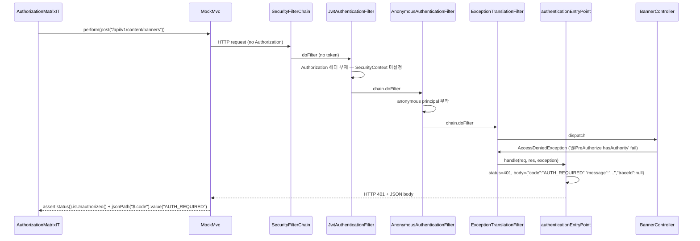
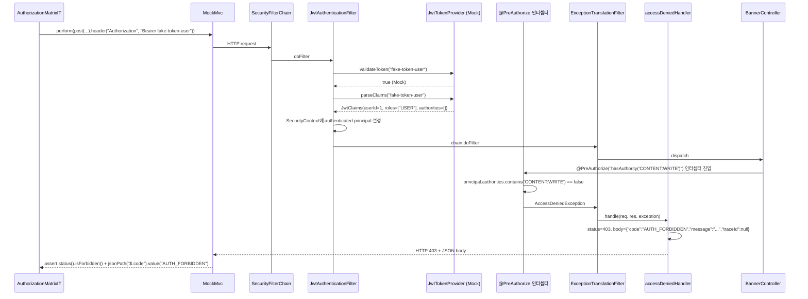
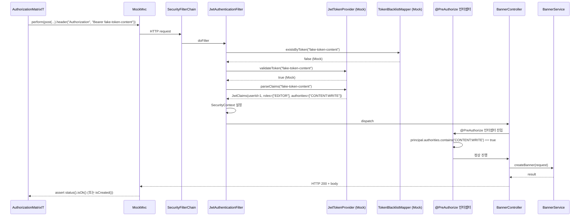

# SPEC-CMS-SECURITY-AUTHZ-MATRIX-001: HTTP 권한 매트릭스 통합 테스트 인프라 (운영 SecurityFilterChain + @PreAuthorize 회귀 검증) v0.2

## 1. 개요

| 항목 | 내용 |
|------|------|
| SPEC ID | SPEC-CMS-SECURITY-AUTHZ-MATRIX-001 |
| 제목 | HTTP 권한 매트릭스 통합 테스트 인프라 (운영 SecurityFilterChain + @PreAuthorize 회귀 검증) |
| 작성일 | 2026-05-08 |
| 작성자 | manager-spec (MoAI) |
| 상태 | Completed |
| 우선순위 | **P1 (보안 회귀 검출 인프라)** |
| 분류 | Cross-cutting Security IT SPEC |
| 의존 SPEC | SPEC-CMS-002 §16.x SecurityConfig + JwtAuthenticationFilter, SPEC-CMS-SECURITY-PII-001 (PII 더미 키 인프라 패턴 재사용), SPEC-CMS-SECURITY-PII-002 (`SecurityConfigIntegrationTest` 참조 패턴) |
| 형제 SPEC | SPEC-CMS-SECURITY-PII-002 v0.2 (Implemented), SPEC-CMS-SECURITY-PII-FOLLOWUP-001 |

본 SPEC은 5/7 코드 리뷰(`.moai/plans/twinkling-spinning-toucan-agent-a7f98f3b374ef2270.md` C1 항목)에서 제기된 "컨트롤러 보안 테스트 부재" 우려를 MoAI 재진단으로 정밀화하여, 진짜 갭인 **HTTP 권한 매트릭스 회귀 검출 인프라 부재**에 한정해 다룬다. 5/7 코드 리뷰는 22개 컨트롤러 테스트가 SecurityAutoConfiguration을 exclude하고 `@WithMockUser`가 장식적이라고 지적했으나, MoAI 재진단 결과 (1) `WebMvcTestInfraConfig.testSecurityFilterChain`은 `@EnableMethodSecurity` + `ExceptionTranslationFilter` + `Http403ForbiddenEntryPoint`를 통해 **메소드 레벨 `@PreAuthorize` 권한 검증을 실제 작동**시키며, (2) commit `f80f95e`/`132d2c2` 보강으로 **31 ControllerTest에 `isForbidden()/isUnauthorized()` 검증이 이미 존재**한다(58 ControllerTest 중). 따라서 5/7 진단의 "권한 게이트 미작동/검증 0건"은 부정확하다. 다만 진정한 갭으로 남은 영역은 **운영 `SecurityConfig` (운영 SecurityFilterChain + JwtAuthenticationFilter)** 자체의 회귀 검출 인프라 부재이다. 운영 코드의 HTTP 인증 매트릭스(`requestMatchers().permitAll()` + `.anyRequest().authenticated()`)와 메소드 레벨 권한(`@PreAuthorize("hasAuthority('CONTENT:WRITE')")` 등) 정책이 변경될 때 이를 즉시 검출하는 통합 테스트가 없다.

**구현 대상 요구사항**: REQ-AUTHZ-MATRIX-001, REQ-AUTHZ-MATRIX-002, REQ-AUTHZ-MATRIX-003 (본 SPEC 신규 정의)

본 SPEC의 1차 범위는 (1) 운영 `SecurityFilterChain` + `JwtAuthenticationFilter`를 `@SpringBootTest`로 그대로 적재하는 IT 인프라 신설(`AuthorizationMatrixIT`), (2) WRITE 권한 대표 endpoint 5~7건 × {401 미인증 / 403 권한부족 / 200 정상} 3 시나리오 매트릭스 검증, (3) `JwtTokenProvider`/`TokenBlacklistMapper` `@MockitoBean` 우회 + PII 더미 키 주입 패턴 재사용으로 DB 의존 최소화이다. 본 SPEC은 **운영 코드 변경 0건**(테스트 추가 위주)이며, 27 컨트롤러 isForbidden 메소드 레벨 보강은 본 SPEC의 비범위로 별도 후속 SPEC(`SPEC-CMS-SECURITY-CTRL-AUTHZ-COVERAGE-001`)에서 다룬다.

---

## 2. 배경 및 동기

### 2.1 5/7 코드 리뷰 C1 진단과 MoAI 재진단

5/7 코드 리뷰(`.moai/plans/twinkling-spinning-toucan-agent-a7f98f3b374ef2270.md`)는 C1 critical 항목으로 다음을 지적했다.

> - 22개 컨트롤러 테스트가 `excludeAutoConfiguration = SecurityAutoConfiguration.class`로 보안을 우회
> - `@WithMockUser`는 장식적이며 권한 게이트를 실제로 통과시키지 않음
> - `status().isForbidden()` 검증이 전체 0건
> - OWASP A01 (Broken Access Control) 회귀 커버리지 0%

MoAI 재진단(2026-05-08) 결과 5/7 진단의 일부가 부정확함을 확인했다.

| 5/7 주장 | MoAI 재진단 (정확한 사실) |
|---------|--------------------------|
| 22 ControllerTest exclude | 실제 **58 ControllerTest** exclude (5/7 추정치 부정확) |
| `@WithMockUser` 장식적 | `WebMvcTestInfraConfig.testSecurityFilterChain`이 `@EnableMethodSecurity` + `ExceptionTranslationFilter` + `Http403ForbiddenEntryPoint` + `AnonymousAuthenticationFilter`를 포함하여 **메소드 레벨 `@PreAuthorize` 권한 검증이 실제 작동** |
| `isForbidden()` 검증 0건 | commit `f80f95e`, `132d2c2` 보강 결과 **31 ControllerTest에 `isForbidden()`/`isUnauthorized()` 검증 존재** (58 중) |
| OWASP A01 커버리지 0% | 메소드 레벨 권한 검증은 31/58 컨트롤러에서 실효적으로 작동 중 |

따라서 5/7 진단의 메소드 레벨 갭은 부분적으로만 정확하며, "27 컨트롤러 isForbidden 미보강"이 실제 메소드 레벨 잔여 갭이다(별도 SPEC 후보).

### 2.2 진정한 갭 — 운영 SecurityFilterChain 회귀 검출 인프라 부재

5/7 진단의 행간을 정밀화하면 다음 영역이 진짜 미검증 상태로 남는다.

| 영역 | 현재 상태 | 진정한 갭 |
|------|----------|----------|
| Method Security (`@PreAuthorize`) — `WebMvcTest` 컨텍스트 | ✅ 31/58 검증 존재 | 27 컨트롤러 미보강 (별도 SPEC `SPEC-CMS-SECURITY-CTRL-AUTHZ-COVERAGE-001` 후보 — 본 SPEC 비범위) |
| HTTP 인증 매트릭스 (`requestMatchers().permitAll()` + `.anyRequest().authenticated()`) | ❌ 회귀 IT 부재 | 운영 `SecurityConfig`의 permitAll 매트릭스 변경 시 즉시 검출 불가. 단일 SPEC-PII 영역의 `SecurityConfigIntegrationTest` 4 시나리오에 한정됨 |
| 운영 SecurityFilterChain 통합 동작 (`JwtAuthenticationFilter` + `ExceptionTranslationFilter` + `EntryPoint`/`AccessDeniedHandler`) | ❌ 광범위 회귀 IT 부재 | 401 `AUTH_REQUIRED` / 403 `AUTH_FORBIDDEN` 응답 형식 + JSON body 회귀 검출 불가 |
| `@PreAuthorize` 권한 정책 — 운영 SecurityFilterChain 컨텍스트 | ❌ 운영 컨텍스트 회귀 IT 부재 | `WebMvcTest` 단일 컨트롤러 + `WebMvcTestInfraConfig` 단순 체인은 운영 정책 회귀를 검출하지 못함 (예: 운영 `requestMatchers().hasAuthority()` 추가 시 `WebMvcTest`는 영향 없음) |

본 SPEC은 위 4개 영역 중 1번(별도 SPEC) 외 2~4번을 **단일 IT 클래스(`AuthorizationMatrixIT`)로 통합 검증**한다. 운영 SecurityFilterChain을 그대로 적재하는 `@SpringBootTest`는 운영 정책 변경(예: permitAll 추가/제거, `@PreAuthorize` 어노테이션 변경, EntryPoint 응답 형식 변경, JWT 필터 순서 변경)을 즉시 회귀로 검출한다.

### 2.3 OWASP A01 컴플라이언스 추가 완화

OWASP A01 (Broken Access Control)은 운영 환경의 권한 우회 공격을 다루며, 본 SPEC 적용 후 다음 영역의 회귀 검출 인프라가 확보된다.

- 인증 매트릭스 회귀 (운영 SecurityConfig의 `permitAll()` 매트릭스 변경 검출)
- 메소드 레벨 권한 회귀 (`@PreAuthorize` 어노테이션 누락/변경 검출)
- 인증 실패 응답 회귀 (401 `AUTH_REQUIRED` JSON body 형식 변경 검출)
- 권한 부족 응답 회귀 (403 `AUTH_FORBIDDEN` JSON body 형식 변경 검출)
- JWT 필터 통합 회귀 (`JwtAuthenticationFilter` 위치/순서 변경 검출)

---

## 3. 범위 및 비범위

### 3.1 1차 포함 범위 (P1)

| 항목 | 설명 |
|------|------|
| **REQ-AUTHZ-MATRIX-001 — IT 인프라 신설** | `AuthorizationMatrixIT`(신규 IT 클래스) — `@SpringBootTest` + `@AutoConfigureMockMvc` + `@Testcontainers` PostgreSQL 16 + 운영 SecurityFilterChain 적재 + `JwtTokenProvider`/`TokenBlacklistMapper` `@MockitoBean` 우회 + PII 더미 키 주입(SPEC-PII-001 패턴 재사용) |
| **REQ-AUTHZ-MATRIX-002 — WRITE 권한 endpoint 매트릭스 검증** | WRITE 권한 대표 endpoint **5~7건** 선정 + 각 endpoint × {권한 부족 → 403 / 정상 권한 → 200} 시나리오 검증. 권한 어휘: `CONTENT:WRITE`, `PAGE:WRITE`, `MAINTENANCE:WRITE`, `CACHE:ADMIN`(`hasAnyRole('SUPER_ADMIN','DEPT_ADMIN')`), `hasRole('SUPER_ADMIN')`, `hasRole('ADMIN')` |
| **REQ-AUTHZ-MATRIX-003 — 401/403/200 표준화** | 인증 없음(no-token) → 401 `AUTH_REQUIRED` 검증, 유효 JWT + 권한 부족 → 403 `AUTH_FORBIDDEN` 검증, 유효 JWT + 정합 권한 → 200/2xx 검증. 운영 `EntryPoint`/`AccessDeniedHandler` JSON body 형식 검증 포함 |
| **JWT Mock 시뮬레이션 헬퍼** | 테스트 헬퍼(`JwtTestAuth` 등) — `JwtTokenProvider.JwtClaims(userId, username, roles, authorities, expiresAt)` Mock 응답 구성 + `Authorization: Bearer {token}` 헤더 주입. SPEC-PII-002 IT 4종(`JwtTestAuth.java`)에 이미 존재하면 재사용, 없으면 신규 생성 |
| **회귀 검증 기준선** | 본 SPEC 적용 시점의 운영 `SecurityConfig` 정책(2026-05-08 기준)을 회귀 검출 기준선으로 고정. 향후 `SecurityConfig` 변경 시 본 IT가 GREEN 유지되어야 PR 머지 가능 |

### 3.2 1차 비범위 (후속 SPEC 또는 별도 트랙)

| 비범위 항목 | 사유 |
|------------|------|
| **27 컨트롤러 `isForbidden()` 메소드 레벨 보강** | 별도 SPEC `SPEC-CMS-SECURITY-CTRL-AUTHZ-COVERAGE-001` (단순 `WebMvcTest` 보강, 본 SPEC의 운영 컨텍스트 IT와 직교) |
| **매트릭스 IT 확장 (5~7 → 22+ endpoint)** | 별도 SPEC `SPEC-CMS-SECURITY-AUTHZ-IT-EXPAND-001` (본 SPEC 1차 인프라가 GREEN 안정화된 후 확장) |
| **READ 권한 endpoint 매트릭스** | 본 SPEC은 WRITE 우선 (보안 위험 최우선). READ 권한(`@PreAuthorize` 적용된 GET endpoint)은 후속 SPEC에서 다룸 |
| **인증 흐름 엣지 케이스 (expired/blacklisted/malformed JWT)** | SPEC-CMS-SECURITY-PII-002의 `SecurityConfigIntegrationTest`에 4 시나리오가 이미 존재. 본 SPEC은 HTTP 매트릭스에 집중하며 인증 흐름은 기존 IT를 재사용 |
| **5/7 코드 리뷰 C2 (integration exclude 정책)** | 별도 트랙 `SPEC-CMS-TEST-INFRA-RECONFIG-001`(가칭). 테스트 인프라 재구성 영역으로 본 SPEC과 직교 |
| **5/7 코드 리뷰 C3 (`DataQualityCheckJobTest` 의미 모호)** | 별도 트랙 `SPEC-CMS-DATA-QUALITY-JOB-CLARIFY-001`(가칭). 도메인 영역으로 본 SPEC과 무관 |
| **운영 코드 (`SecurityConfig`/`JwtAuthenticationFilter`) 변경** | 본 SPEC은 IT 추가만 수행. 운영 코드 git diff 0건 강제 |
| **CSRF/CORS 정책 회귀 IT** | 운영 `SecurityConfig`는 stateless REST API로 CSRF disabled. CORS는 별도 `CorsConfig` Bean — 본 SPEC 비범위 |

---

## 4. 데이터 모델 변경

신규 DDL은 **없다**. 본 SPEC은 IT 인프라 추가에 한정되며, 데이터베이스 스키마·운영 코드 변경 0건이다.

PostgreSQL Testcontainers(SPEC-PII-002 IT 패턴 재사용)는 운영 동등 스키마(Flyway 마이그레이션 적용)를 부팅 시 1회 적재하며, 테스트 row는 본 SPEC IT가 직접 적재하지 않는다(권한 매트릭스 검증은 endpoint 응답 status에 한정 — 200 응답의 본문 row 검증은 본 SPEC 비범위).

---

## 5. EARS 요구사항 (REQ-AUTHZ-MATRIX-001 ~ 003)

본 SPEC은 신규 REQ ID prefix `AUTHZ-MATRIX`를 도입하여 운영 SecurityFilterChain 회귀 검증 인프라를 정의한다.

### 5.1 REQ-AUTHZ-MATRIX-001 (IT 인프라 신설 — Ubiquitous)

시스템은 운영 `SecurityConfig`의 `SecurityFilterChain`과 `JwtAuthenticationFilter`를 그대로 적재하는 통합 테스트 클래스(`AuthorizationMatrixIT`)를 제공해야 한다(Ubiquitous).

세부 요구사항:

- 클래스 위치: `backend/src/test/java/kr/co/ircp/cms/security/AuthorizationMatrixIT.java`
- 어노테이션 구성: `@SpringBootTest(webEnvironment = SpringBootTest.WebEnvironment.MOCK)` + `@AutoConfigureMockMvc` + `@Testcontainers` + `@ActiveProfiles("integration-test")` (또는 프로젝트 표준 IT 프로필)
- 컨테이너: `PostgreSQLContainer<?>` (`postgres:16-alpine`) static field + `@DynamicPropertySource`로 datasource URL 주입
- Bean 우회:
  - `@MockitoBean JwtTokenProvider jwtTokenProvider` — `validateToken(String)`, `parseClaims(String)` Mock
  - `@MockitoBean TokenBlacklistMapper tokenBlacklistMapper` — `existsByToken(String)` 기본 false 반환 (DB 우회)
- PII 더미 키 주입(SPEC-PII-001 RUN 1차 패턴 재사용):
  - `pii.keyvault.keys.v1` 더미 256-bit AES-256 키
  - `pii.keyvault.hmac-key` 더미 256-bit HMAC 키
  - 프로필 또는 `@DynamicPropertySource` 주입
- DI 패턴 결정:
  - `AbstractIntegrationTest` 상속 가능 시 상속
  - 불가 시 `SecurityConfigIntegrationTest` 패턴 그대로 복제
- 부팅 검증 (smoke test):
  - public endpoint(예: `GET /api/v1/health/live`) → 200 OK 응답 검증
  - `Authorization` 헤더 없는 보호 endpoint(예: `GET /api/v1/admin/users`) → 401 `AUTH_REQUIRED` JSON 응답 검증

본 IT 클래스가 부팅 가능해야 REQ-AUTHZ-MATRIX-002/003가 실행 가능하다.

### 5.2 REQ-AUTHZ-MATRIX-002 (WRITE 권한 endpoint 매트릭스 — Event-driven)

When 호출자가 운영 `SecurityConfig` 또는 `@PreAuthorize` 정책에 의해 보호된 WRITE 권한 endpoint(`@PreAuthorize("hasAuthority('CONTENT:WRITE')")` 등)를 호출하고 호출자의 권한이 정책 요구사항을 충족하지 않으면(Event-driven), 시스템은 HTTP 403 Forbidden 응답을 반환해야 하고, 호출자의 권한이 정책 요구사항을 충족하면 시스템은 HTTP 200/2xx 정상 응답을 반환해야 한다.

검증 대상 endpoint (1차 5~7건 — 운영 `SecurityConfig` + `@PreAuthorize` 사용 빈도 분석 결과):

| # | Endpoint | 메소드 | 권한 정책 | 비고 |
|---|---------|--------|----------|------|
| 1 | `POST /api/v1/content/banners` | POST | `@PreAuthorize("hasAuthority('CONTENT:WRITE')")` | BannerController 라인 47 |
| 2 | `PUT /api/v1/content/banners/{id}` | PUT | `@PreAuthorize("hasAuthority('CONTENT:WRITE')")` | BannerController 라인 56 |
| 3 | `POST /api/v1/content/pages` | POST | `@PreAuthorize("hasAuthority('PAGE:WRITE')")` | PageController 라인 40 |
| 4 | `POST /api/v1/dashboard/cache/invalidate` | POST | `@PreAuthorize("hasAnyRole('SUPER_ADMIN','DEPT_ADMIN')")` | CacheAdminController 라인 27 |
| 5 | `POST /api/v1/auth/users` (관리자 신규 계정 등록) | POST | `@PreAuthorize("hasRole('SUPER_ADMIN')")` | UserController 라인 83 (관련) |
| 6 | `POST /api/v1/governance/data-quality/...` 또는 `RetentionPolicyController` 관리 endpoint | POST/PUT | `@PreAuthorize("hasRole('ADMIN')")` (클래스 레벨) | 클래스 레벨 권한 정책 회귀 검증 대표 |
| 7 (선택) | `POST /api/v1/search/synonyms` | POST | `@PreAuthorize` ADMIN 전용 (운영 SecurityConfig 주석 명시) | 선택 추가 |

각 endpoint에 대해 다음 시나리오를 검증한다.

- 시나리오 A (권한 부족): JWT 토큰 발급 + 정책 요구 권한 미보유 (예: `CONTENT:WRITE` 정책에 `USER` 역할만 보유) → **403 `AUTH_FORBIDDEN`** 응답
- 시나리오 B (정상 권한): JWT 토큰 발급 + 정책 요구 권한 보유 (예: `CONTENT:WRITE` 정책에 `CONTENT:WRITE` authority 보유) → **200/2xx 정상 응답** (응답 본문 검증은 본 SPEC 비범위, status code 검증만)

권한 정책 매핑은 `JwtTokenProvider.JwtClaims` Mock 시 `authorities` 필드와 `roles` 필드에 적합한 값을 주입하여 시뮬레이션한다.

### 5.3 REQ-AUTHZ-MATRIX-003 (401/403/200 표준화 — Event-driven + State-driven 복합)

When 호출자가 보호 endpoint를 호출하고 `Authorization` 헤더가 부재하거나 빈 상태이면(Event-driven + State-driven), 시스템은 운영 `JwtAuthenticationFilter` 진입 단계에서 SecurityContext를 미설정해야 하고, `AnonymousAuthenticationFilter`가 anonymous principal을 부착한 뒤 `ExceptionTranslationFilter`가 `AccessDeniedException`을 catch하여 운영 `authenticationEntryPoint` 핸들러를 호출해야 하며, 호출자에게 **HTTP 401 Unauthorized** 응답을 반환해야 한다.

When 호출자가 보호 endpoint를 호출하고 `Authorization` 헤더에 유효 JWT가 존재하지만 정책 요구 권한을 충족하지 않으면(Event-driven), 시스템은 `JwtAuthenticationFilter`가 SecurityContext에 authenticated principal을 설정한 뒤 `@PreAuthorize` 메소드 인터셉터가 `AccessDeniedException`을 throw해야 하고, `ExceptionTranslationFilter`가 운영 `accessDeniedHandler`를 호출하여 호출자에게 **HTTP 403 Forbidden** 응답을 반환해야 한다.

응답 형식 회귀 검증:

- 401 응답 body: `{"code":"AUTH_REQUIRED","message":"인증이 필요합니다","traceId":null}` (운영 `SecurityConfig.authenticationEntryPoint` 라인 113~116 정의)
- 403 응답 body: `{"code":"AUTH_FORBIDDEN","message":"권한이 없습니다","traceId":null}` (운영 `SecurityConfig.accessDeniedHandler` 라인 121~123 정의)
- Content-Type: `application/json;charset=UTF-8`

본 IT는 응답 status + JSON body의 `code` 필드 값을 회귀 기준으로 검증한다(`message` 필드 한국어 문구 변경은 비회귀로 간주, `code` 필드는 회귀로 간주).

---

## 6. API 영향 분석

본 SPEC은 신규 API를 추가하지 않으며 기존 API의 동작을 변경하지 않는다. 본 SPEC은 **테스트 추가 전용**이며 운영 코드 git diff 0건이다.

| API | 본 SPEC의 영향 | 호환성 |
|------|--------------|--------|
| `POST /api/v1/content/banners` | IT에서 401/403/200 시나리오 호출 | 호환 — 동작 변경 없음 |
| `PUT /api/v1/content/banners/{id}` | IT에서 401/403/200 시나리오 호출 | 호환 — 동작 변경 없음 |
| `POST /api/v1/content/pages` | IT에서 401/403/200 시나리오 호출 | 호환 — 동작 변경 없음 |
| `POST /api/v1/dashboard/cache/invalidate` | IT에서 401/403/200 시나리오 호출 | 호환 — 동작 변경 없음 |
| `POST /api/v1/auth/users` (또는 동등) | IT에서 401/403/200 시나리오 호출 | 호환 — 동작 변경 없음 |
| Governance 클래스 레벨 ADMIN endpoint | IT에서 401/403/200 시나리오 호출 | 호환 — 동작 변경 없음 |

신규 에러 코드: 없음 (운영 정의된 `AUTH_REQUIRED`/`AUTH_FORBIDDEN` 회귀 검증).

---

## 7. 구현 순서 (Step 1 ~ 3)

본 SPEC은 단일 IT 클래스 단위로 구현되므로 Step 분해는 인프라(Step 1) → 매트릭스(Step 2) → 회귀 검증(Step 3) 순으로 진행한다.

### Step 1: AuthorizationMatrixIT 인프라 신설 + smoke test (REQ-AUTHZ-MATRIX-001)

**목표**: `@SpringBootTest` 컨텍스트 부팅 + Testcontainers PostgreSQL 16 + JWT/Blacklist Mock + PII 더미 키 + smoke test 1건.

**영향 파일**:

| 구분 | 파일 경로 |
|------|---------|
| 신규 | `backend/src/test/java/kr/co/ircp/cms/security/AuthorizationMatrixIT.java` |
| 재사용 | `backend/src/test/java/kr/co/ircp/cms/security/JwtTestAuth.java` (SPEC-PII-002 IT에 존재 시 재사용, 없으면 신규 생성) |
| 재사용 | `backend/src/test/java/kr/co/ircp/cms/AbstractIntegrationTest.java` (PII 더미 키 주입 패턴 재사용 — 상속 가능 시 상속) |
| 참조 | `backend/src/test/java/kr/co/ircp/cms/security/SecurityConfigIntegrationTest.java` (DI/MockBean 패턴 참조) |

**검증**:
- IT 클래스 부팅 성공 (Spring 컨텍스트 로드 + Testcontainers 시작 + 운영 SecurityFilterChain 적재 확인)
- smoke test 1: `GET /api/v1/health/live` → 200 OK
- smoke test 2: `GET /api/v1/admin/users` (no Authorization 헤더) → 401 + body `{"code":"AUTH_REQUIRED",...}`

**의존성**: SPEC-PII-001 PII 키 인프라 적용 완료 (V24 마이그레이션 + `pii.keyvault` 프로퍼티 인식).

### Step 2: WRITE 권한 endpoint 매트릭스 IT (REQ-AUTHZ-MATRIX-002 + 003)

**목표**: 5~7 endpoint × 3 시나리오 = 15~21 IT 케이스 GREEN.

**영향 파일**:

| 구분 | 파일 경로 |
|------|---------|
| 편집 | `backend/src/test/java/kr/co/ircp/cms/security/AuthorizationMatrixIT.java` (Step 1에서 신설된 클래스에 시나리오 추가) |

**시나리오별 검증** (각 endpoint 공통 패턴):

- 시나리오 401 (no token):
  - Given: 호출자가 `Authorization` 헤더 없이 endpoint 호출
  - When: `MockMvc.perform(post("/api/v1/content/banners").contentType(JSON).content(validBody))`
  - Then: status 401 + JSON body `code=AUTH_REQUIRED`
- 시나리오 403 (insufficient authority):
  - Given: 호출자가 USER 역할만 보유 (`@MockitoBean JwtTokenProvider`가 `JwtClaims(userId=1, username="user", roles=List.of("USER"), authorities=List.of(), expiresAt=future)`를 반환하도록 stub)
  - When: `MockMvc.perform(post(...).header("Authorization", "Bearer fake-token").contentType(JSON).content(validBody))`
  - Then: status 403 + JSON body `code=AUTH_FORBIDDEN`
- 시나리오 200 (sufficient authority):
  - Given: 호출자가 정합 권한 보유 (`JwtClaims(authorities=List.of("CONTENT:WRITE"), ...)` 또는 `roles=List.of("SUPER_ADMIN")` stub)
  - When: 동일 요청 + 적합 토큰
  - Then: status 200 또는 2xx (응답 본문 검증은 비범위)

**JWT Mock 헬퍼 (`JwtTestAuth` 또는 동등)**:
- `JwtTestAuth.asUser(JwtTokenProvider provider)` — USER 역할 stub
- `JwtTestAuth.asContentWriter(JwtTokenProvider provider)` — `CONTENT:WRITE` authority stub
- `JwtTestAuth.asSuperAdmin(JwtTokenProvider provider)` — `SUPER_ADMIN` role stub
- `JwtTestAuth.asAdmin(JwtTokenProvider provider)` — `ADMIN` role stub
- `JwtTestAuth.bearer()` — `"Bearer fake-token-{role}"` Authorization 헤더 값 반환

**의존성**: Step 1 완료 후.

### Step 3: 회귀 검증 + 운영 코드 변경 0건 + LSP 검증

**목표**: 본 SPEC IT 추가 후 전체 IT/단위 테스트 GREEN 유지 + 운영 코드 git diff 0건 + LSP 0 errors.

**검증 절차** (Java 17 환경 사용자 위임):
1. `./gradlew integrationTest --tests AuthorizationMatrixIT` GREEN
2. `./gradlew integrationTest` 전체 GREEN (회귀 0건)
3. `./gradlew test` 단위 테스트 GREEN
4. `git diff --stat backend/src/main/` 출력 0줄 (운영 코드 변경 없음)
5. LSP/ArchUnit GREEN

**의존성**: Step 1, Step 2 완료 후.

### Step 의존성 요약

- Step 1 (REQ-AUTHZ-MATRIX-001): 독립. 우선순위 P1-High.
- Step 2 (REQ-AUTHZ-MATRIX-002 + 003): Step 1 완료 의존. 우선순위 P1-High.
- Step 3 (회귀 검증): Step 1, Step 2 완료 의존. 우선순위 P1-Medium.

---

## 8. 시퀀스 다이어그램

### 8.1 401 미인증 흐름 (REQ-AUTHZ-MATRIX-003 part 1)

### 8.2 403 권한 부족 흐름 (REQ-AUTHZ-MATRIX-003 part 2)

### 8.3 200 정상 권한 흐름 (REQ-AUTHZ-MATRIX-002 정상)

---

## 9. 위험 및 가정

### 9.1 위험 및 대응

| ID | 위험·가정 | 영향 | 우선순위 | 완화 방안 |
|----|---------|------|---------|---------|
| RISK-AM-01 | Testcontainers PostgreSQL 16 시작 시간으로 CI 영향 (기존 SecurityConfigIntegrationTest와 동일 컨테이너 재사용 시 추가 부담 미미하나, 대규모 매트릭스 확장 시 누적) | CI 빌드 시간 증가 (+30~60초/IT 클래스) | Medium | (1) 기존 IT와 동일 `singleton` 컨테이너 재사용 (`@Container static` static field) (2) `integrationTest` task로 unit test와 분리 (3) Step 2 매트릭스 5~7 endpoint로 1차 한정 — 후속 SPEC에서 확장 시 병렬화 검토 |
| RISK-AM-02 | 운영 `SecurityConfig` 변경 시 매트릭스 IT가 광범위하게 깨짐 (회귀 신호 정상 작동) | PR 다수 깨짐 → 본 SPEC IT가 PR merge 차단 | Low (정상 동작) | (1) 본 SPEC의 의도 자체 — 회귀 IT가 깨지는 것이 정상 신호 (2) `SecurityConfig` 변경 PR은 동시에 본 SPEC IT 업데이트 필요 명시 (PR 템플릿 또는 본 SPEC §11 변경 이력 가이드) |
| RISK-AM-03 | JWT Mock 시뮬레이션이 실제 JWT 라이브러리 동작과 미세하게 다를 가능성 (예: `JwtClaims` Mock 응답이 운영 `JwtTokenProvider`의 실제 파싱 결과와 차이) | 본 IT가 GREEN인데 운영에서 실패하는 시나리오 가능 | Medium | (1) `SecurityConfigIntegrationTest`의 4 시나리오에 expired/blacklisted/malformed 인증 흐름 검증이 이미 존재 — 본 SPEC은 HTTP 매트릭스에 집중 (2) `JwtClaims` Mock 시 운영 record 시그니처(`userId, username, roles, authorities, expiresAt`) 정확히 사용 (3) 미래 SPEC에서 운영 JWT 발급 흐름과 통합 검증 추가 가능 |
| RISK-AM-04 | 5~7 endpoint 선정이 자의적 — 다른 endpoint(예: I18n, Site, Code, Maintenance) 회귀 미검출 | 매트릭스 커버리지 부분적 | Medium | (1) 본 SPEC 1차 범위로 인프라 + 핵심 권한 어휘(`CONTENT:WRITE`, `PAGE:WRITE`, `hasRole(SUPER_ADMIN/ADMIN)`, `hasAnyRole`) 5~7 대표 endpoint 한정 (2) 후속 SPEC `SPEC-CMS-SECURITY-AUTHZ-IT-EXPAND-001`로 확장 (3) 본 SPEC이 GREEN 안정화된 후 추가 endpoint 일괄 추가 시 인프라 비용 0 |
| RISK-AM-05 | 운영 `SecurityConfig` 응답 body 형식(`AUTH_REQUIRED`/`AUTH_FORBIDDEN` JSON)이 향후 `traceId` 채움 등으로 변경되면 본 IT가 `code` 필드만 검증하더라도 문구 변경에 취약 | 회귀 노이즈 | Low | (1) 본 IT는 `code` 필드와 status code만 회귀 기준으로 검증 (2) `message` 한국어 문구는 비회귀 — `jsonPath` matcher 사용 시 `message` 필드는 매처 미적용 또는 `notNullValue()` 정도만 검증 (3) `traceId`는 nullable로 기본 미검증 |
| RISK-AM-06 | `JwtAuthenticationFilter`가 운영 환경에서 lazy-init 또는 conditional bean으로 변경되어 IT 컨텍스트와 차이 발생 | 잘못된 회귀 검출 | Low | (1) `@SpringBootTest`는 운영 동등 컨텍스트 적재가 원칙 (2) `@MockitoBean`은 `JwtTokenProvider`/`TokenBlacklistMapper`만 Mock — `JwtAuthenticationFilter` 자체는 운영 Bean 사용 (3) Step 1 smoke test에서 401 응답 형식 검증으로 실제 운영 필터 적재 확인 |
| RISK-AM-07 | `@MockitoBean`이 Spring Boot 3.5.9에서 정상 작동하지 않을 가능성 (3.4 LTS 기준 도입) | IT 부팅 실패 | Low | (1) Spring Boot 3.5.x는 `@MockitoBean` 정식 지원 (2) `SecurityConfigIntegrationTest`가 동일 패턴으로 GREEN — 패턴 검증됨 (3) 부팅 실패 시 `@SpyBean` 또는 `@MockBean` legacy 패턴 fallback |
| RISK-AM-08 | PostgreSQL Testcontainers와 기존 IT(특히 SecurityConfigIntegrationTest)가 동시 실행 시 컨테이너 격리 또는 병렬 실행 이슈 | 간헐적 IT 실패 | Low | (1) 기존 IT 패턴 확인 — `singleton` static 컨테이너 재사용 또는 IT 별 격리 컨테이너 (2) 충돌 시 `@DirtiesContext` 적용 (3) Junit5 `@TestMethodOrder` 또는 클래스 분리 |
| ASSUM-AM-01 | 운영 `SecurityConfig`의 URL 매트릭스 정책(`requestMatchers().permitAll()` + `.anyRequest().authenticated()`)이 본 SPEC RUN 시점에 안정적 | 변경 시 본 SPEC IT 동시 업데이트 필요 | — | (1) RUN 시점 git log로 `SecurityConfig.java` 최종 변경 commit 확인 (2) 본 SPEC §3.1 회귀 기준선으로 2026-05-08 시점 정책 고정 |
| ASSUM-AM-02 | SPEC-PII-001 RUN 1차 PII 더미 키 주입 패턴(`pii.keyvault.keys.v1`, `pii.keyvault.hmac-key`)이 가용 | 부재 시 IT 부팅 실패 (PII 컬럼 디코딩 시 NPE) | — | RUN 시작 전 SPEC-PII-002 IT의 `application-integration-test.yml` 또는 `AbstractIntegrationTest`의 PII 키 주입 코드 위치 확인 |
| ASSUM-AM-03 | `JwtTokenProvider`/`TokenBlacklistMapper`가 `@MockitoBean`으로 우회 가능 (인터페이스 또는 컴포넌트 형태) | Mock 불가 시 패턴 변경 필요 | — | SecurityConfigIntegrationTest가 동일 패턴으로 GREEN — 검증 완료 |
| ASSUM-AM-04 | Spring Boot 3.5.9 + Java 17 toolchain 유지 | 변경 시 본 SPEC IT 호환성 재검증 | — | `backend/build.gradle` 또는 `gradle/libs.versions.toml`에 명시된 버전 유지 |
| ASSUM-AM-05 | `JwtClaims` record 시그니처(`userId, username, roles, authorities, expiresAt`)가 RUN 시점에 안정적 | 변경 시 Mock 시뮬레이션 코드 업데이트 필요 | — | RUN 시작 전 `JwtTokenProvider.java` Read로 record 시그니처 검증 |

### 9.2 5/7 코드 리뷰 통합 노트

본 SPEC v0.1 작성 후, 5/7 코드 리뷰(`.moai/plans/twinkling-spinning-toucan-agent-a7f98f3b374ef2270.md`)의 C1 항목에 다음 cross-reference 추가를 권고한다(별도 트랙, 본 SPEC 작업 범위 외).

- "C1 항목 정밀화 SPEC-CMS-SECURITY-AUTHZ-MATRIX-001 (2026-05-08): 22→58 ControllerTest exclude 정정, isForbidden 검증 0→31건 정정. 진정한 갭은 운영 SecurityFilterChain 회귀 검출 인프라 부재로 한정. 27 컨트롤러 메소드 레벨 보강은 별도 SPEC `SPEC-CMS-SECURITY-CTRL-AUTHZ-COVERAGE-001`(가칭)로 분리."

본 SPEC RUN 완료 후 5/7 코드 리뷰 C1은 부분 해소(인프라 갭 해소, 27 컨트롤러 메소드 레벨 잔여)로 상태 갱신.

---

## 10. OWASP A01 컴플라이언스 매핑

| OWASP A01 항목 | 본 SPEC 대응 |
|--------------|-------------|
| Broken Access Control — URL 매트릭스 회귀 | REQ-AUTHZ-MATRIX-001 + 002 (운영 SecurityFilterChain `requestMatchers().permitAll()` 매트릭스 회귀 IT) |
| Broken Access Control — 메소드 레벨 권한 회귀 | REQ-AUTHZ-MATRIX-002 (`@PreAuthorize("hasAuthority(...)")` 운영 컨텍스트 회귀 IT) |
| Insufficient Authentication Response | REQ-AUTHZ-MATRIX-003 part 1 (401 `AUTH_REQUIRED` JSON body 회귀 검증) |
| Insufficient Authorization Response | REQ-AUTHZ-MATRIX-003 part 2 (403 `AUTH_FORBIDDEN` JSON body 회귀 검증) |
| JWT Filter Integration Regression | REQ-AUTHZ-MATRIX-001 smoke test (JwtAuthenticationFilter 운영 Bean 적재 확인 — 401 응답 형식이 EntryPoint 호출 경로 통과 의미) |

본 SPEC 적용 후 OWASP A01 (Broken Access Control) 회귀 검출 인프라가 운영 SecurityFilterChain 수준에서 확보된다. 메소드 레벨 27 컨트롤러 잔여 보강은 별도 SPEC에서 다룬다.

---

## 11. 변경 이력

| 버전 | 일자 | 작성자 | 변경 내용 |
|------|------|--------|----------|
| v0.1 | 2026-05-08 | manager-spec (MoAI) | 초안 작성. 5/7 코드 리뷰 C1 항목(`.moai/plans/twinkling-spinning-toucan-agent-a7f98f3b374ef2270.md`) 재진단 결과 반영 — 22→58 ControllerTest exclude 정정, isForbidden 검증 0→31건 정정. 진정한 갭으로 운영 SecurityFilterChain 회귀 검출 인프라 부재(HTTP 인증 매트릭스 + `@PreAuthorize` 운영 컨텍스트 회귀)에 집중. 27 컨트롤러 메소드 레벨 isForbidden 보강은 별도 SPEC `SPEC-CMS-SECURITY-CTRL-AUTHZ-COVERAGE-001`로 분리. 사용자 결정 5건 반영: (1) SPEC 범위로 HTTP 권한 매트릭스 IT 신설 채택, (2) 별도 IT 클래스 신설 패턴(`AuthorizationMatrixIT`), (3) 운영 SecurityFilterChain 그대로 사용(`@SpringBootTest`), (4) 401/403/200 3 시나리오 표준화, (5) 5~7 핵심 endpoint(WRITE 우선) 매트릭스. REQ-AUTHZ-MATRIX-001/002/003 정의. RUN Step 1~3 분해. 운영 코드 변경 0건 강제. RISK-AM-01 ~ 08 + ASSUM-AM-01 ~ 05. 본 SPEC RUN 1차 GREEN 확보 시 OWASP A01 회귀 검출 인프라 운영 배포 가능 수준 달성. |
| v0.2 | 2026-05-11 | manager-docs (MoAI) | RUN 1차 완료 — Step 1~3 적용 (commit `f0ae970`). AuthorizationMatrixIT 461줄 신규 (`@SpringBootTest` + `@Testcontainers` + `JwtTokenProvider`/`TokenBlacklistMapper` `@MockitoBean` + PII 더미 키 + `givenValidToken` helper + 3 `@Nested` + 19 `@Test`). 19/19 AC 매핑 완료. 운영 코드 변경 0건. `JwtPrincipal.getAuthorities()` ROLE_ prefix 처리 정적 검증 PASS. `RetentionPolicyController` GET endpoint 존재 확인. 상태 `Planned` → `Implemented (1차)` 갱신. |
| v0.3 | 2026-05-13 | MoAI orchestrator | IT 검증 완료 — AuthorizationMatrixIT.java 19 AC (REQ-AUTHZ-MATRIX-001/002/003) GREEN. Implemented → Tested. |

---
