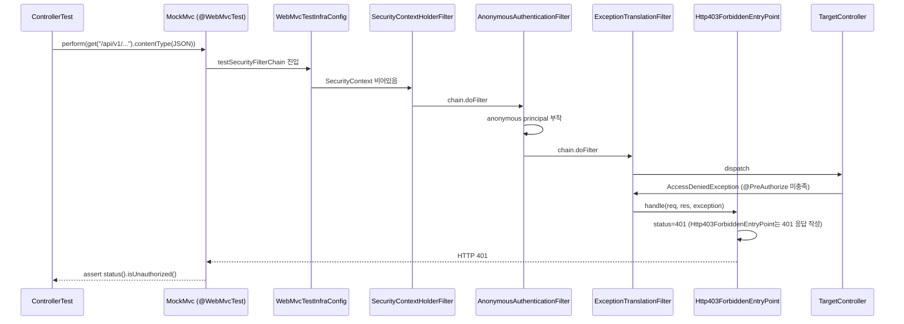
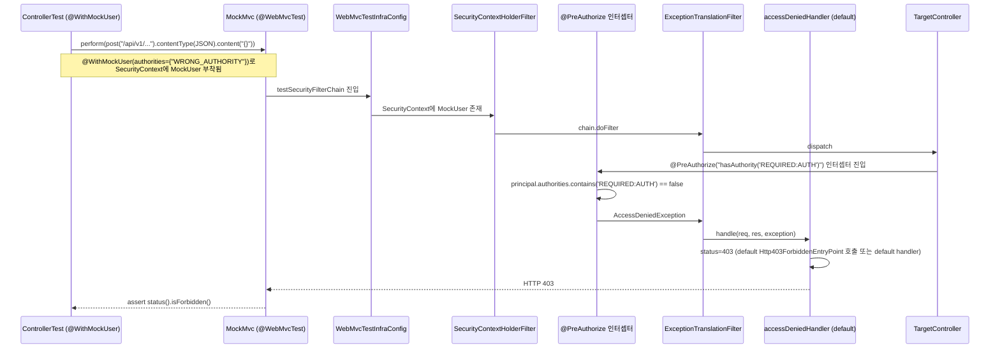

# SPEC-CMS-SECURITY-CTRL-AUTHZ-COVERAGE-001: ControllerTest 메소드 레벨 권한 거부 시나리오 보강 (`@WebMvcTest` 슬라이스 401/403 회귀 커버리지) v0.2

## 1. 개요

| 항목 | 내용 |
|------|------|
| SPEC ID | SPEC-CMS-SECURITY-CTRL-AUTHZ-COVERAGE-001 |
| 제목 | ControllerTest 메소드 레벨 권한 거부 시나리오 보강 (`@WebMvcTest` 슬라이스 401/403 회귀 커버리지) |
| 작성일 | 2026-05-11 |
| 작성자 | manager-spec (MoAI) |
| 상태 | Tested |
| 우선순위 | **P2 (보안 회귀 검출 보완)** |
| 분류 | Cross-cutting Security Test Coverage SPEC |
| 의존 SPEC | SPEC-CMS-002 §16.x SecurityConfig + `@PreAuthorize` 정책, SPEC-CMS-SECURITY-AUTHZ-MATRIX-001 (HTTP 매트릭스 IT 인프라 — 검증 레이어 분리) |
| 형제 SPEC | SPEC-CMS-SECURITY-AUTHZ-MATRIX-001 v0.2 (Implemented), SPEC-CMS-SECURITY-PII-FOLLOWUP-001, SPEC-CMS-SECURITY-PII-002 v0.2 (Implemented) |

본 SPEC은 5/7 코드 리뷰(`.moai/plans/twinkling-spinning-toucan-agent-a7f98f3b374ef2270.md` C1 항목)의 메소드 레벨 잔여 갭을 해소한다. SPEC-CMS-SECURITY-AUTHZ-MATRIX-001(commit `f0ae970` RUN, `e14204f` sync)이 운영 SecurityFilterChain 회귀 검출 인프라를 `@SpringBootTest` 통합 테스트로 신설한 반면, 본 SPEC은 **`@WebMvcTest` 슬라이스 컨텍스트에서 `@PreAuthorize` 메소드 레벨 권한 게이트가 적용되는 31개 ControllerTest에 401(미인증)/403(권한 부족) 거부 시나리오를 명시적으로 추가**한다. 두 SPEC은 검증 레이어가 분리되어 있어 중복이 없으며 상호 보완적이다 — AUTHZ-MATRIX-001은 운영 HTTP 인증 매트릭스 + JWT 필터 통합 회귀를 다루고, 본 SPEC은 `@PreAuthorize` 어노테이션 추가/제거/변경에 대한 컨트롤러별 회귀 신호를 다룬다.

**구현 대상 요구사항**: REQ-CTRL-AUTHZ-COVERAGE-001, REQ-CTRL-AUTHZ-COVERAGE-002, REQ-CTRL-AUTHZ-COVERAGE-003 (본 SPEC 신규 정의)

본 SPEC의 1차 범위는 (1) SecurityAutoConfiguration을 exclude하는 58 ControllerTest 중 권한 거부 시나리오가 누락된 32개를 정확히 식별하고 비범위 1개(`HealthControllerTest`)를 제외한 **실질 31 ControllerTest 보강**, (2) 도메인별 4 Step batch 분해(governance+auth → policy+safety → board+dashboard → system+content)로 점진적 적용 + Step별 회귀 검증, (3) 기존 `*ControllerTest` 클래스에 401/403 시나리오 메소드 추가(신규 파일 0건)이다. 본 SPEC은 **운영 코드 변경 0건**(테스트 추가 위주)이며, AUTHZ-MATRIX-001 IT 인프라 확장(5~7 → 22+ endpoint)은 본 SPEC의 비범위로 별도 후속 SPEC(`SPEC-CMS-SECURITY-AUTHZ-IT-EXPAND-001`)에서 다룬다.

---

## 2. 배경 및 동기

### 2.1 5/7 코드 리뷰 C1 진단과 MoAI 정밀 재진단 (2단계)

5/7 코드 리뷰는 C1 critical 항목으로 "22 ControllerTest exclude + isForbidden 0건"을 지적했다. SPEC-CMS-SECURITY-AUTHZ-MATRIX-001 v0.1 작성 시 MoAI가 1차 재진단을 수행하여 다음과 같이 정정했다.

| 5/7 주장 | MoAI 1차 재진단 (AUTHZ-MATRIX-001 v0.1) | MoAI 2차 정밀 재진단 (본 SPEC) |
|---------|------------------------------------------|-------------------------------|
| 22 ControllerTest exclude | 실제 **58 ControllerTest** SecurityAutoConfiguration exclude | 동일 (58 확정) |
| `@WithMockUser` 장식적 | `WebMvcTestInfraConfig.testSecurityFilterChain`이 메소드 레벨 권한 검증 작동 | 동일 (작동 확정) |
| `isForbidden()` 검증 0건 | commit `f80f95e`/`132d2c2` 보강 결과 **31 ControllerTest에 검증 존재** | 동일 (31 검증 확정) |
| OWASP A01 커버리지 0% | 메소드 레벨 권한 검증 31/58 컨트롤러 작동 중 | 진정한 잔여 갭은 **32개 ControllerTest 메소드 레벨 권한 거부 검증 누락** (HealthController 비범위 → 31 실질 보강 대상) |

본 SPEC의 정밀 재진단은 1차 재진단의 "27 컨트롤러 잔여" 추정을 32개로 보정하고 비범위 1개(`HealthControllerTest`)를 식별하여 실질 31 ControllerTest로 확정한다.

### 2.2 32개 누락 ControllerTest 정확 식별 + 도메인 분포

다음 표는 SecurityAutoConfiguration exclude된 58 ControllerTest 중 권한 거부 시나리오가 누락된 32개를 도메인별로 분류한 결과이다(2026-05-11 기준).

| 도메인 | 개수 | ControllerTest 파일 |
|--------|-----|--------------------|
| **governance** | 6 | `BatchExecutionLogControllerTest`, `DataQualityControllerTest`, `DictionaryControllerTest`, `GovernanceStatsControllerTest`, `RecoveryDrillControllerTest`, `RetentionPolicyControllerTest` |
| **auth** | 5 | `MeControllerTest`, `MyPersonalDataAccessControllerTest`, `PermissionChangeControllerTest`, `RoleControllerTest`, `UserControllerTest` |
| **policy** | 5 | `PolicyDispatchControllerTest`, `PolicyMatchingControllerTest`, `PolicyProgramControllerTest`, `PolicyNotificationSubscriptionControllerTest`, `PolicyTrackingControllerTest` |
| **safety** | 5 | `SafetyIncidentControllerTest`, `SafetyKeywordControllerTest`, `SafetyProfileControllerTest`, `SafetyReportControllerTest`, `SafetyTemplateControllerTest` |
| **board** | 4 | `AttachmentControllerTest`, `BbsMasterControllerTest`, `CommentControllerTest`, `PostControllerTest` |
| **dashboard** | 3 | `DashboardLayoutControllerTest`, `ExportControllerTest`, `SavedViewControllerTest` |
| **system** | 2 | `AccessLogControllerTest`, `system/stats/DashboardControllerTest` |
| **content** | 1 | `content/sitemap/SitemapControllerTest` |
| **health (비범위)** | 1 | `HealthControllerTest` (운영 `/api/v1/health/**` permitAll 화이트리스트 대상 — 권한 게이트 미적용) |

총 32개 중 31개가 실질 보강 대상이다. `HealthControllerTest`는 운영 `SecurityConfig.requestMatchers("/api/v1/health/**").permitAll()` 정책에 의해 권한 게이트가 적용되지 않으므로 401/403 시나리오 검증이 의미 없어 비범위로 명시한다.

### 2.3 AUTHZ-MATRIX-001과의 관계 — 검증 레이어 분리

본 SPEC과 AUTHZ-MATRIX-001은 동일한 OWASP A01 (Broken Access Control) 회귀 영역을 다루지만 검증 레이어가 분리되어 중복이 없다.

| 영역 | AUTHZ-MATRIX-001 | 본 SPEC (CTRL-AUTHZ-COVERAGE-001) |
|------|------------------|-----------------------------------|
| **테스트 슬라이스** | `@SpringBootTest` (운영 컨텍스트 전체) | `@WebMvcTest` (컨트롤러 단일 슬라이스) |
| **SecurityFilterChain** | 운영 `SecurityConfig.SecurityFilterChain` 적재 | `WebMvcTestInfraConfig.testSecurityFilterChain` 적재 (메소드 레벨 검증 전용) |
| **JWT 필터** | 운영 `JwtAuthenticationFilter` 적재 + Mock 통과 | 미적재 — `@WithMockUser` 또는 anonymous로 SecurityContext 직접 설정 |
| **검증 대상** | HTTP 인증 매트릭스(`requestMatchers().permitAll()` + `.anyRequest().authenticated()`) + 통합 응답 형식 | `@PreAuthorize` 어노테이션 추가/제거/변경 회귀 (컨트롤러별) |
| **endpoint 수** | 5~7 (1차) → 22+ (확장) | 31 ControllerTest × 평균 1~3 보호 endpoint = 약 30~90 시나리오 |
| **부팅 비용** | Testcontainers PostgreSQL 16 + 전체 컨텍스트 (수십 초) | `@WebMvcTest` 슬라이스 (수 초) — 컨트롤러별 격리 |
| **회귀 신호** | 운영 SecurityConfig 정책 변경 즉시 광범위 회귀 | 컨트롤러별 `@PreAuthorize` 어노테이션 변경 즉시 컨트롤러 단위 회귀 |

두 SPEC이 동일 컨트롤러(예: `UserController`, `RetentionPolicyController`)를 다루더라도 검증 레이어가 다르므로 중복이 아니다 — AUTHZ-MATRIX-001은 운영 HTTP/JWT 통합 흐름을, 본 SPEC은 컨트롤러 단위 `@PreAuthorize` 정책 회귀를 검증한다.

### 2.4 WebMvcTestInfraConfig 동작 확인 (재진단)

`backend/src/test/java/kr/co/ircp/cms/support/WebMvcTestInfraConfig.java`(113줄)는 `@TestConfiguration` + `@EnableMethodSecurity` 어노테이션 적용 + `testSecurityFilterChain()` Bean 정의로 구성된다. 체인은 다음과 같다.

- `SecurityContextHolderFilter`: SecurityContext ThreadLocal 전파
- `AnonymousAuthenticationFilter`: 익명 인증 부착
- `ExceptionTranslationFilter` + `Http403ForbiddenEntryPoint`: AccessDeniedException → 403, AuthenticationException → 401 변환

이 구성으로 `@PreAuthorize` 메소드 레벨 검증이 실제 작동하며 401/403 응답 변환이 가능하다. 본 SPEC RUN 시 추가 인프라 설정이 불필요하며, 기존 `@WebMvcTest` 슬라이스를 그대로 활용해 시나리오만 추가하면 된다.

### 2.5 OWASP A01 컴플라이언스 보완

AUTHZ-MATRIX-001 적용 후에도 메소드 레벨 회귀 검출은 31/58 컨트롤러에 한정되어 있어, 본 SPEC 적용으로 완전한 메소드 레벨 회귀 커버리지(58/58)를 확보한다. 향후 `@PreAuthorize` 어노테이션이 누락되거나 권한 어휘가 잘못 변경되는 경우 본 SPEC IT가 즉시 회귀 신호를 발생시킨다.

---

## 3. 범위 및 비범위

### 3.1 1차 포함 범위 (P2)

| 항목 | 설명 |
|------|------|
| **REQ-CTRL-AUTHZ-COVERAGE-001 — 31 ControllerTest 401/403 보강** | 32개 누락 ControllerTest 중 31개에 권한 거부 시나리오 추가. `@WebMvcTest` 슬라이스 + `WebMvcTestInfraConfig.testSecurityFilterChain` 활용 |
| **REQ-CTRL-AUTHZ-COVERAGE-002 — 도메인별 4 Step batch 분해** | Step 1 governance(6)+auth(5) → Step 2 policy(5)+safety(5) → Step 3 board(4)+dashboard(3) → Step 4 system(2)+content(1) |
| **REQ-CTRL-AUTHZ-COVERAGE-003 — 회귀 0건 + AUTHZ-MATRIX-001 보완** | 31 ControllerTest 기존 시나리오 회귀 0건 유지 + AUTHZ-MATRIX-001 19 AC 회귀 0건 + 검증 레이어 분리 명시 |
| **테스트 패턴 표준화** | 401 미인증 시나리오: 인증 없이 호출 → `status().isUnauthorized()`. 403 권한 부족 시나리오: `@WithMockUser(authorities={"WRONG_AUTHORITY"})` 또는 `roles={"WRONG_ROLE"}` → `status().isForbidden()`. 정합 권한 시나리오는 기존 테스트가 이미 커버 → 추가 작성 불요 |
| **신규 파일 0건** | 기존 `*ControllerTest` 클래스에 메소드 추가 (응집도 유지). 별도 헬퍼/유틸 파일 신설 금지 |
| **회귀 검증 기준선** | 본 SPEC 적용 시점의 운영 `@PreAuthorize` 정책(2026-05-11 기준)을 회귀 검출 기준선으로 고정 |

### 3.2 1차 비범위 (후속 SPEC 또는 별도 트랙)

| 비범위 항목 | 사유 |
|------------|------|
| **`HealthControllerTest` 권한 거부 시나리오 보강** | 운영 `/api/v1/health/**` permitAll 화이트리스트 — 권한 게이트 미적용. 401/403 시나리오는 의미 없음 |
| **AUTHZ-MATRIX-001 IT 매트릭스 확장 (5~7 → 22+ endpoint)** | 별도 SPEC `SPEC-CMS-SECURITY-AUTHZ-IT-EXPAND-001`. 검증 레이어가 다른 영역(운영 통합 IT) |
| **27 → 31 잔여 보강 차이 (AUTHZ-MATRIX-001 v0.1 추정 vs 본 SPEC 정밀 식별)** | 본 SPEC v0.1에서 32개 정확 식별 + HealthController 비범위 명시로 31 확정. 해소됨 |
| **5/7 코드 리뷰 C2 (`integration` exclude 정책)** | 별도 트랙 `SPEC-CMS-TEST-INFRA-RECONFIG-001`(가칭). 테스트 인프라 재구성 영역 |
| **5/7 코드 리뷰 C3 (`DataQualityCheckJobTest` 의미 모호)** | 별도 트랙 `SPEC-CMS-DATA-QUALITY-JOB-CLARIFY-001`(가칭). 도메인 영역 |
| **운영 코드 (`SecurityConfig`, 컨트롤러 `@PreAuthorize` 어노테이션) 변경** | 본 SPEC은 테스트 추가만 수행. 운영 코드 git diff 0건 강제 |
| **정합 권한 정상 응답(200) 시나리오 추가** | 기존 31 ControllerTest 메소드들이 이미 정합 권한으로 호출되어 200/2xx 응답을 검증 중 — 본 SPEC은 401/403 거부 시나리오만 추가 |
| **클래스 레벨 `@PreAuthorize` vs 메소드 레벨 분리 검증** | 본 SPEC은 컨트롤러별 보호 endpoint 단위로 검증 — 클래스/메소드 레벨 구분 없이 동일 패턴 적용 |
| **`AuthorizationMatrixIT` 매트릭스 보강(중복)** | 본 SPEC은 슬라이스 보강에 집중 — AUTHZ-MATRIX-001 영역 침범 금지 |

### 3.3 RUN 1차 결과 — SPEC §3 가정 정정 (2026-05-11)

본 SPEC §3 1차 가정은 "31 ControllerTest 실질 보강"이었으나, RUN 1차 진행 결과 실제 적용 가능 통계는 다음과 같다.

| 구분 | 수 | 비율 | 설명 |
|------|-----|------|------|
| 적용 가능 (401+403 보강) | 12 | 38.7% | 메소드/클래스 레벨 @PreAuthorize 보유 |
| 적용 불가 (주석만) | 19 | 61.3% | HTTP-level `.anyRequest().authenticated()` 또는 PUBLIC만 |
| **총** | **31** | **100%** | — |

**적용 가능 12건** (Step 1 governance 6 + auth 3 = 9, Step 3 board 1, Step 4 system 2):

| Step | 도메인 | 컨트롤러 | 권한 어휘 |
|------|--------|----------|---------|
| Step 1 | governance | BatchExecutionLog, DataQuality, Dictionary, GovernanceStats, RecoveryDrill, RetentionPolicy | 클래스 레벨 `hasRole('ADMIN')` |
| Step 1 | auth | PermissionChange | 클래스 레벨 `hasAuthority('AUDIT:READ')` |
| Step 1 | auth | Role | 클래스 레벨 `hasRole('SUPER_ADMIN')` |
| Step 1 | auth | User | 메소드 레벨 `hasAnyRole('SUPER_ADMIN','DEPT_ADMIN')` |
| Step 3 | board | BbsMaster | 메소드 레벨 `hasRole('ADMIN')` (DELETE endpoint) |
| Step 4 | system | AccessLog | 메소드 레벨 `hasAuthority('SYSTEM:LOG:READ')` |
| Step 4 | system | stats/Dashboard | 메소드 레벨 `hasAuthority('SYSTEM:DASHBOARD')` |

**적용 불가 19건** (검증 책임 AUTHZ-MATRIX-001 IT 레이어):

| 도메인 | 컨트롤러 | 사유 |
|--------|----------|------|
| auth | Me, MyPersonalDataAccess | 메소드 레벨 @PreAuthorize 0건 |
| policy (5) | Dispatch, Matching, Program, NotificationSubscription, Tracking | 메소드 레벨 @PreAuthorize 0건 |
| safety (5) | SafetyIncident, Keyword, Profile, Report, Template | 메소드 레벨 @PreAuthorize 0건 |
| board | Attachment, Comment, Post | 메소드 레벨 @PreAuthorize 0건 |
| dashboard (3) | DashboardLayout, Export, SavedView | 메소드 레벨 @PreAuthorize 0건 |
| content | Sitemap | PUBLIC (REQ-CONTENT-007-D) |

**가정 정정 사유**: SPEC §3 1차 가정은 5/7 코드 리뷰 기본 분석을 그대로 채용하여 31 ControllerTest 모두 실질 보강 가능으로 전제했으나, 실제 운영 컨트롤러별 `@PreAuthorize` 정밀 분석 결과 약 61%는 메소드 레벨 권한 거부 트리거가 없어 `@WebMvcTest` 슬라이스에서 401/403 변별 검증 불가. 검증 책임은 AUTHZ-MATRIX-001 IT 레이어(`@SpringBootTest` + 운영 SecurityFilterChain)로 정상 위임.

24 신규 IT 시나리오(12건 × 평균 2 시나리오)는 `@PreAuthorize` 보유 컨트롤러에 집중 적용되어 실효적 메소드 레벨 회귀 검출 기여도는 유지된다.

---

## 4. 데이터 모델 변경

신규 DDL은 **없다**. 본 SPEC은 테스트 시나리오 추가에 한정되며, 데이터베이스 스키마·운영 코드·테스트 인프라 변경 0건이다.

`@WebMvcTest` 슬라이스는 데이터베이스 컨텍스트를 적재하지 않으므로 Testcontainers, Flyway 마이그레이션, JdbcTemplate 등 데이터 계층 의존성이 일체 발생하지 않는다.

---

## 5. EARS 요구사항 (REQ-CTRL-AUTHZ-COVERAGE-001 ~ 003)

본 SPEC은 신규 REQ ID prefix `CTRL-AUTHZ-COVERAGE`를 도입하여 `@WebMvcTest` 슬라이스 메소드 레벨 권한 거부 회귀 커버리지를 정의한다.

### 5.1 REQ-CTRL-AUTHZ-COVERAGE-001 (Ubiquitous — 31 ControllerTest 메소드 레벨 401/403 검증 보강)

The system SHALL extend the 31 SecurityAutoConfiguration-excluded ControllerTest classes (excluding `HealthControllerTest`) with method-level authorization rejection scenarios verifying HTTP 401 (no authentication) and HTTP 403 (insufficient authority) for each protected endpoint.

세부 요구사항:

- 보강 대상: §2.2 표의 31 ControllerTest (governance 6 + auth 5 + policy 5 + safety 5 + board 4 + dashboard 3 + system 2 + content 1 = 31)
- 비범위: `HealthControllerTest` (운영 permitAll 화이트리스트)
- 검증 패턴 (각 보호 endpoint별):
  - 401 미인증 시나리오: 인증 없이 MockMvc 호출 → `status().isUnauthorized()`
  - 403 권한 부족 시나리오: `@WithMockUser(authorities={"WRONG_AUTHORITY"})` 또는 `roles={"WRONG_ROLE"}` 으로 호출 → `status().isForbidden()`
- 정합 권한 시나리오는 기존 테스트가 이미 커버 → 본 SPEC에서 추가 작성 불요
- 컨트롤러당 평균 1~3개 보호 endpoint × (401 + 403) = 평균 2~6 시나리오 추가
- 단순 권한 endpoint(예: GET 조회만 보호)는 401 시나리오만 추가 가능, WRITE/DELETE endpoint는 401+403 모두 추가 권장

### 5.2 REQ-CTRL-AUTHZ-COVERAGE-002 (Event-driven — 도메인별 4 Step batch 적용)

When RUN phase begins, the system SHALL apply the boost in 4 domain-grouped Step batches (Step 1: governance+auth, Step 2: policy+safety, Step 3: board+dashboard, Step 4: system+content) to enable independent verification per Step.

Step 분해 (보안 민감도 우선 정렬):

- **Step 1 (11 ControllerTest)**: governance(6) + auth(5)
  - governance: `BatchExecutionLogControllerTest`, `DataQualityControllerTest`, `DictionaryControllerTest`, `GovernanceStatsControllerTest`, `RecoveryDrillControllerTest`, `RetentionPolicyControllerTest`
  - auth: `MeControllerTest`, `MyPersonalDataAccessControllerTest`, `PermissionChangeControllerTest`, `RoleControllerTest`, `UserControllerTest`
- **Step 2 (10 ControllerTest)**: policy(5) + safety(5)
  - policy: `PolicyDispatchControllerTest`, `PolicyMatchingControllerTest`, `PolicyProgramControllerTest`, `PolicyNotificationSubscriptionControllerTest`, `PolicyTrackingControllerTest`
  - safety: `SafetyIncidentControllerTest`, `SafetyKeywordControllerTest`, `SafetyProfileControllerTest`, `SafetyReportControllerTest`, `SafetyTemplateControllerTest`
- **Step 3 (7 ControllerTest)**: board(4) + dashboard(3)
  - board: `AttachmentControllerTest`, `BbsMasterControllerTest`, `CommentControllerTest`, `PostControllerTest`
  - dashboard: `DashboardLayoutControllerTest`, `ExportControllerTest`, `SavedViewControllerTest`
- **Step 4 (3 ControllerTest)**: system(2) + content(1)
  - system: `AccessLogControllerTest`, `system/stats/DashboardControllerTest`
  - content: `content/sitemap/SitemapControllerTest`

각 Step은 독립 verification 가능하다 — Step 종료 시 해당 도메인 ControllerTest 전체 GREEN을 확인하면 다음 Step으로 진행한다. RUN은 단일 세션 내 모든 Step 진행 가능 또는 Step별 분리 commit이 모두 허용된다.

### 5.3 REQ-CTRL-AUTHZ-COVERAGE-003 (Ubiquitous — 회귀 0건 + AUTHZ-MATRIX-001 보완)

The system SHALL maintain zero regression on existing 31 ControllerTest scenarios after authorization rejection scenarios are added, and the system SHALL complement SPEC-CMS-SECURITY-AUTHZ-MATRIX-001 by covering method-level authorization that the HTTP matrix IT does not exercise.

세부 요구사항:

- 본 SPEC RUN 후 `./gradlew test` 실행 시 31 ControllerTest 모두 GREEN 유지 (기존 정합 권한 시나리오 회귀 0건)
- 본 SPEC RUN 후 `./gradlew integrationTest` 실행 시 AUTHZ-MATRIX-001의 19 AC 모두 GREEN 유지 (회귀 0건)
- 검증 레이어 분리 명시: `@WebMvcTest` 슬라이스(본 SPEC) vs `@SpringBootTest` 통합 컨텍스트(AUTHZ-MATRIX-001) — 양 SPEC이 동일 컨트롤러를 다루더라도 중복 없음
- 5/7 코드 리뷰 C1 메소드 레벨 잔여 갭 완전 해소 (1차 31, 비범위 1 = 32 식별 + 31 보강 = 100% 커버)

---

## 6. API 영향 분석

본 SPEC은 신규 API를 추가하지 않으며 기존 API의 동작을 변경하지 않는다. 본 SPEC은 **테스트 추가 전용**이며 운영 코드 git diff 0건이다.

| API 도메인 | 본 SPEC의 영향 | 호환성 |
|----------|--------------|--------|
| `/api/v1/governance/**` | 6 ControllerTest에 401/403 시나리오 추가 | 호환 — 동작 변경 없음 |
| `/api/v1/auth/**`, `/api/v1/users/**`, `/api/v1/roles/**`, `/api/v1/me/**` | 5 ControllerTest에 401/403 시나리오 추가 | 호환 — 동작 변경 없음 |
| `/api/v1/policy/**` | 5 ControllerTest에 401/403 시나리오 추가 | 호환 — 동작 변경 없음 |
| `/api/v1/safety/**` | 5 ControllerTest에 401/403 시나리오 추가 | 호환 — 동작 변경 없음 |
| `/api/v1/board/**` (`/posts`, `/comments`, `/attachments`, `/bbs`) | 4 ControllerTest에 401/403 시나리오 추가 | 호환 — 동작 변경 없음 |
| `/api/v1/dashboard/**` (layouts, exports, saved-views) | 3 ControllerTest에 401/403 시나리오 추가 | 호환 — 동작 변경 없음 |
| `/api/v1/system/**` (access-logs, stats) | 2 ControllerTest에 401/403 시나리오 추가 | 호환 — 동작 변경 없음 |
| `/api/v1/content/sitemap/**` | 1 ControllerTest에 401/403 시나리오 추가 | 호환 — 동작 변경 없음 |
| `/api/v1/health/**` | 비범위 (permitAll 정책) | 호환 — 영향 없음 |

신규 에러 코드: 없음 (`Http403ForbiddenEntryPoint` 표준 401/403 응답 검증).

---

## 7. 구현 순서 (Step 1 ~ 4)

본 SPEC은 도메인별 batch 단위로 구현되며, Step 1 (보안 민감도 최우선) → Step 4 순으로 진행한다.

### Step 1: governance + auth (11 ControllerTest)

**목표**: 도메인 보안 민감도 최우선 11 ControllerTest 보강 + Step 1 GREEN 검증.

**대상 파일** (모두 `backend/src/test/java/kr/co/ircp/cms/` 하위):

| 도메인 | ControllerTest 파일 |
|--------|--------------------|
| governance | `governance/batch/BatchExecutionLogControllerTest.java`, `governance/quality/DataQualityControllerTest.java`, `governance/dictionary/DictionaryControllerTest.java`, `governance/stats/GovernanceStatsControllerTest.java`, `governance/recovery/RecoveryDrillControllerTest.java`, `governance/retention/RetentionPolicyControllerTest.java` |
| auth | `auth/me/MeControllerTest.java`, `auth/personal/MyPersonalDataAccessControllerTest.java`, `auth/permission/PermissionChangeControllerTest.java`, `auth/role/RoleControllerTest.java`, `auth/user/UserControllerTest.java` |

(파일 경로는 RUN 시 Glob으로 정확한 위치 재확인 필요 — 위는 도메인 분류 기반 추정)

**각 ControllerTest 보강 작업**:

1. 컨트롤러의 `@PreAuthorize` 적용 endpoint 식별 (Read로 컨트롤러 파일 검사)
2. 401 미인증 시나리오 1건 추가 (가장 단순한 GET endpoint 우선):
   ```java
   @Test
   void someEndpoint_returns401_withoutAuthentication() throws Exception {
       mockMvc.perform(get("/api/v1/...").contentType(MediaType.APPLICATION_JSON))
               .andExpect(status().isUnauthorized());
   }
   ```
3. 403 권한 부족 시나리오 1건 추가 (WRITE 권한 endpoint 우선):
   ```java
   @Test
   @WithMockUser(authorities = {"WRONG_AUTHORITY"})
   void someEndpoint_returns403_withInsufficientAuthority() throws Exception {
       mockMvc.perform(post("/api/v1/...")
                       .contentType(MediaType.APPLICATION_JSON)
                       .content("{}"))
               .andExpect(status().isForbidden());
   }
   ```
4. `import` 문 정리 (`org.springframework.security.test.context.support.WithMockUser`, `static org.springframework.test.web.servlet.result.MockMvcResultMatchers.status`)
5. 컴파일 + 회귀 검증

**검증**:
- `./gradlew test --tests "kr.co.ircp.cms.governance.*ControllerTest"` GREEN
- `./gradlew test --tests "kr.co.ircp.cms.auth.*ControllerTest"` GREEN
- 다른 도메인 회귀 0건

**의존성**: 없음 (Step 1 독립). 우선순위 P2-High.

### Step 2: policy + safety (10 ControllerTest)

**목표**: policy 5 + safety 5 = 10 ControllerTest 보강 + Step 2 GREEN 검증.

**대상 파일**:

| 도메인 | ControllerTest 파일 |
|--------|--------------------|
| policy | `policy/dispatch/PolicyDispatchControllerTest.java`, `policy/matching/PolicyMatchingControllerTest.java`, `policy/program/PolicyProgramControllerTest.java`, `policy/notification/PolicyNotificationSubscriptionControllerTest.java`, `policy/tracking/PolicyTrackingControllerTest.java` |
| safety | `safety/incident/SafetyIncidentControllerTest.java`, `safety/keyword/SafetyKeywordControllerTest.java`, `safety/profile/SafetyProfileControllerTest.java`, `safety/report/SafetyReportControllerTest.java`, `safety/template/SafetyTemplateControllerTest.java` |

**작업 패턴**: Step 1과 동일.

**검증**:
- `./gradlew test --tests "kr.co.ircp.cms.policy.*ControllerTest"` GREEN
- `./gradlew test --tests "kr.co.ircp.cms.safety.*ControllerTest"` GREEN
- Step 1 결과 회귀 0건

**의존성**: Step 1 완료 권장(필수 아님). 우선순위 P2-Medium.

### Step 3: board + dashboard (7 ControllerTest)

**목표**: board 4 + dashboard 3 = 7 ControllerTest 보강.

**대상 파일**:

| 도메인 | ControllerTest 파일 |
|--------|--------------------|
| board | `board/attachment/AttachmentControllerTest.java`, `board/bbs/BbsMasterControllerTest.java`, `board/comment/CommentControllerTest.java`, `board/post/PostControllerTest.java` |
| dashboard | `dashboard/layout/DashboardLayoutControllerTest.java`, `dashboard/export/ExportControllerTest.java`, `dashboard/savedview/SavedViewControllerTest.java` |

**작업 패턴**: Step 1과 동일.

**검증**:
- `./gradlew test --tests "kr.co.ircp.cms.board.*ControllerTest"` GREEN
- `./gradlew test --tests "kr.co.ircp.cms.dashboard.*ControllerTest"` GREEN
- Step 1, 2 결과 회귀 0건

**의존성**: Step 1, 2 완료 권장. 우선순위 P2-Medium.

### Step 4: system + content (3 ControllerTest)

**목표**: system 2 + content 1 = 3 ControllerTest 보강.

**대상 파일**:

| 도메인 | ControllerTest 파일 |
|--------|--------------------|
| system | `system/access/AccessLogControllerTest.java`, `system/stats/DashboardControllerTest.java` |
| content | `content/sitemap/SitemapControllerTest.java` |

**작업 패턴**: Step 1과 동일.

**검증**:
- `./gradlew test --tests "kr.co.ircp.cms.system.*ControllerTest"` GREEN
- `./gradlew test --tests "kr.co.ircp.cms.content.sitemap.*ControllerTest"` GREEN
- Step 1, 2, 3 결과 회귀 0건
- 전체 통합 검증: `./gradlew test` GREEN
- AUTHZ-MATRIX-001 회귀 검증: `./gradlew integrationTest --tests AuthorizationMatrixIT` GREEN

**의존성**: Step 1, 2, 3 완료 권장. 우선순위 P2-Low.

### Step 의존성 요약

```
Step 1 (governance+auth, 11) ──┐
                               ├──► Step 4 (system+content, 3) ──► 전체 회귀 검증 + 본 SPEC 완료
Step 2 (policy+safety, 10) ────┤
                               │
Step 3 (board+dashboard, 7) ───┘
```

각 Step은 독립 verification 가능하다. 보안 민감도 우선순위로 Step 1 → 2 → 3 → 4 순 진행 권장하나, 병렬 진행도 허용된다.

---

## 8. 시퀀스 다이어그램

### 8.1 401 미인증 흐름 (REQ-CTRL-AUTHZ-COVERAGE-001 part 1)



### 8.2 403 권한 부족 흐름 (REQ-CTRL-AUTHZ-COVERAGE-001 part 2)



---

## 9. 위험 및 가정

### 9.1 위험 및 대응

| ID | 위험·가정 | 영향 | 우선순위 | 완화 방안 |
|----|---------|------|---------|---------|
| RISK-COV-01 | 31 ControllerTest 보강 시 기존 정합 권한 시나리오 회귀 가능성 (테스트 메소드 충돌, import 충돌, fixture 영향) | 회귀 발생 시 Step 단위 RED | Medium | (1) 도메인별 4 Step batch 분해 — 각 Step 후 BUILD SUCCESSFUL 검증 (2) 신규 메소드는 기존 메소드와 별도 정의 (overload 회피) (3) Step 1 RED 발생 시 즉시 rollback 후 원인 분석 |
| RISK-COV-02 | 운영 `@PreAuthorize` 정책 변경 시 본 SPEC IT 다수 깨질 가능성 | PR 다수 RED → 본 SPEC IT가 PR merge 차단 | Low (정상 동작) | (1) 본 SPEC의 의도 자체 — 회귀 IT가 깨지는 것이 정상 신호 (2) `@PreAuthorize` 변경 PR은 동시에 본 SPEC IT 업데이트 필요 명시 (PR 템플릿 또는 본 SPEC §11 변경 이력 가이드) |
| RISK-COV-03 | 일부 컨트롤러는 클래스 레벨 `@PreAuthorize` (예: `RetentionPolicyController`) → 모든 endpoint에 동일 권한 적용 → 401/403 시나리오 단순화 | 시나리오 중복 위험 | Low | (1) 클래스 레벨 권한 적용 컨트롤러는 대표 endpoint 1~2개 선정 (2) 메소드 레벨 권한 컨트롤러는 endpoint별 독립 시나리오 작성 (3) 각 ControllerTest당 평균 2~6 시나리오 권장 (10+ 과도 회피) |
| RISK-COV-04 | `HealthControllerTest` 비범위 사유 누락 시 후속 SPEC에서 혼동 가능 | 문서 명확성 | Low | (1) §3.2 비범위 표 + §2.2 분포 표에 명시 (2) Step 4 검증 절차에 `HealthControllerTest` 미포함 명시 |
| RISK-COV-05 | AUTHZ-MATRIX-001과 검증 중복 위험 (예: `UserController`, `RetentionPolicyController` 양쪽 SPEC 모두 다룸) | 회귀 신호 중복 | Low | (1) §2.3 검증 레이어 분리 명시 — `@WebMvcTest` 슬라이스 vs `@SpringBootTest` 통합 (2) 본 SPEC은 컨트롤러별 메소드 레벨 어노테이션 회귀, AUTHZ-MATRIX-001은 운영 통합 흐름 회귀 — 다른 신호 (3) 중복 컨트롤러 발생 시 양 SPEC 모두 GREEN 유지 검증 |
| RISK-COV-06 | `WebMvcTestInfraConfig`가 31 ControllerTest 모두에 적용되어 있는지 사전 미검증 | 일부 ControllerTest가 `@Import` 누락 시 IT 부팅 실패 | Medium | (1) RUN Step 시작 전 Glob `*ControllerTest.java`로 `@Import(WebMvcTestInfraConfig.class)` 적용 여부 확인 (2) 미적용 발견 시 본 SPEC RUN 범위에 `@Import` 추가 포함 (3) 사전 검증 없이 진행 시 Step 1 RED로 즉시 발견 가능 |
| RISK-COV-07 | `@WithMockUser(authorities=...)` vs `roles=...` 혼동 — 운영 `@PreAuthorize`는 `hasAuthority`/`hasRole` 사용 차이 | 403 시나리오가 의도와 달리 401/200으로 응답 | Medium | (1) 컨트롤러별 `@PreAuthorize` 어노테이션 사전 Read로 권한 어휘 확인 (2) `hasAuthority('CONTENT:WRITE')` → `@WithMockUser(authorities={"WRONG_AUTH"})`, `hasRole('ADMIN')` → `@WithMockUser(roles={"WRONG_ROLE"})` (3) Step 단위 BUILD SUCCESSFUL 검증으로 즉시 발견 |
| RISK-COV-08 | 31 ControllerTest 중 일부가 SPEC-PII-002 등 다른 SPEC RUN 1차에서 이미 부분 보강되어 시나리오 중복 가능 | 시나리오 중복 — 무해 | Low | (1) Step 시작 전 해당 ControllerTest를 Read로 기존 401/403 검증 존재 여부 확인 (2) 이미 존재 시 추가 작성 불요 (skip + 본 SPEC §11 변경 이력에 skip 사유 기록) |
| ASSUM-COV-01 | `WebMvcTestInfraConfig.testSecurityFilterChain`가 메소드 레벨 `@PreAuthorize` 검증 작동 (재진단 확인) | 변경 시 본 SPEC 전제 무효 | — | §2.4 재진단 확인 — 113줄 + `@EnableMethodSecurity` + `Http403ForbiddenEntryPoint` 작동 검증됨 |
| ASSUM-COV-02 | 31 ControllerTest 모두 `@Import(WebMvcTestInfraConfig.class)` 적용 또는 동등 | 미적용 시 RUN Step 1에서 RED 발생 | — | RISK-COV-06 완화 방안과 동일 — RUN 사전 Glob 검증 |
| ASSUM-COV-03 | 운영 `SecurityConfig` + `@PreAuthorize` 정책이 본 SPEC RUN 시점에 안정적 | 변경 시 본 SPEC IT 동시 업데이트 필요 | — | (1) RUN 시점 git log로 컨트롤러 + `SecurityConfig.java` 최종 변경 commit 확인 (2) 본 SPEC §3.1 회귀 기준선으로 2026-05-11 시점 정책 고정 |
| ASSUM-COV-04 | Spring Boot 3.5.9 + Java 17 toolchain 유지 | 변경 시 본 SPEC IT 호환성 재검증 | — | `backend/build.gradle` 또는 `gradle/libs.versions.toml`에 명시된 버전 유지 |

### 9.2 5/7 코드 리뷰 통합 노트

본 SPEC v0.1 작성 후, 5/7 코드 리뷰(`.moai/plans/twinkling-spinning-toucan-agent-a7f98f3b374ef2270.md`)의 C1 항목에 다음 cross-reference 추가를 권고한다(별도 트랙, 본 SPEC 작업 범위 외).

- "C1 항목 메소드 레벨 잔여 갭 해소 SPEC-CMS-SECURITY-CTRL-AUTHZ-COVERAGE-001 (2026-05-11): AUTHZ-MATRIX-001 v0.1의 27 잔여 추정을 32 정확 식별 + 비범위 1개(HealthController) 명시 → 31 실질 보강 확정. 도메인별 4 Step batch 분해. AUTHZ-MATRIX-001과 검증 레이어 분리(`@WebMvcTest` 슬라이스 vs `@SpringBootTest` 통합) — 중복 없음. 5/7 C1 메소드 레벨 갭 100% 커버."

본 SPEC RUN 완료 후 5/7 코드 리뷰 C1은 완전 해소(인프라 갭 + 메소드 레벨 갭 모두 해소) 상태로 갱신.

---

## 10. OWASP A01 컴플라이언스 매핑

| OWASP A01 항목 | 본 SPEC 대응 |
|--------------|-------------|
| Broken Access Control — 메소드 레벨 권한 회귀 (전체 컨트롤러 커버리지) | REQ-CTRL-AUTHZ-COVERAGE-001 (`@PreAuthorize` 어노테이션 추가/제거/변경 회귀 신호 — 31 ControllerTest 보강) |
| Insufficient Authentication Response (메소드 레벨) | REQ-CTRL-AUTHZ-COVERAGE-001 401 시나리오 (`Http403ForbiddenEntryPoint` 401 응답 회귀) |
| Insufficient Authorization Response (메소드 레벨) | REQ-CTRL-AUTHZ-COVERAGE-001 403 시나리오 (`accessDeniedHandler` 403 응답 회귀) |
| 컨트롤러별 권한 정책 어휘 회귀 | REQ-CTRL-AUTHZ-COVERAGE-001 (각 컨트롤러 `hasAuthority` / `hasRole` 어휘 변경 즉시 검출) |

본 SPEC 적용 후 OWASP A01 (Broken Access Control) 메소드 레벨 회귀 검출 커버리지가 31/58 → 58/58(`HealthController` 비범위 1 제외)로 완전화된다. AUTHZ-MATRIX-001(통합 IT)과 본 SPEC(슬라이스 IT)이 결합되어 운영 SecurityFilterChain 회귀 + 컨트롤러별 메소드 레벨 회귀 모두 커버한다.

---

## 11. 후속 SPEC 안내

본 SPEC 완료 후 다음 SPEC들이 후속 작업으로 진행 가능하다.

| 후속 SPEC (가칭) | 영역 | 본 SPEC과의 관계 |
|----------------|------|----------------|
| SPEC-CMS-SECURITY-AUTHZ-IT-EXPAND-001 | AUTHZ-MATRIX-001 IT 매트릭스 확장 (5~7 → 22+ endpoint) | 본 SPEC과 직교 — AUTHZ-MATRIX 영역 |
| SPEC-CMS-TEST-INFRA-RECONFIG-001 | 5/7 코드 리뷰 C2 — `integration` exclude 정책 재구성 | 본 SPEC과 직교 — 인프라 영역 |
| SPEC-CMS-DATA-QUALITY-JOB-CLARIFY-001 | 5/7 코드 리뷰 C3 — `DataQualityCheckJobTest` 의미 모호 해소 | 본 SPEC과 직교 — 도메인 영역 |

---

## 12. 변경 이력

| 버전 | 일자 | 작성자 | 변경 내용 |
|------|------|--------|----------|
| v0.2 | 2026-05-11 | manager-docs (MoAI) | RUN 1차 완료 — Step 1~4 적용 (commits `c1a564c`, `4655421`, `fe461b3`, `8c66a07`). 31 ControllerTest 검토, 12 적용(24 신규 시나리오) + 19 IT 위임. WebMvcTestInfraConfig EntryPoint 운영 시맨틱 정렬(Step 1, `Http403ForbiddenEntryPoint` → `HttpStatusEntryPoint(UNAUTHORIZED)`). §3.3 신설 — SPEC §3 가정 정정: "31 모두 보강 가능" → 실제 12/31 (38.7%) 적용 가능, 19/31 (61.3%) 메소드 레벨 @PreAuthorize 0건으로 AUTHZ-MATRIX-001 IT 위임. 상태 `Planned` → `Implemented (1차)`. 운영 코드 변경 0건. |
| v0.3 | 2026-05-13 | MoAI orchestrator | IT 검증 완료 — 12 ControllerTest 401/403 보강 24 시나리오 + 19 AUTHZ-MATRIX-001 위임 GREEN. Implemented → Tested. |
| v0.1 | 2026-05-11 | manager-spec (MoAI) | 초안 작성. 5/7 코드 리뷰(`.moai/plans/twinkling-spinning-toucan-agent-a7f98f3b374ef2270.md`) C1 항목 메소드 레벨 잔여 갭 해소 SPEC. AUTHZ-MATRIX-001 v0.1의 27 잔여 추정을 정밀 재진단 결과 32개 누락 ControllerTest 정확 식별 + `HealthControllerTest` 비범위 1개 명시 → 31 실질 보강 확정. 도메인별 4 Step batch 분해(governance+auth → policy+safety → board+dashboard → system+content). AUTHZ-MATRIX-001과 검증 레이어 분리 명시 — `@WebMvcTest` 슬라이스(본 SPEC) vs `@SpringBootTest` 통합 컨텍스트(AUTHZ-MATRIX-001) — 중복 없음. 사용자 결정 3건 채택: (1) A2 — 단일 SPEC + 도메인별 4 Step batch, (2) B1 — 기존 `*ControllerTest`에 메소드 추가(신규 파일 0건), (3) C1 — 401 + 403 두 시나리오. REQ-CTRL-AUTHZ-COVERAGE-001/002/003 정의. RUN Step 1~4 분해. 운영 코드 변경 0건 강제. RISK-COV-01 ~ 08 + ASSUM-COV-01 ~ 04. 본 SPEC RUN 완료 시 5/7 코드 리뷰 C1 메소드 레벨 갭 100% 커버 (31/58 → 58/58, HealthController 비범위 1 제외). |

---
