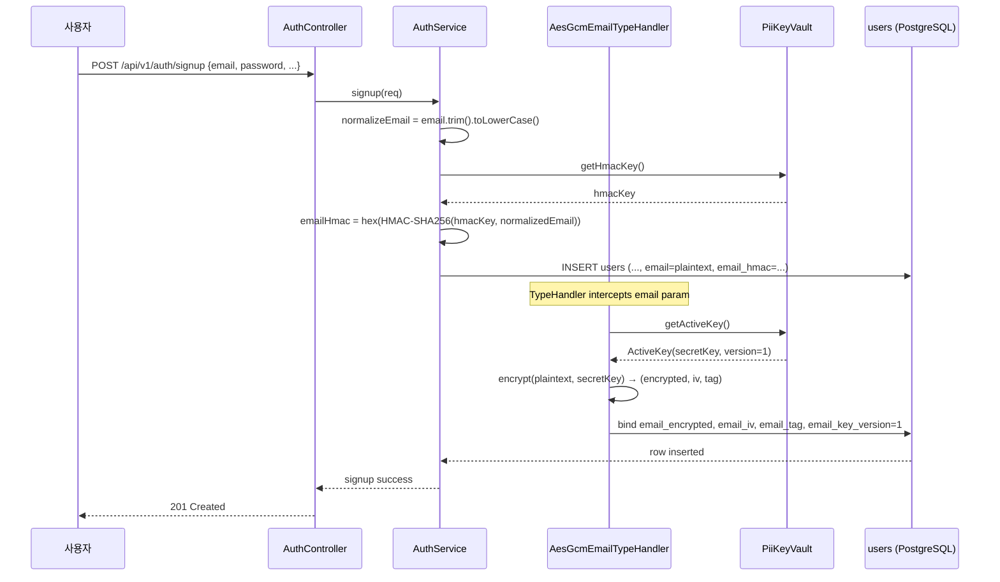
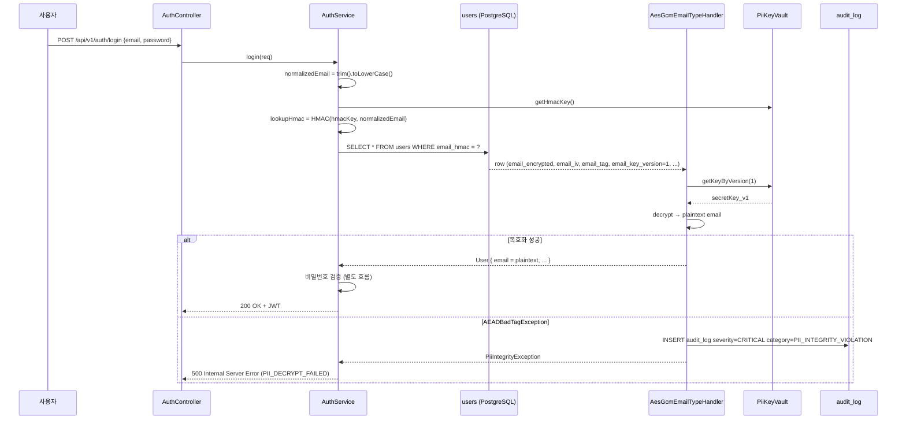
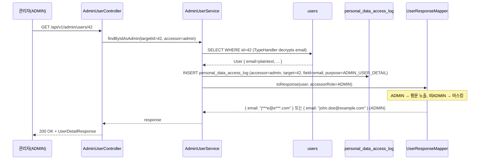
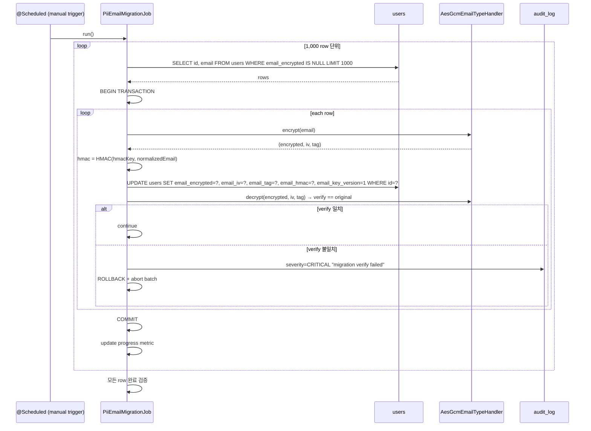

# SPEC-CMS-SECURITY-PII-001: 개인정보 암호화 (PII Encryption — Email) v0.1

## 1. 개요

| 항목 | 내용 |
|------|------|
| SPEC ID | SPEC-CMS-SECURITY-PII-001 |
| 제목 | 개인정보 암호화 (PII Encryption — Email AES-256-GCM + HMAC + 키 관리) |
| 작성일 | 2026-05-07 |
| 작성자 | manager-spec (MoAI) |
| 상태 | Draft |
| 우선순위 | **P0 (운영 배포 차단)** |
| 분류 | Cross-cutting Security SPEC |
| 의존 SPEC | SPEC-CMS-002 §17.2 (PII 처리 정책), REQ-CROSS-002, REQ-AUTH-001~006 |
| 형제 SPEC | 없음 (cross-cutting — 모든 도메인 SPEC의 users.email 사용처에 영향) |

본 SPEC은 SPEC-CMS-002(인증·권한·계정관리) §17.2 PII 처리 정책에서 선언된 "RED 단계 평문 저장, GREEN 단계 AES-256-GCM 암호화 (REQ-CROSS-002)" 약속을 실제 구현으로 이행하는 cross-cutting 보안 SPEC이다. 코드 리뷰 (`8c9ffd3`) HIGH #3 — UserMapper email 암호화 구현 불명확 — 에서 식별된 갭을 해소하며, 운영 배포 전 차단(blocker) 항목으로 관리된다.

본 SPEC은 P0 우선순위로, 1차 범위는 `users.email` 컬럼의 AES-256-GCM 암호화, `email_hash`의 HMAC-SHA256 격상, 키 관리 인터페이스(KMS/Vault 추상화), V24 마이그레이션, 기존 도메인 코드(인증·회원가입·관리자 검색)의 lookup 경로 호환 변경을 포함한다. 다른 PII 컬럼(`users.name`, `login_history.ip` 등)·인프라 단 TDE·로그/백업 마스킹은 후속 SPEC으로 분리한다.

---

## 2. 배경 및 동기

### 2.1 코드 리뷰에서 식별된 갭

코드 리뷰 보고서 `.moai/reports/code-review-20260507.md` Issue #3 및 갭 분석 보고서 `.moai/reports/security-todo-pii.md`에 따르면, V2 인증 스키마(`backend/src/main/resources/db/migration/V2__auth_schema.sql`)는 다음과 같이 명시한다.

```sql
email      VARCHAR(255) NOT NULL UNIQUE,   -- 평문 저장
email_hash VARCHAR(64),                     -- SHA-256(email) — lookup 전용
COMMENT ON COLUMN users.email IS
    'RED 단계: 평문. GREEN에서 AES-256-GCM 암호화(REQ-CROSS-002)';
```

User 엔티티(`User.java`) 또한 `/** 이메일 (AES-256-GCM 암호화 저장 — REQ-CROSS-002, RED 단계에서는 평문) */`로 평문 상태를 의도된 RED 단계로 선언한다. 그러나 GREEN 단계 약속에 해당하는 (a) `EncryptionTypeHandler`/`AesGcmTypeHandler` (b) 암호화 키 관리 정책 (c) V24 암호화 마이그레이션 (d) `email_hash`의 HMAC-SHA256 격상이 모두 미구현 상태다. UserMapper.xml의 `findByUsername`, `findByEmailHash`, `findById`, `findPage`, `findPageWithScope`, `insert`, `update` 모두 평문 email을 그대로 SELECT/INSERT 한다.

### 2.2 운영 배포 차단 사유 (PIPA)

본 갭이 운영 배포 전 해소되지 않으면 **개인정보보호법(PIPA) 제29조 안전성 확보 조치 의무** 위반 위험이 있다. 구체적으로:

- **DB 직접 조회·백업 파일·DB dump 시 email 전체 평문 노출** (현재 위험도 HIGH)
- 관리자 사용자 목록 응답(`UserSummary`)에 email 평문 포함
- DBA 권한 보유자가 평문 SELECT 가능 (DB 사용자 권한 모델만으로는 보호 불가)
- email_hash가 deterministic SHA-256이므로 rainbow table 공격 가능 (salt 미사용 → HMAC 격상 필요)

본 SPEC은 `.moai/reports/security-todo-pii.md` §3 Path A(SPEC-level 후속 작업)의 권장에 정확히 대응하며, Path B(인프라 단 TDE)와 Path C(단기 완화)는 운영 의사결정 영역으로 본 SPEC 범위 밖이다.

---

## 3. 범위 및 비범위

### 3.1 1차 포함 범위 (P0)

| 항목 | 설명 |
|------|------|
| **Email AES-256-GCM 암호화 TypeHandler** | MyBatis `BaseTypeHandler` 확장. 12-byte IV + 16-byte auth tag 분리 저장. 키 버전 추적. |
| **키 관리 인터페이스** | `PiiKeyVault` 추상화. 운영 구현(KMS/Vault 추상) + Local Dev fallback(`LocalEnvPiiKeyVault`). |
| **`email_hash` → HMAC-SHA256 격상** | rainbow table 방지. HMAC 키는 암호화 키와 분리 (`email_hmac` 컬럼 신설). |
| **V24 마이그레이션** | `V24__pii_encryption_email.sql` — 4개 신규 컬럼(`email_encrypted`, `email_iv`, `email_tag`, `email_hmac`, `email_key_version`) + UNIQUE 인덱스. |
| **데이터 마이그레이션 절차** | 기존 평문 email 일괄 암호화 운영 매뉴얼(트랜잭션 단위 + verify roundtrip). |
| **API 응답 마스킹 정책** | ADMIN/본인 외에는 email 마스킹(`m****@d****.com`). |
| **검색 UX 변경 (관리자 한정)** | email full-string HMAC 매칭 lookup. partial(ILIKE) 검색은 PII 보호 정책상 비범위 명시. |
| **인증·회원가입 lookup 경로 변경** | `AuthServiceImpl.findByEmail`에서 normalizedEmail → HMAC-SHA256 → `email_hmac` 매칭. |
| **암호화 무결성 audit** | 복호화 실패(GCM tag mismatch) 시 `audit_log severity='CRITICAL'` 적재. |

### 3.2 1차 비범위 (후속 SPEC 또는 운영 절차 영역)

| 비범위 항목 | 사유 |
|------------|------|
| **PostgreSQL TDE (인프라 레벨 암호화) / pgcrypto / 디스크 LUKS** | 운영팀·보안팀 인프라 의사결정 영역. 본 SPEC은 애플리케이션 레이어 암호화에 집중. 추후 Path B로 보완 가능(중복 방어). |
| **다른 PII 컬럼(`users.name`, `users.phone_e164`, `login_history.ip` 등) 암호화** | 후속 SPEC(`SPEC-CMS-SECURITY-PII-002+`). 본 SPEC은 email에 한정한다. |
| **백업 파일 PII 마스킹** | 운영 백업 정책 영역. 별도 운영 절차(`pg_dump --column-inserts` 후 마스킹 파이프) 정의. |
| **로그 중 PII 마스킹 (Logback 필터)** | 별도 작업. Logback `PatternLayout` + 정규식 마스킹 필터 도입은 운영 표준 영역. |
| **email partial match (관리자 ILIKE 검색)** | PII 보호 정책상 의도적 제외. SPEC-CMS-010 §4 관리자 검색에서 email은 trgm 인덱스에서 제외됨과 일관. |
| **키 회전 자동화 스케줄** | 본 SPEC은 키 회전 인터페이스만 제공. cron 자동 회전 스케줄링은 후속 운영 SPEC. |
| **HSM(Hardware Security Module) 통합** | 1차는 KMS 추상화 인터페이스. HSM-backed KMS는 운영 인프라 의사결정. |
| **암호화된 email로 외부 시스템 연동(SAML/OIDC IdP)** | IdP 연동은 별도 SPEC. 본 SPEC은 내부 DB 암호화에 한정. |

---

## 4. 데이터 모델 변경 (DDL)

### 4.1 V24 마이그레이션 (`V24__pii_encryption_email.sql`)

```sql
-- @MX:NOTE V24 PII 암호화 — SPEC-CMS-SECURITY-PII-001 REQ-PII-EMAIL-001
-- AES-256-GCM (12-byte IV + 16-byte auth tag) 분리 저장 + HMAC-SHA256 lookup 키
-- 기존 평문 email 컬럼은 V25에서 DROP 예정 (운영 마이그레이션 완료 후)

-- 1. 암호문 저장 컬럼 (AES-256-GCM ciphertext)
ALTER TABLE users ADD COLUMN email_encrypted BYTEA;        -- 암호문 (가변 길이)
ALTER TABLE users ADD COLUMN email_iv         BYTEA;        -- IV (12 bytes for GCM)
ALTER TABLE users ADD COLUMN email_tag        BYTEA;        -- Auth tag (16 bytes)

-- 2. lookup용 HMAC-SHA256 (deterministic이지만 별도 키 → rainbow table 방지)
ALTER TABLE users ADD COLUMN email_hmac VARCHAR(64);        -- hex(HMAC-SHA256(hmacKey, normalizedEmail))

-- 3. 키 버전 추적 (점진적 키 회전 지원)
ALTER TABLE users ADD COLUMN email_key_version SMALLINT NOT NULL DEFAULT 1;

-- 4. UNIQUE 제약: email_hmac (lookup 전용, 충돌 시 normalizedEmail 동일 의미)
CREATE UNIQUE INDEX idx_users_email_hmac ON users(email_hmac);

-- 5. 기존 email 컬럼은 마이그레이션 후 NULL 허용 → V25에서 DROP
ALTER TABLE users ALTER COLUMN email DROP NOT NULL;
COMMENT ON COLUMN users.email IS
    'DEPRECATED — V25에서 제거 예정 (SPEC-CMS-SECURITY-PII-001). email_encrypted/iv/tag 사용.';

-- 6. 기존 email_hash 컬럼은 deprecated, email_hmac이 대체
COMMENT ON COLUMN users.email_hash IS
    'DEPRECATED — V25에서 제거 예정. email_hmac (HMAC-SHA256) 사용.';

-- 7. 데이터 분류 등록 (SPEC-CMS-009 data_dictionary 통합)
INSERT INTO data_dictionary (table_name, column_name, data_classification, is_pii, retention_months, description)
VALUES
  ('users', 'email_encrypted',   'CONFIDENTIAL', true,  NULL, 'AES-256-GCM 암호화된 email (SPEC-CMS-SECURITY-PII-001)'),
  ('users', 'email_iv',          'CONFIDENTIAL', false, NULL, 'GCM IV (12 bytes)'),
  ('users', 'email_tag',         'CONFIDENTIAL', false, NULL, 'GCM auth tag (16 bytes)'),
  ('users', 'email_hmac',        'CONFIDENTIAL', true,  NULL, 'HMAC-SHA256(hmacKey, normalizedEmail) — lookup 키'),
  ('users', 'email_key_version', 'INTERNAL',     false, NULL, 'PII 암호화 키 버전 (점진적 회전 지원)')
ON CONFLICT (table_name, column_name) DO UPDATE
SET data_classification = EXCLUDED.data_classification,
    is_pii              = EXCLUDED.is_pii,
    description         = EXCLUDED.description;
```

### 4.2 V25 마이그레이션 (운영 마이그레이션 완료 후 — 후속)

```sql
-- @MX:NOTE V25 deprecated 컬럼 제거 — V24 적용 + 데이터 마이그레이션 완료 후 실행
-- 운영 단계에서 별도 PR로 분리 (본 SPEC 1차 범위 밖)
ALTER TABLE users DROP COLUMN email;       -- 평문 컬럼 제거
ALTER TABLE users DROP COLUMN email_hash;  -- deterministic SHA-256 제거
```

V25는 데이터 마이그레이션 완료 검증 이후에만 실행되며, 운영 절차로 별도 관리한다(§4.3 참조).

### 4.3 데이터 마이그레이션 절차 (운영 매뉴얼)

V24 DDL 적용과 별도로, 기존 사용자 레코드를 암호화하는 일괄 작업이 필요하다.

| 단계 | 작업 | 검증 |
|------|------|------|
| **M1** | V24 적용 (DDL only — 기존 데이터 영향 없음) | `\d users` 컬럼 존재 확인 |
| **M2** | 마이그레이션 배치 실행 (`PiiEmailMigrationJob` — 본 SPEC §7 Step 5) | 진행률 로그 |
| **M3** | 모든 row의 `email_encrypted`/`email_iv`/`email_tag`/`email_hmac` NOT NULL 검증 | `SELECT COUNT(*) FROM users WHERE email IS NOT NULL AND email_encrypted IS NULL` = 0 |
| **M4** | 무작위 샘플 100건 복호화 → 원본 일치 검증 | 100% 일치 |
| **M5** | 신규 INSERT 경로(회원가입) 검증 — V24 적용 후 신규 가입자도 암호화 저장 확인 | 통합 테스트 |
| **M6** | V25 적용 — 평문 컬럼 DROP | DDL 성공 |

마이그레이션 배치는 트랜잭션 단위(예: 1,000 row/tx) + 암호화 직후 즉시 복호화 verify roundtrip + 실패 시 audit_log 적재 + 재시도 정책을 따른다(REQ-PII-EMAIL-001/002).

---

## 5. EARS 요구사항 (REQ-PII-EMAIL-001 ~ 010)

### 5.1 암호화 (REQ-PII-EMAIL-001 ~ 003)

- **REQ-PII-EMAIL-001 (Email AES-256-GCM 암호화 — Event-driven)**
  When User 엔티티의 `email` 필드를 INSERT 또는 UPDATE 하는 경로(`UserMapper.insert`, `UserMapper.update`, 회원가입, email 변경 API)가 호출되면,
  Then 시스템은 `AesGcmEmailTypeHandler` 또는 동등 메커니즘을 통해 다음을 수행해야 한다.
  1. `PiiKeyVault.getActiveKey()`로 현재 활성 암호화 키(256-bit)와 키 버전(`keyVersion`)을 조회
  2. `SecureRandom`으로 12-byte IV를 생성
  3. AES/GCM/NoPadding 알고리즘 + 16-byte authentication tag로 암호화 수행
  4. (`email_encrypted`, `email_iv`, `email_tag`, `email_key_version`) 4개 컬럼에 분리 저장
  5. 평문 email 값은 메모리 외부(로그·DB·파일)에 절대 노출 금지
  암호화 알고리즘 식별자는 `AES/GCM/NoPadding`로 고정. AES-256(키 길이 32 bytes) 미만 키 사용 시 시스템 부팅 거부(`ApplicationFailedEvent`).

- **REQ-PII-EMAIL-002 (Email 복호화 — Event-driven)**
  When User 엔티티 SELECT 경로(`UserMapper.findByUsername`, `findById`, `findByEmailHmac`, `findPage`, `findPageWithScope` 등)가 실행되면,
  Then 시스템은 `email_key_version`으로 `PiiKeyVault.getKeyByVersion(int)`을 호출하여 해당 버전의 키를 조회한 후, (`email_iv`, `email_encrypted`, `email_tag`)로 AES-GCM 복호화하여 `User.email` 필드(평문)에 복원해야 한다.
  복호화 실패 (auth tag mismatch, 키 부재, IV 길이 불일치) 시 시스템은:
  1. `AEADBadTagException` 또는 동등 예외를 catch
  2. `audit_log` 테이블에 `severity='CRITICAL'`, `category='PII_INTEGRITY_VIOLATION'`, `target_user_id={user.id}`, `description='email decryption failed: {reason}'` 행을 적재
  3. 호출자에게는 `PiiIntegrityException`(500 Internal Server Error)으로 노출하며 평문 복원 시도를 즉시 중단
  4. 알림 큐(SPEC-CMS-005 REQ-CROSS-001-D-6)로 운영자 알림 push
  복호화 실패 row는 service layer에서 silently drop 금지(데이터 무결성 사고 은폐 방지).

- **REQ-PII-EMAIL-003 (HMAC 격상 — Ubiquitous, Event-driven)**
  시스템은 email INSERT 또는 UPDATE 시 다음을 수행해야 한다.
  1. `normalizedEmail = email.trim().toLowerCase()` (RFC 5321 local-part 보존, domain 소문자 정규화)
  2. `PiiKeyVault.getHmacKey()`로 HMAC 전용 키(암호화 키와 분리된 256-bit 키)를 조회
  3. `Mac.getInstance("HmacSHA256")` + key로 `HMAC-SHA256(hmacKey, normalizedEmail)` 계산
  4. hex 인코딩하여 `email_hmac`(VARCHAR(64)) 컬럼에 저장
  HMAC 키와 암호화 키는 KeyVault에서 별도 entry로 관리되어야 하며, 동일 키 재사용을 금지한다. 기존 `email_hash`(deterministic SHA-256) 컬럼은 V25에서 제거되며, 본 SPEC RUN 단계에서는 코드 경로에서 사용하지 않는다(deprecated).

### 5.2 키 관리 (REQ-PII-EMAIL-004 ~ 005)

- **REQ-PII-EMAIL-004 (PiiKeyVault 인터페이스 — Ubiquitous)**
  시스템은 다음 시그니처의 `PiiKeyVault` 인터페이스를 제공해야 한다.
  ```java
  public interface PiiKeyVault {
      /** 현재 활성 암호화 키 + 버전. 신규 INSERT/UPDATE 시 사용. */
      ActiveKey getActiveKey();
      /** 지정 버전의 암호화 키. 복호화 시 email_key_version으로 조회. */
      SecretKey getKeyByVersion(int version);
      /** HMAC-SHA256 lookup 키 (암호화 키와 분리). */
      SecretKey getHmacKey();
      record ActiveKey(SecretKey key, int version) {}
  }
  ```
  운영 구현체는 AWS KMS / HashiCorp Vault / Azure Key Vault 등 외부 KMS 추상화 어댑터로 제공되어야 하며(1차는 인터페이스만, 1개 구현체 + Local Dev fallback), Local Dev 구현체 `LocalEnvPiiKeyVault`는 환경변수(`PII_EMAIL_KEY_V1`, `PII_EMAIL_HMAC_KEY`)에서 base64 인코딩 키를 로드한다.
  Local Dev 구현체는 운영 환경에서 사용 시 시스템 부팅 거부(Spring profile `prod` + `LocalEnvPiiKeyVault` 조합 → `IllegalStateException`).

- **REQ-PII-EMAIL-005 (키 회전 — Optional, Event-driven)**
  Where 운영자가 `PiiKeyVault`에 신규 키 버전(예: v2)을 등록한 경우, 시스템은 다음 회전 정책을 지원해야 한다.
  1. **즉시 활성화 (active version 변경)**: 신규 INSERT/UPDATE는 v2 키로 암호화 (`email_key_version=2` 적재)
  2. **점진적 재암호화 (선택)**: 운영자가 별도 배치(`PiiEmailRekeyJob`, 본 SPEC 1차 비범위)를 실행하면 v1 row를 v2로 재암호화 가능
  3. **하위 호환 복호화**: 기존 v1 row는 `getKeyByVersion(1)`이 키를 반환하는 한 정상 복호화 (KMS의 키 export/disable 정책에 의존)
  키 회전 자체는 운영 절차이며, 본 SPEC은 인터페이스(`getKeyByVersion`)와 컬럼(`email_key_version`)만 제공한다. 자동 회전 스케줄러는 후속 SPEC(`SPEC-CMS-SECURITY-PII-ROTATION-001`)으로 분리한다.

### 5.3 조회·검색 (REQ-PII-EMAIL-006 ~ 007)

- **REQ-PII-EMAIL-006 (Email 기반 lookup — Event-driven)**
  When 인증·회원가입·비밀번호 재설정 등에서 사용자 입력 email로 사용자를 조회하는 경로(`AuthServiceImpl.findByEmail`, `AuthServiceImpl.requestPasswordReset` 등)가 실행되면,
  Then 시스템은 다음 순서로 lookup 해야 한다.
  1. 입력 email 정규화: `normalizedEmail = email.trim().toLowerCase()`
  2. HMAC 계산: `lookupHmac = HMAC-SHA256(hmacKey, normalizedEmail)` (hex 인코딩)
  3. `UserMapper.findByEmailHmac(lookupHmac)` 호출 → users 테이블 `email_hmac` 컬럼 매칭
  4. 매칭 row 발견 시 TypeHandler가 자동으로 email 평문 복원 (REQ-PII-EMAIL-002)
  기존 `findByEmailHash(SHA-256)` 호출 경로는 본 SPEC RUN 단계에서 신규 메서드 `findByEmailHmac`으로 대체되며, deprecated 경로는 V25 적용 시 함께 제거된다.
  미존재 row 처리는 `Optional.empty()` (timing attack 방지를 위해 dummy hash 비교는 SPEC-CMS-002 §10.3 패턴 재사용).

- **REQ-PII-EMAIL-007 (관리자 검색 제약 — Ubiquitous, Unwanted)**
  시스템은 관리자(ADMIN) 사용자 검색에서 email 컬럼에 대해 **완전일치 HMAC 매칭만** 허용해야 한다.
  - 허용: `GET /api/v1/admin/users?email={fullEmail}` → normalizedEmail HMAC 계산 → email_hmac 매칭
  - **금지**: email partial match(ILIKE, `pg_trgm` similarity, regex) — PII 보호 정책상 의도적 비범위
  - 기존 `findPage`/`findPageWithScope`의 email ILIKE 분기는 제거되어야 하며, username/name 컬럼만 partial 검색을 유지한다.
  When 관리자가 email partial 검색 파라미터(예: `email=john*`, `email=*example.com`)를 전달하면,
  Then 시스템은 400 Bad Request (`ADMIN_EMAIL_PARTIAL_FORBIDDEN`)로 응답해야 한다.

### 5.4 응답 마스킹 (REQ-PII-EMAIL-008)

- **REQ-PII-EMAIL-008 (API 응답 email 마스킹 — State-driven)**
  While API 호출자가 ADMIN 권한이 아니고 조회 대상 사용자의 본인이 아닌 상태이면, 시스템은 응답 페이로드의 `email` 필드를 다음 규칙으로 마스킹해야 한다.
  - local-part(@ 앞): 첫 글자 + `***` + 마지막 글자 (예: `john.doe` → `j***e`). 길이 1자 시 `*`, 2자 시 `**`, 3자 미만 시 모두 `*`로 치환.
  - domain-part(@ 뒤): 도메인 첫 라벨의 첫 글자 + `***` + TLD 노출 (예: `example.com` → `e***.com`)
  - 결합 예: `john.doe@example.com` → `j***e@e***.com`
  ADMIN 권한 또는 본인(`{authenticated.userId} == {target.userId}`) 조회 시에는 평문 노출.
  마스킹 적용 지점은 컨트롤러 응답 직전(예: `UserResponseMapper` 또는 Jackson `JsonSerializer`)으로 통일되며, service/repository 레이어는 평문을 다룬다(렌더링 책임 분리).
  본 마스킹 규칙은 `UserSummary`(관리자 사용자 목록), `UserDetailResponse`(상세), `LoginHistoryResponse` 등 모든 API 응답에 적용된다.

### 5.5 Audit (REQ-PII-EMAIL-009)

- **REQ-PII-EMAIL-009 (PII 접근 감사 — Ubiquitous, Event-driven)**
  When 평문 email이 ADMIN 권한자에게 노출되는 경로(관리자 사용자 상세 조회, 관리자 사용자 검색 결과)가 호출되면,
  Then 시스템은 SPEC-CMS-002 REQ-AUTH-018(개인정보 접근 로그) 인프라를 재사용하여 `personal_data_access_log`(또는 동등 테이블)에 다음을 적재해야 한다.
  - `accessor_id`: 접근자(ADMIN) user_id
  - `target_user_id`: 조회 대상 user_id
  - `accessed_field`: `'email'`
  - `purpose`: 호출 컨텍스트(예: `'ADMIN_USER_DETAIL'`, `'ADMIN_USER_SEARCH'`, `'PASSWORD_RESET_LOOKUP'`)
  - `accessed_at`: `CURRENT_TIMESTAMP`
  - `ip_hash`: 접근자 IP의 SHA-256 해시
  본인 조회는 적재 제외(과도한 로그 폭증 방지). HMAC lookup만 수행하고 평문을 복호화하지 않는 경로(예: `findByEmailHmac` 단순 존재 확인)는 적재 제외. PII 접근 로그 자체는 SPEC-CMS-009 `retention_policy(target_table='personal_data_access_log', retention_months=36)` 시드에 따라 36개월 보존.

### 5.6 비기능 (REQ-PII-EMAIL-010)

- **REQ-PII-EMAIL-010 (성능·호환성·관측성 — Ubiquitous)**

  **성능:**
  - 단일 row 암호화 추가 지연 < 5ms (BCFIPS provider 또는 `javax.crypto` 표준, AES-256-GCM 단건)
  - 단일 row 복호화 추가 지연 < 5ms (동일 환경)
  - HMAC lookup 매칭 < 10ms (B-tree UNIQUE 인덱스 `idx_users_email_hmac` 사용)
  - 데이터 마이그레이션 배치: 100만 레코드 < 30분 (트랜잭션 1,000 row/tx, 단일 노드, JMeter 측정)

  **호환성:**
  - V24 적용 직후, 기존 코드 경로(`findByEmailHash`) 호출은 410 Gone 또는 명시적 deprecated 경고를 발생시키지 않으며, 신규 경로(`findByEmailHmac`)로 자동 전환된 후 동작해야 한다. 호환 어댑터는 RUN 단계 Step 4에서 정의한다.
  - 기존 인증 토큰(JWT)은 영향 없음. JWT subject는 `user.id`이며 email을 포함하지 않는다(SPEC-CMS-002 §10 검증).

  **관측성:**
  - 암호화/복호화 카운터: Micrometer 메트릭 `pii.email.encrypt.count`, `pii.email.decrypt.count`, `pii.email.decrypt.failure.count` 노출
  - 키 회전 이벤트: `pii.key.rotation.count{key=email}` 메트릭
  - 마이그레이션 진행률: `pii.migration.progress{job=PiiEmailMigrationJob, total, success, failure}` 메트릭
  - 알림: 복호화 실패율 > 0.1% 5분간 지속 시 ALERT (PagerDuty 또는 운영 알림 채널, SPEC-CMS-005 REQ-CROSS-001-D-6 통합)

  **보안 추가:**
  - 평문 email은 `toString()`/`equals()`/로그 포맷에서 마스킹 또는 제외 (Lombok `@ToString.Exclude` 또는 동등)
  - 메모리 dump 보호: 복호화된 email 객체는 사용 후 즉시 nullify(`String` 불변성으로 GC 의존, 단 byte[] 키는 명시적 zero-fill 후 reset)
  - HTTPS 강제: SPEC-CMS-002 §17.1 TLS 1.3 정책 준수 (본 SPEC 신규 정책 아님)

---

## 6. API 영향 분석

본 SPEC은 신규 API를 추가하지 않으며, 기존 API의 내부 동작(payload 마스킹·lookup 경로)을 변경한다.

| API | 변경 내용 | 호환성 |
|------|---------|---------|
| `POST /api/v1/auth/login` | body `email` → 내부 normalize + HMAC 변환 후 `findByEmailHmac` lookup | 호환 (외부 contract 동일) |
| `POST /api/v1/auth/verify/request` | 동일 | 호환 |
| `POST /api/v1/auth/password/reset/request` | 동일 (REQ-PII-EMAIL-006) | 호환 |
| `POST /api/v1/auth/signup` | body `email` 저장 시 AES-GCM 암호화 + HMAC 적재 (TypeHandler 자동) | 호환 |
| `GET /api/v1/users/{id}` | ADMIN/본인 외 응답 email 마스킹 (REQ-PII-EMAIL-008) | **변경** — 응답 형식 변경 |
| `GET /api/v1/admin/users` | email partial 검색 차단(400) — username/name partial은 유지 (REQ-PII-EMAIL-007) | **변경** — 400 신규 |
| `PUT /api/v1/me` | body `email` 변경 시 신규 암호화 + 신규 HMAC 저장 + 이전 row PII 접근 감사 | 호환 |
| `GET /api/v1/admin/users/{id}` | ADMIN은 평문 email 노출 + PII 접근 audit_log 적재 (REQ-PII-EMAIL-009) | **변경** — audit 신규 |

신규 에러 코드: `ADMIN_EMAIL_PARTIAL_FORBIDDEN` (400), `PII_DECRYPT_FAILED` (500), `PII_KEY_VERSION_NOT_FOUND` (500), `PII_KEY_VAULT_UNAVAILABLE` (503).

---

## 7. 구현 순서 (Step 1 ~ 5)

### Step 1: PiiKeyVault 인터페이스 + LocalEnvPiiKeyVault 구현 (Backend 1차)

**목표**: 키 관리 추상화 + Local Dev fallback 구현 + 단위 테스트.

- **1-1 인터페이스**: `PiiKeyVault`, `ActiveKey` record 정의 (REQ-PII-EMAIL-004).
- **1-2 LocalEnvPiiKeyVault**: 환경변수(`PII_EMAIL_KEY_V1`, `PII_EMAIL_HMAC_KEY`) base64 디코딩 + 키 검증(32 bytes).
- **1-3 운영 KMS 어댑터 placeholder**: `KmsBackedPiiKeyVault` 인터페이스 골격(실제 KMS 연동 구현은 운영 인프라 의사결정 후 추가 — 1차 RUN에서는 환경변수 fallback만 동작).
- **1-4 Spring profile 가드**: `prod` profile에서 `LocalEnvPiiKeyVault` 활성 시 부팅 거부.
- **1-5 단위 테스트**: 키 로드 성공/실패, 키 길이 검증, 누락 환경변수 처리(8 케이스 이상).

### Step 2: AesGcmEmailTypeHandler 구현 (Backend 2차)

**목표**: MyBatis TypeHandler + 암호화/복호화 로직 + 단위 테스트.

- **2-1 TypeHandler**: `BaseTypeHandler<String>` 확장 — `setNonNullParameter`(암호화), `getNullableResult`(복호화).
- **2-2 암호화 유틸**: `AesGcmEncryptor` — `encrypt(plaintext, key, version)` → `EncryptedPayload(encrypted, iv, tag, version)`, `decrypt(payload, keyVault)` → plaintext.
- **2-3 마이크로미터 메트릭**: encrypt/decrypt count + failure count + duration histogram.
- **2-4 단위 테스트**: 12 케이스 이상.
  - encrypt/decrypt roundtrip (정상)
  - null 입력 처리
  - 빈 문자열 입력 처리
  - large input (1KB email — RFC 5321 max 254 chars 초과 시 400)
  - key rotation (v1 암호화 → v2 키 활성 → v1 복호화 정상)
  - tag mismatch (변조 ciphertext) → AEADBadTagException + audit_log
  - IV reuse 방지 (동일 평문 + 동일 키 → 매번 다른 ciphertext)
  - 키 부재 (getKeyByVersion 반환 null) → PiiKeyVersionNotFoundException
  - HMAC 일관성 (동일 normalizedEmail → 동일 hmac, 다른 hmac key → 다른 hmac)
  - normalizedEmail 정규화 (대소문자·공백 trim)
  - 동시성 (10 thread × 100 encrypt 병렬 → 충돌 없음)
  - 메트릭 노출 검증

### Step 3: V24 마이그레이션 SQL + Flyway 검증 (Backend 3차)

**목표**: 스키마 변경 적용 + data_dictionary 시드.

- **3-1 V24 마이그레이션**: `V24__pii_encryption_email.sql` 작성 (§4.1).
- **3-2 Flyway 검증**: 로컬 PostgreSQL 16 + Testcontainers 환경에서 마이그레이션 적용 → 컬럼·인덱스 검증.
- **3-3 data_dictionary 시드**: SPEC-CMS-009 `data_dictionary` 5개 row INSERT (§4.1 마이그레이션 스크립트 내 포함).
- **3-4 멱등성**: `IF NOT EXISTS` 가드 + 재실행 시 무결성.

### Step 4: UserMapper.xml 수정 + AuthServiceImpl lookup 경로 변경 (Backend 4차)

**목표**: 영향 범위 코드(MyBatis 매퍼·서비스)를 신규 컬럼/HMAC 경로로 전환.

- **4-1 UserMapper.xml 수정**:
  - `<resultMap>`에 `email_encrypted`/`email_iv`/`email_tag`/`email_key_version` 컬럼 매핑 + TypeHandler 적용
  - `findByUsername`, `findById`, `findPage`, `findPageWithScope`: SELECT 절 평문 email 컬럼 제거 → 4개 신규 컬럼 SELECT
  - `findByEmailHmac` 신규 쿼리 추가 (REQ-PII-EMAIL-006)
  - `findByEmailHash` 쿼리는 deprecated 처리(주석 + 신규 호출 금지, V25에서 제거)
  - `insert`/`update`: email 컬럼 INSERT/UPDATE 경로에 TypeHandler 적용 + email_hmac 동시 INSERT
- **4-2 AuthServiceImpl 수정**:
  - `findByEmail(email)` 메서드 시그니처 유지하되 내부 구현을 `normalizeEmail` → `computeHmac` → `userMapper.findByEmailHmac(hmac)`로 변경
  - 기존 `findByEmailHash` 호출 경로 모두 `findByEmailHmac`로 교체
  - 비밀번호 재설정 토큰 발급 시 PII 접근 감사 적재(REQ-PII-EMAIL-009)
- **4-3 컨트롤러 응답 마스킹**:
  - `UserResponseMapper` 또는 Jackson `@JsonSerialize(using = MaskedEmailSerializer.class)` 적용
  - SecurityContext 기반 ADMIN/본인 분기 (REQ-PII-EMAIL-008)
- **4-4 admin 검색 가드**:
  - `AdminUserController.search` 파라미터 검증 — email partial 패턴 거부 (`*`, `%`, `_` 포함 시 400)
- **4-5 통합 테스트**:
  - 신규 가입자 → 암호화 저장 → 로그인 lookup 정상 (E2E)
  - 비밀번호 재설정 요청 → HMAC lookup → 토큰 발급 (E2E)
  - 관리자 사용자 상세 조회 → 평문 노출 + audit 적재 검증
  - 비ADMIN 사용자 상세 조회 → 마스킹 적용 검증
  - 관리자 email partial 검색 → 400 반환

### Step 5: 데이터 마이그레이션 배치 + 운영 매뉴얼 (Backend 5차 — 운영)

**목표**: 기존 평문 email row를 일괄 암호화하는 배치 + V25 적용 절차 문서화.

- **5-1 PiiEmailMigrationJob**: Spring Batch 또는 `@Scheduled` 단발성 잡 — 배치 단위 1,000 row, 트랜잭션 격리, verify roundtrip(암호화 직후 복호화 → 평문 일치 확인), 진행률 로깅, 실패 시 audit_log + 알림.
- **5-2 운영 매뉴얼**: `.moai/docs/operations/pii-email-migration-runbook.md`(또는 동등) — §4.3 M1~M6 절차, 롤백 시나리오, 키 백업 절차.
- **5-3 V25 마이그레이션**: `V25__drop_email_plaintext.sql` 작성 (운영 단계에서 별도 PR로 분리 — 본 SPEC 1차 RUN 범위는 V24까지).
- **5-4 모니터링**: Micrometer 메트릭 + Grafana 대시보드 권고(`pii.migration.progress` 패널).

### Step 의존성

- Step 2는 Step 1 완료 의존 (PiiKeyVault 인터페이스 선행)
- Step 3은 Step 1, 2 동시 진행 가능 (DDL은 코드와 분리)
- Step 4는 Step 1, 2, 3 모두 완료 의존
- Step 5는 Step 4 완료 + 운영 인프라 KMS 결정 의존 (1차 RUN 외 — 운영 단계 별도 PR)
- 우선순위: Step 1/2 P0-High → Step 3 P0-High → Step 4 P0-High → Step 5 P1-Medium (운영 단계)

---

## 8. 시퀀스 다이어그램

### 8.1 신규 회원가입 — email 암호화 저장 (REQ-PII-EMAIL-001/003)



### 8.2 로그인 — HMAC lookup + 복호화 (REQ-PII-EMAIL-002/006)



### 8.3 관리자 사용자 상세 조회 — PII 접근 감사 (REQ-PII-EMAIL-008/009)



### 8.4 데이터 마이그레이션 배치 (REQ-PII-EMAIL-001/002)



---

## 9. 위험 및 가정

### 9.1 위험 및 대응

| ID | 위험·가정 | 영향 | 완화 방안 |
|----|---------|------|---------|
| RISK-PII-01 | 마이그레이션 중 데이터 정합성 깨짐 (암호화 후 verify 실패) | 일부 row email 복원 불가 | 트랜잭션 단위(1,000 row/tx) + 암호화 직후 즉시 복호화 verify roundtrip + 실패 시 ROLLBACK + audit_log CRITICAL |
| RISK-PII-02 | 키 분실 (KMS 백업 없음) → 모든 email 복호화 불가 | 운영 사고 (사용자 로그인 불가, PII 복원 불가) | (1) KMS 키 백업 정책 의무화 (2) 키 export 절차 운영 매뉴얼 (3) 다중 region 백업 (운영 인프라) (4) DR 시나리오 정기 훈련 |
| RISK-PII-03 | HMAC 키와 암호화 키 동시 분실 시 lookup·복호화 모두 불가 | 사용자 식별 불가 | 두 키 모두 KMS 백업 + 분리 저장(블래스트 라디우스 축소). HMAC 키만 분실 시 재생성 후 일괄 재계산 가능(평문 복호화 후 재 HMAC) |
| RISK-PII-04 | TypeHandler 복호화 실패가 silent drop 되어 데이터 무결성 사고 은폐 | 보안 사고 미인지 | REQ-PII-EMAIL-002에 명시 — `PiiIntegrityException`으로 예외 전파 + audit_log CRITICAL + 알림 큐 push. 통합 테스트로 검증. |
| RISK-PII-05 | 동일 email에 대한 IV 재사용 (SecureRandom 결함) → ciphertext 패턴 노출 | 암호학적 취약 | (1) `SecureRandom.getInstanceStrong()` 또는 동등 (2) IV 12-byte 신선도 검증 단위 테스트 (REQ-PII-EMAIL-001 IV reuse 방지) |
| RISK-PII-06 | LocalEnvPiiKeyVault가 운영 환경에서 활성화되어 환경변수 키 사용 | 키 관리 정책 위반 | Spring profile `prod` + `LocalEnvPiiKeyVault` 조합 부팅 거부 (REQ-PII-EMAIL-004). 단위 테스트로 검증. |
| RISK-PII-07 | 키 회전 후 v1 키 즉시 삭제로 기존 row 복호화 불가 | 데이터 손실 | 점진적 회전 + KMS는 키 disable(soft delete)만 허용 — 운영 정책 의무화. `getKeyByVersion`은 disabled 키도 복호화용 read 가능해야 함 |
| RISK-PII-08 | 관리자 사용자 검색 ILIKE 차단으로 운영 UX 저하 | 운영 불편 | 사용자 username/name 검색은 유지 (REQ-PII-EMAIL-007). email 완전일치 검색은 HMAC 매칭으로 빠름. partial 검색은 PII 보호 정책상 의도된 비범위 — 운영자에게 사전 공지 필요 |
| RISK-PII-09 | 응답 마스킹 누락(Jackson serializer 미적용 경로) | PII 노출 | (1) ArchUnit 테스트로 모든 UserResponse DTO에 `@JsonSerialize` 또는 마스킹 매퍼 강제 (2) 통합 테스트로 비ADMIN 응답 형식 검증 (3) `UserSummary` 등 모든 응답 DTO 일관 적용 |
| RISK-PII-10 | 마이그레이션 배치 실행 중 신규 INSERT 발생 시 새 row가 빠짐 | 마이그레이션 누락 | (1) V24 적용 시점부터 신규 INSERT는 TypeHandler로 자동 암호화됨 → 누락 없음 (2) 배치 종료 후 `WHERE email_encrypted IS NULL` 0건 검증 단계 (M3) |
| RISK-PII-11 | BCFIPS provider 미제공 환경에서 javax.crypto fallback 시 FIPS 미준수 | 컴플라이언스 위반 가능성 | 1차는 표준 javax.crypto 사용(외부 의존성 최소). FIPS 요구 시 후속 SPEC에서 BCFIPS 도입(`SPEC-CMS-SECURITY-FIPS-001`) |
| RISK-PII-12 | 동일 email 중복 가입(대소문자 차이) — 정규화 누락 | UNIQUE 제약 위반 누락 | normalizedEmail 정규화 단계(REQ-PII-EMAIL-003) 명시. 단위 테스트로 검증. `email_hmac` UNIQUE 인덱스가 최종 가드 |
| ASSUM-PII-01 | KMS/Vault는 운영 인프라 의사결정 영역으로 1차 RUN에서는 LocalEnvPiiKeyVault만 동작 | 운영 적용 지연 | 1차 RUN 결과물은 인터페이스 + LocalEnv 구현. KMS 어댑터 구현은 운영 인프라 결정 후 후속 PR (본 SPEC §3.2 비범위 — HSM/KMS 자동화) |
| ASSUM-PII-02 | SPEC-CMS-002 §17.2 PII 처리 정책이 `personal_data_access_log` 테이블을 정의했음 | 의존 위반 | RUN 시 `personal_data_access_log` 존재 검증 (`@PostConstruct` `PiiInfraValidator`); 부재 시 V24 마이그레이션에서 함께 생성하거나 SPEC-CMS-002 보완 |
| ASSUM-PII-03 | javax.crypto AES/GCM 표준 라이브러리만 사용 (외부 의존성 추가 없음) | 라이브러리 의존성 최소 | BouncyCastle도 옵션. 1차는 JDK 17 표준 SunJCE provider 사용 (`javax.crypto.Cipher`, `javax.crypto.spec.GCMParameterSpec`) |
| ASSUM-PII-04 | 단일 백엔드 노드 + 단일 PG 인스턴스 | 멀티노드 키 동기화 미적용 | KMS 어댑터 도입 시 자동 해소(KMS는 멀티노드 공유). 1차 LocalEnv 환경변수는 동일 환경변수 배포로 해결 |

### 9.2 SPEC-CMS-002 통합 노트

본 SPEC v0.1 작성 후 SPEC-CMS-002 §17.2 PII 처리 정책 항목을 다음과 같이 갱신할 것을 권고한다(별도 트랜잭션, 본 SPEC 작업 범위 외).

- 갱신 전: `email AES-256-GCM 암호화 (REQ-CROSS-002, RED 단계 평문)`
- 갱신 후: `email AES-256-GCM 암호화 (REQ-CROSS-002, GREEN 단계 — SPEC-CMS-SECURITY-PII-001로 분리 구현)`

또한 SPEC-CMS-002 REQ-AUTH-018(개인정보 접근 로그)와 본 SPEC REQ-PII-EMAIL-009의 연결을 §17.2 또는 §10에 cross-reference로 명시하는 것이 권고된다.

---

## 10. PIPA 컴플라이언스 매핑

| PIPA 조항 | 본 SPEC 대응 |
|---------|-------------|
| 제29조 안전성 확보 조치 의무 — 개인정보의 안전한 보관 | REQ-PII-EMAIL-001 (AES-256-GCM 암호화), §4.1 V24 마이그레이션, §10 키 관리 |
| 제29조 — 접근 통제 | REQ-PII-EMAIL-007 (관리자 검색 제약), REQ-PII-EMAIL-008 (응답 마스킹) |
| 제29조 — 접속 기록 보관 | REQ-PII-EMAIL-009 (PII 접근 감사 — `personal_data_access_log` 36개월 보존) |
| 제29조 — 위·변조 방지 | REQ-PII-EMAIL-002 (GCM auth tag 무결성 검증, 실패 시 audit_log CRITICAL) |
| 정보통신망법·개인정보 안전성 확보조치 기준 — 암호화 키 관리 | REQ-PII-EMAIL-004/005 (PiiKeyVault + 점진적 회전), §9.1 RISK-PII-02/03 (백업·DR) |

본 SPEC 적용 후 운영 배포 차단(blocker) 상태가 해소되어 PIPA 안전성 확보 조치 의무를 충족한다.

---

## 11. 변경 이력

| 버전 | 일자 | 작성자 | 변경 내용 |
|------|------|--------|----------|
| v0.1 | 2026-05-07 | manager-spec | 초안 작성. PIPA 대응 P0(운영 배포 차단). 코드 리뷰(`8c9ffd3`) HIGH #3 + `.moai/reports/security-todo-pii.md` Path A 권장에 정확히 대응. SPEC-CMS-002 §17.2 PII 처리 정책의 GREEN 단계 약속을 cross-cutting Security SPEC으로 분리하여 이행. AES-256-GCM 암호화 TypeHandler + HMAC-SHA256 lookup 격상 + 키 관리 인터페이스(KMS/Vault 추상화 + Local Dev fallback) + V24 마이그레이션(4개 신규 컬럼 + UNIQUE 인덱스) + 데이터 마이그레이션 운영 매뉴얼(M1~M6) + API 응답 마스킹(`m***@d***.com`) + 관리자 검색 제약(partial 차단) + PII 접근 감사(REQ-AUTH-018 통합) 6개 축에 REQ-PII-EMAIL-001 ~ 010 (총 10개 부모 REQ) 정의. 1차 비범위에 PostgreSQL TDE / 다른 PII 컬럼 / 백업·로그 마스킹 / partial 검색 / 키 회전 자동화 / HSM / IdP 연동 명시. RISK-PII-01 ~ 12 + ASSUM-PII-01 ~ 04. PIPA 제29조 매핑 §10. |

---
