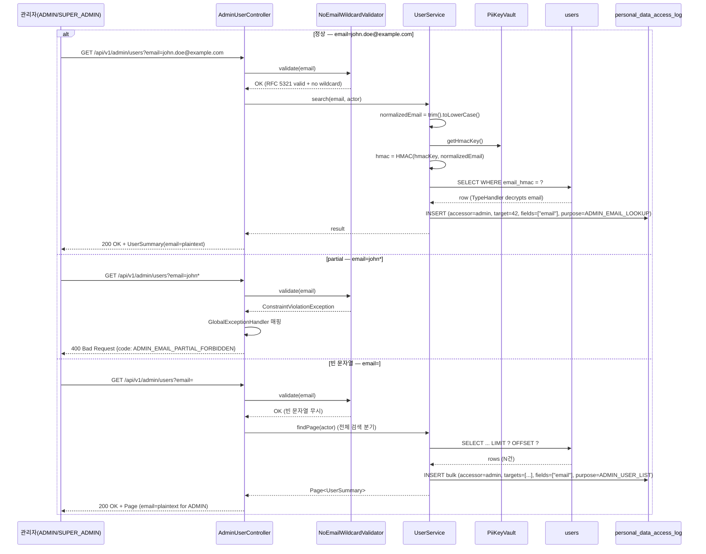
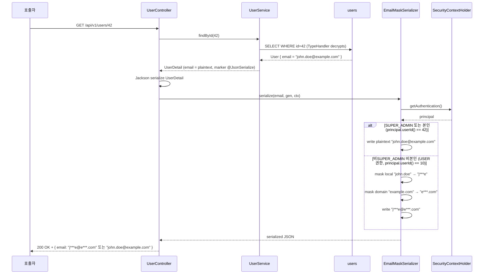
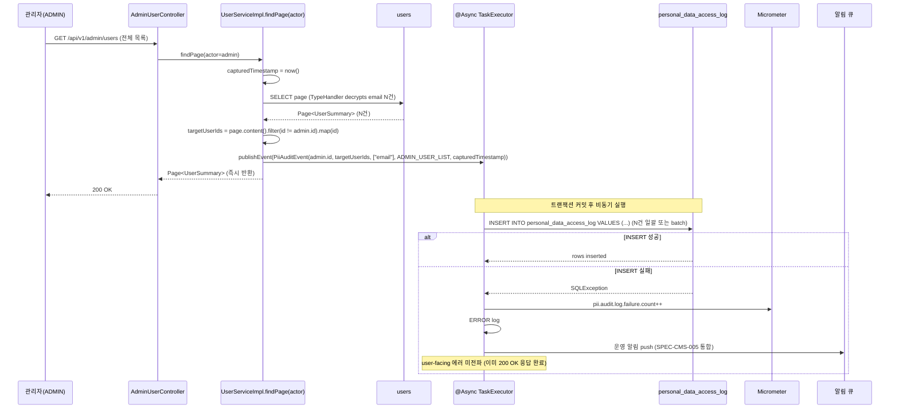

# SPEC-CMS-SECURITY-PII-002: PII 노출 통제 (Admin 검색 partial 차단 + 응답 마스킹 + PII 접근 감사 보강) v0.1

## 1. 개요

| 항목 | 내용 |
|------|------|
| SPEC ID | SPEC-CMS-SECURITY-PII-002 |
| 제목 | PII 노출 통제 (Admin 검색 partial 차단 + 응답 마스킹 + PII 접근 감사 보강) |
| 작성일 | 2026-05-08 |
| 작성자 | manager-spec (MoAI) |
| 상태 | Implemented (1차 — Step 1~4 완료, 2026-05-08) |
| 우선순위 | **P0 (PIPA 추가 완화)** |
| 분류 | Cross-cutting Security SPEC |
| 의존 SPEC | SPEC-CMS-SECURITY-PII-001 §5.3/§5.4/§5.5 (REQ-007/008/009 정의 원본), SPEC-CMS-002 §16.2 REQ-AUTH-018-D (PII 접근 감사 인프라), SPEC-CMS-002 §17.3 personal_data_access_log DDL |
| 형제 SPEC | SPEC-CMS-SECURITY-PII-001 (1차 — V24 마이그레이션 + Email AES-256-GCM 암호화 + HMAC lookup 완료, 2026-05-08) |

본 SPEC은 SPEC-CMS-SECURITY-PII-001 RUN 1차(Step 1~4 + follow-up fix) 완료 이후 후속 cross-cutting 보안 SPEC이다. 1차에서 V24 마이그레이션·AesGcmEmailEncryptionService·HMAC lookup·prod profile 부팅 거드까지 적용되어 평문 저장 위험은 해소되었으나, SPEC-CMS-SECURITY-PII-001 §3.2 비범위로 보류된 항목 중 KMS 인프라 결정과 독립적으로 즉시 RUN 가능한 3건(REQ-PII-EMAIL-007 관리자 partial 검색 차단 / REQ-PII-EMAIL-008 API 응답 email 마스킹 / REQ-PII-EMAIL-009 `findPage(actor)` PII 접근 감사 보강)을 본 SPEC에서 RUN 단계로 이행한다. 본 SPEC은 PIPA 제29조 안전성 확보 조치 의무의 추가 완화 단계로 P0 우선순위이며, 운영 인프라 의사결정(KMS/HSM)에 의존하지 않는 애플리케이션 레이어 노출 통제에 한정된다.

**구현 대상 요구사항**: REQ-PII-EMAIL-007, REQ-PII-EMAIL-008, REQ-PII-EMAIL-009 (SPEC-CMS-SECURITY-PII-001 §5.3~§5.5에서 정의된 REQ를 본 SPEC에서 RUN 단계로 이행)

본 SPEC의 1차 범위는 (1) admin 사용자 검색의 email partial 입력 차단(400 ADMIN_EMAIL_PARTIAL_FORBIDDEN), (2) 비ADMIN 비본인 호출자 응답에 대한 email 마스킹(`**@e***.com`/`j***e@e***.com` 등 길이별 규칙), (3) `findPage(actor)` 경로의 PII 접근 감사 적재 보강(`personal_data_access_log` 일괄 INSERT), (4) ArchUnit으로 UserSummary/UserDetail email 필드 직렬화 강제다. 신규 DDL은 없으며, 기존 인프라(`personal_data_access_log` SPEC-CMS-002 §17.3, `PiiKeyVault`/HMAC lookup SPEC-CMS-SECURITY-PII-001)를 재사용한다.

---

## 2. 배경 및 동기

### 2.1 SPEC-PII-001 비범위에서 분리된 항목

SPEC-CMS-SECURITY-PII-001 §3.2(1차 비범위)는 다음과 같이 명시한다.

> | **다른 PII 컬럼(`users.name`, `users.phone_e164`, `login_history.ip` 등) 암호화** | 후속 SPEC(`SPEC-CMS-SECURITY-PII-002+`). 본 SPEC은 email에 한정한다. |
>
> | **백업 파일 PII 마스킹** | 운영 백업 정책 영역. 별도 운영 절차 정의. |

또한 SPEC-PII-001 §5.3~§5.5에 정의된 REQ-PII-EMAIL-007/008/009는 인터페이스/요구사항만 선언되었을 뿐, RUN 1차 (commit `0a6b14e`, `1d4ae61`, `e432d53`, `29878b9`, `f91628a`, `44cc3b8`)에서는 Step 1(KeyVault) ~ Step 4(UserMapper.xml) 핵심 암호화 경로만 구현되었으며, 응답 마스킹·관리자 검색 차단·`findPage(actor)` 감사 적재는 미구현 상태다. SPEC-PII-001 §11 v0.2 변경 이력 또한 "관련 후속 SPEC: PII-002, KMS-001, ROTATION-001, MASKING-001"로 분리를 명시한다.

본 SPEC은 그 중 KMS 인프라 의사결정에 독립적이고 즉시 RUN 가능한 3건(REQ-007/008/009)을 cross-cutting 보안 SPEC으로 묶어 PIPA 추가 완화 P0로 처리한다.

### 2.2 PIPA 제29조 추가 완화 사유

SPEC-PII-001 RUN 1차로 평문 저장 위험은 해소되었으나, PIPA 제29조 안전성 확보 조치 의무의 다음 항목은 본 SPEC 적용 전까지 부분 충족 상태로 남아 있다.

- **접근 통제 (제29조)**: 관리자 검색 UI에서 email partial 입력이 가능하면 부분 일치 패턴 노출이 발생한다. SPEC-PII-001 RUN 1차에서 HMAC 완전일치 lookup 메서드는 추가되었으나, 컨트롤러 입력단에서 partial 패턴(`*`, `%`, `_` 등)을 거부하는 가드가 미구현이다.
- **접근 통제 (제29조)**: 비ADMIN 비본인 호출자 응답에 평문 email이 그대로 노출된다 (예: `GET /api/v1/users` 비admin 사용자 목록, `GET /api/v1/admin/users/{id}` 비ADMIN 권한 우회 시나리오 등). 응답 직렬화 단계의 마스킹이 미구현이다.
- **접속 기록 보관 (제29조)**: SPEC-CMS-002 REQ-AUTH-018-D는 `personal_data_access_log` 테이블을 정의했고, SPEC-PII-001 §5.5는 ADMIN 상세 조회 경로의 적재만 명시했다. ADMIN 사용자 목록 조회(`findPage(actor)`) 경로는 N건 row의 평문 email을 응답 페이로드에 노출하지만 audit 적재가 미구현이다.

본 SPEC 적용 후 PIPA 제29조 접근 통제·접속 기록 보관 의무가 운영 배포 가능 수준으로 추가 완화된다.

---

## 3. 범위 및 비범위

### 3.1 1차 포함 범위 (P0)

| 항목 | 설명 |
|------|------|
| **REQ-PII-EMAIL-007 — Admin email partial 검색 차단** | `GET /api/v1/admin/users` 컨트롤러에서 `email` 파라미터에 partial 패턴(`*`, `%`, `_`, `@` 미포함) 입력 시 400 `ADMIN_EMAIL_PARTIAL_FORBIDDEN`. 빈 문자열은 무시(전체 검색). |
| **REQ-PII-EMAIL-008 — API 응답 email 마스킹** | UserSummary/UserDetail DTO의 email 필드에 `EmailMaskSerializer` 적용. SUPER_ADMIN 또는 본인 호출자에게는 평문, 그 외에는 길이별 마스킹 규칙(1자 `*` / 2자 `**` / 3자 이상 `j***e@e***.com`). UserSelf는 마스킹 미적용. |
| **REQ-PII-EMAIL-009 — `findPage(actor)` PII 접근 감사 보강** | `UserServiceImpl.findPage(actor)` 결과 N건의 user_id 목록을 `personal_data_access_log`에 일괄 적재. `purpose='ADMIN_USER_LIST'`. 본인 조회·HMAC 단독 lookup은 적재 제외. |
| **`PersonalDataAccessPurpose` enum 확장** | `ADMIN_USER_LIST`, `ADMIN_EMAIL_LOOKUP` 신규 값 추가 (DDL 변경 없음, Java 코드만). |
| **AOP advice fallback 정책** | 감사 INSERT 실패 시 user-facing 에러 미전파. ERROR 로그 + Micrometer `pii.audit.log.failure.count` + 알림 큐 push. |
| **ArchUnit 강제 (Step 4)** | UserSummary/UserDetail의 email 필드에 `@JsonSerialize(using = EmailMaskSerializer.class)` 적용 강제. |
| **신규 에러 코드** | `ADMIN_EMAIL_PARTIAL_FORBIDDEN` (400). |

### 3.2 1차 비범위 (후속 SPEC 또는 운영 절차 영역)

| 비범위 항목 | 사유 |
|------------|------|
| **KMS 키 회전 자동화** | 운영 인프라 의사결정 영역. 후속 SPEC(`SPEC-CMS-SECURITY-PII-ROTATION-001`)으로 분리. |
| **다른 PII 컬럼 암호화 (`users.name`, `users.phone_e164`, `login_history.ip` 등)** | 후속 SPEC 시리즈(`SPEC-CMS-SECURITY-PII-NEXT-001+`)로 분리. 본 SPEC은 email 노출 통제에 한정. |
| **백업 파일 PII 마스킹** | 운영 백업 정책 영역. `pg_dump --column-inserts` 후 마스킹 파이프 등 운영 절차로 별도 정의. |
| **로그 중 PII 마스킹 (Logback 필터)** | 별도 작업. Logback `PatternLayout` + 정규식 마스킹 필터 도입은 운영 표준 영역. 후속 SPEC(`SPEC-CMS-SECURITY-PII-MASKING-001`). |
| **`existsByEmail` HMAC 교체** | SPEC-PII-001 V25 마이그레이션에서 평문 `email` 컬럼 DROP 시 자연 해결. V25 적용 시 deprecated 경로 제거하는 후속 SPEC에서 다룬다. |
| **비밀번호 재설정 흐름의 audit 적재** | HMAC lookup-only 경로는 평문 노출이 없으므로 SPEC-PII-001 §5.5 명시에 따라 의도적 제외 (REQ-PII-EMAIL-009 본문 명시). |

---

## 4. 데이터 모델 변경

신규 DDL은 **없다**. 기존 `personal_data_access_log` 테이블(SPEC-CMS-002 §17.3 REQ-AUTH-018-D)을 그대로 재사용한다.

### 4.1 `purpose` 화이트리스트 확장 (Java enum 변경)

`PersonalDataAccessPurpose` enum에 신규 값 추가 (DDL 변경 없음, Java 코드만 변경).

| 신규 값 | 발화 경로 | REQ 매핑 |
|--------|----------|---------|
| `ADMIN_USER_LIST` | `UserServiceImpl.findPage(actor)` 결과 N건 일괄 적재 | REQ-PII-EMAIL-009 |
| `ADMIN_EMAIL_LOOKUP` | `findByEmailHmac` 정상 매칭 결과 적재 (REQ-007 정상 검색 결과) | REQ-PII-EMAIL-007 |

기존 enum 값(유지): `ADMIN_USER_DETAIL`, `ADMIN_USER_EDIT`, `ADMIN_USER_SEARCH`, `BUSINESS_INQUIRY`, `SELF_VIEW`, `PASSWORD_RESET_LOOKUP`.

### 4.2 컬럼명 통일 보정

SPEC-CMS-002 §17.3 실제 DDL은 `accessed_fields` jsonb 컬럼이며, SPEC-PII-001 §5.5 본문의 `accessed_field` 단수형은 오타다. 본 SPEC에서는 실제 DDL 컬럼명 `accessed_fields`(jsonb 배열)을 정확히 사용하며, 단일 필드 적재 시 `["email"]` 배열로 직렬화한다.

---

## 5. EARS 요구사항 (REQ-PII-EMAIL-007 ~ 009)

본 SPEC의 REQ ID는 SPEC-CMS-SECURITY-PII-001 §5.3~§5.5에서 정의된 원본을 그대로 사용한다(옵션 A). 신규 prefix 도입 없이 기존 REQ를 RUN 단계로 이행한다.

### 5.1 REQ-PII-EMAIL-007 (관리자 검색 제약 — Ubiquitous + Unwanted 복합)

시스템은 관리자(ADMIN/SUPER_ADMIN) 사용자 검색 API(`GET /api/v1/admin/users`)에서 `email` 쿼리 파라미터에 대해 **완전일치 HMAC 매칭만** 허용해야 한다(Ubiquitous).

- 허용: `GET /api/v1/admin/users?email=john.doe@example.com` → normalizedEmail HMAC 계산 → `email_hmac` 매칭(SPEC-PII-001 REQ-PII-EMAIL-006 재사용)
- 허용: `email` 파라미터 미포함 또는 빈 문자열(`?email=`) → 전체 검색 분기로 무시(ILIKE 미발생)
- **금지**: email 컬럼에 partial 패턴이 포함된 입력 — `*`, `%`, `_`, 와일드카드 문자, `@` 미포함 문자열, 공백 등 RFC 5321 valid email format 위배

When 관리자가 email partial 패턴 파라미터(예: `email=john*`, `email=*example.com`, `email=%doe%`, `email=test@`(@-trailing partial))를 전달하면(Unwanted),
Then 시스템은 컨트롤러 진입 단계의 Bean Validation 또는 동등 가드(`@NoEmailWildcard` + `NoEmailWildcardValidator`)에서 즉시 거부하여 400 Bad Request `ADMIN_EMAIL_PARTIAL_FORBIDDEN`으로 응답해야 하며, `users` 테이블에 ILIKE 또는 `pg_trgm` 쿼리는 절대 실행되지 않아야 한다(DB 슬로우 쿼리 로그로 검증).

본 요구사항은 SPEC-CMS-010 §4 관리자 검색에서 email이 trgm 인덱스에서 제외됨과 일관하며, username/name partial 검색은 영향 없이 유지된다.

### 5.2 REQ-PII-EMAIL-008 (API 응답 email 마스킹 — State-driven)

While API 호출자가 SUPER_ADMIN 권한이 아니고 조회 대상 사용자의 본인이 아닌 상태이면(`JwtPrincipal.userId() != target.userId() && !hasRole('SUPER_ADMIN')`), 시스템은 응답 페이로드의 `email` 필드를 다음 규칙으로 마스킹해야 한다.

- **local-part(@ 앞)**:
  - 길이 1자(코드 포인트 단위): `*`
  - 길이 2자: `**` (사용자 결정 사항)
  - 길이 3자 이상: 첫 글자 + `***` + 마지막 글자 (예: `john.doe` → `j***e`)
- **domain-part(@ 뒤)**: 도메인 첫 라벨의 첫 글자 + `***` + `.` + TLD (예: `example.com` → `e***.com`)
- **결합 예**:
  - `a@b.com` → `*@b***.com` (local 1자, domain 1자 라벨)
  - `ab@example.com` → `**@e***.com` (local 2자)
  - `john.doe@example.com` → `j***e@e***.com` (local 3자 이상)
- **길이 계산**: UTF-8 코드 포인트 단위 (IDN 도메인·이모지 안전, RFC 5321 RFC 6532 호환)

SUPER_ADMIN 권한 또는 본인 조회 시에는 평문 노출. UserSelf DTO(자기 정보 조회 응답)는 마스킹 미적용 — 자기 정보 평문 OK 정책.

마스킹 적용 지점은 Jackson `JsonSerializer` (`EmailMaskSerializer`)로 통일되며, service/repository 레이어는 평문을 다룬다(렌더링 책임 분리). `UserSummary`(관리자 사용자 목록 응답), `UserDetail`(상세 조회 응답)의 `email` 필드에 `@JsonSerialize(using = EmailMaskSerializer.class)` 어노테이션을 적용하며, ArchUnit 테스트로 모든 `*UserResponse`/`*UserSummary`/`*UserDetail` DTO에 일관 적용을 강제한다(Step 4).

SecurityContext 접근은 `RequestAttributes`/`SecurityContextHolder` 전략을 사용하며, Spring Boot 3.4 + Jackson 2.18+ 환경에서 Java record 호환성 IT 검증을 수행한다(architect RISK-002-01 대응).

### 5.3 REQ-PII-EMAIL-009 (PII 접근 감사 보강 — Event-driven + Ubiquitous 복합)

When ADMIN 권한자에게 평문 email이 노출되는 경로 — 특히 SPEC-PII-001 RUN 1차에서 미적재된 `UserServiceImpl.findPage(actor)` 관리자 사용자 목록 조회 — 가 호출되면(Event-driven),
Then 시스템은 SPEC-CMS-002 REQ-AUTH-018-D 인프라(`personal_data_access_log`)를 재사용하여 결과 N건의 user_id 목록을 일괄 적재해야 한다(Ubiquitous).

적재 방식:
- `accessor_id`: 접근자(ADMIN/SUPER_ADMIN) `JwtPrincipal.userId()`
- `target_user_id`: 결과 row의 user_id (N건 일괄)
- `accessed_fields`: `["email"]` jsonb 배열 (SPEC-CMS-002 §17.3 실제 컬럼명 사용)
- `purpose`: `'ADMIN_USER_LIST'` (REQ-009 보강 신규 enum 값) 또는 `'ADMIN_EMAIL_LOOKUP'` (REQ-007 정상 검색 결과)
- `accessed_at`: `CURRENT_TIMESTAMP`
- `ip_hash`: 접근자 IP의 SHA-256 해시

구현 패턴:
- AOP advice 코드 변경 **없음**. 기존 advice는 단건 적재 제약이 있으므로 우회한다.
- `UserServiceImpl.findPage(actor)` 오버로드 내에서 `PersonalDataAccessLogService.recordBulk(viewerId, [target_user_ids], "email", ADMIN_USER_LIST)` 직접 호출 또는 `List<Long>` 일괄 INSERT 패턴.
- 비동기 실행 권장(architect RISK-002-03 대응): `@Async` + `@Transactional(propagation=REQUIRES_NEW)` 또는 트랜잭션 외 실행. 메서드 진입 시각은 동기 캡처 후 비동기 전달.

적재 제외 경로:
- 본인 조회 (`JwtPrincipal.userId() == target.userId()`) — 과도한 로그 폭증 방지 (SPEC-PII-001 §5.5 명시 재사용)
- HMAC lookup-only로 평문 복호화가 발생하지 않는 경로 (예: `findByEmailHmac` 단순 존재 확인, 비밀번호 재설정 토큰 발급 lookup) — 평문 노출 없음

AOP advice fallback 정책 (사용자 결정 사항):
- 감사 INSERT 실패 시 user-facing 에러로 전파 **금지**. 정상 응답은 그대로 반환.
- ERROR 로그 적재 + Micrometer 카운터 `pii.audit.log.failure.count` 1 증가.
- 운영 알림 큐 push (SPEC-CMS-005 REQ-CROSS-001-D-6 통합).
- `pii.audit.log.failure.count`가 5분간 임계치(설정값, 기본 10건) 초과 시 ALERT.

PII 접근 로그 자체는 SPEC-CMS-009 `retention_policy(target_table='personal_data_access_log', retention_months=36)` 시드에 따라 36개월 보존된다.

---

## 6. API 영향 분석

본 SPEC은 신규 API를 추가하지 않으며, 기존 API의 동작(입력 검증·응답 직렬화·audit 적재)을 변경한다.

| API | 변경 내용 | 호환성 |
|------|---------|---------|
| `GET /api/v1/admin/users` (리스트) | (1) `email` 파라미터에 partial 패턴 입력 시 400 `ADMIN_EMAIL_PARTIAL_FORBIDDEN` (REQ-007). (2) 정상 결과 N건 `personal_data_access_log` 일괄 적재 `purpose='ADMIN_USER_LIST'` (REQ-009). (3) `email=` 빈 문자열은 무시(전체 검색 분기). | **변경** — 400 신규 + audit 신규 |
| `GET /api/v1/admin/users/{id}` (상세) | (1) ADMIN/SUPER_ADMIN 응답은 평문 (SPEC-PII-001 RUN 1차 기존 동작). (2) 비ADMIN 권한 우회 시나리오 시 `EmailMaskSerializer` 적용 (REQ-008). (3) audit 적재는 SPEC-PII-001 RUN 1차 기존 적용분 유지(`ADMIN_USER_DETAIL`). | **변경** — 마스킹 직렬화 신규 |
| `GET /api/v1/users/{id}` (일반 상세) | 비ADMIN 비본인 호출자 응답 email 마스킹 (REQ-008). 본인 조회는 평문. | **변경** — 마스킹 직렬화 신규 |
| `GET /api/v1/users` (리스트, 비admin) | 응답 email 마스킹 (REQ-008). | **변경** — 마스킹 직렬화 신규 |
| `GET /api/v1/me` | 평문 email (UserSelf DTO, 마스킹 미적용). | 호환 — 변경 없음 |

신규 에러 코드:
- `ADMIN_EMAIL_PARTIAL_FORBIDDEN` (400) — REQ-007 위반 시

기존 에러 코드 영향: 없음.

---

## 7. 구현 순서 (Step 1 ~ 4)

### Step 1: REQ-007 admin partial 차단 (Backend 1차)

**목표**: `GET /api/v1/admin/users` email 파라미터 partial 검증 가드 + 정상 검색 audit.

**영향 파일**:

| 구분 | 파일 경로 |
|------|---------|
| 신규 | `backend/src/main/java/kr/co/ircp/cms/domain/auth/exception/AdminEmailPartialSearchException.java` |
| 신규 | `backend/src/main/java/kr/co/ircp/cms/domain/auth/validation/NoEmailWildcard.java` (annotation) |
| 신규 | `backend/src/main/java/kr/co/ircp/cms/domain/auth/validation/NoEmailWildcardValidator.java` (ConstraintValidator) |
| 편집 | `backend/src/main/java/kr/co/ircp/cms/domain/auth/controller/UserController.java` (또는 AdminUserController — 실제 어드민 검색 컨트롤러 경로 확인 후 적용) |
| 편집 | `backend/src/main/java/kr/co/ircp/cms/config/GlobalExceptionHandler.java` (400 매핑 추가) |

**검증**:
- `?email=test@` → 400 `ADMIN_EMAIL_PARTIAL_FORBIDDEN`
- `?email=normal@example.com` → 200 정상 결과
- `?email=` (빈 문자열) → 200 전체 검색 (ILIKE 미발생)
- `?email=*pattern*`, `?email=%doe%`, `?email=john_` → 400
- DB 슬로우 쿼리 로그에 email ILIKE 미발생 확인

**통합 테스트**: `backend/src/test/java/kr/co/ircp/cms/domain/security/pii/PiiEmailAdminSearchIT.java`
- 8 케이스 이상: partial 패턴 4종 거부, 정상 매칭 2종, 빈 문자열 1종, audit 적재 검증 1종.

**의존성**: 없음 (독립).

### Step 2: REQ-008 응답 마스킹 (Backend 2차)

**목표**: `EmailMaskSerializer` 적용 + UserSummary/UserDetail DTO 어노테이션 + 길이별 마스킹 규칙 검증.

**영향 파일**:

| 구분 | 파일 경로 |
|------|---------|
| 신규 | `backend/src/main/java/kr/co/ircp/cms/domain/auth/serializer/EmailMaskSerializer.java` |
| 편집 | `backend/src/main/java/kr/co/ircp/cms/domain/auth/dto/UserSummary.java` (email 필드에 `@JsonSerialize` 추가) |
| 편집 | `backend/src/main/java/kr/co/ircp/cms/domain/auth/dto/UserDetail.java` (email 필드에 `@JsonSerialize` 추가) |
| 편집 | (UserSelf DTO는 변경 **없음** — 자기 정보 평문 OK 정책) |

**마스킹 규칙 (코드 포인트 단위 길이 계산)**:
- local-part 1자: `*`
- local-part 2자: `**` (사용자 결정 사항)
- local-part 3자 이상: `firstChar + "***" + lastChar`
- domain-part: `firstChar + "***" + "." + tld`
- UTF-8/IDN 안전: `String.codePointCount(0, length)` 사용 (architect EC-001)

**SecurityContext 접근**:
- `SecurityContextHolder.getContext().getAuthentication()` → `JwtPrincipal`
- `hasRole('SUPER_ADMIN')` 또는 `JwtPrincipal.userId() == target.userId()` → 평문 직렬화
- 그 외 → 마스킹

**통합 테스트**: `backend/src/test/java/kr/co/ircp/cms/domain/security/pii/PiiEmailMaskIT.java`
- 역할별 응답 검증: SUPER_ADMIN/본인/타인 USER 3가지
- 길이 boundary: 1자/2자/3자 이상 3가지
- IDN 도메인·이모지 local-part 코드 포인트 안전 검증 1가지
- 12 케이스 이상

**Java record 호환성 IT 검증** (architect RISK-002-01): Spring Boot 3.4 + Jackson 2.18+ 환경에서 `@JsonSerialize` 필드 어노테이션 동작 확인. UserSummary가 record라면 component accessor에 어노테이션이 정상 인식되는지 별도 IT.

**의존성**: Step 1과 독립, 병렬 가능.

### Step 3: REQ-009 PII 감사 보강 (Backend 3차)

**목표**: `findPage(actor)` 결과 N건 `personal_data_access_log` 일괄 적재 + AOP fallback.

**영향 파일**:

| 구분 | 파일 경로 |
|------|---------|
| 편집 | `backend/src/main/java/kr/co/ircp/cms/domain/auth/entity/PersonalDataAccessPurpose.java` (enum `ADMIN_USER_LIST`, `ADMIN_EMAIL_LOOKUP` 추가) |
| 편집 | `backend/src/main/java/kr/co/ircp/cms/domain/auth/service/UserServiceImpl.java` (`findPage(actor)` 오버로드 내 `logService.recordBulk` 직접 호출) |
| (AOP advice) | 코드 변경 **없음**. target_user_id가 N건이면 advice 단건 제약을 우회하여 service에서 직접 호출. |

**구현 패턴**:
- `findPage(actor)` 오버로드 진입 시 메서드 시작 시각을 동기 캡처
- 결과 `Page<UserSummary>` 획득 후 `List<Long> targetUserIds = page.getContent().stream().map(UserSummary::id).toList()`
- `logService.recordBulk(actor.userId(), targetUserIds, List.of("email"), ADMIN_USER_LIST, capturedTimestamp, hashedIp)` 호출
- 본인 조회 row는 사전에 `targetUserIds`에서 제외 (`!= actor.userId()`)
- HMAC lookup-only 경로(`findByEmailHmac` 단독)는 `findPage(actor)` 외부이므로 영향 없음

**비동기 실행 권장** (analyst RISK-002-03 대응):
- `@Async` + `@Transactional(propagation=REQUIRES_NEW)` (별도 트랜잭션)
- 또는 `ApplicationEventPublisher.publishEvent(new PiiAuditEvent(...))` + `@TransactionalEventListener(phase=AFTER_COMMIT)` (트랜잭션 외 실행)
- 메서드 진입 시각은 동기 캡처 후 이벤트/비동기 메서드에 전달 (트랜잭션 커밋 후 시각 차이 보정)

**AOP fallback 정책** (사용자 결정 사항):
- 적재 INSERT 실패 시 ERROR 로그 + Micrometer counter `pii.audit.log.failure.count` 1 증가 + 운영 알림 큐 push
- user-facing 에러 미전파 — 정상 응답 그대로 반환
- 5분간 실패 카운터 임계치(기본 10건) 초과 시 ALERT (SPEC-CMS-005 통합)

**통합 테스트**: `backend/src/test/java/kr/co/ircp/cms/domain/security/pii/PiiAuditEnhanceIT.java`
- ADMIN `findPage(actor)` 호출 → N건 `personal_data_access_log` 적재 검증
- 본인 row는 적재 제외 검증
- HMAC lookup-only 경로 적재 제외 검증
- INSERT 실패 시 user-facing 정상 응답 + ERROR 로그 + 카운터 증가 검증 (Mockito `doThrow`)
- 비동기 실행 후 트랜잭션 커밋 시 적재 검증
- 8 케이스 이상

**의존성**: Step 2 무관. enum 변경 선행 가능 — Step 1과도 병렬 가능.

### Step 4: ArchUnit 강제 (Backend 4차)

**목표**: UserSummary/UserDetail의 `email` 필드에 `EmailMaskSerializer` 적용 강제.

**영향 파일**:

| 구분 | 파일 경로 |
|------|---------|
| 신규 | `backend/src/test/java/kr/co/ircp/cms/architecture/PiiEmailMaskArchTest.java` |

**검증 규칙**:
- `kr.co.ircp.cms.domain.auth.dto.UserSummary`의 `email` 필드에 `@JsonSerialize(using = EmailMaskSerializer.class)` 적용 강제
- `kr.co.ircp.cms.domain.auth.dto.UserDetail`의 `email` 필드에 `@JsonSerialize(using = EmailMaskSerializer.class)` 적용 강제
- 향후 `*UserResponse` 신규 DTO 추가 시 동일 규칙 자동 검증 (`@PiiSensitive` 마커 어노테이션 또는 패키지 규칙 기반)
- UserSelf DTO는 예외 (자기 정보 평문 OK)

**의존성**: Step 2 완료 후 (EmailMaskSerializer 클래스 존재 필요).

### Step 의존성 요약

- Step 1 (REQ-007): 독립. 우선순위 P0-High.
- Step 2 (REQ-008): 독립. Step 1과 병렬 가능. 우선순위 P0-High.
- Step 3 (REQ-009): 독립 (enum 변경). Step 1/2와 병렬 가능. 우선순위 P0-High.
- Step 4 (ArchUnit): Step 2 완료 의존. 우선순위 P0-Medium.

---

## 8. 시퀀스 다이어그램

### 8.1 REQ-007 정상 검색 + partial 차단 흐름

### 8.2 REQ-008 응답 마스킹 흐름

### 8.3 REQ-009 admin 목록 조회 audit 일괄 적재

---

## 9. 위험 및 가정

### 9.1 위험 및 대응 (architect RISK-PII-002 + analyst RISK 통합, 중복 제거)

| ID | 위험·가정 | 영향 | 우선순위 | 완화 방안 |
|----|---------|------|---------|---------|
| RISK-PII-002-01 | Spring Boot 3.4 + Jackson 2.18+ 환경에서 Java record component accessor에 `@JsonSerialize` 어노테이션이 정상 인식되지 않을 가능성 | UserSummary가 record일 경우 마스킹 미적용 → PII 노출 | High | (1) Step 2 IT에서 record 호환성 검증 케이스 명시 추가 (2) 미인식 시 fallback으로 record를 class로 변환 또는 `MixIn` 등록 (3) Jackson docs 확인 |
| RISK-PII-002-02 | `EmailMaskSerializer`가 SecurityContext 접근 실패(서블릿 외 컨텍스트, 비동기 직렬화) 시 마스킹 분기가 깨짐 | PII 노출 또는 NPE | High | (1) `SecurityContextHolder.getContext()`가 null/empty 시 기본 정책은 마스킹(보수적 fallback) (2) `@Async` 내 직렬화는 별도 IT로 검증 |
| RISK-PII-002-03 | `findPage(actor)` 동기 트랜잭션 내 `personal_data_access_log` INSERT가 N건 batch로 적재되어 트랜잭션 길이 증가 → 응답 지연 | API 응답 지연 (대량 페이지 시 1초+) | Medium | (1) 비동기 실행(`@Async` + `REQUIRES_NEW` 또는 `@TransactionalEventListener AFTER_COMMIT`) (2) 메서드 진입 시각 동기 캡처 후 비동기 전달로 적재 시각 보정 (3) batch INSERT 패턴 사용 |
| RISK-PII-002-04 | 감사 INSERT 실패가 user-facing 에러로 전파되어 정상 검색 흐름 중단 | 운영 사고 (검색 불가) | High | (1) AOP fallback 정책 (사용자 결정): try/catch + ERROR 로그 + Micrometer counter + 알림. user-facing 에러 미전파. (2) 5분간 실패 카운터 임계치 초과 시 ALERT |
| RISK-PII-002-05 | `NoEmailWildcardValidator`가 valid email format 검증을 너무 엄격히 하여 정상 email(`+` 태그, IDN 도메인) 거부 | 정상 사용자 검색 불가 | Medium | (1) RFC 5321/6532 호환 정규식 사용 (Hibernate Validator `@Email` 베이스) (2) `+`, `-`, `.`, IDN punycode 허용 (3) 단위 테스트로 정상 케이스 8종 검증 |
| RISK-PII-002-06 | `email=` 빈 문자열을 partial로 오인식하여 400 반환 | 전체 검색 불가 | Medium | (1) 빈 문자열은 `null` 동등 처리 (Spring `@RequestParam(required=false)` null/빈 동등) — 사용자 결정 사항 (2) Validator는 빈 문자열 통과 (3) 통합 테스트로 검증 |
| RISK-PII-002-07 | `personal_data_access_log` 36개월 보존 정책으로 row 수 폭증 → 검색·INSERT 성능 저하 | 장기 운영 시 성능 저하 | Low | (1) SPEC-CMS-009 retention_policy 자동 archival 적용 (2) `target_user_id`, `accessed_at` 인덱스 (3) SPEC-CMS-002 §17.3 기존 인덱스 활용 |
| RISK-PII-002-08 | UserSelf DTO에 마스킹 미적용으로 자기 정보 평문 응답이 다른 경로로 노출 가능 | PII 정책 비일관 | Low | (1) UserSelf 적용 경로는 `/api/v1/me`로 한정 (2) ArchUnit으로 UserSelf의 사용처를 SecurityContext.userId()로 제한 (3) UserSelf는 응답 DTO 외 사용 금지 |
| RISK-PII-002-09 | Local-part가 IDN/이모지 포함 시 마스킹 길이 계산 오류 (UTF-16 surrogate pair) | 마스킹 누락 또는 잘못된 마스킹 | Low | (1) `String.codePointCount(0, length)` 사용 (UTF-8 코드 포인트 안전, EC-001) (2) `codePointAt()` + `appendCodePoint()`로 첫/마지막 추출 (3) 단위 테스트 IDN/이모지 케이스 |
| RISK-PII-002-10 | ADMIN partial 차단으로 운영 UX 저하 (관리자가 부분 검색을 자주 사용) | 운영 불편 | Medium | (1) username/name partial 검색은 유지 (REQ-007 명시) (2) email 완전일치는 HMAC 매칭으로 빠름 (3) 운영자에게 사전 공지 필요 (4) SPEC-PII-001 §9.1 RISK-PII-08 재명시 |
| ASSUM-PII-002-01 | SPEC-CMS-SECURITY-PII-001 V24 마이그레이션이 적용 완료된 상태 (`email_encrypted`, `email_iv`, `email_tag`, `email_hmac`, `email_key_version` 컬럼 존재) | 미적용 시 본 SPEC RUN 불가 | — | RUN 시작 전 `\d users` 컬럼 존재 검증, V24 미적용 시 본 SPEC RUN 차단 |
| ASSUM-PII-002-02 | SPEC-CMS-002 §17.3 `personal_data_access_log` 테이블이 적용 완료된 상태 (`accessor_id`, `target_user_id`, `accessed_fields` jsonb, `purpose`, `accessed_at`, `ip_hash` 컬럼 존재) | 미적용 시 본 SPEC RUN 불가 | — | RUN 시작 전 `@PostConstruct` `PiiInfraValidator`로 테이블·컬럼 존재 검증 |
| ASSUM-PII-002-03 | Spring Boot 3.4+ Jackson 2.18+ 환경에서 record component accessor `@JsonSerialize` 어노테이션 정상 인식 | 미인식 시 RISK-002-01 활성화 | — | Step 2 IT 검증 케이스로 즉시 발견. 미인식 시 record → class 변환 또는 MixIn fallback |
| ASSUM-PII-002-04 | `existsByEmail` HMAC 교체는 본 SPEC 범위 외, V25 마이그레이션(평문 email DROP) 시 자연 해결 | 본 SPEC 영향 없음 | — | 후속 SPEC(`SPEC-CMS-SECURITY-PII-V25-001` 또는 동등)에서 다룸 |

### 9.2 SPEC-PII-001 통합 노트

본 SPEC v0.1 작성 후, SPEC-PII-001 §11 변경 이력에 다음 cross-reference 추가를 권고한다(별도 트랜잭션, 본 SPEC 작업 범위 외).

- "후속 SPEC SPEC-CMS-SECURITY-PII-002 v0.1 (2026-05-08): REQ-PII-EMAIL-007/008/009 RUN 단계 이행 — admin partial 차단 + 응답 마스킹 + `findPage(actor)` 감사 보강."

또한 SPEC-PII-001 §5.5의 `accessed_field` 단수형 오타는 본 SPEC §4.2에서 보정한 `accessed_fields`(jsonb, SPEC-CMS-002 §17.3 실제 DDL 컬럼명)와 정합되도록 SPEC-PII-001 v0.3 또는 SPEC-CMS-002 sync 시 수정 권고.

---

## 10. PIPA 컴플라이언스 매핑

| PIPA 조항 | 본 SPEC 대응 |
|---------|-------------|
| 제29조 — 접근 통제 | REQ-PII-EMAIL-007 (관리자 검색 partial 차단 — `*`/`%`/`_`/`@` 미포함 패턴 입력 거부, 컨트롤러 진입 단계 가드), REQ-PII-EMAIL-008 (응답 email 마스킹 — 비SUPER_ADMIN 비본인 호출자 길이별 마스킹 직렬화, UserSelf 예외) |
| 제29조 — 접속 기록 보관 | REQ-PII-EMAIL-009 (`UserServiceImpl.findPage(actor)` 결과 N건 `personal_data_access_log` 일괄 적재, `purpose='ADMIN_USER_LIST'` 신규 enum, SPEC-CMS-009 `retention_policy(retention_months=36)` 시드 연동, 본인 조회·HMAC lookup-only 적재 제외) |
| 제29조 — 안전성 확보 조치 (응답 직렬화 단 노출 차단) | REQ-PII-EMAIL-008 ArchUnit 강제 + `EmailMaskSerializer` Jackson 통합으로 직렬화 누락 방지 |

본 SPEC 적용 후 PIPA 제29조 접근 통제·접속 기록 보관 의무가 SPEC-PII-001 RUN 1차에 더해 추가 완화되어 운영 배포 가능 수준에 도달한다.

---

## 11. 변경 이력

| 버전 | 일자 | 작성자 | 변경 내용 |
|------|------|--------|----------|
| v0.1 | 2026-05-08 | manager-spec (MoAI plan_research 팀: researcher/analyst/architect 합의) | 초안 작성. SPEC-CMS-SECURITY-PII-001 §3.2 비범위 항목 중 KMS 인프라 의사결정에 독립적인 3건(REQ-PII-EMAIL-007 admin partial 차단 / REQ-PII-EMAIL-008 응답 마스킹 / REQ-PII-EMAIL-009 `findPage(actor)` 감사 보강)을 cross-cutting 보안 SPEC으로 분리하여 RUN 단계로 이행. PIPA 제29조 접근 통제·접속 기록 보관 추가 완화 P0. 사용자 결정 4건 반영: (1) 2자 local-part 마스킹 `**` (SPEC-PII-001 §5.4 원문 따름, analyst의 `a*` 해석 무효), (2) `email=` 빈 문자열은 무시(전체 검색 분기), (3) AOP advice INSERT 실패 시 user-facing 에러 미전파(ERROR 로그 + Micrometer + 알림), (4) `existsByEmail` HMAC 교체는 본 SPEC 범위 외(V25 DROP 시 자연 해결). architect 자율 결정: `accessed_fields` 컬럼명 통일(SPEC-CMS-002 §17.3 실제 DDL 따름, SPEC-PII-001 `accessed_field` 오타 보정), ArchUnit 강제 Step 4 포함. RUN 1차 범위 Step 1~4 (REQ-007 차단 + REQ-008 마스킹 + REQ-009 감사 보강 + ArchUnit). 1차 비범위로 KMS 키 회전 자동화 / 다른 PII 컬럼 암호화 / 백업 마스킹 / Logback 마스킹 / `existsByEmail` 교체 / 비밀번호 재설정 흐름 적재 명시. RISK-PII-002-01 ~ 10 + ASSUM-PII-002-01 ~ 04. |
| v0.2 | 2026-05-08 | manager-docs (MoAI sync) | RUN 1차 완료 — Step 1~4 적용 (commits 3a8be0f, fbedd8c, 04b9fe3, 0b3d05e, 1b1f7d0), 단위 50 + IT 24 + ArchUnit 5 GREEN, 3 @Disabled follow-up SPEC-CMS-SECURITY-PII-FOLLOWUP-001 추적. MX 태그 보강: `PersonalDataAccessLogServiceImpl.recordBulk` @MX:SPEC sub-line 추가, `GlobalExceptionHandler.handleAdminEmailPartialSearch` @MX:NOTE+@MX:SPEC 신규 추가. |

---
