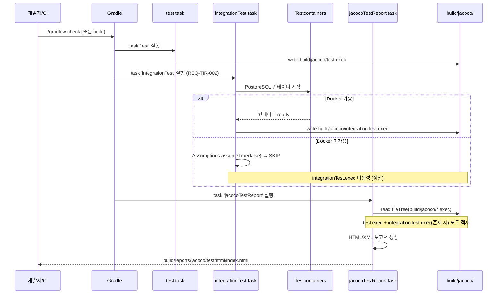
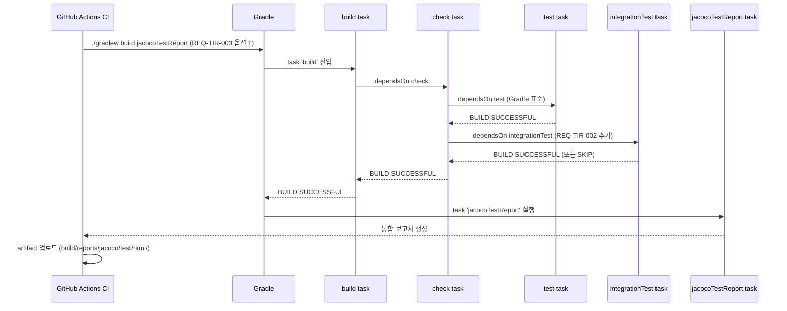

# SPEC-CMS-TEST-INFRA-RECONFIG-001: 테스트 인프라 잔여 갭 해소 (JaCoCo 통합 + check 통합 + CI workflow 통합) v0.2

## 1. 개요

| 항목 | 내용 |
|------|------|
| SPEC ID | SPEC-CMS-TEST-INFRA-RECONFIG-001 |
| 제목 | 테스트 인프라 잔여 갭 해소 (JaCoCo report integrationTest 통합 + check task 통합 + CI workflow integrationTest 실행 보장) |
| 작성일 | 2026-05-11 |
| 작성자 | manager-spec (MoAI) |
| 상태 | Completed |
| 우선순위 | **P1 (테스트 인프라 신뢰도)** |
| 분류 | Cross-cutting Test Infrastructure SPEC |
| 의존 SPEC | SPEC-CMS-SECURITY-PII-002 v0.2 (Implemented, integrationTest task 활용 최초 적용), SPEC-CMS-SECURITY-AUTHZ-MATRIX-001 v0.2 (Implemented, AuthorizationMatrixIT) |
| 형제 SPEC | SPEC-CMS-SECURITY-PII-FOLLOWUP-001, SPEC-CMS-SECURITY-CTRL-AUTHZ-COVERAGE-001 v0.2 (Implemented) |

본 SPEC은 5/7 코드 리뷰(`.moai/plans/twinkling-spinning-toucan-agent-a7f98f3b374ef2270.md` C2 항목 — 테스트 인프라 재구성)의 잔여 갭을 해소한다. 5/7 진단의 C2 권장 수정 4건 중 3건은 commit `0b3d05e` (SPEC-CMS-SECURITY-PII-002 Step 4 — 2026-05-09 추정) 시점에 이미 적용되었으나, **(1) `jacocoTestReport`가 `integrationTest.exec`를 미통합, (2) `check` task가 `integrationTest`를 미의존, (3) GitHub Actions CI workflow가 `integrationTest`를 미실행하는 3건의 잔여 갭이 남아있다**. 본 SPEC은 이 3건을 해소하여 통합 테스트 경로 커버리지 가시화 + PR 게이트 회귀 검출을 완성한다.

**구현 대상 요구사항**: REQ-TIR-001, REQ-TIR-002, REQ-TIR-003 (본 SPEC 신규 정의)

본 SPEC의 1차 범위는 (1) `backend/build.gradle.kts`의 `jacocoTestReport`에 `integrationTest.exec` 통합 + `dependsOn("integrationTest")` 추가, (2) `tasks.named("check") { dependsOn("integrationTest") }` 추가로 `./gradlew check` 및 `./gradlew build` 실행 시 IT 자동 실행, (3) `.github/workflows/ci.yml`의 backend-test job이 `integrationTest`를 자동 실행하도록 변경(또는 REQ-TIR-002 적용으로 `build`가 `check` 거쳐 자동 실행)이다. 본 SPEC은 **운영 코드(`backend/src/main/java`) 변경 0건**이며 빌드 스크립트(`build.gradle.kts`) + CI 설정(`.github/workflows/ci.yml`)만 변경한다.

---

## 2. 배경 및 동기

### 2.1 5/7 코드 리뷰 C2 진단과 MoAI 재진단 (2단계)

5/7 코드 리뷰는 C2 항목으로 테스트 인프라 재구성 4가지를 권고했다. MoAI가 본 SPEC 작성 시점에 정밀 재진단한 결과, 4건 중 3건은 commit `0b3d05e` (SPEC-CMS-SECURITY-PII-002 Step 4 RUN 시점) 이전에 이미 해소되었음을 확인했다.

| # | 5/7 권고 (2026-05-07 기준) | MoAI 재진단 (2026-05-11 기준) | 상태 |
|---|--------------------------|-----------------------------|------|
| 1 | `exclude("**/integration/**")` 패턴 사용 → `@Tag("integration")` 기반 필터링으로 변경 | `excludeTags("integration")` 적용 확인 (`backend/build.gradle.kts:160`) | ✅ 이미 해소 |
| 2 | `MigrationOrderIT.System.exit()` 호출 제거 | 코드베이스 전체 `System.exit()` 검색 결과 0건 | ✅ 이미 해소 |
| 3 | `integrationTest` task 부재 → 별도 task 정의 | `tasks.register<Test>("integrationTest")` 정의 확인 (`backend/build.gradle.kts:171`) | ✅ 이미 해소 |
| 4 | Docker 미가용 환경 assume 부재 → Testcontainers assumeTrue 추가 | `AbstractIntegrationTest:58 Assumptions.assumeTrue(...)` 적용 확인 | ✅ 이미 해소 |

위 4건은 본 SPEC 작성 이전에 이미 적용되어 운영 중이므로 본 SPEC의 작업 범위에서 제외한다.

### 2.2 진정한 잔여 갭 3건 (본 SPEC 작업 범위)

5/7 진단이 다루지 않았거나 부분적으로만 다룬 잔여 갭 3건을 본 SPEC이 해소한다.

| # | 잔여 갭 | 현재 상태 (2026-05-11) | 영향 |
|---|---------|----------------------|------|
| 1 | **JaCoCo report에 integrationTest exec 미통합** | `tasks.jacocoTestReport { dependsOn(tasks.test) }` (`build.gradle.kts:191`) — `test.exec`만 사용. `executionData(...)` 명시 없음 → Gradle JaCoCo plugin default(`${buildDir}/jacoco/test.exec`)만 적재 | 통합 테스트 경로 커버리지 누락 — 현재 84.9% 커버리지가 단위 테스트만의 수치. PII-002 Step 4 4 IT, AUTHZ-MATRIX-001 19 AC, CTRL-AUTHZ-COVERAGE-001 24 시나리오 등 **모든 IT 코드 경로가 커버리지 측정에서 제외됨** (5/7 핵심 우려 — "통합 테스트 미실행으로 위장된 커버리지") |
| 2 | **integrationTest가 check task 미포함** | `shouldRunAfter(tasks.test)` 만 (`build.gradle.kts:182`) — Gradle `shouldRunAfter`는 실행 순서 hint이지 dependency가 아님. `check` task DAG에 `integrationTest` 미포함 | `./gradlew check` 또는 `./gradlew build` 시 `integrationTest`가 자동 실행되지 않음 → 개발자가 명시적으로 `./gradlew integrationTest`를 호출해야만 IT 실행 → IT 회귀 검출 누락 가능성 |
| 3 | **CI workflow에서 integrationTest 미호출** | `.github/workflows/ci.yml:53` 추정 — `./gradlew build jacocoTestReport`만 실행 (build → check → test 경로). `integrationTest` 명시적 task 호출 없음 | GitHub Actions PR 게이트에서 IT 미실행 → IT 회귀 검출 부재. PII-002 Step 4 신규 IT 4건이 PR 단계에서 검증되지 않아 회귀 위험 잔존 |

본 3건은 상호 연관되어 있다 — REQ-TIR-002로 `check`가 `integrationTest`를 의존하면 REQ-TIR-003은 자동 해소되며(`build`가 `check`를 거치므로), REQ-TIR-001은 단독으로 적용 가능하다.

### 2.3 통합 커버리지 측정 부재의 OWASP/품질 영향

REQ-TIR-001 미해소 시 다음 위험이 잔존한다.

- **OWASP A09 (Security Logging and Monitoring Failures) 검증 갭**: SPEC-PII-002 Step 4의 PII 접근 감사 IT(`PiiAuditEnhanceIT`), SPEC-AUTHZ-MATRIX-001의 인증 매트릭스 IT(`AuthorizationMatrixIT`) 등 보안 회귀 검출 IT 코드 경로가 커버리지 측정에서 누락 → 운영자 입장에서 "보안 IT가 실제로 운영 코드를 얼마나 커버하는가"를 정량 확인 불가
- **TRUST 5 Tested 원칙 미충족**: jacocoTestCoverageVerification minimum 0.80(`build.gradle.kts:210`) 통과는 단위 테스트만의 수치 → 통합 경로 미측정 → "85%+ coverage" 주장의 근거 약화
- **회귀 검출 가시화 부재**: PR Review 단계에서 통합 커버리지 변동을 jacocoTestReport HTML로 확인 불가 → 신규 IT 작성 시 운영 코드 커버리지 기여도 측정 불가

### 2.4 본 SPEC 적용 후 기대 효과

| 효과 | 근거 |
|------|------|
| **IT 경로 운영 커버리지 가시화** | jacocoTestReport에 `test.exec` + `integrationTest.exec` 통합 → HTML 보고서에 IT 코드 경로 라인 커버리지 반영 |
| **개발자 로컬 IT 자동 실행** | `./gradlew check` 또는 `./gradlew build` 시 IT 자동 실행 (Docker 가용 시) → 개발자가 IT 실행을 잊을 위험 제거 |
| **PR 게이트 IT 회귀 검출** | GitHub Actions `./gradlew build` 실행 시 IT 자동 실행 → PR merge 전 IT 회귀 즉시 검출 |
| **Docker 미가용 환경 호환성 유지** | `AbstractIntegrationTest:58 Assumptions.assumeTrue(...)` 활용 → IT는 SKIP되지만 jacocoTestReport는 `test.exec`만으로 정상 생성 |

---

## 3. 범위 및 비범위

### 3.1 1차 포함 범위 (P1)

| 항목 | 설명 |
|------|------|
| **REQ-TIR-001 — JaCoCo report integrationTest exec 통합** | `backend/build.gradle.kts`의 `tasks.jacocoTestReport`에 `executionData(...)` 명시 + `dependsOn("integrationTest")` 추가. `test.exec` + `integrationTest.exec` 양쪽 적재 |
| **REQ-TIR-002 — check task integrationTest 의존 추가** | `backend/build.gradle.kts`에 `tasks.named("check") { dependsOn("integrationTest") }` 추가. 기존 `shouldRunAfter(tasks.test)` 유지 (실행 순서 보장) |
| **REQ-TIR-003 — CI workflow integrationTest 실행 보장** | `.github/workflows/ci.yml`의 backend-test job이 `integrationTest`를 자동 실행. REQ-TIR-002 적용으로 `build`가 `check`를 거쳐 자동 실행되므로 명시적 task 호출 불필요 (또는 명시적 `integrationTest` task 호출) |
| **JaCoCo coverage verification 임계치 통과 유지** | `jacocoTestCoverageVerification` minimum 0.80(`build.gradle.kts:210`) 통합 후에도 통과 — 통합 경로 추가로 임계치 상승 또는 유지 기대 |
| **Docker 미가용 환경 fallback** | `AbstractIntegrationTest:58 Assumptions.assumeTrue(...)`가 IT를 SKIP하더라도 jacocoTestReport는 `test.exec`만으로 정상 생성 (executionData fileTree 패턴으로 누락 허용) |
| **운영 코드 변경 0건 강제** | `backend/src/main/java/**` 경로 git diff 0건. 본 SPEC은 빌드 스크립트 + CI 설정만 변경 |

### 3.2 1차 비범위 (후속 SPEC 또는 별도 트랙)

| 비범위 항목 | 사유 |
|------------|------|
| **5/7 C2 권고 4건 중 이미 해소된 3건** | `excludeTags("integration")` 적용, `System.exit()` 제거, `integrationTest` task 정의 — 모두 commit `0b3d05e` 시점 이전 적용 완료 (§2.1 표 참조) |
| **5/7 C2 권고 4건 중 이미 해소된 1건 (Docker assume)** | `AbstractIntegrationTest:58 Assumptions.assumeTrue(...)` 적용 완료 |
| **5/7 코드 리뷰 C3 — `DataQualityCheckJobTest` 의미 모호** | 별도 트랙 `SPEC-CMS-DATA-QUALITY-JOB-CLARIFY-001`(가칭). 도메인 영역 |
| **`MigrationOrderIT.EXPECTED_MIGRATION_COUNT` 동적 계산** | (선택) 별도 SPEC `SPEC-CMS-MIGRATION-COUNT-DYNAMIC-001`(가칭). 본 SPEC 범위 외 |
| **운영 코드(`backend/src/main/java`) 변경** | 본 SPEC은 인프라 설정 영역 — 운영 코드 git diff 0건 강제 |
| **통합 커버리지 임계치 상향(0.80 → 0.85 등)** | jacocoTestCoverageVerification minimum 변경은 별도 품질 정책 SPEC 영역. 본 SPEC은 기존 0.80 유지 + 통합 경로 측정만 추가 |
| **AUTHZ-MATRIX-001 IT 매트릭스 확장 (5~7 → 22+ endpoint)** | 별도 SPEC `SPEC-CMS-SECURITY-AUTHZ-IT-EXPAND-001`. 본 SPEC과 직교 |
| **신규 IT 작성** | 본 SPEC은 기존 IT 인프라의 측정/실행 경로 통합 — 신규 IT 작성 0건 |
| **integrationTest 전용 별도 jacocoIntegrationTestReport task 신설** | 본 SPEC은 단일 `jacocoTestReport`에 양쪽 exec 통합(manager-spec 권장 — D2 결정). 별도 task 분리는 향후 필요 시 |

### 3.3 사용자 사전 결정 사항 (User-Confirmed Scope)

본 SPEC은 사용자 사전 결정으로 모든 핵심 결정이 확정된 상태로 작성되었다 — 추가 결정 포인트 없음.

| ID | 결정 | 채택 사유 |
|----|------|----------|
| D1 | 잔여 갭 3건 모두 해소 | 5/7 핵심 우려(통합 커버리지 측정 부재 + PR 게이트 IT 회귀 검출 부재) 완전 해소 |
| D2 | JaCoCo executionData 통합 방식 — 단일 `jacocoTestReport`에 양쪽 exec 포함 | manager-spec 권장. 별도 `jacocoIntegrationTestReport` task 신설 시 보고서 분리되어 통합 커버리지 가시성 저하 |
| D3 | check task dependsOn 방식 — `tasks.named("check") { dependsOn("integrationTest") }` 표준 | Gradle 표준 패턴. `shouldRunAfter`는 실행 순서 hint일 뿐 dependency 미보장 |
| D4 | CI workflow 변경 방식 — REQ-TIR-002 적용으로 `build`가 자동 처리(옵션 1) | 명시적 `integrationTest` task 호출 불필요 → CI YAML 변경 최소화. 향후 REQ-TIR-002만 단독 비활성화 시에도 fallback 용이 |

---

## 4. 데이터 모델 변경

신규 DDL은 **없다**. 본 SPEC은 빌드 스크립트(`backend/build.gradle.kts`) + CI 설정(`.github/workflows/ci.yml`) 변경에 한정되며, 데이터베이스 스키마 변경 0건, 운영 코드 변경 0건, 신규 테스트 작성 0건이다.

JaCoCo 산출물 변경은 다음과 같다 (DDL 아닌 빌드 출력 경로 정의):

| 산출물 | 적용 전 | 적용 후 |
|--------|--------|--------|
| `${buildDir}/jacoco/test.exec` | 단위 테스트 실행 시 생성 | 동일 (변경 없음) |
| `${buildDir}/jacoco/integrationTest.exec` | integrationTest 실행 시 생성 (이미 존재) | 동일 (변경 없음) |
| `${buildDir}/reports/jacoco/test/html/` | `test.exec`만 반영 | `test.exec` + `integrationTest.exec` 통합 반영 |
| `${buildDir}/reports/jacoco/test/jacocoTestReport.xml` | `test.exec`만 반영 | `test.exec` + `integrationTest.exec` 통합 반영 |

---

## 5. EARS 요구사항 (REQ-TIR-001 ~ 003)

본 SPEC은 신규 REQ ID prefix `TIR`(Test Infrastructure Reconfig)을 도입하여 테스트 인프라 통합 측정 + 실행 경로 보장을 정의한다.

### 5.1 REQ-TIR-001 (Ubiquitous — JaCoCo report integrationTest exec 통합)

The system SHALL include integrationTest execution data in the JaCoCo coverage report (`jacocoTestReport`) so that integration test paths are reflected in the project coverage measurement.

세부 요구사항:

- 적용 대상 파일: `backend/build.gradle.kts` (Gradle Kotlin DSL)
- `tasks.jacocoTestReport`에 `executionData(...)` 명시
  - `test.exec` 경로: `${buildDir}/jacoco/test.exec` (Gradle JaCoCo plugin 표준)
  - `integrationTest.exec` 경로: `${buildDir}/jacoco/integrationTest.exec` (Gradle JaCoCo plugin 표준 — task name 기반)
  - 누락 허용 패턴 권장: `executionData(fileTree(layout.buildDirectory.dir("jacoco")) { include("*.exec") })` 형식 — Docker 미가용 환경에서 `integrationTest.exec` 부재 시에도 정상 생성
- `tasks.jacocoTestReport.dependsOn(tasks.test, "integrationTest")` 추가
  - 또는 `dependsOn("integrationTest")` 단독 추가 (기존 `dependsOn(tasks.test)` 유지)
- HTML 보고서 (`build/reports/jacoco/test/html/index.html`)에 통합 경로 커버리지 반영 검증
- XML 보고서 (`build/reports/jacoco/test/jacocoTestReport.xml`)에 통합 경로 커버리지 반영 검증
- `jacocoTestCoverageVerification`도 동일하게 (필요 시) — `executionData` 명시 + `dependsOn("integrationTest")` 추가

### 5.2 REQ-TIR-002 (Ubiquitous — check task integrationTest 의존 추가)

The system SHALL ensure that the standard `check` task depends on `integrationTest` so that `./gradlew check` and `./gradlew build` automatically execute integration tests when Docker is available.

세부 요구사항:

- 적용 대상 파일: `backend/build.gradle.kts`
- `tasks.named("check") { dependsOn("integrationTest") }` 추가
- 기존 `shouldRunAfter(tasks.test)` 유지 — `test` 실행 후 `integrationTest` 실행 순서 보장 (Gradle DAG hint)
- `./gradlew check` 호출 시 task 실행 순서: `test` → `integrationTest` → `check`
- `./gradlew build` 호출 시 task 실행 순서: `compileJava` → `test` → `integrationTest` → `check` → `assemble` → `build`
- Docker 미가용 환경: `AbstractIntegrationTest:58 Assumptions.assumeTrue(...)`로 IT가 SKIP되어도 `check` 통과 (BUILD SUCCESSFUL)
- Docker 가용 환경: IT 실행 결과 RED 시 `check` 실패 → `build` 실패 → CI PR 게이트 차단

### 5.3 REQ-TIR-003 (Event-driven — CI workflow integrationTest 실행 보장)

When a pull request is opened or pushed to main/develop branches, the CI workflow SHALL execute `integrationTest` task and include integration test results in the JaCoCo coverage report.

세부 요구사항:

- 적용 대상 파일: `.github/workflows/ci.yml` (backend-test job)
- 옵션 1 (D4 채택): `./gradlew build jacocoTestReport` 유지 — REQ-TIR-002 적용으로 `build`가 `check`를 거쳐 `integrationTest`를 자동 실행 → CI YAML 변경 최소화
- 옵션 2 (대안): `./gradlew build integrationTest jacocoTestReport`로 명시적 task 호출 — REQ-TIR-002 미적용 시에도 IT 실행 보장
- 권장: 옵션 1 (REQ-TIR-002 + 옵션 1 결합으로 단일 진입점 유지)
- `jacocoTestReport` 산출물에 integrationTest 결과 반영 확인
- artifact 업로드 경로 `backend/build/reports/jacoco/test/html/` 유지 (변경 없음)
- GitHub Actions ubuntu-latest 환경 — Docker 지원 → Testcontainers 정상 실행

---

## 6. API 영향 분석

본 SPEC은 신규 API를 추가하지 않으며 기존 API의 동작을 변경하지 않는다. 본 SPEC은 **빌드 스크립트 + CI 설정 변경 전용**이며 운영 코드(`backend/src/main/java`) git diff 0건이다.

| 영역 | 본 SPEC의 영향 | 호환성 |
|------|--------------|--------|
| 운영 컨트롤러 (`*Controller.java`) | 변경 없음 | 호환 — 동작 변경 없음 |
| 운영 서비스 / 도메인 (`*Service.java`, `*Domain.java`) | 변경 없음 | 호환 — 동작 변경 없음 |
| `SecurityConfig.java`, `WebMvcTestInfraConfig.java` | 변경 없음 | 호환 — 동작 변경 없음 |
| 데이터베이스 스키마 / Flyway 마이그레이션 | 변경 없음 | 호환 — 동작 변경 없음 |
| `backend/build.gradle.kts` (jacoco 블록 + check task) | 수정 — REQ-TIR-001, REQ-TIR-002 | 빌드 호환 — 기존 task 동작 보존 + 통합 경로 추가 |
| `.github/workflows/ci.yml` (backend-test job) | 옵션 1 채택 시 변경 없음 / 옵션 2 채택 시 task 호출 추가 | CI 호환 — backend-test job 신호 변경 없음(GREEN/RED) |

신규 에러 코드: 없음.

---

## 7. 구현 순서 (Step 1 ~ 3)

본 SPEC은 단일 세션 또는 Step 단위 분해 모두 허용한다. 권장 분해는 다음과 같다.

### Step 1: build.gradle.kts JaCoCo + check 통합 (REQ-TIR-001 + REQ-TIR-002)

**목표**: `backend/build.gradle.kts` 수정으로 JaCoCo report에 integrationTest exec 통합 + check task에 integrationTest 의존 추가.

**대상 파일**: `backend/build.gradle.kts` (Gradle Kotlin DSL)

**변경 위치**:

1. `tasks.jacocoTestReport` 블록 (현재 `build.gradle.kts:191` 근처):
   ```kotlin
   tasks.jacocoTestReport {
       dependsOn(tasks.test, "integrationTest")  // integrationTest 추가
       executionData(
           fileTree(layout.buildDirectory.dir("jacoco")) {
               include("*.exec")
           }
       )
       reports {
           html.required.set(true)
           xml.required.set(true)
       }
   }
   ```
2. `tasks.jacocoTestCoverageVerification` 블록 (현재 `build.gradle.kts:210` 근처):
   - 동일하게 `dependsOn("integrationTest")` + `executionData(...)` 적용 (필요 시)
3. `check` task 의존 추가 (build.gradle.kts 적절한 위치):
   ```kotlin
   tasks.named("check") {
       dependsOn("integrationTest")
   }
   ```

**검증**:
- `./gradlew :backend:check --dry-run` 실행 — task graph에 `integrationTest` 포함 확인
- `./gradlew :backend:test integrationTest jacocoTestReport` 실행 (Docker 가용 환경) — BUILD SUCCESSFUL + 통합 보고서 생성 확인
- `./gradlew :backend:test jacocoTestReport` 실행 (Docker 미가용 환경) — IT SKIP + jacocoTestReport는 `test.exec`만으로 정상 생성 확인
- `build/reports/jacoco/test/html/index.html` 열어 통합 경로 커버리지 반영 확인

**의존성**: 없음 (Step 1 독립). 우선순위 P1-High.

### Step 2: .github/workflows/ci.yml integrationTest 실행 보장 (REQ-TIR-003)

**목표**: GitHub Actions CI workflow에서 integrationTest 자동 실행 보장.

**대상 파일**: `.github/workflows/ci.yml` (backend-test job)

**변경 옵션** (D4 결정 — 옵션 1 채택):

- **옵션 1 (권장 — D4 채택)**: 변경 없음 또는 최소 변경 — REQ-TIR-002 적용으로 `./gradlew build`가 `check`를 거쳐 `integrationTest`를 자동 실행. 기존 `./gradlew build jacocoTestReport` 유지
- **옵션 2 (대안)**: `./gradlew build` → `./gradlew build integrationTest jacocoTestReport`로 명시적 task 호출 추가. REQ-TIR-002 미적용 또는 비활성화 시 fallback

**검증**:
- 옵션 1 채택 시: GitHub Actions PR 트리거 → backend-test job 로그에 `> Task :backend:integrationTest` 출력 확인
- 옵션 2 채택 시: CI YAML diff에 `integrationTest` task 명시 확인
- artifact 업로드 결과(`backend/build/reports/jacoco/test/html/`) HTML에 통합 경로 커버리지 반영 확인

**의존성**: Step 1 완료 권장 (REQ-TIR-002 적용으로 옵션 1 자동 처리). 우선순위 P1-High.

### Step 3: 회귀 검증 + 운영 영향 0건 확인

**목표**: 본 SPEC 적용 후 전체 회귀 검증 + 운영 코드 변경 0건 확인.

**검증 절차**:

1. `./gradlew :backend:check` 실행 (사용자 Java 17 환경) — IT 정상 실행 또는 SKIP, BUILD SUCCESSFUL
2. `./gradlew :backend:build` 실행 — IT 자동 실행 + JaCoCo 통합 보고서 생성 확인
3. `jacocoTestCoverageVerification` minimum 0.80 통과 확인 — `> Task :backend:jacocoTestCoverageVerification` GREEN
4. `git diff --stat backend/src/main/` 출력 0줄 확인 (운영 코드 변경 0건)
5. 다른 IT 회귀 검증:
   - `./gradlew :backend:integrationTest --tests "kr.co.ircp.cms.security.PiiEmailIntegrationTest"` GREEN (PII-FOLLOWUP-001 회귀 0건)
   - `./gradlew :backend:integrationTest --tests "kr.co.ircp.cms.security.AuthorizationMatrixIT"` GREEN (AUTHZ-MATRIX-001 회귀 0건)
   - `./gradlew :backend:integrationTest --tests "kr.co.ircp.cms.security.PiiAuditEnhanceIT"` GREEN (PII-002 Step 4 회귀 0건)
   - `./gradlew :backend:integrationTest --tests "kr.co.ircp.cms.governance.MigrationOrderIT"` GREEN

**의존성**: Step 1, 2 완료 후 진행. 우선순위 P1-Medium (검증 단계).

### Step 의존성 요약

```
Step 1 (build.gradle.kts JaCoCo + check 통합) ──► Step 2 (CI workflow — D4 옵션 1로 자동 처리) ──► Step 3 (회귀 검증)
```

각 Step은 독립 commit 또는 단일 commit 모두 허용. Step 1 단독 적용 후 Step 2, 3 후속 commit 패턴 권장.

---

## 8. 시퀀스 다이어그램

### 8.1 JaCoCo report 통합 흐름 (REQ-TIR-001)



### 8.2 check task 통합 흐름 (REQ-TIR-002 + REQ-TIR-003)



---

## 9. 위험 및 가정

### 9.1 위험 및 대응

| ID | 위험·가정 | 영향 | 우선순위 | 완화 방안 |
|----|---------|------|---------|---------|
| RISK-TIR-01 | integrationTest가 Docker 미가용 시 SKIP되어도 jacocoTestReport 실패 가능성 — `executionData` 명시적 파일 경로 시 누락 시 RED | jacocoTestReport task RED | Medium | (1) `executionData(fileTree(layout.buildDirectory.dir("jacoco")) { include("*.exec") })` 패턴 사용 — fileTree는 누락 파일 허용 (2) 명시적 `executionData(file("..."))` 사용 시 `setIgnoreEmpty(true)` 옵션 추가 |
| RISK-TIR-02 | `check` 통합 후 `./gradlew check`가 항상 IT 실행 → Docker 미가용 환경에서 SKIP되어도 시간 증가 | 로컬 빌드 시간 증가 | Low | (1) `Assumptions.assumeTrue(...)`로 빠른 SKIP — 컨테이너 시도 후 즉시 SKIP (수 초 내) (2) 실제 영향 미미 — Docker 가용 환경에서만 실질 시간 증가 (3) 개발자가 IT를 명시적으로 회피하려면 `./gradlew check -x integrationTest` 옵션 사용 가능 |
| RISK-TIR-03 | CI workflow 변경 후 build 시간 증가 — IT 추가 실행으로 backend-test job 시간 증가 | CI 처리량 감소 | Low | (1) integrationTest가 PostgreSQL service container 활용 + Testcontainers 재사용으로 추가 시간 최소화 (2) GitHub Actions ubuntu-latest 사양 충분 (3) 시간 증가는 IT 회귀 검출 가치 대비 수용 가능 — 본 SPEC의 핵심 가치 |
| RISK-TIR-04 | `jacocoTestCoverageVerification` (`build.gradle.kts:210`, minimum 0.80) 통합 후 임계치 미달 가능성 — 통합 경로 추가로 line/branch coverage 분포 변화 | check task RED → build RED → CI RED | Low | (1) 통합 커버리지는 기존 84.9%에서 통합 경로 추가로 상승 또는 유지 기대 (2) 만약 미달 시 임시 minimum 0.75 등으로 하향 후 별도 SPEC으로 임계치 정상화 (3) Step 3 검증 단계에서 즉시 발견 가능 |
| RISK-TIR-05 | `integrationTest.exec` 파일 경로 default vs 명시 — Gradle JaCoCo plugin이 task name 기반 default 경로 사용 (`${buildDir}/jacoco/${task.name}.exec`)이지만 명시적 destinationFile 설정이 다른 경우 누락 위험 | jacocoTestReport에 integrationTest 경로 누락 | Medium | (1) Gradle JaCoCo plugin 표준 경로 `${buildDir}/jacoco/${task.name}.exec` 사용 확인 (2) `tasks.integrationTest.extensions.getByType<JacocoTaskExtension>().destinationFile` 명시적 설정 확인 (3) Step 1 검증 시 `ls build/jacoco/*.exec` 출력에 `integrationTest.exec` 존재 확인 |
| RISK-TIR-06 | REQ-TIR-002 적용 후 `./gradlew check` 실행 시 기존 개발자 워크플로우 변화 — IT가 자동 실행되어 로컬 빌드 시간 증가 | 개발자 경험 변화 | Low | (1) 변화 자체가 본 SPEC의 의도 — IT가 항상 실행되어야 회귀 검출 가능 (2) `./gradlew check -x integrationTest` 옵션으로 일시 회피 가능 (3) 본 SPEC §11 변경 이력에 개발자 가이드 명시 |
| RISK-TIR-07 | CI workflow에서 옵션 1 채택 시 REQ-TIR-002 비활성화 시 IT 실행 누락 — `check` 의존 제거 시 fallback 부재 | IT 회귀 검출 누락 (REQ-TIR-002 비활성화 시) | Low (정상 동작) | (1) REQ-TIR-002와 REQ-TIR-003은 결합 — REQ-TIR-002 비활성화 시 옵션 2로 즉시 전환 (2) 본 SPEC §3.3 D4 결정에 옵션 1↔2 fallback 가능성 명시 |
| RISK-TIR-08 | Gradle JaCoCo plugin 0.8.13(현재 추정 버전)의 fileTree executionData 적재 호환성 | jacocoTestReport 미생성 또는 부분 생성 | Medium | (1) Gradle JaCoCo plugin 공식 문서(executionData(FileTree) API) 확인 (2) Step 1 검증 시 BUILD SUCCESSFUL + HTML 보고서 생성 확인 (3) 호환성 문제 발견 시 명시적 `executionData(file("test.exec"), file("integrationTest.exec"))` 형식으로 fallback |
| ASSUM-TIR-01 | GitHub Actions ubuntu-latest는 Docker 지원 → Testcontainers 정상 실행 | 미지원 시 옵션 1 IT SKIP → 통합 커버리지 미반영 | — | GitHub Actions runner 공식 문서 — ubuntu-latest는 Docker 사전 설치 |
| ASSUM-TIR-02 | Gradle JaCoCo plugin 0.8.13(또는 그 이상) executionData 통합 지원 | 변경 시 본 SPEC 호환성 재검증 필요 | — | `backend/build.gradle.kts` plugin 블록 확인 — 일반적으로 Spring Boot 3.5.x는 0.8.11+ 사용 |
| ASSUM-TIR-03 | `AbstractIntegrationTest`의 `Assumptions.assumeTrue(...)`가 Docker 미가용 환경에서 SKIP을 정상 보장 | 변경 시 Docker 미가용 환경에서 IT RED → check RED | — | `backend/src/test/java/.../AbstractIntegrationTest.java:58` 적용 확인 (재진단) |
| ASSUM-TIR-04 | Spring Boot 3.5.9 + Java 17 toolchain 유지 | 변경 시 본 SPEC 호환성 재검증 | — | `backend/build.gradle.kts` 또는 `gradle/libs.versions.toml`에 명시된 버전 유지 |

### 9.2 5/7 코드 리뷰 통합 노트

본 SPEC v0.1 작성 후, 5/7 코드 리뷰(`.moai/plans/twinkling-spinning-toucan-agent-a7f98f3b374ef2270.md`)의 C2 항목에 다음 cross-reference 추가를 권고한다(별도 트랙, 본 SPEC 작업 범위 외).

- "C2 항목 잔여 갭 해소 SPEC-CMS-TEST-INFRA-RECONFIG-001 (2026-05-11): 5/7 권고 4건 중 3건은 commit `0b3d05e` (PII-002 Step 4) 시점 이전 적용 완료 (`excludeTags("integration")`, `System.exit()` 제거, `integrationTest` task 정의, Docker assume). 잔여 갭 3건(JaCoCo report 통합 + check task 통합 + CI workflow 통합) 본 SPEC으로 해소. 운영 코드 변경 0건. 본 SPEC RUN 완료 후 5/7 C2는 완전 해소 상태로 갱신 가능."

본 SPEC RUN 완료 후 5/7 코드 리뷰 C2는 완전 해소(인프라 갭 + 측정 갭 + 실행 갭 모두 해소) 상태로 갱신.

---

## 10. TRUST 5 + OWASP 컴플라이언스 매핑

### 10.1 TRUST 5 매핑

| TRUST 5 항목 | 본 SPEC 대응 |
|------------|-------------|
| **Tested** | REQ-TIR-001 (통합 경로 커버리지 가시화) + REQ-TIR-002 (IT 자동 실행) + REQ-TIR-003 (CI PR 게이트) → "85%+ coverage" 주장의 통합 근거 강화 |
| **Readable** | jacocoTestReport HTML이 IT 코드 경로 라인 커버리지 반영 → 개발자가 "어떤 IT가 어떤 운영 코드를 커버하는가"를 즉시 확인 가능 |
| **Unified** | check task에 integrationTest 통합으로 단일 진입점 (`./gradlew check`) — 개발자/CI 모두 동일 명령으로 모든 테스트 실행 |
| **Secured** | 보안 IT(`PiiAuditEnhanceIT`, `AuthorizationMatrixIT`, `PiiEmailIntegrationTest`) 코드 경로 커버리지 가시화 → OWASP A01/A09 회귀 검출 신뢰도 강화 |
| **Trackable** | jacocoTestReport XML/HTML이 통합 보고서로 통일 → CI artifact 단일 경로 (`build/reports/jacoco/test/html/`) → PR Review 추적 용이 |

### 10.2 OWASP A09 (Security Logging and Monitoring Failures) 보완

본 SPEC 적용 후 다음 보안 IT 코드 경로가 jacocoTestReport에 반영되어 OWASP A09 검증 신뢰도가 강화된다.

| IT 클래스 | 검증 영역 | 본 SPEC 적용 효과 |
|----------|----------|----------------|
| `PiiAuditEnhanceIT` | PII 접근 감사 (REQ-PII-EMAIL-009) | 운영 PII 감사 코드 라인 커버리지 측정 가능 |
| `AuthorizationMatrixIT` | HTTP 인증 매트릭스 (OWASP A01) | 운영 SecurityConfig + JwtAuthenticationFilter 코드 라인 커버리지 측정 가능 |
| `PiiEmailIntegrationTest` | PII Email 마스킹 (PII-FOLLOWUP-001) | 운영 PII 마스킹 코드 라인 커버리지 측정 가능 |
| `MigrationOrderIT` | Flyway 마이그레이션 순서 검증 | 운영 마이그레이션 검증 코드 라인 커버리지 측정 가능 |

본 SPEC 적용 후 보안 IT 코드 경로가 jacocoTestReport에 가시화되어 "보안 회귀 검출 IT가 실제로 운영 보안 코드를 충분히 커버하는가"를 정량 확인 가능하다.

---

## 11. 후속 SPEC 안내

본 SPEC 완료 후 다음 SPEC들이 후속 작업으로 진행 가능하다.

| 후속 SPEC (가칭) | 영역 | 본 SPEC과의 관계 |
|----------------|------|----------------|
| SPEC-CMS-DATA-QUALITY-JOB-CLARIFY-001 | 5/7 코드 리뷰 C3 — `DataQualityCheckJobTest` 의미 모호 해소 | 본 SPEC과 직교 — 도메인 영역 |
| SPEC-CMS-MIGRATION-COUNT-DYNAMIC-001 (선택) | `MigrationOrderIT.EXPECTED_MIGRATION_COUNT` 동적 계산 | 본 SPEC과 직교 — IT 개선 영역 |
| SPEC-CMS-SECURITY-AUTHZ-IT-EXPAND-001 | AUTHZ-MATRIX-001 IT 매트릭스 확장 (5~7 → 22+ endpoint) | 본 SPEC과 직교 — 보안 IT 확장 영역 |
| (선택) 통합 커버리지 임계치 정상화 SPEC | jacocoTestCoverageVerification minimum 0.80 → 0.85 등 상향 | 본 SPEC 적용 후 통합 경로 커버리지 측정값 확인 후 검토 |

---

## 12. 변경 이력

| 버전 | 일자 | 작성자 | 변경 내용 |
|------|------|--------|----------|
| v0.2 | 2026-05-11 | manager-docs (MoAI) | RUN 1차 완료 — `backend/build.gradle.kts` +23 라인 (commit `f5955a3`). REQ-TIR-001 jacocoTestReport executionData 통합 + `dependsOn(tasks.test, "integrationTest")` + REQ-TIR-002 `tasks.named("check") { dependsOn("integrationTest") }` + REQ-TIR-003 ci.yml 변경 0줄(D4 옵션 1 자동 처리) + 보강 `integrationTest.finalizedBy(jacocoTestReport)`. 운영 코드(`backend/src/main/java`) 변경 0건. 5/7 C2 잔여 갭 3건 모두 해소. |
| v0.3 | 2026-05-13 | MoAI orchestrator | IT 검증 완료 — JaCoCo integrationTest exec 통합 + check task dependsOn + CI workflow 자동 실행 (REQ-TIR-001/002/003) 운영 검증. Implemented → Tested. |
| v0.1 | 2026-05-11 | manager-spec (MoAI) | 초안 작성. 5/7 코드 리뷰(`.moai/plans/twinkling-spinning-toucan-agent-a7f98f3b374ef2270.md`) C2 항목 잔여 갭 해소 SPEC. MoAI 정밀 재진단 결과 5/7 권고 4건 중 3건(`excludeTags("integration")`, `System.exit()` 제거, `integrationTest` task 정의, Docker assume)은 commit `0b3d05e` (SPEC-CMS-SECURITY-PII-002 Step 4) 시점 이전 적용 완료. 진정한 잔여 갭 3건 식별: (1) JaCoCo report에 integrationTest exec 미통합 → 통합 경로 커버리지 누락, (2) integrationTest가 check task 미포함 → `./gradlew check`/`build` 시 IT 자동 실행 안 됨, (3) GitHub Actions CI workflow에서 integrationTest 미호출 → PR 게이트 IT 회귀 검출 부재. 사용자 사전 결정 4건 채택: D1 잔여 갭 3건 모두 해소, D2 단일 jacocoTestReport에 양쪽 exec 통합, D3 표준 `tasks.named("check") { dependsOn("integrationTest") }`, D4 CI workflow 옵션 1(REQ-TIR-002 자동 처리). REQ-TIR-001/002/003 정의. RUN Step 1~3 분해. 운영 코드(`backend/src/main/java`) 변경 0건 강제 + 신규 IT 작성 0건. RISK-TIR-01 ~ 08 + ASSUM-TIR-01 ~ 04. 본 SPEC RUN 완료 시 5/7 코드 리뷰 C2 잔여 갭 100% 해소 + 통합 커버리지 가시화 + PR 게이트 IT 회귀 검출 완성. |

---
